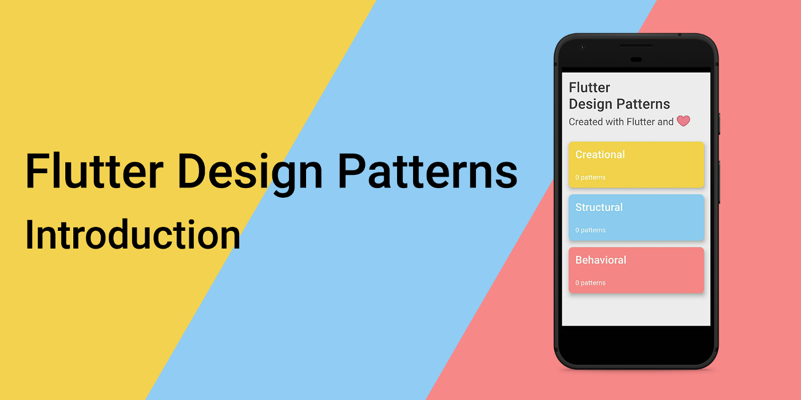
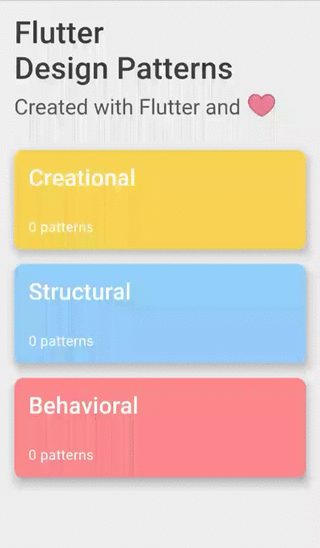
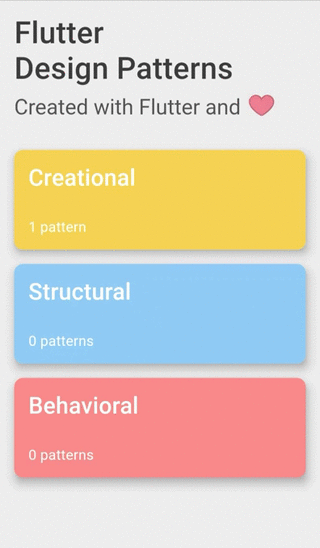
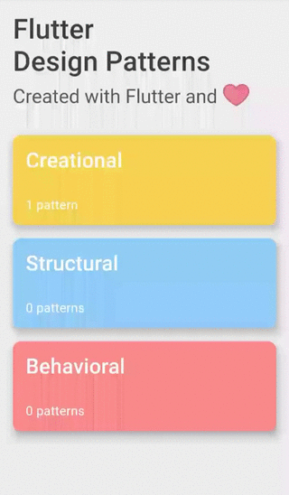

_Introduction to a series of articles about OOP design patterns and their implementation in Dart and Flutter_



Hi, I am Mangirdas, a software engineer and Flutter enthusiast from Lithuania. I have been following the Flutter journey since its version of 0.10.2 but realized that I have not contributed to the Flutter community, yet. So I am more than intrigued to introduce a new article series — Flutter Design Patterns. In the series, I will do my best to describe OOP design patterns, their implementation in Dart programming language and appliance when developing applications using Flutter.

<!--truncate-->

:::tip
To see all the design patterns in action, check the [Flutter Design Patterns application](https://flutterdesignpatterns.com/).
:::

## About the series

In each article of the series, I will overview a design pattern, implement it using Dart programming language, prepare a practical (if possible) example in Flutter and add it to the **Flutter Design Patterns** application. The theoretical part about design patterns would be heavily based on the “Gang of Four” (GoF) book [“Design Patterns: Elements of Reusable Object-Oriented Software”](https://en.wikipedia.org/wiki/Design_Patterns), which, in my opinion, is one of the most iconic software engineering books about software design patterns. This book contains 23 different OOP design patterns, meaning - 23 articles in the series!

## OOP, Design Patterns…???


Hmm, ok, maybe I have jumped straight to the point but did not explain what is this series about…

### What is OOP?

OOP stands for “Object-Oriented Programming”. In simple words, it is a programming paradigm that uses the idea of **objects** to represent **data** and **methods** to manipulate that data. This idea lets software engineers write code that represents the real-world objects, the data they contain and their relations with other objects via corresponding code structures. If you have already written some code using Dart or any other OOP programming language (C#, C++, Java just to name a few), probably you saw and used classes, defined properties and/or methods inside of those classes, created class instances and operated with them, specified relations between different objects/classes — that’s nothing less than Object-Oriented programming!

### What is OOP Design Pattern?

OOP design pattern is a typical solution to a common problem in software design. In the GoF book, the purpose of a design pattern is described like this:

> _A design pattern names, abstracts, and identifies the key aspects of a common design structure that make it useful for creating a reusable object-oriented design._

A software design pattern is not about solving specific UI/UX problems (as it could look from first sight by noticing the word design), it is more about the code structure which is like a blueprint to solve a particular object-oriented design problem, or issue in your code. By applying these patterns, you can speed up the development process, write code that is more flexible, reusable. However, the most difficult part of these patterns is to understand the main idea behind them, to identify places in your code where these patterns could be applied and which problems could be resolved. But that’s what this series is all about — to introduce and provide the basics of several design patterns to help you choose the right one for your specific problem.

## Application overview

As I have already mentioned, by introducing a new design pattern per article, I will also build a **Flutter Design Patterns** Flutter application and expand its design patterns library step-by-step. Of course, this application is open-source and its code is already available on [GitHub](https://github.com/mkobuolys/flutter-design-patterns) for all of you! The application consists only of three different screens — the main menu, design patterns’ category screen and design pattern’s screen.



I hope you have noticed a little heartbeat animation in the main menu, as well as page transitions and content animations, which provide some dynamic to the application (I have spent a few hours implementing them, so, _please, notice me senpai_).



To demonstrate how the application displays design patterns, I have created a new branch in the [repository](https://github.com/mkobuolys/flutter-design-patterns/tree/0-introduction). I will not merge it to the main branch later (it is only for demonstration purposes), but by using these [changes](https://github.com/mkobuolys/flutter-design-patterns/commit/3320e126d1e78730267a1f7709c3cb50e8c8e8ab) I will explain how a new design pattern could be (and will be!) added to the application.

First of all, a new data object should be added to the `assets/data/design_patterns.json` containing information about the design pattern (id, title, description and route):

```json title="design_patterns.json"
...
{
  "id": "introduction",
  "title": "Introduction",
  "description": "Laborum qui ea velit sint officia culpa aute ad sint fugiat excepteur ex pariatur consectetur.",
  "route": "/introduction"
}
...
```

Then a markdown file must be added to the `assets/markdown` folder with the same name as the previously set id in the design pattern’s JSON. This markdown would contain information about the design pattern — usually, code snippets with some explanation on how the pattern is implemented. After providing a markdown file, the design pattern should be implemented and its example widget for the design pattern’s screen should be prepared. For this example, I have created a simple _Hello World_ widget (`introduction.dart`):

```dart title="introduction.dart"
class Introduction extends StatelessWidget {
  @override
  Widget build(BuildContext context) {
    return Center(
      child: Text('Hello world!'),
    );
  }
}
```

Finally, a new route should be added to the `router.dart` file by adding the route name to the `DesignPatternRoutes` class (it should match with the route value in the design pattern’s JSON file) and adding a new `DesignPatternDetails` widget with a previously created example:

```dart title="router.dart" {15-22}
class Router {
  static Route<dynamic> generateRoute(RouteSettings settings) {
    switch (settings.name) {
      case initialRoute:
        return MaterialPageRoute(
          builder: (_) => MainMenu(),
        );
      case categoryRoute:
        var category = settings.arguments as DesignPatternCategory;
        return MaterialPageRoute(
          builder: (_) => Category(
            category: category,
          ),
        );
      case _DesignPatternRoutes.introductionRoute:
        var designPattern = settings.arguments as DesignPattern;
        return MaterialPageRoute(
          builder: (_) => DesignPatternDetails(
            designPattern: designPattern,
            example: Introduction(),
          ),
        );
      default:
        return MaterialPageRoute(
          builder: (_) => MainMenu(),
        );
    }
  }
}

class _DesignPatternRoutes {
  static const String introductionRoute = '/introduction';
}
```

That’s all! After these steps, a new design pattern is available in the **Flutter Design Patterns** library:



If I have missed something, do not hesitate to ask or just check the code by yourself, it is open and free for use!

## Summary

I hope this article encouraged you to learn more about OOP, design patterns or programming in general. New articles are on their way so stay tuned and happy coding!
