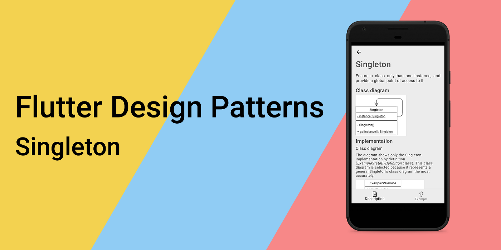
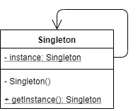
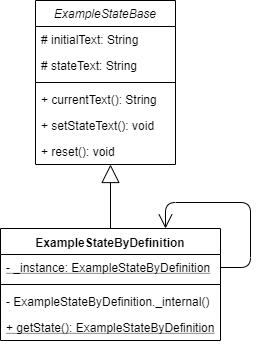
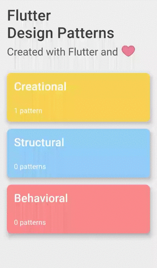
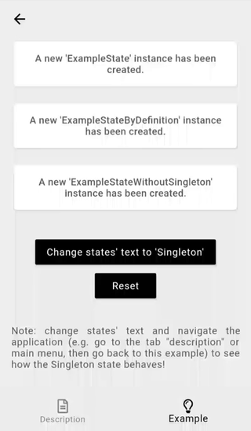

_An overview of the Singleton design pattern and its implementation in Dart and Flutter_



First of all, I would like to thank you all for the support after publishing the [introduction article](../2019-10-08-flutter-design-patterns-0-introduction/index.md) to this series. Honestly, I have not expected that amount of people to not only be interested in the creation of mobile applications using Flutter but who are also willing to learn more about the Dart language itself, OOP design patterns and their appliance, code architecture or software engineering in general. This encouraged me to dive straight into the research, coding, and hence, I present to you the first design pattern in the series — Singleton.

<!--truncate-->

:::tip
To see all the design patterns in action, check the [Flutter Design Patterns application](https://flutterdesignpatterns.com/).
:::

## What is Singleton?

**Singleton** is a **creational** design pattern that ensures that a class has only one instance and also provides a global point of access to it. The motivation for this pattern is stated in the [GoF book](https://en.wikipedia.org/wiki/Design_Patterns):

> _It’s important for some classes to have exactly one instance. Although there can be many printers in a system, there should be only one printer spooler. There should be only one file system and one window manager…_

The main idea of this pattern is to make a class itself responsible for keeping track of its sole instance. Singleton is considered one of the simplest design patterns but it is also an easy one to get wrong if you are not careful. So let’s move to the analysis and clarify the details of Singleton and its implementation.

## Analysis

To begin with, I must mention that in the series you will find several UML class diagrams in each article. If you are not familiar with class diagrams and their notation, I strongly recommend you to read this [reference](https://www.uml-diagrams.org/class-reference.html).

### Class diagram and basic structure

A general approach to the implementation of Singleton is represented in the class diagram below:



- _Singleton_ class contains the **static** property _instance_ which is a reference to the class instance itself (this relationship is represented as an association link from the class _Singleton_ to itself);
- This instance is only accessible through the **static** method `getInstance()`;
- Class constructor is marked as **private** (it could be protected in other implementations) to ensure that the class could not be instantiated from outside the class.

### Applicability

Singleton could be used in cases where creating the instance of a class is expensive e.g. instantiating a class requires loading a lot of data from external sources. Also, the pattern helps when you need to access the same object over and over again across your code e.g. logger (this problem is usually resolved by applying another design pattern — dependency injection, but that’s a topic for the future 😊). Singleton could also be used when some kind of caching layer is needed — the singleton class could check and manage the cache on the instance request.

### General thoughts and dangers

- When designing a Singleton, lazy construction should be considered — class instance should only be created when it is first needed;
- In general, the Singleton class should not require parameters for its construction. If your class design requires a parameter, it could lead to the creation of a somehow different object based on that parameter — could this class still be called a Singleton, then? Some resources state that this is a valid approach, but I have a different opinion;
- Thread safety — you should be aware of Singletons in multi-threaded applications. If they hold some kind of mutable data, it could lead to unexpected results, so the synchronization mechanism should be considered. Since we are talking about the Dart programming language in this series, you should know that Dart is a single-threaded programming language and its code runs in a little isolated space on the machine, called isolate. Hence, you should not worry about the thread-safety when implementing Singletons in Dart as long as you do not create a new separate isolate from the code by yourself. If you are not familiar with this topic, I strongly recommend you watch this [video](https://www.youtube.com/watch?v=vl_AaCgudcY) about isolates and event loops in Dart and Flutter.
- In some cases, the Singleton design pattern is considered an anti-pattern. That is because it violates one (actually, more than one, but this example, in my opinion, is the best one) of the SOLID principles — the single responsibility principle. In addition to the main responsibility of the Singleton class, it should also manage its instance lifetime which is a separate concern. Also, the use of Singletons makes it difficult to unit test the code since it is not possible to mock a Singleton unless you provide some kind of interface that serves as its type.

## Implementation

We will use the Singleton design pattern to save our Singleton example’s state in the Flutter Design Patterns application. To make it more straightforward, the state saves only a single text property. The example’s state itself is implemented in three different ways:

- Using a Singleton design pattern which is implemented by definition;
- Using a Singleton design pattern which is implemented using the Dart language capabilities;
- Without using a Singleton at all.

### ExampleStateBase

Since the example’s state is implemented in several different ways, its abstraction was created to reuse it in all of the implementations. Hence, class `ExampleStateBase` provides this abstracted state:

```dart title="example_state_base.dart"
abstract class ExampleStateBase {
  @protected
  late String initialText;
  @protected
  late String stateText;
  String get currentText => stateText;

  void setStateText(String text) {
    stateText = text;
  }

  void reset() {
    stateText = initialText;
  }
}
```

As already mentioned, the example’s state consists only of a single String property `stateText` and its initial value `initialText`. Properties `stateText` and `initialText` are marked as **protected** — it is needed to make these properties accessible only for those classes which extend the `ExampleStateBase` class. However, Dart does not support the _protected_ visibility in the same way as some of you could expect it to be coming from the other OOP language’s background such as C# or Java — we can only annotate these properties as _protected_ but it is more as a reminder for the developer not to use them from outside of the class scope (Visual Studio Code editor even shows a warning in this case). Also, `ExampleStateBase` provides methods to operate the `stateText`.

### Singleton’s implementation by definition

In the class diagram below, concrete classes of the Flutter Design Patterns application are represented which implement the Singleton design pattern by definition.



- `ExampleStateByDefinition` extends the `ExampleStateBase` class to obtain access to the state (in this case, `stateText` and `initialText`) and its methods.
- `ExampleStateByDefinition` implements the Singleton design pattern and handles the instance creation. The instance is only accessible through the **static** method `getState()`.

Code of the `ExampleStateByDefinition`:

```dart title="example_state_by_definition.dart"
class ExampleStateByDefinition extends ExampleStateBase {
  static ExampleStateByDefinition? _instance;

  ExampleStateByDefinition._internal() {
    initialText = "A new 'ExampleStateByDefinition' instance has been created.";
    stateText = initialText;
  }

  static ExampleStateByDefinition getState() {
    return _instance ??= ExampleStateByDefinition._internal();
  }
}
```

### Singleton’s implementation using Dart magic


Class `ExampleState` implements a Singleton design pattern “the Dart way”:

```dart title="example_state.dart"
class ExampleState extends ExampleStateBase {
  static final ExampleState _instance = ExampleState._internal();

  factory ExampleState() {
    return _instance;
  }

  ExampleState._internal() {
    initialText = "A new 'ExampleState' instance has been created.";
    stateText = initialText;
  }
}
```

By comparing this code with the previous implementation, you could notice that the static method `getState()` is missing — well, it is just not needed anymore! Dart language provides a **factory constructor**. It is used to implement a constructor that does not always create a new instance of its class — it is a nice and elegant way to implement the class as a Singleton, isn’t it? Now you can create the instance of the `ExampleState` class by calling its factory constructor in the same manner as you would do that by calling a default one — the factory constructor will create a new instance or return the existing one if it was already initiated.

### ExampleStateWithoutSingleton

Just a simple implementation of the state class without bothering it with Singleton or any other ”fancy-schmancy” design patterns.

```dart title="example_state_without_singleton.dart"
class ExampleStateWithoutSingleton extends ExampleStateBase {
  ExampleStateWithoutSingleton() {
    initialText =
        "A new 'ExampleStateWithoutSingleton' instance has been created.";
    stateText = initialText;
  }
}
```

## Example

First of all, a markdown file is prepared and provided as a pattern’s description:


The example itself uses all three different implementations of the state:

```dart title="singleton_example.dart"
class SingletonExample extends StatefulWidget {
  const SingletonExample();

  @override
  _SingletonExampleState createState() => _SingletonExampleState();
}

class _SingletonExampleState extends State<SingletonExample> {
  final List<ExampleStateBase> stateList = [
    ExampleState(),
    ExampleStateByDefinition.getState(),
    ExampleStateWithoutSingleton()
  ];

  void _setTextValues([String text = 'Singleton']) {
    for (final state in stateList) {
      state.setStateText(text);
    }
    setState(() {});
  }

  void _reset() {
    for (final state in stateList) {
      state.reset();
    }
    setState(() {});
  }

  @override
  Widget build(BuildContext context) {
    return ScrollConfiguration(
      behavior: const ScrollBehavior(),
      child: SingleChildScrollView(
        padding: const EdgeInsets.symmetric(
          horizontal: LayoutConstants.paddingL,
        ),
        child: Column(
          children: <Widget>[
            for (var state in stateList)
              Padding(
                padding: const EdgeInsets.only(
                  bottom: LayoutConstants.paddingL,
                ),
                child: SingletonExampleCard(
                  text: state.currentText,
                ),
              ),
            const SizedBox(height: LayoutConstants.spaceL),
            PlatformButton(
              materialColor: Colors.black,
              materialTextColor: Colors.white,
              onPressed: _setTextValues,
              text: "Change states' text to 'Singleton'",
            ),
            PlatformButton(
              materialColor: Colors.black,
              materialTextColor: Colors.white,
              onPressed: _reset,
              text: 'Reset',
            ),
            const SizedBox(height: LayoutConstants.spaceXL),
            const Text(
              'Note: change states\' text and navigate the application (e.g. go to the tab "description" or main menu, then go back to this example) to see how the Singleton state behaves!',
              textAlign: TextAlign.justify,
            ),
          ],
        ),
      ),
    );
  }
}
```

Singleton implementations (`ExampleStateByDefinition` and `ExampleState`) create a new state object only on the first creation of the `SingletonExample` widget, but the `ExampleStateWithoutSingleton` instance is created on each creation of the `SingletonExample` widget. This behaviour could be noticed by changing the state and forcing the example’s widget to rebuild e.g. by switching tabs:



Or by navigating to the main menu and back:



As you can see, the state which is implemented as a Singleton remains the same since a new instance of the state class is not created on the example’s widget rebuild.

All of the code changes for the Singleton design pattern and its example implementation could be found [here](https://github.com/mkobuolys/flutter-design-patterns/pull/1).

:::tip
To see the pattern in action, check the [interactive Singleton example](https://flutterdesignpatterns.com/pattern/singleton).
:::

---

Save trees. Stay SOLID. Thanks for reading.
