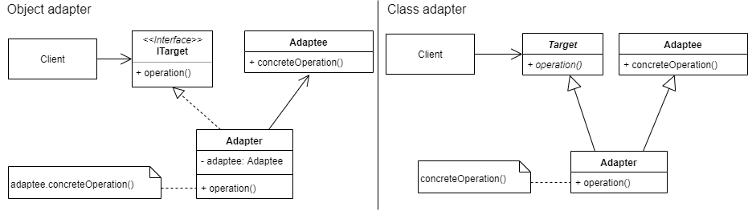

_An overview of the Adapter design pattern and its implementation in Dart and Flutter_


In the last [article](../2019-10-16-flutter-design-patterns-1-singleton/index.md), I analysed the first design pattern in the series — Singleton, provided some general thoughts about its structure, applicability, pros and cons, implemented it in several different ways. This time, I would like to analyse and implement a design pattern that belongs to the category of structural design patterns — Adapter.

<!--truncate-->

:::tip
To see all the design patterns in action, check the [Flutter Design Patterns application](https://flutterdesignpatterns.com/).
:::

## What is the Adapter design pattern?


**Adapter** is a **structural** design pattern, also known as **wrapper**. It is one of the most common and useful design patterns available to us as software developers. The intention of this design pattern is described in the [GoF book](https://en.wikipedia.org/wiki/Design_Patterns):

> _Convert the interface of a class into another interface clients expect. Adapter lets classes work together that couldn’t otherwise because of incompatible interfaces._

Let’s say you want to use some kind of third-party library that has the functionality you need. Also, you have a class that needs to utilize a particular interface, but interfaces between your code and the library are incompatible. In this case, you can use the library’s code by creating an adapter class that “sits” between your code and the code you want to use from that library. Moreover, the pattern is useful when you want to ensure that some particular piece of code in your software could be reused by wrapping it with an adapter and exposing an interface to it. This lets the future implementations in your code depend on Adapter interfaces, rather than concrete classes directly. Sounds good already? Well, let’s move to the analysis to understand how this pattern works and how it could be implemented.

## Analysis

The class diagram below shows the general structure of the Adapter design pattern:



To be more specific, there are two general implementations of Adapter with a different structure — **Object** and **Class** adapters (we will talk about the differences between these two next). Despite different structure between object and class adapters, they share the same idea of participants (elements or classes used to implement the pattern):

- _Target_ or _ITarget_ defines the domain-specific interface that _Client_ uses;
- _Client_ collaborates with objects conforming to the _Target_ interface;
- _Adaptee_ defines an existing interface that needs adapting (e.g. third-party library);
- _Adapter_ adapts the interface of _Adaptee_ to the _Target_ interface. This is the main node in the pattern, which connects the _Client_ code with the code which wants to be used (_Adaptee_).

### Object adapter vs Class adapter


To begin with, both object and class adapters are valid implementations of the Adapter design pattern, but their structure is different as well as their advantages and trade-offs. **Object adapter** relies on object composition to implement a _Target_ interface in terms of (by delegating to) an _Adaptee_ object. That is, the adapter implements the _Target_ operation by calling a concrete operation on the property or instance of _Adaptee_ class. The **class adapter** uses inheritance to implement a _Target_ interface in terms of (by inheriting from) an _Adaptee_ class. This way, the concrete operation from the _Adaptee_ class could be called directly from the implementation of _Target_ operation. The question is, which one to use?

My personal choice between these two possible implementations is the **object adapter**. Here are the reasons why:

1. To implement the Adapter design pattern using the class adapter method, the programming language of your choice must support multiple inheritance. In Dart, multiple inheritance is not supported.
2. One of the advantages of a class adapter is that you can easily override the behaviour of the adaptee class — you extend the adaptee class, right? However, the object adapter method is more flexible since it commits to an Adaptee class at run-time (client and adaptee code are loosely coupled). It means that you can create a single adapter that could use multiple different adaptees as long as their interfaces (types) matches the one adapter requires.
3. I prefer composition over inheritance. What I bear in my mind, if you try to reuse the code by inhering it from a class, you make the subclass dependent on the parent class. When using composition, you decouple your code by providing interfaces which implementations can be easily replaced (in this case, the implementation of _Adaptee_ could be replaced inside the _Adapter_ class at run-time). This is only a glimpse of the Liskov substitution principle (the letter **L** in [**SOLID**](https://en.wikipedia.org/wiki/SOLID) principles), which is pretty difficult to understand and apply, but it is worth the effort.

### Applicability

The adapter design pattern could (and should!) be used when the interface of the third-party library (or any other code you want to use) does not match the one you are currently using in your application. This rule could also be applied when calling external data sources, APIs and you want to wrap and separate the data conversion code from the primary business logic in your program. The pattern is useful when you want to use multiple implementations (adaptees) that have similar functionality but use different APIs. In this case, all the “hard work” (implementation) could be done in the Adapter classes, whereas the domain-layer code will use the same interface of the adapters. Also, this code abstraction makes the unit testing of the domain-layer code a little bit easier.

## Implementation


Let’s say, in the Flutter application we want to collect our contacts from two different sources. Unfortunately, these two sources provide the contacts in two different formats — JSON and XML. Also, we want to create a Flutter widget that represents this information in a list. However, to make the widget universal, it cannot be tied to a specific data format (JSON or XML), so it accepts these contacts as a list of Contact objects and does not know anything about how to parse JSON or XML strings to the required data structure. So we have two incompatible interfaces — our UI component (widget), which expects a list of Contact objects, and two APIs, which return contacts’ information in two different formats. As you could have guessed, we will use the Adapter design pattern to solve this problem.

### Class diagram

The class diagram below shows the implementation of the Adapter design pattern using the **object adapter** method:


First of all, there are two APIs: `JsonContactsApi` and `XmlContactsApi`. These two APIs have different methods to return contacts information in two different formats — JSON and XML. Hence, two different adapters should be created to convert the specific contacts’ representation to the required format which is needed in the `ContactsSection` component (widget) — list of `Contact` objects. To unify the contract (interface) of adapters, `IContactsAdapter` abstract class is created which requires implementing (override) the `getContacts()` method in all the implementations of this abstract class. `JsonContactsAdapter` implements the `IContactsAdapter`, uses the `JsonContactsApi` to retrieve contacts information as a JSON string, then parses it to a list of `Contact` objects and returns it via `getContacts()` method. Accordingly, `XmlContactsAdapter` is implemented in the same manner, but it receives the data from `XmlContactsApi` in XML format.

### Contact

Contact is a plain Dart class (as some people from Java background would call it — POJO) to store the contact’s information.

```dart title="contact.dart"
class Contact {
  final String fullName;
  final String email;
  final bool favourite;

  const Contact({
    required this.fullName,
    required this.email,
    required this.favourite,
  });
}
```

This class is used inside the UI widget `ContactsSection` and both of the adapters to return the parsed data from APIs in an acceptable format for the UI.

### JsonContactsApi

A fake API which returns contacts’ information as a JSON string.

```dart title="json_contacts_api.dart"
class JsonContactsApi {
  final String _contactsJson = '''
  {
    "contacts": [
      {
        "fullName": "John Doe (JSON)",
        "email": "johndoe@json.com",
        "favourite": true
      },
      {
        "fullName": "Emma Doe (JSON)",
        "email": "emmadoe@json.com",
        "favourite": false
      },
      {
        "fullName": "Michael Roe (JSON)",
        "email": "michaelroe@json.com",
        "favourite": false
      }
    ]
  }
  ''';

  String getContactsJson() {
    return _contactsJson;
  }
}
```

### XmlContactsApi

A fake API which returns contacts’ information as an XML string.

```dart title="xml_contacts_api.dart"
class XmlContactsApi {
  final String _contactsXml = '''
  <?xml version="1.0"?>
  <contacts>
    <contact>
      <fullname>John Doe (XML)</fullname>
      <email>johndoe@xml.com</email>
      <favourite>false</favourite>
    </contact>
    <contact>
      <fullname>Emma Doe (XML)</fullname>
      <email>emmadoe@xml.com</email>
      <favourite>true</favourite>
    </contact>
    <contact>
      <fullname>Michael Roe (XML)</fullname>
      <email>michaelroe@xml.com</email>
      <favourite>true</favourite>
    </contact>
  </contacts>
  ''';

  String getContactsXml() {
    return _contactsXml;
  }
}
```

### IContactsAdapter

A contract (interface) that unifies adapters and requires them to implement the method `getContacts()`.

```dart title="icontacts_adapter.dart"
abstract class IContactsAdapter {
  List<Contact> getContacts();
}
```

Dart language does not support the interface as a class type, so we define an interface by creating an abstract class and providing a method header (name, return type, parameters) without the default implementation.

### JsonContactsAdapter

An adapter, which implements the `getContacts()` method. Inside the method, contacts’ information is retrieved from `JsonContactsApi` as a JSON string and parsed to the required return type (a list of `Contact` objects).

```dart title="json_contacts_adapter.dart"
class JsonContactsAdapter implements IContactsAdapter {
  final JsonContactsApi _api = JsonContactsApi();

  @override
  List<Contact> getContacts() {
    final contactsJson = _api.getContactsJson();
    final contactsList = _parseContactsJson(contactsJson);

    return contactsList;
  }

  List<Contact> _parseContactsJson(String contactsJson) {
    final contactsMap = json.decode(contactsJson) as Map<String, dynamic>;
    final contactsJsonList = contactsMap['contacts'] as List;
    final contactsList = contactsJsonList.map((json) {
      final contactJson = json as Map<String, dynamic>;

      return Contact(
        fullName: contactJson['fullName'] as String,
        email: contactJson['email'] as String,
        favourite: contactJson['favourite'] as bool,
      );
    }).toList();

    return contactsList;
  }
}
```

### XmlContactsAdapter

An adapter, which implements the `getContacts()` method. Inside the method, contacts’ information is retrieved from `XmlContactsApi` as an XML string and parsed to the required return type (a list of `Contact` objects).

```dart title="xml_contacts_adapter.dart"
class XmlContactsAdapter implements IContactsAdapter {
  final XmlContactsApi _api = XmlContactsApi();

  @override
  List<Contact> getContacts() {
    final contactsXml = _api.getContactsXml();
    final contactsList = _parseContactsXml(contactsXml);

    return contactsList;
  }

  List<Contact> _parseContactsXml(String contactsXml) {
    final xmlDocument = XmlDocument.parse(contactsXml);
    final contactsList = <Contact>[];

    for (final xmlElement in xmlDocument.findAllElements('contact')) {
      final fullName = xmlElement.findElements('fullname').single.text;
      final email = xmlElement.findElements('email').single.text;
      final favouriteString = xmlElement.findElements('favourite').single.text;
      final favourite = favouriteString.toLowerCase() == 'true';

      contactsList.add(
        Contact(
          fullName: fullName,
          email: email,
          favourite: favourite,
        ),
      );
    }

    return contactsList;
  }
}
```

## Example

First of all, a markdown file is prepared and provided as a pattern’s description:


The example itself uses the `ContactsSection` component which requires a specific adapter of type `IContactsAdapter` to be injected via constructor.

```dart title="adapter_example.dart"
class AdapterExample extends StatelessWidget {
  const AdapterExample();

  @override
  Widget build(BuildContext context) {
    return ScrollConfiguration(
      behavior: const ScrollBehavior(),
      child: SingleChildScrollView(
        padding: const EdgeInsets.symmetric(
          horizontal: LayoutConstants.paddingL,
        ),
        child: Column(
          crossAxisAlignment: CrossAxisAlignment.start,
          children: <Widget>[
            ContactsSection(
              adapter: JsonContactsAdapter(),
              headerText: 'Contacts from JSON API:',
            ),
            const SizedBox(height: LayoutConstants.spaceL),
            ContactsSection(
              adapter: XmlContactsAdapter(),
              headerText: 'Contacts from XML API:',
            ),
          ],
        ),
      ),
    );
  }
}
```

`ContactsSection` widget uses the injected adapter of type `IContactsAdapter`. The widget only cares about the adapter’s type (interface), but not its specific implementation. Hence, we can provide different adapters of type `IContactsAdapter` which load the contacts’ information from different data sources without making any changes to the UI.

```dart title="contacts_section.dart"
class ContactsSection extends StatefulWidget {
  final IContactsAdapter adapter;
  final String headerText;

  const ContactsSection({
    required this.adapter,
    required this.headerText,
  });

  @override
  _ContactsSectionState createState() => _ContactsSectionState();
}

class _ContactsSectionState extends State<ContactsSection> {
  final List<Contact> contacts = [];

  void _getContacts() {
    setState(() {
      contacts.addAll(widget.adapter.getContacts());
    });
  }

  @override
  Widget build(BuildContext context) {
    return Column(
      crossAxisAlignment: CrossAxisAlignment.start,
      children: <Widget>[
        Text(widget.headerText),
        const SizedBox(height: LayoutConstants.spaceM),
        AnimatedSwitcher(
          duration: const Duration(milliseconds: 500),
          child: _ContactsSectionContent(
            contacts: contacts,
            onPressed: _getContacts,
          ),
        ),
      ],
    );
  }
}

class _ContactsSectionContent extends StatelessWidget {
  final List<Contact> contacts;
  final VoidCallback onPressed;

  const _ContactsSectionContent({
    required this.contacts,
    required this.onPressed,
  });

  @override
  Widget build(BuildContext context) {
    return contacts.isEmpty
        ? PlatformButton(
            materialColor: Colors.black,
            materialTextColor: Colors.white,
            onPressed: onPressed,
            text: 'Get contacts',
          )
        : Column(
            children: <Widget>[
              for (var contact in contacts)
                ContactCard(
                  contact: contact,
                )
            ],
          );
  }
}
```

The final result of the Adapter’s implementation looks like this:


All of the code changes for the Adapter design pattern and its example implementation could be found [here](https://github.com/mkobuolys/flutter-design-patterns/pull/3).

:::tip
To see the pattern in action, check the [interactive Adapter example](https://flutterdesignpatterns.com/pattern/adapter).
:::

---

Save trees. Stay SOLID. Thanks for reading.
