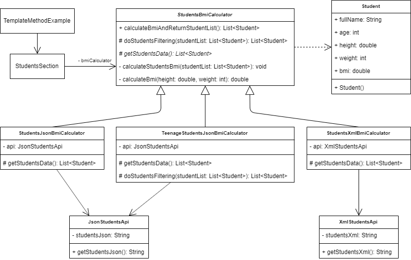

_An overview of the Template Method design pattern and its implementation in Dart and Flutter_


Previously in the series, I analysed one of the most common and useful design patterns available - [Adapter](../2019-10-23-flutter-design-patterns-2-adapter/index.md). In this article, I would like to analyse and implement one of the behavioural design patterns - Template Method.

<!--truncate-->

:::tip
To see all the design patterns in action, check the [Flutter Design Patterns application](https://flutterdesignpatterns.com/).
:::

## What is the Template Method design pattern?

The **Template Method** is a **behavioural** design pattern, which intention in the [GoF book](https://en.wikipedia.org/wiki/Design_Patterns) is described like this:

> _Define the skeleton of an algorithm in an operation, deferring some steps to sub­classes. Template Method lets subclasses redefine certain steps of an algorithm without changing the algorithm's structure._

The Template method is a fundamental technique for code reuse. Let's say you have an algorithm that consists of multiple steps:

1. Reading the data from some kind of data source;
2. Processing it;
3. Providing the calculated results.

In one case, you want to get the data from a third-party API, process it and provide the results in the console window. In another case, you would like to read the data from a file in your local disk drive, process it and send the formatted result document via e-mail. Despite the differences between these two cases, these algorithms share the same structure - reading, processing the data and providing the results. That's where the Template Method design pattern is useful - when you need to allow changing the details of each step or certain steps of the algorithm while enforcing the structure and order of the steps themselves. The question is, how to define this kind of template?

## Analysis

The class diagram below shows the general structure of the Template Method design pattern:


- _AbstractClass_ - contains a _templateMethod()_ operation defining the skeleton of an algorithm. The template method calls primitive operations as well as operations defined in _AbstractClass_ or those of other objects.
- *ConcreteClass* - relies on _AbstractClass_ to implement the invariant steps of the algorithm.

### Template Method operation types

There are different kinds of operations which are called by the template method:

- *Primitive operations* - abstract operations that **must** be implemented by subclasses; concrete operations that provide a default implementation and **can** be redefined by subclasses if necessary.
- *Final operations* - concrete operations that **can not** be overridden by subclasses.
- *Hook operations* - concrete operations which provide default behaviour that subclasses **can** extend if necessary. A hook operation often does nothing by default.
- _Template method_ itself **can** be declared as final so that it could not be overridden by subclasses.

_Note: Template methods need to specify which operations are hooks and which are abstract operations. To do that, you can identify the operations that should be overridden by adding a prefix to their names e.g. the MacApp framework prefixes template method names with "Do-"._

### The Hollywood Principle


The Hollywood Principle is simply stated as:

> _Don't call us, we'll call you!_

How this statement is related to the Template Method? The base class of the Template Method is considered a high-level component - clients or concrete implementations of the algorithm should depend on it. The subclasses of the template are the low-level components - they don't call anything themselves and are only called by the high-level template method. This describes the relationship between high-level and low-level components - abstractions should not depend on details, but the details should depend on abstractions (Dependency Inversion principle, the letter **D** in [**SOLID**](https://en.wikipedia.org/wiki/SOLID) principles). Thus, the Template Method design pattern could state that _low-level components don't call us, we call them!_

### Applicability

The Template Method design pattern should be used when we want to implement the invariant parts of the algorithm once and let the derived classes implement the steps which may vary. Also, the pattern is useful when we want to extract the common logic among classes to avoid code duplication (**DRY** principle - **D**on't **R**epeat **Y**ourself).

## Implementation


Let's say, in the Flutter application we want to create an algorithm that calculates the BMI (body mass index) of students. The algorithm retrieves students' data, applies students' filtering (if necessary), calculates their BMI and provides the results. Also, we want to retrieve students' information from different data sources and we want to have a separate algorithm that includes only teenage students for the calculations. As you can see, the structure of the algorithm is general, but the implementation details (algorithm steps) vary among different implementations. To implement this algorithm, we would use the Template method design pattern.

### Class diagram

The class diagram below shows the implementation of the Template Method design pattern:



The main class in the diagram is `StudentsBmiCalculator`. Its primary purpose is to define a template of the BMI calculation algorithm which returns a list of `Student` objects (with the calculated BMI for each student) as a result via the `calculateBmiAndReturnStudentList()` method. This abstract class is used as a template (base class) for the concrete implementations of the students' BMI calculation algorithm - `StudentsXmlBmiCalculator`, `StudentsJsonBmiCalculator` and `TeenageStudentsJsonBmiCalculator`. `StudentsXmlBmiCalculator` uses the `XmlStudentsApi` to retrieve students information as an XML string and returns it as a list of `Student` objects via the overridden `getStudentsData()` method. Both of the other two implementations (`StudentsJsonBmiCalculator` and `TeenageStudentsJsonBmiCalculator`) uses the `JsonStudentsApi` to retrieve students' information in JSON format and return the parsed data via the overridden `getStudentsData()` method. However, `TeenageStudentsJsonBmiCalculator` additionally reimplements (overrides) the `doStudentsFiltering()` hook method to filter out not teenage students before calculating the BMI values. `StudentsSection` UI widget uses the `StudentsBmiCalculator` abstraction to retrieve and represent the calculated results in the `TemplateMethodExample` widget.

_Note: it would make more sense to extract the XML or JSON parsing logic from the `getStudentsData()` method in the concrete calculation classes to a separate class using the Adapter design pattern, but for the demonstration purposes of the Template Method pattern and to show that the implementation of `getStudentsData()` may differ among the derived classes of the `StudentsXmlBmiCalculator`, I have decided to leave logic as it is now._

### StudentsBmiCalculator

An abstract (template) class for the BMI calculation algorithm.

```dart title="students_bmi_calculator.dart"
abstract class StudentsBmiCalculator {
  List<Student> calculateBmiAndReturnStudentList() {
    var studentList = getStudentsData();
    studentList = doStudentsFiltering(studentList);
    _calculateStudentsBmi(studentList);
    return studentList;
  }

  void _calculateStudentsBmi(List<Student> studentList) {
    for (final student in studentList) {
      student.bmi = _calculateBmi(student.height, student.weight);
    }
  }

  double _calculateBmi(double height, int weight) {
    return weight / math.pow(height, 2);
  }

  // Hook methods
  @protected
  List<Student> doStudentsFiltering(List<Student> studentList) {
    return studentList;
  }

  // Abstract methods
  @protected
  List<Student> getStudentsData();
}
```

The algorithm consists of several steps:

1. Retrieve students data - `getStudentsData()`;
2. Do students filtering (if needed) - `doStudentsFiltering()`;
3. Calculate the BMI for each student - `_calculateStudentsBmi()`;
4. Return students data - `return studentList`.

The first step is mandatory and should be implemented in each concrete implementation of the students BMI calculator - that is, the method `getStudentsData()` is abstract and must be overridden in the derived class (_primitive_ operation). The students filtering step is optional, yet it could be overridden in the derived class. For this reason, `doStudentsFiltering()` method has a default implementation that does not change the workflow of the algorithm by default (_hook_ operation). Other steps are defined in the algorithm's template itself, are common for all implementations and could not be changed (_final_ operations).

### StudentsXmlBmiCalculator

A concrete implementation of the BMI calculation algorithm which uses `XmlStudentsApi` to retrieve data and implements the `getStudentsData()` method.

```dart title="students_xml_bmi_calculator.dart"
class StudentsXmlBmiCalculator extends StudentsBmiCalculator {
  final XmlStudentsApi _api = XmlStudentsApi();

  @override
  @protected
  List<Student> getStudentsData() {
    final studentsXml = _api.getStudentsXml();
    final xmlDocument = XmlDocument.parse(studentsXml);
    final studentsList = <Student>[];

    for (final xmlElement in xmlDocument.findAllElements('student')) {
      final fullName = xmlElement.findElements('fullname').single.text;
      final age = int.parse(xmlElement.findElements('age').single.text);
      final height =
          double.parse(xmlElement.findElements('height').single.text);
      final weight = int.parse(xmlElement.findElements('weight').single.text);

      studentsList.add(
        Student(
          fullName: fullName,
          age: age,
          height: height,
          weight: weight,
        ),
      );
    }

    return studentsList;
  }
}
```

### StudentsJsonBmiCalculator

A concrete implementation of the BMI calculation algorithm which uses `JsonStudentsApi` to retrieve data and implements the `getStudentsData()` method.

```dart title="students_json_bmi_calculator.dart"
class StudentsJsonBmiCalculator extends StudentsBmiCalculator {
  final JsonStudentsApi _api = JsonStudentsApi();

  @override
  @protected
  List<Student> getStudentsData() {
    final studentsJson = _api.getStudentsJson();
    final studentsMap = json.decode(studentsJson) as Map<String, dynamic>;
    final studentsJsonList = studentsMap['students'] as List;
    final studentsList = studentsJsonList.map((json) {
      final studentJson = json as Map<String, dynamic>;

      return Student(
        fullName: studentJson['fullName'] as String,
        age: studentJson['age'] as int,
        height: studentJson['height'] as double,
        weight: studentJson['weight'] as int,
      );
    }).toList();

    return studentsList;
  }
}
```

### TeenageStudentsJsonBmiCalculator

A concrete implementation of the BMI calculation algorithm which uses `JsonStudentsApi` to retrieve data and implements the `getStudentsData()` method.

```dart title="teenage_students_json_bmi_calculator.dart"
class TeenageStudentsJsonBmiCalculator extends StudentsBmiCalculator {
  final JsonStudentsApi _api = JsonStudentsApi();

  @override
  @protected
  List<Student> getStudentsData() {
    final studentsJson = _api.getStudentsJson();
    final studentsMap = json.decode(studentsJson) as Map<String, dynamic>;
    final studentsJsonList = studentsMap['students'] as List;
    final studentsList = studentsJsonList.map((json) {
      final studentJson = json as Map<String, dynamic>;

      return Student(
        fullName: studentJson['fullName'] as String,
        age: studentJson['age'] as int,
        height: studentJson['height'] as double,
        weight: studentJson['weight'] as int,
      );
    }).toList();

    return studentsList;
  }

  @override
  @protected
  List<Student> doStudentsFiltering(List<Student> studentList) {
    return studentList
        .where((student) => student.age > 12 && student.age < 20)
        .toList();
  }
}
```

Additionally, the `doStudentsFiltering()` hook method is overridden to filter out not teenage students.

### Student

A simple class to store the student's information.

```dart title="student.dart"
class Student {
  final String fullName;
  final int age;
  final double height;
  final int weight;
  late final double bmi;

  Student({
    required this.fullName,
    required this.age,
    required this.height,
    required this.weight,
  });
}
```

### JsonStudentsApi

A fake API which returns students' information as a JSON string.

```dart title="json_students_api.dart"
class JsonStudentsApi {
  final String _studentsJson = '''
  {
    "students": [
      {
        "fullName": "John Doe (JSON)",
        "age": 12,
        "height": 1.62,
        "weight": 53
      },
      {
        "fullName": "Emma Doe (JSON)",
        "age": 15,
        "height": 1.55,
        "weight": 50
      },
      {
        "fullName": "Michael Roe (JSON)",
        "age": 18,
        "height": 1.85,
        "weight": 89
      },
      {
        "fullName": "Emma Roe (JSON)",
        "age": 20,
        "height": 1.66,
        "weight": 79
      }
    ]
  }
  ''';

  String getStudentsJson() {
    return _studentsJson;
  }
}
```

### XmlStudentsApi

A fake API that returns students' information as an XML string.

```dart title="xml_students_api.dart"
class XmlStudentsApi {
  final String _studentsXml = '''
  <?xml version="1.0"?>
  <students>
    <student>
      <fullname>John Doe (XML)</fullname>
      <age>12</age>
      <height>1.62</height>
      <weight>53</weight>
    </student>
    <student>
      <fullname>Emma Doe (XML)</fullname>
      <age>15</age>
      <height>1.55</height>
      <weight>50</weight>
    </student>
    <student>
      <fullname>Michael Roe (XML)</fullname>
      <age>18</age>
      <height>1.85</height>
      <weight>89</weight>
    </student>
    <student>
      <fullname>Emma Roe (XML)</fullname>
      <age>20</age>
      <height>1.66</height>
      <weight>79</weight>
    </student>
  </students>
  ''';

  String getStudentsXml() {
    return _studentsXml;
  }
}
```

## Example

First of all, a markdown file is prepared and provided as a pattern's description:


The example itself uses the `StudentsSection` component which requires a specific BMI calculator of the type `StudentsBmiCalculator` to be provided via a constructor. For this example, we inject three different implementations of the BMI calculator (`StudentsXmlBmiCalculator`, `StudentsJsonBmiCalculator` and `TeenageStudentsJsonBmiCalculator`) which extend the same template (base class) - `StudentsBmiCalculator` - to three different `StudentsSection` widgets.

```dart title="template_method_example.dart"
class TemplateMethodExample extends StatelessWidget {
  const TemplateMethodExample();

  @override
  Widget build(BuildContext context) {
    return ScrollConfiguration(
      behavior: const ScrollBehavior(),
      child: SingleChildScrollView(
        padding: const EdgeInsets.symmetric(
          horizontal: LayoutConstants.paddingL,
        ),
        child: Column(
          crossAxisAlignment: CrossAxisAlignment.start,
          children: <Widget>[
            StudentsSection(
              bmiCalculator: StudentsXmlBmiCalculator(),
              headerText: 'Students from XML data source:',
            ),
            const SizedBox(height: LayoutConstants.spaceL),
            StudentsSection(
              bmiCalculator: StudentsJsonBmiCalculator(),
              headerText: 'Students from JSON data source:',
            ),
            const SizedBox(height: LayoutConstants.spaceL),
            StudentsSection(
              bmiCalculator: TeenageStudentsJsonBmiCalculator(),
              headerText: 'Students from JSON data source (teenagers only):',
            ),
          ],
        ),
      ),
    );
  }
}
```

`StudentsSection` uses the injected BMI calculator of type `StudentsBmiCalculator`. The widget does not care about the specific implementation of the BMI calculator as long as it uses (extends) the same template (base class). This lets us provide different students' BMI calculation algorithms/implementations without making any changes to the UI code.

```dart title="students_section.dart"
class StudentsSection extends StatefulWidget {
  final StudentsBmiCalculator bmiCalculator;
  final String headerText;

  const StudentsSection({
    required this.bmiCalculator,
    required this.headerText,
  });

  @override
  _StudentsSectionState createState() => _StudentsSectionState();
}

class _StudentsSectionState extends State<StudentsSection> {
  final List<Student> students = [];

  void _calculateBmiAndGetStudentsData() {
    setState(() {
      students.addAll(widget.bmiCalculator.calculateBmiAndReturnStudentList());
    });
  }

  @override
  Widget build(BuildContext context) {
    return Column(
      crossAxisAlignment: CrossAxisAlignment.start,
      children: <Widget>[
        Text(widget.headerText),
        const SizedBox(height: LayoutConstants.spaceM),
        AnimatedSwitcher(
          duration: const Duration(milliseconds: 500),
          child: _StudentsSectionContent(
            students: students,
            onPressed: _calculateBmiAndGetStudentsData,
          ),
        ),
      ],
    );
  }
}

class _StudentsSectionContent extends StatelessWidget {
  final List<Student> students;
  final VoidCallback onPressed;

  const _StudentsSectionContent({
    required this.students,
    required this.onPressed,
  });

  @override
  Widget build(BuildContext context) {
    return students.isEmpty
        ? PlatformButton(
            materialColor: Colors.black,
            materialTextColor: Colors.white,
            onPressed: onPressed,
            text: "Calculate BMI and get students' data",
          )
        : StudentsDataTable(
            students: students,
          );
  }
}
```

The final result of the Template Method's implementation looks like this:


All of the code changes for the Template Method design pattern and its example implementation could be found [here](https://github.com/mkobuolys/flutter-design-patterns/pull/4).

:::tip
To see the pattern in action, check the [interactive Template Method example](https://flutterdesignpatterns.com/pattern/template-method).
:::

---

Save trees. Stay SOLID. Thanks for reading.
