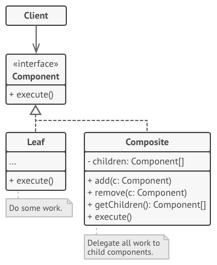
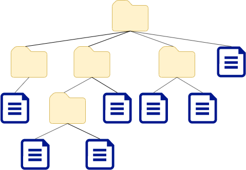

_An overview of the Composite design pattern and its implementation in Dart and Flutter_


In the last [article](../2019-10-30-flutter-design-patterns-3-template-method/index.md), I analysed the Template Method design pattern. This time I would like to represent the pattern which is pretty simple to understand (compared to the other design patterns) and is related to the implementation of the Flutter framework itself - the Composite design pattern.

<!--truncate-->

:::tip
To see all the design patterns in action, check the [Flutter Design Patterns application](https://flutterdesignpatterns.com/).
:::

## What is the Composite design pattern?


The **Composite** is one of the **structural** design patterns. Its intention in the [GoF book](https://en.wikipedia.org/wiki/Design_Patterns) is described as:

> _Compose objects into tree structures to represent part-whole hierarchies. Composite lets clients treat individual objects and compositions of objects uniformly._

To understand the Composite design pattern, you should be familiar with the tree data structure:


In simple words, the tree data structure consists of **nodes** (elements) and **edges** (relations between nodes). Each node could have multiple **child** nodes, but each child could have only one **parent** node. The **root** node is the base of the tree, which has no parent node. The **leaf** is a tree node, which does not have any children. In the Composite design pattern context, we use two types of nodes - **leaf** (a component, which has no child components) and **composite** (a component, which contains one or more child components). Basically, any hierarchical data could be represented and stored as a tree structure. The main problem - how to implement this kind of structure in code? A very inflexible way is to define leaf and composite objects differently, and treat the composite object as a container for the leaf objects by specifying a specific logic, interface for it. This leads to the issue when a client should treat leaf and composite objects differently, hence making the code very complex especially when the data structure is constructed dynamically. That is one of the main reasons why the Composite design pattern is used - to define an abstract class (interface works as well) that represents both leaf and composite objects uniformly hence letting clients treat every element of the tree structure in the same manner.

Doesn't it sound familiar? "In Flutter, everything is a widget!", "Flutter widget tree", no? The Flutter framework builds the UI of the application as a Widget tree and allows you to put widgets inside other widgets or their containers (widgets, which contain the _children_ property, e.g. `Column`, `Row`, `ListView`, etc.). That's pretty much a Composite design pattern, well, on steroids and with some additional Flutter magic…

## Analysis

The general structure of the Composite design pattern looks like this:



- *Component* - declares the interface for objects in the composition. This interface allows the client to treat leaf and composite objects uniformly.
- *Leaf* - represents leaf objects in the composition. This object does not have sub-elements (child components), defines behaviour for primitive objects in the composition and does most of the real work since they don't have anyone to delegate the work to.
- *Composite* - stores sub-elements (children) and implements child-related operations in the _Composite_ interface. Differently from the _leaf_ component, the _composite_ object delegates the work to its child elements, processes intermediate results and then returns the final result to the client.
- *Client* - uses the _Component_ interface to interact with objects in the composite structure. This allows the client to work with simple and complex elements of the tree in the same way.

### Applicability

The Composite design pattern should be used when you want to represent part-whole hierarchies of objects and you want clients to be able to ignore the difference between compositions of objects and individual objects. In my opinion, the most difficult part of this pattern is to identify where and when you can apply it in your codebase. A general rule of thumb - if you have a set of groups or collections, this is a big indicator that you might be able to use the Composite design pattern. The easier case to detect - you are using a tree structure. In this case, you should think about where you can apply the pattern to make the work with this data structure easier. If you detect these cases in your code, only the implementation details are left, which I will describe next.

## Implementation

This time the implementation of the design pattern is more visual (finally!) and would make more sense in the Flutter context (yes, I do consider your feedback, so do not hesitate to share your insights about the series - it helps me improve the quality of the content a lot!). Let's say, we want to represent the structure of our file system. The file system consists of directories and files of various types: audio, video, images, text files, etc. Files are stored inside directories, also, directories could be stored inside other directories. For instance, our file structure could look like this:



Besides, we want to show the size of each file or directory. It is easy to show it for a concrete file, but the directory size depends on the items inside it and should be calculated. To implement this, the Composite design pattern is a great option!

### Class diagram

The class diagram below shows the implementation of the Composite design pattern:


`IFile` defines a common interface for both `File` (leaf) and `Directory` (composite) classes:

- `getSize()` - returns size of the file;
- `render()` - renders the component's UI.

`File` class implements the `getSize()` and `render()` methods, additionally contains `title`, `size` and `icon` properties. `Directory` implements the same required methods, but it also contains title, `isInitiallyExpanded` and `files` list, containing the `IFile` objects, defines `addFile()` method, which allows adding `IFile` objects to the directory (files list). `AudioFile`, `ImageFile`, `TextFile` and `VideoFile` classes extend the `File` class to specify a concrete type of the file.

### IFile

An interface that defines methods to be implemented by leaf and composite components.

```dart title="ifile.dart"
abstract interface class IFile {
  int getSize();
  Widget render(BuildContext context);
}
```

### File

A concrete implementation of the `IFile` interface which matches the leaf class in the Composite design pattern. In the `File` class, the `getSize()` method simply returns the file size, and `render()` - returns the file's UI widget which is used in the example screen.

```dart title="file.dart"
base class File extends StatelessWidget implements IFile {
  final String title;
  final int size;
  final IconData icon;

  const File({
    required this.title,
    required this.size,
    required this.icon,
  });

  @override
  int getSize() => size;

  @override
  Widget render(BuildContext context) {
    return Padding(
      padding: const EdgeInsets.only(left: LayoutConstants.paddingS),
      child: ListTile(
        title: Text(
          title,
          style: Theme.of(context).textTheme.bodyLarge,
        ),
        leading: Icon(icon),
        trailing: Text(
          FileSizeConverter.bytesToString(size),
          style: Theme.of(context)
              .textTheme
              .bodyMedium
              ?.copyWith(color: Colors.black54),
        ),
        dense: true,
      ),
    );
  }

  @override
  Widget build(BuildContext context) => render(context);
}
```

### Concrete classes extending `File`

All of these classes extend the `File` class and specify the concrete file type by providing a unique icon for the corresponding file type:

```dart title="audio_file.dart"
final class AudioFile extends File {
  const AudioFile({
    required super.title,
    required super.size,
  }) : super(icon: Icons.music_note);
}
```

```dart title="image_file.dart"
final class ImageFile extends File {
  const ImageFile({
    required super.title,
    required super.size,
  }) : super(icon: Icons.image);
}
```

```dart title="text_file.dart"
final class TextFile extends File {
  const TextFile({
    required super.title,
    required super.size,
  }) : super(icon: Icons.description);
}
```

```dart title="video_file.dart"
final class VideoFile extends File {
  const VideoFile({
    required super.title,
    required super.size,
  }) : super(icon: Icons.movie);
}
```

### Directory

A concrete implementation of the `IFile` interface which matches the `composite` class in the Composite design pattern. Similar to `File` class, `render()` returns the directory's UI widget which is used in the example screen. However, in this class `getSize()` method calculates the directory size by calling the `getSize()` method for each item in the `files` list and adding up the results. This is the main idea of the Composite design pattern which allows the composite class to treat all the elements in the containing list uniformly as long as they implement the same interface.

```dart title="directory.dart"
class Directory extends StatelessWidget implements IFile {
  final String title;
  final bool isInitiallyExpanded;

  final List<IFile> files = [];

  Directory(this.title, {this.isInitiallyExpanded = false});

  void addFile(IFile file) => files.add(file);

  @override
  int getSize() {
    var sum = 0;

    for (final file in files) {
      sum += file.getSize();
    }

    return sum;
  }

  @override
  Widget render(BuildContext context) {
    return Theme(
      data: ThemeData(
        colorScheme: ColorScheme.fromSwatch().copyWith(primary: Colors.black),
      ),
      child: Padding(
        padding: const EdgeInsets.only(left: LayoutConstants.paddingS),
        child: ExpansionTile(
          leading: const Icon(Icons.folder),
          title: Text('$title (${FileSizeConverter.bytesToString(getSize())})'),
          initiallyExpanded: isInitiallyExpanded,
          children: files.map((IFile file) => file.render(context)).toList(),
        ),
      ),
    );
  }

  @override
  Widget build(BuildContext context) => render(context);
}
```

### FileSizeConverter

To represent the file size in a more appealing format, `FileSizeConverter` helper class was created which provides a static method `bytesToString()` which converts the value of the file size in bytes to human-readable text.

```dart title="file_size_converter.dart"
class FileSizeConverter {
  const FileSizeConverter._();

  static String bytesToString(int bytes) {
    final sizes = ['B', 'KB', 'MB', 'GB', 'TB'];
    var len = bytes.toDouble();
    var order = 0;

    while (len >= 1024 && order++ < sizes.length - 1) {
      len /= 1024;
    }

    return '${len.toStringAsFixed(2)} ${sizes[order]}';
  }
}
```

## Example

First of all, a markdown file is prepared and provided as a pattern's description:


`CompositeExample` widget contains the `buildMediaDirectory()` method which builds the file structure for the example. This method illustrates the Composite design pattern - even though the components are of different types, they could be handled in the same manner since the implemented interface of `IFile` is the same for all components. This allows us to put `Directory` objects inside other directories, mix them along with concrete `File` objects hence building the tree structure of `IFile` components.

```dart title="composite_example.dart"
class CompositeExample extends StatelessWidget {
  const CompositeExample();

  Widget _buildMediaDirectory() {
    final musicDirectory = Directory('Music')
      ..addFile(const AudioFile(title: 'Darude - Sandstorm.mp3', size: 2612453))
      ..addFile(const AudioFile(title: 'Toto - Africa.mp3', size: 3219811))
      ..addFile(
        const AudioFile(
          title: 'Bag Raiders - Shooting Stars.mp3',
          size: 3811214,
        ),
      );

    final moviesDirectory = Directory('Movies')
      ..addFile(const VideoFile(title: 'The Matrix.avi', size: 951495532))
      ..addFile(
        const VideoFile(title: 'The Matrix Reloaded.mp4', size: 1251495532),
      );

    final catPicturesDirectory = Directory('Cats')
      ..addFile(const ImageFile(title: 'Cat 1.jpg', size: 844497))
      ..addFile(const ImageFile(title: 'Cat 2.jpg', size: 975363))
      ..addFile(const ImageFile(title: 'Cat 3.png', size: 1975363));

    final picturesDirectory = Directory('Pictures')
      ..addFile(catPicturesDirectory)
      ..addFile(const ImageFile(title: 'Not a cat.png', size: 2971361));

    final mediaDirectory = Directory('Media', isInitiallyExpanded: true)
      ..addFile(musicDirectory)
      ..addFile(musicDirectory)
      ..addFile(moviesDirectory)
      ..addFile(picturesDirectory)
      ..addFile(Directory('New Folder'))
      ..addFile(
        const TextFile(title: 'Nothing suspicious there.txt', size: 430791),
      )
      ..addFile(const TextFile(title: 'TeamTrees.txt', size: 104));

    return mediaDirectory;
  }

  @override
  Widget build(BuildContext context) {
    return ScrollConfiguration(
      behavior: const ScrollBehavior(),
      child: SingleChildScrollView(
        padding: const EdgeInsets.symmetric(
          horizontal: LayoutConstants.paddingL,
        ),
        child: _buildMediaDirectory(),
      ),
    );
  }
}
```

The final result of the Composite design pattern's implementation looks like this:


As you can see in the example, the file size is shown for each file directly and for directories, it is calculated by adding up each file size inside the directory.

All of the code changes for the Composite design pattern and its example implementation could be found [here](https://github.com/mkobuolys/flutter-design-patterns/pull/5).

:::tip
To see the pattern in action, check the [interactive Composite example](https://flutterdesignpatterns.com/pattern/composite).
:::
