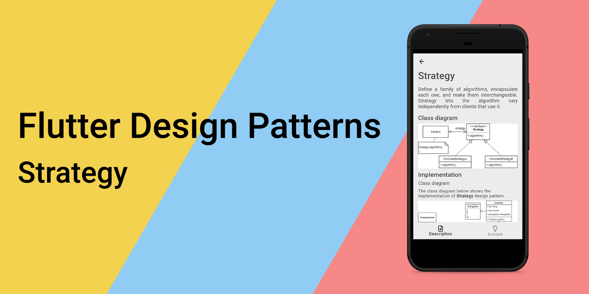
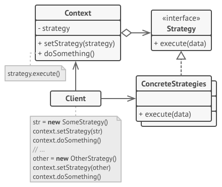
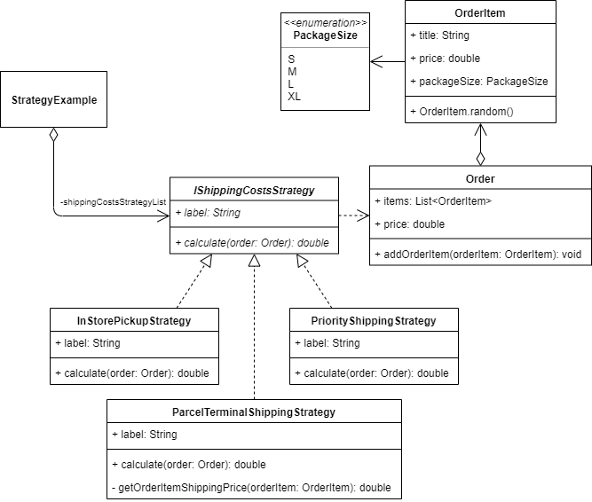
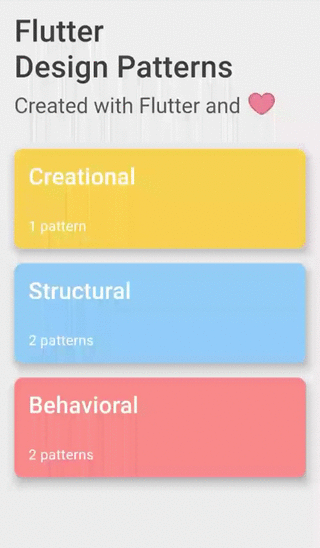

_An overview of the Strategy design pattern and its implementation in Dart and Flutter_



In the last [article](../2019-11-07-flutter-design-patterns-4-composite/index.md), I have represented the Composite design pattern. This time, I would like to analyse and implement a design pattern that belongs to the category of behavioural design patterns — Strategy.

<!--truncate-->

:::tip
To see all the design patterns in action, check the [Flutter Design Patterns application](https://flutterdesignpatterns.com/).
:::

## What is the Strategy design pattern?


**Strategy**, also known as policy, belongs to the category of **behavioural** design patterns. The intention of this design pattern is described in the [GoF book](https://en.wikipedia.org/wiki/Design_Patterns):

> _Define a family of algorithms, encapsulate each one, and make them interchangeable. Strategy lets the algorithm vary independently from clients that use it._

The Strategy is considered as one of the most practical design patterns, you can find a lot of uses for it in day-to-day coding. The main idea of this pattern is to extract related algorithms (or any piece of code) into separate classes and define a common interface for them. This enables compile-time flexibility - new algorithms can be added by defining new classes, and existing ones can be changed independently. Also, the extracted strategy class can be changed in the code dynamically at run-time. Another advantage of the pattern is that allows you to isolate the code, internal data, and dependencies of various algorithms from the rest of the code - clients use a simple interface to execute the algorithms and switch them at run-time. Possible use-cases of the Strategy design pattern:

- Sorting algorithms - each algorithm (e.g. bubble sort, quicksort, etc.) is extracted into a separate class, a common interface is defined which provides a method _sort()_;
- Payment strategies - you want to define different payment options in your code (mobile payment, bank transfer, cash, credit card, you name it) and use them based on the user's selection;
- Damage calculation in RPG game - there are several different types of attack in the game e.g. attacking with different moves, combos, spells, using weapons, etc. Several different algorithms could be defined for each attack type and the damage value could be calculated based on the context.

Let's jump right in by analysing the Strategy design pattern and its implementation in more detail!

## Analysis

In the picture below you can see a general structure of the Strategy design pattern:



- *Strategy* - declares an interface that is common to all supported algorithms. It also declares a method the _Context_ uses to execute a specific strategy;
- *ConcreteStrategies* - implement different algorithms using the _Strategy_ interface which is used by the _Context_;
- *Context* - maintains a reference to a _Strategy_ object, but is independent of how the algorithm is implemented;
- *Client* - creates a specific strategy object and passes it to the _Context_.

### Applicability

The primary purpose of the Strategy design pattern is to encapsulate a family of algorithms (related algorithms) such that they could be callable through a common interface, hence being interchangeable based on the specific situation. Also, this pattern should be considered when you want to use different calculation logic within an object and/or be able to switch between different algorithms at run-time. A general rule of thumb - if you notice different behaviours lumped into a single class, or there are several conditional statements in the code for selecting a specific algorithm based on some kind of context or business rules (multiple if/else blocks, switch statements), this is a big indicator that you should use the Strategy design pattern and encapsulate the calculation logic in separate classes (strategies). This idea promotes the **Open-Closed Principle** (the letter **O** in [**SOLID**](https://en.wikipedia.org/wiki/SOLID) principles) since extending your code with new behaviour (algorithm) does not insist you change the logic inside a single class but allows creating a new strategy class instead - *software entities (classes, modules, functions, etc.) should be open for extension, but closed for modification*.

## Implementation


The following example and the problem we want to resolve could look similar to some of you, which are using Flutter to build an e-commerce mobile application. Let's say that your e-shop business offers several different shipping types for your customers:

- Picking up the ordered items from a physical store (or any other physical place, e.g. a warehouse);
- Sending order items using parcel terminal services;
- Sending order items directly to your customers in the shortest delivery time possible - priority shipping.

These three types contain different shipping costs calculation logic which should be determined at run-time, e.g. when the customer selects a specific shipping option in UI. At first sight, the most obvious solution (since we do not know which shipping option would be selected) is to define these algorithms in a single class and execute a specific calculation logic based on the customer's choice. However, this implementation is not flexible, for instance, if you want to add a new shipping type in the future, you should adjust the class by implementing the new algorithm, at the same time adding more conditional statements in the code - this violates the Open-Closed principle since you need to change the existing code for the upcoming business requirements. A better approach to this problem is to extract each algorithm into a separate class and define a common interface that will be used to inject the specific shipping costs calculation strategy into your code at run-time. Well, the Strategy design pattern is an obvious choice for this problem, isn't it?

### Class diagram

The class diagram below shows the implementation of the Strategy design pattern:



`IShippingCostsStrategy` defines a common interface for all the specific strategies:

- `label` - a text label of the strategy which is used in UI;
- `calculate()` - method to calculate shipping costs for the order. It uses information from the `Order` class object passed as a parameter.

`InStorePickupStrategy`, `ParcelTerminalShippingStrategy` and `PriorityShippingStrategy` are concrete implementations of the `IShippingCostsStrategy` interface. Each of the strategies provides a specific algorithm for the shipping costs calculation and defines it in the `calculate()` method.

`StrategyExample` widget stores all different shipping costs calculation strategies in the `shippingCostsStrategyList` variable.

### IShippingCostsStrategy

An interface that defines methods and properties to be implemented by all supported algorithms.

```dart title="ishipping_costs_strategy.dart"
abstract interface class IShippingCostsStrategy {
  late String label;
  double calculate(Order order);
}
```

### Specific implementations of the `IShippingCostsStrategy` interface

`InStorePickupStrategy` implements the shipping strategy which requires the customer to pick up the order in the store. Hence, there are no shipping costs and the `calculate()` method returns 0.

```dart title="in_store_pickup_strategy.dart"
class InStorePickupStrategy implements IShippingCostsStrategy {
  @override
  String label = 'In-store pickup';

  @override
  double calculate(Order order) => 0.0;
}
```

`ParcelTerminalShippingStrategy` implements the shipping strategy when an order is delivered using the parcel terminal service. When using parcel terminals, each order item is sent separately and the shipping cost depends on the parcel size. The final shipping price is calculated by adding up the separate shipping cost of each order item.

```dart title="parcel_terminal_shipping_strategy.dart"
class ParcelTerminalShippingStrategy implements IShippingCostsStrategy {
  @override
  String label = 'Parcel terminal shipping';

  @override
  double calculate(Order order) => order.items.fold<double>(
        0.0,
        (sum, item) => sum + _getOrderItemShippingPrice(item),
      );

  double _getOrderItemShippingPrice(OrderItem orderItem) =>
      switch (orderItem.packageSize) {
        PackageSize.S => 1.99,
        PackageSize.M => 2.49,
        PackageSize.L => 2.99,
        PackageSize.XL => 3.49,
      };
}
```

`PriorityShippingStrategy` implements the shipping strategy which has a fixed shipping cost for a single order. In this case, the `calculate()` method returns a specific price of 9.99.

```dart title="priority_shipping_strategy.dart"
class PriorityShippingStrategy implements IShippingCostsStrategy {
  @override
  String label = 'Priority shipping';

  @override
  double calculate(Order order) => 9.99;
}
```

### Order

A simple class to store an order's information. `Order` class contains a list of order items, provides a method to add a new `OrderItem` to the order, and also defines a getter method `price` which returns the total price of the order (without shipping).

```dart title="order.dart"
class Order {
  final List<OrderItem> items = [];

  double get price =>
      items.fold(0.0, (sum, orderItem) => sum + orderItem.price);

  void addOrderItem(OrderItem orderItem) => items.add(orderItem);
}
```

### OrderItem

A simple class to store information about a single order item. `OrderItem` class contains properties to store the order item's title, price and package (parcel) size. Also, the class exposes a named constructor `OrderItem.random()` which allows creating/generating an `OrderItem` with random property values.

```dart title="order_item.dart"
class OrderItem {
  const OrderItem({
    required this.title,
    required this.price,
    required this.packageSize,
  });

  final String title;
  final double price;
  final PackageSize packageSize;

  factory OrderItem.random() {
    const packageSizeList = PackageSize.values;

    return OrderItem(
      title: faker.lorem.word(),
      price: random.integer(100, min: 5) - 0.01,
      packageSize: packageSizeList[random.integer(packageSizeList.length)],
    );
  }
}
```

### PackageSize

A special kind of class - *enumeration* - defines different package sizes of the order item.

```dart title="order_item.dart"
enum PackageSize {
  S,
  M,
  L,
  XL,
}
```

## Example

First of all, a markdown file is prepared and provided as a pattern's description:


`StrategyExample` implements the example widget of the Strategy design pattern. It contains a list of different shipping strategies (`shippingCostsStrategyList`) and provides it to the `ShippingOptions` widget where the index of a specific strategy is selected by triggering the `setSelectedStrategyIndex()` method. Then, the selected strategy is injected into the `OrderSummary` widget where the final price of the order is calculated.

```dart title="strategy_example.dart"
class StrategyExample extends StatefulWidget {
  const StrategyExample();

  @override
  _StrategyExampleState createState() => _StrategyExampleState();
}

class _StrategyExampleState extends State<StrategyExample> {
  final List<IShippingCostsStrategy> _shippingCostsStrategyList = [
    InStorePickupStrategy(),
    ParcelTerminalShippingStrategy(),
    PriorityShippingStrategy(),
  ];
  var _selectedStrategyIndex = 0;
  var _order = Order();

  void _addToOrder() => setState(() => _order.addOrderItem(OrderItem.random()));

  void _clearOrder() => setState(() => _order = Order());

  void _setSelectedStrategyIndex(int? index) {
    if (index == null) return;

    setState(() => _selectedStrategyIndex = index);
  }

  @override
  Widget build(BuildContext context) {
    return ScrollConfiguration(
      behavior: const ScrollBehavior(),
      child: SingleChildScrollView(
        padding: const EdgeInsets.symmetric(
          horizontal: LayoutConstants.paddingL,
        ),
        child: Column(
          crossAxisAlignment: CrossAxisAlignment.stretch,
          children: <Widget>[
            OrderButtons(
              onAdd: _addToOrder,
              onClear: _clearOrder,
            ),
            const SizedBox(height: LayoutConstants.spaceM),
            Stack(
              children: <Widget>[
                AnimatedOpacity(
                  duration: const Duration(milliseconds: 500),
                  opacity: _order.items.isEmpty ? 1.0 : 0.0,
                  child: Row(
                    mainAxisAlignment: MainAxisAlignment.center,
                    children: <Widget>[
                      Text(
                        'Your order is empty',
                        style: Theme.of(context).textTheme.titleLarge,
                      ),
                    ],
                  ),
                ),
                AnimatedOpacity(
                  duration: const Duration(milliseconds: 500),
                  opacity: _order.items.isEmpty ? 0.0 : 1.0,
                  child: Column(
                    children: <Widget>[
                      OrderItemsTable(
                        orderItems: _order.items,
                      ),
                      const SizedBox(height: LayoutConstants.spaceM),
                      ShippingOptions(
                        selectedIndex: _selectedStrategyIndex,
                        shippingOptions: _shippingCostsStrategyList,
                        onChanged: _setSelectedStrategyIndex,
                      ),
                      OrderSummary(
                        shippingCostsStrategy:
                            _shippingCostsStrategyList[_selectedStrategyIndex],
                        order: _order,
                      ),
                    ],
                  ),
                ),
              ],
            ),
          ],
        ),
      ),
    );
  }
}
```

`ShippingOptions` widget handles the selection of a specific shipping strategy. The widget provides a radio button list item for each strategy in the `shippingOptions` list. After selecting a specific shipping strategy, the `onChanged()` method is triggered and the selected index is passed to the parent widget (`StrategyExample`). This implementation allows us to change the specific shipping costs calculation strategy at run-time.

```dart title="shipping_options.dart"
class ShippingOptions extends StatelessWidget {
  final List<IShippingCostsStrategy> shippingOptions;
  final int selectedIndex;
  final ValueChanged<int?> onChanged;

  const ShippingOptions({
    required this.shippingOptions,
    required this.selectedIndex,
    required this.onChanged,
  });

  @override
  Widget build(BuildContext context) {
    return Card(
      child: Padding(
        padding: const EdgeInsets.all(LayoutConstants.paddingM),
        child: Column(
          crossAxisAlignment: CrossAxisAlignment.start,
          children: <Widget>[
            Text(
              'Select shipping type:',
              style: Theme.of(context).textTheme.titleMedium,
            ),
            for (var i = 0; i < shippingOptions.length; i++)
              RadioListTile<int>(
                title: Text(shippingOptions[i].label),
                value: i,
                groupValue: selectedIndex,
                onChanged: onChanged,
                dense: true,
                activeColor: Colors.black,
              ),
          ],
        ),
      ),
    );
  }
}
```

`OrderSummary` widget uses the injected shipping strategy of type `IShippingCostsStrategy` for the final order's price calculation. The widget only cares about the type of shipping strategy, but not its specific implementation. Hence, we can provide different shipping costs calculation strategies of type `IShippingCostsStrategy` without making any changes to the UI.

```dart title="order_summary.dart"
class OrderSummary extends StatelessWidget {
  final Order order;
  final IShippingCostsStrategy shippingCostsStrategy;

  const OrderSummary({
    required this.order,
    required this.shippingCostsStrategy,
  });

  double get shippingPrice => shippingCostsStrategy.calculate(order);
  double get total => order.price + shippingPrice;

  @override
  Widget build(BuildContext context) {
    return Card(
      child: Padding(
        padding: const EdgeInsets.all(LayoutConstants.paddingM),
        child: Column(
          crossAxisAlignment: CrossAxisAlignment.start,
          children: <Widget>[
            Text(
              'Order summary',
              style: Theme.of(context).textTheme.titleLarge,
            ),
            const Divider(),
            OrderSummaryRow(
              fontFamily: 'Roboto',
              label: 'Subtotal',
              value: order.price,
            ),
            const SizedBox(height: LayoutConstants.spaceM),
            OrderSummaryRow(
              fontFamily: 'Roboto',
              label: 'Shipping',
              value: shippingPrice,
            ),
            const Divider(),
            OrderSummaryRow(
              fontFamily: 'RobotoMedium',
              label: 'Order total',
              value: total,
            ),
          ],
        ),
      ),
    );
  }
}
```

The final result of the Strategy design pattern's implementation looks like this:



As you can see in the example, the shipping costs calculation strategy could be changed at run-time and the total order price is recalculated.

All of the code changes for the Strategy design pattern and its example implementation could be found [here](https://github.com/mkobuolys/flutter-design-patterns/pull/6).

:::tip
To see the pattern in action, check the [interactive Strategy example](https://flutterdesignpatterns.com/pattern/strategy).
:::
