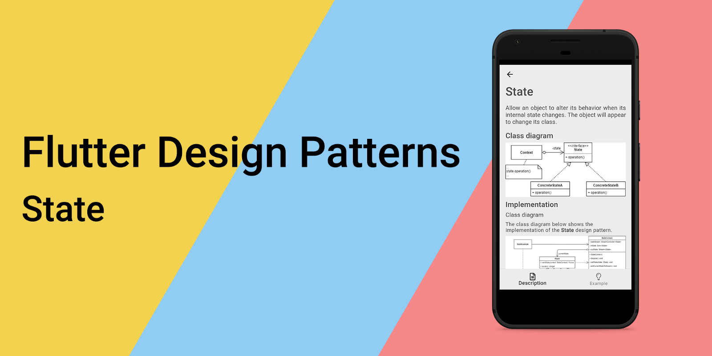
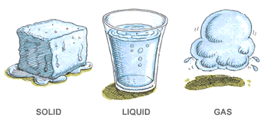
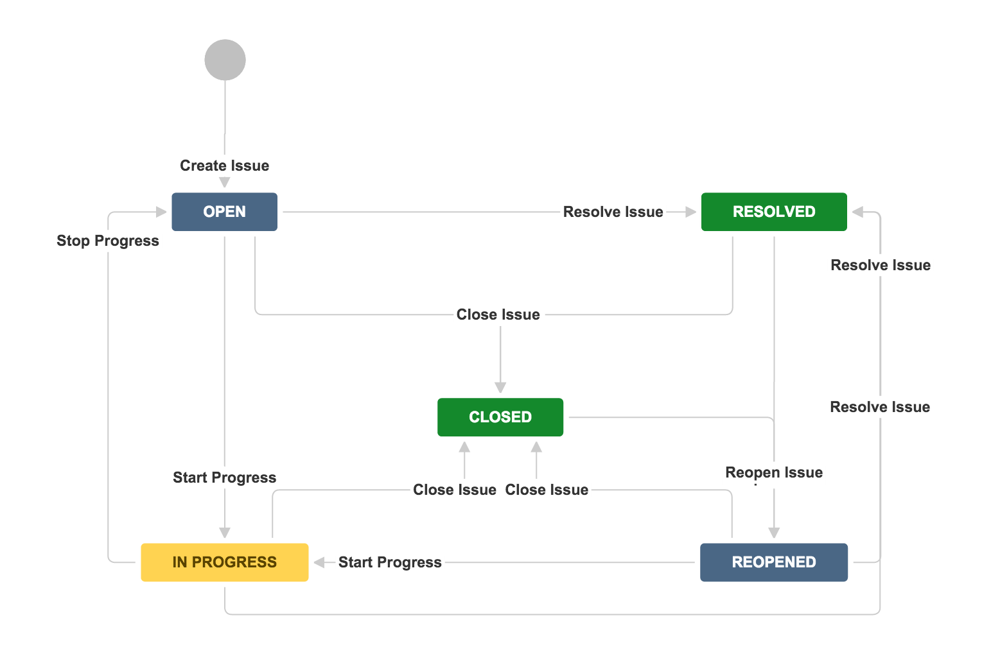
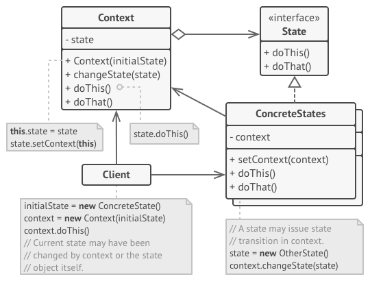
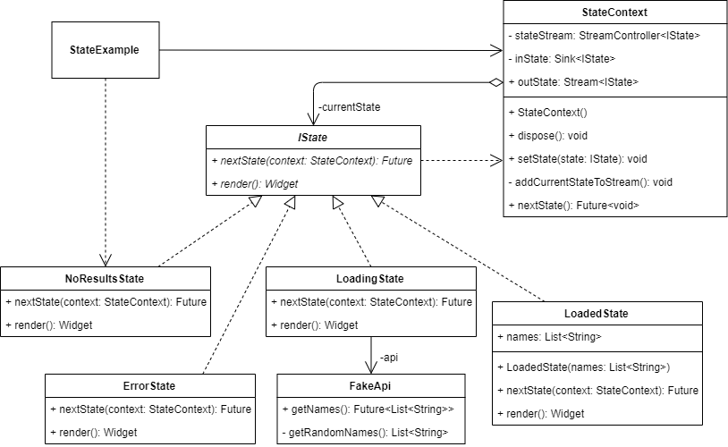
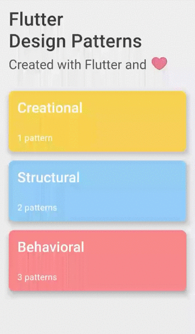

_An overview of the State design pattern and its implementation in Dart and Flutter_



Previously in the series, I have analysed one of the most practical design patterns you can use in day-to-day coding - [Strategy](../2019-11-14-flutter-design-patterns-5-strategy/index.md). In this article, I will analyse and implement a pattern, which has a similar structure to Strategy but is used for a different purpose - the State design pattern.

<!--truncate-->

:::tip
To see all the design patterns in action, check the [Flutter Design Patterns application](https://flutterdesignpatterns.com/).
:::

## What is the State design pattern?



The **State** is a **behavioural** design pattern, which intention in the [GoF book](https://en.wikipedia.org/wiki/Design_Patterns) is described like this:

> _Allow an object to alter its behaviour when its internal state changes. The object will appear to change its class._

To understand a general idea behind the State design pattern, you should be familiar with the concept of a [**Finite-state machine**](https://en.wikipedia.org/wiki/Finite-state_machine). Here you can see an example of a Finite-state machine model of a JIRA task:



At any given moment, there is a **finite number** of **states** in which a task can be in. Each one of the states is unique and acts differently. At any time, the task could be switched from **one state** to **another**. The only limitation - there is a finite set of switching rules (**transitions**) that define the states that could be switched from the current state. That is, a task from a state of _open_ could not be switched to _reopened_, _closed_ could not be switched to _in progress_ or _resolved_, etc.

A similar approach could be applied in OOP to objects. To simply implement the Finite-state machine in code is by using several conditional operators in a single class and selecting the appropriate behaviour depending on the current state of the object. However, by introducing new states, this kind of code becomes very difficult to maintain, states interlace with each other, and the class is committed to a particular state-specific behaviour. I have not even mentioned how difficult it becomes to test this kind of code and the implemented business logic inside.

To resolve these issues, a State design pattern is a great option since for each state a separate State class is created which encapsulates the logic of the state and changes the behaviour of a program or its context. Also, it makes adding new states an easy task, state transitions become explicit.

Let's move to the analysis to understand how the State pattern works and how it could be implemented.

## Analysis

The general structure of the State design pattern looks like this:



- *Context* - maintains an instance of a _ConcreteState_ subclass that defines the current state. The _Context_ class does not know any details about _ConcreteStates_ and communicates with the state object via the _State_ interface. Also, _Context_ provides a setter method to change the current state from _ConcreteStates_ classes;
- *State* - defines an interface that encapsulates the state-specific behaviour and methods. These methods should make sense for all _ConcreteStates_, there should be no methods defined which will never be called from a specific implementation of the _State_ interface;
- *ConcreteStates* - each class implements a behaviour associated with a state of the _Context_. State objects may reference the _Context_ to obtain any required information from the context or to perform the state transition by replacing the state object linked to the _Context_ class (via the exposed setter method);
- *Client* - uses the _Context_ object to reference the current state and initiate its transition, also it may set the initial state for the _Context_ class if needed.

### Strategy vs State

I expect you have noticed, that the structure of the **State** design pattern looks really similar to the **Strategy**. The main difference between these patterns - in the State pattern, the particular states may be aware of each other, while specific strategies almost never know any details about other implementations of the strategy. Basically, this key difference changes the meaning of the pattern and its usage in code.

### Applicability

The State design pattern should be used when you have an object that behaves differently depending on its current state, the number of states is enormous, and the state-specific code changes frequently. By encapsulating each state and its implementation details in a separate class, you can add new states more easily, also you can change the existing states independently of each other. This idea promotes several [**SOLID**](https://en.wikipedia.org/wiki/SOLID) principles which are already discussed in the series: the **Single Responsibility Principle** (each state is encapsulated in its class) and the **Open/Closed Principle** (new states could be introduced without changing existing state classes). Pretty much any logic based on the idea of the Finite-state machine could be implemented using the State design pattern. Some possible real-world examples: managing the order's state in the e-commerce application, showing the appropriate colour in the traffic lights based on the current state, different article state in Medium (draft, submitted, published…), etc. In the implementation section, I will introduce one more relevant use case of the State design pattern - resource loading from API.

## Implementation


The following implementation (or at least the idea behind it) could be applied to pretty much every Flutter application which loads resources from any kind of external source, e.g., API. For instance, when you load resources asynchronously using HTTP and calling the REST API, usually it takes some time to finish the request. How to handle this and not "freeze" the application while the request is finished? What if some kind of error occurs during this request? A simple approach is to use animations, loading/error screens, etc. It could become cumbersome when you need to implement the same logic for different kinds of resources. For this, the State design pattern could help. First of all, you clarify the states which are common for all of your resources:

- **Empty** - there are no results;
- **Loading** - the request to load the resources is in progress;
- **Loaded** - resources are loaded from the external source;
- **Error** - an error occurred while loading the resources.

For all of these states, a common state interface and context are defined which could be used in the application.

Let's dive into the implementation details of the State design pattern and its example in Flutter!

### Class diagram

The class diagram below shows the implementation of the State design pattern:



`IState` defines a common interface for all the specific states:

- `nextState()` - changes the current state in `StateContext` object to the next state;
- `render()` - renders the UI of a specific state.

`NoResultsState`, `ErrorState`, `LoadingState` and `LoadedState` are concrete implementations of the `IState` interface. Each of the states defines its representational UI component via `render()` method, and also uses a specific state (or states, if the next state is chosen from several possible options based on the context) of type `IState` in `nextState()`, which will be changed by calling the `nextState()` method. In addition to this, `LoadedState` contains a list of names, which is injected using the state's constructor, and `LoadingState` uses the `FakeApi` to retrieve a list of randomly generated names.

`StateContext` saves the current state of type `IState` in private `currentState` property, and defines several methods:

- `setState()` - changes the current state;
- `nextState()` - triggers the `nextState()` method on the current state;
- `dispose()` - safely closes the `stateStream` stream.

The current state is exposed to the UI by using the outState stream.

`StateExample` widget contains the `StateContext` object to track and trigger state changes, and also uses the `NoResultsState` as the initial state for the example.

### IState

An interface that defines methods to be implemented by all specific state classes.

```dart title="istate.dart"
abstract interface class IState {
  Future<void> nextState(StateContext context);
  Widget render();
}
```

### StateContext

A class that holds the current state in the `currentState` property and exposes it to the UI via the `outState` stream. The state context also defines a `nextState()` method which is used by the UI to trigger the state's change. The current state itself is changed/set via the `setState()` method by providing the next state of type `IState` as a parameter to it.

```dart title="state_context.dart"
class StateContext {
  final _stateStream = StreamController<IState>();
  Sink<IState> get _inState => _stateStream.sink;
  Stream<IState> get outState => _stateStream.stream;

  late IState _currentState;

  StateContext() {
    _currentState = const NoResultsState();
    _addCurrentStateToStream();
  }

  void dispose() {
    _stateStream.close();
  }

  void setState(IState state) {
    _currentState = state;
    _addCurrentStateToStream();
  }

  void _addCurrentStateToStream() {
    _inState.add(_currentState);
  }

  Future<void> nextState() async {
    await _currentState.nextState(this);

    if (_currentState is LoadingState) {
      await _currentState.nextState(this);
    }
  }
}
```

### Specific implementations of the `IState` interface

`ErrorState` implements the specific state which is used when an unhandled error occurs in API and the error widget should be shown.

```dart title="error_state.dart"
class ErrorState implements IState {
  const ErrorState();

  @override
  Future<void> nextState(StateContext context) async {
    context.setState(const LoadingState());
  }

  @override
  Widget render() {
    return const Text(
      'Oops! Something went wrong...',
      style: TextStyle(
        color: Colors.red,
        fontSize: 24.0,
      ),
      textAlign: TextAlign.center,
    );
  }
}
```

`LoadedState` implements the specific state which is used when resources are loaded from the API without an error and the result widget should be provided to the screen.

```dart title="loaded_state.dart"
class LoadedState implements IState {
  const LoadedState(this.names);

  final List<String> names;

  @override
  Future<void> nextState(StateContext context) async {
    context.setState(const LoadingState());
  }

  @override
  Widget render() {
    return Column(
      children: names
          .map(
            (name) => Card(
              child: ListTile(
                leading: CircleAvatar(
                  backgroundColor: Colors.grey,
                  foregroundColor: Colors.white,
                  child: Text(name[0]),
                ),
                title: Text(name),
              ),
            ),
          )
          .toList(),
    );
  }
}
```

`NoResultsState` implements the specific state which is used when a list of resources is loaded from the API without an error, but the list is empty. Also, this state is used initially in the `StateExample` widget.

```dart title="no_results_state.dart"
class NoResultsState implements IState {
  const NoResultsState();

  @override
  Future<void> nextState(StateContext context) async {
    context.setState(const LoadingState());
  }

  @override
  Widget render() {
    return const Text(
      'No Results',
      style: TextStyle(fontSize: 24.0),
      textAlign: TextAlign.center,
    );
  }
}
```

`LoadingState` implements the specific state which is used on resources loading from the `FakeApi`. Also, based on the loaded result, the next state is set in `nextState()` method.

```dart title="loading_state.dart"
class LoadingState implements IState {
  const LoadingState({
    this.api = const FakeApi(),
  });

  final FakeApi api;

  @override
  Future<void> nextState(StateContext context) async {
    try {
      final resultList = await api.getNames();

      context.setState(
        resultList.isEmpty ? const NoResultsState() : LoadedState(resultList),
      );
    } on Exception {
      context.setState(const ErrorState());
    }
  }

  @override
  Widget render() {
    return const CircularProgressIndicator(
      backgroundColor: Colors.transparent,
      valueColor: AlwaysStoppedAnimation<Color>(
        Colors.black,
      ),
    );
  }
}
```

### FakeApi

A fake API is used to randomly generate a list of person names. The method `getNames()` could return a list of names or throw an Exception (error) at random. Similarly, the `getRandomNames()` method randomly returns a list of names or an empty list. This behaviour is implemented because of demonstration purposes to show all the possible different states in the UI.

```dart title="fake_api.dart"
class FakeApi {
  const FakeApi();

  Future<List<String>> getNames() => Future.delayed(
        const Duration(seconds: 2),
        () {
          if (random.boolean()) return _getRandomNames();

          throw Exception('Unexpected error');
        },
      );

  List<String> _getRandomNames() => List.generate(
        random.boolean() ? 3 : 0,
        (_) => faker.person.name(),
      );
}
```

## Example

First of all, a markdown file is prepared and provided as a pattern's description:


`StateExample` implements the example widget of the State design pattern. It contains the `StateContext`, subscribes to the current state's stream `outState` and provides an appropriate UI widget by executing the state's `render()` method. The current state could be changed by triggering the `changeState()` method (pressing the _Load names_ button in UI).

```dart title="state_example.dart"
class StateExample extends StatefulWidget {
  const StateExample();

  @override
  _StateExampleState createState() => _StateExampleState();
}

class _StateExampleState extends State<StateExample> {
  final _stateContext = StateContext();

  Future<void> _changeState() async {
    await _stateContext.nextState();
  }

  @override
  void dispose() {
    _stateContext.dispose();
    super.dispose();
  }

  @override
  Widget build(BuildContext context) {
    return ScrollConfiguration(
      behavior: const ScrollBehavior(),
      child: SingleChildScrollView(
        padding: const EdgeInsets.symmetric(
          horizontal: LayoutConstants.paddingL,
        ),
        child: Column(
          children: <Widget>[
            PlatformButton(
              materialColor: Colors.black,
              materialTextColor: Colors.white,
              onPressed: _changeState,
              text: 'Load names',
            ),
            const SizedBox(height: LayoutConstants.spaceL),
            StreamBuilder<IState>(
              initialData: const NoResultsState(),
              stream: _stateContext.outState,
              builder: (context, snapshot) => snapshot.data!.render(),
            ),
          ],
        ),
      ),
    );
  }
}
```

`StateExample` widget is only aware of the initial state class - `NoResultsState` but does not know any details about other possible states, since their handling is defined in `StateContext` class. This allows us to separate business logic from the representational code, and add new states of type IState to the application without applying any changes to the UI components.

The final result of the State design pattern's implementation looks like this:



As you can see in the example, the current state is changed by using a single _Load names_ button, states by themselves are aware of other states and set the next state in the `StateContext`.

All of the code changes for the State design pattern and its example implementation could be found [here](https://github.com/mkobuolys/flutter-design-patterns/pull/7).

:::tip
To see the pattern in action, check the [interactive State example](https://flutterdesignpatterns.com/pattern/state).
:::
