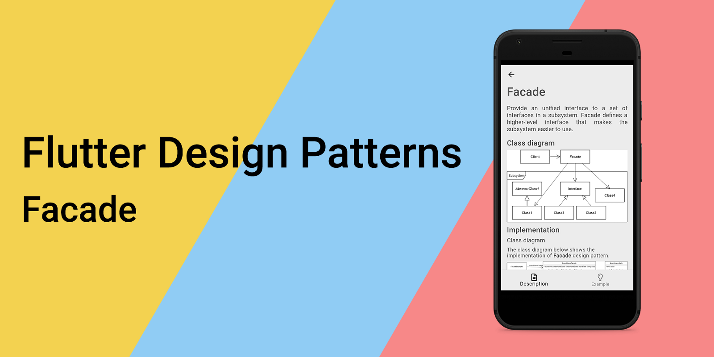
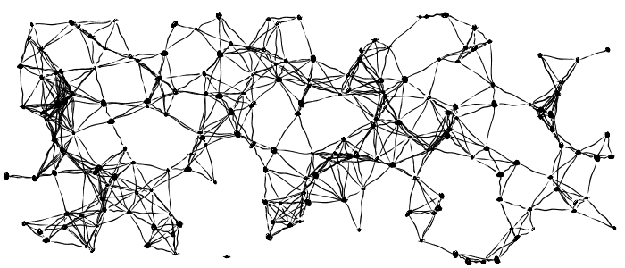
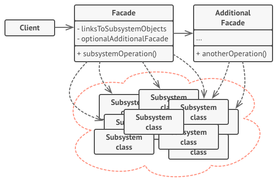
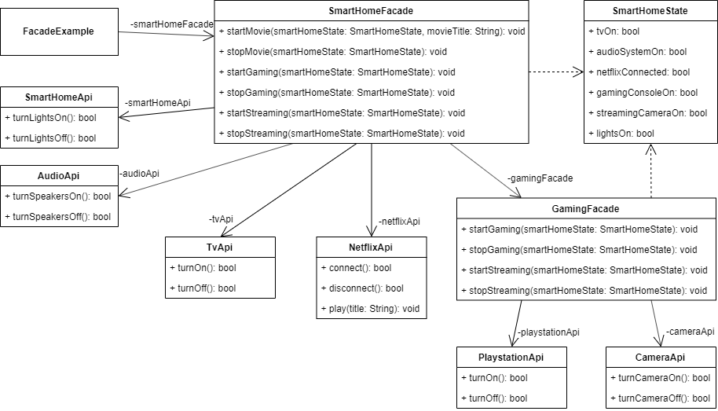

_An overview of the Facade design pattern and its implementation in Dart and Flutter_



In the last [article](../2019-11-20-flutter-design-patterns-6-state/index.md), I analysed one of the behavioural design patterns - State. This time, I would like to represent a pattern that you have probably already used as a developer, but just did not realise that it is a design pattern at all. Therefore, let me introduce you to Facade.

<!--truncate-->

:::tip
To see all the design patterns in action, check the [Flutter Design Patterns application](https://flutterdesignpatterns.com/).
:::

## What is the Facade design pattern?



The **Facade** belongs to the category of **structural** design patterns. Its intention in the [GoF book](https://en.wikipedia.org/wiki/Design_Patterns) is described as:

> _Provide a unified interface to a set of interfaces in a subsystem. Facade defines a higher-level interface that makes the subsystem easier to use._

The Facade pattern is very straightforward - it allows you to create a simplified class that wraps the set of methods/operations of the complex API or subsystem. Clients only communicate with the subsystem through this facade class which forwards all of the requests to the appropriate subsystem objects. As a result, the number of dependencies and references between clients and subsystems is reduced (the weak coupling is promoted between them), and the facade provides a simple interface of the subsystem that is good enough for most clients.

And that is pretty much it. Really, it is that simple! Of course, more information is provided in the analysis and implementation sections, so let's dive deeper into the details.

## Analysis

The general structure of the Facade design pattern looks like this:



- *Facade* - knows which subsystem classes are responsible for a request and delegates the request to _subsystem_ objects. The facade provides methods to access a particular part of the subsystem's functionality;
- *Additional Facade* - can be created when you want to extract a set of operations from the main facade. This additional facade is optional and could be used by both clients and other facades;
- *Subsystem classes* - implement subsystem functionality and handle the work assigned by the _Facade_ object. Subsystem classes do not keep references to the facade;
- *Client* - uses the facade instead of calling the _system classes_ (their objects) directly.

### Applicability

There are two main use cases of the Facade design pattern:

1. When you want to provide a simple interface to a complex system. Usually, subsystems get more complex as they evolve and become harder to use for clients. Hence, the first part of this use case is to provide a simplified class of the most-used features of the subsystem which fit most client requirements. The second part is that the Facade design pattern allows you to reduce the coupling between multiple subsystems by requiring them to communicate only through facades.
2. When the preexisting API is very big and you want to use only a part of it. In this case, the Facade design pattern wraps the needed operations/methods of the API and the client could use this "simplified API" wrapper - facade - instead of referencing the original tremendous API with unnecessary methods which are not used in the program/application code.

## Implementation


Let's say you want to fulfil your dream of having a smart house. You have bought a lot of smart devices from different providers and connected them to your network, but there is a problem - every device provides its interface (call it an API) so it becomes very tedious to manage different devices separately to accomplish a single task.

For instance, you want to watch a movie just like in the cinema. For this, you have to set up your house environment in a similar way:

- Turn off the lights;
- Turn on the TV;
- Turn on the audio system;
- Connect to some kind of movie streaming platform, e.g. Netflix;
- Start playing the movie.

For all of these steps, you have to call several APIs just to set up your environment. Wouldn't it be nice just to say "Start playing The Matrix in home cinema mode" to your smart home assistant or turn on a single switch in your smart home mobile application and execute all of these steps as a single action? To implement this kind of functionality, the Facade design pattern is a great option!

### Class diagram

The class diagram below shows the implementation of the Facade design pattern:



There are several APIs provided to communicate with smart devices (turn them on and off): `AudioApi`, `CameraApi`, `PlaystationApi`, `SmartHomeApi` and `TvApi`. `NetflixApi` provides methods to connect to the Netflix platform, disconnect from it and play the selected movie.

APIs are used by the facade classes:

- `GamingFacade` - uses the `PlaystationApi` and `CameraApi` and provides methods related to gaming and streaming actions;
- `SmartHomeFacade` - uses the `AudioApi`, `CameraApi`, `SmartHomeApi`, `TvApi` and `NetflixApi`. It provides methods for gaming, streaming actions (`GamingFacade` is reused with some additional communication together with other smart devices) and actions related to playing a movie from the Netflix platform.

Both of the facades use the `SmartHomeState` class to save the current state of smart devices.

`FacadeExample` widget contains the `SmartHomeFacade` to communicate with the smart devices using the provided action methods in the facade.

### APIs

`AudioApi` - an API to turn the smart speakers ON/OFF.

```dart title="audio_api.dart"
class AudioApi {
  const AudioApi();

  bool turnSpeakersOn() => true;

  bool turnSpeakersOff() => false;
}
```

`CameraApi` - an API to turn the streaming camera ON/OFF.

```dart title="camera_api.dart"
class CameraApi {
  const CameraApi();

  bool turnCameraOn() => true;

  bool turnCameraOff() => false;
}
```

`NetflixApi` - an API to connect to the Netflix platform, disconnect from it and play the movie.

```dart title="netflix_api.dart"
class NetflixApi {
  const NetflixApi();

  bool connect() => true;

  bool disconnect() => false;

  void play(String title) {
    // ignore: avoid_print
    print("'$title' has started started playing on Netflix.");
  }
}
```

`PlaystationApi` - an API to turn the gaming console (PlayStation) ON/OFF.

```dart title="playstation_api.dart"
class PlaystationApi {
  const PlaystationApi();

  bool turnOn() => true;

  bool turnOff() => false;
}
```

`SmartHomeApi` - an API to turn the smart lights ON/OFF.

```dart title="smart_home_api.dart"
class SmartHomeApi {
  const SmartHomeApi();

  bool turnLightsOn() => true;

  bool turnLightsOff() => false;
}
```

`TvApi` - an API to turn the smart TV ON/OFF.

```dart title="tv_api.dart"
class TvApi {
  const TvApi();

  bool turnOn() => true;

  bool turnOff() => false;
}
```

### Kittens break

If you have read to this point, you definitely deserved this!


### SmartHomeState

A class that holds the current state of all the smart devices at home.

```dart title="smart_home_state.dart"
class SmartHomeState {
  bool tvOn = false;
  bool audioSystemOn = false;
  bool netflixConnected = false;
  bool gamingConsoleOn = false;
  bool streamingCameraOn = false;
  bool lightsOn = true;
}
```

### GamingFacade

A facade class that uses APIs of the PlayStation and streaming camera and provides simplified methods to use them:

- `startGaming()` - uses the `PlaystationApi` to turn the gaming console on;
- `stopGaming()` - uses the `PlaystationApi` to turn the gaming console off;
- `startStreaming()` - uses the `CameraApi` to turn the streaming camera on and calls the `startGaming()` method;
- `stopStreaming()` - uses the `CameraApi` to turn the streaming camera off and calls the `stopGaming()` method.

```dart title="gaming_facade.dart"
class GamingFacade {
  const GamingFacade({
    this.playstationApi = const PlaystationApi(),
    this.cameraApi = const CameraApi(),
  });

  final PlaystationApi playstationApi;
  final CameraApi cameraApi;

  void startGaming(SmartHomeState smartHomeState) {
    smartHomeState.gamingConsoleOn = playstationApi.turnOn();
  }

  void stopGaming(SmartHomeState smartHomeState) {
    smartHomeState.gamingConsoleOn = playstationApi.turnOff();
  }

  void startStreaming(SmartHomeState smartHomeState) {
    smartHomeState.streamingCameraOn = cameraApi.turnCameraOn();
    startGaming(smartHomeState);
  }

  void stopStreaming(SmartHomeState smartHomeState) {
    smartHomeState.streamingCameraOn = cameraApi.turnCameraOff();
    stopGaming(smartHomeState);
  }
}
```

### SmartHomeFacade

A facade class that uses APIs of the smart TV, audio devices, Netflix platform and smart home equipment. Also, `GamingFacade` is used. Several methods are provided to simplify smart home actions:

- `startMovie()` - uses several different APIs to turn off the lights, turn on the smart TV and speakers, connect to the Netflix platform and start playing the selected movie;
- `stopMovie()` - uses several different APIs to disconnect from Netflix, turn off the smart TV and speakers, also turn the lights back on;
- `startGaming()` - uses the `SmartHomeApi` to turn the lights off, turns the smart TV on via the `TvApi` and calls the `GamingFacade` to start the gaming session;
- `stopGaming()` - uses the `GamingFacade` to stop the gaming session, turns the smart TV off using the `TvApi` and turns the lights back on via `SmartHomeApi`;
- `startStreaming()` - uses the `SmartHomeApi` to turn the lights on, turns the smart TV on via the `TvApi` and calls the `GamingFacade` to start the streaming session;
- `stopStreaming()` - uses the `GamingFacade` to stop the streaming session, turns the smart TV off using the `TvApi` and turns the lights back on via `SmartHomeApi`.

```dart title="smart_home_facade.dart"
class SmartHomeFacade {
  const SmartHomeFacade({
    this.gamingFacade = const GamingFacade(),
    this.tvApi = const TvApi(),
    this.audioApi = const AudioApi(),
    this.netflixApi = const NetflixApi(),
    this.smartHomeApi = const SmartHomeApi(),
  });

  final GamingFacade gamingFacade;
  final TvApi tvApi;
  final AudioApi audioApi;
  final NetflixApi netflixApi;
  final SmartHomeApi smartHomeApi;

  void startMovie(SmartHomeState smartHomeState, String movieTitle) {
    smartHomeState.lightsOn = smartHomeApi.turnLightsOff();
    smartHomeState.tvOn = tvApi.turnOn();
    smartHomeState.audioSystemOn = audioApi.turnSpeakersOn();
    smartHomeState.netflixConnected = netflixApi.connect();
    netflixApi.play(movieTitle);
  }

  void stopMovie(SmartHomeState smartHomeState) {
    smartHomeState.netflixConnected = netflixApi.disconnect();
    smartHomeState.tvOn = tvApi.turnOff();
    smartHomeState.audioSystemOn = audioApi.turnSpeakersOff();
    smartHomeState.lightsOn = smartHomeApi.turnLightsOn();
  }

  void startGaming(SmartHomeState smartHomeState) {
    smartHomeState.lightsOn = smartHomeApi.turnLightsOff();
    smartHomeState.tvOn = tvApi.turnOn();
    gamingFacade.startGaming(smartHomeState);
  }

  void stopGaming(SmartHomeState smartHomeState) {
    gamingFacade.stopGaming(smartHomeState);
    smartHomeState.tvOn = tvApi.turnOff();
    smartHomeState.lightsOn = smartHomeApi.turnLightsOn();
  }

  void startStreaming(SmartHomeState smartHomeState) {
    smartHomeState.lightsOn = smartHomeApi.turnLightsOn();
    smartHomeState.tvOn = tvApi.turnOn();
    gamingFacade.startStreaming(smartHomeState);
  }

  void stopStreaming(SmartHomeState smartHomeState) {
    gamingFacade.stopStreaming(smartHomeState);
    smartHomeState.tvOn = tvApi.turnOff();
    smartHomeState.lightsOn = smartHomeApi.turnLightsOn();
  }
}
```

## Example

First of all, a markdown file is prepared and provided as a pattern's description:


`FacadeExample` widget contains the `SmartHomeState` which holds the current state of smart devices and `SmartHomeFacade` to simplify the "smart actions".

```dart title="facade_example.dart"
class FacadeExample extends StatefulWidget {
  const FacadeExample();

  @override
  _FacadeExampleState createState() => _FacadeExampleState();
}

class _FacadeExampleState extends State<FacadeExample> {
  final _smartHomeFacade = const SmartHomeFacade();
  final _smartHomeState = SmartHomeState();

  var _homeCinemaModeOn = false;
  var _gamingModeOn = false;
  var _streamingModeOn = false;

  bool get _isAnyModeOn =>
      _homeCinemaModeOn || _gamingModeOn || _streamingModeOn;

  void _changeHomeCinemaMode(bool activated) {
    if (activated) {
      _smartHomeFacade.startMovie(_smartHomeState, 'Movie title');
    } else {
      _smartHomeFacade.stopMovie(_smartHomeState);
    }

    setState(() => _homeCinemaModeOn = activated);
  }

  void _changeGamingMode(bool activated) {
    if (activated) {
      _smartHomeFacade.startGaming(_smartHomeState);
    } else {
      _smartHomeFacade.stopGaming(_smartHomeState);
    }

    setState(() => _gamingModeOn = activated);
  }

  void _changeStreamingMode(bool activated) {
    if (activated) {
      _smartHomeFacade.startStreaming(_smartHomeState);
    } else {
      _smartHomeFacade.stopStreaming(_smartHomeState);
    }

    setState(() => _streamingModeOn = activated);
  }

  @override
  Widget build(BuildContext context) {
    return ScrollConfiguration(
      behavior: const ScrollBehavior(),
      child: SingleChildScrollView(
        padding: const EdgeInsets.symmetric(
          horizontal: LayoutConstants.paddingL,
        ),
        child: Column(
          children: <Widget>[
            ModeSwitcher(
              title: 'Home cinema mode',
              activated: _homeCinemaModeOn,
              onChanged: !_isAnyModeOn || _homeCinemaModeOn
                  ? _changeHomeCinemaMode
                  : null,
            ),
            ModeSwitcher(
              title: 'Gaming mode',
              activated: _gamingModeOn,
              onChanged:
                  !_isAnyModeOn || _gamingModeOn ? _changeGamingMode : null,
            ),
            ModeSwitcher(
              title: 'Streaming mode',
              activated: _streamingModeOn,
              onChanged: !_isAnyModeOn || _streamingModeOn
                  ? _changeStreamingMode
                  : null,
            ),
            const SizedBox(height: LayoutConstants.spaceXL * 2),
            Column(
              children: <Widget>[
                Row(
                  mainAxisAlignment: MainAxisAlignment.spaceAround,
                  children: <Widget>[
                    DeviceIcon(
                      iconData: FontAwesomeIcons.tv,
                      activated: _smartHomeState.tvOn,
                    ),
                    DeviceIcon(
                      iconData: FontAwesomeIcons.film,
                      activated: _smartHomeState.netflixConnected,
                    ),
                    DeviceIcon(
                      iconData: Icons.speaker,
                      activated: _smartHomeState.audioSystemOn,
                    ),
                  ],
                ),
                const SizedBox(height: LayoutConstants.spaceXL),
                Row(
                  mainAxisAlignment: MainAxisAlignment.spaceAround,
                  children: <Widget>[
                    DeviceIcon(
                      iconData: FontAwesomeIcons.playstation,
                      activated: _smartHomeState.gamingConsoleOn,
                    ),
                    DeviceIcon(
                      iconData: FontAwesomeIcons.video,
                      activated: _smartHomeState.streamingCameraOn,
                    ),
                    DeviceIcon(
                      iconData: FontAwesomeIcons.lightbulb,
                      activated: _smartHomeState.lightsOn,
                    ),
                  ],
                ),
              ],
            ),
          ],
        ),
      ),
    );
  }
}
```

This widget only knows the simplified methods provided by the smart home facade but does not care about their implementation details, dependencies between classes or other facades and the amount of different APIs used to execute the single action. This allows implementing a complicated logic to handle the smart home actions just by turning the switch ON/OFF in `ModeSwitcher` widgets. Also, the implementation details of the smart devices' handling methods in the `SmartHomeFacade` could be changed/improved without affecting the UI code.

The final result of the Facade design pattern's implementation looks like this:


As you can see in the example, it is just enough to turn the switch on/off to communicate with multiple smart devices and change their state through the provided facade methods.

All of the code changes for the Facade design pattern and its example implementation could be found [here](https://github.com/mkobuolys/flutter-design-patterns/pull/8).

:::tip
To see the pattern in action, check the [interactive Facade example](https://flutterdesignpatterns.com/pattern/facade).
:::
