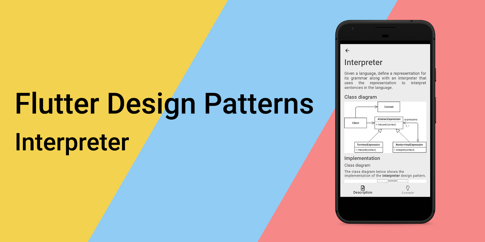
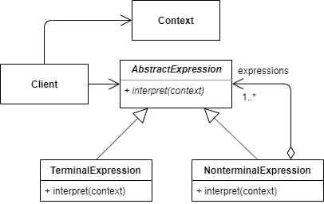
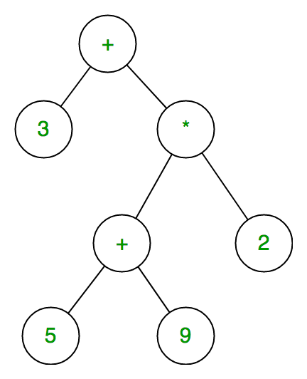
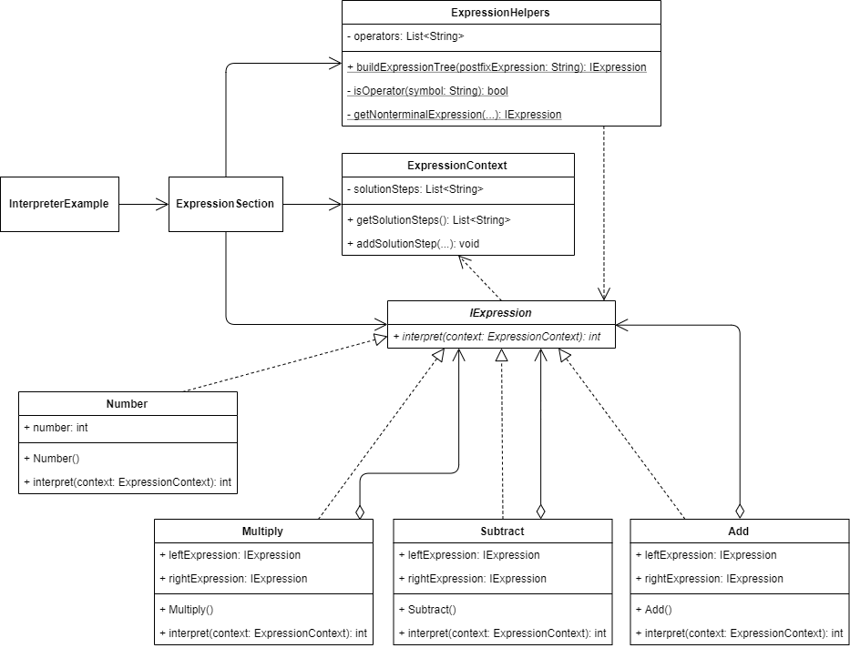
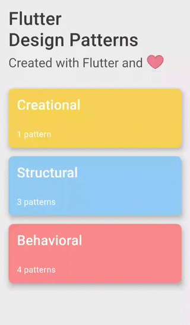

_An overview of the Interpreter design pattern and its implementation in Dart and Flutter_



Previously in the series, I analysed a relatively simple and straightforward design pattern — [Facade](../2019-11-28-flutter-design-patterns-7-facade/index.md). In this article, I will analyse and implement a pattern, which has a similar structure to [Composite](../2019-11-07-flutter-design-patterns-4-composite/index.md) but is used in a different context and for a different purpose — the Interpreter design pattern.

<!--truncate-->

:::tip
To see all the design patterns in action, check the [Flutter Design Patterns application](https://flutterdesignpatterns.com/).
:::

## What is the Interpreter design pattern?


The **Interpreter** is a **behavioural** design pattern, which intention in the [GoF book](https://en.wikipedia.org/wiki/Design_Patterns) is described like this:

> _Given a language, define a representation for its grammar along with an inter­preter that uses the representation to interpret sentences in the language._

The main idea behind this is that a language is a set of valid sentences. Each of those sentences can be constructed by following a set of grammar rules defining the language. Sometimes the program which needs to interpret those sentences process a lot of repeated occurrences of similar requests that are a combination of a set of grammar rules, but all of these requests are composed using the same grammar rules. For instance, arithmetic expressions could be different and provide different results (addition, subtraction, multiplication, division), but all of them are constructed of the same basic rules defining the language of arithmetic expressions.

So where the Interpreter design pattern plays its role? Well, this pattern could represent each of those basic rules as a separate class representing a separate grammar rule and by making a hierarchy of these rules you can define any sentence of that particular language. Also, having a separate class for every grammar rule makes it easy to change the grammar itself and maintain it, adding new kinds of interpret operations becomes an easy task, too.

It could sound complicated at first, but let's move to the analysis and implementation parts where you can find some specific examples of the Interpreter design pattern and its usage.

## Analysis

The class diagram below shows the general structure of the Interpreter design pattern:



- *AbstractExpression* - declares an abstract _interpret()_ operation that is common to all nodes in the abstract syntax tree;
- *TerminalExpression* - implement an _interpret()_ operation associated with terminal symbols in the grammar;
- *NonterminalExpression* - implement an _interpret()_ operation for nonterminal symbols in the grammar. This operation typically calls itself recursively on the variables representing other expressions (grammar rules);
- *Context* - contains the global information of the interpreter which is shared among the expression instances;
- *Client* - builds an abstract syntax tree representing a particular sentence in the language that the grammar defines and invokes the _interpret()_ operation.

### Composite vs Interpreter

The Interpreter design pattern's similarity to the Composite is evident. The Interpreter itself uses the Composite design pattern to build and represent a sentence in a simple language as a tree. But that's all - the Composite pattern is only used to define the static properties of the system, to define the structure (it is a structural design pattern, right?), but the Interpreter represents the language itself, defines the behaviour, has some additional logic to interpret each entity in the tree, shares the same context between them - that's the main difference and the reason why this pattern is considered as a behavioural design pattern.

### Applicability

The usage of the Interpreter design pattern is quite dedicated to interpreting languages in which statements could be represented as an abstract syntax tree. Usually, this kind of language has a simple grammar defined in specific rules e.g. RegEx (regular expression), bar codes, mathematical expressions/notations, etc. Also, the Interpreter design pattern should be used when efficiency is not a critical concern since building and parsing expression trees for the bigger sentences of the language is relatively inefficient (e.g. comparing to parsers and interpreters that translate the expression tree to the other form before interpreting it).

## Implementation


Let's say you want to create a program that parses and solves the postfix mathematical expression. A postfix a.k.a. [Reverse Polish notation](https://en.wikipedia.org/wiki/Reverse_Polish_notation) (RPN) is a mathematical notation in which every operator follows all of its operands e.g. `69+242-*+` which is equivalent to `6+9+(4-2)*2`.

The postfix expression contains two types of symbols - numbers and operators. Talking in [PEG](https://en.wikipedia.org/wiki/Parsing_expression_grammar) terms, numbers are **terminal** symbols and operators are **nonterminal** symbols.

The evaluation of the postfix expression could be implemented using the stack data structure by processing the expression from left to right:

```
for each token in the postfix expression:
  if token is an operator:
    operand_2 ← pop from the stack
    operand_1 ← pop from the stack
    result ← evaluate token with operand_1 and operand_2
    push result back onto the stack
  else if token is an operand:
    push token onto the stack
result ← pop from the stack
```

Let's change this algorithm a little bit. By processing the postfix expression from left to right and instead of evaluating the expression on finding the operator's symbol, we could build an expression tree and evaluate it later. This kind of expression tree would look like this:



Terminal expressions (numbers) do not have any children in the expression tree, but each nonterminal expression (arithmetic operation) has two children - terminal and/or nonterminal expressions. To evaluate this kind of expression tree the program just has to start from the root, recursively execute (interpret) each expression and accumulate the final result.

I expect you have already noticed that the Interpreter design pattern fits the problem of implementing the postfix mathematical expression parser just perfectly. So let's jump straight to the implementation details!

### Class diagram

The class diagram below shows the implementation of the Interpreter design pattern:



`IExpression` defines a common interface for both terminal and nonterminal expressions which implement the `interpret()` method:

- `Number` - a terminal expression for numbers;
- `Multiply` - a nonterminal expression of the multiplication operation;
- `Subtract` - a nonterminal expression of the subtraction operation;
- `Add` - a nonterminal expression of the addition operation.

All of the nonterminal expressions contain left and right expressions of type `IExpression` which are used in the `interpret()` method to calculate the result of the arithmetic operation.

`ExpressionContext` class contains the solution steps of the postfix expression and is used by the `ExpressionSection` widget to retrieve those steps and the `IExpression` interface implementing classes to add a specific solution step to the context.

`ExpressionSection` uses the `ExpressionHelpers` class to build the expression tree of the postfix expression and the `ExpressionContext` to retrieve the solution steps of the specific postfix expression.

### IExpression

An interface that defines the `interpret()` method to be implemented by the terminal and nonterminal expression classes.

```dart title="iexpression.dart"
abstract interface class IExpression {
  int interpret(ExpressionContext context);
}
```

### ExpressionContext

A class to define the context which stores the solution steps of the postfix expression and is used by the `Client` and classes implementing the `IExpression` interface.

```dart title="expression_context.dart"
class ExpressionContext {
  final List<String> _solutionSteps = [];

  List<String> getSolutionSteps() => _solutionSteps;

  void addSolutionStep(String operatorSymbol, int left, int right, int result) {
    final solutionStep =
        '${_solutionSteps.length + 1}) $left $operatorSymbol $right = $result';

    _solutionSteps.add(solutionStep);
  }
}
```

### ExpressionHelpers

A helper class is used by the `Client` to build the expression tree from the provided postfix expression input.

```dart title="expression_helpers.dart"
class ExpressionHelpers {
  const ExpressionHelpers._();

  static final List<String> _operators = ['+', '-', '*'];

  static IExpression buildExpressionTree(String postfixExpression) {
    final expressionStack = ListQueue<IExpression>();

    for (final symbol in postfixExpression.split(' ')) {
      if (_isOperator(symbol)) {
        final rightExpression = expressionStack.removeLast();
        final leftExpression = expressionStack.removeLast();
        final nonterminalExpression =
            _getNonterminalExpression(symbol, leftExpression, rightExpression);

        expressionStack.addLast(nonterminalExpression);
      } else {
        final numberExpression = Number(int.parse(symbol));

        expressionStack.addLast(numberExpression);
      }
    }

    return expressionStack.single;
  }

  static bool _isOperator(String symbol) {
    return _operators.contains(symbol);
  }

  static IExpression _getNonterminalExpression(
    String symbol,
    IExpression leftExpression,
    IExpression rightExpression,
  ) =>
      switch (symbol) {
        '+' => Add(leftExpression, rightExpression),
        '-' => Subtract(leftExpression, rightExpression),
        '*' => Multiply(leftExpression, rightExpression),
        _ => throw Exception('Expression is not defined.'),
      };
}
```

### Number

A terminal expression class to define the number in postfix expression.

```dart title="number.dart"
class Number implements IExpression {
  const Number(this.number);

  final int number;

  @override
  int interpret(ExpressionContext context) => number;
}
```

### Nonterminal expressions

`Add` defines the addition operation and adds the addition solution step to the `ExpressionContext`. The result of this operation - left and right expressions' sum.

```dart title="add.dart"
class Add implements IExpression {
  const Add(this.leftExpression, this.rightExpression);

  final IExpression leftExpression;
  final IExpression rightExpression;

  @override
  int interpret(ExpressionContext context) {
    final left = leftExpression.interpret(context);
    final right = rightExpression.interpret(context);
    final result = left + right;

    context.addSolutionStep('+', left, right, result);

    return result;
  }
}
```

`Subtract` defines the subtraction operation and adds the subtraction solution step to the `ExpressionContext`. The result of this operation - left and right expressions' difference.

```dart title="subtract.dart"
class Subtract implements IExpression {
  const Subtract(this.leftExpression, this.rightExpression);

  final IExpression leftExpression;
  final IExpression rightExpression;

  @override
  int interpret(ExpressionContext context) {
    final left = leftExpression.interpret(context);
    final right = rightExpression.interpret(context);
    final result = left - right;

    context.addSolutionStep('-', left, right, result);

    return result;
  }
}
```

`Multiply` defines the multiplication operation and adds the multiplication solution step to the `ExpressionContext`. The result of this operation - left and right expressions' product.

```dart title="multiply.dart"
class Multiply implements IExpression {
  const Multiply(this.leftExpression, this.rightExpression);

  final IExpression leftExpression;
  final IExpression rightExpression;

  @override
  int interpret(ExpressionContext context) {
    final left = leftExpression.interpret(context);
    final right = rightExpression.interpret(context);
    final result = left * right;

    context.addSolutionStep('*', left, right, result);

    return result;
  }
}
```

## Example

First of all, a markdown file is prepared and provided as a pattern's description:


The `InterpreterExample` widget contains the list of postfix expressions. For each expression in the `postfixExpressions` list, an `ExpressionSection` widget is created and a specific postfix expression is passed to it using the constructor.

```dart title="interpreter_example.dart"
class InterpreterExample extends StatefulWidget {
  const InterpreterExample();

  @override
  _InterpreterExampleState createState() => _InterpreterExampleState();
}

class _InterpreterExampleState extends State<InterpreterExample> {
  final List<String> _postfixExpressions = [
    '20 3 5 * - 2 3 * +',
    '1 1 1 1 1 + + + * 2 -',
    '123 12 1 - - 12 9 * -',
    '9 8 7 6 5 4 3 2 1 + - + - + - + -'
  ];

  @override
  Widget build(BuildContext context) {
    return ScrollConfiguration(
      behavior: const ScrollBehavior(),
      child: SingleChildScrollView(
        padding: const EdgeInsets.symmetric(
          horizontal: LayoutConstants.paddingL,
        ),
        child: Column(
          crossAxisAlignment: CrossAxisAlignment.start,
          children: <Widget>[
            for (var postfixExpression in _postfixExpressions)
              ExpressionSection(
                postfixExpression: postfixExpression,
              ),
          ],
        ),
      ),
    );
  }
}
```

`ExpressionSection` uses the provided `postfixExpression` and builds its expression tree using the `ExpressionHelpers` class on the 'Solve' button click.

```dart title="expression_section.dart"
class ExpressionSection extends StatefulWidget {
  final String postfixExpression;

  const ExpressionSection({
    required this.postfixExpression,
  });

  @override
  _ExpressionSectionState createState() => _ExpressionSectionState();
}

class _ExpressionSectionState extends State<ExpressionSection> {
  final _expressionContext = ExpressionContext();
  final List<String> _solutionSteps = [];

  void _solvePrefixExpression() {
    final solutionSteps = <String>[];
    final expression =
        ExpressionHelpers.buildExpressionTree(widget.postfixExpression);
    final result = expression.interpret(_expressionContext);

    solutionSteps
      ..addAll(_expressionContext.getSolutionSteps())
      ..add('Result: $result');

    setState(() => _solutionSteps.addAll(solutionSteps));
  }

  @override
  Widget build(BuildContext context) {
    return Column(
      crossAxisAlignment: CrossAxisAlignment.start,
      children: <Widget>[
        Text(
          widget.postfixExpression,
          style: Theme.of(context).textTheme.titleLarge,
        ),
        const SizedBox(height: LayoutConstants.spaceM),
        AnimatedCrossFade(
          duration: const Duration(milliseconds: 250),
          firstChild: PlatformButton(
            materialColor: Colors.black,
            materialTextColor: Colors.white,
            onPressed: _solvePrefixExpression,
            text: 'Solve',
          ),
          secondChild: Column(
            crossAxisAlignment: CrossAxisAlignment.start,
            children: <Widget>[
              for (var solutionStep in _solutionSteps)
                Text(
                  solutionStep,
                  style: Theme.of(context).textTheme.titleSmall,
                )
            ],
          ),
          crossFadeState: _solutionSteps.isEmpty
              ? CrossFadeState.showFirst
              : CrossFadeState.showSecond,
        ),
        const SizedBox(height: LayoutConstants.spaceXL),
      ],
    );
  }
}
```

The `buildExpressionTree()` method returns a single nonterminal expression of type `IExpression` which is used to calculate the final result of the provided postfix expression. The widget/method itself does not care about the specific implementation of the nonterminal expression, it only calls the `interpret()` method on the expression to get the final result. Also, a list of solution steps to get the final result is retrieved from the `ExpressionContext` using the `getSolutionSteps()` method and presented in the UI.

The final result of the Interpreter design pattern's implementation looks like this:



As you can see in the example, every postfix expression is evaluated on a 'Solve' button click, all the solution steps are provided to the UI along with the final result.

All of the code changes for the Interpreter design pattern and its example implementation could be found [here](https://github.com/mkobuolys/flutter-design-patterns/pull/9).

:::tip
To see the pattern in action, check the [interactive Interpreter example](https://flutterdesignpatterns.com/pattern/interpreter).
:::
