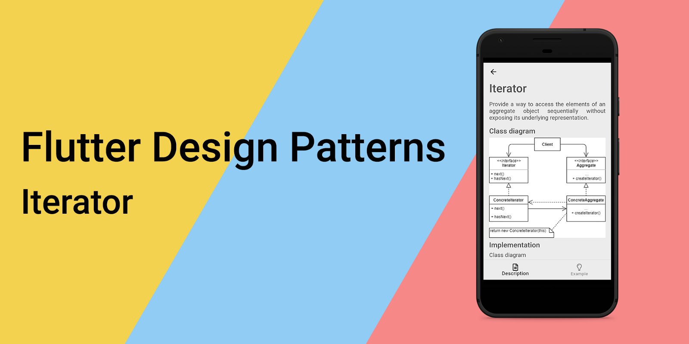
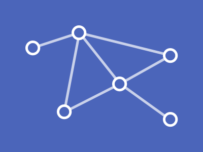
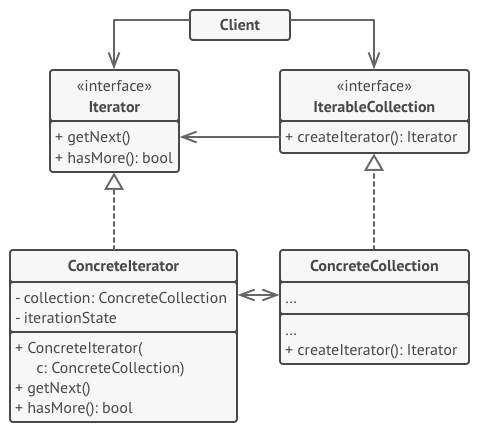
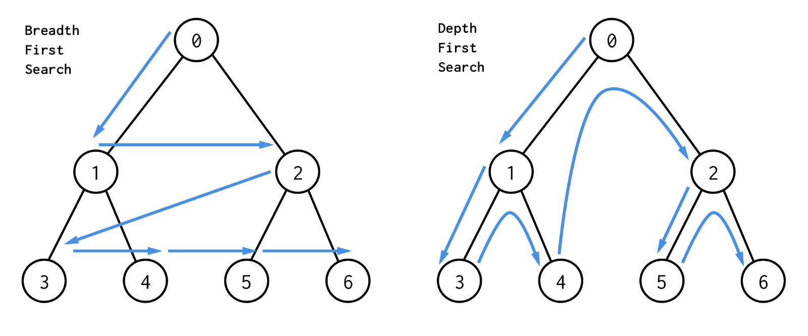
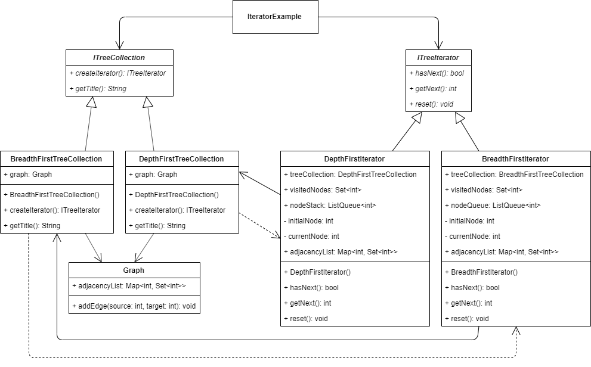
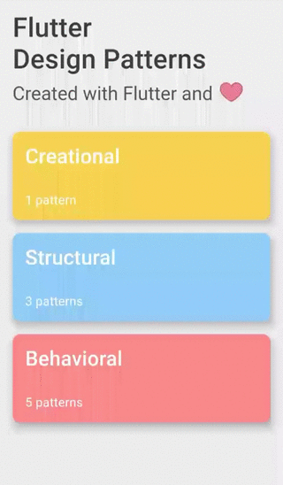

_An overview of the Iterator design pattern and its implementation in Dart and Flutter_



In the last [article](../2019-12-05-flutter-design-patterns-8-interpreter/index.md), I analyzed one of the behavioural design patterns - Interpreter. This time I would like to represent the pattern which specific implementation(s) you have probably already used in your day-to-day programming without even noticing or considering it - the Iterator design pattern.

<!--truncate-->

:::tip
To see all the design patterns in action, check the [Flutter Design Patterns application](https://flutterdesignpatterns.com/).
:::

## What is the Iterator design pattern?



**Iterator** is a **behavioural** design pattern, also known as **Cursor**. The intention of this design pattern is described in the [GoF book](https://en.wikipedia.org/wiki/Design_Patterns):

> _Provide a way to access the elements of an aggregate object sequentially without exposing its underlying representation._

The key idea in this pattern is to take the responsibility for access and traversal out of the list object (or any other collection) and put it into an **iterator** object. This class defines an interface to iterate over the specific collection, access its elements and is responsible to track the current position of the iterator in the collection. Also, the collection interface is defined to store the underlying data structure which will be iterated over and provides a method to create the specific iterator for that particular collection. These abstractions over the collection and its iteration logic allow the client to use different data structures and iterate over them just like they would be the same by using both - iterator and collection - interfaces.

As I have already mentioned, you have probably already used this design pattern (at least its implementation) without even noticing it, especially if you are familiar with the development using Java or C#/.NET. For instance, all Java collections provide some internal implementations of the Iterator interface which is used to iterate over collection elements. In the C# context, there are some special container types capable of holding a collection of values e.g. _List_, and _ArrayList_, which come with the possibility to iterate over them.

Let's move to the analysis and implementation parts to understand the details about this pattern and learn how to implement our custom iterator!

## Analysis

The general structure of the Iterator design pattern looks like this:



- *IterableCollection* - defines an interface for creating an _Iterator_ object;
- *ConcreteCollection* - implements the _Iterator_ creation interface to return a new instance of a particular specific iterator class each time the client requests one. This class could also contain additional code/logic e.g. to store the data structure which should be iterated;
- *Iterator* - defines an interface for accessing and traversing elements of the collection;
- *ConcreteIterator* - implements the _Iterator_ interface. Also, this class should track the traversal progress e.g. the current position in the traversal of the collection;
- *Client* - references and uses both collections and iterators via their interfaces.

### Applicability

The Iterator design pattern should be used when you want to abstract the iteration logic of the collection and access its elements without exposing the internal structure of the collection itself. This promotes the idea of the [Single Responsibility Principle](https://en.wikipedia.org/wiki/Single-responsibility_principle) as well as the [DRY](https://en.wikipedia.org/wiki/Don't_repeat_yourself) (**D**on't **R**epeat **Y**ourself) principle.

Furthermore, this pattern is useful when you want to traverse the same collection in several different ways, depending on what you want to accomplish. For instance, you want to have one iterator to iterate over the whole collection and another to iterate only over the specific collection items which match the filter criteria, or, let's say, iterate over every second element in the collection. For this case, you do not need to bloat a single interface to implement different iteration algorithms, you just create different iterator classes implementing the same interface with their specific iteration logic.

Finally, the Iterator design pattern could help when you are not sure about the specific implementation of your data structures beforehand, but you want to implement the logic to traverse them and use it in your client. The pattern provides a couple of generic interfaces for both collections and iterators. Given that your code now uses these interfaces, it will still work if you pass it to various kinds of collections and iterators that implement these interfaces.

## Implementation


First of all, to understand the implementation part better, you should be familiar with the tree data structure. If you are not following the series, I have explained it when analysing the [Composite](../2019-11-07-flutter-design-patterns-4-composite/index.md) design pattern, but if you have already read this article - *10 points for Gryffindor*!

This time we will investigate one of the fundamental parts of [graph theory](https://en.wikipedia.org/wiki/Graph_theory) - the graph traversal. The graph traversal is defined as:

> _In computer science, graph traversal (also known as graph search) refers to the process of visiting (checking and/or updating) each vertex in a graph. Such traversals are classified by the order in which the vertices are visited. Tree traversal is a special case of graph traversal._

This time, we will focus only on the tree traversal case. There are several graph/tree traversal algorithms available out there:

- **Depth-first search (DFS)** - visits the child vertices before visiting the sibling vertices; that is, it traverses the depth of any particular path before exploring its breadth;
- **Breadth-first search (BFS)** - visits the sibling vertices before visiting the child vertices.



Let's say you want to experiment with the tree traversal using different algorithms. Furthermore, the visualization of these algorithms should be provided to the UI where you can switch between different algorithms easily, but use the same tree data structure for both of them. Also, you want to hide the implementation details of how the tree data structure should be iterated for each algorithm. To implement this, the Iterator design pattern is an obvious choice.

### Class diagram

The class diagram below shows the implementation of the Iterator design pattern:



`ITreeCollection` defines a common interface for all the specific tree collections:

- `createIterator()` - creates an iterator for the specific tree collection;
- `getTitle()` - returns the title of the tree collection which is used in the UI.

`DepthFirstTreeCollection` and `BreadthFirstTreeCollection` are concrete implementations of the `ITreeCollection` interface. `DepthFirstTreeCollection` creates the `DepthFirstIterator` while `BreadthFirstTreeCollection` creates the `BreadthFirstIterator`. Also, both of these collections store the Graph object to save the tree data structure itself.

`ITreeIterator` defines a common interface for all specific iterators of the tree collection:

- `hasNext()` - returns true if the iterator did not reach the end of the collection yet, otherwise false;
- `getNext()` - returns the next value of the collection;
- `reset()` - resets the iterator and sets its current position of it to the beginning.

`DepthFirstIterator` and `BreadthFirstIterator` are concrete implementations of the `ITreeIterator` interface. `DepthFirstIterator` implements the **depth-first** algorithm to traverse the tree collection. Correspondingly, `BreadthFirstIterator` implements the **breadth-first** algorithm. The main difference between these two algorithms is the order in which all of the nodes are visited. Hence, the depth-first algorithm is implemented using the **stack** data structure while the breadth-first algorithm uses the **queue** data structure to store nodes (vertices) that should be visited next.

`IteratorExample` references both interfaces - `ITreeCollection` and `ITreeIterator` - to specify the required tree collection and create an appropriate iterator for it.

### Graph

A class that stores the [adjacency list](https://en.wikipedia.org/wiki/Adjacency_list) of the graph. It is stored as a map data structure where the key represents the node's (vertex) id and the value is a list of vertices (ids of other nodes) adjacent to the vertex of that id (key). Also, this class defines the `addEdge()` method to add an edge to the adjacency list.

```dart title="graph.dart"
class Graph {
  final Map<int, Set<int>> adjacencyList = {};

  void addEdge(int source, int target) => adjacencyList.containsKey(source)
      ? adjacencyList[source]!.add(target)
      : adjacencyList[source] = {target};
}
```

### ITreeCollection

An interface that defines methods to be implemented by all specific tree collection classes.

```dart title="itree_collection.dart"
abstract interface class ITreeCollection {
  ITreeIterator createIterator();
  String getTitle();
}
```

### Tree collections

`DepthFirstTreeCollection` - a tree collection class that stores the graph object and implements the `createIterator()` method to create an iterator that uses the depth-first algorithm to traverse the graph.

```dart title="depth_first_tree_collection.dart"
class DepthFirstTreeCollection implements ITreeCollection {
  const DepthFirstTreeCollection(this.graph);

  final Graph graph;

  @override
  ITreeIterator createIterator() => DepthFirstIterator(this);

  @override
  String getTitle() => 'Depth-first';
}
```

`BreadthFirstTreeCollection` - a tree collection class that stores the graph object and implements the `createIterator()` method to create an iterator that uses the breadth-first algorithm to traverse the graph.

```dart title="breadth_first_tree_collection.dart"
class BreadthFirstTreeCollection implements ITreeCollection {
  const BreadthFirstTreeCollection(this.graph);

  final Graph graph;

  @override
  ITreeIterator createIterator() => BreadthFirstIterator(this);

  @override
  String getTitle() => 'Breadth-first';
}
```

### ITreeIterator

An interface that defines methods to be implemented by all specific iterators of the tree collection.

```dart title="itree_iterator.dart"
abstract interface class ITreeIterator {
  bool hasNext();
  int? getNext();
  void reset();
}
```

### Tree iterators

`DepthFirstIterator` - a specific implementation of the tree iterator which traverses the tree collection by using the depth-first algorithm. This algorithm uses the **stack** data structure to store vertices (nodes) which should be visited next using the `getNext()` method.

```dart title="depth_first_iterator.dart"
class DepthFirstIterator implements ITreeIterator {
  final DepthFirstTreeCollection treeCollection;
  final Set<int> visitedNodes = <int>{};
  final ListQueue<int> nodeStack = ListQueue<int>();

  final _initialNode = 1;
  late int _currentNode;

  DepthFirstIterator(this.treeCollection) {
    _currentNode = _initialNode;
    nodeStack.add(_initialNode);
  }

  Map<int, Set<int>> get adjacencyList => treeCollection.graph.adjacencyList;

  @override
  bool hasNext() => nodeStack.isNotEmpty;

  @override
  int? getNext() {
    if (!hasNext()) return null;

    _currentNode = nodeStack.removeLast();
    visitedNodes.add(_currentNode);

    if (adjacencyList.containsKey(_currentNode)) {
      for (final node in adjacencyList[_currentNode]!
          .where((n) => !visitedNodes.contains(n))) {
        nodeStack.addLast(node);
      }
    }

    return _currentNode;
  }

  @override
  void reset() {
    _currentNode = _initialNode;
    visitedNodes.clear();
    nodeStack.clear();
    nodeStack.add(_initialNode);
  }
}
```

`BreadthFirstIterator` - a specific implementation of the tree iterator which traverses the tree collection by using the breadth-first algorithm. This algorithm uses the **queue** data structure to store vertices (nodes) that should be visited next using the `getNext()` method.

```dart title="breadth_first_iterator.dart"
class BreadthFirstIterator implements ITreeIterator {
  final BreadthFirstTreeCollection treeCollection;
  final Set<int> visitedNodes = <int>{};
  final ListQueue<int> nodeQueue = ListQueue<int>();

  final _initialNode = 1;
  late int _currentNode;

  BreadthFirstIterator(this.treeCollection) {
    _currentNode = _initialNode;
    nodeQueue.add(_initialNode);
  }

  Map<int, Set<int>> get adjacencyList => treeCollection.graph.adjacencyList;

  @override
  bool hasNext() => nodeQueue.isNotEmpty;

  @override
  int? getNext() {
    if (!hasNext()) return null;

    _currentNode = nodeQueue.removeFirst();
    visitedNodes.add(_currentNode);

    if (adjacencyList.containsKey(_currentNode)) {
      for (final node in adjacencyList[_currentNode]!
          .where((n) => !visitedNodes.contains(n))) {
        nodeQueue.addLast(node);
      }
    }

    return _currentNode;
  }

  @override
  void reset() {
    _currentNode = _initialNode;
    visitedNodes.clear();
    nodeQueue.clear();
    nodeQueue.add(_initialNode);
  }
}
```

## Example

First of all, a markdown file is prepared and provided as a pattern's description:


The `IteratorExample` widget is responsible for building the tree (graph) using the `Graph` class and contains a list of tree collection objects. After selecting the specific tree collection from the list and triggering the `traverseTree()` method, an appropriate iterator of that particular tree collection is created and used to traverse the tree data structure.

```dart title="iterator_example.dart"
class IteratorExample extends StatefulWidget {
  const IteratorExample();

  @override
  _IteratorExampleState createState() => _IteratorExampleState();
}

class _IteratorExampleState extends State<IteratorExample> {
  final List<ITreeCollection> treeCollections = [];

  var _selectedTreeCollectionIndex = 0;
  int? _currentNodeIndex = 0;
  var _isTraversing = false;

  @override
  void initState() {
    super.initState();

    final graph = _buildGraph();

    treeCollections
      ..add(BreadthFirstTreeCollection(graph))
      ..add(DepthFirstTreeCollection(graph));
  }

  Graph _buildGraph() => Graph()
    ..addEdge(1, 2)
    ..addEdge(1, 3)
    ..addEdge(1, 4)
    ..addEdge(2, 5)
    ..addEdge(3, 6)
    ..addEdge(3, 7)
    ..addEdge(4, 8);

  void _setSelectedTreeCollectionIndex(int? index) {
    if (index == null) return;

    setState(() => _selectedTreeCollectionIndex = index);
  }

  Future<void> _traverseTree() async {
    _toggleIsTraversing();

    final iterator =
        treeCollections[_selectedTreeCollectionIndex].createIterator();

    while (iterator.hasNext()) {
      if (!mounted) return;

      setState(() => _currentNodeIndex = iterator.getNext());

      await Future.delayed(const Duration(seconds: 1));
    }

    _toggleIsTraversing();
  }

  void _toggleIsTraversing() => setState(() => _isTraversing = !_isTraversing);

  void _reset() => setState(() => _currentNodeIndex = 0);

  Color _getBackgroundColor(int index) =>
      _currentNodeIndex == index ? Colors.red[200]! : Colors.white;

  @override
  Widget build(BuildContext context) {
    return ScrollConfiguration(
      behavior: const ScrollBehavior(),
      child: SingleChildScrollView(
        padding: const EdgeInsets.symmetric(
          horizontal: LayoutConstants.paddingL,
        ),
        child: Column(
          children: <Widget>[
            TreeCollectionSelection(
              treeCollections: treeCollections,
              selectedIndex: _selectedTreeCollectionIndex,
              onChanged:
                  !_isTraversing ? _setSelectedTreeCollectionIndex : null,
            ),
            const SizedBox(height: LayoutConstants.spaceL),
            Wrap(
              alignment: WrapAlignment.center,
              children: <Widget>[
                PlatformButton(
                  materialColor: Colors.black,
                  materialTextColor: Colors.white,
                  onPressed: _currentNodeIndex == 0 ? _traverseTree : null,
                  text: 'Traverse',
                ),
                PlatformButton(
                  materialColor: Colors.black,
                  materialTextColor: Colors.white,
                  onPressed:
                      _isTraversing || _currentNodeIndex == 0 ? null : _reset,
                  text: 'Reset',
                ),
              ],
            ),
            const SizedBox(height: LayoutConstants.spaceL),
            Box(
              nodeId: 1,
              color: _getBackgroundColor(1),
              child: Row(
                mainAxisAlignment: MainAxisAlignment.spaceEvenly,
                children: <Widget>[
                  Box(
                    nodeId: 2,
                    color: _getBackgroundColor(2),
                    child: Box(
                      nodeId: 5,
                      color: _getBackgroundColor(5),
                    ),
                  ),
                  Box(
                    nodeId: 3,
                    color: _getBackgroundColor(3),
                    child: Row(
                      mainAxisAlignment: MainAxisAlignment.spaceEvenly,
                      children: <Widget>[
                        Box(
                          nodeId: 6,
                          color: _getBackgroundColor(6),
                        ),
                        Box(
                          nodeId: 7,
                          color: _getBackgroundColor(7),
                        ),
                      ],
                    ),
                  ),
                  Box(
                    nodeId: 4,
                    color: _getBackgroundColor(4),
                    child: Box(
                      nodeId: 8,
                      color: _getBackgroundColor(8),
                    ),
                  ),
                ],
              ),
            ),
          ],
        ),
      ),
    );
  }
}
```

As you can see in the `traverseTree()` method, all the implementation details of the tree collection's traversal are hidden from the client, it only uses the `hasNext()` and `getNext()` methods defined by the `ITreeIterator` interface to iterate through all of the vertices (nodes) of the built `Graph` object (tree).

The final result of the Iterator design pattern's implementation looks like this:



As you can see in the example, by selecting the specific tree collection and creating its iterator, the algorithm to traverse the tree also changes and it is visually noticeable in the demonstration.

All of the code changes for the Iterator design pattern and its example implementation could be found [here](https://github.com/mkobuolys/flutter-design-patterns/pull/10).

:::tip
To see the pattern in action, check the [interactive Iterator example](https://flutterdesignpatterns.com/pattern/iterator).
:::
