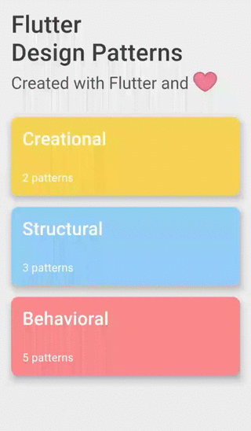

_An overview of the Factory Method design pattern and its implementation in Dart and Flutter_


Previously in the series, I analysed a design pattern that is commonly used in our day-to-day programming, sometimes even without considering it - [Iterator](../2019-12-12-flutter-design-patterns-9-iterator/index.md). In this article, I would like to analyse and implement one of the creational design patterns - Factory Method.

<!--truncate-->

:::tip
To see all the design patterns in action, check the [Flutter Design Patterns application](https://flutterdesignpatterns.com/).
:::

## What is the Factory Method design pattern?


**Factory Method**, also known as **Virtual Constructor**, belongs to the category of **creational** design patterns. The intention of this design pattern is described in the [GoF book](https://en.wikipedia.org/wiki/Design_Patterns):

> _Define an interface for creating an object, but let subclasses decide which class to instantiate. Factory Method lets a class defer instantiation to sub­classes._

That is, the Factory Method design pattern defines an interface for a class responsible for creating an object, hence deferring the instantiation to specific classes implementing this interface. This resolves the issue of creating objects directly within the class which uses them.

Also, it enables compile-time flexibility via subclassing. When objects are created within the class, it is very inflexible since you cannot change the instantiation of the object independently from the class - the class is committed to a particular object. By implementing the pattern, subclasses can be written to redefine the way an object is created.

Finally, this pattern removes the direct binding of application-specific classes into the code. As a result, the code only deals with the interface of specific objects created using factory methods.

To understand the Factory Method design pattern better, let's dive in by analysing its structure and implementation in more detail!

## Analysis

The general structure of the Factory Method design pattern looks like this:


- *Creator* - declares the factory method, which returns new product objects. The factory method could be declared as abstract to force all subclasses to implement it. This class may also provide a default implementation for the factory method that returns a default _ConcreteProduct_ object.
- *ConcreteCreator* - overrides the factory method to return an instance of _ConcreteProduct_. Note that the factory method does not have to create a new product instance every single time e.g. an instance of the object could be stored in the cache and returned later when calling the factory method.
- *Product* - defines a common interface to all objects the factory method creates.
- *ConcreteProduct* - implements the _Product_ interface; the instance of this object is returned by the specific _ConcreteCreator_ class.

### Applicability

The primary purpose of the Factory Method design pattern is to separate product construction code from the code that actually uses that product. As a result, when you need to add a new concrete product, only a new creator subclass should be created which overrides the factory method. So this pattern is a great option when you don't know the exact types and dependencies of the objects your code should work with.

As mentioned before, the factory method does not have to create a new instance of the object every single time. So if you want to save some system resources and reuse the already existing object instead of rebuilding it, implementing the Factory Method could be a way to go, e.g. by introducing a caching layer or storage which keeps the track of already created objects and returns the requested object when calling the factory method on a specific creator subclass.

## Implementation


Since you are reading this article, probably you have already used Flutter and/or want to get familiar with it (thank you, Captain Obvious). The main advantage of using Flutter is delivering applications for different platforms by using the same code base. However…

> _"With great power comes great responsibility."_

Even though you are using the same code base with Flutter, usually there is a demand that UI components should look different on different platforms. The simplest imaginable use case in Flutter context - showing the Material or Cupertino style widgets based on whether you are using accordingly an Android or iOS device.

To show an appropriate widget in the UI, you should check the current platform and then provide either Material or Cupertino widget (a simple if statement should work in this case). In general, this kind of implementation is inflexible:

- The current platform should be checked in every place where different widgets for different platforms are needed;
- It is hard to maintain the code when the new platform is introduced (for instance, Web) - additional checks should be introduced, and the if statements would expand.

The Factory Method design pattern offers a relatively simple solution to this problem: every platform-specific widget has its concrete creator subclass extending the common abstract creator class. By introducing this, the UI code should only care about the common interface (base class) of all the specific components and based on the current platform an appropriate factory method would be called to create the widget - the code does not have to reference specific implementations of these components anymore.

As an example of this approach, we will create a page where you can select the current platform (it is simulated using the radio buttons) and based on that an appropriate alert dialog (Material or Cupertino widget) would be shown.

### Class diagram

The class diagram below shows the implementation of the Factory Method design pattern:


`CustomDialog` is an abstract class that is used as a base class for all the specific alert dialogs:

- `getTitle()` - an abstract method that returns the title of the alert dialog. Used in the UI;
- `create()` - an abstract method that returns the specific implementation (UI component/widget) of the alert dialog;
- `show()` - calls the `create()` method to build (create) the alert dialog and show it in the UI.

`AndroidAlertDialog` and `IosAlertDialog` are concrete classes that extend the `CustomDialog` class and implement its abstract methods. `AndroidAlertDialog` creates a Material style alert dialog of type `AlertDialog` while the `IosAlertDialog` creates a Cupertino style alert dialog of type `CupertinoAlertDialog`.

`Widget`, `CupertinoAlertDialog` and `AlertDialog` are the already implemented classes (widgets) of the Flutter library.

`FactoryMethodExample` contains the `CustomDialog` class to show the specific alert dialog of that type using the `show()` method.

### CustomDialog

An abstract class for showing custom dialogs. `CustomDialog` class implements the main logic to show the dialog (`show()` method). For the dialog creation itself, only the header of `create()` method is provided and every specific class extending the `CustomDialog` should implement it by returning a custom `Widget` object of that particular alert dialog.

```dart title="custom_dialog.dart"
abstract class CustomDialog {
  const CustomDialog();

  String getTitle();
  Widget create(BuildContext context);

  Future<void> show(BuildContext context) => showDialog<void>(
        context: context,
        barrierDismissible: false,
        builder: create,
      );
}
```

### Alert dialogs

`AndroidAlertDialog` - a concrete alert dialog class that extends the `CustomDialog` and implements the `create()` method by using the Material `AlertDialog` widget.

```dart title="android_alert_dialog.dart"
class AndroidAlertDialog extends CustomDialog {
  const AndroidAlertDialog();

  @override
  String getTitle() => 'Android Alert Dialog';

  @override
  Widget create(BuildContext context) {
    return AlertDialog(
      title: Text(getTitle()),
      content: const Text('This is the material-style alert dialog!'),
      actions: <Widget>[
        TextButton(
          onPressed: Navigator.of(context).pop,
          child: const Text('Close'),
        ),
      ],
    );
  }
}
```

`IosAlertDialog` - a concrete alert dialog class that extends the `CustomDialog` and implements the `create()` method by using the Cupertino (iOS) `CupertinoAlertDialog` widget.

```dart title="ios_alert_dialog.dart"
class IosAlertDialog extends CustomDialog {
  const IosAlertDialog();

  @override
  String getTitle() => 'iOS Alert Dialog';

  @override
  Widget create(BuildContext context) {
    return CupertinoAlertDialog(
      title: Text(getTitle()),
      content: const Text('This is the cupertino-style alert dialog!'),
      actions: <Widget>[
        CupertinoButton(
          onPressed: Navigator.of(context).pop,
          child: const Text('Close'),
        ),
      ],
    );
  }
}
```

## Example

First of all, a markdown file is prepared and provided as a pattern's description:


`FactoryMethodExample` contains a list of `CustomDialog` objects. After selecting the specific dialog from the list and triggering the `showCustomDialog()` method, a selected dialog is shown by calling the `show()` method on it.

```dart title="factory_method_example.dart"
class FactoryMethodExample extends StatefulWidget {
  const FactoryMethodExample();

  @override
  _FactoryMethodExampleState createState() => _FactoryMethodExampleState();
}

class _FactoryMethodExampleState extends State<FactoryMethodExample> {
  final List<CustomDialog> customDialogList = const [
    AndroidAlertDialog(),
    IosAlertDialog(),
  ];

  var _selectedDialogIndex = 0;

  Future _showCustomDialog(BuildContext context) async {
    final selectedDialog = customDialogList[_selectedDialogIndex];

    await selectedDialog.show(context);
  }

  void _setSelectedDialogIndex(int? index) {
    if (index == null) return;

    setState(() => _selectedDialogIndex = index);
  }

  @override
  Widget build(BuildContext context) {
    return ScrollConfiguration(
      behavior: const ScrollBehavior(),
      child: SingleChildScrollView(
        padding: const EdgeInsets.symmetric(
          horizontal: LayoutConstants.paddingL,
        ),
        child: Column(
          children: <Widget>[
            DialogSelection(
              customDialogList: customDialogList,
              selectedIndex: _selectedDialogIndex,
              onChanged: _setSelectedDialogIndex,
            ),
            const SizedBox(height: LayoutConstants.spaceL),
            PlatformButton(
              materialColor: Colors.black,
              materialTextColor: Colors.white,
              onPressed: () => _showCustomDialog(context),
              text: 'Show Dialog',
            ),
          ],
        ),
      ),
    );
  }
}
```

As you can see in the `showCustomDialog()` method, it does not care about the specific implementation of the alert dialog as long as it extends the `CustomDialog` class and provides the `show()` method. Also, the implementation of the dialog widget is encapsulated and defined in a separate factory method (inside the specific implementation of `CustomDialog` class - `create()` method). Hence, the UI logic is not tightly coupled to any specific alert dialog class which implementation details could be changed independently without affecting the implementation of the UI itself.

The final result of the Factory Method design pattern's implementation looks like this:



As you can see in the example, by selecting the specific alert dialog style and triggering the _'Show Dialog'_ button, an appropriate dialog is created by the factory method and provided to the user.

All of the code changes for the Factory Method design pattern and its example implementation could be found [here](https://github.com/mkobuolys/flutter-design-patterns/pull/11).

:::tip
To see the pattern in action, check the [interactive Factory Method example](https://flutterdesignpatterns.com/pattern/factory-method).
:::
