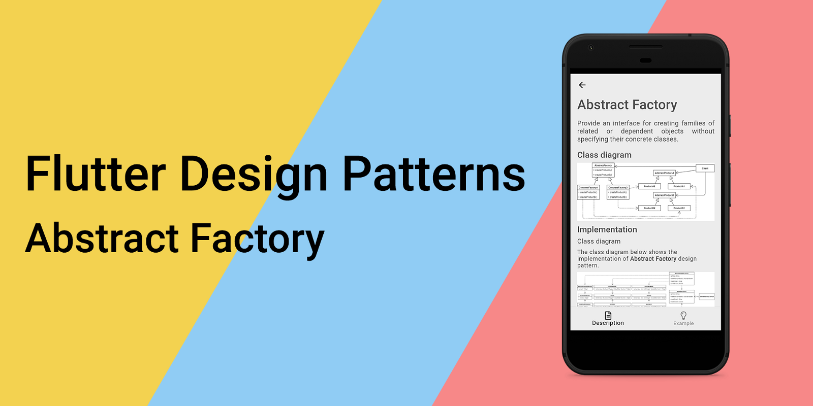
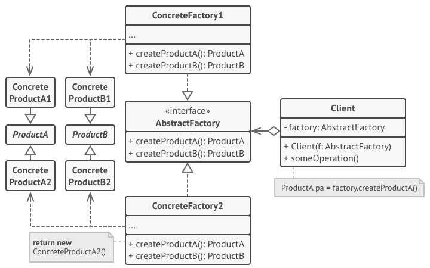
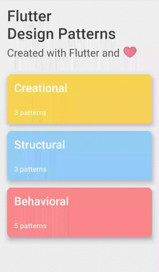

_An overview of the Abstract Factory design pattern and its implementation in Dart and Flutter_



In the last [article](../2019-12-19-flutter-design-patterns-10-factory-method/index.md), I analysed the Factory Method design pattern. This time I would like to analyse and implement an OOP design pattern, which has a similar purpose, even a similar name, but is more flexible and suits the structure of big projects better than the Factory Method design pattern - it is the Abstract Factory.

<!--truncate-->

:::tip
To see all the design patterns in action, check the [Flutter Design Patterns application](https://flutterdesignpatterns.com/).
:::

## What is the Abstract Factory design pattern?


**Abstract Factory** is a **creational** design pattern, also known as **Kit**. Its intention in the [GoF book](https://en.wikipedia.org/wiki/Design_Patterns) is described as:

> _Provide an interface for creating families of related or dependent objects without specifying their concrete classes._

The main purpose of the Abstract Factory design pattern is to encapsulate creating a family of objects in a separate factory object, hence abstracting the process of object creation. For all supported families of objects, a common interface for creating a family of objects is defined, and then a concrete factory class is created to implement this interface.

If you follow this series, I expect you have just had a sense of deja vu, haven't you? The Factory Method design pattern has pretty much the same intention and purpose. Yes, it is true, simply like that. But why there is a separate factory pattern, then? The main difference between these two patterns is that the Abstract Factory pattern provides a way to create a **family of related objects** - a single factory is responsible for creating several objects. As a result, you don't need to provide a separate factory for each specific class/component. In fact, you can consider the Factory Method design pattern as a [subset](https://en.wikipedia.org/wiki/Subset) of the Abstract Factory pattern - the Abstract Factory consists of several factory methods where each one of them creates only one specific object.

The Abstract Factory design pattern makes the creation of the objects more flexible:

- _Compile-time_ flexibility - the way objects are created can be implemented and changed independently from clients by defining new (sub)classes;
- _Run-time_ flexibility - a class can be configured with a factory object, which it uses to create objects, and even more, the factory object can be exchanged dynamically.

Finally, this pattern removes the direct binding of application-specific classes into the code. Correspondingly, the code only deals with interfaces of specific objects and their factories, but not with the specific implementations.

Let's move to the analysis to understand the details of the Abstract Factory and how this design pattern could be implemented.

## Analysis

The general structure of the Abstract Factory design pattern looks like this:



- *Abstract Factory* - declares an interface of operations that create abstract _Product_ objects;
- *Concrete Factory* - implements the operations to create _Concrete Product_ objects. **Each _Concrete Factory_ corresponds only to a single variant of products**;
- *Product* - declares an interface for a type of _Product_ object;
- *Concrete Product* - implements the _Product_ interface and defines a product object to be created by the corresponding _Concrete Factory_;
- *Client* - uses only interfaces declared by the _Abstract Factory_ and _Product_ classes.

### Applicability

The usage of the Abstract Factory design pattern should be considered when a system's code needs to work with various families of related objects (products), but it should not depend on the concrete classes of those products, or on how they are created, composed and represented. The said design pattern provides an interface for the creation of objects from each class of the product family. By using this interface instead of concrete implementations of objects, the representation layer or the system's code, in general, should not worry about creating the wrong variant of a product that does not match other objects from the family. This restriction is helpful when you want to introduce platform-specific widgets/UI components to the representation layer and keep consistency across the whole system.

## Implementation


If you have read the last [article](../2019-12-19-flutter-design-patterns-10-factory-method/index.md), you should already be familiar with the problem that could be resolved by using the factory design pattern. If not, here is a short overview of the problem we will fix:

> _Even though you are using the same code base with Flutter, usually there is a demand that UI components should look different on different platforms. The simplest imaginable use case in Flutter context - showing the Material or Cupertino style widgets based on whether you are using accordingly an Android or iOS device._

Last time, we resolved this issue by introducing the Factory Method design pattern to our code and providing a separate factory for each platform-specific component which creates the required widget dynamically after checking the current platform, hence separating the business logic from the representation layer (UI). However, this approach becomes a tremendous headache when multiple components exist which should look different on distinct platforms. Based on the Factory Method design pattern, every component should have a dedicated factory class to it e.g. if you are creating an application for Android, iOS and Web, every new component would also require to add a new abstract class and 3 extra derived classes for the implementation in each specific platform.

Having the said problems in mind, the Abstract Factory design pattern is a better option than the Factory Method since only a single factory is needed per platform, a family of components are created and used together.

### Class diagram

The class diagram below shows the implementation of the Abstract Factory design pattern.


`IWidgetsFactory` defines a common interface for all the specific widget factories:

- `getTitle()` - returns the title of the factory. Used in the UI;
- `createActivityIndicator()` - returns the specific implementation (UI component/widget) of the activity (process) indicator implementing the `IActivityIndicator` interface;
- `createSlider()` - returns the specific implementation (UI component/widget) of the slider implementing the `ISlider` interface;
- `createSwitch()` - returns the specific implementation (UI component/widget) of the switch button implementing the `ISwitch` interface.

`MaterialWidgetsFactory` and `CupertinoWidgetsFactory` are concrete implementations of the `IWidgetsFactory` interface. `MaterialWidgetsFactory` creates Material style components (widgets) while the `CupertinoWidgetsFactory` creates Cupertino-style widgets.

`IActivityIndicator`, `ISlider` and `ISwitch` are interfaces that define the `render()` method for each component. These classes are implemented by both - Material and Cupertino - widgets.

`AndroidActivityIndicator`, `AndroidSlider` and `AndroidSwitch` are concrete implementations of the Material widgets implementing the `render()` method of corresponding interfaces.

`IosActivityIndicator`, `IosSlider` and `IosSwitch` are concrete implementations of the Cupertino widgets implementing the `render()` method of corresponding interfaces.

`AbstractFactoryExample` contains a list of factories implementing the `IWidgetsFactory` interface. After selecting the specific factory, the example widget uses its methods to create the corresponding widgets/UI components.

### IWidgetsFactory

An interface that defines methods to be implemented by the specific factory classes. These methods are used to create components (widgets) of the specific type defined by the concrete factory.

```dart title="iwidgets_factory.dart"
abstract interface class IWidgetsFactory {
  String getTitle();
  IActivityIndicator createActivityIndicator();
  ISlider createSlider();
  ISwitch createSwitch();
}
```

### Widget factories

`MaterialWidgetsFactory` - a concrete factory class that implements the `IWidgetsFactory` interface and its methods for creating the Material style widgets.

```dart title="material_widgets_factory.dart"
class MaterialWidgetsFactory implements IWidgetsFactory {
  const MaterialWidgetsFactory();

  @override
  String getTitle() => 'Android widgets';

  @override
  IActivityIndicator createActivityIndicator() =>
      const AndroidActivityIndicator();

  @override
  ISlider createSlider() => const AndroidSlider();

  @override
  ISwitch createSwitch() => const AndroidSwitch();
}
```

`CupertinoWidgetsFactory` - a concrete factory class that implements the `IWidgetsFactory` interface and its methods for creating Cupertino-style widgets.

```dart title="cupertino_widgets_factory.dart"
class CupertinoWidgetsFactory implements IWidgetsFactory {
  const CupertinoWidgetsFactory();

  @override
  String getTitle() => 'iOS widgets';

  @override
  IActivityIndicator createActivityIndicator() => const IosActivityIndicator();

  @override
  ISlider createSlider() => const IosSlider();

  @override
  ISwitch createSwitch() => const IosSwitch();
}
```

### IActivityIndicator

An interface that defines the `render()` method to render the activity indicator component (widget).

```dart title="iactivity_indicator.dart"
abstract interface class IActivityIndicator {
  Widget render();
}
```

### Activity indicator widgets

`AndroidActivityIndicator` - a specific implementation of the activity indicator component returning the Material style widget `CircularProgressIndicator`.

```dart title="android_activity_indicator.dart"
class AndroidActivityIndicator implements IActivityIndicator {
  const AndroidActivityIndicator();

  @override
  Widget render() {
    return CircularProgressIndicator(
      backgroundColor: const Color(0xFFECECEC),
      valueColor: AlwaysStoppedAnimation<Color>(
        Colors.black.withOpacity(0.65),
      ),
    );
  }
}
```

`IosActivityIndicator` - a specific implementation of the activity indicator component returning the Cupertino style widget `CupertinoActivityIndicator`.

```dart title="ios_activity_indicator.dart"
class IosActivityIndicator implements IActivityIndicator {
  const IosActivityIndicator();

  @override
  Widget render() {
    return const CupertinoActivityIndicator();
  }
}
```

### ISlider

An interface that defines the `render()` method to render the slider component (widget).

```dart title="islider.dart"
abstract interface class ISlider {
  Widget render(double value, ValueSetter<double> onChanged);
}
```

### Slider widgets

`AndroidSlider` - a specific implementation of the slider component returning the Material style widget `Slider`.

```dart title="android_slider.dart"
class AndroidSlider implements ISlider {
  const AndroidSlider();

  @override
  Widget render(double value, ValueSetter<double> onChanged) {
    return Slider(
      activeColor: Colors.black,
      inactiveColor: Colors.grey,
      max: 100.0,
      value: value,
      onChanged: onChanged,
    );
  }
}
```

`IosSlider` - a specific implementation of the slider component returning the Cupertino style widget `CupertinoSlider`.

```dart title="ios_slider.dart"
class IosSlider implements ISlider {
  const IosSlider();

  @override
  Widget render(double value, ValueSetter<double> onChanged) {
    return CupertinoSlider(
      max: 100.0,
      value: value,
      onChanged: onChanged,
    );
  }
}
```

### ISwitch

An interface that defines the `render()` method to render the switch component (widget).

```dart title="iswitch.dart"
abstract interface class ISwitch {
  Widget render({required bool value, required ValueSetter<bool> onChanged});
}
```

### Switch widgets

`AndroidSwitch` - a specific implementation of the switch button component returning the Material style widget `Switch`.

```dart title="android_switch.dart"
class AndroidSwitch implements ISwitch {
  const AndroidSwitch();

  @override
  Widget render({required bool value, required ValueSetter<bool> onChanged}) {
    return Switch(
      activeColor: Colors.black,
      value: value,
      onChanged: onChanged,
    );
  }
}
```

`IosSwitch` - a specific implementation of the switch button component returning the Cupertino style widget `CupertinoSwitch`.

```dart title="ios_switch.dart"
class IosSwitch implements ISwitch {
  const IosSwitch();

  @override
  Widget render({required bool value, required ValueSetter<bool> onChanged}) {
    return CupertinoSwitch(
      value: value,
      onChanged: onChanged,
    );
  }
}
```

## Example

First of all, a markdown file is prepared and provided as a pattern's description:


`AbstractFactoryExample` contains a list of `IWidgetsFactory` objects (factories). After selecting the specific factory from the list, corresponding widgets are created using the factory methods and provided to the UI.

```dart title="abstract_factory_example.dart"
class AbstractFactoryExample extends StatefulWidget {
  const AbstractFactoryExample();

  @override
  _AbstractFactoryExampleState createState() => _AbstractFactoryExampleState();
}

class _AbstractFactoryExampleState extends State<AbstractFactoryExample> {
  final List<IWidgetsFactory> widgetsFactoryList = const [
    MaterialWidgetsFactory(),
    CupertinoWidgetsFactory(),
  ];

  var _selectedFactoryIndex = 0;

  late IActivityIndicator _activityIndicator;

  late ISlider _slider;
  var _sliderValue = 50.0;
  String get _sliderValueString => _sliderValue.toStringAsFixed(0);

  late ISwitch _switch;
  var _switchValue = false;
  String get _switchValueString => _switchValue ? 'ON' : 'OFF';

  @override
  void initState() {
    super.initState();
    _createWidgets();
  }

  void _createWidgets() {
    _activityIndicator =
        widgetsFactoryList[_selectedFactoryIndex].createActivityIndicator();
    _slider = widgetsFactoryList[_selectedFactoryIndex].createSlider();
    _switch = widgetsFactoryList[_selectedFactoryIndex].createSwitch();
  }

  void _setSelectedFactoryIndex(int? index) {
    if (index == null) return;

    setState(() {
      _selectedFactoryIndex = index;
      _createWidgets();
    });
  }

  void _setSliderValue(double value) => setState(() => _sliderValue = value);

  void _setSwitchValue(bool value) => setState(() => _switchValue = value);

  @override
  Widget build(BuildContext context) {
    return ScrollConfiguration(
      behavior: const ScrollBehavior(),
      child: SingleChildScrollView(
        padding: const EdgeInsets.symmetric(
          horizontal: LayoutConstants.paddingL,
        ),
        child: Column(
          children: <Widget>[
            FactorySelection(
              widgetsFactoryList: widgetsFactoryList,
              selectedIndex: _selectedFactoryIndex,
              onChanged: _setSelectedFactoryIndex,
            ),
            const SizedBox(height: LayoutConstants.spaceL),
            Text(
              'Widgets showcase',
              style: Theme.of(context).textTheme.titleLarge,
            ),
            const SizedBox(height: LayoutConstants.spaceXL),
            Text(
              'Process indicator',
              style: Theme.of(context).textTheme.titleMedium,
            ),
            const SizedBox(height: LayoutConstants.spaceL),
            _activityIndicator.render(),
            const SizedBox(height: LayoutConstants.spaceXL),
            Text(
              'Slider ($_sliderValueString%)',
              style: Theme.of(context).textTheme.titleMedium,
            ),
            const SizedBox(height: LayoutConstants.spaceL),
            _slider.render(_sliderValue, _setSliderValue),
            const SizedBox(height: LayoutConstants.spaceXL),
            Text(
              'Switch ($_switchValueString)',
              style: Theme.of(context).textTheme.titleMedium,
            ),
            const SizedBox(height: LayoutConstants.spaceL),
            _switch.render(
              value: _switchValue,
              onChanged: _setSwitchValue,
            ),
          ],
        ),
      ),
    );
  }
}
```

As you can see in the `build()` method, the example widget does not care about the selected concrete factory as long as it implements the `IWidgetsFactory` interface which methods return components implementing the corresponding common interfaces among all the factories and provides the `render()` methods used in the UI. Also, the implementation of the specific widgets is encapsulated and defined in separate widget classes implementing the `render()` method. Hence, the UI logic is not tightly coupled to any factory or component class which implementation details could be changed independently without affecting the implementation of the UI itself.



As you can see in the example, by selecting the specific platform widgets option, appropriate widgets are created by the factory methods and provided to the user.

All of the code changes for the Abstract Factory design pattern and its example implementation could be found [here](https://github.com/mkobuolys/flutter-design-patterns/pull/12).

:::tip
To see the pattern in action, check the [interactive Abstract Factory example](https://flutterdesignpatterns.com/pattern/abstract-factory).
:::
