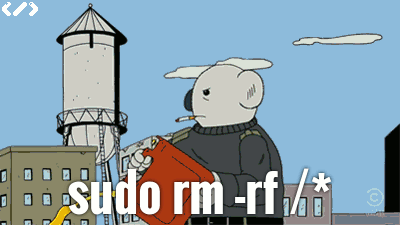
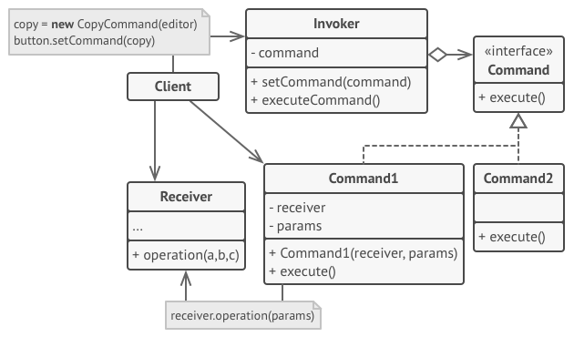
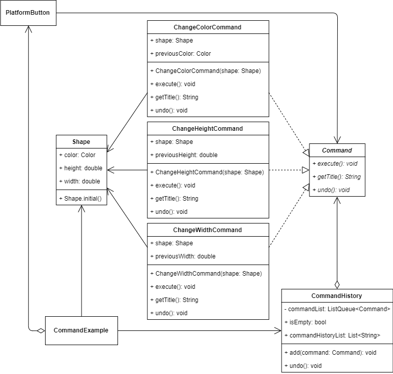
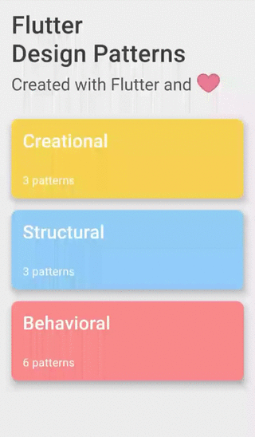

_An overview of the Command design pattern and its implementation in Dart and Flutter_


Previously in the series, I analysed and implemented one of the most popular and useful creational design patterns - [Abstract Factory](../2019-12-27-flutter-design-patterns-11-abstract-factory/index.md). This time, I would like to introduce an OOP design pattern that belongs to the category of behavioural design patterns - the Command.

<!--truncate-->

:::tip
To see all the design patterns in action, check the [Flutter Design Patterns application](https://flutterdesignpatterns.com/).
:::

## What is the Command design pattern?



**Command**, also known as **Action** or **Transaction**, is one of the **behavioural** design patterns which intention is described in the [GoF book](https://en.wikipedia.org/wiki/Design_Patterns):

> _Encapsulate a request as an object, thereby letting you parameterize clients with different requests, queue or log requests, and support undoable opera­tions._

That is, by encapsulating the request as an object, the client is completely decoupled from any of the details of how that command is implemented or how it will get executed - the client doesn't have to care about any dependencies.

There are multiple components of which the Command design pattern consists. Usually, **Command** objects serve as links between various UI and business logic objects. In this case, the command object could be bound to the UI element at runtime by the **Client** and that particular UI component, called **Sender**, invokes the request. The **Sender** triggers the assigned **Command** instead of sending the request directly to the **Receiver** - a simple or complex object which contains the actual logic for the request to be fulfilled. A specific **Command** passes the call to the receiver which does the actual work. As a result, commands become a convenient middle layer that reduces coupling between the UI and business logic layers.

Let's move to the analysis and implementation parts to understand the details of this pattern and learn how to implement it!

## Analysis

The general structure of the Command design pattern looks like this:



- *Command* - declares an interface for executing an operation;
- _Concrete Commands (Command1/Command2)_ - implement various kinds of requests by invoking the corresponding operation(s) on the _Receiver_;
- *Invoker* - the sender class which triggers the _Command_ instead of sending the request directly to the _Receiver_;
- *Receiver* - knows how to perform the operations associated with carrying out a request. Any class may serve as a _Receiver_;
- *Client* - creates a _Concrete Command_ object and sets its _Receiver_.

### Applicability

The Command design pattern could be used when you want to parameterize objects by an action to perform. That is, the operation (command) is extracted to a separate class which object could be passed as a method argument, stored inside another object or the linked command could be switched at runtime.

Furthermore, the Command design pattern is useful when you want to queue operations, schedule their execution, or execute them remotely. Since the command itself is just a simple class, its object (as any other object) could be serialized, stored, e.g. in the database or a text file and later restored as the initial command and executed. This is useful when you want to schedule a specific task that should be executed at a particular time, or on a recurring schedule.

Also, one of the most popular use-case for the Command is to use it for creating reversible operations. To be able to revert operations, you need to implement the history of performed operations. The command history is a stack that contains all executed command objects along with related backups of the application's state.

Finally, the Command design pattern helps you write cleaner and reusable code. By using this pattern, you propagate the **Single Responsibility Principle** (the operation logic is decoupled from the component which performs that particular operation) and the **Open/Closed Principle** (introducing new commands to the application does not require changing the existing code).

## Implementation


To show the Command design pattern in action, we will implement a fake graphics editor. The editor itself is _super-ultra-mega-duper_ simplified (well, _Photoshop_ should have started from something, right?) and provides the following functionality:

- There is only one shape visible on the screen which cannot be removed, but its parameters (colour, height and width) could be adjusted using buttons;
- Change the shape's colour to a random one;
- Change the shape's height to a random value between 50 and 150;
- Change the shape's width to a random value between 50 and 150;
- All of the operations could be undone using the _Undo_ button.

And that is basically it. I know, as a graphics editor, this one sounds terrible, but it would be more than enough to demonstrate the purpose of the Command design pattern.

The main idea behind the implementation of the mentioned graphics editor is to separate the actual business logic of the button from its representation. To achieve this, each operation (request) of the button is encapsulated in a separate class object. Also, by using the Command design pattern, the implementation of _undo_ operation is possible - since every command is encapsulated in a separate class, it is easy to store an objects' list of already executed commands as well as undo the last operation by taking the last command from the list and calling the _undo()_ method on it.

Let's check the class diagram first and then investigate each class/component to see how the Command design pattern could help us build such a graphics editor.

### Class diagram

The class diagram below shows the implementation of the Command design pattern:



`Command` defines a common interface for all the specific commands:

- `execute()` - executes the command;
- `getTitle()` - returns the command's title. Used in command history UI;
- `undo()` - undoes the command and returns the receiver to the previous state.

`ChangeColorCommand`, `ChangeHeightCommand` and `ChangeWidthCommand` are concrete implementations of the `Command` interface.

The `Shape` is a receiver class that stores multiple properties defining the shape presented in UI: `color`, `height` and `width`.

`CommandHistory` is a simple class that stores a list of already executed commands (`commandList`) and provides methods to add a new command to the command history list (`add()`) and undo the last command from that list (`undo()`).

`CommandExample` initializes and contains `CommandHistory`, and `Shape` objects. Also, this component contains multiple `PlatformButton` widgets which have a specific implementation of `Command` assigned to each of them. When the button is pressed, the command is executed and added to the command history list stored in the `CommandHistory` object.

### Shape

A simple class to store information about the shape: its color, height and width. Also, this class contains a named constructor to create a shape object with pre-defined initial values.

```dart title="shape.dart"
class Shape {
  Shape.initial()
      : color = Colors.black,
        height = 150.0,
        width = 150.0;

  Color color;
  double height;
  double width;
}
```

### Command

An interface that defines methods to be implemented by the specific command classes.

```dart title="command.dart"
abstract interface class Command {
  void execute();
  String getTitle();
  void undo();
}
```

### Commands

`ChangeColorCommand` - a specific implementation of the command which changes the colour of the `Shape` object.

```dart title="change_color_command.dart"
class ChangeColorCommand implements Command {
  ChangeColorCommand(this.shape) : previousColor = shape.color;

  final Color previousColor;
  Shape shape;

  @override
  String getTitle() => 'Change color';

  @override
  void execute() => shape.color = Color.fromRGBO(
        random.integer(255),
        random.integer(255),
        random.integer(255),
        1.0,
      );

  @override
  void undo() => shape.color = previousColor;
}
```

`ChangeHeightCommand` - a specific implementation of the command which changes the height of the `Shape` object.

```dart title="change_height_command.dart"
class ChangeHeightCommand implements Command {
  ChangeHeightCommand(this.shape) : previousHeight = shape.height;

  final double previousHeight;
  Shape shape;

  @override
  String getTitle() => 'Change height';

  @override
  void execute() => shape.height = random.integer(150, min: 50).toDouble();

  @override
  void undo() => shape.height = previousHeight;
}
```

`ChangeWidthCommand` - a specific implementation of the command which changes the width of the `Shape` object.

```dart title="change_width_command.dart"
class ChangeWidthCommand implements Command {
  ChangeWidthCommand(this.shape) : previousWidth = shape.width;

  final double previousWidth;
  Shape shape;

  @override
  String getTitle() => 'Change width';

  @override
  void execute() => shape.width = random.integer(150, min: 50).toDouble();

  @override
  void undo() => shape.width = previousWidth;
}
```

### CommandHistory

A simple class that stores a list of already executed commands. Also, this class provides `isEmpty` and `commandHistoryList` getter methods to return true if the command history list is empty and return a list of command names stored in the command history respectively. A new command could be added to the command history list via the `add()` method and the last command could be undone using the `undo()` method (if the command history list is not empty).

```dart title="command_history.dart"
class CommandHistory {
  final _commandList = ListQueue<Command>();

  bool get isEmpty => _commandList.isEmpty;
  List<String> get commandHistoryList =>
      _commandList.map((c) => c.getTitle()).toList();

  void add(Command command) => _commandList.add(command);

  void undo() {
    if (_commandList.isEmpty) return;

    _commandList.removeLast().undo();
  }
}
```

## Example

First of all, a markdown file is prepared and provided as a pattern's description:


`CommandExample` contains `CommandHistory` and `Shape` objects. Also, this widget contains several `PlatformButton` components, each of which uses a specific function to execute a concrete command. After the command's execution, it is added to the command history list stored in the `CommandHistory` object. If the command history is not empty, the _Undo_ button is enabled and the last command could be undone.

```dart title="command_example.dart"
class CommandExample extends StatefulWidget {
  const CommandExample();

  @override
  _CommandExampleState createState() => _CommandExampleState();
}

class _CommandExampleState extends State<CommandExample> {
  final _commandHistory = CommandHistory();
  final _shape = Shape.initial();

  void _changeColor() {
    final command = ChangeColorCommand(_shape);
    _executeCommand(command);
  }

  void _changeHeight() {
    final command = ChangeHeightCommand(_shape);
    _executeCommand(command);
  }

  void _changeWidth() {
    final command = ChangeWidthCommand(_shape);
    _executeCommand(command);
  }

  void _executeCommand(Command command) => setState(() {
        command.execute();
        _commandHistory.add(command);
      });

  void _undo() => setState(() => _commandHistory.undo());

  @override
  Widget build(BuildContext context) {
    return ScrollConfiguration(
      behavior: const ScrollBehavior(),
      child: SingleChildScrollView(
        padding: const EdgeInsets.symmetric(
          horizontal: LayoutConstants.paddingL,
        ),
        child: Column(
          children: <Widget>[
            ShapeContainer(
              shape: _shape,
            ),
            const SizedBox(height: LayoutConstants.spaceM),
            PlatformButton(
              materialColor: Colors.black,
              materialTextColor: Colors.white,
              onPressed: _changeColor,
              text: 'Change color',
            ),
            PlatformButton(
              materialColor: Colors.black,
              materialTextColor: Colors.white,
              onPressed: _changeHeight,
              text: 'Change height',
            ),
            PlatformButton(
              materialColor: Colors.black,
              materialTextColor: Colors.white,
              onPressed: _changeWidth,
              text: 'Change width',
            ),
            const Divider(),
            PlatformButton(
              materialColor: Colors.black,
              materialTextColor: Colors.white,
              onPressed: _commandHistory.isEmpty ? null : _undo,
              text: 'Undo',
            ),
            const SizedBox(height: LayoutConstants.spaceM),
            Row(
              children: <Widget>[
                CommandHistoryColumn(
                  commandList: _commandHistory.commandHistoryList,
                ),
              ],
            ),
          ],
        ),
      ),
    );
  }
}
```

The client code (UI elements, command history, etc.) isn't coupled to concrete command classes because it works with commands via the command interface. This approach allows introducing new commands into the application without breaking any existing code.



As you can see in the example, by triggering a specific command, its object is created, executed and added to the command history list. Hence, it is possible to undo the command even though it was executed several steps before - that's one of the advantages of using the Command design pattern.

All of the code changes for the Command design pattern and its example implementation could be found [here](https://github.com/mkobuolys/flutter-design-patterns/pull/13).

:::tip
To see the pattern in action, check the [interactive Command example](https://flutterdesignpatterns.com/pattern/command).
:::
