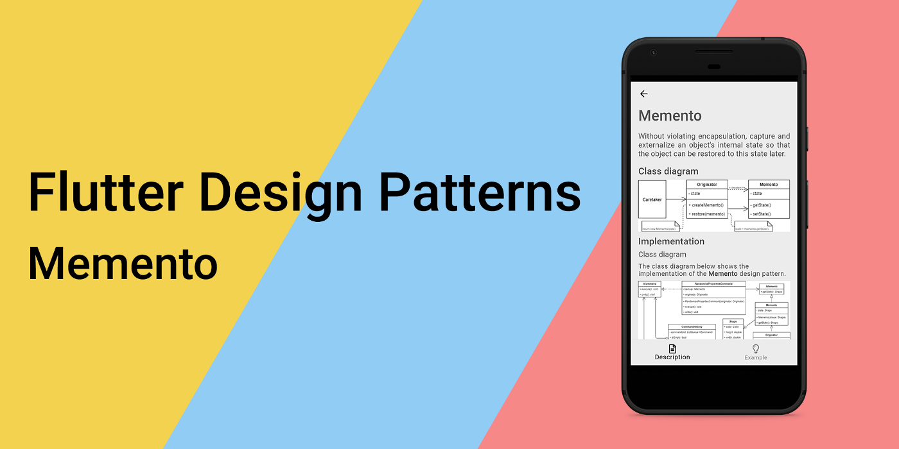
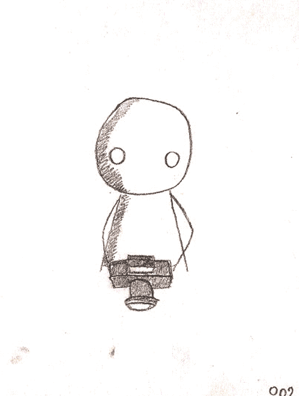
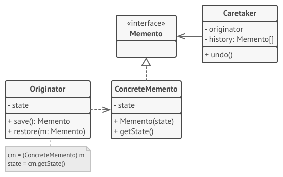
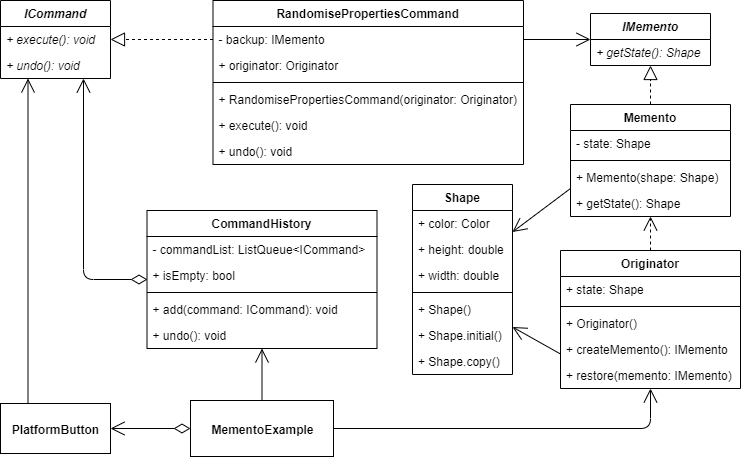
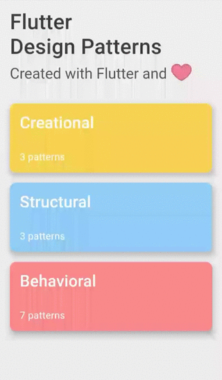

_An overview of the Memento design pattern and its implementation in Dart and Flutter_



In the last [article](../2020-01-09-flutter-design-patterns-12-command/index.md), I analysed a relatively popular design pattern - Command. In this article, I would like to analyse and implement a behavioural design pattern that works pretty well alongside the Command pattern - it is Memento.

<!--truncate-->

:::tip
To see all the design patterns in action, check the [Flutter Design Patterns application](https://flutterdesignpatterns.com/).
:::

## What is the Memento design pattern?



**Memento**, also known as **Token**, belongs to the category of **behavioural** design patterns. The intention of this design pattern is described in the [GoF book](https://en.wikipedia.org/wiki/Design_Patterns):

> _Without violating encapsulation, capture and externalize an object's internal state so that the object can be restored to this state later._

The key idea in this pattern is to make an object (**originator**) itself responsible for saving and restoring its internal state. The internal state (a snapshot of it) is saved in another object - a **memento**. The undo mechanism will request a memento from the originator when it needs to restore the originator's internal state. Clients (**caretaker**) that are responsible for saving and restoring an originator's internal state stores a list of memento objects so that a memento can be passed back to the originator to restore to a previous state. However, the caretaker itself isn't permitted to access or modify a memento - only the originator object that created the specific memento is allowed to do that.

To understand the Memento design pattern better, let's dive in by analysing its structure and implementation in more detail!

## Analysis

The general structure of the Memento design pattern looks like this:



- *Memento* - an interface that restricts access to the _ConcreteMemento_'s fields, only declares methods related to the memento's metadata and which is used by the _Caretaker_ to work with _ConcreteMemento_ object;
- *ConcreteMemento* - stores an _Originator_'s internal state. Also, protects against access by objects other than the _Originator_ which has created the _ConcreteMemento_.
- *Caretaker* - is responsible for the _Memento_'s safekeeping and never operates or examines the contents of a _Memento_.
- *Originator* - creates a _ConcreteMemento_ containing a snapshot of its current internal state. Also, provides the _restore()_ method to restore the internal state using the _ConcreteMemento_.

### Applicability

The Memento design pattern should be used when you want to produce snapshots of the object's state to be able to restore a previous state of the object. The Memento pattern lets you make full copies of an object's state, including private fields, and store them separately from the object.

Also, the pattern could be used for safety reasons - when direct access to the object's fields/getters/setters violates its encapsulation. The Memento makes the object itself responsible for creating a snapshot of its state. No other object can read the snapshot, making the original object's state data safe and secure.

## Implementation


To implement the Memento design pattern and show its advantages, we will work further on the Command design pattern's example. So if you have missed the [previous article](../2020-01-09-flutter-design-patterns-12-command/index.md), I strongly recommend checking the implementation part of it now.

The main idea of the example remains the same - we will create a very simple, fake graphics editor. To simplify the Command design pattern's part, only one command is created and available in the example's UI - `RandomisePropertiesCommand`. This command randomises all the properties of the Shape object - height, width and colour - which acts as a state of our example.

Obviously, what is different from the previous implementation - the Memento design pattern is added. When implementing the Command design pattern's example, we stored its state (Shape object) in the example component itself. This time, the state is stored inside the Originator object and could be manipulated only by it. The `RandomisePropertiesCommand` acts as a caretaker object and stores the previous snapshot of the originator's state in the backup property. The backup property is nothing else than the `Memento` object which is created by the originator before executing the command.

As a result of using the Memento design pattern, the example's state is encapsulated and moved outside of the example component. Also, the previous state could be restored from its Memento snapshot on `undo()` operation of the command. In this case, the Memento design pattern extends the Command design pattern and collaborates with it really well.

Before implementing the Memento design pattern and integrating it inside our example, let's check the class diagram first and investigate its components.

### Class diagram

The class diagram below shows the implementation of the Memento design pattern:



`ICommand` defines a common interface for the specific command:

- `execute()` - executes the command;
- `undo()` - undoes the command and returns the state to the previous snapshot of it.

`RandomisePropertiesCommand` is a concrete command which implements `ICommand` interface.

`CommandHistory` is a simple class that stores a list of already executed commands (`commandList`) and provides methods to add a new command to the command history list (`add()`) and undo the last command from that list (`undo()`).

`IMemento` defines a common interface for the specific memento class:

- `getState()` - returns the snapshot of the internal originator's state.

`Memento` is a class that acts as a snapshot of the originator's internal state which is stored in the `state` property and returned via the `getState()` method.

The `Shape` is a simple data class that is used as an internal originator's state. It stores multiple properties defining the shape presented in UI: `color`, `height` and `width`.

`Originator` - a simple class that contains its internal state and stores the snapshot of it to the `Memento` object using the `createMemento()` method. Also, the originator's state could be restored from the provided Memento object using the `restore()` method.

`MementoExample` initializes and contains `CommandHistory`, and `Originator` objects. Also, this component contains a `PlatformButton` widget that has the command of `RandomisePropertiesCommand` assigned to it. When the button is pressed, the command is executed and added to the command history list stored in the `CommandHistory` object.

### Shape

A simple class to store information about the shape: its color, height and width. Also, this class contains several constructors:

- `Shape()` - a basic constructor to create a shape object with provided values;
- `Shape.initial()` - a named constructor to create a shape object with pre-defined initial values;
- `Shape.copy()` - a named constructor to create a shape object as a copy of the provided `Shape` value.

```dart title="shape.dart"
class Shape {
  Shape.initial()
      : color = Colors.black,
        height = 150.0,
        width = 150.0;

  Shape.copy(Shape shape)
      : color = shape.color,
        height = shape.height,
        width = shape.width;

  Color color;
  double height;
  double width;
}
```

### ICommand

An interface that defines methods to be implemented by the specific command classes.

```dart title="icommand.dart"
abstract interface class ICommand {
  void execute();
  void undo();
}
```

### RandomisePropertiesCommand

A specific implementation of the command that sets all the properties of the `Shape` object stored in the `Originator` to random values. Also, the class implements the `undo` operation.

```dart title="randomise_properties_command.dart"
class RandomisePropertiesCommand implements ICommand {
  RandomisePropertiesCommand(this.originator)
      : _backup = originator.createMemento();

  final Originator originator;
  final IMemento _backup;

  @override
  void execute() {
    final shape = originator.state;

    shape.color = Color.fromRGBO(
      random.integer(255),
      random.integer(255),
      random.integer(255),
      1.0,
    );
    shape.height = random.integer(150, min: 50).toDouble();
    shape.width = random.integer(150, min: 50).toDouble();
  }

  @override
  void undo() => originator.restore(_backup);
}
```

### CommandHistory

A simple class that stores a list of already executed commands. Also, this class provides the `isEmpty` getter method to return true if the command history list is empty. A new command could be added to the command history list via the `add()` method and the last command could be undone using the `undo()` method (if the command history list is not empty).

```dart title="command_history.dart"
class CommandHistory {
  final _commandList = ListQueue<ICommand>();

  bool get isEmpty => _commandList.isEmpty;

  void add(ICommand command) => _commandList.add(command);

  void undo() {
    if (_commandList.isEmpty) return;

    _commandList.removeLast().undo();
  }
}
```

### IMemento

An interface that defines the `getState()` method to be implemented by the specific Memento class.

```dart title="imemento.dart"
abstract interface class IMemento {
  Shape getState();
}
```

### Memento

An implementation of the `IMemento` interface which stores the snapshot of `Originator's` internal state (`Shape` object). The state is accessible to the `Originator` via the `getState()` method.

```dart title="memento.dart"
class Memento implements IMemento {
  Memento(Shape shape) : _state = Shape.copy(shape);

  final Shape _state;

  @override
  Shape getState() => _state;
}
```

### Originator

A class that defines a `createMemento()` method to save the current internal state to a `Memento` object.

```dart title="originator.dart"
class Originator {
  Originator() : state = Shape.initial();

  Shape state;

  IMemento createMemento() => Memento(state);

  void restore(IMemento memento) => state = memento.getState();
}
```

## Example

First of all, a markdown file is prepared and provided as a pattern's description:


`MementoExample` contains `CommandHistory` and `Originator` objects. Also, this widget contains a `PlatformButton` component which uses the `RandomisePropertiesCommand` to randomise property values of the shape. After the command's execution, it is added to the command history list stored in the `CommandHistory` object. If the command history is not empty, the _Undo_ button is enabled and the last command could be undone.

```dart title="memento_example.dart"
class MementoExample extends StatefulWidget {
  const MementoExample();

  @override
  _MementoExampleState createState() => _MementoExampleState();
}

class _MementoExampleState extends State<MementoExample> {
  final _commandHistory = CommandHistory();
  final _originator = Originator();

  void _randomiseProperties() {
    final command = RandomisePropertiesCommand(_originator);
    _executeCommand(command);
  }

  void _executeCommand(ICommand command) => setState(() {
        command.execute();
        _commandHistory.add(command);
      });

  void _undo() => setState(() => _commandHistory.undo());

  @override
  Widget build(BuildContext context) {
    return ScrollConfiguration(
      behavior: const ScrollBehavior(),
      child: SingleChildScrollView(
        padding: const EdgeInsets.symmetric(
          horizontal: LayoutConstants.paddingL,
        ),
        child: Column(
          children: <Widget>[
            ShapeContainer(
              shape: _originator.state,
            ),
            const SizedBox(height: LayoutConstants.spaceM),
            PlatformButton(
              materialColor: Colors.black,
              materialTextColor: Colors.white,
              onPressed: _randomiseProperties,
              text: 'Randomise properties',
            ),
            const Divider(),
            PlatformButton(
              materialColor: Colors.black,
              materialTextColor: Colors.white,
              onPressed: _commandHistory.isEmpty ? null : _undo,
              text: 'Undo',
            ),
            const SizedBox(height: LayoutConstants.spaceM),
          ],
        ),
      ),
    );
  }
}
```

As you can see in this example, the client code (UI elements, command history, etc.) isn't coupled to any specific command class because it works with it via the `ICommand` interface.

In addition to what the Command design pattern provides to this example, the Memento design pattern adds an additional layer to the example's state. It is stored inside the `Originator` object, the command itself does not mutate the state directly but through the `Originator`. Also, the backup (state's snapshot) stored inside the `Command` is a `Memento` object and not the state (`Shape` object) itself - in case of the state's restore (undo is triggered on the command), the specific command calls the `restore()` method on the `Originator` which restores its internal state to the value stored in the snapshot. Hence, it allows restoring multiple property values (a whole complex state object) in a single request, while the state itself is completely separated from the command's code or UI logic.



As you can see in the example, when the command is executed, under the hood the snapshot of the originator's internal state is stored which could be restored later by executing the undo operation on the command.

All of the code changes for the Memento design pattern and its example implementation could be found [here](https://github.com/mkobuolys/flutter-design-patterns/pull/14).

:::tip
To see the pattern in action, check the [interactive Memento example](https://flutterdesignpatterns.com/pattern/memento).
:::
