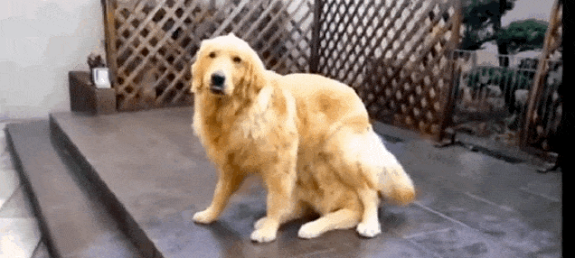
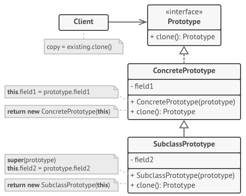
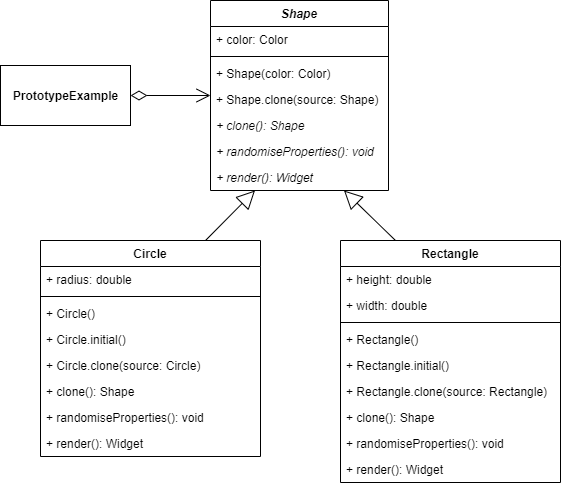
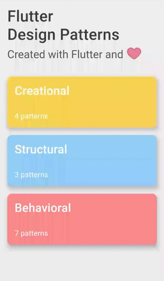

_An overview of the Prototype design pattern and its implementation in Dart and Flutter_


Previously in the series, I analyzed one of the behavioural design patterns - [Memento](../2020-01-16-flutter-design-patterns-13-memento/index.md). This time I would like to represent a relatively simple design pattern compared to the other patterns in the series that belong to the category of creational design patterns - the Prototype.

<!--truncate-->

:::tip
To see all the design patterns in action, check the [Flutter Design Patterns application](https://flutterdesignpatterns.com/).
:::

## What is the Prototype design pattern?



The **Prototype** is a **creational** design pattern, which intention in the [GoF book](https://en.wikipedia.org/wiki/Design_Patterns) is described like this:

> _Specify the kinds of objects to create using a prototypical instance, and create new objects by copying this prototype._

That is, instead of creating a new object, some prototype is used which allows the creation of new objects by copying from this prototype. This could be useful when you want to copy an object which has a complicated state, which means that just initialising a new object will not be enough, you also need to reach that particular state of the object to consider it a valid copy. In simple words, when your code only wants a copy of a specific object with the same state and you do not care about the details of how this state was reached - well, your code should just provide a way to copy (clone) it.

In general, an inflexible way is to create an object directly within the class that requires (uses) the object. The Prototype design pattern enables run-time flexibility since a class can be configured with different Prototype objects, which are copied to create new objects, and even more, Prototype objects can be added and removed dynami­cally at run-time.

Let's move to the analysis and implementation parts to understand and learn the details about this pattern and how to implement it!

## Analysis

The general structure of the Prototype design pattern looks like this:



- *Prototype* - declares an interface for cloning itself. Usually, it is a single clone method, but there could be other methods declared/defined if needed;
- *ConcretePrototype* - implements an operation for cloning itself. In addition to copying the original object's data to the clone, this method may also handle some edge cases of the cloning process related to cloning linked objects, untangling recursive dependencies, etc.;
- *SubclassPrototype* - has the same purpose as the _ConcretePrototype_, but could also extend the base class by defining additional properties, behaviour, etc.;
- *Client* - creates a new object by asking a prototype to clone itself.

### Applicability

The Prototype design pattern should be used when your code should not depend on the concrete classes of objects that you need to copy. The Prototype pattern provides the client code with a general interface for working with all objects that support cloning. This interface makes the client code independent from the concrete classes of objects that it clones.

Also, the pattern could be used when you want to reduce the number of subclasses that only differ in the way they initialize their respective objects. Instead of instantiating a subclass that matches some configuration, the client can simply look for an appropriate prototype and clone it.

Finally, the pattern is quite useful when you have a set of pre-built objects that are ready to be copied. These objects could be stored inside some kind of prototype registry from which you can access the frequently-used prototypes. In this way, you can instantiate a dynamically loaded class and use it inside your code.

## Implementation


This time, the implementation part of the design pattern is very simple and straightforward (but that could be also a good sign, right?). Let's say there are multiple shapes in your application that should be copied at run-time and provided to the UI. Of course, it is possible to instantiate a specific shape by checking all the properties and using them to just simply create another object. However, different shapes contain different properties, they are of a different types, hence the logic just to copy a specific shape could lead to a cumbersome mess in the application code base which you probably want to avoid.

Wouldn't it be nice to have a unified way to copy any shape in your application without even considering any details about it in your client code? Well, we have just analysed the Prototype design pattern, maybe give it a try?

### Class diagram

The class diagram below shows the implementation of the Prototype design pattern:



The `Shape` is an abstract class that is used as a base class for all the specific shapes. The class contains a `color` property and defines several abstract methods:

- `clone()` - clones (copies) the specific shape;
- `randomiseProperties()` - randomises property values of the shape;
- `render()` - renders the shape. The method is used in UI.

`Circle` and `Rectangle` are concrete shape classes that extend the abstract class `Shape` and implement its abstract methods.

`PrototypeExample` initializes and contains several `Shape` objects. These objects are rendered in the UI using the `render()` method. Also, specific shape objects could be copied using `clone()` and their properties could be randomised using `randomiseProperties()` methods respectively.

### Shape

An abstract class stores the shape's colour and defines several abstract methods. Also, this class contains several constructors:

- `Shape()` - a basic constructor to create a shape object with the provided colour value;
- `Shape.clone()` - a named constructor to create a shape object as a copy of the provided `Shape` value.

```dart title="shape.dart"
abstract class Shape {
  Shape(this.color);

  Shape.clone(Shape source) : color = source.color;

  Color color;

  Shape clone();
  void randomiseProperties();
  Widget render();
}
```

### Shapes

`Circle` - a specific class that defines the shape of a circle. The class defines a `radius` property, extends the `Shape` class and implements its abstract methods `clone()`, `randomiseProperties()` and `render()`.

```dart title="circle.dart"
class Circle extends Shape {
  Circle(super.color, this.radius);

  Circle.initial([super.color = Colors.black]) : radius = 50.0;

  Circle.clone(Circle super.source)
      : radius = source.radius,
        super.clone();

  double radius;

  @override
  Shape clone() => Circle.clone(this);

  @override
  void randomiseProperties() {
    color = Color.fromRGBO(
      random.integer(255),
      random.integer(255),
      random.integer(255),
      1.0,
    );
    radius = random.integer(50, min: 25).toDouble();
  }

  @override
  Widget render() {
    return SizedBox(
      height: 120.0,
      child: Center(
        child: AnimatedContainer(
          duration: const Duration(milliseconds: 500),
          height: 2 * radius,
          width: 2 * radius,
          decoration: BoxDecoration(
            color: color,
            shape: BoxShape.circle,
          ),
          child: const Icon(
            Icons.star,
            color: Colors.white,
          ),
        ),
      ),
    );
  }
}
```

`Rectangle` - a specific class that defines the shape of a rectangle. The class defines `height` and `width` properties, extends the `Shape` class and implements its abstract methods `clone()`, `randomiseProperties()` and `render()`.

```dart title="rectangle.dart"
class Rectangle extends Shape {
  Rectangle(super.color, this.height, this.width);

  Rectangle.initial([super.color = Colors.black])
      : height = 100.0,
        width = 100.0;

  Rectangle.clone(Rectangle super.source)
      : height = source.height,
        width = source.width,
        super.clone();

  double height;
  double width;

  @override
  Shape clone() => Rectangle.clone(this);

  @override
  void randomiseProperties() {
    color = Color.fromRGBO(
      random.integer(255),
      random.integer(255),
      random.integer(255),
      1.0,
    );
    height = random.integer(100, min: 50).toDouble();
    width = random.integer(100, min: 50).toDouble();
  }

  @override
  Widget render() {
    return SizedBox(
      height: 120.0,
      child: Center(
        child: AnimatedContainer(
          duration: const Duration(milliseconds: 500),
          height: height,
          width: width,
          decoration: BoxDecoration(
            color: color,
          ),
          child: const Icon(
            Icons.star,
            color: Colors.white,
          ),
        ),
      ),
    );
  }
}
```

## Example

First of all, a markdown file is prepared and provided as a pattern's description:


`PrototypeExample` contains a couple of `Shape` objects - `Circle` and `Rectangle`. By pressing the `Randomise` properties button, the values of the shape's properties are randomised (the `randomiseProperties()` method is called on the shape). Also, if the _Clone_ button is pressed, the `clone()` method is called on the shape and a copy of that particular shape is created with the same values of all the properties.

```dart title="prototype_example.dart"
class PrototypeExample extends StatefulWidget {
  const PrototypeExample();

  @override
  _PrototypeExampleState createState() => _PrototypeExampleState();
}

class _PrototypeExampleState extends State<PrototypeExample> {
  final _circle = Circle.initial();
  final _rectangle = Rectangle.initial();

  Shape? _circleClone;
  Shape? _rectangleClone;

  void _randomiseCircleProperties() => setState(
        () => _circle.randomiseProperties(),
      );

  void _cloneCircle() => setState(() => _circleClone = _circle.clone());

  void _randomiseRectangleProperties() => setState(
        () => _rectangle.randomiseProperties(),
      );

  void _cloneRectangle() => setState(
        () => _rectangleClone = _rectangle.clone(),
      );

  @override
  Widget build(BuildContext context) {
    return ScrollConfiguration(
      behavior: const ScrollBehavior(),
      child: SingleChildScrollView(
        padding: const EdgeInsets.symmetric(
          horizontal: LayoutConstants.paddingL,
        ),
        child: Column(
          children: <Widget>[
            ShapeColumn(
              shape: _circle,
              shapeClone: _circleClone,
              onClonePressed: _cloneCircle,
              onRandomisePropertiesPressed: _randomiseCircleProperties,
            ),
            const Divider(),
            ShapeColumn(
              shape: _rectangle,
              shapeClone: _rectangleClone,
              onClonePressed: _cloneRectangle,
              onRandomisePropertiesPressed: _randomiseRectangleProperties,
            ),
          ],
        ),
      ),
    );
  }
}
```

The `PrototypeExample` does not care about the specific type of shape object as long as it extends the `Shape` abstract class and implements all of its abstract methods. As a result, the `clone()` method could be called on any shape, all of its properties are copied even though these are different on different shapes e.g. the circle has only the `radius` property which is specific for that particular shape, while the rectangle has two different properties - `height` and `width`.



As you can see in the example, it does not matter which type the specific shape is. As long as it extends the prototype base class defining the `clone()` method, the shape object could be copied at any time and used across your code - whether it is your business logic or UI, it is irrelevant.

All of the code changes for the Prototype design pattern and its example implementation could be found [here](https://github.com/mkobuolys/flutter-design-patterns/pull/15).

:::tip
To see the pattern in action, check the [interactive Prototype example](https://flutterdesignpatterns.com/pattern/prototype).
:::
