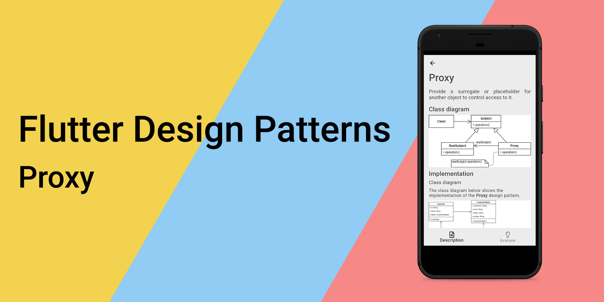
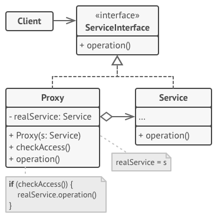
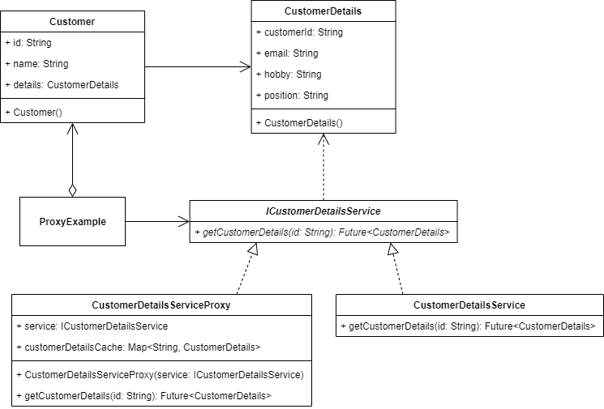
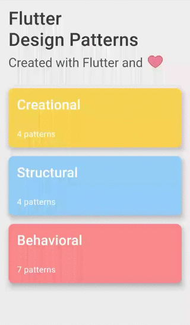

_An overview of the Proxy design pattern and its implementation in Dart and Flutter_



In the last [article](../2020-01-23-flutter-design-patterns-14-prototype/index.md), I analysed a relatively simple design pattern compared to the other patterns in the series - Prototype. In this article, I would like to analyse and implement a structural design pattern that is very practical and could be used in a lot of cases when developing applications with Dart and Flutter - it is a Proxy.

<!--truncate-->

:::tip
To see all the design patterns in action, check the [Flutter Design Patterns application](https://flutterdesignpatterns.com/).
:::

## What is the Proxy design pattern?


**Proxy**, also known as **Surrogate**, belongs to the category of structural design patterns. The intention of this design pattern is described in the [GoF book](https://en.wikipedia.org/wiki/Design_Patterns):

> _Provide a surrogate or placeholder for another object to control access to it._

The key idea in this pattern is to work through a separate proxy object that performs additional functionality when accessing an (already existing) object. For instance, the user's rights should be validated before accessing the object or the object's creation is very expensive so it makes sense to defer its creation until the object is actually needed. Also, if you need to execute something either before or after the primary logic of the class, the proxy lets you do this without changing that class. Since the proxy implements the same interface as the original class, it can be passed to any client that expects a real service object.

To understand the Proxy design pattern better, let's dive in by analysing its structure, types and implementation in more detail!

## Analysis

The general structure of the Proxy design pattern looks like this:



- *ServiceInterface* - defines the common interface for _Service_ and _Proxy_ that the proxy service could be used instead of the real one;
- *Service* - defines the real object which contains some useful business logic. This is the service that the proxy represents;
- *Proxy* - implements the same interface as the real service. Also, has a reference field that points to a service object which allows controlling access to it. The _Proxy_ class may be responsible for creating and deleting the real service's object;
- *Client* - should work with both services and proxies via the same interface. This way you can pass a proxy into any code that expects a service object.

### Applicability

There are dozens of ways to utilize the Proxy pattern:

- Lazy initialization (**virtual proxy**) - instead of creating the object when the app launches, you can delay the object's initialization to a time when it's really needed;
- Access control (**protection proxy**) - the proxy can pass the request to the service object only if the client's credentials match some criteria;
- Local execution of a remote service (**remote proxy**) - the proxy passes the client request over the network, handling all of the nasty details of working with the network;
- Logging requests (**logging proxy**) - the proxy can log each request before passing it to the service;
- Caching request results (**caching proxy**) - the proxy can implement caching for recurring requests that always yield the same results. The proxy may use the parameters of requests as the cache keys.

## Implementation


For the following example of the Proxy design pattern, we will implement the **caching proxy**.

In my opinion, in any application which loads resources from an external service, it is quite a common problem to improve the performance and reduce load times of the data. It is possible to optimise and at least partially resolve it by implementing the caching layer.

Let's say we have a list of customers with some basic information - the customer's id and name. Any additional customer data should be loaded from an external web service. When providing the general list of customers, additional information is not loaded nor used. However, it could be accessed by selecting a specific customer and loading its data from the customer details service. To reduce the number of requests sent to the external service, it makes sense to introduce a caching layer to the application and provide the already loaded information from the cache for future requests.

To achieve this, the Proxy design pattern is a great choice! Let's check the class diagram first and then implement a proxy for the customer details service.

### Class diagram

The class diagram below shows the implementation of the Proxy design pattern:



`Customer` class is used to store information about the customer. One of its properties is `CustomerDetails` which stores additional data about the customer e.g. its email, hobby and position.

`ICustomerDetailsService` defines an interface for the customer details service:

- `getCustomerDetails()` - returns details for the specific customer.

`CustomerDetailsService` is the "real" customer details service that implements the `ICustomerDetailsService` interface.

`CustomerDetailsServiceProxy` is a proxy service that contains the cache (dictionary object) and sends the request to the real `CustomerDetailsService` only if the customer details object is not available in the cache.

`ProxyExample` initialises and contains the proxy object of the real customer details service. When a user selects the option to see more details about the customer, the dialog window appears and loads details about the customer. If the details object is already stored inside the cache, the proxy service returns that object instantly. Otherwise, a request is sent to the real customer details service and the details object is returned from there.

### Customer

A simple class to store information about the customer: its id, name and details. Also, the constructor generates random id and name values when initialising the Customer object.

```dart title="customer.dart"
class Customer {
  Customer()
      : id = faker.guid.guid(),
        name = faker.person.name();

  final String id;
  final String name;
  CustomerDetails? details;
}
```

### CustomerDetails

A simple class to store information about customer details: id to map the details information with the corresponding customer, e-mail address, hobby and the current position (job title).

```dart title="customer_details.dart"
class CustomerDetails {
  const CustomerDetails({
    required this.customerId,
    required this.email,
    required this.hobby,
    required this.position,
  });

  final String customerId;
  final String email;
  final String hobby;
  final String position;
}
```

### ICustomerDetailsService

An interface that defines the `getCustomerDetails()` method to be implemented by the customer details service and its proxy.

```dart title="icustomer_details_service.dart"
abstract interface class ICustomerDetailsService {
  Future<CustomerDetails> getCustomerDetails(String id);
}
```

### CustomerDetailsService

A specific implementation of the `ICustomerDetailsService` interface - the real customer details service. The `getCustomerDetails()` method mocks the real behaviour of the service and generates random values of customer details.

```dart title="customer_details_service.dart"
class CustomerDetailsService implements ICustomerDetailsService {
  const CustomerDetailsService();

  @override
  Future<CustomerDetails> getCustomerDetails(String id) => Future.delayed(
        const Duration(seconds: 2),
        () => CustomerDetails(
          customerId: id,
          email: faker.internet.email(),
          hobby: faker.sport.name(),
          position: faker.job.title(),
        ),
      );
}
```

### CustomerDetailsServiceProxy

A specific implementation of the `ICustomerDetailsService` interface - a proxy for the real customer details service. Before making a call to the customer details service, the proxy service checks whether the customer details are already fetched and saved in the cache. If yes, the customer details object is returned from the cache, otherwise, a request is sent to the real customer service and its value is saved to the cache and returned.

```dart title="customer_details_service_proxy.dart"
class CustomerDetailsServiceProxy implements ICustomerDetailsService {
  CustomerDetailsServiceProxy(this.service);

  final ICustomerDetailsService service;
  final Map<String, CustomerDetails> customerDetailsCache = {};

  @override
  Future<CustomerDetails> getCustomerDetails(String id) async {
    if (customerDetailsCache.containsKey(id)) return customerDetailsCache[id]!;

    final customerDetails = await service.getCustomerDetails(id);
    customerDetailsCache[id] = customerDetails;

    return customerDetails;
  }
}
```

## Example

First of all, a markdown file is prepared and provided as a pattern's description:


`ProxyExample` contains the proxy object of the real customer details service. When the user wants to see customer details, the `showDialog()` method is triggered (via the `showCustomerDetails()` method) which opens the dialog window of type `CustomerDetailsDialog` and passes the proxy object via its constructor as well as the selected customer's information - the `Customer` object.

```dart title="proxy_example.dart"
class ProxyExample extends StatefulWidget {
  const ProxyExample();

  @override
  _ProxyExampleState createState() => _ProxyExampleState();
}

class _ProxyExampleState extends State<ProxyExample> {
  final _customerDetailsServiceProxy = CustomerDetailsServiceProxy(
    const CustomerDetailsService(),
  );
  final _customerList = List.generate(10, (_) => Customer());

  void _showCustomerDetails(Customer customer) => showDialog<void>(
        context: context,
        barrierDismissible: false,
        builder: (_) => CustomerDetailsDialog(
          service: _customerDetailsServiceProxy,
          customer: customer,
        ),
      );

  @override
  Widget build(BuildContext context) {
    return ScrollConfiguration(
      behavior: const ScrollBehavior(),
      child: SingleChildScrollView(
        padding: const EdgeInsets.symmetric(
          horizontal: LayoutConstants.paddingL,
        ),
        child: Column(
          children: <Widget>[
            Text(
              'Press on the list tile to see more information about the customer',
              style: Theme.of(context).textTheme.titleMedium,
              textAlign: TextAlign.center,
            ),
            const SizedBox(height: LayoutConstants.spaceL),
            for (var customer in _customerList)
              Card(
                child: ListTile(
                  leading: CircleAvatar(
                    backgroundColor: Colors.grey,
                    child: Text(
                      customer.name[0],
                      style: const TextStyle(color: Colors.white),
                    ),
                  ),
                  trailing: const Icon(Icons.info_outline),
                  title: Text(customer.name),
                  onTap: () => _showCustomerDetails(customer),
                ),
              ),
          ],
        ),
      ),
    );
  }
}
```

The `CustomerDetailsDialog` class uses the passed proxy service on its state's initialisation, hence loading details of the selected customer.

```dart title="customer_details_dialog.dart"
class CustomerDetailsDialog extends StatefulWidget {
  const CustomerDetailsDialog({
    required this.customer,
    required this.service,
  });

  final Customer customer;
  final ICustomerDetailsService service;

  @override
  _CustomerDetailsDialogState createState() => _CustomerDetailsDialogState();
}

class _CustomerDetailsDialogState extends State<CustomerDetailsDialog> {
  @override
  void initState() {
    super.initState();

    widget.service.getCustomerDetails(widget.customer.id).then(
          (CustomerDetails customerDetails) => setState(() {
            widget.customer.details = customerDetails;
          }),
        );
  }

  void _closeDialog() => Navigator.of(context).pop();

  @override
  Widget build(BuildContext context) {
    return AlertDialog(
      title: Text(widget.customer.name),
      content: SizedBox(
        height: 200.0,
        child: widget.customer.details == null
            ? Center(
                child: CircularProgressIndicator(
                  backgroundColor: lightBackgroundColor,
                  valueColor: AlwaysStoppedAnimation<Color>(
                    Colors.black.withOpacity(0.65),
                  ),
                ),
              )
            : CustomerDetailsColumn(
                customerDetails: widget.customer.details!,
              ),
      ),
      actions: <Widget>[
        Visibility(
          visible: widget.customer.details != null,
          child: PlatformButton(
            materialColor: Colors.black,
            materialTextColor: Colors.white,
            onPressed: _closeDialog,
            text: 'Close',
          ),
        ),
      ],
    );
  }
}
```

The `CustomerDetailsDialog` class does not care about the specific type of customer details service as long as it implements the `ICustomerDetailsService` interface. As a result, an additional caching layer could be used by sending the request through the proxy service, hence improving the general performance of the application, possibly saving some additional network data and reducing the number of requests sent to the real customer details service as well. Also, if you want to call the real customer details service directly, you can just simply pass it via the `CustomerDetailsDialog` constructor - no additional changes are needed in the UI code since both the real service and its proxy implements the same interface.



As you can see in the example, when trying to load the specific customer's details for the first time, it takes some time for the information to load from the service. However, when the same information is accessed once again, it is provided from the cache stored in the proxy service, hence the request is not sent to the real customer details service - the customer details information is provided instantly.

All of the code changes for the Proxy design pattern and its example implementation could be found [here](https://github.com/mkobuolys/flutter-design-patterns/pull/16).

:::tip
To see the pattern in action, check the [interactive Proxy example](https://flutterdesignpatterns.com/pattern/proxy).
:::
