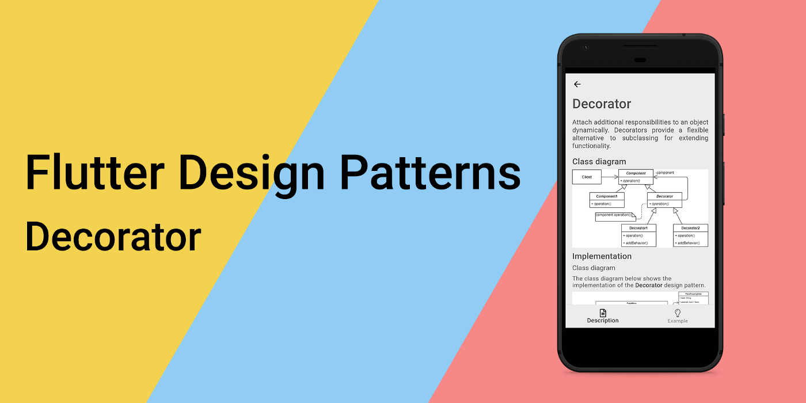
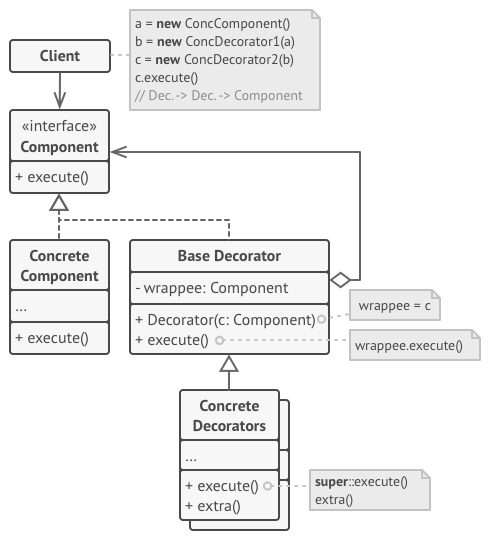
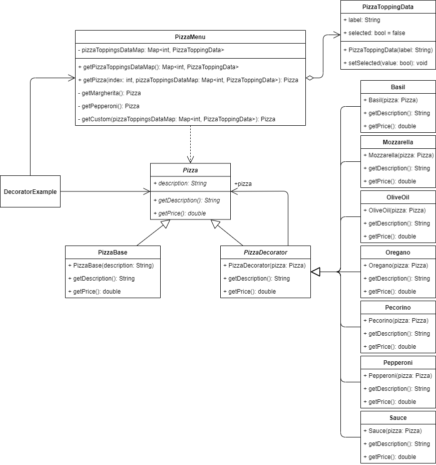
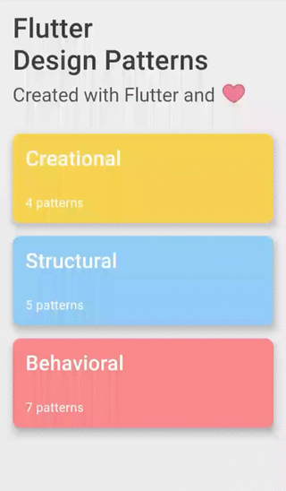

_An overview of the Decorator design pattern and its implementation in Dart and Flutter_



Previously in the series, I analysed a relatively simple, but very practical design pattern — [Proxy](../2020-01-31-flutter-design-patterns-15-proxy/index.md). This time I would like to represent a design pattern, that, unlike the [Strategy](../2019-11-14-flutter-design-patterns-5-strategy/index.md) design pattern, extends the functionality of an object instead of exchanging it. It is a structural design pattern called Decorator.

<!--truncate-->

:::tip
To see all the design patterns in action, check the [Flutter Design Patterns application](https://flutterdesignpatterns.com/).
:::

## What is the Decorator design pattern?


**Decorator**, also known as **Wrapper**, is a **structural** design pattern, which intention in the [GoF book](https://en.wikipedia.org/wiki/Design_Patterns) is described like this:

> _Attach additional responsibilities to an object dynamically. Decorators provide a flexible alternative to subclassing for extending functionality._

The Decorator design pattern provides a way of *changing the skin of an object without changing its guts* - it extends an object's functionality by wrapping it in an object of a Decorator class, leaving the original object intact without modification. Therefore, the pattern helps support one of the [**SOLID**](https://en.wikipedia.org/wiki/SOLID) principles - the Open/Closed Principle (classes should be closed for modification, but open for extension).

The decorations (decorator classes) are independent of each other, hence they can be composed and chained together to add multiple behaviours (inception flashbacks, huh?). Also, another advantage is that this behaviour could be added at run-time, which leads to very flexible reuse of code, unlike using class inheritance. In addition to this, changing the order of decorators allows adding any combinations of responsibilities. However…

> _With great power comes great responsibility_

The usage of the Decorator design pattern can also increase the complexity of code. To implement a specific component and make it modifiable at the run-time, not only do you need to implement the Component but also an indefinite amount of Decorator classes should be added to wrap it. A larger number of classes can sometimes be overwhelming, also debugging and testing the component wrapped by several additional classes does not make the development easier, too.

Let's move to the analysis and implementation parts to understand and learn the details about this pattern and how to implement it!

## Analysis

The general structure of the Decorator design pattern looks like this:



- *Component* - defines the interface for objects that can have responsibilities added to them dynamically;
- *Concrete Component* - defines an object to which additional responsibilities can be added. It contains the basic behaviour which can be altered by decorators;
- *Base Decorator* - has a field referencing a wrapped object which type should be declared as the component interface so it can contain both concrete components and decorators;
- *Concrete Decorators* - adds responsibilities (extra behaviour) to the components dynamically;
- *Client* - initialises the concrete component and wraps it in multiple layers of decorators extending its default behaviour dynamically.

### Applicability

The Decorator design pattern should be used when you need to add extra responsibilities to objects dynamically (at run-time) without affecting other objects. Since all the decorator objects implement the same interface, they can be used in various combinations and interchanged with each other.

Also, this design pattern is useful when extension by subclassing is impractical or even not possible. For instance, sometimes a large number of independent extensions are possible and would produce a huge number of subclasses to support every combination - for those cases, the Decorator design pattern is a better option.

Finally, the Decorator design pattern could be simply used to refactor the code base and split components with hard-wired extensions (compile-time implementation dependencies) into separate classes. As a result, code becomes more readable/maintainable (there would be less code in smaller classes) and at the same time more flexible.

## Implementation


In the Flutter community, it is quite popular to create food delivery/restaurant type of applications. With the implementation of the Decorator design pattern, we will jump into this _hype train_ and will build a prototype for the pizza delivery application, to be more specific, for the pizza selection from the menu.

Let's say we have a small restaurant which makes 3 kinds of pizza:

- Margherita - Sauce, Mozzarella, Basil, Oregano, Pecorino, Olive Oil;
- Pepperoni - Sauce, Mozzarella, Pepperoni, Oregano;
- "Make-Your-Own" - any combination of pizza toppings from the list of Basil, Mozzarella, Olive Oil, Oregano, Pecorino, Pepperoni, and Sauce.

All the pizzas are of the same size, pizza toppings have different prices.

It is quite clear for the pizza Margherita or Pepperoni - the recipe is clear, you just need to add the necessary toppings and calculate the final price, easy peasy. However, for the custom pizza, it would be very impractical to prepare the pre-defined recipes for all the possible combinations - that's just not how it works usually from the business point of view.

For this problem, the Decorator design pattern is a great option since we can make the pizza toppings as separate decorator classes, use them to wrap the pizza base (the base component) and calculate the final price of the pizza based on the selected toppings. Let's check the class diagram first and then implement the pattern.

### Class diagram

The class diagram below shows the implementation of the Decorator design pattern:



`Pizza` defines a common interface for wrappers (decorators) and wrapped objects:

- `getDescription()` - returns the description of the pizza;
- `getPrice()` - returns the price of the pizza.

`PizzaBase` represents the component object which extends the `Pizza` class and implements its abstract methods.

`PizzaDecorator` references the `Pizza` object and forwards requests to it via the `getDescription()` and `getPrice()` methods.

`Basil`, `Mozzarella`, `OliveOil`, `Oregano`, `Pecorino`, `Pepperoni` and `Sauce` are concrete decorators extending the `PizzaDecorator` class and overriding its default behaviour by adding some extra functionality/calculations of their own.

`PizzaToppingData` class stores information about the pizza topping's selection chip used in the UI - its label and whether it is selected or not.

`PizzaMenu` class provides a `getPizzaToppingsDataMap()` method to retrieve the pizza topping's selection chip data. Also, `getPizza()` method is defined to return the specific `Pizza` object based on the selected index in the UI or the selected pizza toppings.

`DecoratorExample` initialises and contains the `PizzaMenu` class object to retrieve the selected `Pizza` object based on the user's selection in the UI.

### Pizza

An interface of the `Pizza` component that defines a common contract for concrete components and decorator objects.

```dart title="pizza.dart"
abstract interface class Pizza {
  String getDescription();
  double getPrice();
}
```

### PizzaBase

A concrete component that implements the `Pizza` interface. An object of this class (its behaviour) gets decorated by the specific decorator classes.

```dart title="pizza_base.dart"
class PizzaBase implements Pizza {
  const PizzaBase(this.description);

  final String description;

  @override
  String getDescription() => description;

  @override
  double getPrice() => 3.0;
}
```

### PizzaDecorator

An abstract decorator class that maintains a reference to a component class and forwards requests to it.

```dart title="pizza_decorator.dart"
abstract class PizzaDecorator implements Pizza {
  const PizzaDecorator(this.pizza);

  final Pizza pizza;

  @override
  String getDescription() => pizza.getDescription();

  @override
  double getPrice() => pizza.getPrice();
}
```

### Concrete pizza decorators

`Basil`, `Mozzarella`, `OliveOil`, `Oregano`, `Pecorino`, `Pepperoni` and `Sauce` are concrete decorator classes of the `Pizza` component. Each of these classes wraps the pizza object and adds additional value for the final price in the `getPrice()` method, and also extends the final pizza's description in the `getDescription()` method.

- Basil:

```dart title="basil.dart"
class Basil extends PizzaDecorator {
  const Basil(super.pizza);

  @override
  String getDescription() => '${pizza.getDescription()}\n- Basil';

  @override
  double getPrice() => pizza.getPrice() + 0.2;
}
```

- Mozzarella:

```dart title="mozzarella.dart"
class Mozzarella extends PizzaDecorator {
  const Mozzarella(super.pizza);

  @override
  String getDescription() => '${pizza.getDescription()}\n- Mozzarella';

  @override
  double getPrice() => pizza.getPrice() + 0.5;
}
```

- Olive Oil:

```dart title="olive_oil.dart"
class OliveOil extends PizzaDecorator {
  const OliveOil(super.pizza);

  @override
  String getDescription() => '${pizza.getDescription()}\n- Olive Oil';

  @override
  double getPrice() => pizza.getPrice() + 0.1;
}
```

- Oregano:

```dart title="oregano.dart"
class Oregano extends PizzaDecorator {
  const Oregano(super.pizza);

  @override
  String getDescription() => '${pizza.getDescription()}\n- Oregano';

  @override
  double getPrice() => pizza.getPrice() + 0.2;
}
```

- Pecorino:

```dart title="pecorino.dart"
class Pecorino extends PizzaDecorator {
  const Pecorino(super.pizza);

  @override
  String getDescription() => '${pizza.getDescription()}\n- Pecorino';

  @override
  double getPrice() => pizza.getPrice() + 0.7;
}
```

- Pepperoni:

```dart title="pepperoni.dart"
class Pepperoni extends PizzaDecorator {
  const Pepperoni(super.pizza);

  @override
  String getDescription() => '${pizza.getDescription()}\n- Pepperoni';

  @override
  double getPrice() => pizza.getPrice() + 1.5;
}
```

- Sauce:

```dart title="sauce.dart"
class Sauce extends PizzaDecorator {
  const Sauce(super.pizza);

  @override
  String getDescription() => '${pizza.getDescription()}\n- Sauce';

  @override
  double getPrice() => pizza.getPrice() + 0.3;
}
```

### PizzaToppingData

A simple class that contains data used by the pizza topping's selection chip in the UI. The data consists of the `label` property and the current selection state (whether the chip is currently selected or not) which could be changed by using the `setSelected()` method.

```dart title="pizza_topping_data.dart"
class PizzaToppingData {
  PizzaToppingData(this.label);

  final String label;
  bool selected = false;

  void setSelected({required bool isSelected}) => selected = isSelected;
}
```

### PizzaMenu

A simple class that provides a map of `PizzaToppingData` objects via the `getPizzaToppingsDataMap()` method for the pizza toppings selection in UI. Also, the class defines a `getPizza()` method which returns a `Pizza` object that is built by using the pre-defined concrete decorator classes based on the pizza recipe - Margherita, Pepperoni or custom (based on the selected pizza toppings).

```dart title="pizza_menu.dart"
class PizzaMenu {
  final Map<int, PizzaToppingData> _pizzaToppingsDataMap = {
    1: PizzaToppingData('Basil'),
    2: PizzaToppingData('Mozzarella'),
    3: PizzaToppingData('Olive Oil'),
    4: PizzaToppingData('Oregano'),
    5: PizzaToppingData('Pecorino'),
    6: PizzaToppingData('Pepperoni'),
    7: PizzaToppingData('Sauce'),
  };

  Map<int, PizzaToppingData> getPizzaToppingsDataMap() => _pizzaToppingsDataMap;

  Pizza getPizza(int index, Map<int, PizzaToppingData> pizzaToppingsDataMap) =>
      switch (index) {
        0 => _getMargherita(),
        1 => _getPepperoni(),
        2 => _getCustom(pizzaToppingsDataMap),
        _ => throw Exception("Index of '$index' does not exist."),
      };

  Pizza _getMargherita() {
    Pizza pizza = const PizzaBase('Pizza Margherita');
    pizza = Sauce(pizza);
    pizza = Mozzarella(pizza);
    pizza = Basil(pizza);
    pizza = Oregano(pizza);
    pizza = Pecorino(pizza);
    pizza = OliveOil(pizza);

    return pizza;
  }

  Pizza _getPepperoni() {
    Pizza pizza = const PizzaBase('Pizza Pepperoni');
    pizza = Sauce(pizza);
    pizza = Mozzarella(pizza);
    pizza = Pepperoni(pizza);
    pizza = Oregano(pizza);

    return pizza;
  }

  Pizza _getCustom(Map<int, PizzaToppingData> pizzaToppingsDataMap) {
    Pizza pizza = const PizzaBase('Custom Pizza');

    if (pizzaToppingsDataMap[1]!.selected) pizza = Basil(pizza);
    if (pizzaToppingsDataMap[2]!.selected) pizza = Mozzarella(pizza);
    if (pizzaToppingsDataMap[3]!.selected) pizza = OliveOil(pizza);
    if (pizzaToppingsDataMap[4]!.selected) pizza = Oregano(pizza);
    if (pizzaToppingsDataMap[5]!.selected) pizza = Pecorino(pizza);
    if (pizzaToppingsDataMap[6]!.selected) pizza = Pepperoni(pizza);
    if (pizzaToppingsDataMap[7]!.selected) pizza = Sauce(pizza);

    return pizza;
  }
}
```

This class (to be more specific, `getMargherita()`, `getPepperoni()` and `getCustom()` methods) represents the main idea of the decorator design pattern - a base component class is instantiated and then wrapped by the concrete decorator classes, hence extending the base class and its behaviour. As a result, it is possible to use wrapper classes and add or remove responsibilities from an object at runtime, for instance, as it is used in the `getCustom()` method where the appropriate decorator classes are used based on the selected pizza toppings data in the UI.

## Example

First of all, a markdown file is prepared and provided as a pattern's description:


`DecoratorExample` contains the `PizzaMenu` object which is used to get the specific `Pizza` object based on the user's selection. Also, all the logic related to the decorator's design pattern and its implementation is extracted to the `PizzaMenu` class, the `DecoratorExample` widget only uses it to retrieve the necessary data to be represented in the UI.

```dart title="decorator_example.dart"
class DecoratorExample extends StatefulWidget {
  const DecoratorExample();

  @override
  _DecoratorExampleState createState() => _DecoratorExampleState();
}

class _DecoratorExampleState extends State<DecoratorExample> {
  final pizzaMenu = PizzaMenu();

  late final Map<int, PizzaToppingData> _pizzaToppingsDataMap;
  late Pizza _pizza;
  var _selectedIndex = 0;

  @override
  void initState() {
    super.initState();
    _pizzaToppingsDataMap = pizzaMenu.getPizzaToppingsDataMap();
    _pizza = pizzaMenu.getPizza(0, _pizzaToppingsDataMap);
  }

  void _onSelectedIndexChanged(int? index) {
    _setSelectedIndex(index!);
    _setSelectedPizza(index);
  }

  void _setSelectedIndex(int index) => setState(() => _selectedIndex = index);

  void _onCustomPizzaChipSelected(int index, bool? selected) {
    _setChipSelected(index, selected!);
    _setSelectedPizza(_selectedIndex);
  }

  void _setChipSelected(int index, bool selected) => setState(() {
        _pizzaToppingsDataMap[index]!.setSelected(isSelected: selected);
      });

  void _setSelectedPizza(int index) => setState(() {
        _pizza = pizzaMenu.getPizza(index, _pizzaToppingsDataMap);
      });

  @override
  Widget build(BuildContext context) {
    return ScrollConfiguration(
      behavior: const ScrollBehavior(),
      child: SingleChildScrollView(
        padding: const EdgeInsets.symmetric(
          horizontal: LayoutConstants.paddingL,
        ),
        child: Column(
          children: <Widget>[
            Row(
              children: <Widget>[
                Text(
                  'Select your pizza:',
                  style: Theme.of(context).textTheme.titleLarge,
                ),
              ],
            ),
            PizzaSelection(
              selectedIndex: _selectedIndex,
              onChanged: _onSelectedIndexChanged,
            ),
            if (_selectedIndex == 2)
              CustomPizzaSelection(
                pizzaToppingsDataMap: _pizzaToppingsDataMap,
                onSelected: _onCustomPizzaChipSelected,
              ),
            PizzaInformation(
              pizza: _pizza,
            ),
          ],
        ),
      ),
    );
  }
}
```

The final result looks like this:



As you can see in the example when selecting any of the pre-defined recipes, the final price of the pizza is recalculated as well as the description of its toppings is provided. Also, for the custom pizza, the price is recalculated every time a topping is selected or deselected, and the pizza's description is updated, too.

All of the code changes for the Decorator design pattern and its example implementation could be found [here](https://github.com/mkobuolys/flutter-design-patterns/pull/17).

:::tip
To see the pattern in action, check the [interactive Decorator example](https://flutterdesignpatterns.com/pattern/decorator).
:::
