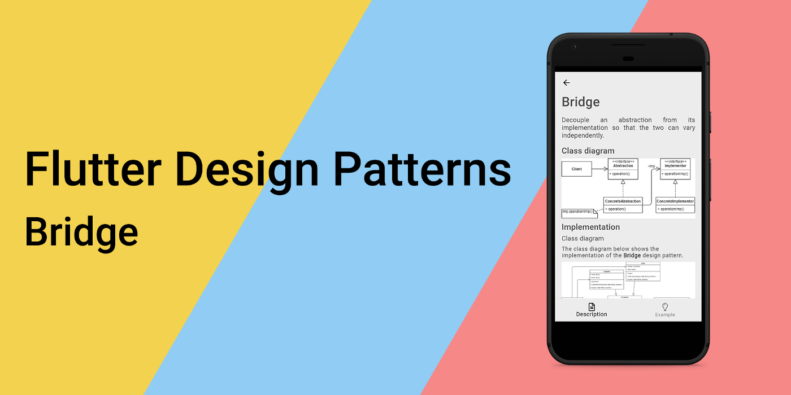
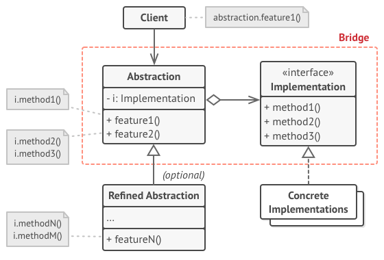
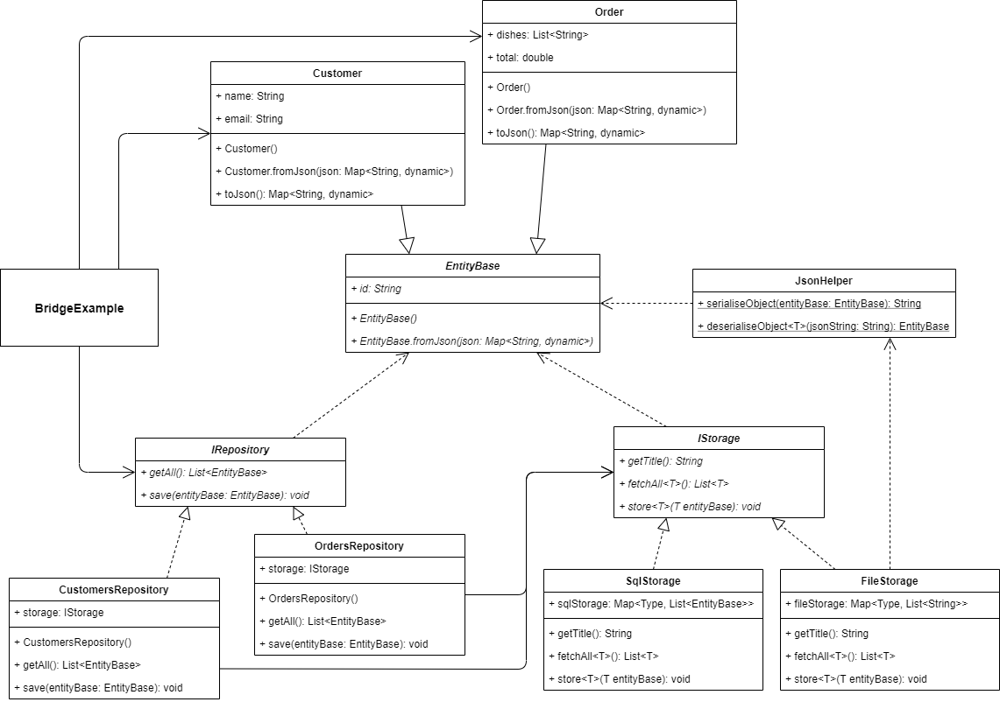
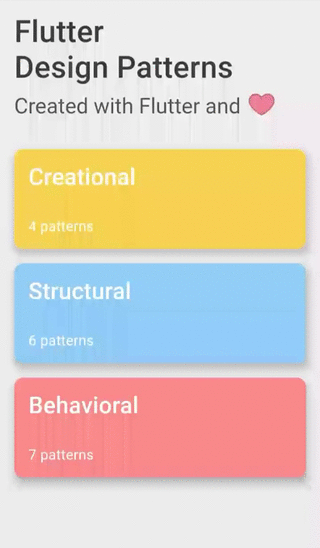

_An overview of the Bridge design pattern and its implementation in Dart and Flutter_



In the last [article](../2020-02-28-flutter-design-patterns-16-decorator/index.md), I analysed a structural design pattern that provides a way of *changing the skin of an object without changing its guts* - Decorator. In this article, I would like to analyse and implement another structural design pattern that tends to be relatively difficult to understand compared to the other design patterns, but at the same time is practical and useful - it is Bridge.

<!--truncate-->

:::tip
To see all the design patterns in action, check the [Flutter Design Patterns application](https://flutterdesignpatterns.com/).
:::

## What is the Bridge design pattern?


**Bridge**, also known as **Handle/Body**, belongs to the category of structural design patterns. The intention of this design pattern is described in the [GoF book](https://en.wikipedia.org/wiki/Design_Patterns):

> _Decouple an abstraction from its implementation so that the two can vary independently._

The usual way for an abstraction to have one of several possible implementations is to use inheritance - an abstraction defines the interface while concrete subclasses implement it in different ways. However, this approach is not very flexible since it binds the implementation to abstraction at compile-time and makes it impossible to change the implementation at run-time. What if we want the implementation to be selected and exchanged at run-time?

The Bridge design pattern separates an abstraction from its implementation so that the two can vary independently from each other. In this case, the abstraction uses another abstraction as its implementation instead of using the implementation directly. This relationship between an abstraction and its implementation (well, another abstraction, to be more specific) is called a _bridge - it bridges the abstraction and its implementation, letting them vary independently_.

If the _Abstraction_ and _Implementation_ terms sound too academic to you, imagine this: abstraction (or interface) is just a high-level layer for some particular entity. This layer is just an interface that is not supposed to do any real work on its own - it should delegate the work to the implementation layer. A good example of this is a GUI (graphical user interface) and OS (operating system). GUI is just a top-level layer for the user to communicate with the operating system, but it does not do any real work by itself - it just passes user commands (events) to the platform. And what is important about this, both GUI and OS could be extended separately from each other, e.g. a desktop application could have different views/panels/dashboards and at the same time support several APIs (could be run on Windows, Linux and macOS) - these two parts could vary independently. Sounds like a Bridge design pattern, right?

## Analysis

The general structure of the Bridge design pattern looks like this:



- *Abstraction* - defines an interface for the abstraction and maintains a reference to an object of type _Implementation_;
- *Refined abstraction* - implements the _Abstraction_ interface and provides different variants of control logic;
- *Implementation* - defines an interface for the implementation classes. An _Abstraction_ can only communicate with an _Implementation_ object via methods that are declared there;
- *Concrete implementations* - implement the _Implementation_ interface and contain platform-specific code.

### Applicability

The Bridge design pattern should be used when you want to divide a monolithic class that has several variants of some functionality. In this case, the pattern allows splitting the class into several class hierarchies which could be changed independently - it simplifies code maintenance, and smaller classes minimize the risk of breaking existing code. A good example of this approach is when you want to use several different approaches in the persistence layer e.g. both database and file system persistence.

Also, the bridge design pattern should be used when both the abstractions and their implementations should be extensible by subclassing - the pattern allows combining different abstractions and implementations and extending them independently.

Finally, the bridge design pattern is a lifesaver when you need to be able to switch implementations at run-time. The pattern lets you replace the implementation object inside the abstraction - you can inject it via the constructor or just assign it as a new value to a field/property.

## Implementation


For the implementation part, we will implement the persistence layer for our example using the Bridge design pattern.

Let's say your application uses the external SQL database (not the local SQLite option in your device, but the cloud one). Everything is fine until the wild connection problems appear. In this case, there are two options: you are not allowing users to use the application and provide a funny _connection lost_ screen or you can store the data in some kind of local storage and synchronise the data later when the connection is up again. Obviously, the second approach is more user-friendly, but how to implement it?

In the persistence layer, there are multiple repositories for each entity type. The repositories share a common interface - that is our abstraction. If you want to change the storage type (to use the local or cloud one) at run-time, these repositories could not reference the specific implementation of the storage, they should use some kind of abstraction shared between different types of storage. Well, we can build another abstraction (interface) on top of that which is then implemented by the specific storage. Now we connect our repositories' abstraction with the storages' interface - *voilà*, that is how the Bridge design pattern is introduced into our application! Let's check the class diagram first and then investigate some implementation details.

### Class diagram

The class diagram below shows the implementation of the Bridge design pattern:



The `EntityBase` is an abstract class that is used as a base class for all the entity classes. The class contains an `id` property and a named constructor `EntityBase.fromJson()` to map the JSON object to the class field.

`Customer` and `Order` are concrete entities that extend the abstract class `EntityBase`. `Customer` class contains `name` and `email` properties, `Customer.fromJson()` named constructor to map the JSON object to class fields and a `toJson()` method to map class fields to the corresponding JSON map object. `Order` class contain `dishes` (a list of dishes of that order) and `total` fields, a named constructor `Order.fromJson()` and a `toJson()` method respectively.

`IRepository` defines a common interface for the repositories:

- `getAll()` - returns all records from the repository;
- `save()` - saves an entity of type `EntityBase` in the repository.

`CustomersRepository` and `OrdersRepository` are concrete implementations of the `IRepository` interface. Also, these classes contain a storage property of type `IStorage` which is injected into the repository via the constructor.

`IStorage` defines a common interface for the storages:

- `getTitle()` - returns the title of the storage. The method is used in UI;
- `fetchAll<T>()` - returns all the records of type `T` from the storage;
- `store<T>()` - stores a record of type `T` in the storage.

`FileStorage` and `SqlStorage` are concrete implementations of the `IStorage` interface. Additionally, the `FileStorage` class uses the `JsonHelper` class and its static methods to serialise/deserialise JSON objects.

`BridgeExample` initialises and contains both - customer and order - repositories which are used to retrieve the corresponding data. Additionally, the storage type of these repositories could be changed between the `FileStorage` and `SqlStorage` separately and at the run-time.

### EntityBase

An abstract class that stores the `id` field and is extended by all of the entity classes.

```dart title="entity_base.dart"
abstract class EntityBase {
  EntityBase() : id = faker.guid.guid();

  final String id;

  EntityBase.fromJson(Map<String, dynamic> json) : id = json['id'] as String;
}
```

### Customer

A simple class to store information about the customer: its `name` and `email`. Also, the constructor generates random values when initialising the `Customer` object.

```dart title="customer.dart"
class Customer extends EntityBase {
  Customer()
      : name = faker.person.name(),
        email = faker.internet.email();

  final String name;
  final String email;

  Customer.fromJson(super.json)
      : name = json['name'] as String,
        email = json['email'] as String,
        super.fromJson();

  Map<String, dynamic> toJson() => {
        'id': id,
        'name': name,
        'email': email,
      };
}
```

### Order

A simple class to store information about the order: a list of `dishes` it contains and the `total` price of the order. Also, the constructor generates random values when initialising the `Order` object.

```dart title="order.dart"
class Order extends EntityBase {
  Order()
      : dishes = List.generate(
          random.integer(3, min: 1),
          (_) => faker.food.dish(),
        ),
        total = random.decimal(scale: 20, min: 5);

  final List<String> dishes;
  final double total;

  Order.fromJson(super.json)
      : dishes = List.from(json['dishes'] as List),
        total = json['total'] as double,
        super.fromJson();

  Map<String, dynamic> toJson() => {
        'id': id,
        'dishes': dishes,
        'total': total,
      };
}
```

### JsonHelper

A helper class is used by the `FileStorage` to serialise objects of type `EntityBase` to JSON map objects and deserialise them from the JSON string.

```dart title="json_helper.dart"
class JsonHelper {
  const JsonHelper._();

  static String serialiseObject(EntityBase entityBase) {
    return jsonEncode(entityBase);
  }

  static T deserialiseObject<T extends EntityBase>(String jsonString) {
    final json = jsonDecode(jsonString)! as Map<String, dynamic>;

    return switch (T) {
      Customer => Customer.fromJson(json) as T,
      Order => Order.fromJson(json) as T,
      _ => throw Exception("Type of '$T' is not supported."),
    };
  }
}
```

### IRepository

An interface that defines methods to be implemented by the derived repository classes.

```dart title="irepository.dart"
abstract interface class IRepository {
  List<EntityBase> getAll();
  void save(EntityBase entityBase);
}
```

### Concrete repositories

`CustomersRepository` - a specific implementation of the `IRepository` interface to store customers' data.

```dart title="customers_repository.dart"
class CustomersRepository implements IRepository {
  const CustomersRepository(this.storage);

  final IStorage storage;

  @override
  List<EntityBase> getAll() => storage.fetchAll<Customer>();

  @override
  void save(EntityBase entityBase) {
    storage.store<Customer>(entityBase as Customer);
  }
}
```

`OrdersRepository` - a specific implementation of the `IRepository` interface to store orders' data.

```dart title="orders_repository.dart"
class OrdersRepository implements IRepository {
  const OrdersRepository(this.storage);

  final IStorage storage;

  @override
  List<EntityBase> getAll() => storage.fetchAll<Order>();

  @override
  void save(EntityBase entityBase) {
    storage.store<Order>(entityBase as Order);
  }
}
```

### IStorage

An interface that defines methods to be implemented by the derived storage classes.

```dart title="istorage.dart"
abstract interface class IStorage {
  String getTitle();
  List<T> fetchAll<T extends EntityBase>();
  void store<T extends EntityBase>(T entityBase);
}
```

### Concrete storages

`FileStorage` - a specific implementation of the `IStorage` interface to store an object in the storage as a file - this behaviour is mocked by storing an object as a JSON string.

```dart title="file_storage.dart"
class FileStorage implements IStorage {
  final Map<Type, List<String>> fileStorage = {};

  @override
  String getTitle() => 'File Storage';

  @override
  List<T> fetchAll<T extends EntityBase>() {
    if (!fileStorage.containsKey(T)) return [];

    final files = fileStorage[T]!;

    return files.map<T>((f) => JsonHelper.deserialiseObject<T>(f)).toList();
  }

  @override
  void store<T extends EntityBase>(T entityBase) {
    if (!fileStorage.containsKey(T)) fileStorage[T] = [];

    fileStorage[T]!.add(JsonHelper.serialiseObject(entityBase));
  }
}
```

`SqlStorage` - a specific implementation of the `IStorage` interface to store an object in the storage as an entity - this behaviour is mocked by using the Map data structure and appending entities of the same type to the list.

```dart title="sql_storage.dart"
class SqlStorage implements IStorage {
  final Map<Type, List<EntityBase>> sqlStorage = {};

  @override
  String getTitle() => 'SQL Storage';

  @override
  List<T> fetchAll<T extends EntityBase>() =>
      sqlStorage.containsKey(T) ? sqlStorage[T]! as List<T> : [];

  @override
  void store<T extends EntityBase>(T entityBase) {
    if (!sqlStorage.containsKey(T)) sqlStorage[T] = <T>[];

    sqlStorage[T]!.add(entityBase);
  }
}
```

## Example

First of all, a markdown file is prepared and provided as a pattern's description:


`BridgeExample` contains a list of storage - instances of `SqlStorage` and `FileStorage` classes. Also, it initialises `Customer` and `Order` repositories. In the repositories the concrete type of storage could be interchanged by triggering the `onSelectedCustomerStorageIndexChanged()` for the `CustomersRepository` and `onSelectedOrderStorageIndexChanged()` for the `OrdersRepository` respectively.

```dart title="bridge_example.dart"
class BridgeExample extends StatefulWidget {
  const BridgeExample();

  @override
  _BridgeExampleState createState() => _BridgeExampleState();
}

class _BridgeExampleState extends State<BridgeExample> {
  final _storages = [SqlStorage(), FileStorage()];

  late IRepository _customersRepository;
  late IRepository _ordersRepository;

  late List<Customer> _customers;
  late List<Order> _orders;

  var _selectedCustomerStorageIndex = 0;
  var _selectedOrderStorageIndex = 0;

  void _onSelectedCustomerStorageIndexChanged(int? index) {
    if (index == null) return;

    setState(() {
      _selectedCustomerStorageIndex = index;
      _customersRepository = CustomersRepository(_storages[index]);
      _customers = _customersRepository.getAll() as List<Customer>;
    });
  }

  void _onSelectedOrderStorageIndexChanged(int? index) {
    if (index == null) return;

    setState(() {
      _selectedOrderStorageIndex = index;
      _ordersRepository = OrdersRepository(_storages[index]);
      _orders = _ordersRepository.getAll() as List<Order>;
    });
  }

  void _addCustomer() {
    _customersRepository.save(Customer());

    setState(
      () => _customers = _customersRepository.getAll() as List<Customer>,
    );
  }

  void _addOrder() {
    _ordersRepository.save(Order());

    setState(() => _orders = _ordersRepository.getAll() as List<Order>);
  }

  @override
  void initState() {
    super.initState();

    _customersRepository =
        CustomersRepository(_storages[_selectedCustomerStorageIndex]);
    _customers = _customersRepository.getAll() as List<Customer>;

    _ordersRepository = OrdersRepository(_storages[_selectedOrderStorageIndex]);
    _orders = _ordersRepository.getAll() as List<Order>;
  }

  @override
  Widget build(BuildContext context) {
    return ScrollConfiguration(
      behavior: const ScrollBehavior(),
      child: SingleChildScrollView(
        padding: const EdgeInsets.symmetric(
          horizontal: LayoutConstants.paddingL,
        ),
        child: Column(
          crossAxisAlignment: CrossAxisAlignment.start,
          children: <Widget>[
            Row(
              children: <Widget>[
                Text(
                  'Select customers storage:',
                  style: Theme.of(context).textTheme.titleLarge,
                ),
              ],
            ),
            StorageSelection(
              storages: _storages,
              selectedIndex: _selectedCustomerStorageIndex,
              onChanged: _onSelectedCustomerStorageIndexChanged,
            ),
            PlatformButton(
              materialColor: Colors.black,
              materialTextColor: Colors.white,
              onPressed: _addCustomer,
              text: 'Add',
            ),
            if (_customers.isNotEmpty)
              CustomersDatatable(customers: _customers)
            else
              Text(
                '0 customers found',
                style: Theme.of(context).textTheme.titleSmall,
              ),
            const Divider(),
            Row(
              children: <Widget>[
                Text(
                  'Select orders storage:',
                  style: Theme.of(context).textTheme.titleLarge,
                ),
              ],
            ),
            StorageSelection(
              storages: _storages,
              selectedIndex: _selectedOrderStorageIndex,
              onChanged: _onSelectedOrderStorageIndexChanged,
            ),
            PlatformButton(
              materialColor: Colors.black,
              materialTextColor: Colors.white,
              onPressed: _addOrder,
              text: 'Add',
            ),
            if (_orders.isNotEmpty)
              OrdersDatatable(orders: _orders)
            else
              Text(
                '0 orders found',
                style: Theme.of(context).textTheme.titleSmall,
              ),
          ],
        ),
      ),
    );
  }
}
```

The concrete repository does not care about the specific type of storage it uses as long as the storage implements the `IStorage` interface and all of its methods. As a result, the abstraction (repository) is separated from the implementor (storage) - the concrete implementation of the storage could be changed for the repository at run-time, and the repository does not depend on its implementation details.



As you can see in the example, the storage type could be changed for each repository separately and at run-time - it would not be possible by using the simple class inheritance approach.

All of the code changes for the Bridge design pattern and its example implementation could be found [here](https://github.com/mkobuolys/flutter-design-patterns/pull/18).

:::tip
To see the pattern in action, check the [interactive Bridge example](https://flutterdesignpatterns.com/pattern/bridge).
:::
