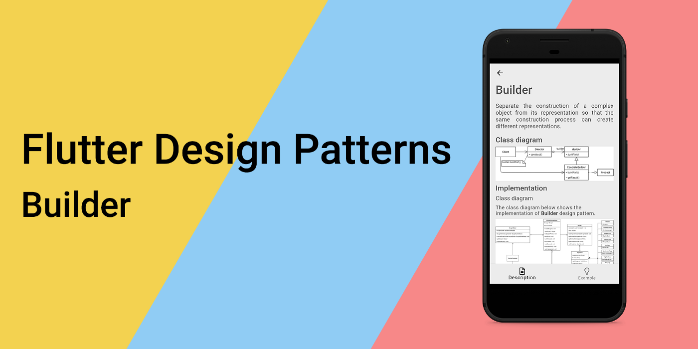
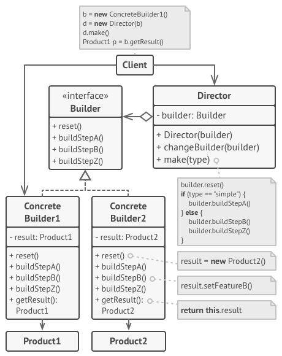
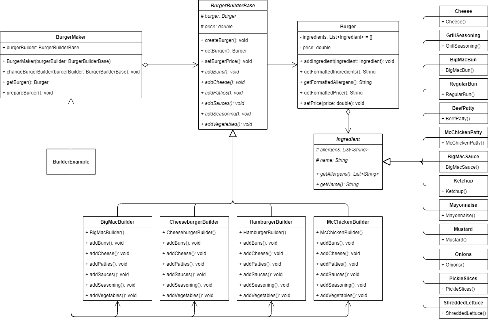

_An overview of the Builder design pattern and its implementation in Dart and Flutter_



Previously in the series, I analysed a relatively complex, but very practical and useful structural design pattern — [Bridge](../2020-03-27-flutter-design-patterns-17-bridge/index.md). This time I would like to represent a design pattern, which divides the construction of a complex object into several separate steps. It is a creational design pattern called Builder.

<!--truncate-->

:::tip
To see all the design patterns in action, check the [Flutter Design Patterns application](https://flutterdesignpatterns.com/).
:::

## What is the Builder design pattern?


**Builder** is a **creational** design pattern, which intention in the [GoF book](https://en.wikipedia.org/wiki/Design_Patterns) is described like this:

> _Separate the construction of a complex object from its representation so that the same construction process can create different representations._

The intention could be split into two parts:

> _Separate the construction of a complex object from its representation…_

You should have already noticed this in the majority of the design patterns overviewed in the series, maybe in a slightly different form, e.g. _separate the abstraction from its representation_. In this case, one of the main purposes of the Builder design pattern is to separate the creation process (logic) of a complex object from the object (data) itself. What is a complex object? Well, there is no specific point or any criteria of the object when you could say that it is complex. Usually, an object could be considered complex when the object's creation does not simply end with calling its constructor - additionally, you should set some extra specific parameters, and call additional methods.

Ok, at this point we have a complex object, we can create it by using some additional parameters and/or methods - why do we need any additional abstraction on top of that, and why we should separate this creation process from the object at all?

> _… so that the same construction process can create different representations._

Ahh, that's the point! To understand it better, let's say we are building a house. To build a house (object), the construction steps (build logic) are pretty much the same - you need the foundation, floor, some walls, doors, windows, a roof, etc. Even though the construction process of the house is the same, each of these steps could be adjusted, hence the final result would look completely different. And that is the main idea of the Builder design pattern - abstract the object's creation process so that construction steps could be adjusted to provide a different representation (final result).

The Builder design pattern moves the object construction code out of its own class to separate objects called _builders_. Each of these builders follows the same interface and implements separate object construction steps. That is, if you want a different object's representation, just create a different _builder_ class and implement these construction steps correspondingly. Also, there is one additional layer in the Builder design pattern - _Director_. The _Director_ is a simple class that is aware of the _Builder_ interface and defines the order in which to execute the building steps. This class is not mandatory, though, but it hides the details of product construction from the client code.

I know, the structure of the Builder design pattern is quite complex, so let's move to the analysis and implementation parts to understand it better!

## Analysis

The general structure of the Builder design pattern looks like this:



- *Builder* - defines an abstract interface that is common to all types of builders for creating parts of a _Product_;
- *Concrete Builder* - provides a specific implementation of the construction steps. Also, it defines and keeps track of the _Product_ it creates;
- *Director* - constructs an object using the _Builder_ interface, defines the order in which the construction steps are called;
- *Product* - represents the complex object under construction, exposes interface/methods for assembling the parts into the final result;
- *Client* - associates the specific _Builder_ object with the _Director_. Later, a _Product_ object is created by calling the _Director_ class instance.

### Applicability

The Builder design pattern should be used when you notice multiple constructors of the same class referencing each other. For instance, you have a constructor with multiple optional parameters. Some of these parameters have default values, so you create several shorter constructors with fewer parameters, but still refer to the main one. By using the Builder design pattern, you are building objects step by step only using those steps that are really needed - you do not need to cope with the problem of multiple constructors with optional parameters anymore.

As already mentioned, this pattern should be used when you want to create different representations of some product. That is, the pattern could be applied when the construction steps are similar but differ in details. The builder interface defines those steps (some of them may even have the default implementation) while concrete builders implement these steps to construct a particular representation of the product.

Finally, the Builder design pattern is useful when the algorithm for creating a complex object should be independent of the parts that make up the objects and how they are assembled. In simple words, it is just a simple extraction of the object's creation logic from its own class. Therefore, the construction algorithm could evolve separately from the actual product it provides, the modification of this process does require changing the object's code.

## Implementation


This time, the implementation part is very straightforward - we will use the Builder design pattern to implement the build process of _McDonald's_ burgers.

As you may know, _McDonald's_ menu contains multiple burgers (a regular burger, cheeseburger, and _Big Mac_ just to name a few). All of these burgers use the very same products, just the ingredients list is different:

- Regular burger - buns, beef patty, ketchup, mustard, grill seasoning, onions, pickle slices;
- Cheeseburger - buns, beef patty, cheese, ketchup, mustard, grill seasoning, onions, pickle slices;
- *Big Mac* - buns, cheese, beef patty, _Big Mac_ sauce, grill seasoning, onions, pickle slices, shredded lettuce.

As you can see, by changing the build process of the burger (changing ingredients), we completely change the final result. Also, at any moment there could be a requirement to add a new burger to the menu. Finally, the user-friendly UI should be implemented where you can select a burger from the menu and see its price, ingredients and allergens list.

For this problem, the Builder design pattern is a great option since we can define different _builder_ classes which build specific burgers. Also, if a new burger should be added to the menu at any point, we can simply introduce another _builder_ class to cope with this change. Let's check the class diagram first and then implement the pattern.

### Class diagram

The class diagram below shows the implementation of the Builder design pattern:



The `Ingredient` is an abstract class that is used as a base class for all the ingredient classes. The class contains `allergens` and `name` properties as well as `getAllergens()` and `getName()` methods to return the values of these properties.

There are a lot of concrete ingredient classes: `BigMacBun`, `RegularBun`, `BeefPatty`, `McChickenPatty`, `BigMacSauce`, `Ketchup`, `Mayonnaise`, `Mustard`, `Onions`, `PickleSlices`, `ShreddedLettuce`, `Cheese` and `GrillSeasoning`. All of these classes represent a specific ingredient of a burger and contain a default constructor to set the `allergens` and `name` property values of the base class.

The `Burger` is a simple class representing the product of a builder. It contains the `ingredients` list and `price` property to store the corresponding values. Also, the class contains several methods:

- `addIngredient()` - adds an ingredient to the burger;
- `getFormattedIngredients()` - returns a formatted ingredients' list of a burger (separated by commas);
- `getFormattedAllergens()` - returns a formatted allergens' list of a burger (separated by commas);
- `getFormattedPrice()` - returns a formatted price of a burger;
- `setPrice()` - sets the price for the burger.

`BurgerBuilderBase` is an abstract class that is used as a base class for all the burger builder classes. It contains `burger` and `price` properties to store the final product - burger - and its price correspondingly. Additionally, the class stores some methods with default implementation:

- `createBurger()` - initialises a `Burger` class object;
- `getBurger()` - returns the built burger result;
- `setBurgerPrice()` - sets the price for the burger object.

`BurgerBuilderBase` also contain several abstract methods which must be implemented in the specific implementation classes of the burger builder: `addBuns()`, `addCheese()`, `addPatties()`, `addSauces()`, `addSeasoning()` and `addVegetables()`.

`BigMacBuilder`, `CheeseburgerBuilder`, `HamburgerBuilder` and `McChickenBuilder` are concrete builder classes that extend the abstract class `BurgerBuilderBase` and implement its abstract methods.

`BurgerMaker` is a director class that manages the burger's build process. It contains a specific builder implementation as a `burgerBuilder` property, `prepareBurger()` method to build the burger and a `getBurger()` method to return it. Also, the builder's implementation could be changed using the `changeBurgerBuilder()` method.

`BuilderExample` initialises and contains the `BurgerMaker` class. Also, it references all the specific burger builders which could be changed at run-time using the UI dropdown selection.

### Ingredient

An abstract class that stores the `allergens`, and `name` fields and is extended by all of the ingredient classes.

```dart title="ingredient.dart"
abstract class Ingredient {
  @protected
  late List<String> allergens;
  @protected
  late String name;

  List<String> getAllergens() => allergens;

  String getName() => name;
}
```

### Concrete ingredients

All of these classes represent a specific ingredient by extending the `Ingredient` class and specifying an allergens list as well as the name value.

- _Big Mac_ bun:

```dart title="big_mac_bun.dart"
class BigMacBun extends Ingredient {
  BigMacBun() {
    name = 'Big Mac Bun';
    allergens = ['Wheat'];
  }
}
```

- Regular bun:

```dart title="regular_bun.dart"
class RegularBun extends Ingredient {
  RegularBun() {
    name = 'Regular Bun';
    allergens = ['Wheat'];
  }
}
```

- Cheese:

```dart title="cheese.dart"
class Cheese extends Ingredient {
  Cheese() {
    name = 'Cheese';
    allergens = ['Milk', 'Soy'];
  }
}
```

- Grill seasoning:

```dart title="grill_seasoning.dart"
class GrillSeasoning extends Ingredient {
  GrillSeasoning() {
    name = 'Grill Seasoning';
    allergens = [];
  }
}
```

- Beef patty:

```dart title="beef_patty.dart"
class BeefPatty extends Ingredient {
  BeefPatty() {
    name = 'Beef Patty';
    allergens = [];
  }
}
```

- _McChicken_ patty:

```dart title="mc_chicken_patty.dart"
class McChickenPatty extends Ingredient {
  McChickenPatty() {
    name = 'McChicken Patty';
    allergens = [
      'Wheat',
      'Cooked in the same fryer that we use for Buttermilk Crispy Chicken which contains a milk allergen'
    ];
  }
}
```

- _Big Mac_ sauce:

```dart title="big_mac_sauce.dart"
class BigMacSauce extends Ingredient {
  BigMacSauce() {
    name = 'Big Mac Sauce';
    allergens = ['Egg', 'Soy', 'Wheat'];
  }
}
```

- Ketchup:

```dart title="ketchup.dart"
class Ketchup extends Ingredient {
  Ketchup() {
    name = 'Ketchup';
    allergens = [];
  }
}
```

- Mayonnaise:

```dart title="mayonnaise.dart"
class Mayonnaise extends Ingredient {
  Mayonnaise() {
    name = 'Mayonnaise';
    allergens = ['Egg'];
  }
}
```

- Mustard:

```dart title="mustard.dart"
class Mustard extends Ingredient {
  Mustard() {
    name = 'Mustard';
    allergens = [];
  }
}
```

- Onions:

```dart title="onions.dart"
class Onions extends Ingredient {
  Onions() {
    name = 'Onions';
    allergens = [];
  }
}
```

- Pickle slices:

```dart title="pickle_slices.dart"
class PickleSlices extends Ingredient {
  PickleSlices() {
    name = 'Pickle Slices';
    allergens = [];
  }
}
```

- Shredded lettuce:

```dart title="shredded_lettuce.dart"
class ShreddedLettuce extends Ingredient {
  ShreddedLettuce() {
    name = 'Shredded Lettuce';
    allergens = [];
  }
}
```

### Burger

A simple class to store information about the burger: its price and a list of ingredients it contains. Also, class methods, such as `getFormattedIngredients()`, `getFormattedAllergens()` and `getFormattedPrice()`, returns these values in human-readable format.

```dart title="burger.dart"
class Burger {
  final List<Ingredient> _ingredients = [];
  late double _price;

  void addIngredient(Ingredient ingredient) => _ingredients.add(ingredient);

  String getFormattedIngredients() =>
      _ingredients.map((x) => x.getName()).join(', ');

  String getFormattedAllergens() => <String>{
        for (final ingredient in _ingredients) ...ingredient.getAllergens()
      }.join(', ');

  String getFormattedPrice() => '\$${_price.toStringAsFixed(2)}';

  void setPrice(double price) => _price = price;
}
```

### BurgerBuilderBase

An abstract class that stores `burger` and `price` properties defines some default methods to create/return the burger object and set its price. Also, the class defines several abstract methods which must be implemented by the derived burger builder classes.

```dart title="burger_builder_base.dart"
abstract class BurgerBuilderBase {
  @protected
  late Burger burger;
  @protected
  late double price;

  void createBurger() => burger = Burger();

  Burger getBurger() => burger;

  void setBurgerPrice() => burger.setPrice(price);

  void addBuns();
  void addCheese();
  void addPatties();
  void addSauces();
  void addSeasoning();
  void addVegetables();
}
```

### Concrete builders

`BigMacBuilder` - builds a _Big Mac_ using the following ingredients: `BigMacBun`, `Cheese`, `BeefPatty`, `BigMacSauce`, `GrillSeasoning`, `Onions`, `PickleSlices` and `ShreddedLettuce`.

```dart title="big_mac_builder.dart"
class BigMacBuilder extends BurgerBuilderBase {
  BigMacBuilder() {
    price = 3.99;
  }

  @override
  void addBuns() {
    burger.addIngredient(BigMacBun());
  }

  @override
  void addCheese() {
    burger.addIngredient(Cheese());
  }

  @override
  void addPatties() {
    burger.addIngredient(BeefPatty());
  }

  @override
  void addSauces() {
    burger.addIngredient(BigMacSauce());
  }

  @override
  void addSeasoning() {
    burger.addIngredient(GrillSeasoning());
  }

  @override
  void addVegetables() {
    burger.addIngredient(Onions());
    burger.addIngredient(PickleSlices());
    burger.addIngredient(ShreddedLettuce());
  }
}
```

`CheeseburgerBuilder` - builds a cheeseburger using the following ingredients: `RegularBun`, `Cheese`, `BeefPatty`, `Ketchup`, `Mustard`, `GrillSeasoning`, `Onions` and `PickleSlices`.

```dart title="cheeseburger_builder.dart"
class CheeseburgerBuilder extends BurgerBuilderBase {
  CheeseburgerBuilder() {
    price = 1.09;
  }

  @override
  void addBuns() {
    burger.addIngredient(RegularBun());
  }

  @override
  void addCheese() {
    burger.addIngredient(Cheese());
  }

  @override
  void addPatties() {
    burger.addIngredient(BeefPatty());
  }

  @override
  void addSauces() {
    burger.addIngredient(Ketchup());
    burger.addIngredient(Mustard());
  }

  @override
  void addSeasoning() {
    burger.addIngredient(GrillSeasoning());
  }

  @override
  void addVegetables() {
    burger.addIngredient(Onions());
    burger.addIngredient(PickleSlices());
  }
}
```

`HamburgerBuilder` - builds a cheeseburger using the following ingredients: `RegularBun`, `BeefPatty`, `Ketchup`, `Mustard`, `GrillSeasoning`, `Onions` and `PickleSlices`. The `addCheese()` method is not relevant for this builder, hence the implementation is not provided (skipped).

```dart title="hamburger_builder.dart"
class HamburgerBuilder extends BurgerBuilderBase {
  HamburgerBuilder() {
    price = 1.0;
  }

  @override
  void addBuns() {
    burger.addIngredient(RegularBun());
  }

  @override
  void addCheese() {
    // Not needed
  }

  @override
  void addPatties() {
    burger.addIngredient(BeefPatty());
  }

  @override
  void addSauces() {
    burger.addIngredient(Ketchup());
    burger.addIngredient(Mustard());
  }

  @override
  void addSeasoning() {
    burger.addIngredient(GrillSeasoning());
  }

  @override
  void addVegetables() {
    burger.addIngredient(Onions());
    burger.addIngredient(PickleSlices());
  }
}
```

`McChickenBuilder` - builds a cheeseburger using the following ingredients: `RegularBun`, `McChickenPatty`, `Mayonnaise` and `ShreddedLettuce`. The `addCheese()` and `addSeasoning()` methods are not relevant for this builder, hence the implementation is not provided (skipped).

```dart title="mc_chicken_builder.dart"
class McChickenBuilder extends BurgerBuilderBase {
  McChickenBuilder() {
    price = 1.29;
  }

  @override
  void addBuns() {
    burger.addIngredient(RegularBun());
  }

  @override
  void addCheese() {
    // Not needed
  }

  @override
  void addPatties() {
    burger.addIngredient(McChickenPatty());
  }

  @override
  void addSauces() {
    burger.addIngredient(Mayonnaise());
  }

  @override
  void addSeasoning() {
    // Not needed
  }

  @override
  void addVegetables() {
    burger.addIngredient(ShreddedLettuce());
  }
}
```

### BurgerMaker

A director class that manages the burger's build process and returns the build result. A specific implementation of the builder is injected into the class via the constructor.

```dart title="burger_maker.dart"
class BurgerMaker {
  BurgerMaker(this.burgerBuilder);

  BurgerBuilderBase burgerBuilder;

  void changeBurgerBuilder(BurgerBuilderBase burgerBuilder) {
    this.burgerBuilder = burgerBuilder;
  }

  Burger getBurger() => burgerBuilder.getBurger();

  void prepareBurger() {
    burgerBuilder.createBurger();
    burgerBuilder.setBurgerPrice();

    burgerBuilder.addBuns();
    burgerBuilder.addCheese();
    burgerBuilder.addPatties();
    burgerBuilder.addSauces();
    burgerBuilder.addSeasoning();
    burgerBuilder.addVegetables();
  }
}
```

## Example

First of all, a markdown file is prepared and provided as a pattern's description:


`BuilderExample` initialises and contains the `BurgerMaker` class object. Also, it contains a list of `BurgerMenuItem` objects/selection items which is used to select the specific builder using UI.

```dart title="builder_example.dart"
class BuilderExample extends StatefulWidget {
  const BuilderExample();

  @override
  _BuilderExampleState createState() => _BuilderExampleState();
}

class _BuilderExampleState extends State<BuilderExample> {
  final _burgerMaker = BurgerMaker(HamburgerBuilder());
  final List<BurgerMenuItem> _burgerMenuItems = [];

  late BurgerMenuItem _selectedBurgerMenuItem;
  late Burger _selectedBurger;

  @override
  void initState() {
    super.initState();

    _burgerMenuItems.addAll([
      BurgerMenuItem(label: 'Hamburger', burgerBuilder: HamburgerBuilder()),
      BurgerMenuItem(
        label: 'Cheeseburger',
        burgerBuilder: CheeseburgerBuilder(),
      ),
      BurgerMenuItem(label: 'Big Mac\u00AE', burgerBuilder: BigMacBuilder()),
      BurgerMenuItem(
        label: 'McChicken\u00AE',
        burgerBuilder: McChickenBuilder(),
      )
    ]);

    _selectedBurgerMenuItem = _burgerMenuItems[0];
    _selectedBurger = _prepareSelectedBurger();
  }

  Burger _prepareSelectedBurger() {
    _burgerMaker.prepareBurger();

    return _burgerMaker.getBurger();
  }

  void _onBurgerMenuItemChanged(BurgerMenuItem? selectedItem) => setState(() {
        _selectedBurgerMenuItem = selectedItem!;
        _burgerMaker.changeBurgerBuilder(selectedItem.burgerBuilder);
        _selectedBurger = _prepareSelectedBurger();
      });

  @override
  Widget build(BuildContext context) {
    return ScrollConfiguration(
      behavior: const ScrollBehavior(),
      child: SingleChildScrollView(
        padding: const EdgeInsets.symmetric(
          horizontal: LayoutConstants.paddingL,
        ),
        child: Column(
          crossAxisAlignment: CrossAxisAlignment.start,
          children: <Widget>[
            Row(
              children: <Widget>[
                Text(
                  'Select menu item:',
                  style: Theme.of(context).textTheme.titleLarge,
                ),
              ],
            ),
            DropdownButton(
              value: _selectedBurgerMenuItem,
              items: _burgerMenuItems
                  .map<DropdownMenuItem<BurgerMenuItem>>(
                    (BurgerMenuItem item) => DropdownMenuItem(
                      value: item,
                      child: Text(item.label),
                    ),
                  )
                  .toList(),
              onChanged: _onBurgerMenuItemChanged,
            ),
            const SizedBox(height: LayoutConstants.spaceL),
            Row(
              children: <Widget>[
                Text(
                  'Information:',
                  style: Theme.of(context).textTheme.titleLarge,
                ),
              ],
            ),
            const SizedBox(height: LayoutConstants.spaceM),
            BurgerInformationColumn(burger: _selectedBurger),
          ],
        ),
      ),
    );
  }
}
```

The director class `BurgerMaker` does not care about the specific implementation of the builder - the specific implementation could be changed at run-time, hence providing a different result. Also, this kind of implementation allows easily adding a new builder (as long as it extends the `BurgerBuilderBase` class) to provide another different product's representation without breaking the existing code.


As you can see in the example when a specific builder is selected from the dropdown list, a new product (burger) is created and its information is provided in the UI - price, ingredients and allergens.

All of the code changes for the Builder design pattern and its example implementation could be found [here](https://github.com/mkobuolys/flutter-design-patterns/pull/19).

:::tip
To see the pattern in action, check the [interactive Builder example](https://flutterdesignpatterns.com/pattern/builder).
:::
