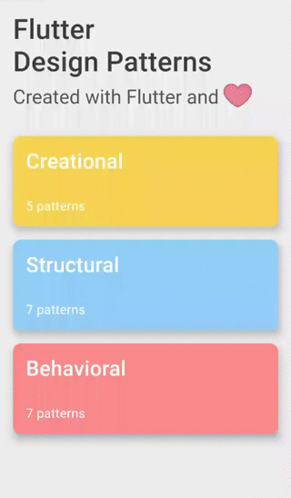

_An overview of the Flyweight design pattern and its implementation in Dart and Flutter_


In the last [article](../2020-04-15-flutter-design-patterns-18-builder/index.md), I analysed a creational design pattern that divides the construction of a complex object into several separate steps - Builder. In this article, I would like to analyse and implement a structural design pattern that helps using a huge number of objects in your code that could barely fit into available RAM - it is Flyweight.

<!--truncate-->

:::tip
To see all the design patterns in action, check the [Flutter Design Patterns application](https://flutterdesignpatterns.com/).
:::

## What is the Flyweight design pattern?


**Flyweight** belongs to the category of **structural** design patterns. The intention of this design pattern is described in the [GoF book](https://en.wikipedia.org/wiki/Design_Patterns):

> _Use sharing to support large numbers of fine-grained objects efficiently._

Let's take an object-oriented document editor as an example. For document elements like tables, images or figures, separate objects are created. However, for text elements (individual characters) this is not feasible even though it promotes flexibility: characters and any other embedded elements could be treated uniformly, and the application could be extended to support new character sets very easily. The reason is simple - limitations of the hardware. Usually, a document contains hundreds of thousands of character objects which would consume a lot of memory and it could lead to unexpected crashes, for instance, when the document is being edited and eventually there would be no memory left for new characters or any other type of embedded objects. How this kind of object-oriented document editor could be implemented, then?

The "secret" relies on the flyweight objects - shared objects that can be used in multiple contexts simultaneously. But how this could even work? If we reuse the same object, doesn't that mean that when the object is changed in one place, all the other places are affected, too? Well, the key concept here is the distinction between **intrinsic** and **extrinsic** states. The intrinsic state is invariant (context-independent) and therefore can be shared e.g. the code of a character in the used character set. The extrinsic state is variant (context-dependent) and therefore can not be shared e.g. the position of a character in the document. And that's the reason why this concept works in object-oriented editors - a separate flyweight object is created for each character in the set (e.g. each letter in the alphabet) which stores the character code as the intrinsic state, while the coordinate positions in the document of that character are passed to the flyweight object as an extrinsic state. As a result, only one flyweight object instance per character could be stored in the memory and shared across different contexts in the document structure. Sharing is caring, right?

Let's move to the analysis and implementation parts to understand and learn the details about this pattern and how to implement it!

## Analysis

The general structure of the Flyweight design pattern looks like this:


- *Flyweight* - contains an intrinsic state while the extrinsic state is passed to the flyweight's methods. The object must be shareable (can be used in many different contexts);
- *FlyweightFactory* - creates and manages flyweight objects. When a client calls the factory, it checks whether the specific flyweight object exists. If yes, it is simply returned to the client, otherwise, a new instance of the flyweight object is created and then returned;
- *Context* - contains the extrinsic state, unique across all original objects;
- *Client* - computes or stores the extrinsic state of flyweight(s) and maintains a reference to it/them.

### Applicability

The Flyweight design pattern should be used only when your program must support a huge number of objects which barely fit into available RAM. The pattern's effectiveness depends on how and where it's used. It would be the most useful when:

- An application uses a large number of objects;
- The objects drain all available RAM on a target device;
- The objects contain duplicate states which can be extracted and shared between multiple objects;
- Many groups of objects could be replaced by a few shared objects once the extrinsic state is removed;
- The application doesn't depend on object identity. Since flyweight objects are shared, conceptually distinct objects could be considered the same object.

## Implementation


Sadly, the implementation would not resolve any real-world problem this time, but we will implement a simple representation screen and later investigate how the usage of the Flyweight design pattern reduces memory consumption.

Let's say, we want to draw our custom background using two different geometric shapes - circles and squares. Also, in the background, we want to put a total of 1000 shapes at random positions. This will be implemented in two different ways:

- A new shape object would be created for each shape in the background;
- A flyweight factory would be used which creates a single object per shape.

Later, we will use a profiler tool for Dart Apps - [Observatory](https://github.com/dart-archive/observatory) - to investigate how much memory is used for each of these implementations. Let's check the class diagram first and then implement the pattern.

### Class diagram

The class diagram below shows the implementation of the Flyweight design pattern:


The `ShapeType` is an enumerator class defining possible shape types - Circle and Square.

`IPositionedShape` defines a common interface for the specific shape classes:

- `render()` - renders the shape - returns the positioned shape widget. Also, the **extrinsic** state (x and y coordinates) is passed to this method to render the shape in the exact position.

`Circle` and `Square` are concrete positioned shape implementations of the `IPositionedShape` interface. Both of these shapes have their own **intrinsic** state: a circle defines `color` and `diameter` properties while a square contains `color`, `width` properties and a getter `height` which returns the same value as `width`.

The `ShapeFactory` is a simple factory class that creates and returns a specific shape object via the `createShape()` method by providing the `ShapeType`.

The `ShapeFlyweightFactory` is a flyweight factory that contains a map of flyweight objects - `shapesMap`. When the concrete flyweight is requested via the `getShape()` method, the flyweight factory checks whether it exists on the map and returns it from there. Otherwise, a new instance of the shape is created using the `ShapeFactory` and persisted in the map object for further usage.

The `FlyweightExample` initialises and contains the `ShapeFlyweightFactory` object. Also, it contains a list of positioned shapes - `shapesList` - which is built using the `ShapeFlyweightFactory` and flyweight-positioned shape objects.

### ShapeType

A special kind of class - *enumeration* - to define different shape types.

```dart title="shape_type.dart"
enum ShapeType {
  circle,
  square,
}
```

### IPositionedShape

An interface that defines the `render()` method to be implemented by concrete shape classes. Dart language does not support the interface as a class type, so we define an interface by creating an abstract class and providing a method header (name, return type, parameters) without the default implementation.

```dart title="ipositioned_shape.dart"
abstract interface class IPositionedShape {
  Widget render(double x, double y);
}
```

### Concrete shapes

`Circle` - a specific implementation of the `IPositionedShape` interface representing the shape of a circle.

```dart title="circle.dart"
class Circle implements IPositionedShape {
  const Circle({
    required this.color,
    required this.diameter,
  });

  final Color color;
  final double diameter;

  @override
  Widget render(double x, double y) {
    return Positioned(
      left: x,
      bottom: y,
      child: Container(
        height: diameter,
        width: diameter,
        decoration: BoxDecoration(
          color: color,
          shape: BoxShape.circle,
        ),
      ),
    );
  }
}
```

`Square` - a specific implementation of the `IPositionedShape` interface representing the shape of a square.

```dart title="square.dart"
class Square implements IPositionedShape {
  const Square({
    required this.color,
    required this.width,
  });

  final Color color;
  final double width;

  double get _height => width;

  @override
  Widget render(double x, double y) {
    return Positioned(
      left: x,
      bottom: y,
      child: Container(
        height: _height,
        width: width,
        color: color,
      ),
    );
  }
}
```

### ShapeFactory

A simple factory class that defines the `createShape()` method to create a concrete shape by providing its type.

```dart title="shape_factory.dart"
class ShapeFactory {
  const ShapeFactory();

  IPositionedShape createShape(ShapeType shapeType) => switch (shapeType) {
        ShapeType.circle => Circle(
            color: Colors.red.withOpacity(0.2),
            diameter: 10.0,
          ),
        ShapeType.square => Square(
            color: Colors.blue.withOpacity(0.2),
            width: 10.0,
          ),
      };
}
```

### ShapeFlyweightFactory

A flyweight factory class that keeps track of all the flyweight objects and creates them if needed.

```dart title="shape_flyweight_factory.dart"
class ShapeFlyweightFactory {
  ShapeFlyweightFactory({
    required this.shapeFactory,
  });

  final ShapeFactory shapeFactory;
  final Map<ShapeType, IPositionedShape> shapesMap = {};

  IPositionedShape getShape(ShapeType shapeType) {
    if (!shapesMap.containsKey(shapeType)) {
      shapesMap[shapeType] = shapeFactory.createShape(shapeType);
    }

    return shapesMap[shapeType]!;
  }

  int getShapeInstancesCount() => shapesMap.length;
}
```

## Example

First of all, a markdown file is prepared and provided as a pattern's description:


`FlyweightExample` initialises and contains the `ShapeFlyweightFactory` class object. Also, for demonstration purposes, the `ShapeFactory` object is initialised here, too. Based on the selected option, either the `ShapeFactory` or `ShapeFlyweightFactory` is used to populate a list of `IPositionedShape` objects which are rendered in the background of the example screen.

```dart title="flyweight_example.dart"
class FlyweightExample extends StatefulWidget {
  const FlyweightExample();

  @override
  _FlyweightExampleState createState() => _FlyweightExampleState();
}

class _FlyweightExampleState extends State<FlyweightExample> {
  static const shapesCount = 1000;

  final shapeFactory = const ShapeFactory();

  late final ShapeFlyweightFactory _shapeFlyweightFactory;
  late List<IPositionedShape> _shapesList;

  var _shapeInstancesCount = 0;
  var _useFlyweightFactory = false;

  @override
  void initState() {
    super.initState();

    _shapeFlyweightFactory = ShapeFlyweightFactory(shapeFactory: shapeFactory);

    _buildShapesList();
  }

  void _buildShapesList() {
    var shapeInstancesCount = 0;
    _shapesList = <IPositionedShape>[];

    for (var i = 0; i < shapesCount; i++) {
      final shapeType = _getRandomShapeType();
      final shape = _useFlyweightFactory
          ? _shapeFlyweightFactory.getShape(shapeType)
          : shapeFactory.createShape(shapeType);

      shapeInstancesCount++;
      _shapesList.add(shape);
    }

    setState(() {
      _shapeInstancesCount = _useFlyweightFactory
          ? _shapeFlyweightFactory.getShapeInstancesCount()
          : shapeInstancesCount;
    });
  }

  ShapeType _getRandomShapeType() {
    const values = ShapeType.values;

    return values[Random().nextInt(values.length)];
  }

  void _toggleUseFlyweightFactory(bool value) {
    setState(() => _useFlyweightFactory = value);

    _buildShapesList();
  }

  @override
  Widget build(BuildContext context) {
    return Stack(
      children: <Widget>[
        for (var shape in _shapesList)
          PositionedShapeWrapper(
            shape: shape,
          ),
        Column(
          crossAxisAlignment: CrossAxisAlignment.start,
          children: <Widget>[
            SwitchListTile.adaptive(
              title: const Text(
                'Use flyweight factory',
                style: TextStyle(
                  fontWeight: FontWeight.bold,
                ),
              ),
              activeColor: Colors.black,
              value: _useFlyweightFactory,
              onChanged: _toggleUseFlyweightFactory,
            ),
          ],
        ),
        Center(
          child: Text(
            'Shape instances count: $_shapeInstancesCount',
            style: const TextStyle(
              fontWeight: FontWeight.bold,
            ),
          ),
        ),
      ],
    );
  }
}
```

With the `ShapeFlyweightFactory`, the client - `FlyweightExample` widget - does not care about the flyweight objects' creation or management. `IPositionedShape` objects are requested from the factory by passing the `ShapeType`, flyweight factory keeps all the instances of the needed shapes themselves, and only returns references to them. Hence, only a single instance of a shape object per type could be created and reused when needed.



From the example, we could see that either 2 or 1000 shape instances are created to build the screen background. However, to understand what is happening under the hood, we can check the memory consumption using Dart Observatory.

When we access the Markdown screen of the Flyweight design pattern, Circle and Square instances are not created since they are not visible on the screen:


Before rendering the Example screen (without using the flyweight factory), a total of 1000 shape instances are created - in this case, 484 circles and 516 squares:


When we use the flyweight factory, only one instance per specific shape is needed which is initiated and then shared (reused) later:


One shape instance uses 16 bytes of memory, so when we initiate 1000 shapes, that is ~16kB of memory in total. However, when a flyweight factory is used, only 32 bytes are enough to store all different shape instances - 500 times less memory is needed! Now, if you increase the number of shapes to 1 million, without the flyweight factory you would need ~15.2MB of memory to store them, but with a flyweight factory, the same 32 bytes would be enough.

All of the code changes for the Flyweight design pattern and its example implementation could be found [here](https://github.com/mkobuolys/flutter-design-patterns/pull/20).

:::tip
To see the pattern in action, check the [interactive Flyweight example](https://flutterdesignpatterns.com/pattern/flyweight).
:::
