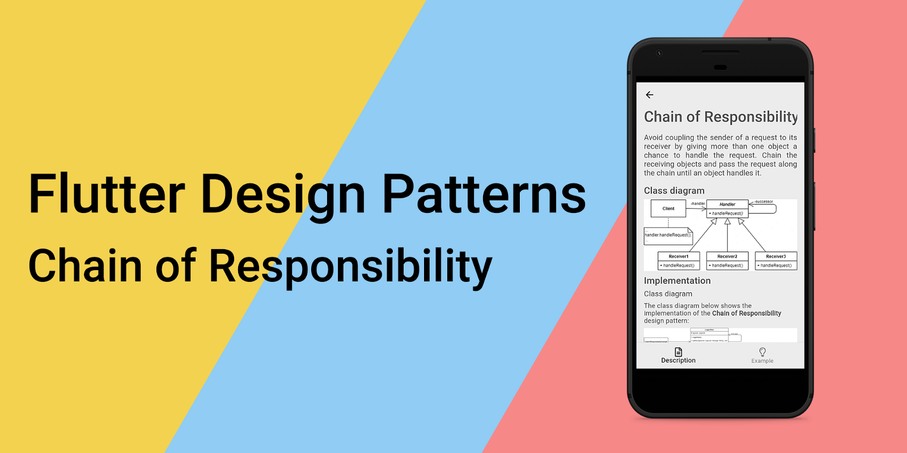
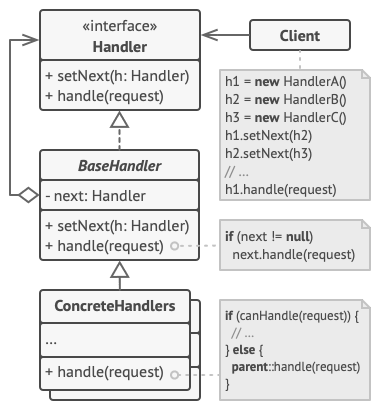
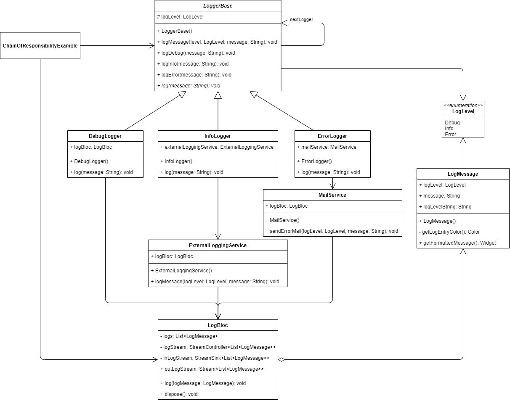

_An overview of the Chain of Responsibility design pattern and its implementation in Dart and Flutter_



Previously in the series, I analysed a structural design pattern that introduced a concept of a "shared object" which could be used in multiple contexts simultaneously, hence reducing the memory usage of your code - [Flyweight](../2020-06-01-flutter-design-patterns-19-flyweight/index.md). This time I would like to represent a behavioural design pattern, which enables loose coupling between the sender of a request and its receiver, also adding a possibility for the same request to be handled by multiple handlers - it is the Chain of Responsibility.

<!--truncate-->

:::tip
To see all the design patterns in action, check the [Flutter Design Patterns application](https://flutterdesignpatterns.com/).
:::

## What is the Chain of Responsibility design pattern?


**Chain of Responsibility (CoR)**, also known as **Chain of Command**, is a behavioural design pattern, which intention in the [GoF book](https://en.wikipedia.org/wiki/Design_Patterns) is described like this:

> _Avoid coupling the sender of a request to its receiver by giving more than one object a chance to handle the request. Chain the receiving objects and pass the request along the chain until an object handles it._

TL;DR: the Chain of Responsibility design pattern is an ordered list of message handlers that know how to do two things - process a specific type of message or pass the message along to the next message handler.

First of all, the Chain of Responsibility design pattern is behavioural which means that its primary purpose is to rework the basic workflow (behaviour) and split it into several separate parts or stand-alone objects (recall [Command](../2020-01-09-flutter-design-patterns-12-command/index.md) or [State](../2019-11-20-flutter-design-patterns-6-state/index.md) design patterns as examples). Let's say you have some kind of workflow defined in your code where each step should be executed sequentially. It works and everything is fine until…

- Some additional steps should be introduced. _Ok, not a big deal, just add them._
- Some of these steps are optional based on the request. _Well, let's add some conditional blocks, nothing extraordinary._
- Oops, we forgot validation… _Hmm, the code starts bloating somehow._
- A wild feature request appears: the order of the steps is different based on the request. _Please, stahp…_

Well, I hope you get the idea that this code could easily become a mess (not to mention the violation of the Open-Closed Principle - the letter **O** in [**SOLID**](https://en.wikipedia.org/wiki/SOLID) principles). What the CoR pattern suggests is to split each step into a separate component - *handler* - and later link these handlers into a chain. Each handler contains a reference to the next one, hence once the request is received it is processed by the handler and passed to the next one along the chain until the workflow is finished. As a result, we still have the same sequential code execution, but now each step is separated, and additional steps could be added without changing the existing code. But wait, there is more!

The Chain of Responsibility pattern allows reordering, adding or removing handlers in the chain at run-time - how cool is that, right? Also, each handler could be implemented in a way that it could decide whether to pass the request further down the chain or not.

Lots of great ideas are already mentioned here, so let's just jump right in by analysing the CoR design pattern and its implementation in more detail!

## Analysis

The general structure of the Chain of Responsibility design pattern looks like this:



- *Handler* - defines an interface for handling requests. This interface is optional when all the handlers extend the _BaseHandler_ class - then having a single abstract method for handling requests should be enough;
- *BaseHandler* - an abstract class that contains the boilerplate code common to all the handler classes and maintains a reference to the next handler object on the chain. Also, the class may implement the default handling behaviour e.g. it can pass the request to the next handler if there is one;
- *ConcreteHandlers* - contain the actual code for processing the request. Upon receiving a request, the handler could either handle it or pass it along the chain. Usually, handlers are immutable once they are initialised;
- *Client* - composes the chain(s) of handlers and later initiates the request to a _ConcreteHandler_ object on the chain.

### Applicability

The Chain of Responsibility design pattern should be used when the system is expected to process different kinds of requests in various ways, but neither the request types nor the handling sequence is defined at compile time. The pattern enables linking several handlers into one chain and allowing the client to pass requests along that chain. As a result, each handler will receive the request, process it, and/or pass it further. Also, to resolve the unknown handling sequence problem, handlers could provide setters for a reference field of the successor inside the handler classes - you will be able to add, delete or reorder handlers at run-time, hence changing the handling sequence of a request.

Furthermore, the CoR pattern should be used when a single request must be handled by multiple handlers, usually in a particular order. In this case, the chain could be defined at compile-time and all requests will get through the chain exactly as planned. If the execution order is irrelevant, just roll the dice and build the chain in random order - all handlers would still receive the request and handle it.

Finally, one thing to remember - **the receipt isn't guaranteed**. Since CoR introduces the loose coupling between sender and receiver, and the request could be handled by any handler in the chain, there is no guarantee that it will be actually handled. In cases when the request must be processed by at least one handler, you must ensure that the chain is configured properly, for instance, by adding some kind of a monitor handler at the end of the chain that notifies about unhandled requests and/or executes some specific logic.

## Implementation


We will use the Chain of Responsibility design pattern to implement a custom logging workflow in the application.

Let's say that we want 3 different log levels based on their importance:

- Debug - only needed in the local environment for development purposes;
- Info - we want to see those logs locally, but also they should be stored and visible in the external logging service when the application is deployed;
- Error - those logs must be visible locally and external logging service, but also we want to notify our development team by sending an e-mail when such a log appears.

In this case, our request is a log message with its content and log level. Our handlers - debug, info and error loggers with their custom logic. To implement the wanted workflow, we could link the loggers in the following order: Debug -> Info -> Error. If the logger's log level is lower or equal to the one defined in the message, the message should be logged. And that's basically it, really, it's that simple!

A picture is worth a thousand words, so let's check the class diagram first and then implement the pattern.

### Class diagram

The class diagram below shows the implementation of the Chain of Responsibility design pattern:



The `LogLevel` is an enumerator class defining possible log levels - Debug, Info and Error.

`LogMessage` class is used to store information about the log message: its log level and the message text. It also provides a public `getFormattedMessage()` method to format the log entry as a Widget object (for that, a private helper method `getLogEntryColor()` and a getter `logLevelString` are used).

`LoggerBase` is an abstract class that is used as a base class for all the specific loggers:

- `logMessage()` - logs message using the `log()` method and passes the request along the chain;
- `logDebug()` - logs the message with a log level of Debug;
- `logInfo()` - logs the message with a log level of Info;
- `logError()` - logs the message with a log level of Error;
- `log()` - an abstract method to log the message (must be implemented by a specific logger).

Also, the `LoggerBase` contains a reference to the next logger (`nextLogger`) and the logger's log level (`logLevel`).

`DebugLogger`, `InfoLogger` and `ErrorLogger` are concrete logger classes that extend the `LoggerBase` class and implement the abstract `log()` method. `InfoLogger` uses the `ExternalLoggingService` to log messages, and `ErrorLogger` - the `MailService`.

All the specific loggers use or inject the `LogBloc` class to mock the actual logging and provide log entries to the UI.

`LogBloc` stores a list of logs and exposes them through the stream - `outLogStream`. Also, it defines the `log()` method to add a new log to the list and notify `outLogStream` subscribers with an updated log entries list.

`ChainOfResponsibilityExample` creates a chain of loggers and uses public methods defined in `LoggerBase` to log messages. It also initialises and contains the `LogBloc` instance to store log entries and later show them in the UI.

### LogLevel

A special kind of class - *enumeration* - to define different log levels. Also, the `<=` operator is overridden to compare whether one log level is lower or equal to the other.

```dart title="log_level.dart"
enum LogLevel {
  debug,
  info,
  error;

  bool operator <=(LogLevel logLevel) => index <= logLevel.index;
}
```

### LogMessage

A simple class to store information about the log entry: log level and message. Also, this class defines a private getter `logLevelString` to return the text representation of a specific log level and a private method `getLogEntryColor()` to return the log entry colour based on the log level. The `getFormattedMessage()` method returns the formatted log entry as a `Text` widget which is used in the UI.

```dart title="log_message.dart"
class LogMessage {
  const LogMessage({
    required this.logLevel,
    required this.message,
  });

  final LogLevel logLevel;
  final String message;

  String get _logLevelString =>
      logLevel.toString().split('.').last.toUpperCase();

  Color _getLogEntryColor() => switch (logLevel) {
        LogLevel.debug => Colors.grey,
        LogLevel.info => Colors.blue,
        LogLevel.error => Colors.red,
      };

  Widget getFormattedMessage() => Text(
        '$_logLevelString: $message',
        style: TextStyle(color: _getLogEntryColor()),
        textAlign: TextAlign.justify,
        overflow: TextOverflow.ellipsis,
        maxLines: 2,
      );
}
```

### LogBloc

A Business Logic component (BLoC) class to store log messages and provide them to the UI through a public stream. New log entries are added to the logs list via the `log()` method while all the logs could be accessed through the public `outLogStream`.

```dart title="log_bloc.dart"
class LogBloc {
  final List<LogMessage> _logs = [];
  final _logStream = StreamController<List<LogMessage>>();

  StreamSink<List<LogMessage>> get _inLogStream => _logStream.sink;
  Stream<List<LogMessage>> get outLogStream => _logStream.stream;

  void log(LogMessage logMessage) {
    _logs.add(logMessage);
    _inLogStream.add(UnmodifiableListView(_logs));
  }

  void dispose() {
    _logStream.close();
  }
}
```

### ExternalLoggingService

A simple class that represents the actual external logging service. Instead of sending the log message to some kind of 3rd party logging service (which, in fact, could be called in the `logMessage()` method), it just logs the message to UI through the `LogBloc`.

```dart title="external_logging_service.dart"
class ExternalLoggingService {
  const ExternalLoggingService(this.logBloc);

  final LogBloc logBloc;

  void logMessage(LogLevel logLevel, String message) {
    final logMessage = LogMessage(logLevel: logLevel, message: message);

    // Send log message to the external logging service

    // Log message
    logBloc.log(logMessage);
  }
}
```

### MailService

A simple class that represents the actual mail logging service. Instead of sending the log message as an email to the user, it just logs the message to UI through `LogBloc`.

```dart title="mail_service.dart"
class MailService {
  const MailService(this.logBloc);

  final LogBloc logBloc;

  void sendErrorMail(LogLevel logLevel, String message) {
    final logMessage = LogMessage(logLevel: logLevel, message: message);

    // Send error mail

    // Log message
    logBloc.log(logMessage);
  }
}
```

### LoggerBase

An abstract class for the base logger implementation. It stores the log level and a reference (successor) to the next logger in the chain. Also, the class implements a common `logMessage()` method that logs the message if its log level is lower than the current logger's and then forwards the message to the successor (if there is one). The abstract `log()` method must be implemented by specific loggers extending the `LoggerBase` class.

```dart title="logger_base.dart"
abstract class LoggerBase {
  const LoggerBase({
    required this.logLevel,
    LoggerBase? nextLogger,
  }) : _nextLogger = nextLogger;

  @protected
  final LogLevel logLevel;
  final LoggerBase? _nextLogger;

  void logMessage(LogLevel level, String message) {
    if (logLevel <= level) log(message);

    _nextLogger?.logMessage(level, message);
  }

  void logDebug(String message) => logMessage(LogLevel.debug, message);
  void logInfo(String message) => logMessage(LogLevel.info, message);
  void logError(String message) => logMessage(LogLevel.error, message);

  void log(String message);
}
```

### Concrete loggers

`DebugLogger` - a specific implementation of the logger that sets the log level to `Debug` and simply logs the message to UI through the `LogBloc`.

```dart title="debug_logger.dart"
class DebugLogger extends LoggerBase {
  const DebugLogger(
    this.logBloc, {
    super.nextLogger,
  }) : super(logLevel: LogLevel.debug);

  final LogBloc logBloc;

  @override
  void log(String message) {
    final logMessage = LogMessage(logLevel: logLevel, message: message);

    logBloc.log(logMessage);
  }
}
```

`InfoLogger` - a specific implementation of the logger that sets the log level to `Info` and uses the `ExternalLoggingService` to log the message.

```dart title="info_logger.dart"
class InfoLogger extends LoggerBase {
  InfoLogger(
    LogBloc logBloc, {
    super.nextLogger,
  })  : externalLoggingService = ExternalLoggingService(logBloc),
        super(logLevel: LogLevel.info);

  final ExternalLoggingService externalLoggingService;

  @override
  void log(String message) {
    externalLoggingService.logMessage(logLevel, message);
  }
}
```

`ErrorLogger` - a specific implementation of the logger that sets the log level to `Error` and uses the `MailService` to log the message.

```dart title="error_logger.dart"
class ErrorLogger extends LoggerBase {
  ErrorLogger(
    LogBloc logBloc, {
    super.nextLogger,
  })  : mailService = MailService(logBloc),
        super(logLevel: LogLevel.error);

  final MailService mailService;

  @override
  void log(String message) {
    mailService.sendErrorMail(logLevel, message);
  }
}
```

## Example

First of all, a markdown file is prepared and provided as a pattern's description:


The `ChainOfResponsibilityExample` widget initialises and contains the loggers' chain object (see the `initState()` method). Also, for demonstration purposes, the `LogBloc` object is initialised there, too, and used to send logs and retrieve a list of them through the stream - `outLogStream`.

```dart title="chain_of_responsibility_example.dart"
class ChainOfResponsibilityExample extends StatefulWidget {
  const ChainOfResponsibilityExample();

  @override
  _ChainOfResponsibilityExampleState createState() =>
      _ChainOfResponsibilityExampleState();
}

class _ChainOfResponsibilityExampleState
    extends State<ChainOfResponsibilityExample> {
  final logBloc = LogBloc();

  late final LoggerBase logger;

  @override
  void initState() {
    super.initState();

    logger = DebugLogger(
      logBloc,
      nextLogger: InfoLogger(
        logBloc,
        nextLogger: ErrorLogger(logBloc),
      ),
    );
  }

  @override
  void dispose() {
    logBloc.dispose();
    super.dispose();
  }

  String get randomLog => faker.lorem.sentence();

  @override
  Widget build(BuildContext context) {
    return ScrollConfiguration(
      behavior: const ScrollBehavior(),
      child: SingleChildScrollView(
        padding: const EdgeInsets.symmetric(
          horizontal: LayoutConstants.paddingL,
        ),
        child: Column(
          children: <Widget>[
            PlatformButton(
              materialColor: Colors.black,
              materialTextColor: Colors.white,
              onPressed: () => logger.logDebug(randomLog),
              text: 'Log debug',
            ),
            PlatformButton(
              materialColor: Colors.black,
              materialTextColor: Colors.white,
              onPressed: () => logger.logInfo(randomLog),
              text: 'Log info',
            ),
            PlatformButton(
              materialColor: Colors.black,
              materialTextColor: Colors.white,
              onPressed: () => logger.logError(randomLog),
              text: 'Log error',
            ),
            const Divider(),
            Row(
              children: <Widget>[
                Expanded(
                  child: StreamBuilder<List<LogMessage>>(
                    initialData: const [],
                    stream: logBloc.outLogStream,
                    builder: (context, snapshot) =>
                        LogMessagesColumn(logMessages: snapshot.data!),
                  ),
                ),
              ],
            ),
          ],
        ),
      ),
    );
  }
}
```

By creating a chain of loggers, the client - `ChainOfResponsibilityExample` widget - does not care about the details on which specific logger should handle the log entry, it just passes (logs) the message to a chain of loggers. This way, the sender (client) and receiver (logger) are decoupled, and the loggers' chain itself could be built at run-time in any order or structure e.g. you can skip the Debug logger for non-local environments and only use the Info -> Error chain.


As you can see in the example, _debug_ level logs are only handled by the debug logger, *info* - by debug and info level handlers and _error_ logs are handled by all three loggers.

All of the code changes for the Chain of Responsibility design pattern and its example implementation could be found [here](https://github.com/mkobuolys/flutter-design-patterns/pull/21).

:::tip
To see the pattern in action, check the [interactive Chain of Responsibility example](https://flutterdesignpatterns.com/pattern/chain-of-responsibility).
:::
