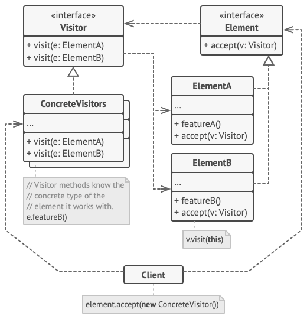
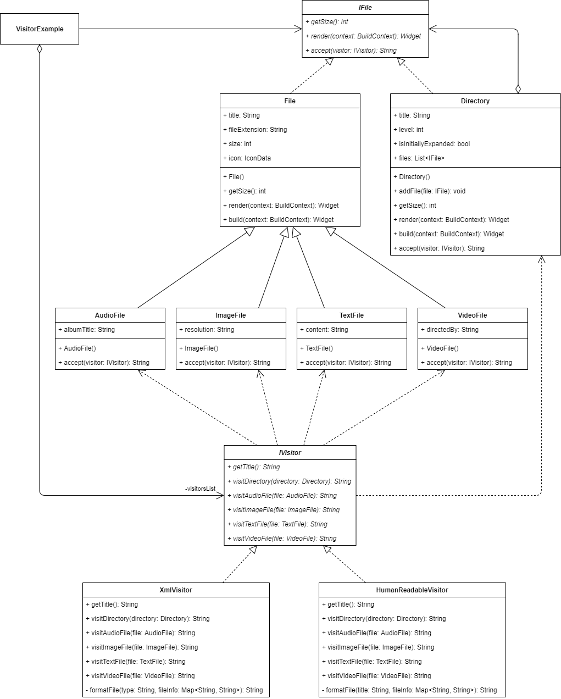

_An overview of the Visitor design pattern and its implementation in Dart and Flutter_


In the last [article](../2020-10-22-flutter-design-patterns-20-chain-of-responsibility/index.md), I analysed a behavioural design pattern that enables loose coupling between the sender of a request and its receiver - the Chain of Responsibility. In this article, I would like to analyse and implement another behavioural design pattern that lets you separate algorithms from the objects on which they operate - it is Visitor.

<!--truncate-->

:::tip
To see all the design patterns in action, check the [Flutter Design Patterns application](https://flutterdesignpatterns.com/).
:::

## What is the Visitor design pattern?


**Visitor** belongs to the category of **behavioural** design patterns. The intention of this design pattern is described in the [GoF book](https://en.wikipedia.org/wiki/Design_Patterns):

> _Represent an operation to be performed on the elements of an object structure. Visitor lets you define a new operation without changing the classes of the elements on which it operates._

Let's say we have a complex object structure, maybe it is a tree or collection, that consists of several different class components. Now, we want to add some kind of new functionality to these components without changing the classes themselves - is that even possible?

The key idea here is to define a double-dispatch operation (in the Visitor design pattern's context, the operation is called _accept_) for each specific complex object class - I know, you could think that I lied to you about adding new operations without changing the existing code, but wait, there is a good reason for that! When clients traverse the object structure, the _accept_ method is called on each element to delegate the request to the specific _visitor_ object, which is passed to the method as a parameter. Then, the specific method of the visitor object is called (the request is delegated), hence performing the actual request. That's the main idea of a double-dispatch operation - the client sends the request to the component, while the component delegates the request to the specific visitor's method. It means, that it is enough to implement a single method to the component class and then you can define a new operation over an object structure simply by adding a new visitor. And this time, you could implement as many different visitor classes as you want without changing the existing code! How cool is that?

Also, the Visitor design pattern allows gathering related operations into a single class without spreading the implementation details across the whole object structure. That helps when you want to accumulate a state while traversing an object structure - there is no need to pass the state to operations that perform the accumulation since the state is stored in the visitor object itself and is accessible by all the specific visitor methods.

At first, all the _visitor_, _accept_, _double-dispatch_ terms could look confusing - don't worry, it gets much clearer when you see the Visitor design pattern in action. Let's move to the analysis and implementation parts to understand and learn the details about this pattern and how to implement it!

## Analysis

The general structure of the Visitor design pattern looks like this:



- *Visitor* - declares a visit operation for each _concrete element_ class in the object structure. If the programming language supports [function overloading](https://en.wikipedia.org/wiki/Function_overloading), visit operations could have the same name (Dart does not support that at the moment), but the type of their parameters must be different. Usually, the operation's name and signature are different and identify the class (_concrete element_) that sends the visit request to the visitor;
- *Concrete visitors* - implements each operation declared by _Visitor_;
- *Element* - declares an _accept_ method that takes _Visitor_ as an argument;
- *Concrete elements* - implements the acceptance method. The implementation should rely on redirecting the request to the proper visitor's method corresponding to the current element class;
- *Client* - usually contains a collection or a complex object structure, initialises the _concrete visitor_ object and then traverses the object structure by visiting each element with the visitor.

### Applicability

The primary purpose of the Visitor design pattern is to separate algorithms from the objects on which they operate, hence cleaning up the business logic. This way, the classes of your app could focus on their main job while auxiliary behaviours are extracted into a set of visitor classes. Also, visitors allows keeping the related operations together by defining them in one class.

Furthermore, the Visitor design pattern should be used when you want to execute an operation on all elements of a complex object structure and you do not want to change the interface(s) of concrete classes. Different visiting method implementations are executed on different classes which accept the visitors, hence the specific implementation details could be changed or new specific visitor implementations could be added without interfering with the existing code base of the object structure and its components.

Finally, there is one important thing to note: the Visitor design pattern only makes sense for object structures that rarely change (as always, take it with a grain of salt). If you just want to change or add new implementations for visitors - that's fine. However, changing the object structure classes requires redefining the interface for all visitors which could become cumbersome and violates the Open-Closed (the letter **O** in [**SOLID**](https://en.wikipedia.org/wiki/SOLID) principles). A simple solution to this problem is just defining the operations in those classes without extracting them to a visitor.

## Implementation


For the implementation part, we will use the Visitor design pattern on the already implemented complex object structure which was introduced with the [Composite](../2019-11-07-flutter-design-patterns-4-composite/index.md) design pattern. In my opinion, it would be a great example of how different design patterns could complement each other and how to reuse/extend the already existing codebase.

Our complex object structure is a file system that consists of directories and files of various types (audio, video, text, etc.). Let's say that this kind of structure is already implemented using the Composite design pattern. Now, we want to add a possibility to export such file structure in two different formats: human-readable (just provide each file in a single, formatted list) and XML.

The first possible approach to implement this feature is to define the export method for each specific file type. In this case, this is wrong for several reasons:

- For each specific export option, we would need to implement a separate export method in each specific file class. Also, by adding a new export option in the future, we would need to add some extra code to each file class once again.
- It's a violation of the [Single-responsibility](https://en.wikipedia.org/wiki/Single-responsibility_principle) principle. The export functionality is just an auxiliary operation applied on top of the file structure, hence each specific file should not care and store the implementation details inside the class itself.

As you could guess, these problems could be easily resolved by applying the Visitor design pattern and defining each specific export option in a separate visitor class which takes care of all the specific implementation details for all the file types in a single place. Let's check the class diagram first and then implement the pattern!

### Class diagram

The class diagram below shows the implementation of the Visitor design pattern:



`IFile` defines a common interface for both `File` and `Directory` classes:

- `getSize()` - returns the size of the file;
- `render()` - renders the component's UI;
- `accept()` - delegates request to a visitor.

`File` class implements the `getSize()` and `render()` methods, additionally contains `title`, `fileExtension`, `size` and `icon` properties.

`AudioFile`, `ImageFile`, `TextFile` and `VideoFile` are concrete file classes implementing the `accept()` method from the `IFile` interface and containing some additional information about the specific file.

`Directory` implements the same required methods as `File`, but it also contains `title`, `level`, `isInitiallyExpanded` properties and `files` list, containing the `IFile` objects. It also defines the `addFile()` method, which allows adding `IFile` objects to the directory (`files` list). Similarly, as in specific file classes, `accept()` method is implemented here as well.

`IVisitor` defines a common interface for the specific visitor classes:

- `getTitle()` - returns the title of the visitor that is used in the UI;
- `visitDirectory()` - defines a visiting method for the `Directory` class;
- `visitAudioFile()` - defines a visiting method for the `AudioFile` class;
- `visitImageFile()` - defines a visiting method for the `ImageFile` class;
- `visitTextFile()` - defines a visiting method for the `TextFile` class;
- `visitVideoFile()` - defines a visiting method for the `VideoFile` class.

`HumanReadableVisitor` and `XmlVisitor` are concrete visitor classes that implement visit methods for each specific file type.

`VisitorExample` contains a list of visitors implementing the `IVisitor` interface and the composite file structure. The selected visitor is used to format the visible file structure as text and provide it to the UI.

### IFile

An interface that defines methods to be implemented by specific files and directories. The interface also defines an `accept()` method which is used for the Visitor design pattern implementation.

```dart title="ifile.dart"
abstract interface class IFile {
  int getSize();
  Widget render(BuildContext context);
  String accept(IVisitor visitor);
}
```

### File

A concrete implementation of the `IFile` interface. In the `File` class, the `getSize()` method simply returns the file size, and `render()` - returns the file's UI widget which is used in the example screen.

```dart title="file.dart"
abstract class File extends StatelessWidget implements IFile {
  final String title;
  final String fileExtension;
  final int size;
  final IconData icon;

  const File({
    required this.title,
    required this.fileExtension,
    required this.size,
    required this.icon,
  });

  @override
  int getSize() => size;

  @override
  Widget render(BuildContext context) {
    return Padding(
      padding: const EdgeInsets.only(left: LayoutConstants.paddingS),
      child: ListTile(
        title: Text(
          '$title.$fileExtension',
          style: Theme.of(context).textTheme.bodyLarge,
        ),
        leading: Icon(icon),
        trailing: Text(
          FileSizeConverter.bytesToString(size),
          style: Theme.of(context)
              .textTheme
              .bodyMedium
              ?.copyWith(color: Colors.black54),
        ),
        dense: true,
      ),
    );
  }

  @override
  Widget build(BuildContext context) => render(context);
}
```

### Concrete file classes

All of the specific file type classes implement the `accept()` method that delegates request to the specific visitor's method.

`AudioFile` - a specific file class representing the audio file type that contains an additional `albumTitle` property.

```dart title="audio_file.dart"
class AudioFile extends File {
  const AudioFile({
    required this.albumTitle,
    required super.title,
    required super.fileExtension,
    required super.size,
  }) : super(icon: Icons.music_note);

  final String albumTitle;

  @override
  String accept(IVisitor visitor) => visitor.visitAudioFile(this);
}
```

`ImageFile` - a specific file class representing the image file type that contains an additional `resolution` property.

```dart title="image_file.dart"
class ImageFile extends File {
  const ImageFile({
    required this.resolution,
    required super.title,
    required super.fileExtension,
    required super.size,
  }) : super(icon: Icons.image);

  final String resolution;

  @override
  String accept(IVisitor visitor) => visitor.visitImageFile(this);
}
```

`TextFile` - a specific file class representing the text file type that contains an additional `content` property.

```dart title="text_file.dart"
class TextFile extends File {
  const TextFile({
    required this.content,
    required super.title,
    required super.fileExtension,
    required super.size,
  }) : super(icon: Icons.description);

  final String content;

  @override
  String accept(IVisitor visitor) => visitor.visitTextFile(this);
}
```

`VideoFile` - a specific file class representing the video file type that contains an additional `directedBy` property.

```dart title="video_file.dart"
class VideoFile extends File {
  const VideoFile({
    required this.directedBy,
    required super.title,
    required super.fileExtension,
    required super.size,
  }) : super(icon: Icons.movie);

  final String directedBy;

  @override
  String accept(IVisitor visitor) => visitor.visitVideoFile(this);
}
```

### Directory

A concrete implementation of the `IFile` interface. Similarly, as in the `File` class, `render()` returns the directory's UI widget which is used in the example screen. However, in this class `getSize()` method calculates the directory size by calling the `getSize()` method for each item in the `files` list and adding up the results. Also, the class implements the `accept()` method that delegates request to the specific visitor's method for the directory.

```dart title="directory.dart"
class Directory extends StatelessWidget implements IFile {
  final String title;
  final int level;
  final bool isInitiallyExpanded;

  final List<IFile> _files = [];
  List<IFile> get files => _files;

  Directory({
    required this.title,
    required this.level,
    this.isInitiallyExpanded = false,
  });

  void addFile(IFile file) => _files.add(file);

  @override
  int getSize() {
    var sum = 0;

    for (final file in _files) {
      sum += file.getSize();
    }

    return sum;
  }

  @override
  Widget render(BuildContext context) {
    return Theme(
      data: ThemeData(
        colorScheme: ColorScheme.fromSwatch().copyWith(primary: Colors.black),
      ),
      child: Padding(
        padding: const EdgeInsets.only(left: LayoutConstants.paddingS),
        child: ExpansionTile(
          leading: const Icon(Icons.folder),
          title: Text('$title (${FileSizeConverter.bytesToString(getSize())})'),
          initiallyExpanded: isInitiallyExpanded,
          children: _files.map((IFile file) => file.render(context)).toList(),
        ),
      ),
    );
  }

  @override
  Widget build(BuildContext context) => render(context);

  @override
  String accept(IVisitor visitor) => visitor.visitDirectory(this);
}
```

### Formatting extensions

Defines an extension method `indentAndAddNewLine` that adds `nTab` tabs at the beginning and a new line symbol at the end of a String.

```dart title="formatting_extension.dart"
extension FormattingExtension on String {
  String indentAndAddNewLine(int nTabs) => '${'\t' * nTabs}$this\n';
}
```

### IVisitor

An interface that defines methods to be implemented by all specific visitors.

```dart title="ivisitor.dart"
abstract interface class IVisitor {
  String getTitle();
  String visitDirectory(Directory directory);
  String visitAudioFile(AudioFile file);
  String visitImageFile(ImageFile file);
  String visitTextFile(TextFile file);
  String visitVideoFile(VideoFile file);
}
```

### Concrete visitors

`HumanReadableVisitor` - implements the specific visitor that provides file information of each file type in a human-readable format.

```dart title="human_readable_visitor.dart"
class HumanReadableVisitor implements IVisitor {
  const HumanReadableVisitor();

  @override
  String getTitle() => 'Export as text';

  @override
  String visitAudioFile(AudioFile file) {
    final fileInfo = <String, String>{
      'Type': 'Audio',
      'Album': file.albumTitle,
      'Extension': file.fileExtension,
      'Size': FileSizeConverter.bytesToString(file.getSize()),
    };

    return _formatFile(file.title, fileInfo);
  }

  @override
  String visitDirectory(Directory directory) {
    final buffer = StringBuffer();

    for (final file in directory.files) {
      buffer.write(file.accept(this));
    }

    return buffer.toString();
  }

  @override
  String visitImageFile(ImageFile file) {
    final fileInfo = <String, String>{
      'Type': 'Image',
      'Resolution': file.resolution,
      'Extension': file.fileExtension,
      'Size': FileSizeConverter.bytesToString(file.getSize()),
    };

    return _formatFile(file.title, fileInfo);
  }

  @override
  String visitTextFile(TextFile file) {
    final fileContentPreview = file.content.length > 30
        ? '${file.content.substring(0, 30)}...'
        : file.content;

    final fileInfo = <String, String>{
      'Type': 'Text',
      'Preview': fileContentPreview,
      'Extension': file.fileExtension,
      'Size': FileSizeConverter.bytesToString(file.getSize()),
    };

    return _formatFile(file.title, fileInfo);
  }

  @override
  String visitVideoFile(VideoFile file) {
    final fileInfo = <String, String>{
      'Type': 'Video',
      'Directed by': file.directedBy,
      'Extension': file.fileExtension,
      'Size': FileSizeConverter.bytesToString(file.getSize()),
    };

    return _formatFile(file.title, fileInfo);
  }

  String _formatFile(String title, Map<String, String> fileInfo) {
    final buffer = StringBuffer();

    buffer.write('$title:\n');

    for (final entry in fileInfo.entries) {
      buffer.write('${entry.key}: ${entry.value}'.indentAndAddNewLine(2));
    }

    return buffer.toString();
  }
}
```

`XmlVisitor` - implements the specific visitor that provides file information of each file type in XML format.

```dart title="xml_visitor.dart"
class XmlVisitor implements IVisitor {
  const XmlVisitor();

  @override
  String getTitle() => 'Export as XML';

  @override
  String visitAudioFile(AudioFile file) {
    final fileInfo = <String, String>{
      'title': file.title,
      'album': file.albumTitle,
      'extension': file.fileExtension,
      'size': FileSizeConverter.bytesToString(file.getSize()),
    };

    return _formatFile('audio', fileInfo);
  }

  @override
  String visitDirectory(Directory directory) {
    final isRootDirectory = directory.level == 0;
    final buffer = StringBuffer();

    if (isRootDirectory) buffer.write('<files>\n');

    for (final file in directory.files) {
      buffer.write(file.accept(this));
    }

    if (isRootDirectory) buffer.write('</files>\n');

    return buffer.toString();
  }

  @override
  String visitImageFile(ImageFile file) {
    final fileInfo = <String, String>{
      'title': file.title,
      'resolution': file.resolution,
      'extension': file.fileExtension,
      'size': FileSizeConverter.bytesToString(file.getSize()),
    };

    return _formatFile('image', fileInfo);
  }

  @override
  String visitTextFile(TextFile file) {
    final fileContentPreview = file.content.length > 30
        ? '${file.content.substring(0, 30)}...'
        : file.content;

    final fileInfo = <String, String>{
      'title': file.title,
      'preview': fileContentPreview,
      'extension': file.fileExtension,
      'size': FileSizeConverter.bytesToString(file.getSize()),
    };

    return _formatFile('text', fileInfo);
  }

  @override
  String visitVideoFile(VideoFile file) {
    final fileInfo = <String, String>{
      'title': file.title,
      'directed_by': file.directedBy,
      'extension': file.fileExtension,
      'size': FileSizeConverter.bytesToString(file.getSize()),
    };

    return _formatFile('video', fileInfo);
  }

  String _formatFile(String type, Map<String, String> fileInfo) {
    final buffer = StringBuffer();

    buffer.write('<$type>'.indentAndAddNewLine(2));

    for (final entry in fileInfo.entries) {
      buffer.write(
        '<${entry.key}>${entry.value}</${entry.key}>'.indentAndAddNewLine(4),
      );
    }

    buffer.write('</$type>'.indentAndAddNewLine(2));

    return buffer.toString();
  }
}
```

## Example

First of all, a markdown file is prepared and provided as a pattern's description:


The `VisitorExample` widget contains the `buildMediaDirectory()` method which builds the file structure for the example. Also, it contains a list of different visitors and provides it to the `FilesVisitorSelection` widget where the index of a specific visitor is selected by triggering the `setSelectedVisitorIndex()` method.

```dart title="visitor_example.dart"
class VisitorExample extends StatefulWidget {
  const VisitorExample();

  @override
  _VisitorExampleState createState() => _VisitorExampleState();
}

class _VisitorExampleState extends State<VisitorExample> {
  final visitorsList = const [HumanReadableVisitor(), XmlVisitor()];

  late final IFile _rootDirectory;
  var _selectedVisitorIndex = 0;

  @override
  void initState() {
    super.initState();

    _rootDirectory = _buildMediaDirectory();
  }

  IFile _buildMediaDirectory() {
    final musicDirectory = Directory(title: 'Music', level: 1)
      ..addFile(
        const AudioFile(
          title: 'Darude - Sandstorm',
          albumTitle: 'Before the Storm',
          fileExtension: 'mp3',
          size: 2612453,
        ),
      )
      ..addFile(
        const AudioFile(
          title: 'Toto - Africa',
          albumTitle: 'Toto IV',
          fileExtension: 'mp3',
          size: 3219811,
        ),
      )
      ..addFile(
        const AudioFile(
          title: 'Bag Raiders - Shooting Stars',
          albumTitle: 'Bag Raiders',
          fileExtension: 'mp3',
          size: 3811214,
        ),
      );

    final moviesDirectory = Directory(title: 'Movies', level: 1)
      ..addFile(
        const VideoFile(
          title: 'The Matrix',
          directedBy: 'The Wachowskis',
          fileExtension: 'avi',
          size: 951495532,
        ),
      )
      ..addFile(
        const VideoFile(
          title: 'Pulp Fiction',
          directedBy: 'Quentin Tarantino',
          fileExtension: 'mp4',
          size: 1251495532,
        ),
      );

    final catPicturesDirectory = Directory(title: 'Cats', level: 2)
      ..addFile(
        const ImageFile(
          title: 'Cat 1',
          resolution: '640x480px',
          fileExtension: 'jpg',
          size: 844497,
        ),
      )
      ..addFile(
        const ImageFile(
          title: 'Cat 2',
          resolution: '1280x720px',
          fileExtension: 'jpg',
          size: 975363,
        ),
      )
      ..addFile(
        const ImageFile(
          title: 'Cat 3',
          resolution: '1920x1080px',
          fileExtension: 'png',
          size: 1975363,
        ),
      );

    final picturesDirectory = Directory(title: 'Pictures', level: 1)
      ..addFile(catPicturesDirectory)
      ..addFile(
        const ImageFile(
          title: 'Not a cat',
          resolution: '2560x1440px',
          fileExtension: 'png',
          size: 2971361,
        ),
      );

    final mediaDirectory = Directory(
      title: 'Media',
      level: 0,
      isInitiallyExpanded: true,
    )
      ..addFile(musicDirectory)
      ..addFile(moviesDirectory)
      ..addFile(picturesDirectory)
      ..addFile(Directory(title: 'New Folder', level: 1))
      ..addFile(
        const TextFile(
          title: 'Nothing suspicious there',
          content: 'Just a normal text file without any sensitive information.',
          fileExtension: 'txt',
          size: 430791,
        ),
      )
      ..addFile(
        const TextFile(
          title: 'TeamTrees',
          content:
              'Team Trees, also known as #teamtrees, is a collaborative fundraiser that managed to raise 20 million U.S. dollars before 2020 to plant 20 million trees.',
          fileExtension: 'txt',
          size: 1042,
        ),
      );

    return mediaDirectory;
  }

  void _setSelectedVisitorIndex(int? index) {
    if (index == null) return;

    setState(() => _selectedVisitorIndex = index);
  }

  void _showFilesDialog() {
    final selectedVisitor = visitorsList[_selectedVisitorIndex];
    final filesText = _rootDirectory.accept(selectedVisitor);

    showDialog<void>(
      context: context,
      barrierDismissible: false,
      builder: (_) => FilesDialog(filesText: filesText),
    );
  }

  @override
  Widget build(BuildContext context) {
    return ScrollConfiguration(
      behavior: const ScrollBehavior(),
      child: SingleChildScrollView(
        padding: const EdgeInsets.symmetric(
          horizontal: LayoutConstants.paddingL,
        ),
        child: Column(
          children: [
            FilesVisitorSelection(
              visitorsList: visitorsList,
              selectedIndex: _selectedVisitorIndex,
              onChanged: _setSelectedVisitorIndex,
            ),
            PlatformButton(
              materialColor: Colors.black,
              materialTextColor: Colors.white,
              onPressed: _showFilesDialog,
              text: 'Export files',
            ),
            const SizedBox(height: LayoutConstants.spaceL),
            _rootDirectory.render(context),
          ],
        ),
      ),
    );
  }
}
```

When exporting files' information and providing it in the modal via the `showFilesDialog()` method, the example widget does not care about the concrete selected visitor as long as it implements the `IVisitor` interface. The selected visitor is just applied to the whole file structure by passing it as a parameter to the `accept()` method, hence retrieving the formatted files' structure as text and providing it to the opened `FilesDialog` modal.


As you can see in the example, by selecting the specific visitor (export as text or XML option), the file structure is exported in the corresponding text format and provided to the user.

All of the code changes for the Visitor design pattern and its example implementation could be found [here](https://github.com/mkobuolys/flutter-design-patterns/pull/22).

:::tip
To see the pattern in action, check the [interactive Visitor example](https://flutterdesignpatterns.com/pattern/visitor).
:::
