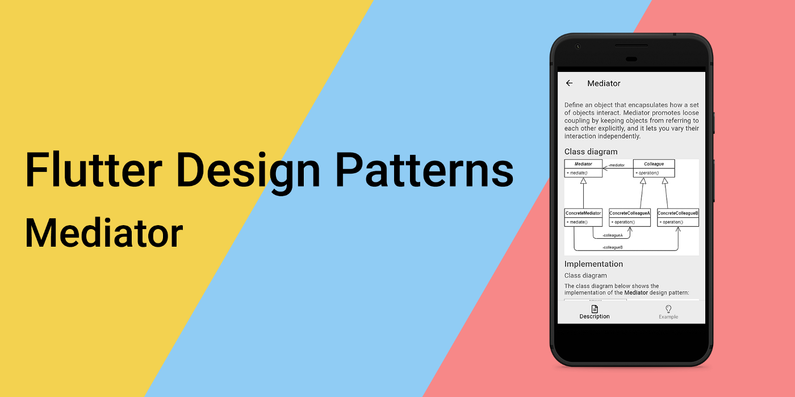
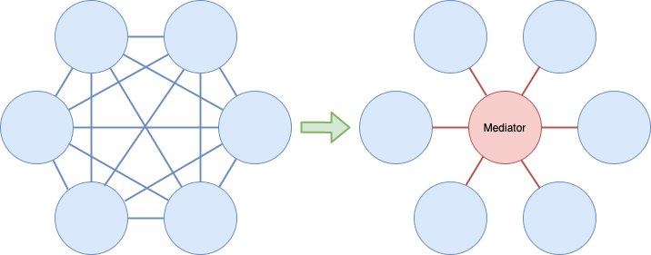
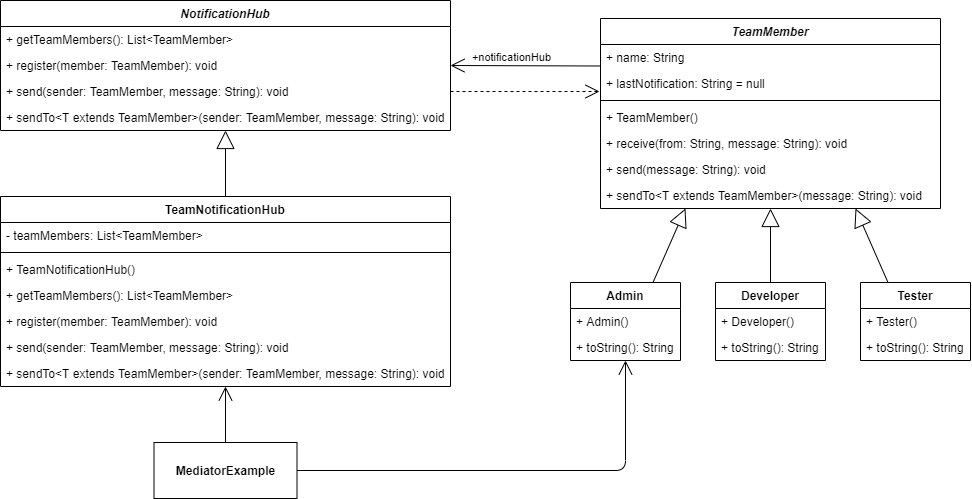
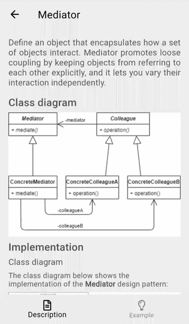
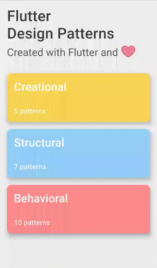

_An overview of the Mediator design pattern and its implementation in Dart and Flutter_



Previously in the series, I analysed a behavioural design pattern that separates algorithms from the objects they operate on - [Visitor](../2020-11-12-flutter-design-patterns-21-visitor/index.md). This time I would like to represent one another behavioural design pattern that lets you reduce dependencies between a set of interacting objects by decoupling the interaction logic from the objects and moving it to a dedicated controller - it is the Mediator.

<!--truncate-->

:::tip
To see all the design patterns in action, check the [Flutter Design Patterns application](https://flutterdesignpatterns.com/).
:::

## What is the Mediator design pattern?


**Mediator**, also known as **Intermediary** or **Controller**, is a **behavioural** design pattern, which intention in the [GoF book](https://en.wikipedia.org/wiki/Design_Patterns) is described like this:

> _Define an object that encapsulates how a set of objects interact. Mediator promotes loose coupling by keeping objects from referring to each other explicitly, and it lets you vary their interaction independently._

TL;DR: the main target of the Mediator design pattern is to move from the communicating object dependencies chaos provided on the left to the decoupled one provided on the right:



In the Mediator design pattern context, communicating objects are called **colleagues** while the object that controls and coordinates the interaction is called \*_drums rolls_\* the **mediator**.

The mediator is like a telephone exchange that keeps references to interacting objects and maintains all the required logic to "connect" colleague A with colleague B. As a result, colleague objects have no explicit knowledge of each other, they only refer to their mediator - in the OOP world, we could say that objects are loosely coupled. This allows reusing individual colleague objects independently since they have fewer dependencies on the other objects.

Another upside of the Mediator design pattern is that it simplifies and abstracts the way how objects interact. First of all, the mediator replaces many-to-many (N:M) relationships with one-to-many (1:N) interactions between the mediator and its colleagues. In general, 1:N relationships are just easier to understand and maintain. Besides, the mediator object abstracts the interaction logic - colleagues should be aware only of the communication act but not of any details on how it is implemented. This abstraction enables adding new mediators without changing the actual components. Also, having the whole communication logic in a single place helps a lot when you need to adjust or maintain it.

Let's just jump right in by analysing the Mediator design pattern and its implementation in more detail!

## Analysis

The general structure of the Mediator design pattern looks like this:


- *Mediator* - defines an interface for communicating with components;
- *ConcreteMediator* - encapsulates relations between components by containing references to them;
- *(Optional) Abstract Component or Component Interface* - similar communicating components could implement the same interface or extend the same base class. In this case, _ConcreteMediator_ could store a list of components extending/implementing this class instead of keeping multiple references as separate properties;
- *Concrete component or Colleague* - contains a reference to a mediator. Each colleague communicates with its mediator whenever it would have otherwise communicated with another colleague (component).

### Applicability

The Mediator design pattern should be used when instead of having tightly coupled classes you want to have loose-coupled ones, because:

a) You want to reuse the component elsewhere. When a component is too dependent on other classes, it's hard to reuse it as a stand-alone object.

b) You want to make changes in some of the classes, but they affect other dependencies. By using the Mediator design pattern, the relationship logic between objects is extracted to a separate class, hence the changes could be implemented without directly affecting the rest of the components.

Also, you should consider using the Mediator design pattern when there is a need to add communicating objects at run-time. Since the mediator class takes care of the communication logic and all the dependencies between objects, it's possible to add or remove those dependencies later from the code just like adding a new user to the chat room.

However, by moving all the communication logic to a dedicated class there is a risk to end up having a [God Object](https://en.wikipedia.org/wiki/God_object). To avoid this, make sure that the mediator class is only responsible for the communication part. If you notice any other calculations, data manipulations or extraneous operations (Eminem would be proud of this line, I think) they should be extracted to a dedicated class.

## Implementation


We will use the Mediator design pattern to implement a notification hub for the engineering team.

Let's say that we want a solution to send notifications to other team members. Inside the team, there are 3 main roles: Admin a.k.a. God, Developer and tester (QA engineer). There are times when the admin wants to send notifications to the whole team or members of a specific role. Also, any other team member should be able to send a quick note to the whole team, too.

If you think of this problem, you could quickly notice a many-to-many relationship between team members - every engineer should be aware of the others just to send the notification. For this reason, we will implement a centralised way to send notifications - a notification hub. You could think of it as a chat room - every team member joins the hub and later they use it to send notifications by simply calling a send method. Then, the hub distributes the message to the others - to all of them or by specific role.

By using this solution, team members should not be aware of the others, they are completely decoupled. Also, in the case of a new team member, it is enough to add him/her to the notification hub and you could be sure that all the notifications would be delivered.

Sounds too good to be true? Watch and learn!

### Class diagram

The class diagram below shows the implementation of the Mediator design pattern:



`TeamMember` is a base class that is used as a base class for all the specific team member classes. The class contains `name`, `lastNotification` and `notificationHub` properties, and provides several methods:

- `receive()` - receives the notification from the notification hub;
- `send()` - sends a notification;
- `sendTo<T>()` - sends a notification to specific team members.

`Admin`, `Developer` and `Tester` are concrete team member classes that extend the abstract class `TeamMember` as well as override the default `toString()` method.

`NotificationHub` defines an interface for all the specific notification hubs:

- `getTeamMembers()` - returns a list of team members of the hub;
- `register()` - registers a team member to the hub;
- `send()` - sends a notification to registered team members;
- `sendTo<T>()` - sends a notification to specific registered team members.

`TeamNotificationHub` is a concrete notification hub that extends the abstract class `NotificationHub` and implements its abstract methods. Also, this class contain a list of registered team members - `teamMembers`.

`MediatorExample` initialises and contains a notification hub property to send and receive notifications, and register team members to the hub.

### TeamMember

A base class implementing methods for all the specific team member classes. Method `receive()` sets the `lastNotification` value, `send()` and `sendTo<T>()` methods send notification by using the corresponding `notificationHub` methods.

```dart title="team_member.dart"
base class TeamMember {
  TeamMember({
    required this.name,
  });

  final String name;

  NotificationHub? notificationHub;
  String? lastNotification;

  void receive(String from, String message) {
    lastNotification = '$from: "$message"';
  }

  void send(String message) {
    notificationHub?.send(this, message);
  }

  void sendTo<T extends TeamMember>(String message) {
    notificationHub?.sendTo<T>(this, message);
  }
}
```

### Concrete team member classes

All of the specific team member classes extend the `TeamMember` and override the default `toString()` method.

`Admin` - a team member class representing the admin role.

```dart title="admin.dart"
final class Admin extends TeamMember {
  Admin({
    required super.name,
  });

  @override
  String toString() => '$name (Admin)';
}
```

`Developer` - a team member class representing the developer role.

```dart title="developer.dart"
final class Developer extends TeamMember {
  Developer({
    required super.name,
  });

  @override
  String toString() => '$name (Developer)';
}
```

`Tester` - a team member class representing the tester (QA) role.

```dart title="tester.dart"
final class Tester extends TeamMember {
  Tester({
    required super.name,
  });

  @override
  String toString() => '$name (QA)';
}
```

### NotificationHub

An interface that defines methods to be implemented by specific notification hub classes. Method `getTeamMembers()` returns a list of registered team members to the hub, and `register()` registers a new member to the hub. Method `send()` sends the notification to all the registered team members to the hub (excluding sender) while `sendTo<T>()` sends the notification to team members of a specific type (excluding sender).

```dart title="notification_hub.dart"
abstract interface class NotificationHub {
  List<TeamMember> getTeamMembers();
  void register(TeamMember member);
  void send(TeamMember sender, String message);
  void sendTo<T extends TeamMember>(TeamMember sender, String message);
}
```

### TeamNotificationHub

A specific notification hub implementing `NotificationHub` interface. The class also contains private `teamMembers` property - a list of registered team members to the hub.

```dart title="team_notification_hub.dart"
class TeamNotificationHub implements NotificationHub {
  TeamNotificationHub({
    List<TeamMember>? members,
  }) {
    members?.forEach(register);
  }

  final _teamMembers = <TeamMember>[];

  @override
  List<TeamMember> getTeamMembers() => _teamMembers;

  @override
  void register(TeamMember member) {
    member.notificationHub = this;

    _teamMembers.add(member);
  }

  @override
  void send(TeamMember sender, String message) {
    final filteredMembers = _teamMembers.where((m) => m != sender);

    for (final member in filteredMembers) {
      member.receive(sender.toString(), message);
    }
  }

  @override
  void sendTo<T extends TeamMember>(TeamMember sender, String message) {
    final filteredMembers =
        _teamMembers.where((m) => m != sender).whereType<T>();

    for (final member in filteredMembers) {
      member.receive(sender.toString(), message);
    }
  }
}
```

## Example

First of all, a markdown file is prepared and provided as a pattern's description:



The `MediatorExample` widget initialises the `TeamNotificationHub` and later uses it to send notifications between team members.

```dart title="mediator_example.dart"
class MediatorExample extends StatefulWidget {
  const MediatorExample();

  @override
  _MediatorExampleState createState() => _MediatorExampleState();
}

class _MediatorExampleState extends State<MediatorExample> {
  late final NotificationHub _notificationHub;
  final _admin = Admin(name: 'God');

  @override
  void initState() {
    super.initState();

    final members = [
      _admin,
      Developer(name: 'Sea Sharp'),
      Developer(name: 'Jan Assembler'),
      Developer(name: 'Dove Dart'),
      Tester(name: 'Cori Debugger'),
      Tester(name: 'Tania Mocha'),
    ];
    _notificationHub = TeamNotificationHub(members: members);
  }

  void _sendToAll() => setState(() => _admin.send('Hello'));

  void _sendToQa() => setState(() => _admin.sendTo<Tester>('BUG!'));

  void _sendToDevelopers() => setState(
        () => _admin.sendTo<Developer>('Hello, World!'),
      );

  void _addTeamMember() {
    final name = '${faker.person.firstName()} ${faker.person.lastName()}';
    final teamMember = faker.randomGenerator.boolean()
        ? Tester(name: name)
        : Developer(name: name);

    setState(() => _notificationHub.register(teamMember));
  }

  void _sendFromMember(TeamMember member) => setState(
        () => member.send('Hello from ${member.name}'),
      );

  @override
  Widget build(BuildContext context) {
    return ScrollConfiguration(
      behavior: const ScrollBehavior(),
      child: SingleChildScrollView(
        padding: const EdgeInsets.symmetric(
          horizontal: LayoutConstants.paddingL,
        ),
        child: Column(
          crossAxisAlignment: CrossAxisAlignment.stretch,
          children: <Widget>[
            PlatformButton(
              text: "Admin: Send 'Hello' to all",
              materialColor: Colors.black,
              materialTextColor: Colors.white,
              onPressed: _sendToAll,
            ),
            PlatformButton(
              text: "Admin: Send 'BUG!' to QA",
              materialColor: Colors.black,
              materialTextColor: Colors.white,
              onPressed: _sendToQa,
            ),
            PlatformButton(
              text: "Admin: Send 'Hello, World!' to Developers",
              materialColor: Colors.black,
              materialTextColor: Colors.white,
              onPressed: _sendToDevelopers,
            ),
            const Divider(),
            PlatformButton(
              text: "Add team member",
              materialColor: Colors.black,
              materialTextColor: Colors.white,
              onPressed: _addTeamMember,
            ),
            const SizedBox(height: LayoutConstants.spaceL),
            NotificationList(
              members: _notificationHub.getTeamMembers(),
              onTap: _sendFromMember,
            ),
          ],
        ),
      ),
    );
  }
}
```

Specific team members do not contain any reference to the others, they are completely decoupled. For communication, the notification hub is used that handles all the necessary logic to send and receive notifications from the team.



As you can see in the example, you could send notifications from different team members, and add new members later to the hub so they will be notified, too.

All of the code changes for the Mediator design pattern and its example implementation could be found [here](https://github.com/mkobuolys/flutter-design-patterns/pull/28).

:::tip
To see the pattern in action, check the [interactive Mediator example](https://flutterdesignpatterns.com/pattern/mediator).
:::
