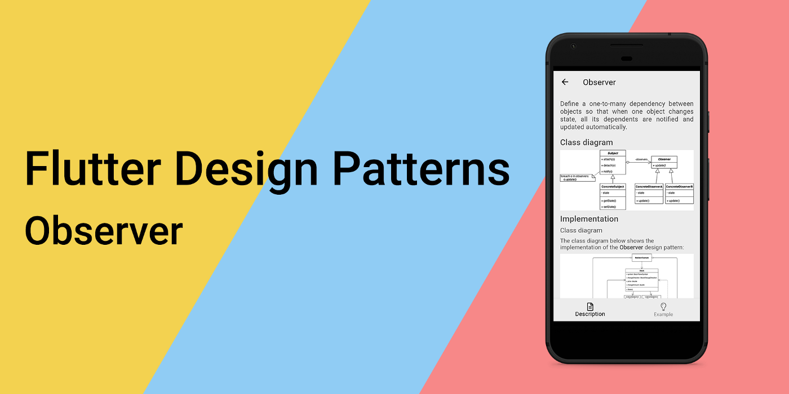
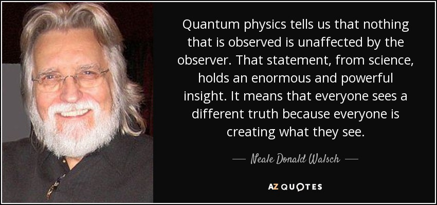
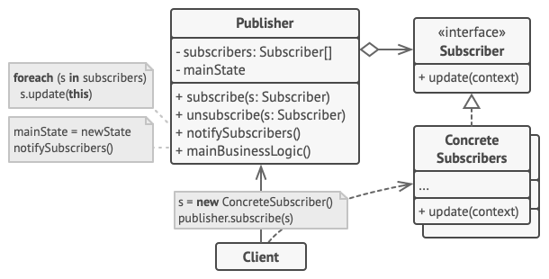
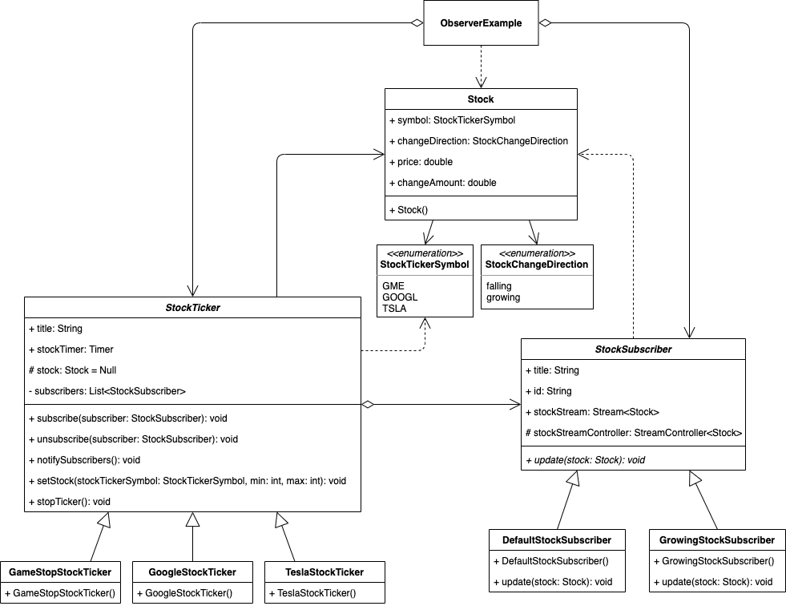
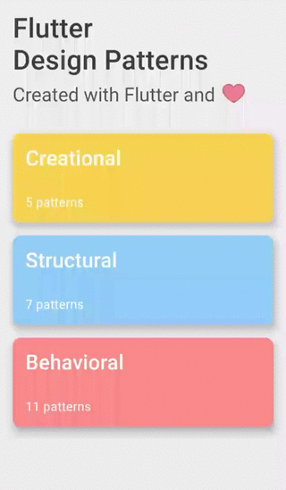

_An overview of the Observer design pattern and its implementation in Dart and Flutter_



In the last [article](../2021-03-17-flutter-design-patterns-22-mediator/index.md), I analysed a behavioural design pattern that reduces dependencies between a set of interacting objects by decoupling the interaction logic from the objects and moving it to a dedicated controller - Mediator. In this article, I would like to analyse and implement another behavioural design pattern that lets you define a publish-subscribe mechanism to notify multiple objects about any events that happen to the object they're subscribed to - it is Observer.

<!--truncate-->

:::tip
To see all the design patterns in action, check the [Flutter Design Patterns application](https://flutterdesignpatterns.com/).
:::

## What is the Observer design pattern?



**Observer**, also known as **Dependents** or **Publish-Subscribe**, belongs to the category of behavioural design patterns. The intention of this design pattern is described in the [GoF book](https://en.wikipedia.org/wiki/Design_Patterns):

> _Define a one-to-many dependency between objects so that when one object changes state, all its dependents are notified and updated automatically._

**Spoiler alert:** if you have ever heard about reactive programming or even used the related frameworks/libraries/tools such as [ReactiveX](https://reactivex.io/), [RxDart](https://pub.dev/packages/rxdart) or just basic streams in Dart, this design pattern won't be a game-changer for you. But it is still worth knowing how reactive programming ideas are implemented in the OOP context from the ground up, though.

The motivation for this design pattern comes from the problem of having a collection of tightly coupled objects in the system where changes for one object should trigger changes in the others (one-to-many relationship). An inflexible way to implement this is to define an object that implements updating the state of other dependent ones. Such an object becomes hard to implement, maintain, test and reuse because of the dependency chaos.

A better way to approach this is to implement a publish-subscribe mechanism that sends the update events to dependent objects so they could implement and maintain the update logic on their own. To achieve this, the Observer design pattern introduces two roles: **Subject** and **Observer**.

The subject is the publisher of notifications which also defines a way for the observers to subscribe/unsubscribe from those notifications. A subject may have any number of dependent observers - the same idea of maintaining a one-to-many relationship just in a more flexible way. When a subject changes state, all registered observers are notified and updated automatically. This way the subject could trigger an update on dependent objects without even knowing who its observers are - this enables loose coupling between subject and observers.

Let's move to the analysis and implementation parts to understand and learn the details about this pattern and how to implement it!

## Analysis

The general structure of the Observer design pattern looks like this:



- *Publisher (Subject)* - provides an interface for attaching and detaching _Subscriber (Observer)_ objects, contains a list of observers;
- *(Optional) Concrete Publishers* - stores state of interest for _Concrete Subscribers_ and sends a notification to its observers when the state changes. This class is optional when only a single type of _Publisher_ is needed. In such case, the state and notification logic is handled by the _Publisher_;
- *Subscriber (Observer)* - declares the notification interface for objects that should be notified of changes in a _Subject_;
- *Concrete Subscribers* - implements the _Subscriber (Observer)_ interface to keep its state consistent with the subject's state;
- *Client* - creates _Subject_ and _Observer_ objects, attaches observers to subject updates.

### Observer vs Mediator

If you have read the previous [article](../2021-03-17-flutter-design-patterns-22-mediator/index.md) in the series or are familiar with the Mediator design pattern you could feel some kind of *déjà vu* - isn't the Observer design pattern the same thing? Let me explain.

The primary goal of the Mediator design pattern is to replace many-to-many relationships between objects with one-to-many relationships by using the dedicated mediator object that handles the communication part. Observer allows establishing a dynamic one-way connection between objects, where some objects act as subordinates of others.

If you have only one mediator that allows subscriptions to its state, this implementation is based on the Observer design pattern but the Mediator design pattern could be also used only as a part of the publish-subscribe communication. Now, if we have multiple publishers and multiple subscribers (which could be publishers as well), there won't be any mediator object only a distributed set of observers.

### Applicability

The Observer design pattern should be used when a change to one object requires changing others, but you don't know how many objects need to be changed and how. The pattern allows subscribing to such object events and changing the dependent object's state accordingly.

Also, this pattern should be used when some objects must observe others, but only for a limited time. The subscription mechanism allows dependent objects to listen to the update events on demand and change this behaviour at run-time.

## Implementation


For the implementation part, we will use the Observer design pattern to implement a stock market prototype.

In the stock market, there are hundreds and thousands of different stocks. Of course, not all of them are relevant to you, so you would like to subscribe and track only the specific ones.

The prototype allows subscribing to 3 different stocks - GameStop (GME), Alphabet Inc. a.k.a. Google (GOOGL) and Tesla Motors (TSLA). Also, there are two different types of subscriptions:

- Default stock subscription - notifies about every subscribed stock change.
- Growing stock subscription - notifies only about the growing stock changes.

Such stocks' trackers could be easily implemented by using the Observer design pattern. Of course, the prototype only supports 3 different stock types, but new stock tickers or even new subscription types could be easily added later on without affecting the existing code. Let's check the class diagram first and then implement the pattern!

### Class diagram

The class diagram below shows the implementation of the Observer design pattern:



`StockTicker` is a base class that is used by all the specific stock ticker classes. The class contains `title`, `stockTimer` and `stock` properties, and `subscribers` list, provides several methods:

- `subscribe()` - subscribes to the stock ticker;
- `unsubscribe()` - unsubscribes from the stock ticker;
- `notifySubscribers()` - notifies subscribers about the stock change;
- `setStock()` - sets stock value;
- `stopTicker()` - stops ticker emitting stock events.

`GameStopStockTicker`, `GoogleStockTicker` and `TeslaStockTicker` are concrete stock ticker classes that extend the abstract class `StockTicker`.

The `Stock` class contains `symbol`, `changeDirection`, `price` and `changeAmount` properties to store info about the stock.

`StockTickerSymbol` is an enumerator class defining supported stock ticker symbols - GME, GOOGL and TSLA.

`StockChangeDirection` is an enumerator class defining stock change directions - growing and falling.

`StockSubscriber` is an abstract class that is used as a base class for all the specific stock subscriber classes. The class contains `title`, `id` and `stockStreamController` properties, `stockStream` getter and defines the abstract `update()` method to update subscriber state.

`DefaultStockSubscriber` and `GrowingStockSubscriber` are concrete stock subscriber classes that extend the abstract class `StockSubscriber`.

### StockTicker

An base class implementing methods for all the specific stock ticker classes. Property `title` is used in the UI for stock ticker selection, `stockTimer` periodically emits a new stock value that is stored in the stock property by using the `setStock()` method. The class also stores a list of stock subscribers that can subscribe to the stock ticker and unsubscribe from it by using the `subscribe()` and `unsubscribe()` respectively. Stock ticker subscribers are notified about the value change by calling the `notifySubscribers()` method. The stock timer could be stopped by calling the `stopTicker()` method.

```dart title="stock_ticker.dart"
base class StockTicker {
  late final String title;
  late final Timer stockTimer;

  @protected
  Stock? stock;

  final _subscribers = <StockSubscriber>[];

  void subscribe(StockSubscriber subscriber) => _subscribers.add(subscriber);

  void unsubscribe(StockSubscriber subscriber) =>
      _subscribers.removeWhere((s) => s.id == subscriber.id);

  void notifySubscribers() {
    for (final subscriber in _subscribers) {
      subscriber.update(stock!);
    }
  }

  void setStock(StockTickerSymbol stockTickerSymbol, int min, int max) {
    final lastStock = stock;
    final price = faker.randomGenerator.integer(max, min: min) / 100;
    final changeAmount = lastStock != null ? price - lastStock.price : 0.0;

    stock = Stock(
      changeAmount: changeAmount.abs(),
      changeDirection: changeAmount > 0
          ? StockChangeDirection.growing
          : StockChangeDirection.falling,
      price: price,
      symbol: stockTickerSymbol,
    );
  }

  void stopTicker() => stockTimer.cancel();
}
```

### Concrete stock ticker classes

All of the specific stock ticker classes extend the abstract `StockTicker` class.

`GameStopStockTicker` - a stock ticker of the GameStop stocks that emits a new stock event every 2 seconds.

```dart title="gamestop_stock_ticker.dart"
final class GameStopStockTicker extends StockTicker {
  GameStopStockTicker() {
    title = StockTickerSymbol.GME.name;
    stockTimer = Timer.periodic(
      const Duration(seconds: 2),
      (_) {
        setStock(StockTickerSymbol.GME, 16000, 22000);
        notifySubscribers();
      },
    );
  }
}
```

`GoogleStockTicker` - a stock ticker of the Google stocks that emits a new stock event every 5 seconds.

```dart title="google_stock_ticker.dart"
final class GoogleStockTicker extends StockTicker {
  GoogleStockTicker() {
    title = StockTickerSymbol.GOOGL.name;
    stockTimer = Timer.periodic(
      const Duration(seconds: 5),
      (_) {
        setStock(StockTickerSymbol.GOOGL, 200000, 204000);
        notifySubscribers();
      },
    );
  }
}
```

`TeslaStockTicker` - a stock ticker of the Tesla stocks that emits a new stock event every 3 seconds.

```dart title="tesla_stock_ticker.dart"
final class TeslaStockTicker extends StockTicker {
  TeslaStockTicker() {
    title = StockTickerSymbol.TSLA.name;
    stockTimer = Timer.periodic(
      const Duration(seconds: 3),
      (_) {
        setStock(StockTickerSymbol.TSLA, 60000, 65000);
        notifySubscribers();
      },
    );
  }
}
```

### Stock

A simple class to store information about the stock. The `Stock` class contains data about the stocker ticker symbol, stock change direction, current price and the change amount.

```dart title="stock.dart"
class Stock {
  const Stock({
    required this.symbol,
    required this.changeDirection,
    required this.price,
    required this.changeAmount,
  });

  final StockTickerSymbol symbol;
  final StockChangeDirection changeDirection;
  final double price;
  final double changeAmount;
}
```

### StockTickerSymbol

A special kind of class - *enumeration* - to define supported stock ticker symbols.

```dart title="stock_ticker_symbol.dart"
enum StockTickerSymbol {
  GME,
  GOOGL,
  TSLA,
}
```

### StockChangeDirection

A special kind of class - *enumeration* - to define stock change directions.

```dart title="stock_change_direction.dart"
enum StockChangeDirection {
  falling,
  growing,
}
```

### StockSubscriber

An abstract class containing base properties for all the specific stock ticker classes. Property `title` is used in the UI for stock subscriber selection, `id` uniquely identifies the subscriber. Updated stock values are added to the `stockStreamController` and emitted via the `stockStream`. Abstract method `update()` is defined and must be implemented by all the concrete stock subscriber classes.

```dart title="stock_subscriber.dart"
abstract class StockSubscriber {
  late final String title;

  final id = faker.guid.guid();

  @protected
  final StreamController<Stock> stockStreamController =
      StreamController.broadcast();

  Stream<Stock> get stockStream => stockStreamController.stream;

  void update(Stock stock);
}
```

### Concrete stock subscriber classes

`DefaultStockSubscriber` - a default stock subscriber that emits every stock change on update.

```dart title="default_stock_subscriber.dart"
class DefaultStockSubscriber extends StockSubscriber {
  DefaultStockSubscriber() {
    title = 'All stocks';
  }

  @override
  void update(Stock stock) {
    stockStreamController.add(stock);
  }
}
```

`GrowingStockSubscriber` - a growing stock subscriber that emits only growing stock changes on update.

```dart title="growing_stock_subscriber.dart"
class GrowingStockSubscriber extends StockSubscriber {
  GrowingStockSubscriber() {
    title = 'Growing stocks';
  }

  @override
  void update(Stock stock) {
    if (stock.changeDirection == StockChangeDirection.growing) {
      stockStreamController.add(stock);
    }
  }
}
```

## Example

First of all, a markdown file is prepared and provided as a pattern's description:


`ObserverExample` contains a list of `StockSubscriber` as well as a list of `StockTickerModel` objects (specific `StockTicker` class with a flag of whether the user is subscribed to the stock ticker or not).

```dart title="observer_example.dart"
class ObserverExample extends StatefulWidget {
  const ObserverExample();

  @override
  _ObserverExampleState createState() => _ObserverExampleState();
}

class _ObserverExampleState extends State<ObserverExample> {
  final _stockSubscriberList = <StockSubscriber>[
    DefaultStockSubscriber(),
    GrowingStockSubscriber(),
  ];
  final _stockTickers = <StockTickerModel>[
    StockTickerModel(stockTicker: GameStopStockTicker()),
    StockTickerModel(stockTicker: GoogleStockTicker()),
    StockTickerModel(stockTicker: TeslaStockTicker()),
  ];
  final _stockEntries = <Stock>[];

  StreamSubscription<Stock>? _stockStreamSubscription;
  StockSubscriber _subscriber = DefaultStockSubscriber();
  var _selectedSubscriberIndex = 0;

  @override
  void initState() {
    super.initState();

    _stockStreamSubscription = _subscriber.stockStream.listen(_onStockChange);
  }

  @override
  void dispose() {
    for (final ticker in _stockTickers) {
      ticker.stockTicker.stopTicker();
    }

    _stockStreamSubscription?.cancel();

    super.dispose();
  }

  void _onStockChange(Stock stock) => setState(() => _stockEntries.add(stock));

  void _setSelectedSubscriberIndex(int? index) {
    for (final ticker in _stockTickers) {
      if (ticker.subscribed) {
        ticker.toggleSubscribed();
        ticker.stockTicker.unsubscribe(_subscriber);
      }
    }

    _stockStreamSubscription?.cancel();

    setState(() {
      _stockEntries.clear();
      _selectedSubscriberIndex = index!;
      _subscriber = _stockSubscriberList[_selectedSubscriberIndex];
      _stockStreamSubscription = _subscriber.stockStream.listen(_onStockChange);
    });
  }

  void _toggleStockTickerSelection(int index) {
    final stockTickerModel = _stockTickers[index];
    final stockTicker = stockTickerModel.stockTicker;

    if (stockTickerModel.subscribed) {
      stockTicker.unsubscribe(_subscriber);
    } else {
      stockTicker.subscribe(_subscriber);
    }

    setState(() => stockTickerModel.toggleSubscribed());
  }

  @override
  Widget build(BuildContext context) {
    return ScrollConfiguration(
      behavior: const ScrollBehavior(),
      child: SingleChildScrollView(
        padding: const EdgeInsets.symmetric(
          horizontal: LayoutConstants.paddingL,
        ),
        child: Column(
          children: <Widget>[
            StockSubscriberSelection(
              stockSubscriberList: _stockSubscriberList,
              selectedIndex: _selectedSubscriberIndex,
              onChanged: _setSelectedSubscriberIndex,
            ),
            StockTickerSelection(
              stockTickers: _stockTickers,
              onChanged: _toggleStockTickerSelection,
            ),
            Column(
              children: [
                for (final stock in _stockEntries.reversed)
                  StockRow(stock: stock)
              ],
            )
          ],
        ),
      ),
    );
  }
}
```

A specific subscriber class could be easily changed by using the `StockSubscriberSelection` widget. Also, `StockTickerSelection` allows easily subscribing/unsubscribing from the specific stock ticker at run-time.



As you can see in the example, the subscription type could be easily changed at run-time, you could start and stop tracking the specific stocks at any point as well.

All of the code changes for the Observer design pattern and its example implementation could be found [here](https://github.com/mkobuolys/flutter-design-patterns/pull/29).

:::tip
To see the pattern in action, check the [interactive Observer example](https://flutterdesignpatterns.com/pattern/observer).
:::
