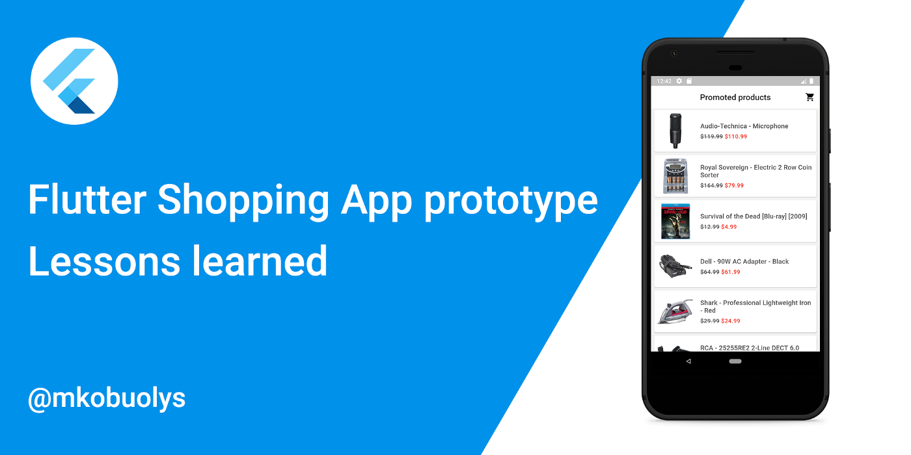
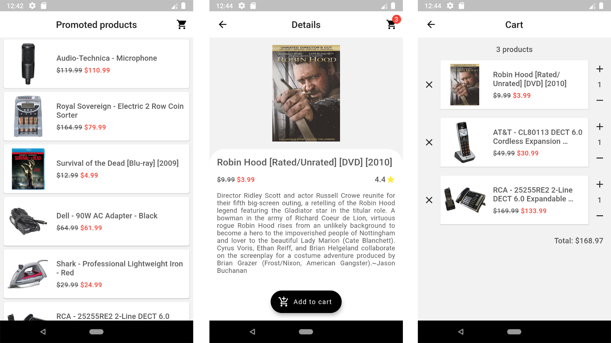
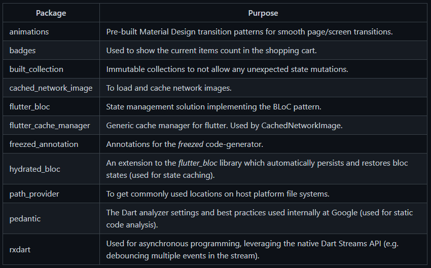
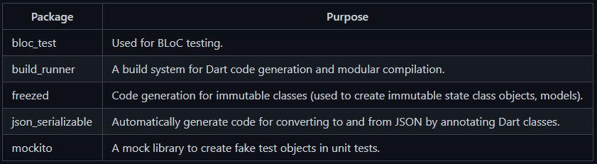
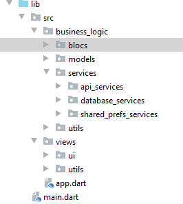
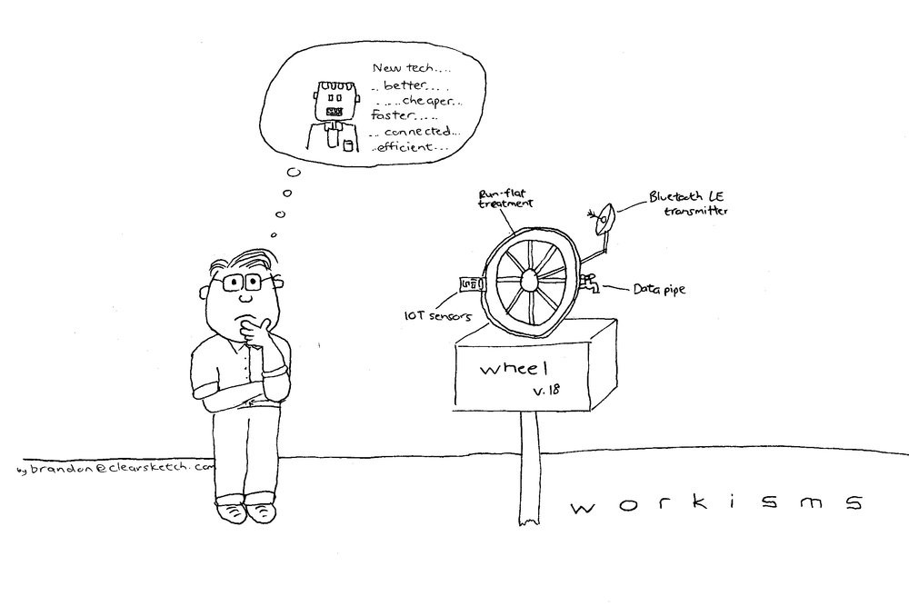
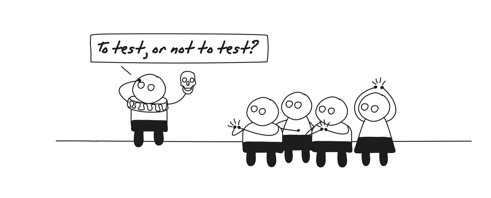

_Some insights on how to implement a production-quality app using Dart + Flutter_



Recently, I received a task to build a shopping app prototype using Dart + Flutter. The main requirements were to use the real-world e-commerce API of free choice, implement lazy products' loading and caching, and build products and their details page. All the other implementation details were left up to me, hence I had to decide on the app architecture, state management solution, third-party packages, etc. So in this article, I will reflect on my choices, challenges and other details while implementing a production-quality prototype.

<!--truncate-->

## Overview



Flutter Shopping App prototype is a simple open-source application implementing the following features:

- State management using BLoC;
- Immutable state, models;
- Lazy loading implemented as an infinite list;
- Loaded products' caching;
- Material Design UI (not great, not terrible);
- Clean code structure: code is separated into modules by feature, commonly used components, utils, and constants are extracted;
- Using a real-world Best Buy API client, which is implemented as a separate Dart package;
- Unit/widget tests covering pretty much the whole code.

The application is implemented using the following dependencies:



Also, the following DEV dependencies are used for faster development and testing purposes:



As already mentioned, the code is open-source and could be found [here](https://github.com/mkobuolys/shopping-app-prototype).

## App architecture


One of the first things to decide on any new project is the architecture of the application. In the beginning, it could be hard to decide on the perfect solution, but here are some tips:

- **Consider the structurization of your app as an iterative task**. If you made some decision at the beginning of a project, you could always adapt it later. Specifically, some developers (including me, but I am working on it) try to plan every single possibility, which may or may not occur in the future. Hence, when something unexpected happens, e.g., you need to rework your code because a component must be reused elsewhere, it causes a lot of stress - it is not going according to the plan, right? Well, it's not a big deal - start small and grow your application's architecture together with the project and its changing requirements.
- **In Flutter, the architecture of your app strongly depends on the state management solution you will use**. For instance, if you choose BLoC, you know that your business logic will be separated from the UI and extracted to the BLoC classes, you will also need to create the related event and state classes, etc. Then, if you choose something like a change notifier/provider, it makes sense to structure your app similarly as in [MVVM](https://en.wikipedia.org/wiki/Model%E2%80%93view%E2%80%93viewmodel). Therefore, structure your app having a specific state management solution in mind, it would eventually save you some time in the future.
- **Consistency is the key**. If you or/and your team decides on the specific app architecture, please, stick to it. Consistent code and file structure help to find a specific component, widget or any other file in the project faster which results in easier maintenance. I would also recommend defining a decent set of static analysis rules in your project by adding the `analysis_options.yaml` file. If you are not sure of which rules should be included, you can use the `pedantic` package to enable the list of linter rules that Google uses in its own Dart code. More info about the static analysis options could be found [here](https://dart.dev/guides/language/analysis-options).

### File structure

As far as I know, there are no official guidelines on how to structure the project files for your application. Usually, Flutter developers choose the layered architecture, hence they structure their project files like this:



This kind of file structure works completely fine in small to medium size projects, but I also see some disadvantages there:

- **Features become hard to decouple**. For instance, you are implementing authentication for your app. By having this file structure, the UI logic goes to the view (presentation) layer, business logic goes to the corresponding data layer and so on. Now, that you are building one another project, you could reuse the same authentication logic, but it is scattered across different layers of the app. Hence, it requires a lot of effort to extract all the authentication-related logic to a separate package and reuse it later.
- **Layers could become overwhelming**. Since you put all the UI logic in one layer and all the business logic in another one, the number of files in a single layer starts to grow very fast while implementing one feature after another. Later, for instance, you could end up having a dozen different services in the same `services` folder which makes it difficult to find the specific file, and maintain a clear structure.

For the Shopping App prototype, I decided to split my codebase into modules:

```
├───android
├───assets
│   └───fonts
├───ios
├───lib
│   ├───config
│   ├───constants
│   ├───modules
│   │   ├───cart
│   │   │   ├───bloc
│   │   │   ├───models
│   │   │   ├───pages
│   │   │   └───widgets
│   │   ├───products
│   │   │   ├───bloc
│   │   │   ├───models
│   │   │   ├───pages
│   │   │   ├───repositories
│   │   │   └───widgets
│   │   └───product_details
│   │       ├───pages
│   │       └───widgets
│   ├───utils
│   └───widgets
├───packages
│   └───best_buy_api
└───test
    ├───config
    ├───helpers
    ├───modules
    │   ├───cart
    │   │   └───widgets
    │   ├───products
    │   │   └───widgets
    │   └───product_details
    │       └───widgets
    └───widgets
```

Let's start from the "independent" directories:

- `assets` contain all the assets used in the application like images and fonts;
- `lib/config` stores general configuration files like theme data, routes, and environment configuration;
- `lib/constants` contain all the general-purpose constants, e.g. colours, common layout spacing values, texts, paths to files, etc.;
- `lib/utils` are used for common helpers used across the app, for instance, helper functions, and extension methods;
- `lib/widgets` contain Flutter widgets used in more than one module (common Widgets).

If we look at the `lib/modules`, we could see that the code is split based on the app features, like products, product details and cart. Each module shares the following structure:

- `bloc` - if the module requires state management, we store all the bloc-related files (BLoC class itself, events and states) there;
- `models` - contains all the model classes, and entities representing the business-related data, like _product_, _cart_, _cart item_, etc.;
- `pages` - stores Flutter Widgets which represent the actual pages that have a specific route to them;
- `repositories` - in simple words, if the module needs to load some kind of data from the database, third-party API, internal storage or any other data source, we store those classes here. Also, this directory could be named as, or you could even have both, `repositories` and `services`, directories if you see a need for that. Repositories should provide high-level endpoints/functions to retrieve the data without exposing the implementation details on how this data was retrieved and/or formatted. This way, you just simply use these functions in your BLoC classes to get the data you need. This is called a **Repository Pattern**, you should definitely learn more about it;
- `widgets` - all the UI components, which belong to this module, should be stored here.

:::note
I do not state that the layered architecture is terrible and you should go with the modular one. For this project, the modular file structure worked pretty well, so I've just decided to use it.
:::

The last thing worth mentioning here is the `packages` directory. One of the requirements for the prototype was to use a real-world API. If you think about it, the client code which communicates with the API does not belong to the application code itself. Also, there could be cases when you have to move from one API to another, but the application code should remain the same. Hence, I moved the client code to a separate package `best_buy_api` that is used in the app by adding it as a dependency in the `pubspec.yaml` file. If needed (e.g. a different team would work on the API client than the one building the app itself), the package could be moved to another GitHub repository or even published on [pub.dev](https://pub.dev/).

## State management


If you are an active member of the Flutter community, you must have already seen some similar questions as "which state management solution is the best?" or "which library should I use for the state management?". I do not want to expand here since there are lots and lots of articles, videos, and courses on this topic, but **when it comes to state management, you must choose the most appropriate solution for your project and the one which you feel the most comfortable with.** Eventually, the final result will be the same, only the implementation details would differ.

For the prototype, I chose [BLoC](https://bloclibrary.dev/) as my main state management solution for several reasons:

- **Separation of concerns.** I have already mentioned this while overviewing the app architecture, but one great thing about BLoC is that business logic is completely separated from the UI. Inside business logic components you do all the dirty work: retrieve and format data, handle exceptions, and map results to the corresponding state. UI is only aware of the state the BLoC exposes and reacts to it accordingly - again, business logic and UI logic become independent.
- **Caching.** By using the `flutter_bloc` library, it is very easy to extend it with the logic from the `hydrated_bloc` - this package automatically persists and restores BLoC and cubit states. As a result, the application's state is stored locally and could be restored e.g. after the application is turned off and turned on again or the internet connection is lost.
- **Testability.** In the BLoC packages ecosystem, there is another one called `bloc_test`. This package makes testing BLoCs and cubits easy - you just simply choose the BLoC to test, if needed, seed it with the required data, trigger some events and verify the transitions between states or just the final state. This way, BLoC classes could be tested independently, and you could verify their behaviour even before building any UI components.

## Reinventing the wheel



Let's talk about third-party dependencies. If you need anything specific, just search for it on [pub.dev](https://pub.dev/) - a lot of things are already implemented there for you. There are times when a developer worships the idea of programmer's pride and wants to implement everything from the ground up. If you strongly believe that your solution would be more performant than the existing one or even a game-changer - do it, but at first, please, consider whether its benefits would outweigh the development and testing time spent on the custom solution.

### Code generation

Another thing to consider is code generation. In Flutter, if you want to compare one class object to another not by their reference, but by their internal values, you have to override the equality operator (==). Also, another common use case is when you want to serialize and deserialize the data from/to JSON, e.g. while making HTTP requests and later mapping the response to your custom models. If you have a lot of such classes, there is A LOT of boilerplate code you need to write. Thus, using code generators like [json_serializable](https://pub.dev/packages/json_serializable) or [freezed](https://pub.dev/packages/freezed) is a way to go in this case. By using them, you will write less boilerplate code as well as avoid some frustrating bugs which could be overlooked by writing the same code over and over again or copy-pasting it from another class - it happens once in a while, doesn't it?

## Test, test and then test once more



Every developer knows that tests are as important as the actual code, but we still tend to push this work from us as far away as possible. When I need some motivation to add them, I think of 3 reasons:

1. **Documentation.** In my opinion, tests are an underrated documentation tool. Tests usually cover the default business logic flows, edge cases or some basic app usage scenarios. Whether you are a new team member or the one who got back to the code after some time and don't remember what's all of this code about - just look at the tests.
2. **Code quality.** One of the easiest ways to identify architectural code flaws is to cover them with tests. If you could not manage to mock a specific dependency or you could not reach a specific part of the code, usually the problem is not that you are bad at writing tests, but the code itself is poorly written.
3. **Time.** This one is pretty straightforward - if you cover your code with tests, you save your time. That could sound like a paradox, but it's actually true. There is nothing worse than adding a new feature to the app and later finding out that the old features are not working properly. You could avoid that by writing some tests, so why not just simply do that?

### I will do it later…

Better late than never, right? If you do not follow the idea of [TDD](https://en.wikipedia.org/wiki/Test-driven_development), there is nothing wrong to add tests after implementing the code, but it should be done iteratively, e.g. after implementing a single screen or feature.

I like the idea of a mixed approach. When implementing BLoCs for the prototype, I started adding tests BEFORE the actual map-event-to-state logic. The reason is simple - I knew which output is expected on the corresponding input, so I wrote all the possible input/output test cases first. Of course, all the tests were failing, but after implementing the actual BLoC logic, all of them turned green and I was sure that the final result is just what I expected in the beginning. For widget tests, I implemented the UI first and only then added tests. The reason is simple - it is just easier this way. To me, widget tests ensure that I won't break the UI in the future while adding new features, so I prefer covering only the "final" UI code with tests.

### Target - 100% code coverage

In the beginning, it could sound like a utopia, but it is very achievable. Flutter offers a lot of [tools](https://docs.flutter.dev/testing) to write unit, widget and integration tests. While building the prototype, I haven't used anything to measure the actual code coverage with tests (e.g. the [test_coverage](https://pub.dev/packages/test_coverage) package should do the trick), but it's a good practice to set the specific code coverage goal, measure and never go below it. As always, start low (like 60–70%, which isn't that low, if you think about it) and after getting comfortable with writing tests in Flutter, you will notice that more and more code is covered in tests and it becomes easier to do that. Then, raise the bar and thrive for that 100%.

## Summary

These were the main insights and ideas behind this (not so) simple Flutter Shopping App prototype. Now, I would recommend diving deeper into the code, seeing how different patterns were applied, how the state management is implemented, what classes were generated and so on. If you have any questions - do not hesitate to ask me directly, I am more than happy to answer them.
