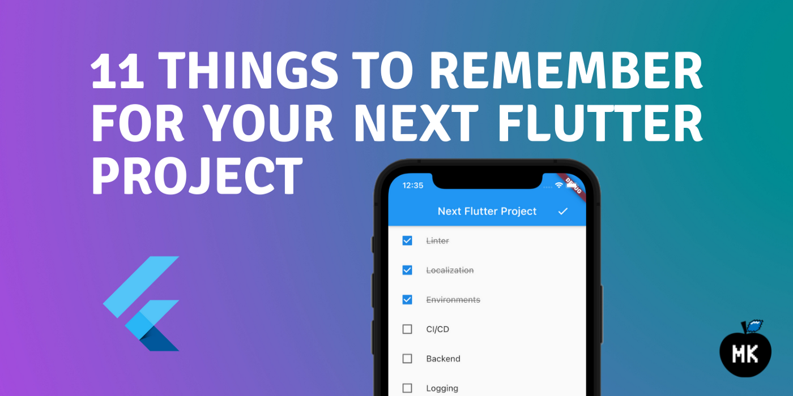
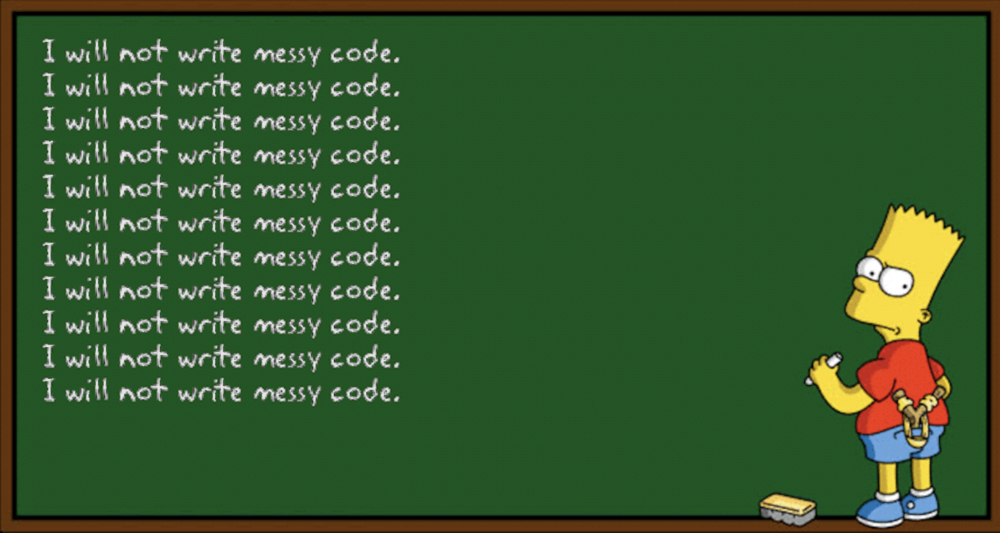
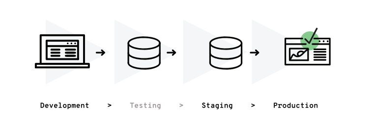
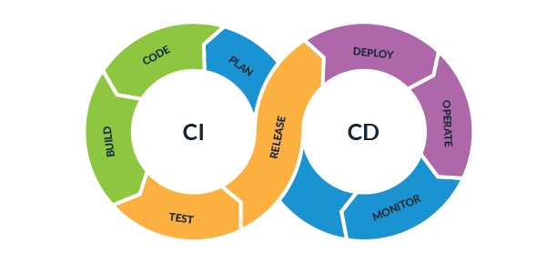
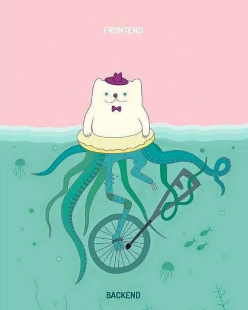
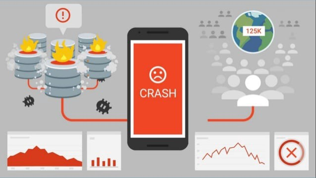
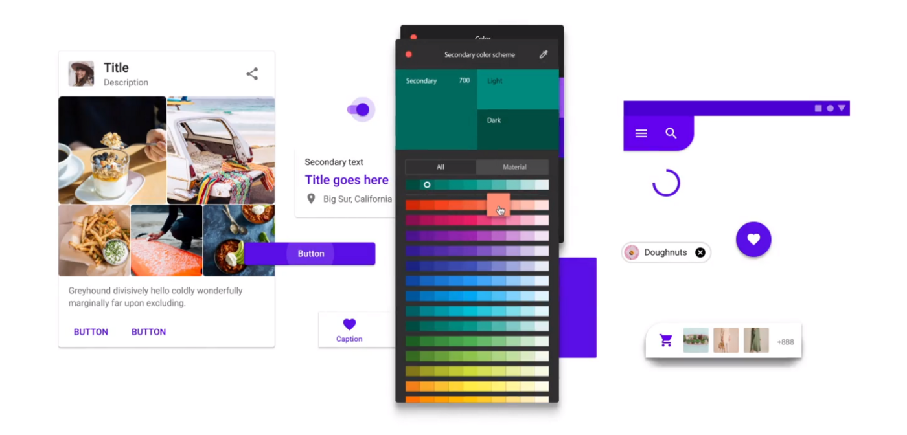
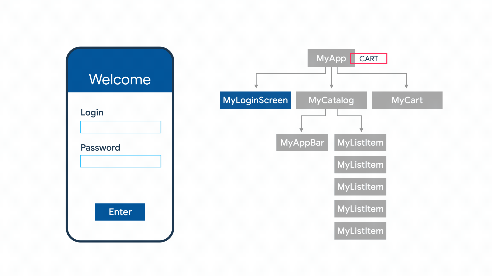
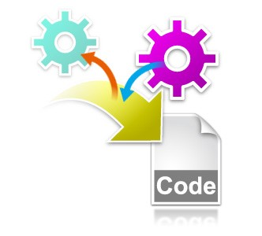
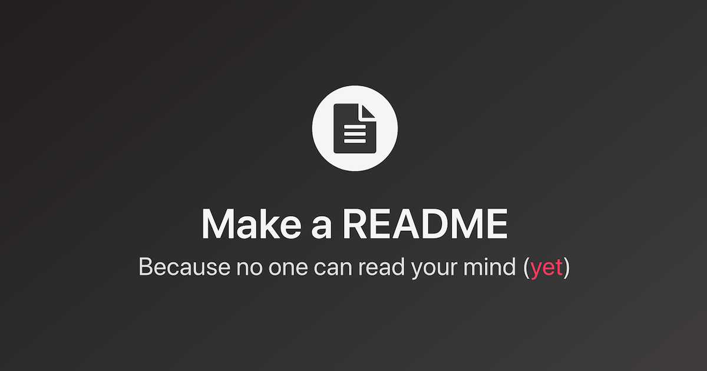

_An extensive checklist to kick-off a new Flutter project_

Creating a new Flutter project is a blessing — fresh codebase, no legacy code (yet), null-safety, most recent versions of your favourite packages and so forth. But at the same time, you should make critical decisions at the beginning of the project that would lay the foundation for the future, such as tooling, packages, file structure, state management solution, testing plan. Otherwise, the project would eventually turn into just another bowl of spaghetti and meatballs. To avoid this, I have prepared a list of, in my opinion, the most important elements of the project that should be decided early on.

<!--truncate-->

## 1. Static code analysis

**Linter** is a **static analysis** tool that identifies and flags programming errors, warnings, style flaws in your code for you to fix them. In Flutter context, that’s one of the easiest things to implement and one of the most helpful ones to keep your code clean.

There are [tons of different rules](https://dart-lang.github.io/linter/lints/index.html) you can set for your code to follow, but I would recommend using one of the pre-defined sets that already follows the best practices based on the [Dart Style Guide](https://dart.dev/guides/language/effective-dart/style):

- [lint](https://pub.dev/packages/lint);
- [flutter_lints](https://pub.dev/packages/flutter_lints);
- [very_good_analysis](https://pub.dev/packages/very_good_analysis).

Whichever package you choose, you can always add or remove any specific static analysis rule in the _analysis_options.yaml_ file.

## 2. Localization (l10n)

:::tip Did you know?

_Localization_ is sometimes written in English as _l10n_, where 10 is the number of letters in the English word between _L_ and _N_. The same rule could also be applied for _internationalization_ (_i18n_) and _accessibility_ (_a11y_).

:::

What is **localization**?

> _Localization is the adaptation of a product or service to meet the needs of a particular language, culture or desired population’s “look-and-feel.” — [TechTarget](https://searchcio.techtarget.com/definition/localization)_

It is essential to build an application that feels natural to the users, e.g. using the right translations, date and currency formats, text direction. For that, localization is a fundamental tool to use. Even though you are building a single region/language application, I would still recommend you implementing localization early on, thus separating your texts from UI code. Consequently, they could be reused as well as adjusted later on without affecting the code.

[Flutter documentation](https://flutter.dev/docs/development/accessibility-and-localization/internationalization) exquisitely explains the process of internationalizing your application. If the default way seems too complex and/or you need some useful extensions and helper methods, there are popular third-party packages, such as [easy_localization](https://pub.dev/packages/easy_localization), that could help you with the localization process.

## 3. Environments

I bet you have already heard at least one case from your environment (no pun intended) when someone corrupted data or deleted the whole users' table in production. Trust me — this is no fun. Hence, it’s a good practice to create different environments for your project:

- **Development** (local) environment — used for you to go bananas: do experiments in the code, change data directly in the database, take shortcuts and hardcode the authentication token or provide mocked data. Have fun and deliver those features!
- An intermediate environment (**testing** or **staging**) — helps you to validate the changes in the code, test features with the “real” data (usually, a snapshot of production data is used in such environments) and verify the application before releasing it to production. If you have QA engineers in your team, this is the place for them to shine.
- **Production** environment — the one that is used by real users, where data corruption is not acceptable (always do backups, please).

Having such environments helps you safely experiment and verify features before those changes get in the hands of the users.

### Flavours

Now, another part — **flavours**. No no, we are not talking about something sweet, salty or sour — that’s just once another term used in programming to describe **different build variants** for your application. E.g. you want to make the icon and title, API endpoint or any other configuration be different for each specific environment. For that, you define a different “flavour” that is used when the application is being built for a specific environment. Here are some resources on how to [create flavours for Flutter](https://flutter.dev/docs/deployment/flavors).

## 4. Continuous Integration and Continuous Delivery (CI/CD)

After introducing different environments, a natural next step is to automate the process of building, testing and releasing your application. **CI/CD** is quite a complex topic on its own and I am not an expert in this field by any means, hence I would recommend searching for some other resources on how to automate different stages of application development.

However, there are a lot of [NoOps](https://www.cio.com/article/3407714/what-is-noops-the-quest-for-fully-automated-it-operations.html) solutions that are compatible with Flutter so you could automate your development process with ease:

- [Appcircle](https://appcircle.io/);
- [Codemagic](https://codemagic.io/);
- [Bitrise](https://www.bitrise.io/);
- [VS App Center](https://appcenter.ms/) (does not have Flutter integration, yet, but there are some resources that could help you set everything up).

Any of those solutions would do the trick — simply, select the one that fits your needs and budget.

## 5. Backend code

Do you already have your backend implemented in any exotic or maybe not so fancy programming language? Great, you can skip this step but I would still recommend checking some cloud solutions for future reference.

In the simplified version, there are two options for the backend part of your application:

1. Implementing a custom backend solution using any programming language and framework you like, but later taking care of all the [DevOps](https://en.wikipedia.org/wiki/DevOps) stuff to make your code and data accessible from the application.
2. Using any cloud solution to speed up the development process and leaving most of the DevOps work for the cloud provider.

In case the second option seems appealing to you, there are some great cloud platforms to choose from supporting Flutter:

- [Google Firebase](https://firebase.google.com/);
- [AWS Amplify](https://aws.amazon.com/amplify/);
- [Supabase](https://supabase.io/);

Cloud platforms provide authentication, database, storage, API options for your application and many other features. Any of these is a great choice when you just need to validate the idea and build the MVP fast without spending a lot of time on the full-blown backend solution.

## 6. Logging, crash data and analytics

**Logging** is underrated — here, I said it! Everything is cool until something goes wrong and you need info about that. There is always a grey area when we discuss what should be logged and what not. But one thing is always clear — you must know when your application crashes and what causes the issue. The more data you collect about the incident, the easier it becomes to find and fix the issue.

Services likes [Sentry](https://sentry.io/), [Firebase Crashlytics](https://firebase.google.com/products/crashlytics), [Datadog](https://www.datadoghq.com/) could help you logging the most important data, crash reports or even set up notifications when your application or related services are down.

Another type of logging is collecting user data for analysis purposes. When you are building a fresh, maybe one-of-a-king product, it is crucial to understand your users’ needs, their behaviour and how they are using the application. For this, various analysis tools could be integrated into your Flutter application, such as [Firebase Analytics](https://firebase.google.com/products/analytics), [App Center Analytics](https://docs.microsoft.com/en-us/appcenter/analytics/) and many more.

## 7. Application branding

One of the main targets of any application or brand is to be recognizable. Using the right colour palette, logo, icons, design elements, content, font, sometimes even layout makes your product stand out from the others. That’s **application branding**, and preparing the fundamental parts at the beginning will save you a lot of time during the whole project.

If you already have your UI prototype or design components ready, now it’s a good time to transfer them to your application and define theming — colours, fonts, shapes, etc. To make it easier, a good guy [Mike Rydstrom](https://twitter.com/RydMike) created an outstanding package for this — [flex_color_scheme](https://pub.dev/packages/flex_color_scheme).

## 8. Project structure and state management

Yes, the controversial one. Just to be clear, there is no such thing as “the best state management solution” or “the best architecture of the application” — if someone says otherwise, remember that they probably pour milk into the bowl before the cereal, too. And that’s the worst part — I cannot teach you the best way. I can only provide several options or share my preferences.

Several **file structure options** for the next Flutter project:

- [Clean Architecture](https://blog.cleancoder.com/uncle-bob/2012/08/13/the-clean-architecture.html) — clear separation of concerns, is there for a long time. Honestly, I am not a fan of this. I feel that there is too much abstraction in this concept that could slow the development process.
- [Layered Architecture](https://www.oreilly.com/library/view/software-architecture-patterns/9781491971437/ch01.html) — relies on the idea of splitting data, business and presentation logic into separate layers. Such file structure works fine for small-to-medium projects, but I feel that these layers become more and more overwhelming when the project grows.
- **Modular Architecture** (I have described this concept [here](https://mkobuolys.medium.com/flutter-shopping-app-prototype-lessons-learned-16d6646bbed7)) — splitting the code into modules per feature where different modules interact. This one is my favourite — it works smoothly with BLoC state management solution (TEAM BLOC, YEAH!), scales well for big projects. However, it brings some challenges, like where to put common logic, how different modules should communicate and so on.

About the **state management** in Flutter — I think we are at the point where we could dedicate the whole conference to this topic and yet have no final answer afterwards. Just to add my two cents, choose the one that you feel the most comfortable with. You could find a comprehensive list of options [here](https://flutter.dev/docs/development/data-and-backend/state-mgmt/options).

## 9. Code generation

If you want to cut some corners and save some development time, you could use **code generation** in your project. [Code less, deliver more](https://youtu.be/GGwTfsPDiO0?t=514)!

There is a range of different tools to use, whether working with localizations, assets, parsing JSON, generating model classes, implementing service locator, routing, or working with immutable states. The only thing to do is to investigate the available tools and packages and choose the best ones to cover your project needs.

For a quick Flutter project kick-off, I would recommend checking out the [Very Good CLI](https://github.com/VeryGoodOpenSource/very_good_cli). It would save you several hours of configuration (unfortunately, I have learned it the hard way).

:::tip

Check [my talk](https://youtu.be/gHnzc6uWYVk) about code generation — it could be a starting point for your Flutter code generation journey!

:::

## 10. Testing strategy

Is it good or bad to cover 100% of your code with tests? Sure, it’s awesome, but at what cost? Thinking this way, you could fall into the doomed pit where you spend more time writing tests than developing features. To avoid this, you need a testing strategy.

Don’t get me wrong — covering your code with tests is a great thing and the more dark places of your code are covered, the safer you could feel when implementing new features. Just, in my opinion, you should find the balance where tests still bring you more value comparing to the time spent on writing them. For instance, this is my testing strategy:

- Business logic (services, repositories, BLoCs) should be covered 85-100% in **unit/integration tests** — this is the most important part of any application, so I see a lot of value in tests there;
- **Widget tests** should cover all the reusable UI components. When individual components are tested properly, you could start testing individual screens but in less detail.
- **End-to-end tests**, covering the main application flows and interactions with the UI. No deep-level magic — just going through some crucial workflows. The more screens they include, the better.
- When the whole UI is ready and implemented — **golden tests** to ensure that UI is not affected by changes later on.

Honestly, I am still searching for that golden mean in testing, but you get better at it project after project, trust me.

## 11. README file

You heard me right — documentation. **README file** is the most important document of the project, especially when working in a team.

Have you just introduced a new solution that requires code generation? Have you just added a new helpful bash script to automate the process? Have you implemented a global logger that MUST be used everywhere in the project? We cannot read your mind — mention that in the README file!

There is no such thing as too much documentation (at least I haven’t been in such a situation) only the lack of information about the project and code. All the commands to generate, test and run the code, various file structure decisions, diagrams, external tools and services, information about different environments (WITHOUT SECRET KEYS) should be put here and kept in a single place. This is boring work but a very rewarding one!

## Summary

That’s it! Let me know what’s your checklist while building a new Flutter application!
