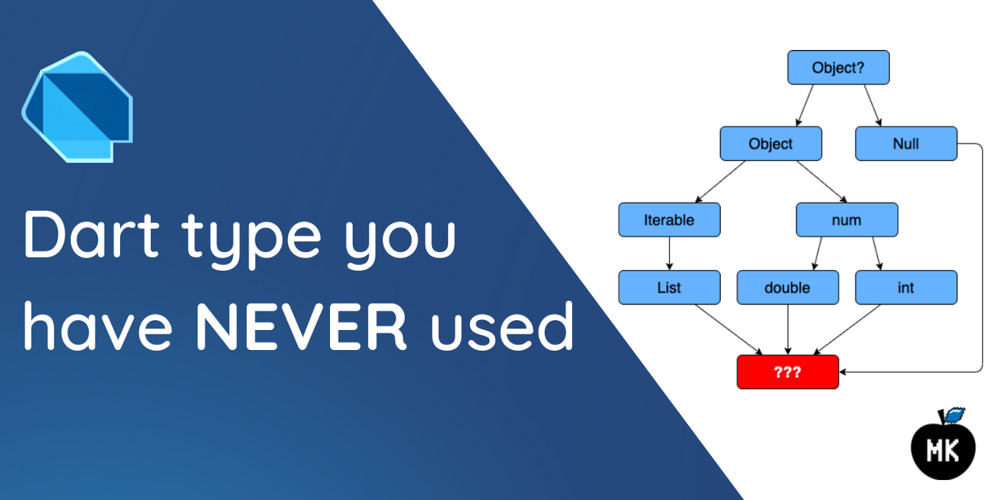
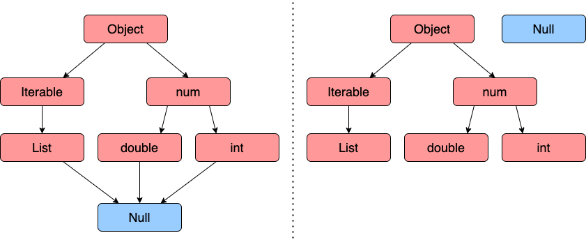
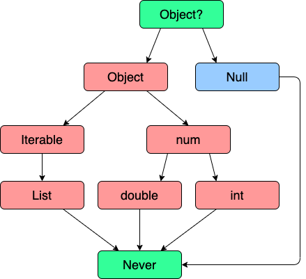

_Dart type system goes: never say never…_



First of all, the title of this article could seem like just another clickbait but let me explain. Sure, there is a chance that you have used this type, but for the sake of a pun (and I REALLY enjoy them), I had to do it - oh well, here we are now. The thing is, the type I am going to talk about in this article is actually called **Never**.

<!--truncate-->

:::note

All the information provided in this article is based on the [official Dart language documentation](https://dart.dev/null-safety/understanding-null-safety).

:::

## Dart type system before and after null safety



To understand the concept of the type _Never_, first, we must understand the difference between the Dart type system before and after null safety. That was never an easy task for me, but let’s try.

Before sound null-safety in Dart, _Null_ was a subtype of all types (look at the graph on the left in the picture above). After introducing null-safety, the _Null_ type is no longer a subtype of all types (the right graph in the same picture above), all types became non-nullable by default — and you could hear this everywhere when talking about sound null-safety of Dart.

However, by looking at this new Dart types’ structure, we cannot easily identify what’s the top-most and bottom-most type. Well, for the top-most type it is quite clear: we do not have a dedicated named type, but we can define it as a nullable _Object_ (_Object?_) — a combination of _Object_ and _Null_ types. When you think about it, every nullable type is just a combination of any non-nullable type and _Null_. For instance, `double + Null = double?`, `String + Null = String?` and so on.

Ok, but how about the bottom-most type? For this, the Dart team went _brrrr_ and just simply introduced a new named type called _Never_.



This new bottom type has no values. However, you can use it as a type annotation. How, why? Let’s check it out👇🏻

## When should I use _Never_ in my code?

I do adore how this type is described in the documentation:

> _On the rare occasion that you need a bottom type, use Never instead of Null. If you don’t know if you need a bottom type, you probably don’t._

Ok, but there are cases when the type _Never_ could be used in the code. Whether that’s useful or not, I will leave it for you to decide.

When the return type of an expression is _Never_, what does it mean? Well, you could say that it should return something of type _Never_, but it indicates that the expression can never successfully finish evaluating. Does it mean that the expression or function would get stuck at that point? No, just “it must throw an exception, abort, or otherwise ensure that the surrounding code expecting the result of the expression never runs.” This idea could be applied when creating helper functions for validation:

```dart
// User data class
class User {
  final String email;
  final String password;

  const User({
    required this.email,
    required this.password,
  });

  @override
  String toString() => 'User {email: $email, password: $password}';
}

// Helper function for required field validation
Never isRequired(String property) {
  throw ArgumentError('$property is required.');
}

void main() {
  String? email;
  String? password;

  // ...
  // Some code to get email and password
  // ...

  if (email == null || email.isEmpty) isRequired('email');
  if (password == null || password.isEmpty) isRequired('password');

  final user = User(email: email, password: password);

  // ...
  // Do something with the user data
  // ...
}
```

This example compiles without any error!

Notice that `email` and `password` are required properties when creating the `User` object and there is no _return_ or _throw_ keywords in the validation code. The control flow analysis knows that the return type of `isRequired()` helper function is _Never_, hence in case of any _if_ condition being true, the code **must** abort somehow. It allows using `email` and `password` as non-nullable variables later on.

> _In other words, using **Never** in your own APIs lets you extend Dart’s reachability analysis._

In my opinion, there is not much difference between throwing a custom exception and using a helper function of type _Never_. However, if you find such implementation convenient, feel free to use it in your code!
