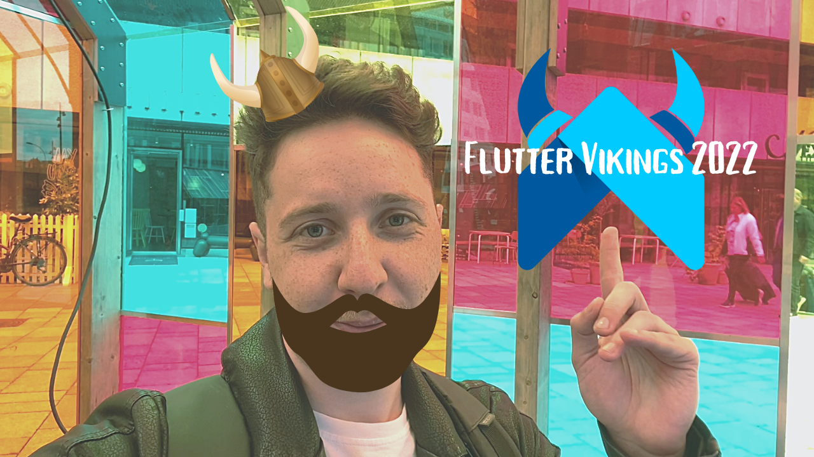

_My video blog from the Flutter Vikings 2022 conference_

<!--truncate-->

[Flutter Vikings](https://fluttervikings.com/) is a community-driven event made up of GDGs and other Nordic user groups focused on Flutter and Dart, as well as the global Flutter Community. With a fantastic lineup of Google Developer Experts and top-notch international speakers the Flutter Vikings conference boasts two of the best Flutter and Dart tracks, offering some of the most informative, technical and actually useful talks.

This year, the conference was hybrid. I was lucky enough to attend it in-person and meet the Flutter community members for the first time in person! Also, I recorded my **_FIRST EVER_** video blog.

Watch it on YouTube: [I was at Flutter Vikings 2022!](https://youtu.be/I0u-zGIXaLo)

Like, share, subscribe 💙
