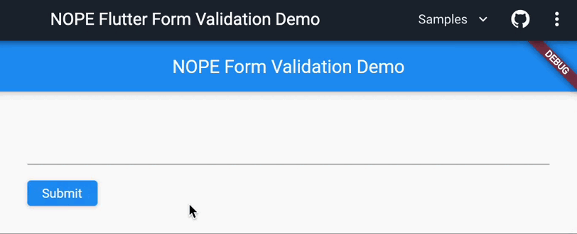

_Creating a fun Flutter form validation animation in 15 minutes or less_



In this short tutorial, we will create a _NOPE_ form validation animation in Flutter. All you need is a basic understanding of Flutter and Dart. Let's get started!

<!--truncate-->

## Initial code

Don't judge me but I am a lazy person. I just wanted to create a simple _NOPE_ animation in Flutter and not think about the form UI and other related code. Thus, I went to the [Build a form with validation](https://docs.flutter.dev/cookbook/forms/validation) page in Flutter documentation and copied the code from there:

```dart title="main.dart"
import 'package:flutter/material.dart';

void main() => runApp(const MyApp());

class MyApp extends StatelessWidget {
  const MyApp({super.key});

  @override
  Widget build(BuildContext context) {
    // highlight-next-line
    const appTitle = 'NOPE Form Validation Demo';

    return MaterialApp(
      title: appTitle,
      home: Scaffold(
        appBar: AppBar(
          title: const Text(appTitle),
        ),
        // highlight-start
        body: const Padding(
          padding: EdgeInsets.all(32),
          child: MyCustomForm(),
        ),
        // highlight-end
      ),
    );
  }
}

class MyCustomForm extends StatefulWidget {
  const MyCustomForm({super.key});

  @override
  MyCustomFormState createState() {
    return MyCustomFormState();
  }
}

class MyCustomFormState extends State<MyCustomForm> {
  final _formKey = GlobalKey<FormState>();

  @override
  Widget build(BuildContext context) {
    return Form(
      key: _formKey,
      child: Column(
        crossAxisAlignment: CrossAxisAlignment.start,
        children: [
          // highlight-start
          SizedBox(
            height: 50,
            child: TextFormField(
              validator: (value) {
                if (value == null || value.isEmpty) {
                  return 'Please enter some text';
                }
                return null;
              },
            ),
          ),
          // highlight-end
          Padding(
            padding: const EdgeInsets.symmetric(vertical: 16.0),
            child: ElevatedButton(
              onPressed: () {
                if (_formKey.currentState!.validate()) {
                  ScaffoldMessenger.of(context).showSnackBar(
                    // highlight-next-line
                    const SnackBar(content: Text('Thank you!')),
                  );
                }
              },
              child: const Text('Submit'),
            ),
          ),
        ],
      ),
    );
  }
}
```

Note that I removed all the code comments for brevity and refactored the code a bit:

1. Updated the `appTitle` variable to `NOPE Form Validation Demo`;
2. Added some padding for the `MyCustomForm` widget;
3. Added a `SizedBox` widget with a fixed height of 50 for the `TextFormField` widget. It helps for the `Submit` button not to move down when the error message is shown;
4. Updated the `SnackBar` message to `Thank you!`. Always be nice, it's free 😃.

Let's get to the fun part!

## Adding the _NOPE_ animation

Now that we have a basic form, let's add the _NOPE_ animation. We need an animation controller to run the animation - let's create one:

```dart title="main.dart"
<...>
class MyCustomFormState extends State<MyCustomForm> with SingleTickerProviderStateMixin {
  late final AnimationController _controller;

  @override
  void initState() {
    super.initState();

    _controller = AnimationController(
      vsync: this,
      duration: const Duration(milliseconds: 300),
    );
  }

  @override
  void dispose() {
    _controller.dispose();

    super.dispose();
  }

  <...>
}
```

:::tip
The `SingleTickerProviderStateMixin` is required to use the `vsync` parameter in the `AnimationController` constructor. The `vsync` parameter is used to bind the animation to the screen refresh cycle. It prevents the animation from consuming unnecessary resources when the app is in the background or not visible.
:::

Next, we need to create an animation that will be used to animate the button. The easiest way I could think of is to use the [AlignTransition](https://api.flutter.dev/flutter/widgets/AlignTransition-class.html) widget to change the button position from left to right. `AlignTransition` accepts the `alignment` parameter which is an animation of type `Animation<AlignmentGeometry>` - perfect for our needs:

```dart title="main.dart"
<...>
class MyCustomFormState extends State<MyCustomForm> with SingleTickerProviderStateMixin {
  late final AnimationController _controller;
  // highlight-next-line
  late final Animation<AlignmentGeometry> _animation;

  @override
  void initState() {
    super.initState();

    _controller = AnimationController(
      vsync: this,
      duration: const Duration(milliseconds: 300),
    );
    // highlight-start
    _animation = AlignmentTween(
      begin: Alignment.centerLeft,
      end: Alignment.centerRight,
    ).animate(
      CurvedAnimation(
        parent: _controller,
        curve: Curves.easeInOutCubic,
      ),
    );
    // highlight-end
  }

  @override
  void dispose() {
    _controller.dispose();

    super.dispose();
  }

  @override
  Widget build(BuildContext context) {
    return Form(
      key: _formKey,
      child: Column(
        crossAxisAlignment: CrossAxisAlignment.start,
        children: [
          SizedBox(
            height: 50,
            child: TextFormField(
              validator: (value) {
                if (value == null || value.isEmpty) {
                  return 'Please enter some text';
                }
                return null;
              },
            ),
          ),
          // highlight-next-line
          AlignTransition(
            alignment: _animation,
            child: Padding(
              padding: const EdgeInsets.symmetric(vertical: 16.0),
              child: ElevatedButton(
                onPressed: () {
                  if (_formKey.currentState!.validate()) {
                    ScaffoldMessenger.of(context).showSnackBar(
                      const SnackBar(content: Text('Thank you!')),
                    );
                  }
                },
                child: const Text('Submit'),
              ),
            ),
          ),
        ],
      ),
    );
  }
}
```

The animation is ready, but we need to trigger it somehow. We will implement the `onHover` effect next.

## Adding the _NOPE_ hover effect

The `onHover` effect is a simple event triggered when the mouse pointer hovers over the widget - in this case, the `ElevatedButton` widget.

Let's extract the `_isValid` getter, first (it will be used in the `onHover` event handler) and add the `onHover` event to the `ElevatedButton` widget:

```dart title="main.dart"
class MyCustomFormState extends State<MyCustomForm> with SingleTickerProviderStateMixin {
  late final AnimationController _controller;
  late final Animation<AlignmentGeometry> _animation;
  final _formKey = GlobalKey<FormState>();

  @override
  void initState() {
    super.initState();

    _controller = AnimationController(
      vsync: this,
      duration: const Duration(milliseconds: 300),
    );
    _animation = AlignmentTween(
      begin: Alignment.centerLeft,
      end: Alignment.centerRight,
    ).animate(
      CurvedAnimation(
        parent: _controller,
        curve: Curves.easeInOutCubic,
      ),
    );
  }

  @override
  void dispose() {
    _controller.dispose();

    super.dispose();
  }

  // highlight-next-line
  bool get _isValid => _formKey.currentState!.validate();

  // highlight-start
  void _onHover(bool value) {
    if (_controller.isAnimating) return;
    if (!_isValid) {
      _controller.isCompleted ? _controller.reverse() : _controller.forward();
    }
  }
  // highlight-end

  @override
  Widget build(BuildContext context) {
    return Form(
      key: _formKey,
      child: Column(
        crossAxisAlignment: CrossAxisAlignment.start,
        children: [
          SizedBox(
            height: 50,
            child: TextFormField(
              validator: (value) {
                if (value == null || value.isEmpty) {
                  return 'Please enter some text';
                }
                return null;
              },
            ),
          ),
          AlignTransition(
            alignment: _animation,
            child: Padding(
              padding: const EdgeInsets.symmetric(vertical: 16.0),
              child: ElevatedButton(
                // highlight-next-line
                onHover: _onHover,
                onPressed: () {
                  // highlight-next-line
                  if (_isValid) {
                    ScaffoldMessenger.of(context).showSnackBar(
                      const SnackBar(content: Text('Thank you!')),
                    );
                  }
                },
                child: const Text('Submit'),
              ),
            ),
          ),
        ],
      ),
    );
  }
}
```

The `_onHover` function is called when the mouse pointer hovers over the `ElevatedButton` widget. Instead of tracking the current alignment value of a button, let's rely on the animation's state. If the animation is not running, we can check if the form is valid. If the form is not valid, we can start the animation:

- If the animation is completed, it means that the button is on the right side, meaning we need to reverse the animation.
- Run the animation forward otherwise.

That's what I call animation state management! 🤓

## Summary

In this article, we have learned how to create a custom form with a button that animates from left to right when the form is invalid - the _NOPE_ effect. We have also learned how to use the `onHover` event to trigger the animation. The code and the demo are available on [DartPad](https://dartpad.dev/b0fc02fd44ce51a826bf19cac1a9c119). I hope you enjoyed this article and learned something new. Cheers! 🚀
