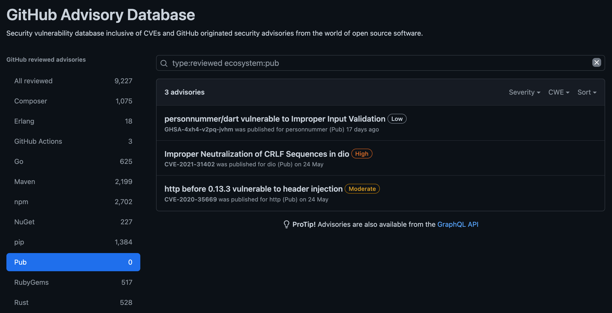
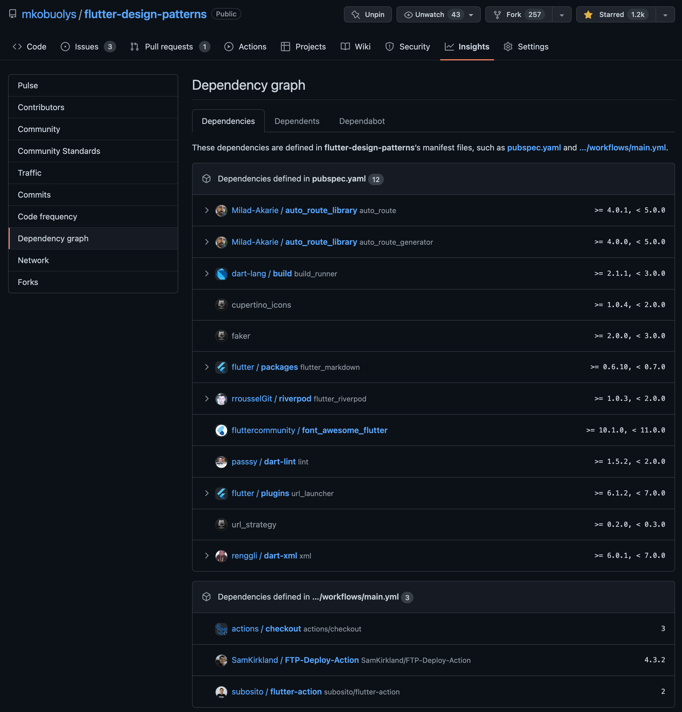
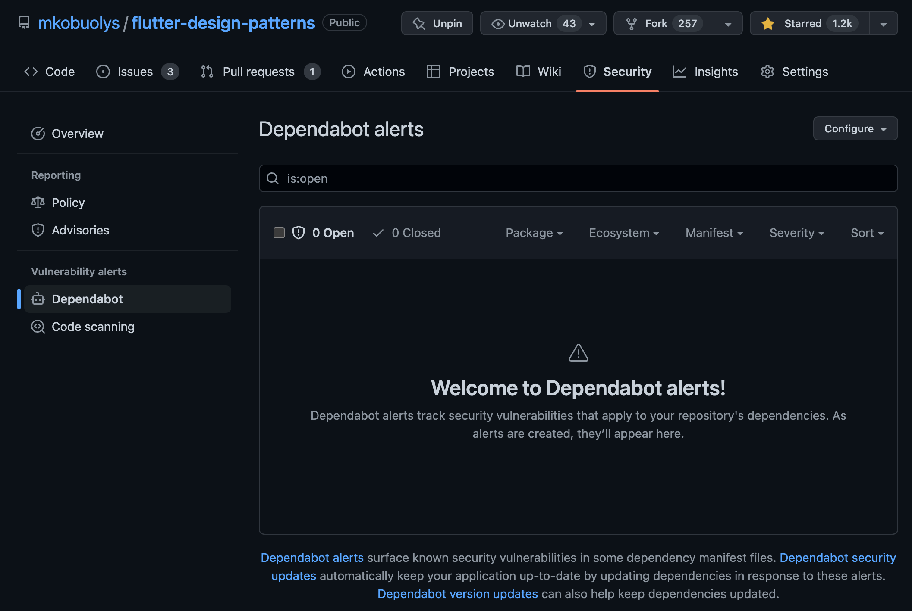
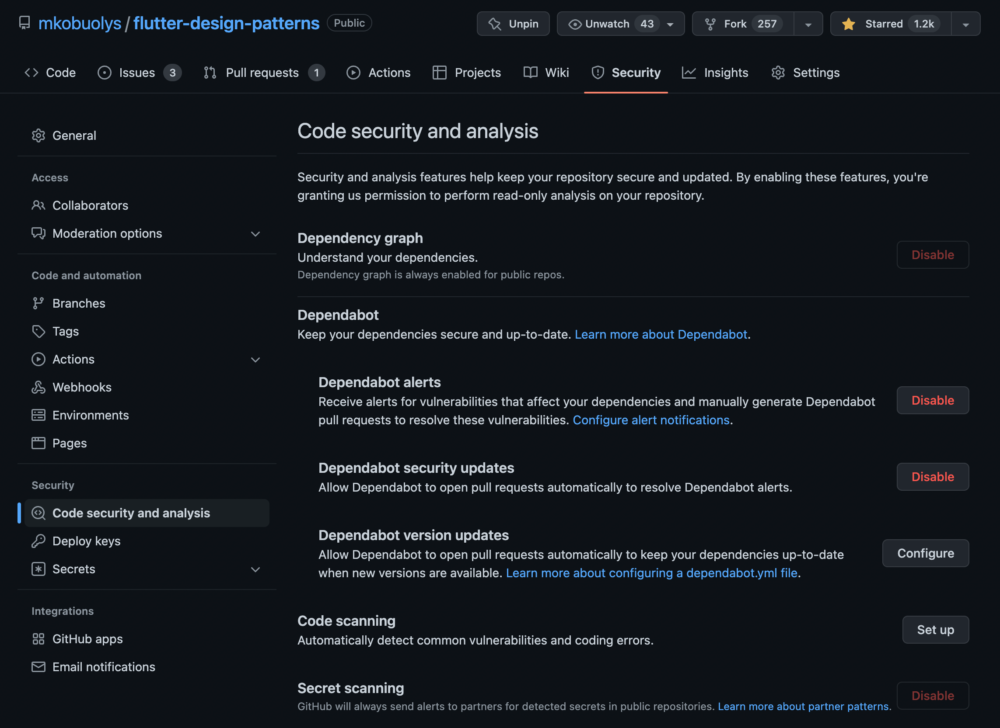
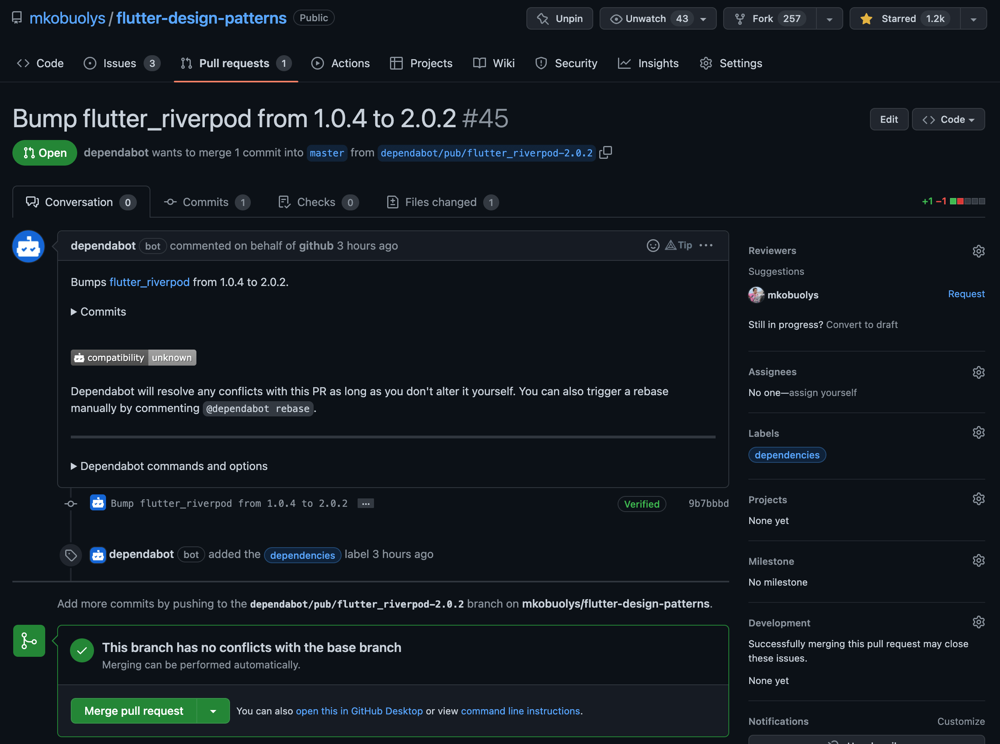

_Enabling supply chain security features for Dart and Flutter projects on GitHub_


On October 6, 2022, [GitHub announced](https://github.blog/2022-10-06-githubs-supply-chain-security-features-now-support-dart/) the availability of supply chain security features for the Dart developer ecosystem. This post will review the available options and how to enable these features for your projects.

<!--truncate-->

## What is supply chain security?

> GitHub is used daily by hundreds of thousand Dart and Flutter developers building multi-platform apps. By collaborating with GitHub to add Dart to their supply chain security features, Dart developers now have new ways to find and fix issues before they impact their customers.
>
> \- _Michael Thomsen, Group Product Manager at Google_

[Supply chain security](https://github.com/features/security/software-supply-chain) is a set of features that help you identify and mitigate security risks in your software supply chain:

- [Security advisories](https://docs.github.com/en/code-security/repository-security-advisories/about-github-security-advisories-for-repositories) - an open database of security advisories that lists known vulnerabilities in packages.



:::info
Check the [GitHub Advisory Database](https://github.com/advisories?query=type%3Areviewed+ecosystem%3Apub) for the current list of security advisories for packages published on [pub.dev](https://pub.dev/).
:::

- [Dependency graph](https://docs.github.com/en/code-security/supply-chain-security/understanding-your-software-supply-chain/about-the-dependency-graph) - in short, a list of all the dependencies and their versions used in your project. For Dart and Flutter projects, `pubspec.yaml` and `pubspec.lock` files are used to generate the dependency graph.



:::info
For your Dart and Flutter projects on GitHub, you could check the dependency graph under "_Insights_ -> _Dependency graph_".
:::

- [Dependabot alerts](https://docs.github.com/en/code-security/dependabot/dependabot-alerts/about-dependabot-alerts) and [security updates](https://docs.github.com/en/code-security/dependabot/dependabot-security-updates/about-dependabot-security-updates) - an automated way to alert about security vulnerabilities in the repository and to keep the dependencies up-to-date by creating a pull-request with the latest version of the dependency.



## Enabling supply chain security features on GitHub

If your Dart or Flutter project source code resides in a **public** GitHub repository, you are already (kinda) secured - Dependabot has started monitoring for security issues already.

However, for private repositories, you need to enable the security features manually. To do so, go to "_Settings_ -> _Code security and analysis_" and enable whatever features you need:



### Enabling Dependabot version updates

To enable Dependabot version updates for your Dart and Flutter projects, you need to create a `dependabot.yml` file in your repository. The file should contain the following:

```yaml title="dependabot.yml"
version: 2
updates:
  - package-ecosystem: "pub"
    directory: "/"
    schedule:
      interval: "weekly"
```

- `version: 2` - specifies the version of the configuration file format.
- `package-ecosystem: "pub"` - specifies the package manager to use. For your Dart and Flutter projects, this should be `pub`.
- `directory: "/"` - specifies the directory to look for the `pubspec.yaml` file.
- `interval: "weekly"` - specifies the interval to check for updates. You can use `daily`, `weekly`, or `monthly`.

Then, once Dependabot finds a new version of a dependency, it will create a pull-request with the updated version. You can then review the changes and merge the pull-request:



## Summary

If you thought that the only free cheese is in the mousetrap, you were wrong. GitHub, in a collaboration with the Dart team at Google, has made it possible to improve the security of your Dart and Flutter projects for free. As you may notice, most of the features come out of the box. What's your excuse now not to use them?

:::info
Check the official blog post by Google for more details: [Partnering with GitHub on supply chain security for Dart packages](https://medium.com/dartlang/partnering-with-github-on-an-supply-chain-security-485eed1fc388).
:::
