_Overview of Firebase Remote Config and how to use it to enable real-time features in your Flutter application_

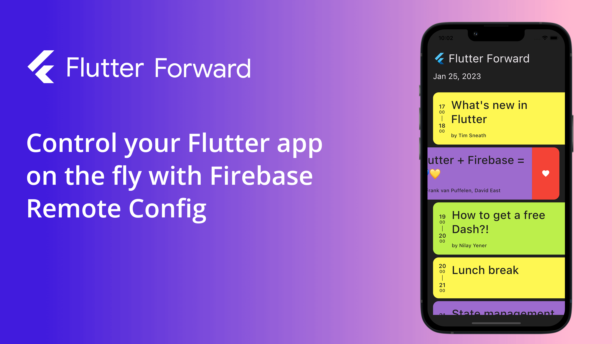

Real-time updates, feature flagging and A/B testing - what if I told you that you could enable these powerful features in your Flutter application with minimal development effort and without any costs? In this article, I will cover multiple real-world use cases where Firebase Remote Config could help you while building Flutter apps.

<!--truncate-->

:::tip
If you prefer video content, check out the video version of this article on [YouTube](https://youtu.be/1qHSvGoqqiE).
:::

## What is Firebase Remote Config?


[Firebase Remote Config](https://firebase.google.com/products/remote-config) is a cloud-based service that lets you change the behaviour and appearance of your app without requiring an app update. You can make changes to your app in real time, and users will see the updates immediately. That is especially useful for A/B testing, feature flagging and other experiments.

In this article, I will cover the following topics:

- App configuration values;
- Notifying users about a new app version;
- Feature flagging;
- Staged roll-outs;
- A/B testing.

That seems like a lot! Let's start with the demo app overview.

## Flutter Forward agenda app

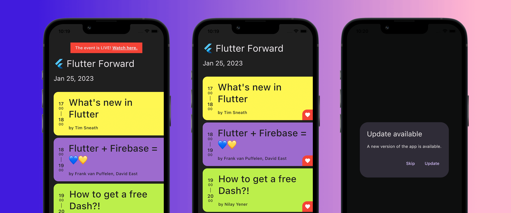

The Flutter Forward agenda app is a simple app that displays general information about the conference and the event schedule.

### Overview

The event information is currently read from the JSON file stored in local assets.

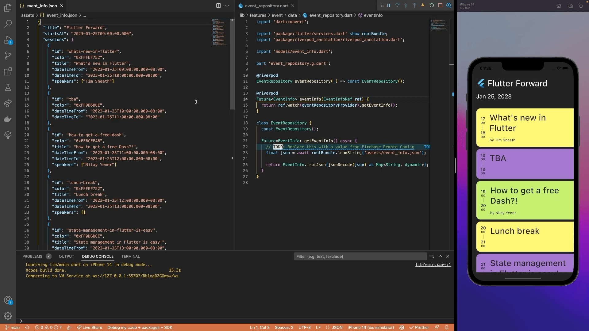

The app has a live stream feature that notifies the user when the event goes live and provides a link to join the stream.

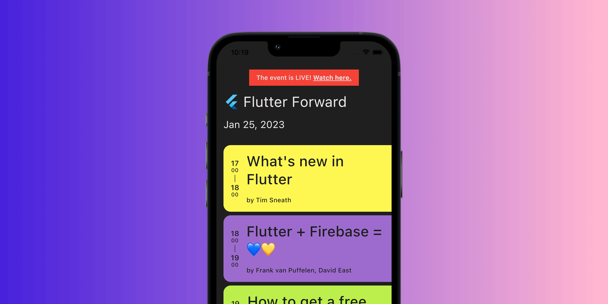

Also, there are two different available options to add a session to the list of favourites - by either using a slideable button or an on-card one. We will get back to this a little bit later when we talk about A/B testing.

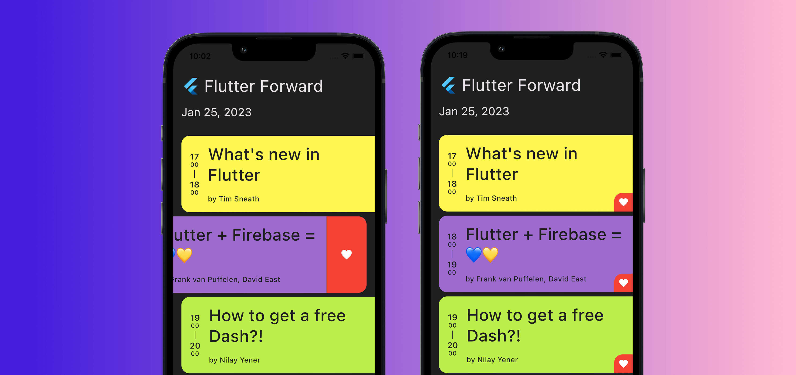

Lastly, an app update modal is implemented to notify the users when the new app version is out and set whether the update is mandatory or not.

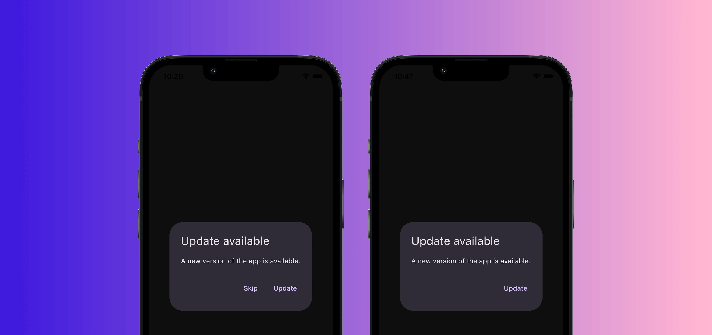

### Challenges

Overall, the app works great as is, however, we could have some problems along the way:

1. Data is stored locally. This is great - we don’t need an internet connection, right? Well, currently we have some TBA items in the schedule and the event timeline could change in the future as well. Meaning, once we update the event schedule, we would need to release a new app version just to update the data. This is not ideal, as we would need to wait for the app review process to complete and then push the update to the users. This could take a while, and users could even miss out on the event!
2. Features like app update or live stream notification can not even exist without triggering them remotely. We could technically implement on-device triggers, but we would face the same problem as with the data - we need to release a new app version just to change the conditional logic.
3. At this point, how can we even test the usage of add to favourites feature? The app needs to provide some sort of analytics and A/B testing features to validate our assumptions and provide the best possible experience for our users.

Fortunately, Firebase Remote Config seems like a perfect fit for these use cases. Let's get started!

## Firebase setup

A good place to start is by creating a new Firebase project and adding it to the Flutter app. Go to the [Firebase console](https://console.firebase.google.com/), select “Add project” and come up with a not-so-creative project name.

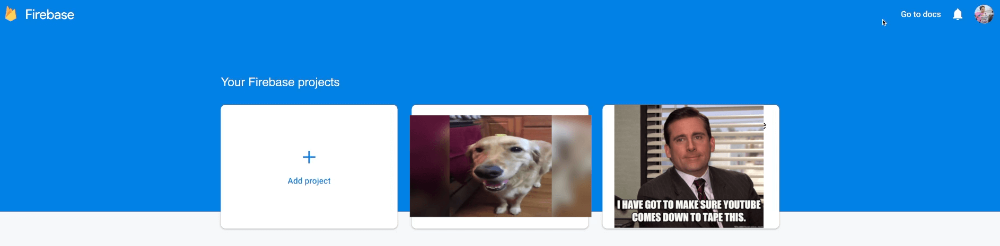

Do not forget to enable Google Analytics for the project since we will use this for A/B testing a little bit later.

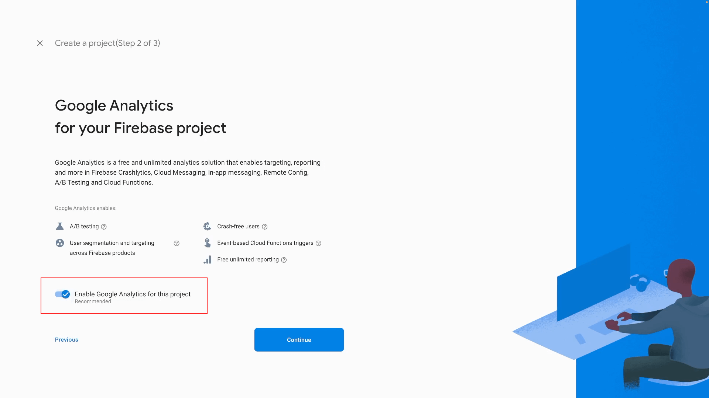

Then, choose a Google Analytics account and select “Create project”. After a minute or two, your project now must be ready to be used in your Flutter project.

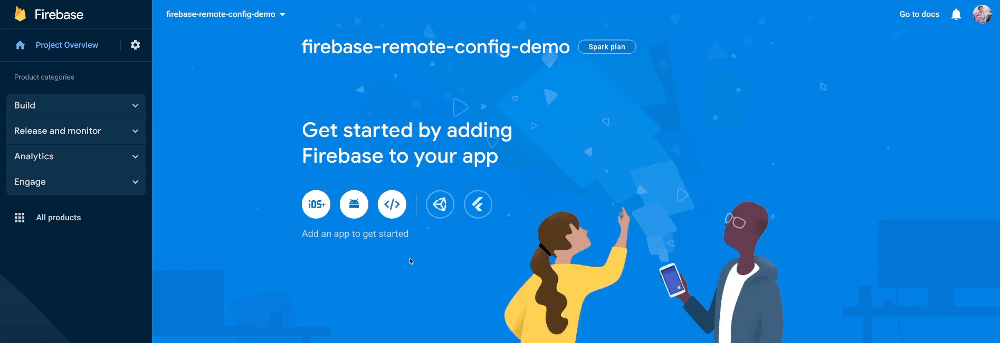

Now, let’s add Firebase to the Flutter app. In this project, we are going to use `firebase_analytics`, `firebase_core`, and `firebase_remote_config` packages, so add them to the project dependencies:

```yaml title="pubspec.yaml"
firebase_analytics: ^10.1.0
firebase_core: ^2.4.1
firebase_remote_config: ^3.0.9
```

:::note
The versions provided above are the latest at the time of writing this article. Make sure to check the latest versions on [pub.dev](https://pub.dev/).
:::

The easiest way to connect Firebase project with a Flutter application is by using the [Flutterfire CLI](https://firebase.google.com/docs/flutter/setup). Run the following command (replace `<project_id>` with your Firebase project ID) to configure the project:

```bash
flutterfire configure -p <project_id>
```

The `flutterfire configure` command initialises the Firebase project for the selected platforms. Since we haven’t initialised any Android or iOS apps yet, these are created for us automatically.

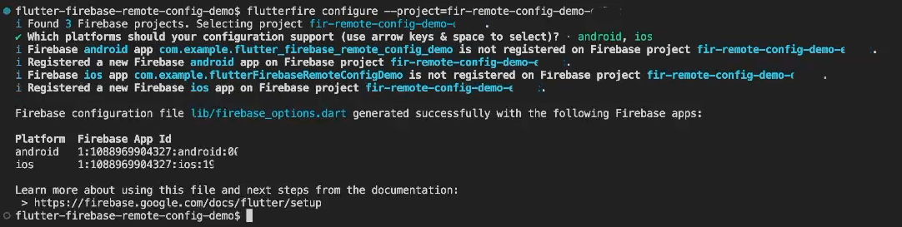

Finally, we initialise Firebase on application start-up:

```dart title="main.dart"
Future<void> main() async {
  WidgetsFlutterBinding.ensureInitialized();

  // highlight-next-line
  await Firebase.initializeApp(options: DefaultFirebaseOptions.currentPlatform);

  runApp(
    ProviderScope(
      child: const App(),
    ),
  );
}
```

:::caution
It's important to add `WidgetsFlutterBinding.ensureInitialized()` before initialising Firebase. This is because `Firebase.initializeApp()` needs to call native code using platform channels to initialize Firebase, and this process is asynchronous. Therefore, we need to make sure that the `WidgetsBinding` is initialised.
:::

## Using Firebase Remote Config parameters

The first improvement that we will make for the Flutter Forward agenda app is extracting local event data to Firebase Remote Config so it could be updated on the fly.

From the Firebase console, create the first Firebase Remote Config property called `event_info` which is of type JSON. Then, copy the event data from the local assets file in the Flutter app and paste it into the JSON editor view.

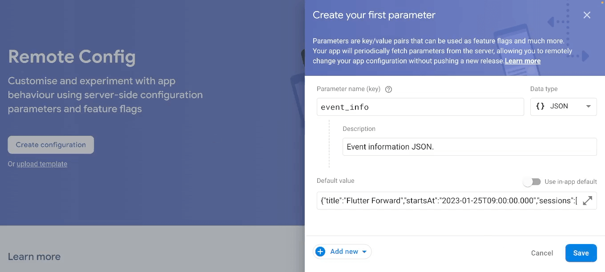

Do not forget to save the changes and publish your Firebase Remote Config properties for the first time. 🤘

Now we can safely remove assets from the project and start implementing the `FirebaseRemoteConfigService`. This service is a wrapper around the `FirebaseRemoteConfig` dependency that will be used across the whole application. First, add some boilerplate code for Riverpod to make the service accessible across the whole app. Then, start implementing the initialisation code by creating a try/catch block to handle some Firebase oopsies if there will be any.

```dart title="firebase_remote_config_service.dart"
import 'dart:developer' as developer;

import 'package:firebase_core/firebase_core.dart';
import 'package:firebase_remote_config/firebase_remote_config.dart';
import 'package:riverpod_annotation/riverpod_annotation.dart';

part 'firebase_remote_config_service.g.dart';

@riverpod
FirebaseRemoteConfigService firebaseRemoteConfigService(_) {
  throw UnimplementedError();
}

class FirebaseRemoteConfigService {
  const FirebaseRemoteConfigService({
    required this.firebaseRemoteConfig,
  });

  final FirebaseRemoteConfig firebaseRemoteConfig;

  Future<void> init() async {
    try {
      // <...>
    } on FirebaseException catch (e, st) {
      developer.log(
        'Unable to initialize Firebase Remote Config',
        error: e,
        stackTrace: st,
      );
    }
  }
}
```

To initialise the remote config properly, we need to ensure that the last activated config is available to getters, set the configuration settings and choose the appropriate loading strategy. Also, add a getter for the event info JSON:

```dart title="firebase_remote_config_service.dart"
class FirebaseRemoteConfigService {
  // <...>

  Future<void> init() async {
    try {
      await firebaseRemoteConfig.ensureInitialized();
      await firebaseRemoteConfig.setConfigSettings(
        RemoteConfigSettings(
          fetchTimeout: const Duration(seconds: 10),
          minimumFetchInterval: Duration.zero,
        ),
      );
      await firebaseRemoteConfig.fetchAndActivate();
    } on FirebaseException catch (e, st) {
      // <...>
    }
  }

  String getEventInfoJson() => firebaseRemoteConfig.getString('event_info');
}
```

:::tip
Head to the [Firebase documentation](https://firebase.google.com/docs/remote-config/loading) to learn more about different Firebase Remote Config loading strategies and which one should be used for your specific use case.
:::

Do not forget to initialise the project inside your project’s main method:

```dart title="main.dart"
// <...>
import 'package:firebase_remote_config/firebase_remote_config.dart';

import 'features/firebase/firebase_remote_config_service.dart';

Future<void> main() async {
  WidgetsFlutterBinding.ensureInitialized();

  await Firebase.initializeApp(options: DefaultFirebaseOptions.currentPlatform);

  // highlight-start
  final firebaseRemoteConfigService = FirebaseRemoteConfigService(
    firebaseRemoteConfig: FirebaseRemoteConfig.instance,
  );
  await firebaseRemoteConfigService.init();
  // highlight-end

  runApp(
    ProviderScope(
      // highlight-start
      overrides: [
        firebaseRemoteConfigServiceProvider.overrideWith(
          (_) => firebaseRemoteConfigService,
        ),
      ],
      // highlight-end
      child: const App(),
    ),
  );
}
```

Lastly, we need to update the event data source inside the `EventRepository`. Instead of loading JSON data from local assets, we use the value from Firebase Remote Config:

```dart title="event_repository.dart"
import 'dart:convert';

import 'package:riverpod_annotation/riverpod_annotation.dart';

// highlight-next-line
import '../../firebase/firebase_remote_config_service.dart';
import 'models/event_info.dart';

part 'event_repository.g.dart';

@riverpod
EventRepository eventRepository(EventRepositoryRef ref) {
  return EventRepository(
    // highlight-next-line
    firebaseRemoteConfigService: ref.watch(firebaseRemoteConfigServiceProvider),
  );
}

@riverpod
Future<EventInfo> eventInfo(EventInfoRef ref) {
  return ref.watch(eventRepositoryProvider).getEventInfo();
}

class EventRepository {
  const EventRepository({
    // highlight-next-line
    required this.firebaseRemoteConfigService,
  });

  // highlight-next-line
  final FirebaseRemoteConfigService firebaseRemoteConfigService;

  Future<EventInfo> getEventInfo() async {
    // highlight-next-line
    final json = firebaseRemoteConfigService.getEventInfoJson();

    return EventInfo.fromJson(jsonDecode(json) as Map<String, dynamic>);
  }
}
```

Now, if we update the event information at any moment in the future, we can be sure that the users will see the most recent information in front of them. And of course, changing event information won’t require releasing a new app version anymore.

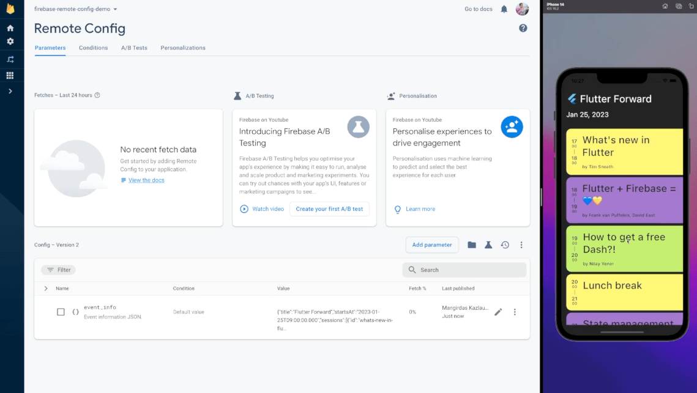

In the next section, we will implement the application update feature.

## Using Firebase Remote Config conditions

To differentiate Firebase Remote Config values based on platform, location, user group and other criteria, we use [conditions](https://firebase.google.com/docs/remote-config/parameters). For the Flutter Forward agenda app, we will use conditions to implement the application update and live notification features.

### App update modal

The thing with mobile application updates is that sometimes we want them to be mandatory, and sometimes we want to release an app update only for a particular platform. In our case, we create a dedicated condition for the Android platform.

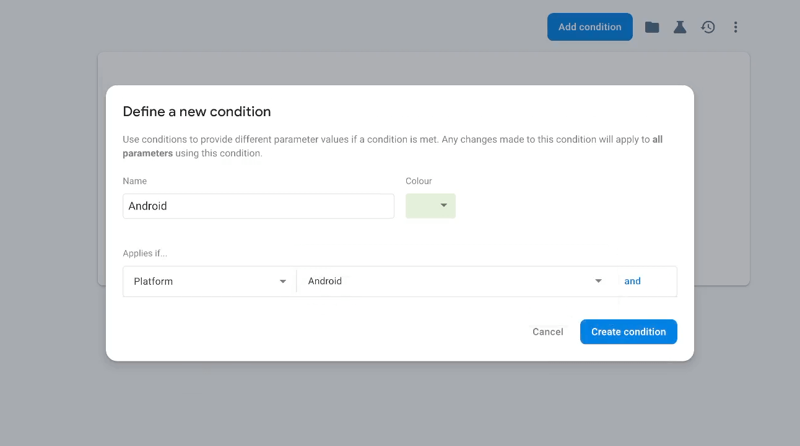

Then, we create a Firebase Remote Config property for the `app_version` JSON object that contains the application version, build number and a boolean flag whether the update is optional or not. To differentiate the value for iOS and Android we use the previously created condition. Save, publish the changes and we are good to go.

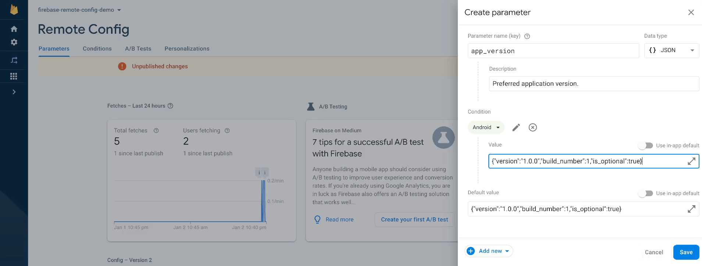

Again, we add a method to the `FirebaseRemoteConfigService` to retrieve the `app_version` JSON property:

```dart title="firebase_remote_config_service.dart"
class FirebaseRemoteConfigService {
  // <...>

  String getAppVersionJson() => firebaseRemoteConfig.getString('app_version');
}
```

Then, we use the `getAppVersionJson()` method inside the `AppUpdateService`:

```dart title="app_update_service.dart"
import 'dart:convert';

import 'package:package_info_plus/package_info_plus.dart';
import 'package:riverpod_annotation/riverpod_annotation.dart';

// highlight-next-line
import '../../firebase/firebase_remote_config_service.dart';
import 'models/app_update_status.dart';
import 'models/app_version.dart';

part 'app_update_service.g.dart';

@riverpod
AppUpdateService appUpdateService(AppUpdateServiceRef ref) {
  return AppUpdateService(
    // highlight-next-line
    firebaseRemoteConfigService: ref.watch(firebaseRemoteConfigServiceProvider),
  );
}

@riverpod
Future<AppUpdateStatus> updateStatus(UpdateStatusRef ref) async {
  return ref.watch(appUpdateServiceProvider).checkForUpdate();
}

class AppUpdateService {
  const AppUpdateService({
    // highlight-next-line
    required this.firebaseRemoteConfigService,
  });

  // highlight-next-line
  final FirebaseRemoteConfigService firebaseRemoteConfigService;

  Future<AppUpdateStatus> checkForUpdate() async {
    // highlight-start
    final json = firebaseRemoteConfigService.getAppVersionJson();
    final appVersion = AppVersion.fromJson(
      jsonDecode(json) as Map<String, dynamic>,
    );
    // highlight-end

    final packageInfo = await PackageInfo.fromPlatform();
    final currentAppVersion = AppVersion(
      version: packageInfo.version,
      buildNumber: int.tryParse(packageInfo.buildNumber) ?? 0,
    );

    return AppUpdateStatus(
      updateAvailable: currentAppVersion.compareToPreferred(appVersion),
      optional: appVersion.optional,
    );
  }
}
```

By creating and using a separate condition for the Android platform, now we can handle app update behaviour for each corresponding platform.

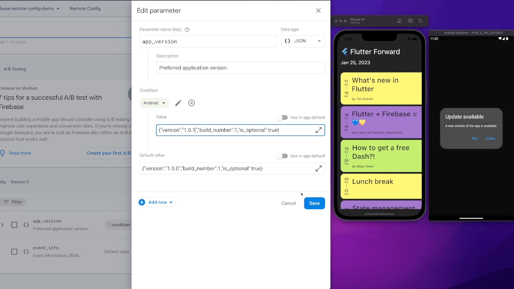

This is only a single example of how conditions could be applied to Firebase Remote Config values. Let’s see how we can use time-sensitive conditions to implement the live stream notification feature.

### Live stream notification

To define when the event is live, we need to create a time-sensitive condition. Simply, create a new condition in the Firebase console. For the condition, select a specific date and time range when you want it to work.

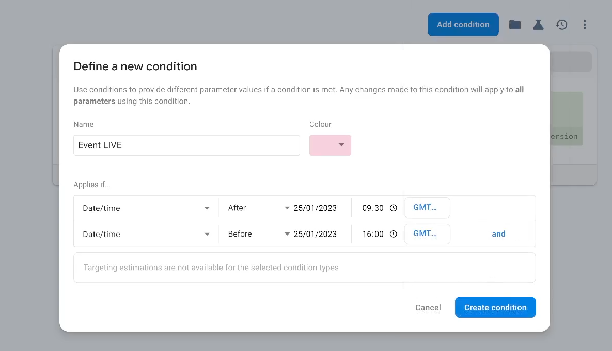

Then, define a boolean property `stream_live` that uses the defined condition. The property will return true only during the event, meaning when the current date and time are within the range specified in our condition.

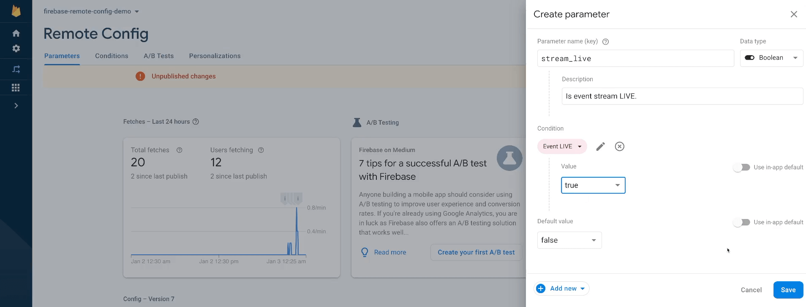

Also, add another property for the stream link - `stream_link` - so that we could update it any time if needed. I would also recommend to group related properties together for easier Firebase Remote Config properties’ management.

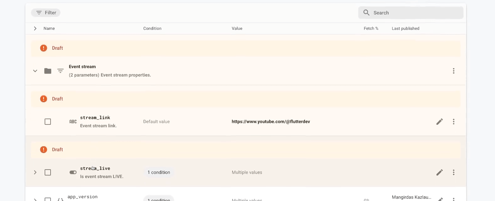

For the third time, we extend the `FirebaseRemoteConfigService` with new methods to retrieve the event stream data:

```dart title="firebase_remote_config_service.dart"
class FirebaseRemoteConfigService {
  // <...>

  String getStreamLink() => firebaseRemoteConfig.getString('stream_link');

  bool getStreamLive() => firebaseRemoteConfig.getBool('stream_live');
}
```

Later, we use the methods inside the `LiveStreamService`:

```dart title="live_stream_service.dart"
import 'package:riverpod_annotation/riverpod_annotation.dart';

// highlight-next-line
import '../../firebase/firebase_remote_config_service.dart';

part 'live_stream_service.g.dart';

@riverpod
LiveStreamService liveStreamService(LiveStreamServiceRef ref) {
  return LiveStreamService(
    // highlight-next-line
    firebaseRemoteConfigService: ref.watch(firebaseRemoteConfigServiceProvider),
  );
}

@riverpod
bool streamLive(StreamLiveRef ref) {
  return ref.watch(liveStreamServiceProvider).streamLive();
}

@riverpod
String streamLink(StreamLinkRef ref) {
  return ref.watch(liveStreamServiceProvider).streamLink();
}

class LiveStreamService {
  const LiveStreamService({
    // highlight-next-line
    required this.firebaseRemoteConfigService,
  });

  // highlight-next-line
  final FirebaseRemoteConfigService firebaseRemoteConfigService;

  bool streamLive() {
    // highlight-next-line
    return firebaseRemoteConfigService.getStreamLive();
  }

  String streamLink() {
    // highlight-next-line
    return firebaseRemoteConfigService.getStreamLink();
  }
}
```

I guess you noticed how we use the same pattern again and again. Add new property, extend the `FirebaseRemoteConfigService` with getters and then use them wherever they are needed. This way we can keep the code consistent and predictable. I hope that boring code will become a new trend in 2023! 🤞

To test out whether the event live notification is working, we need to wait for the event... or we can use the Firebase console to change the event start date 🤷‍♂️ Now, if you open the Flutter Forward app, you should see the live stream notification at the top of the screen.

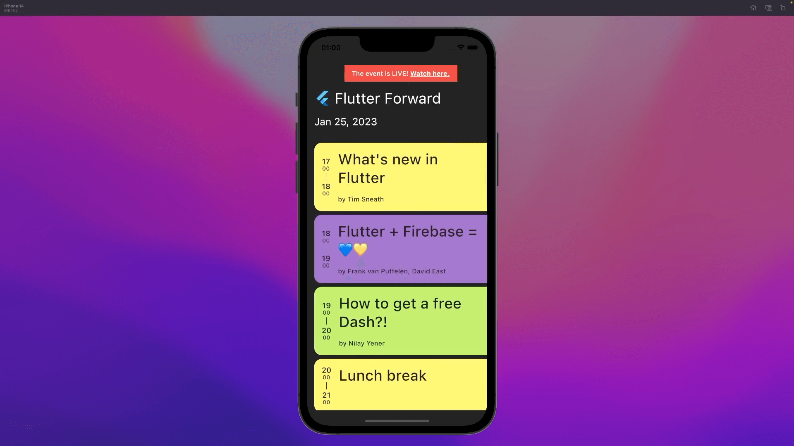

Ok, that’s cool! In the next section, we will see how we can use Firebase Remote Config for feature flagging and gradual roll-outs of new features.

## Feature flagging

A feature toggle or feature flag is a remote switch that could remotely enable or disable a specific feature in the application. This is extremely useful when you launch new app functionality and you want to do it in stages, or you notice an unexpected app behaviour and you can disable a feature instantly.

Let’s say we want to validate whether the _add event session to favourites_ feature will be used at all. First of all, we create a condition that will be applied only to 10% of our user base.

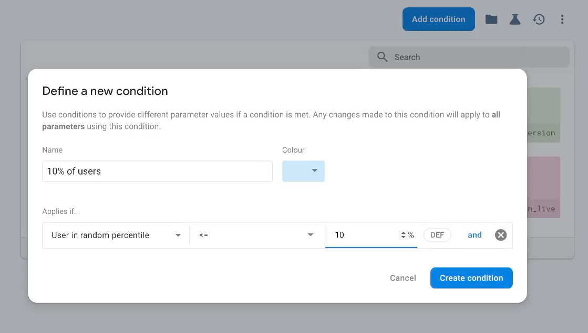

Then, create a feature toggle `favorites_enabled` that will enable the add to favourites functionality in the app and use the previously created condition.

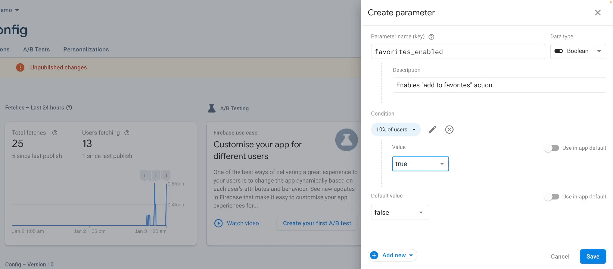

As usual, extend the `FirebaseRemoteConfigService` with an additional method:

```dart title="firebase_remote_config_service.dart"
class FirebaseRemoteConfigService {
  // <...>

  bool getFavoritesEnabled() => firebaseRemoteConfig.getBool('favorites_enabled');
}
```

Inside the `FavoritesService`, add the `FirebaseRemoteConfigService` dependency, add a new analytics event to track whether the user has used the _add to favorites_ feature and use the feature flag value from the Firebase Remote Config:

```dart title="favorites_service.dart"
import 'package:firebase_analytics/firebase_analytics.dart';
import 'package:riverpod_annotation/riverpod_annotation.dart';

// highlight-next-line
import '../../firebase/firebase_remote_config_service.dart';
import 'enums/favorite_button_type.dart';

part 'favorites_service.g.dart';

@riverpod
FavoritesService favoritesService(FavoritesServiceRef ref) {
  return FavoritesService(
    // highlight-start
    analytics: FirebaseAnalytics.instance,
    firebaseRemoteConfigService: ref.watch(firebaseRemoteConfigServiceProvider),
    // highlight-end
  );
}

@riverpod
bool favoritesEnabled(FavoritesEnabledRef ref) {
  return ref.watch(favoritesServiceProvider).favoritesEnabled();
}

@riverpod
FavoriteButtonType favoriteButtonType(FavoriteButtonTypeRef ref) {
  return ref.watch(favoritesServiceProvider).favoriteButtonType();
}

class FavoritesService {
  const FavoritesService({
    // highlight-start
    required this.analytics,
    required this.firebaseRemoteConfigService,
    // highlight-end
  });

  // highlight-start
  final FirebaseAnalytics analytics;
  final FirebaseRemoteConfigService firebaseRemoteConfigService;
  // highlight-end

  Future<void> addToFavorites(String id) async {
    // highlight-start
    await analytics.logEvent(
      name: 'add_to_favorites',
      parameters: {'session_id': id},
    );
    // highlight-end
  }

  bool favoritesEnabled() {
    // highlight-next-line
    return firebaseRemoteConfigService.getFavoritesEnabled();
  }

  FavoriteButtonType favoriteButtonType() {
    // highlight-start
    final type = firebaseRemoteConfigService.getFavoriteButtonType();

    return FavoriteButtonType.fromString(type);
    // highlight-end
  }
}
```

If we check the application behaviour, we can notice that the _add to favourites_ feature is enabled only on a particular set of devices since the "10% of users" condition is applied. If we are confident enough about the new functionality, we could turn the feature toggle on globally by removing the condition and setting the flag’s value to true.

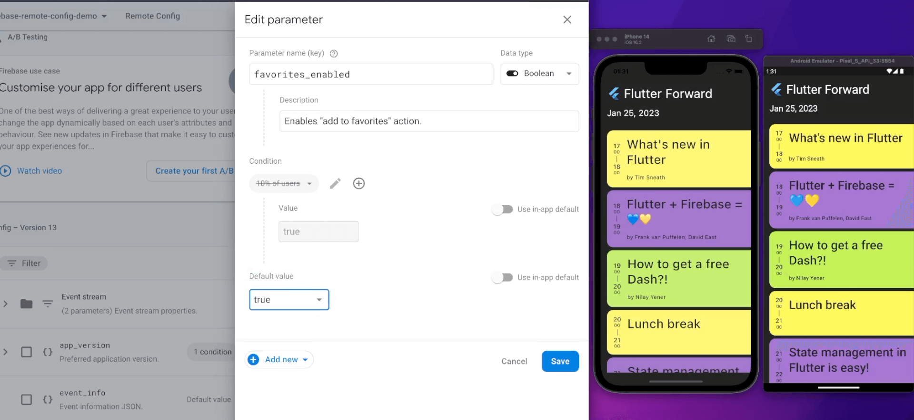

This is great! We can enable and disable features globally or we can do staged roll-outs by enabling the feature for, let’s say, 10% of users and gradually increasing this value. The question is, can we take this concept a step further? (Spoiler alert: yes, we can!)

## A/B testing

Honestly, A/B testing is very similar to feature toggling, just in addition to changing the values of a particular toggle, you also measure how that particular value affects the user’s behaviour. Then, you could see what value performs the best so you could be more confident when introducing new features to your users.

In our case, we noticed that the _add to favourites_ button is not performing well and we assume that the slideable button is too hidden for the users to even notice that this button exists. To validate this assumption, we will create a new toggle `favorite_button_type` that will have two possible values: `slideable` and `card` (stay tuned - this one will be added later with an A/B test).

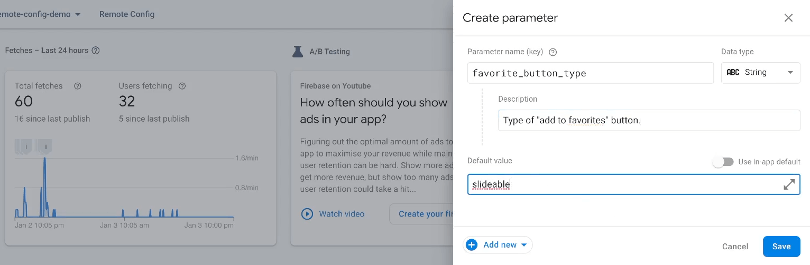

Now, we use the new property inside the app. First, we need to extend the `FirebaseRemoteConfigService` with a getter:

```dart title="firebase_remote_config_service.dart"
class FirebaseRemoteConfigService {
  // <...>

    String getFavoriteButtonType() => firebaseRemoteConfig.getString('favorite_button_type');
}
```

Then, we use it inside the `FavoritesService`:

```dart title="favorites_service.dart"
class FavoritesService {
  // <...>

  FavoriteButtonType favoriteButtonType() {
    final type = firebaseRemoteConfigService.getFavoriteButtonType();

    return FavoriteButtonType.fromString(type);
  }
}
```

This way we will be able to switch the button type remotely and even better - now we can create an A/B test for it.

### Creating an A/B test

From the Firebase Remote Config dashboard, select “Create your first A/B test”.

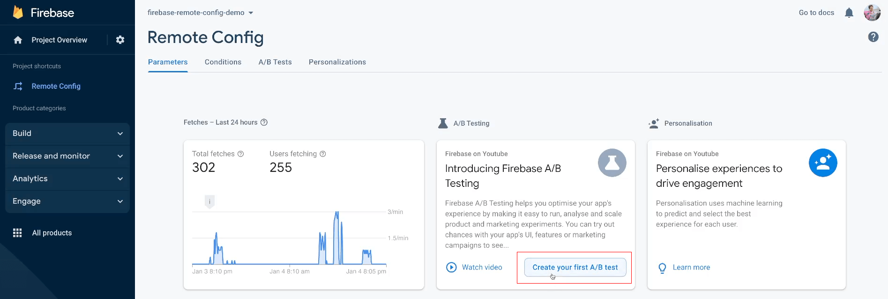

Then, come up with one more creative name for the experiment and select the target group for it.

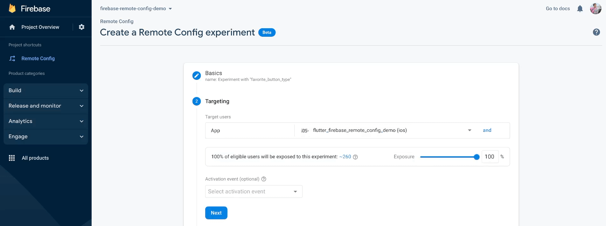

Our goal is to increase the add to favourites button conversion, so we select the corresponding event we created previously - `add_to_favorites`.

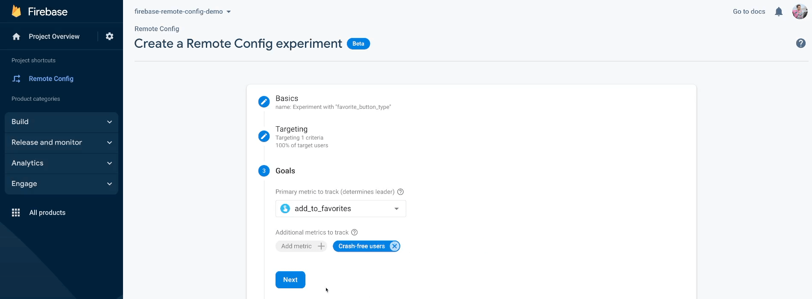

Finally, select the Firebase Remote Config property for the experiment and define the different values that you want to test. In our case, these are different button types - `slideable` and `card` buttons.

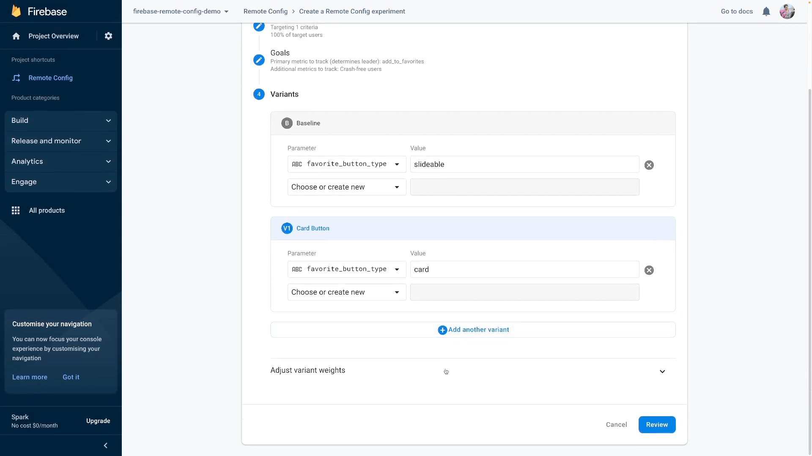

Leave the variant weights equal so that it would be a fair fight between different button types.

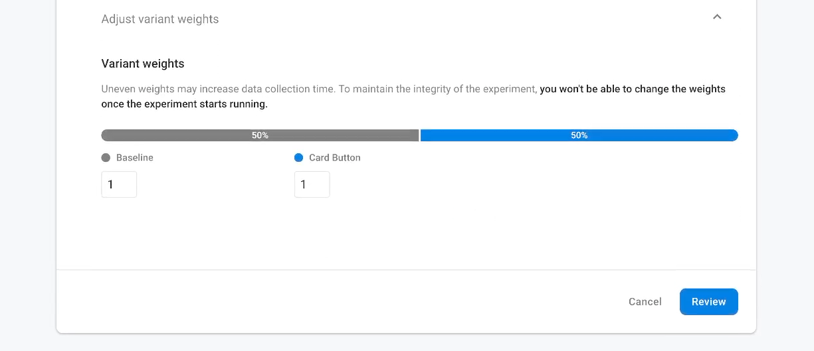

Start the experiment and now patiently wait for the results. To validate the A/B test, let’s run the app on different iOS devices. You should notice that some devices still use the slideable button, while others provide the button on top of the event session card - the A/B test is working!

:::note
Remember that it could take up to 24 hours for the experiment to start receiving data.
:::

### A/B test results

After some time, you should see the results in the A/B test dashboard.

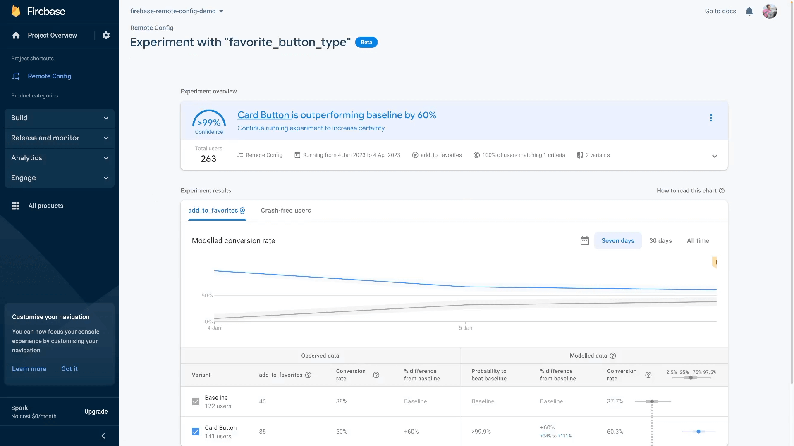

As you may notice, the `card` button type won by outperforming the `slideable` button by 60%. If we are confident enough about these results, we can roll out the changes so that the best-performing variant will be available to all users.

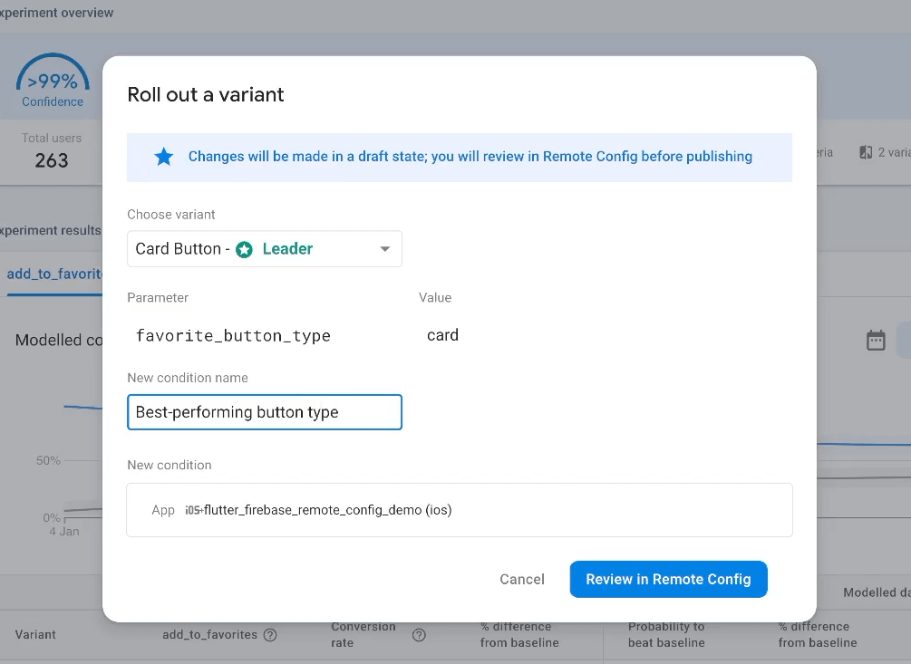

After that, do not forget to stop the experiment so it would not affect the button type values anymore.

## Summary

Let’s recap what we learned in this article:

1. You can use Firebase Remote Config to provide different values to your app and later change them on the fly.
2. Use conditions to provide different configuration values for your users.
3. Use Firebase Remote Config for feature flagging and gradual roll-outs of new features.
4. And do not forget to use A/B tests to validate your assumption and provide the best possible experience for your users.

If you want to dive deeper into the code or try out the Flutter Forward agenda app, you can find the full source code on [GitHub](https://github.com/mkobuolys/flutter-firebase-remote-config-demo). In case of any questions or suggestions - feel free to reach out to me on [Twitter](https://twitter.com/mkobuolys) or any other social media channel.
