_Retro rotary passcode input UI challenge made with Flutter. In the first part, the static design of the UI is implemented._

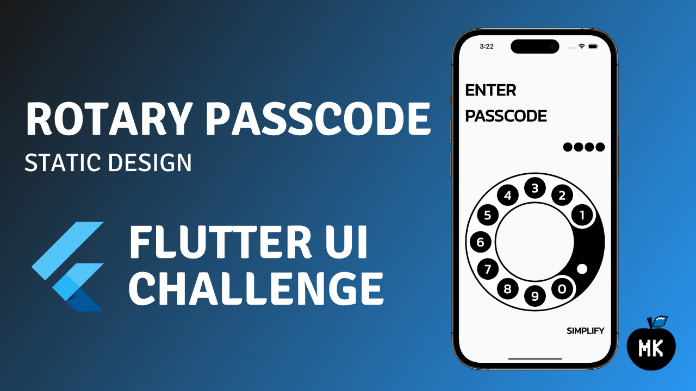

Some time ago, I implemented the rotary passcode UI and shared the code with the Flutter community. I may not be the sharpest tool in the shed, and I also promised to create an in-depth tutorial on how I implemented it. In this article, I will share the first part of the tutorial, which will cover the static design of the rotary passcode UI.

<!--truncate-->

:::tip
If you prefer video content, check out the video version of this article on [YouTube](https://youtu.be/Xb30L9wkEGU).
:::

## Overview

This is the original Design challenge I found on [Twitter](https://twitter.com/Shubham_iosdev/status/1586321298669834241):

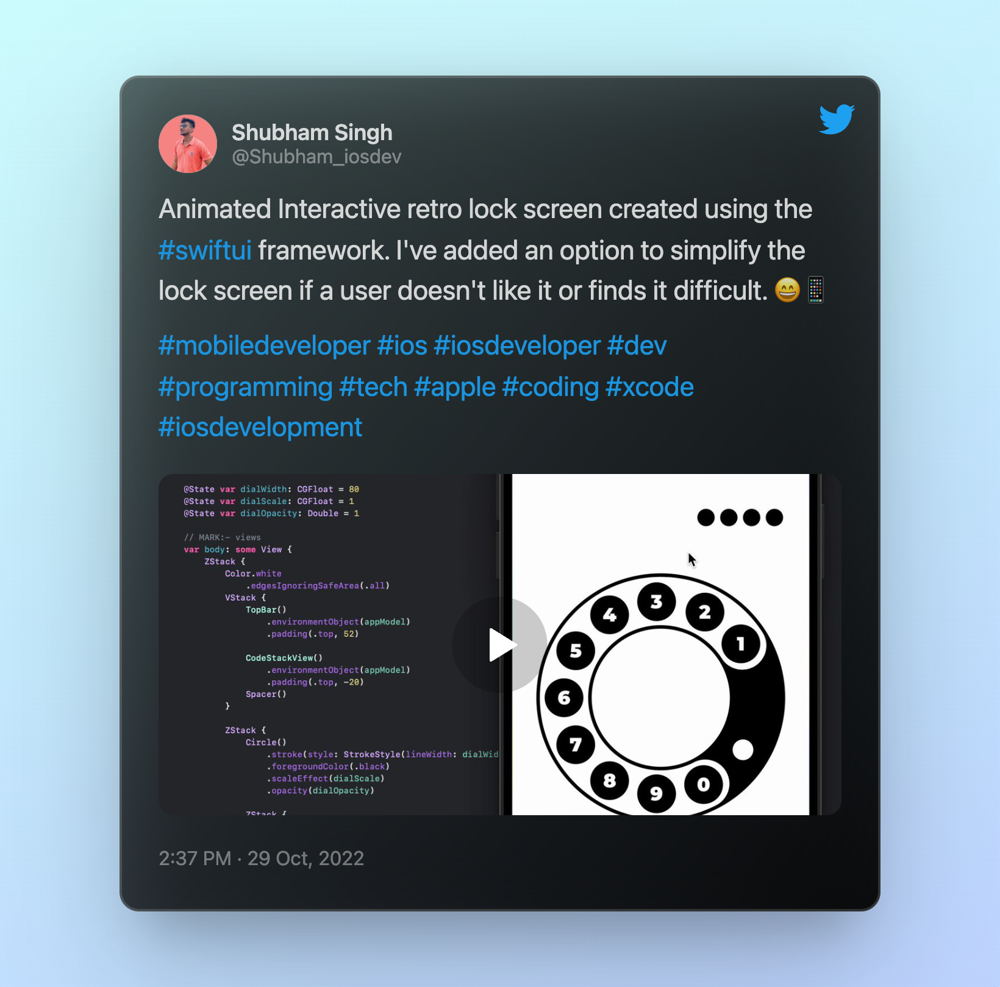

Initially, it was implemented using SwiftUI, but I decided to implement it using Flutter and hopefully learn something new. I will split this design challenge into two parts. The first one is static UI - simply, implementing all the visible layout elements. In the second part, I will cover the motion design part of the challenge - animations, gestures, transitions and other fancy eye candies visible on the screen.

## Common UI elements

There are two input modes in this UI challenge - the rotary dial input and the simple passcode. The same screen is used in both cases, just the elements are different based on the selected input mode.

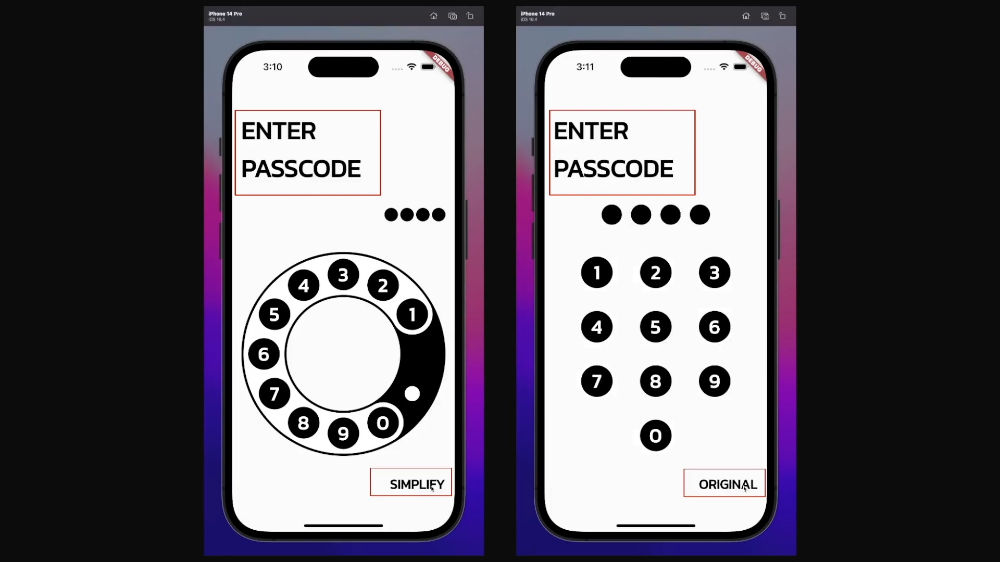

What’s common between them is the header text and the mode switch button at the bottom right corner. Start with a simple project where the `setPreferredOrientations` ensures that the app can only be used in portrait mode.

```dart title="main.dart"
import 'package:flutter/material.dart';
import 'package:flutter/services.dart';

Future<void> main() async {
  WidgetsFlutterBinding.ensureInitialized();
  // highlight-next-line
  await SystemChrome.setPreferredOrientations([DeviceOrientation.portraitUp]);

  runApp(const _App());
}

class _App extends StatelessWidget {
  const _App();

  @override
  Widget build(BuildContext context) {
    return const MaterialApp(
      title: 'Flutter Rotary Passcode',
      home: Scaffold(),
    );
  }
}
```

For the app’s typography, we will use [Google Fonts](https://fonts.google.com/). Thus, add the missing project dependency to the pubspec.yaml file.

```yaml title="pubspec.yaml"
dependencies:
  flutter:
    sdk: flutter
  // highlight-next-line
  google_fonts: ^3.0.1
```

After going through the available Google Fonts, it seems that the [Kanit](https://fonts.google.com/specimen/Kanit) font is a close enough option compared to the original design. Use it as the main text theme.

```dart title="main.dart"
import 'package:flutter/material.dart';
import 'package:flutter/services.dart';
import 'package:google_fonts/google_fonts.dart';

Future<void> main() async {
  WidgetsFlutterBinding.ensureInitialized();
  await SystemChrome.setPreferredOrientations([DeviceOrientation.portraitUp]);

  runApp(const _App());
}

class _App extends StatelessWidget {
  const _App();

  @override
  Widget build(BuildContext context) {
    return MaterialApp(
      title: 'Flutter Rotary Passcode',
      // highlight-start
      theme: Theme.of(context).copyWith(
        textTheme: GoogleFonts.kanitTextTheme(),
      ),
      // highlight-end
      home: const Scaffold(),
    );
  }
}
```

### Implementing passcode input view

To start with, create an empty Stateful `PasscodeInputView` widget with the `expectedCode` property...

```dart title="passcode_input_view.dart"
import 'package:flutter/material.dart';

class PasscodeInputView extends StatefulWidget {
  const PasscodeInputView({
    required this.expectedCode,
    super.key,
  });

  final String expectedCode;

  @override
  State<PasscodeInputView> createState() => _PasscodeInputViewState();
}

class _PasscodeInputViewState extends State<PasscodeInputView> {
  @override
  Widget build(BuildContext context) {
    return const Scaffold();
  }
}
```

… and use it as a home page for the app.

```dart title="main.dart"
import 'package:flutter/material.dart';
import 'package:flutter/services.dart';
import 'package:google_fonts/google_fonts.dart';

import 'passcode_input_view.dart';

Future<void> main() async {
  WidgetsFlutterBinding.ensureInitialized();
  await SystemChrome.setPreferredOrientations([DeviceOrientation.portraitUp]);

  runApp(const _App());
}

class _App extends StatelessWidget {
  const _App();

  @override
  Widget build(BuildContext context) {
    return MaterialApp(
      title: 'Flutter Rotary Passcode',
      theme: Theme.of(context).copyWith(
        textTheme: GoogleFonts.kanitTextTheme(),
      ),
      // highlight-next-line
      home: const PasscodeInputView(expectedCode: '6942'),
    );
  }
}
```

In the main view, add the `SafeArea` widget to ensure system elements not overlapping the UI elements.

```dart title="passcode_input_view.dart"
import 'package:flutter/material.dart';

class PasscodeInputView extends StatefulWidget {
  const PasscodeInputView({
    required this.expectedCode,
    super.key,
  });

  final String expectedCode;

  @override
  State<PasscodeInputView> createState() => _PasscodeInputViewState();
}

class _PasscodeInputViewState extends State<PasscodeInputView> {
  @override
  Widget build(BuildContext context) {
    return const Scaffold(
      // highlight-start
      body: SafeArea(
        child: Placeholder(),
      ),
      // highlight-end
    );
  }
}
```

Then, add some spacing from the screen boundaries using the `Padding` widget.

```dart title="passcode_input_view.dart"
import 'package:flutter/material.dart';

// highlight-next-line
const _padding = 16.0;

class PasscodeInputView extends StatefulWidget {
  const PasscodeInputView({
    required this.expectedCode,
    super.key,
  });

  final String expectedCode;

  @override
  State<PasscodeInputView> createState() => _PasscodeInputViewState();
}

class _PasscodeInputViewState extends State<PasscodeInputView> {
  @override
  Widget build(BuildContext context) {
    return const Scaffold(
      body: SafeArea(
        // highlight-start
        child: Padding(
          padding: EdgeInsets.fromLTRB(
            _padding,
            _padding * 3,
            _padding,
            _padding * 2,
          ),
          child: Placeholder(),
        ),
        // highlight-end
      ),
    );
  }
}
```

For the layout, use a single `Column` widget. Make sure to use the `CrossAxisAlignment.stretch` alignment property so that the elements would take a maximum width in the column.

```dart title="passcode_input_view.dart"
import 'package:flutter/material.dart';

const _padding = 16.0;

class PasscodeInputView extends StatefulWidget {
  const PasscodeInputView({
    required this.expectedCode,
    super.key,
  });

  final String expectedCode;

  @override
  State<PasscodeInputView> createState() => _PasscodeInputViewState();
}

class _PasscodeInputViewState extends State<PasscodeInputView> {
  @override
  Widget build(BuildContext context) {
    return Scaffold(
      body: SafeArea(
        child: Padding(
          padding: const EdgeInsets.fromLTRB(
            _padding,
            _padding * 3,
            _padding,
            _padding * 2,
          ),
          // highlight-start
          child: Column(
            crossAxisAlignment: CrossAxisAlignment.stretch,
            children: const [
              Expanded(child: Placeholder()),
            ],
          ),
          // highlight-end
        ),
      ),
    );
  }
}
```

Now, add the header text and some spacing below it…

```dart title="passcode_input_view.dart"
import 'package:flutter/material.dart';

const _padding = 16.0;

class PasscodeInputView extends StatefulWidget {
  const PasscodeInputView({
    required this.expectedCode,
    super.key,
  });

  final String expectedCode;

  @override
  State<PasscodeInputView> createState() => _PasscodeInputViewState();
}

class _PasscodeInputViewState extends State<PasscodeInputView> {
  @override
  Widget build(BuildContext context) {
    return Scaffold(
      body: SafeArea(
        child: Padding(
          padding: const EdgeInsets.fromLTRB(
            _padding,
            _padding * 3,
            _padding,
            _padding * 2,
          ),
          child: Column(
            crossAxisAlignment: CrossAxisAlignment.stretch,
            children: [
              // highlight-start
              Text(
                'Enter\npasscode'.toUpperCase(),
              ),
              const SizedBox(height: 32.0),
              // highlight-end
              const Expanded(child: Placeholder()),
            ],
          ),
        ),
      ),
    );
  }
}
```

… as well as style it with the `displaySmall` text style from our theme.

```dart title="passcode_input_view.dart"
import 'package:flutter/material.dart';

const _padding = 16.0;

class PasscodeInputView extends StatefulWidget {
  const PasscodeInputView({
    required this.expectedCode,
    super.key,
  });

  final String expectedCode;

  @override
  State<PasscodeInputView> createState() => _PasscodeInputViewState();
}

class _PasscodeInputViewState extends State<PasscodeInputView> {
  @override
  Widget build(BuildContext context) {
    return Scaffold(
      body: SafeArea(
        child: Padding(
          padding: const EdgeInsets.fromLTRB(
            _padding,
            _padding * 3,
            _padding,
            _padding * 2,
          ),
          child: Column(
            crossAxisAlignment: CrossAxisAlignment.stretch,
            children: [
              Text(
                'Enter\npasscode'.toUpperCase(),
                // highlight-start
                style: Theme.of(context).textTheme.displaySmall?.copyWith(
                      color: Colors.black,
                      fontWeight: FontWeight.bold,
                    ),
                // highlight-end
              ),
              const SizedBox(height: 32.0),
              const Expanded(child: Placeholder()),
            ],
          ),
        ),
      ),
    );
  }
}
```

Here is what the header text looks like:

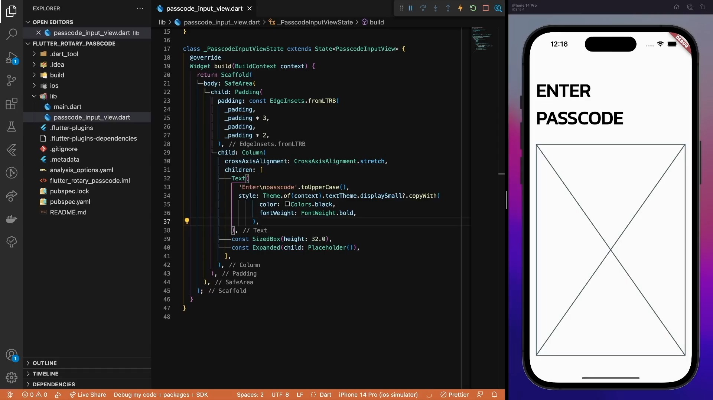

### Implementing input mode switch button

Next, create an input mode switch button that requires two properties. `simpleInputMode` indicates the current button state whether a rotary dial or a passcode input is used. The `onModeChanged` callback will be used on button click.

```dart title="input_mode_button.dart"
import 'package:flutter/material.dart';

class InputModeButton extends StatelessWidget {
  const InputModeButton({
    required this.simpleInputMode,
    required this.onModeChanged,
    super.key,
  });

  final bool simpleInputMode;
  final VoidCallback onModeChanged;

  @override
  Widget build(BuildContext context) {
    return const Placeholder();
  }
}
```

Add the button at the bottom of the passcode input view.

```dart title="passcode_input_view.dart"
import 'package:flutter/material.dart';

import 'widgets/input_mode_button.dart';

const _padding = 16.0;

class PasscodeInputView extends StatefulWidget {
  const PasscodeInputView({
    required this.expectedCode,
    super.key,
  });

  final String expectedCode;

  @override
  State<PasscodeInputView> createState() => _PasscodeInputViewState();
}

class _PasscodeInputViewState extends State<PasscodeInputView> {
  @override
  Widget build(BuildContext context) {
    return Scaffold(
      body: SafeArea(
        child: Padding(
          padding: const EdgeInsets.fromLTRB(
            _padding,
            _padding * 3,
            _padding,
            _padding * 2,
          ),
          child: Column(
            crossAxisAlignment: CrossAxisAlignment.stretch,
            children: [
              Text(
                'Enter\npasscode'.toUpperCase(),
                style: Theme.of(context).textTheme.displaySmall?.copyWith(
                      color: Colors.black,
                      fontWeight: FontWeight.bold,
                    ),
              ),
              const SizedBox(height: 32.0),
              const Expanded(child: Placeholder()),
              // highlight-start
              Align(
                alignment: Alignment.centerRight,
                child: InputModeButton(
                  simpleInputMode: true,
                  onModeChanged: () {},
                ),
              ),
              // highlight-end
            ],
          ),
        ),
      ),
    );
  }
}
```

To implement the button, a simple `Text` widget wrapped with the `GestureDetector` is more than enough. So, we wrap the placeholder first and pass the callback.

```dart title="input_mode_button.dart"
import 'package:flutter/material.dart';

class InputModeButton extends StatelessWidget {
  const InputModeButton({
    required this.simpleInputMode,
    required this.onModeChanged,
    super.key,
  });

  final bool simpleInputMode;
  final VoidCallback onModeChanged;

  @override
  Widget build(BuildContext context) {
    // highlight-start
    return GestureDetector(
      onTap: onModeChanged,
      child: const Placeholder(),
    );
    // highlight-end
  }
}
```

Based on the current button mode, provide the corresponding upper-cased label…

```dart title="input_mode_button.dart"
import 'package:flutter/material.dart';

class InputModeButton extends StatelessWidget {
  const InputModeButton({
    required this.simpleInputMode,
    required this.onModeChanged,
    super.key,
  });

  final bool simpleInputMode;
  final VoidCallback onModeChanged;

  @override
  Widget build(BuildContext context) {
    return GestureDetector(
      onTap: onModeChanged,
      // highlight-start
      child: Text(
        (simpleInputMode ? 'Original' : 'Simplify').toUpperCase(),
      ),
      // highlight-end
    );
  }
}
```

… and apply the `headlineSmall` text style from the theme data.

```dart title="input_mode_button.dart"
import 'package:flutter/material.dart';

class InputModeButton extends StatelessWidget {
  const InputModeButton({
    required this.simpleInputMode,
    required this.onModeChanged,
    super.key,
  });

  final bool simpleInputMode;
  final VoidCallback onModeChanged;

  @override
  Widget build(BuildContext context) {
    return GestureDetector(
      onTap: onModeChanged,
      child: Text(
        (simpleInputMode ? 'Original' : 'Simplify').toUpperCase(),
        // highlight-start
        style: Theme.of(context)
            .textTheme
            .headlineSmall
            ?.copyWith(color: Colors.black, fontWeight: FontWeight.bold),
        // highlight-end
      ),
    );
  }
}
```

And here is the result of the implemented common UI elements:

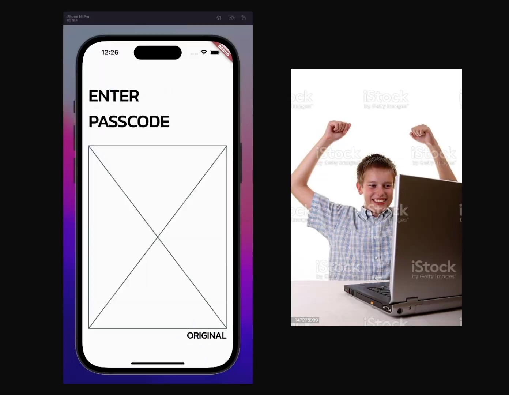

All the basic shareable elements are implemented. Now comes the fun part - different input types.

## Passcode input

Let’s create an abstract class for the global constants.

```dart title="constants.dart"
abstract class Constants {}
```

First, define all the input values used in the UI.

```dart title="constants.dart"
abstract class Constants {
  // highlight-next-line
  static const inputValues = [1, 2, 3, 4, 5, 6, 7, 8, 9, 0];
}
```

Then, define constants for the rotary dial component.

```dart title="constants.dart"
abstract class Constants {
  static const inputValues = [1, 2, 3, 4, 5, 6, 7, 8, 9, 0];

  // highlight-start
  static const rotaryRingPadding = 4.0;
  static const rotaryRingWidth = 80.0;
  // highlight-end
}
```

Finally, add the padding value for a single dial number…

```dart title="constants.dart"
abstract class Constants {
  static const inputValues = [1, 2, 3, 4, 5, 6, 7, 8, 9, 0];

  static const rotaryRingPadding = 4.0;
  static const rotaryRingWidth = 80.0;

  // highlight-next-line
  static const dialNumberPadding = 8.0;
}
```

… and use it to calculate the dial number radius in the UI.

```dart title="constants.dart"
abstract class Constants {
  static const inputValues = [1, 2, 3, 4, 5, 6, 7, 8, 9, 0];

  static const rotaryRingPadding = 4.0;
  static const rotaryRingWidth = 80.0;

  static const dialNumberPadding = 8.0;
  // highlight-start
  static const dialNumberRadius =
      rotaryRingWidth / 2 - (rotaryRingPadding + dialNumberPadding);
  // highlight-end
}
```

For the passcode input, individual dial numbers are positioned evenly in the 4x3 grid. Start with the placeholder widget…

```dart title="passcode_input.dart"
import 'package:flutter/widgets.dart';

class PasscodeInput extends StatelessWidget {
  const PasscodeInput({super.key});

  @override
  Widget build(BuildContext context) {
    return const Placeholder();
  }
}
```

… and use it in the `PasscodeInputView`.

```dart title="passcode_input_view.dart"
import 'package:flutter/material.dart';

import 'widgets/input_mode_button.dart';
import 'widgets/passcode/passcode_input.dart';

const _padding = 16.0;

class PasscodeInputView extends StatefulWidget {
  const PasscodeInputView({
    required this.expectedCode,
    super.key,
  });

  final String expectedCode;

  @override
  State<PasscodeInputView> createState() => _PasscodeInputViewState();
}

class _PasscodeInputViewState extends State<PasscodeInputView> {
  @override
  Widget build(BuildContext context) {
    return Scaffold(
      body: SafeArea(
        child: Padding(
          padding: const EdgeInsets.fromLTRB(
            _padding,
            _padding * 3,
            _padding,
            _padding * 2,
          ),
          child: Column(
            crossAxisAlignment: CrossAxisAlignment.stretch,
            children: [
              Text(
                'Enter\npasscode'.toUpperCase(),
                style: Theme.of(context).textTheme.displaySmall?.copyWith(
                      color: Colors.black,
                      fontWeight: FontWeight.bold,
                    ),
              ),
              const SizedBox(height: 32.0),
              const Expanded(
                // highlight-next-line
                child: PasscodeInput(),
              ),
              Align(
                alignment: Alignment.centerRight,
                child: InputModeButton(
                  simpleInputMode: true,
                  onModeChanged: () {},
                ),
              ),
            ],
          ),
        ),
      ),
    );
  }
}
```

The passcode input consists of four rows - add a `Column` widget to hold them…

```dart title="passcode_input.dart"
import 'package:flutter/widgets.dart';

class PasscodeInput extends StatelessWidget {
  const PasscodeInput({super.key});

  @override
  Widget build(BuildContext context) {
    // highlight-start
    return Column(
      children: const [],
    );
    // highlight-end
  }
}
```

… and create three empty `Row` widgets. The fourth row will contain only a single dial number, we will add it to the `Column` a bit later.

```dart title="passcode_input.dart"
import 'package:flutter/widgets.dart';

class PasscodeInput extends StatelessWidget {
  const PasscodeInput({super.key});

  @override
  Widget build(BuildContext context) {
    return Column(
      children: [
        // highlight-start
        for (var i = 0; i < 3; i++)
          Row(
            children: const [],
          ),
        // highlight-end
      ],
    );
  }
}
```

Each row (except the last one) contains three dial numbers. For now, use the `Text` widget just to render the corresponding values from constants.

```dart title="passcode_input.dart"
import 'package:flutter/widgets.dart';

import '../../constants.dart';

class PasscodeInput extends StatelessWidget {
  const PasscodeInput({super.key});

  @override
  Widget build(BuildContext context) {
    return Column(
      children: [
        for (var i = 0; i < 3; i++)
          Row(
            children: [
              // highlight-start
              for (var j = 0; j < 3; j++)
                Text(Constants.inputValues[i * 3 + j].toString()),
              // highlight-end
            ],
          ),
      ],
    );
  }
}
```

As mentioned before, add the last digit separately to the Column.

```dart title="passcode_input.dart"
import 'package:flutter/widgets.dart';

import '../../constants.dart';

class PasscodeInput extends StatelessWidget {
  const PasscodeInput({super.key});

  @override
  Widget build(BuildContext context) {
    return Column(
      children: [
        for (var i = 0; i < 3; i++)
          Row(
            children: [
              for (var j = 0; j < 3; j++)
                Text(Constants.inputValues[i * 3 + j].toString()),
            ],
          ),
        // highlight-next-line
        Text(Constants.inputValues.last.toString()),
      ],
    );
  }
}
```

Also, do not forget to space the elements evenly both, in vertical and horizontal directions.

```dart title="passcode_input.dart"
import 'package:flutter/widgets.dart';

import '../../constants.dart';

// highlight-next-line
const _alignment = MainAxisAlignment.spaceEvenly;

class PasscodeInput extends StatelessWidget {
  const PasscodeInput({super.key});

  @override
  Widget build(BuildContext context) {
    return Column(
      // highlight-next-line
      mainAxisAlignment: _alignment,
      children: [
        for (var i = 0; i < 3; i++)
          Row(
            // highlight-next-line
            mainAxisAlignment: _alignment,
            children: [
              for (var j = 0; j < 3; j++)
                Text(Constants.inputValues[i * 3 + j].toString()),
            ],
          ),
        Text(Constants.inputValues.last.toString()),
      ],
    );
  }
}
```

The current prototype looks like this:

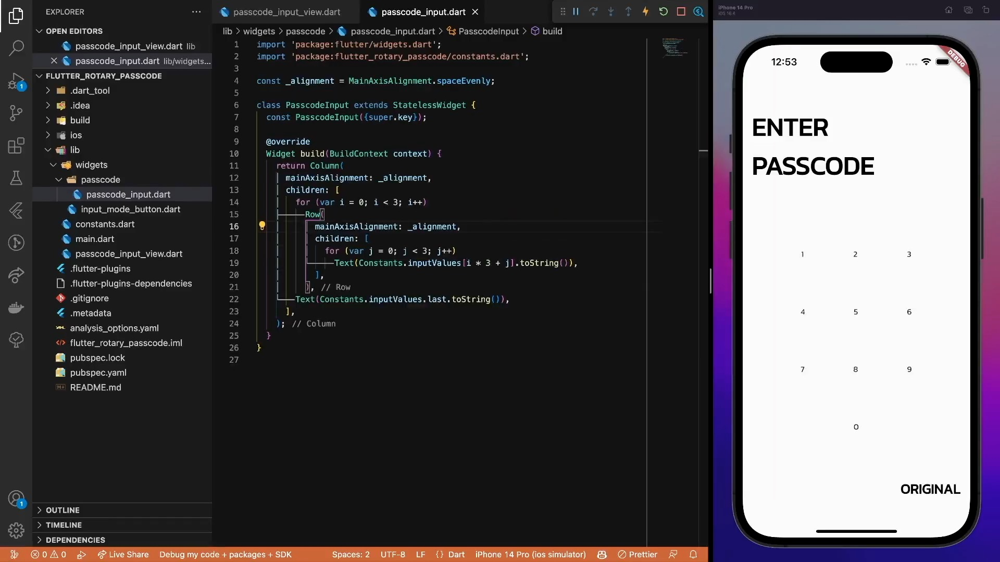

### Implementing dial number component

Now, it’s time to give a shape to a single dial number. Fun fact - the exact same component is used for both, passcode and rotary dial input modes.

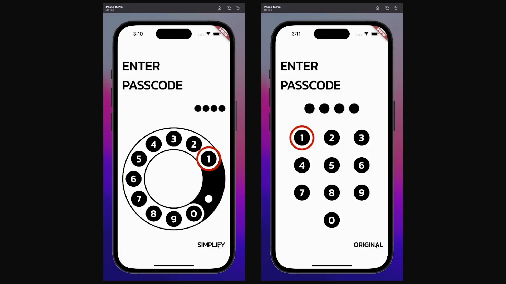

First, create a base `DialNumber` widget that accepts the input number.

```dart title="dial_number.dart"
import 'package:flutter/material.dart';

class DialNumber extends StatelessWidget {
  const DialNumber(
    this.number, {
    super.key,
  });

  final int number;

  @override
  Widget build(BuildContext context) {
    return Text('$number');
  }
}
```

As usual, replace the placeholder `Text` elements with the new component.

```dart title="passcode_input.dart"
import 'package:flutter/widgets.dart';

import '../../constants.dart';
import '../dial_number.dart';

const _alignment = MainAxisAlignment.spaceEvenly;

class PasscodeInput extends StatelessWidget {
  const PasscodeInput({super.key});

  @override
  Widget build(BuildContext context) {
    return Column(
      mainAxisAlignment: _alignment,
      children: [
        for (var i = 0; i < 3; i++)
          Row(
            mainAxisAlignment: _alignment,
            children: [
              for (var j = 0; j < 3; j++)
                // highlight-next-line
                DialNumber(Constants.inputValues[i * 3 + j]),
            ],
          ),
        // highlight-next-line
        DialNumber(Constants.inputValues.last),
      ],
    );
  }
}
```

Then, give a circular shape to the input with a black background.

```dart title="dial_number.dart"
import 'package:flutter/material.dart';

class DialNumber extends StatelessWidget {
  const DialNumber(
    this.number, {
    super.key,
  });

  final int number;

  @override
  Widget build(BuildContext context) {
    // highlight-start
    return Container(
      decoration: const BoxDecoration(
        color: Colors.black,
        shape: BoxShape.circle,
      ),
      child: Text('$number'),
    );
    // highlight-end
  }
}
```

Luckily, the specific size of our input is already calculated so use it directly from the constants file.

```dart title="dial_number.dart"
import 'package:flutter/material.dart';

import '../constants.dart';

class DialNumber extends StatelessWidget {
  const DialNumber(
    this.number, {
    super.key,
  });

  final int number;

  @override
  Widget build(BuildContext context) {
    return Container(
      // highlight-start
      height: Constants.dialNumberRadius * 2,
      width: Constants.dialNumberRadius * 2,
      // highlight-end
      decoration: const BoxDecoration(
        color: Colors.black,
        shape: BoxShape.circle,
      ),
      child: Text('$number'),
    );
  }
}
```

Then, center the label…

```dart title="dial_number.dart"
import 'package:flutter/material.dart';

import '../constants.dart';

class DialNumber extends StatelessWidget {
  const DialNumber(
    this.number, {
    super.key,
  });

  final int number;

  @override
  Widget build(BuildContext context) {
    return Container(
      height: Constants.dialNumberRadius * 2,
      width: Constants.dialNumberRadius * 2,
      // highlight-next-line
      alignment: Alignment.center,
      decoration: const BoxDecoration(
        color: Colors.black,
        shape: BoxShape.circle,
      ),
      child: Text('$number'),
    );
  }
}
```

… and also apply the `headlineMedium` text style to it.

```dart title="dial_number.dart"
import 'package:flutter/material.dart';

import '../constants.dart';

class DialNumber extends StatelessWidget {
  const DialNumber(
    this.number, {
    super.key,
  });

  final int number;

  @override
  Widget build(BuildContext context) {
    return Container(
      height: Constants.dialNumberRadius * 2,
      width: Constants.dialNumberRadius * 2,
      alignment: Alignment.center,
      decoration: const BoxDecoration(
        color: Colors.black,
        shape: BoxShape.circle,
      ),
      child: Text(
        '$number',
        // highlight-start
        style: Theme.of(context)
            .textTheme
            .headlineMedium
            ?.copyWith(color: Colors.white, fontWeight: FontWeight.bold),
        // highlight-end
      ),
    );
  }
}
```

Here is the result of the dial number component:

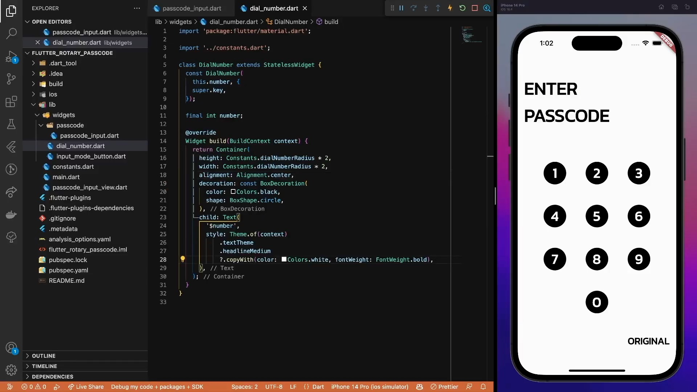

That’s all for the passcode input mode. Easy, right? Now, it’s time for the essential part of this tutorial - the rotary dial input.

## Rotary dial input

As usual, start with a placeholder widget.

```dart title="rotary_dial_input.dart"
import 'package:flutter/widgets.dart';

class RotaryDialInput extends StatelessWidget {
  const RotaryDialInput({super.key});

  @override
  Widget build(BuildContext context) {
    return const Placeholder();
  }
}
```

To be able to switch between different input modes, we need to track the currently active mode - the `simpleInputMode` flag indicates just that.

```dart title="passcode_input_view.dart"
import 'package:flutter/material.dart';

import 'widgets/input_mode_button.dart';
import 'widgets/passcode/passcode_input.dart';

const _padding = 16.0;

class PasscodeInputView extends StatefulWidget {
  const PasscodeInputView({
    required this.expectedCode,
    super.key,
  });

  final String expectedCode;

  @override
  State<PasscodeInputView> createState() => _PasscodeInputViewState();
}

class _PasscodeInputViewState extends State<PasscodeInputView> {
  // highlight-next-line
  var _simpleInputMode = false;

  @override
  Widget build(BuildContext context) {
    return Scaffold(
      body: SafeArea(
        child: Padding(
          padding: const EdgeInsets.fromLTRB(
            _padding,
            _padding * 3,
            _padding,
            _padding * 2,
          ),
          child: Column(
            crossAxisAlignment: CrossAxisAlignment.stretch,
            children: [
              Text(
                'Enter\npasscode'.toUpperCase(),
                style: Theme.of(context).textTheme.displaySmall?.copyWith(
                      color: Colors.black,
                      fontWeight: FontWeight.bold,
                    ),
              ),
              const SizedBox(height: 32.0),
              const Expanded(
                child: PasscodeInput(),
              ),
              Align(
                alignment: Alignment.centerRight,
                child: InputModeButton(
                  simpleInputMode: true,
                  onModeChanged: () {},
                ),
              ),
            ],
          ),
        ),
      ),
    );
  }
}
```

Switching between different modes is as simple as toggling this flag - add the `onModeChanged` method.

```dart title="passcode_input_view.dart"
import 'package:flutter/material.dart';

import 'widgets/input_mode_button.dart';
import 'widgets/passcode/passcode_input.dart';

const _padding = 16.0;

class PasscodeInputView extends StatefulWidget {
  const PasscodeInputView({
    required this.expectedCode,
    super.key,
  });

  final String expectedCode;

  @override
  State<PasscodeInputView> createState() => _PasscodeInputViewState();
}

class _PasscodeInputViewState extends State<PasscodeInputView> {
  var _simpleInputMode = false;

  // highlight-next-line
  void _onModeChanged() => setState(() => _simpleInputMode = !_simpleInputMode);

  @override
  Widget build(BuildContext context) {
    return Scaffold(
      body: SafeArea(
        child: Padding(
          padding: const EdgeInsets.fromLTRB(
            _padding,
            _padding * 3,
            _padding,
            _padding * 2,
          ),
          child: Column(
            crossAxisAlignment: CrossAxisAlignment.stretch,
            children: [
              Text(
                'Enter\npasscode'.toUpperCase(),
                style: Theme.of(context).textTheme.displaySmall?.copyWith(
                      color: Colors.black,
                      fontWeight: FontWeight.bold,
                    ),
              ),
              const SizedBox(height: 32.0),
              const Expanded(
                child: PasscodeInput(),
              ),
              Align(
                alignment: Alignment.centerRight,
                child: InputModeButton(
                  simpleInputMode: true,
                  onModeChanged: () {},
                ),
              ),
            ],
          ),
        ),
      ),
    );
  }
}
```

Then, pass the flag and mode changed callback to the `InputModeButton` instead of hardcoded values.

```dart title="passcode_input_view.dart"
import 'package:flutter/material.dart';

import 'widgets/input_mode_button.dart';
import 'widgets/passcode/passcode_input.dart';

const _padding = 16.0;

class PasscodeInputView extends StatefulWidget {
  const PasscodeInputView({
    required this.expectedCode,
    super.key,
  });

  final String expectedCode;

  @override
  State<PasscodeInputView> createState() => _PasscodeInputViewState();
}

class _PasscodeInputViewState extends State<PasscodeInputView> {
  var _simpleInputMode = false;

  void _onModeChanged() => setState(() => _simpleInputMode = !_simpleInputMode);

  @override
  Widget build(BuildContext context) {
    return Scaffold(
      body: SafeArea(
        child: Padding(
          padding: const EdgeInsets.fromLTRB(
            _padding,
            _padding * 3,
            _padding,
            _padding * 2,
          ),
          child: Column(
            crossAxisAlignment: CrossAxisAlignment.stretch,
            children: [
              Text(
                'Enter\npasscode'.toUpperCase(),
                style: Theme.of(context).textTheme.displaySmall?.copyWith(
                      color: Colors.black,
                      fontWeight: FontWeight.bold,
                    ),
              ),
              const SizedBox(height: 32.0),
              const Expanded(
                child: PasscodeInput(),
              ),
              Align(
                alignment: Alignment.centerRight,
                // highlight-start
                child: InputModeButton(
                  simpleInputMode: _simpleInputMode,
                  onModeChanged: _onModeChanged,
                ),
                // highlight-end
              ),
            ],
          ),
        ),
      ),
    );
  }
}
```

Also, let’s not forget to use the correct input mode based on the simpleInputMode flag value - `PasscodeInput` when the value is true, and the `RotaryDialInput` otherwise.

```dart title="passcode_input_view.dart"
import 'package:flutter/material.dart';

import 'widgets/input_mode_button.dart';
import 'widgets/passcode/passcode_input.dart';
import 'widgets/rotary_dial/rotary_dial_input.dart';

const _padding = 16.0;

class PasscodeInputView extends StatefulWidget {
  const PasscodeInputView({
    required this.expectedCode,
    super.key,
  });

  final String expectedCode;

  @override
  State<PasscodeInputView> createState() => _PasscodeInputViewState();
}

class _PasscodeInputViewState extends State<PasscodeInputView> {
  var _simpleInputMode = false;

  void _onModeChanged() => setState(() => _simpleInputMode = !_simpleInputMode);

  @override
  Widget build(BuildContext context) {
    return Scaffold(
      body: SafeArea(
        child: Padding(
          padding: const EdgeInsets.fromLTRB(
            _padding,
            _padding * 3,
            _padding,
            _padding * 2,
          ),
          child: Column(
            crossAxisAlignment: CrossAxisAlignment.stretch,
            children: [
              Text(
                'Enter\npasscode'.toUpperCase(),
                style: Theme.of(context).textTheme.displaySmall?.copyWith(
                      color: Colors.black,
                      fontWeight: FontWeight.bold,
                    ),
              ),
              const SizedBox(height: 32.0),
              // highlight-start
              Expanded(
                child: _simpleInputMode
                    ? const PasscodeInput()
                    : const RotaryDialInput(),
              ),
              // highlight-end
              Align(
                alignment: Alignment.centerRight,
                child: InputModeButton(
                  simpleInputMode: _simpleInputMode,
                  onModeChanged: _onModeChanged,
                ),
              ),
            ],
          ),
        ),
      ),
    );
  }
}
```

To implement the `RotaryDialInput`, we need to know the view constraints to size the component properly. Once you hear anything about the view constraints, probably you need a `LayoutBuilder` widget.

```dart title="rotary_dial_input.dart"
import 'package:flutter/widgets.dart';

class RotaryDialInput extends StatelessWidget {
  const RotaryDialInput({super.key});

  @override
  Widget build(BuildContext context) {
    // highlight-start
    return LayoutBuilder(
      builder: (context, constraints) {
        return const Placeholder();
      },
    );
    // highlight-end
  }
}
```

From the constraints, get the maximum width of the view and use it to set the size of the component. Since the `RotaryDialInput` is circular, the height and width properties are equal.

```dart title="rotary_dial_input.dart"
import 'package:flutter/widgets.dart';

class RotaryDialInput extends StatelessWidget {
  const RotaryDialInput({super.key});

  @override
  Widget build(BuildContext context) {
    return LayoutBuilder(
      builder: (context, constraints) {
        // highlight-start
        final width = constraints.maxWidth;
        final size = Size(width, width);
        // highlight-end

        return const Placeholder();
      },
    );
  }
}
```

Multiple custom painters are needed to draw the input component on the screen. Let’s use an empty one for now and pass the `size` value.

```dart title="rotary_dial_input.dart"
import 'package:flutter/widgets.dart';

class RotaryDialInput extends StatelessWidget {
  const RotaryDialInput({super.key});

  @override
  Widget build(BuildContext context) {
    return LayoutBuilder(
      builder: (context, constraints) {
        final width = constraints.maxWidth;
        final size = Size(width, width);

        // highlight-start
        return CustomPaint(
          size: size,
        );
        // highlight-end
      },
    );
  }
}
```

### Implementing rotary dial ring background

The first shape is a black background ring of the rotary dial input. First, create a boilerplate painter extending the `CustomPainter` class.

```dart title="rotary_dial_background_painter.dart"
import 'package:flutter/rendering.dart';

class RotaryDialBackgroundPainter extends CustomPainter {
  const RotaryDialBackgroundPainter();

  @override
  void paint(Canvas canvas, Size size) {}

  @override
  bool shouldRepaint(RotaryDialBackgroundPainter oldDelegate) => false;
}
```

In the input component, pass it as a painter object to the `CustomPaint` widget.

```dart title="rotary_dial_input.dart"
import 'package:flutter/widgets.dart';

import 'rotary_dial_background_painter.dart';

class RotaryDialInput extends StatelessWidget {
  const RotaryDialInput({super.key});

  @override
  Widget build(BuildContext context) {
    return LayoutBuilder(
      builder: (context, constraints) {
        final width = constraints.maxWidth;
        final size = Size(width, width);

        return CustomPaint(
          size: size,
          // highlight-next-line
          painter: const RotaryDialBackgroundPainter(),
        );
      },
    );
  }
}
```

As mentioned previously, to create a `RotaryDialInput` widget, we will use multiple painter objects stacked on top of each. Thus, add the `Stack` widget and align all the children widgets in the center.

```dart title="rotary_dial_input.dart"
import 'package:flutter/widgets.dart';

import 'rotary_dial_background_painter.dart';

class RotaryDialInput extends StatelessWidget {
  const RotaryDialInput({super.key});

  @override
  Widget build(BuildContext context) {
    return LayoutBuilder(
      builder: (context, constraints) {
        final width = constraints.maxWidth;
        final size = Size(width, width);

        // highlight-start
        return Stack(
          alignment: Alignment.center,
          children: [
            CustomPaint(
              size: size,
              painter: const RotaryDialBackgroundPainter(),
            ),
          ],
        );
        // highlight-end
      },
    );
  }
}
```

Since we will draw custom components on a blank canvas, a useful util method to have is calculating the center `Offset` value from the `Size` object.

```dart title="utils.dart"
import 'dart:ui';

extension SizeX on Size {
  Offset get centerOffset => Offset(width / 2, height / 2);
}
```

The rotary dial background is a simple black ring. So define the painter (in other words, the styling used to draw a shape on a canvas) as a black stroke of a specific width from the constants.

```dart title="rotary_dial_background_painter.dart"
import 'package:flutter/rendering.dart';

import '../../constants.dart';

class RotaryDialBackgroundPainter extends CustomPainter {
  const RotaryDialBackgroundPainter();

  @override
  void paint(Canvas canvas, Size size) {
    // highlight-start
    const ringWidth = Constants.rotaryRingWidth;
    final paint = Paint()
      ..color = const Color.fromRGBO(0, 0, 0, 1.0)
      ..strokeWidth = ringWidth
      ..style = PaintingStyle.stroke;
    // highlight-end
  }

  @override
  bool shouldRepaint(RotaryDialBackgroundPainter oldDelegate) => false;
}
```

Then, draw the shape on the screen by using the `canvas.drawArc()` method. As a first parameter, pass the rectangle that should contain the given arc. Then, to draw a full circle set the `startAngle` to 0 and the `sweepAngle` to a full circle value in radians.

```dart title="rotary_dial_background_painter.dart"
import 'dart:math' as math;

import 'package:flutter/rendering.dart';

import '../../constants.dart';
import '../../utils.dart';

class RotaryDialBackgroundPainter extends CustomPainter {
  const RotaryDialBackgroundPainter();

  @override
  void paint(Canvas canvas, Size size) {
    const ringWidth = Constants.rotaryRingWidth;
    final paint = Paint()
      ..color = const Color.fromRGBO(0, 0, 0, 1.0)
      ..strokeWidth = ringWidth
      ..style = PaintingStyle.stroke;

    // highlight-start
    canvas.drawArc(
      Rect.fromCircle(
        center: size.centerOffset,
        radius: size.width / 2 - ringWidth / 2,
      ),
      0,
      math.pi * 2.0,
      false,
      paint,
    );
    // highlight-end
  }

  @override
  bool shouldRepaint(RotaryDialBackgroundPainter oldDelegate) => false;
}
```

Here is the result of the implemented rotary dial background:

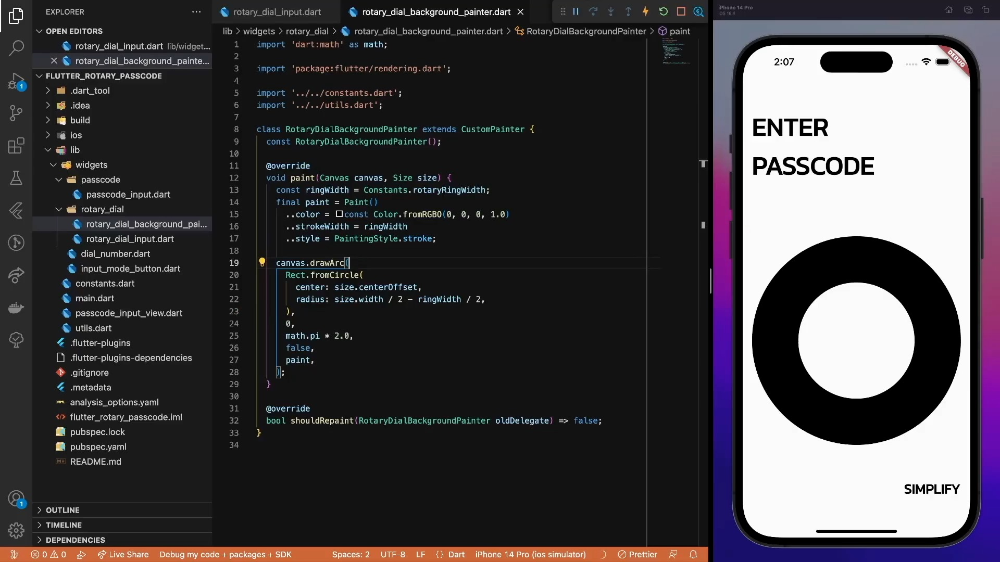

### Positioning dial numbers

Next, position the dial numbers around the arc. For that, we need to calculate the dial number distance from the center which is identical for all the dial numbers, because… something something circle and geometry.

```dart title="rotary_dial_input.dart"
import 'package:flutter/widgets.dart';

import '../../constants.dart';
import 'rotary_dial_background_painter.dart';

class RotaryDialInput extends StatelessWidget {
  const RotaryDialInput({super.key});

  @override
  Widget build(BuildContext context) {
    const inputValues = Constants.inputValues;

    return LayoutBuilder(
      builder: (context, constraints) {
        final width = constraints.maxWidth;
        final size = Size(width, width);
        // highlight-start
        final dialNumberDistanceFromCenter = width / 2 -
            16.0 - // page padding
            Constants.rotaryRingPadding * 2 -
            Constants.dialNumberPadding * 2;
        // highlight-end

        return Stack(
          alignment: Alignment.center,
          children: [
            CustomPaint(
              size: size,
              painter: const RotaryDialBackgroundPainter(),
            ),
          ],
        );
      },
    );
  }
}
```

Then, iterate over the list of input values and position them around the arc with the `Transform.translate` method and pass a directional offset.

```dart title="rotary_dial_input.dart"
import 'dart:math' as math;

import 'package:flutter/widgets.dart';

import '../../constants.dart';
import '../dial_number.dart';
import 'rotary_dial_background_painter.dart';

class RotaryDialInput extends StatelessWidget {
  const RotaryDialInput({super.key});

  @override
  Widget build(BuildContext context) {
    const inputValues = Constants.inputValues;

    return LayoutBuilder(
      builder: (context, constraints) {
        final width = constraints.maxWidth;
        final size = Size(width, width);
        final dialNumberDistanceFromCenter = width / 2 -
            16.0 - // page padding
            Constants.rotaryRingPadding * 2 -
            Constants.dialNumberPadding * 2;

        return Stack(
          alignment: Alignment.center,
          children: [
            CustomPaint(
              size: size,
              painter: const RotaryDialBackgroundPainter(),
            ),
            // highlight-start
            for (var i = 0; i < inputValues.length; i++)
              Transform.translate(
                offset: Offset.fromDirection(
                  (i + 1) * -math.pi / 6,
                  dialNumberDistanceFromCenter,
                ),
                child: DialNumber(inputValues[i]),
              ),
            // highlight-end
          ],
        );
      },
    );
  }
}
```

The question remains, what the duck is a directional offset and how it’s calculated!?

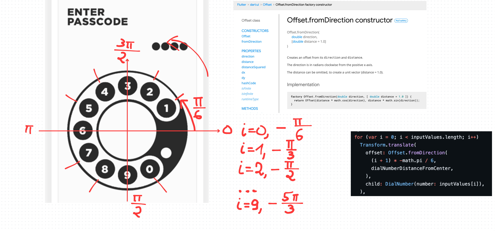

From the documentation, `Offset.fromDirection` creates an offset from its direction and distance. The distance value is straightforward, we use the `dialNumberDistanceFromCenter` value. It’s a bit more entertaining with the direction.

As we see, the direction is provided in radians clockwise. However, in our case, the dial numbers are positioned counter-clockwise, thus we use the minus sign in the direction calculations.

To position the dial numbers properly, we need to calculate the specific direction for each of them. Thus, we split each quadrant into three equal parts or `π/6` radians each - that’s where we get the multiplier in the formula.

Lastly, we calculate the direction for each `i` value in the loop. Here is the result:

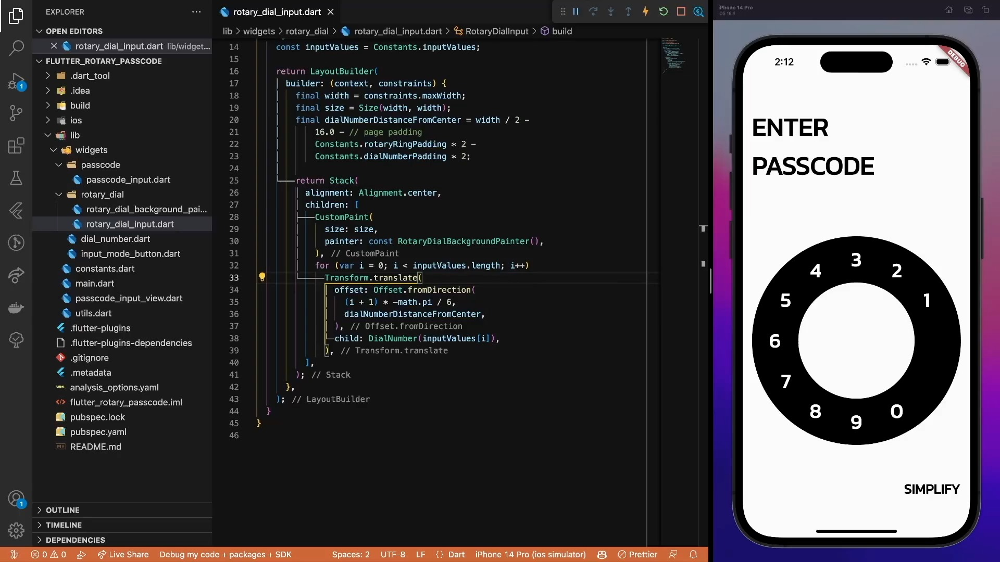

### Implementing rotary dial component

The last missing piece is the moving upper arc part of the rotary dial input. Again, use a `CustomPaint` widget and pass the same size value.

```dart title="rotary_dial_input.dart"
import 'dart:math' as math;

import 'package:flutter/widgets.dart';

import '../../constants.dart';
import '../dial_number.dart';
import 'rotary_dial_background_painter.dart';

class RotaryDialInput extends StatelessWidget {
  const RotaryDialInput({super.key});

  @override
  Widget build(BuildContext context) {
    const inputValues = Constants.inputValues;

    return LayoutBuilder(
      builder: (context, constraints) {
        final width = constraints.maxWidth;
        final size = Size(width, width);
        final dialNumberDistanceFromCenter = width / 2 -
            16.0 - // page padding
            Constants.rotaryRingPadding * 2 -
            Constants.dialNumberPadding * 2;

        return Stack(
          alignment: Alignment.center,
          children: [
            CustomPaint(
              size: size,
              painter: const RotaryDialBackgroundPainter(),
            ),
            for (var i = 0; i < inputValues.length; i++)
              Transform.translate(
                offset: Offset.fromDirection(
                  (i + 1) * -math.pi / 6,
                  dialNumberDistanceFromCenter,
                ),
                child: DialNumber(inputValues[i]),
              ),
            // highlight-start
            CustomPaint(
              size: size,
            ),
            // highlight-end
          ],
        );
      },
    );
  }
}
```

The base foreground painter is very similar to the background one, just pass the `numberRadiusFromCenter` that will be used to cut out the holes needed for dial numbers.

```dart title="rotary_dial_foreground_painter.dart"
import 'package:flutter/rendering.dart';

class RotaryDialForegroundPainter extends CustomPainter {
  const RotaryDialForegroundPainter({
    required this.numberRadiusFromCenter,
  });

  final double numberRadiusFromCenter;

  @override
  void paint(Canvas canvas, Size size) {}

  @override
  bool shouldRepaint(RotaryDialForegroundPainter oldDelegate) =>
      oldDelegate.numberRadiusFromCenter != numberRadiusFromCenter;
}
```

Don’t forget to pass an instance of the painter in the rotary dial input view.

```dart title="rotary_dial_input.dart"
import 'dart:math' as math;

import 'package:flutter/widgets.dart';

import '../../constants.dart';
import '../dial_number.dart';
import 'rotary_dial_background_painter.dart';
import 'rotary_dial_foreground_painter.dart';

class RotaryDialInput extends StatelessWidget {
  const RotaryDialInput({super.key});

  @override
  Widget build(BuildContext context) {
    const inputValues = Constants.inputValues;

    return LayoutBuilder(
      builder: (context, constraints) {
        final width = constraints.maxWidth;
        final size = Size(width, width);
        final dialNumberDistanceFromCenter = width / 2 -
            16.0 - // page padding
            Constants.rotaryRingPadding * 2 -
            Constants.dialNumberPadding * 2;

        return Stack(
          alignment: Alignment.center,
          children: [
            CustomPaint(
              size: size,
              painter: const RotaryDialBackgroundPainter(),
            ),
            for (var i = 0; i < inputValues.length; i++)
              Transform.translate(
                offset: Offset.fromDirection(
                  (i + 1) * -math.pi / 6,
                  dialNumberDistanceFromCenter,
                ),
                child: DialNumber(inputValues[i]),
              ),
            CustomPaint(
              size: size,
              // highlight-start
              painter: RotaryDialForegroundPainter(
                numberRadiusFromCenter: dialNumberDistanceFromCenter,
              ),
              // highlight-end
            ),
          ],
        );
      },
    );
  }
}
```

To make this painter work, define some more constants - yay. A helpful one is the position of the first dial number.

```dart title="constants.dart"
import 'dart:math' as math;

abstract class Constants {
  static const inputValues = [1, 2, 3, 4, 5, 6, 7, 8, 9, 0];

  static const rotaryRingPadding = 4.0;
  static const rotaryRingWidth = 80.0;

  static const dialNumberPadding = 8.0;
  static const dialNumberRadius =
      rotaryRingWidth / 2 - (rotaryRingPadding + dialNumberPadding);
  // highlight-next-line
  static const firstDialNumberPosition = math.pi / 3;
}
```

Then, calculate the maximum angle or the position of the last dial number and the sweep angle or the length of the arc. Oh, and to make it even more complex, these values are inverted a bit to fit the `canvas.drawArc` method. You see, usually, radians are calculated from the positive x-axis going counter-clockwise. But while using the `drawArc` method, positive angles are going clockwise around the oval. Improvise, adapt, overcome.

```dart title="constants.dart"
import 'dart:math' as math;

abstract class Constants {
  static const inputValues = [1, 2, 3, 4, 5, 6, 7, 8, 9, 0];

  static const rotaryRingPadding = 4.0;
  static const rotaryRingWidth = 80.0;

  static const dialNumberPadding = 8.0;
  static const dialNumberRadius =
      rotaryRingWidth / 2 - (rotaryRingPadding + dialNumberPadding);
  static const firstDialNumberPosition = math.pi / 3;

  // highlight-start
  static const maxRotaryRingAngle = math.pi * 7 / 4;
  static const maxRotaryRingSweepAngle = math.pi / 2 * 3;
  // highlight-end
}
```

Similarly, as with the background painter, create a painter object - just the width is a bit smaller this time.

```dart title="rotary_dial_foreground_painter.dart"
import 'package:flutter/rendering.dart';

import '../../constants.dart';

class RotaryDialForegroundPainter extends CustomPainter {
  const RotaryDialForegroundPainter({
    required this.numberRadiusFromCenter,
  });

  final double numberRadiusFromCenter;

  @override
  void paint(Canvas canvas, Size size) {
    // highlight-start
    const ringWidth = Constants.rotaryRingWidth;

    final paint = Paint()
      ..color = const Color.fromARGB(255, 255, 255, 255)
      ..strokeCap = StrokeCap.round
      ..strokeWidth = ringWidth - Constants.rotaryRingPadding * 2
      ..style = PaintingStyle.stroke;
    // highlight-end
  }

  @override
  bool shouldRepaint(RotaryDialForegroundPainter oldDelegate) =>
      oldDelegate.numberRadiusFromCenter != numberRadiusFromCenter;
}
```

Then, create the foreground arc by using the already calculated constants.

```dart title="rotary_dial_foreground_painter.dart"
import 'package:flutter/rendering.dart';

import '../../constants.dart';
import '../../utils.dart';

class RotaryDialForegroundPainter extends CustomPainter {
  const RotaryDialForegroundPainter({
    required this.numberRadiusFromCenter,
  });

  final double numberRadiusFromCenter;

  @override
  void paint(Canvas canvas, Size size) {
    const ringWidth = Constants.rotaryRingWidth;

    final paint = Paint()
      ..color = const Color.fromARGB(255, 255, 255, 255)
      ..strokeCap = StrokeCap.round
      ..strokeWidth = ringWidth - Constants.rotaryRingPadding * 2
      ..style = PaintingStyle.stroke;

    // highlight-start
    canvas.drawArc(
      Rect.fromCircle(
        center: size.centerOffset,
        radius: size.width / 2 - ringWidth / 2,
      ),
      Constants.firstDialNumberPosition,
      Constants.maxRotaryRingSweepAngle,
      false,
      paint,
    );
    // highlight-end
  }

  @override
  bool shouldRepaint(RotaryDialForegroundPainter oldDelegate) =>
      oldDelegate.numberRadiusFromCenter != numberRadiusFromCenter;
}
```

We need 10 cutouts for the dial numbers. So start from the calculated first dial number position and go around the arc clockwise this time. For each hole, draw a circle of the same radius as the dial number and apply the clear blend mode for it.

```dart title="rotary_dial_foreground_painter.dart"
import 'dart:math' as math;

import 'package:flutter/rendering.dart';

import '../../constants.dart';
import '../../utils.dart';

class RotaryDialForegroundPainter extends CustomPainter {
  const RotaryDialForegroundPainter({
    required this.numberRadiusFromCenter,
  });

  final double numberRadiusFromCenter;

  @override
  void paint(Canvas canvas, Size size) {
    const ringWidth = Constants.rotaryRingWidth;

    final paint = Paint()
      ..color = const Color.fromARGB(255, 255, 255, 255)
      ..strokeCap = StrokeCap.round
      ..strokeWidth = ringWidth - Constants.rotaryRingPadding * 2
      ..style = PaintingStyle.stroke;

    canvas.drawArc(
      Rect.fromCircle(
        center: size.centerOffset,
        radius: size.width / 2 - ringWidth / 2,
      ),
      Constants.firstDialNumberPosition,
      Constants.maxRotaryRingSweepAngle,
      false,
      paint,
    );

    // highlight-start
    for (int i = 0; i < 10; i++) {
      final offset = Offset.fromDirection(
        math.pi * (-30 - i * 30) / 180,
        numberRadiusFromCenter,
      );

      canvas.drawCircle(
        size.centerOffset + offset,
        Constants.dialNumberRadius,
        Paint()..blendMode = BlendMode.clear,
      );
    }
    // highlight-end
  }

  @override
  bool shouldRepaint(RotaryDialForegroundPainter oldDelegate) =>
      oldDelegate.numberRadiusFromCenter != numberRadiusFromCenter;
}
```

At the moment, dial numbers are not visible. It’s because we are using blend modes, and when you hear anything about blend modes, well, it’s more or less black magic. Here is the proof:

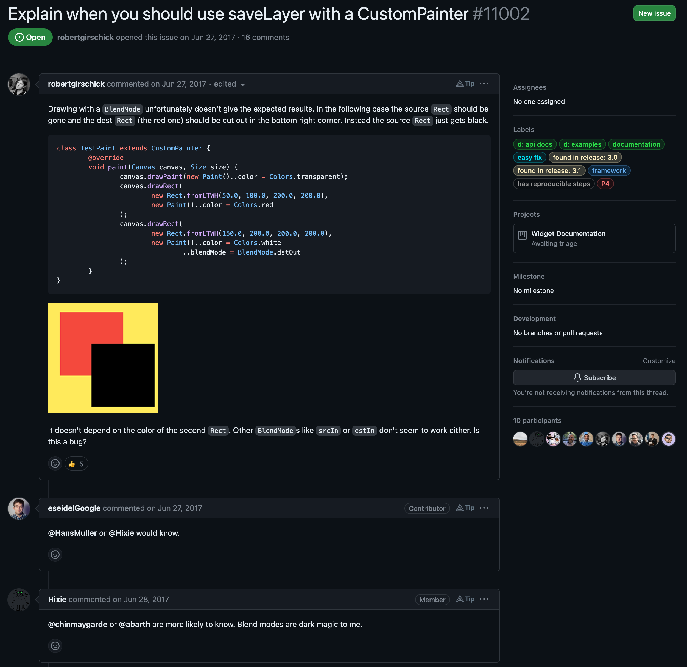

However, the thing that I know for sure is that you need to use the `saveLayer` method to draw everything as a single group and not as individual pieces. This is exactly what we need - we do not want to draw holes on top of the arc but rather cut them out as a single piece.

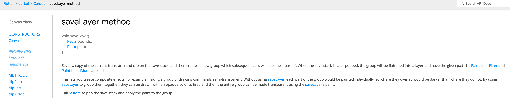

For this, save the layer before drawing an arc so that all the subsequent canvas calls will be appended to the same group.

```dart title="rotary_dial_foreground_painter.dart"
import 'dart:math' as math;

import 'package:flutter/rendering.dart';

import '../../constants.dart';
import '../../utils.dart';

class RotaryDialForegroundPainter extends CustomPainter {
  const RotaryDialForegroundPainter({
    required this.numberRadiusFromCenter,
  });

  final double numberRadiusFromCenter;

  @override
  void paint(Canvas canvas, Size size) {
    const ringWidth = Constants.rotaryRingWidth;

    final paint = Paint()
      ..color = const Color.fromARGB(255, 255, 255, 255)
      ..strokeCap = StrokeCap.round
      ..strokeWidth = ringWidth - Constants.rotaryRingPadding * 2
      ..style = PaintingStyle.stroke;

    canvas
      // highlight-next-line
      ..saveLayer(Rect.largest, paint)
      ..drawArc(
        Rect.fromCircle(
          center: size.centerOffset,
          radius: size.width / 2 - ringWidth / 2,
        ),
        Constants.firstDialNumberPosition,
        Constants.maxRotaryRingSweepAngle,
        false,
        paint,
      );

    for (int i = 0; i < 10; i++) {
      final offset = Offset.fromDirection(
        math.pi * (-30 - i * 30) / 180,
        numberRadiusFromCenter,
      );

      canvas.drawCircle(
        size.centerOffset + offset,
        Constants.dialNumberRadius,
        Paint()..blendMode = BlendMode.clear,
      );
    }
  }

  @override
  bool shouldRepaint(RotaryDialForegroundPainter oldDelegate) =>
      oldDelegate.numberRadiusFromCenter != numberRadiusFromCenter;
}
```

Then, call the `canvas.restore()` method at the end to pop the whole layer from the stack.

```dart title="rotary_dial_foreground_painter.dart"
import 'dart:math' as math;

import 'package:flutter/rendering.dart';

import '../../constants.dart';
import '../../utils.dart';

class RotaryDialForegroundPainter extends CustomPainter {
  const RotaryDialForegroundPainter({
    required this.numberRadiusFromCenter,
  });

  final double numberRadiusFromCenter;

  @override
  void paint(Canvas canvas, Size size) {
    const ringWidth = Constants.rotaryRingWidth;

    final paint = Paint()
      ..color = const Color.fromARGB(255, 255, 255, 255)
      ..strokeCap = StrokeCap.round
      ..strokeWidth = ringWidth - Constants.rotaryRingPadding * 2
      ..style = PaintingStyle.stroke;

    canvas
      ..saveLayer(Rect.largest, paint)
      ..drawArc(
        Rect.fromCircle(
          center: size.centerOffset,
          radius: size.width / 2 - ringWidth / 2,
        ),
        Constants.firstDialNumberPosition,
        Constants.maxRotaryRingSweepAngle,
        false,
        paint,
      );

    for (int i = 0; i < 10; i++) {
      final offset = Offset.fromDirection(
        math.pi * (-30 - i * 30) / 180,
        numberRadiusFromCenter,
      );

      canvas.drawCircle(
        size.centerOffset + offset,
        Constants.dialNumberRadius,
        Paint()..blendMode = BlendMode.clear,
      );
    }

    // highlight-next-line
    canvas.restore();
  }

  @override
  bool shouldRepaint(RotaryDialForegroundPainter oldDelegate) =>
      oldDelegate.numberRadiusFromCenter != numberRadiusFromCenter;
}
```

Finally, draw a little white circle which will be used as a dial stop.

```dart title="rotary_dial_foreground_painter.dart"
import 'dart:math' as math;

import 'package:flutter/rendering.dart';

import '../../constants.dart';
import '../../utils.dart';

class RotaryDialForegroundPainter extends CustomPainter {
  const RotaryDialForegroundPainter({
    required this.numberRadiusFromCenter,
  });

  final double numberRadiusFromCenter;

  @override
  void paint(Canvas canvas, Size size) {
    const ringWidth = Constants.rotaryRingWidth;

    final paint = Paint()
      ..color = const Color.fromARGB(255, 255, 255, 255)
      ..strokeCap = StrokeCap.round
      ..strokeWidth = ringWidth - Constants.rotaryRingPadding * 2
      ..style = PaintingStyle.stroke;

    canvas
      ..saveLayer(Rect.largest, paint)
      ..drawArc(
        Rect.fromCircle(
          center: size.centerOffset,
          radius: size.width / 2 - ringWidth / 2,
        ),
        Constants.firstDialNumberPosition,
        Constants.maxRotaryRingSweepAngle,
        false,
        paint,
      );

    for (int i = 0; i < 10; i++) {
      final offset = Offset.fromDirection(
        math.pi * (-30 - i * 30) / 180,
        numberRadiusFromCenter,
      );

      canvas.drawCircle(
        size.centerOffset + offset,
        Constants.dialNumberRadius,
        Paint()..blendMode = BlendMode.clear,
      );
    }

    // highlight-start
    canvas.drawCircle(
      size.centerOffset +
          Offset.fromDirection(math.pi / 6, numberRadiusFromCenter),
      ringWidth / 6,
      Paint()..color = const Color.fromRGBO(255, 255, 255, 1.0),
    );
    // highlight-end

    canvas.restore();
  }

  @override
  bool shouldRepaint(RotaryDialForegroundPainter oldDelegate) =>
      oldDelegate.numberRadiusFromCenter != numberRadiusFromCenter;
}
```

That’s it - both of the input views are finished. The good news is that it was the most complex part of the static UI.

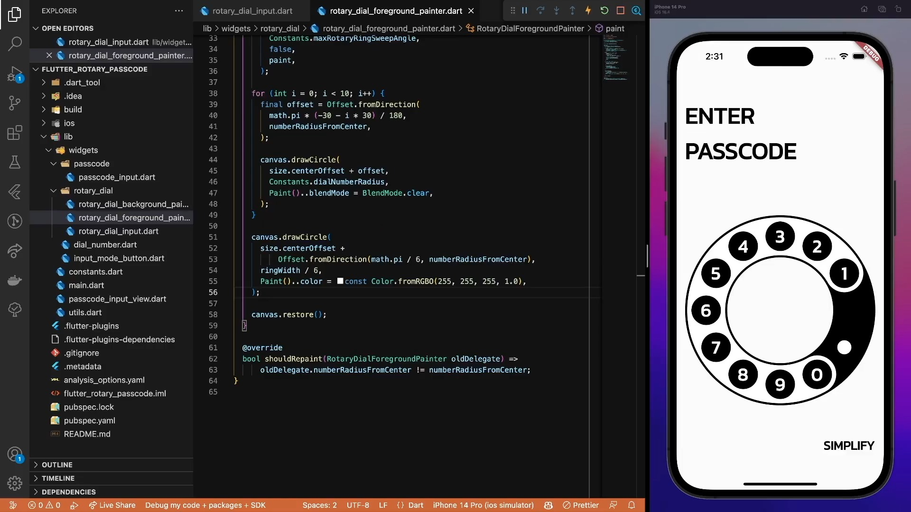

The only missing piece of the design is the passcode digits indicator.

## Passcode digits indicator

In both modes, the same passcode digits component is used, just its alignment is a bit different. And sizing. And maybe spacing. However, trust me, it IS truly the same component. I can prove it to you 🫡

Start with an ugly rectangle as a placeholder.

```dart title="passcode_input_view.dart"
import 'package:flutter/material.dart';

import 'widgets/input_mode_button.dart';
import 'widgets/passcode/passcode_input.dart';
import 'widgets/rotary_dial/rotary_dial_input.dart';

const _padding = 16.0;

class PasscodeInputView extends StatefulWidget {
  const PasscodeInputView({
    required this.expectedCode,
    super.key,
  });

  final String expectedCode;

  @override
  State<PasscodeInputView> createState() => _PasscodeInputViewState();
}

class _PasscodeInputViewState extends State<PasscodeInputView> {
  var _simpleInputMode = false;

  void _onModeChanged() => setState(() => _simpleInputMode = !_simpleInputMode);

  @override
  Widget build(BuildContext context) {
    return Scaffold(
      body: SafeArea(
        child: Padding(
          padding: const EdgeInsets.fromLTRB(
            _padding,
            _padding * 3,
            _padding,
            _padding * 2,
          ),
          child: Column(
            crossAxisAlignment: CrossAxisAlignment.stretch,
            children: [
              Text(
                'Enter\npasscode'.toUpperCase(),
                style: Theme.of(context).textTheme.displaySmall?.copyWith(
                      color: Colors.black,
                      fontWeight: FontWeight.bold,
                    ),
              ),
              const SizedBox(height: 32.0),
              // highlight-start
              Align(
                alignment:
                    _simpleInputMode ? Alignment.center : Alignment.centerRight,
                child: Container(height: 36.0, color: Colors.black),
              ),
              const SizedBox(height: 16.0),
              // highlight-end
              Expanded(
                child: _simpleInputMode
                    ? const PasscodeInput()
                    : const RotaryDialInput(),
              ),
              Align(
                alignment: Alignment.centerRight,
                child: InputModeButton(
                  simpleInputMode: _simpleInputMode,
                  onModeChanged: _onModeChanged,
                ),
              ),
            ],
          ),
        ),
      ),
    );
  }
}
```

Then, create a base widget that requires two properties - the passcode digit values or the current user input and the input mode flag.

```dart title="passcode_digits.dart"
import 'package:flutter/material.dart';

class PasscodeDigits extends StatelessWidget {
  const PasscodeDigits({
    required this.passcodeDigitValues,
    required this.simpleInputMode,
    super.key,
  });

  final List<dynamic> passcodeDigitValues;
  final bool simpleInputMode;

  @override
  Widget build(BuildContext context) {
    return Container(height: 36.0, color: Colors.black);
  }
}
```

The passcode digit indicators will have different background and font colors based on the current state of the animation. Thus, create a dedicated model to track the state and use it instead of the dynamic type for the passcode digit values list.

```dart title="passcode_digits.dart"
import 'package:flutter/material.dart';

// highlight-start
class PasscodeDigit {
  const PasscodeDigit({
    required this.backgroundColor,
    required this.fontColor,
    this.value,
  });

  final Color backgroundColor;
  final Color fontColor;
  final int? value;
}
// highlight-end

class PasscodeDigits extends StatelessWidget {
  const PasscodeDigits({
    required this.passcodeDigitValues,
    required this.simpleInputMode,
    super.key,
  });

  // highlight-next-line
  final List<PasscodeDigit> passcodeDigitValues;
  final bool simpleInputMode;

  @override
  Widget build(BuildContext context) {
    return Container(height: 36.0, color: Colors.black);
  }
}
```

In the main view, store a list of the current input values.

```dart title="passcode_input_view.dart"
import 'package:flutter/material.dart';

import 'widgets/input_mode_button.dart';
import 'widgets/passcode/passcode_digits.dart';
import 'widgets/passcode/passcode_input.dart';
import 'widgets/rotary_dial/rotary_dial_input.dart';

const _padding = 16.0;

class PasscodeInputView extends StatefulWidget {
  const PasscodeInputView({
    required this.expectedCode,
    super.key,
  });

  final String expectedCode;

  @override
  State<PasscodeInputView> createState() => _PasscodeInputViewState();
}

class _PasscodeInputViewState extends State<PasscodeInputView> {
  // highlight-next-line
  late final List<PasscodeDigit> _passcodeDigitValues;

  var _simpleInputMode = false;

  void _onModeChanged() => setState(() => _simpleInputMode = !_simpleInputMode);

  @override
  Widget build(BuildContext context) {
    return Scaffold(
      body: SafeArea(
        child: Padding(
          padding: const EdgeInsets.fromLTRB(
            _padding,
            _padding * 3,
            _padding,
            _padding * 2,
          ),
          child: Column(
            crossAxisAlignment: CrossAxisAlignment.stretch,
            children: [
              Text(
                'Enter\npasscode'.toUpperCase(),
                style: Theme.of(context).textTheme.displaySmall?.copyWith(
                      color: Colors.black,
                      fontWeight: FontWeight.bold,
                    ),
              ),
              const SizedBox(height: 32.0),
              Align(
                alignment:
                    _simpleInputMode ? Alignment.center : Alignment.centerRight,
                child: Container(height: 36.0, color: Colors.black),
              ),
              const SizedBox(height: 16.0),
              Expanded(
                child: _simpleInputMode
                    ? const PasscodeInput()
                    : const RotaryDialInput(),
              ),
              Align(
                alignment: Alignment.centerRight,
                child: InputModeButton(
                  simpleInputMode: _simpleInputMode,
                  onModeChanged: _onModeChanged,
                ),
              ),
            ],
          ),
        ),
      ),
    );
  }
}
```

In the `initiState` method, set the initial values and the corresponding properties for them.

```dart title="passcode_input_view.dart"
import 'package:flutter/material.dart';

import 'widgets/input_mode_button.dart';
import 'widgets/passcode/passcode_digits.dart';
import 'widgets/passcode/passcode_input.dart';
import 'widgets/rotary_dial/rotary_dial_input.dart';

const _padding = 16.0;

class PasscodeInputView extends StatefulWidget {
  const PasscodeInputView({
    required this.expectedCode,
    super.key,
  });

  final String expectedCode;

  @override
  State<PasscodeInputView> createState() => _PasscodeInputViewState();
}

class _PasscodeInputViewState extends State<PasscodeInputView> {
  late final List<PasscodeDigit> _passcodeDigitValues;

  var _simpleInputMode = false;

  // highlight-start
  @override
  void initState() {
    super.initState();

    _passcodeDigitValues = List.generate(
      widget.expectedCode.length,
      (index) => const PasscodeDigit(
        backgroundColor: Colors.white,
        fontColor: Colors.white,
      ),
      growable: false,
    );
  }
  // highlight-end

  void _onModeChanged() => setState(() => _simpleInputMode = !_simpleInputMode);

  @override
  Widget build(BuildContext context) {
    return Scaffold(
      body: SafeArea(
        child: Padding(
          padding: const EdgeInsets.fromLTRB(
            _padding,
            _padding * 3,
            _padding,
            _padding * 2,
          ),
          child: Column(
            crossAxisAlignment: CrossAxisAlignment.stretch,
            children: [
              Text(
                'Enter\npasscode'.toUpperCase(),
                style: Theme.of(context).textTheme.displaySmall?.copyWith(
                      color: Colors.black,
                      fontWeight: FontWeight.bold,
                    ),
              ),
              const SizedBox(height: 32.0),
              Align(
                alignment:
                    _simpleInputMode ? Alignment.center : Alignment.centerRight,
                child: Container(height: 36.0, color: Colors.black),
              ),
              const SizedBox(height: 16.0),
              Expanded(
                child: _simpleInputMode
                    ? const PasscodeInput()
                    : const RotaryDialInput(),
              ),
              Align(
                alignment: Alignment.centerRight,
                child: InputModeButton(
                  simpleInputMode: _simpleInputMode,
                  onModeChanged: _onModeChanged,
                ),
              ),
            ],
          ),
        ),
      ),
    );
  }
}
```

Then, replace the placeholder `Container` with the actual `PasscodeDigits` widget.

```dart title="passcode_input_view.dart"
import 'package:flutter/material.dart';

import 'widgets/input_mode_button.dart';
import 'widgets/passcode/passcode_digits.dart';
import 'widgets/passcode/passcode_input.dart';
import 'widgets/rotary_dial/rotary_dial_input.dart';

const _padding = 16.0;

class PasscodeInputView extends StatefulWidget {
  const PasscodeInputView({
    required this.expectedCode,
    super.key,
  });

  final String expectedCode;

  @override
  State<PasscodeInputView> createState() => _PasscodeInputViewState();
}

class _PasscodeInputViewState extends State<PasscodeInputView> {
  late final List<PasscodeDigit> _passcodeDigitValues;

  var _simpleInputMode = false;

  @override
  void initState() {
    super.initState();

    _passcodeDigitValues = List.generate(
      widget.expectedCode.length,
      (index) => const PasscodeDigit(
        backgroundColor: Colors.white,
        fontColor: Colors.white,
      ),
      growable: false,
    );
  }

  void _onModeChanged() => setState(() => _simpleInputMode = !_simpleInputMode);

  @override
  Widget build(BuildContext context) {
    return Scaffold(
      body: SafeArea(
        child: Padding(
          padding: const EdgeInsets.fromLTRB(
            _padding,
            _padding * 3,
            _padding,
            _padding * 2,
          ),
          child: Column(
            crossAxisAlignment: CrossAxisAlignment.stretch,
            children: [
              Text(
                'Enter\npasscode'.toUpperCase(),
                style: Theme.of(context).textTheme.displaySmall?.copyWith(
                      color: Colors.black,
                      fontWeight: FontWeight.bold,
                    ),
              ),
              const SizedBox(height: 32.0),
              Align(
                alignment:
                    _simpleInputMode ? Alignment.center : Alignment.centerRight,
                // highlight-start
                child: PasscodeDigits(
                  passcodeDigitValues: _passcodeDigitValues,
                  simpleInputMode: _simpleInputMode,
                ),
                // highlight-end
              ),
              const SizedBox(height: 16.0),
              Expanded(
                child: _simpleInputMode
                    ? const PasscodeInput()
                    : const RotaryDialInput(),
              ),
              Align(
                alignment: Alignment.centerRight,
                child: InputModeButton(
                  simpleInputMode: _simpleInputMode,
                  onModeChanged: _onModeChanged,
                ),
              ),
            ],
          ),
        ),
      ),
    );
  }
}
```

One more side quest. A useful util to have in any app is an `addBetween` method that inserts a specific separator widget between each element in the list. This will be used later for the UI.

```dart title="utils.dart"
import 'dart:ui';

extension SizeX on Size {
  Offset get centerOffset => Offset(width / 2, height / 2);
}

extension ListExtension<T> on List<T> {
  List<T> addBetween(T separator) {
    if (length <= 1) {
      return toList();
    }

    final newItems = <T>[];

    for (int i = 0; i < length - 1; i++) {
      newItems.add(this[i]);
      newItems.add(separator);
    }
    newItems.add(this[length - 1]);

    return newItems;
  }
}
```

Before implementing the actual component, define some constants since the widget sizing is a bit different based on the selected input mode.

```dart title="passcode_digits.dart"
import 'package:flutter/material.dart';

// highlight-start
const _passcodeDigitPadding = 8.0;
const _passcodeDigitSizeBig = 36.0;
const _passcodeDigitSizeSmall = 24.0;
const _passcodeDigitGapBig = 16.0;
const _passcodeDigitGapSmall = 4.0;
// highlight-end

class PasscodeDigit {
  const PasscodeDigit({
    required this.backgroundColor,
    required this.fontColor,
    this.value,
  });

  final Color backgroundColor;
  final Color fontColor;
  final int? value;
}

class PasscodeDigits extends StatelessWidget {
  const PasscodeDigits({
    required this.passcodeDigitValues,
    required this.simpleInputMode,
    super.key,
  });

  final List<PasscodeDigit> passcodeDigitValues;
  final bool simpleInputMode;

  @override
  Widget build(BuildContext context) {
    return Container(height: 36.0, color: Colors.black);
  }
}
```

First, set the default height of the widget.

```dart title="passcode_digits.dart"
import 'package:flutter/material.dart';

const _passcodeDigitPadding = 8.0;
const _passcodeDigitSizeBig = 36.0;
const _passcodeDigitSizeSmall = 24.0;
const _passcodeDigitGapBig = 16.0;
const _passcodeDigitGapSmall = 4.0;

class PasscodeDigit {
  const PasscodeDigit({
    required this.backgroundColor,
    required this.fontColor,
    this.value,
  });

  final Color backgroundColor;
  final Color fontColor;
  final int? value;
}

class PasscodeDigits extends StatelessWidget {
  const PasscodeDigits({
    required this.passcodeDigitValues,
    required this.simpleInputMode,
    super.key,
  });

  final List<PasscodeDigit> passcodeDigitValues;
  final bool simpleInputMode;

  @override
  Widget build(BuildContext context) {
    // highlight-start
    return const SizedBox(
      height: _passcodeDigitSizeBig,
    );
    // highlight-end
  }
}
```

Then, add an empty `Row` to position the elements properly.

```dart title="passcode_digits.dart"
import 'package:flutter/material.dart';

const _passcodeDigitPadding = 8.0;
const _passcodeDigitSizeBig = 36.0;
const _passcodeDigitSizeSmall = 24.0;
const _passcodeDigitGapBig = 16.0;
const _passcodeDigitGapSmall = 4.0;

class PasscodeDigit {
  const PasscodeDigit({
    required this.backgroundColor,
    required this.fontColor,
    this.value,
  });

  final Color backgroundColor;
  final Color fontColor;
  final int? value;
}

class PasscodeDigits extends StatelessWidget {
  const PasscodeDigits({
    required this.passcodeDigitValues,
    required this.simpleInputMode,
    super.key,
  });

  final List<PasscodeDigit> passcodeDigitValues;
  final bool simpleInputMode;

  @override
  Widget build(BuildContext context) {
    return SizedBox(
      height: _passcodeDigitSizeBig,
      // highlight-start
      child: Row(
        mainAxisSize: MainAxisSize.min,
        children: const [],
      ),
      // highlight-end
    );
  }
}
```

For each digit in the row, create a placeholder container…

```dart title="passcode_digits.dart"
import 'package:flutter/material.dart';

const _passcodeDigitPadding = 8.0;
const _passcodeDigitSizeBig = 36.0;
const _passcodeDigitSizeSmall = 24.0;
const _passcodeDigitGapBig = 16.0;
const _passcodeDigitGapSmall = 4.0;

class PasscodeDigit {
  const PasscodeDigit({
    required this.backgroundColor,
    required this.fontColor,
    this.value,
  });

  final Color backgroundColor;
  final Color fontColor;
  final int? value;
}

class PasscodeDigits extends StatelessWidget {
  const PasscodeDigits({
    required this.passcodeDigitValues,
    required this.simpleInputMode,
    super.key,
  });

  final List<PasscodeDigit> passcodeDigitValues;
  final bool simpleInputMode;

  @override
  Widget build(BuildContext context) {
    return SizedBox(
      height: _passcodeDigitSizeBig,
      child: Row(
        mainAxisSize: MainAxisSize.min,
        children: [
          // highlight-start
          for (var i = 0; i < passcodeDigitValues.length; i++)
            Container(
              height: _passcodeDigitSizeBig,
              width: _passcodeDigitSizeBig,
              color: Colors.black,
            )
          // highlight-end
        ],
      ),
    );
  }
}
```

… and add some spacing between the elements based on the selected input mode.

```dart title="passcode_digits.dart"
import 'package:flutter/material.dart';

import '../../utils.dart';

const _passcodeDigitPadding = 8.0;
const _passcodeDigitSizeBig = 36.0;
const _passcodeDigitSizeSmall = 24.0;
const _passcodeDigitGapBig = 16.0;
const _passcodeDigitGapSmall = 4.0;

class PasscodeDigit {
  const PasscodeDigit({
    required this.backgroundColor,
    required this.fontColor,
    this.value,
  });

  final Color backgroundColor;
  final Color fontColor;
  final int? value;
}

class PasscodeDigits extends StatelessWidget {
  const PasscodeDigits({
    required this.passcodeDigitValues,
    required this.simpleInputMode,
    super.key,
  });

  final List<PasscodeDigit> passcodeDigitValues;
  final bool simpleInputMode;

  @override
  Widget build(BuildContext context) {
    return SizedBox(
      height: _passcodeDigitSizeBig,
      child: Row(
        mainAxisSize: MainAxisSize.min,
        children: <Widget>[
          for (var i = 0; i < passcodeDigitValues.length; i++)
            Container(
              height: _passcodeDigitSizeBig,
              width: _passcodeDigitSizeBig,
              color: Colors.black,
            )
        // highlight-start
        ].addBetween(
          SizedBox(
            width:
                simpleInputMode ? _passcodeDigitGapBig : _passcodeDigitGapSmall,
          ),
        ),
        // highlight-end
      ),
    );
  }
}
```

Then, define a passcode digit container - a single element visible in the view representing user’s input.

```dart title="passcode_digits.dart"
import 'package:flutter/material.dart';

import '../../utils.dart';

const _passcodeDigitPadding = 8.0;
const _passcodeDigitSizeBig = 36.0;
const _passcodeDigitSizeSmall = 24.0;
const _passcodeDigitGapBig = 16.0;
const _passcodeDigitGapSmall = 4.0;

class PasscodeDigit {
  const PasscodeDigit({
    required this.backgroundColor,
    required this.fontColor,
    this.value,
  });

  final Color backgroundColor;
  final Color fontColor;
  final int? value;
}

class PasscodeDigits extends StatelessWidget {
  const PasscodeDigits({
    required this.passcodeDigitValues,
    required this.simpleInputMode,
    super.key,
  });

  final List<PasscodeDigit> passcodeDigitValues;
  final bool simpleInputMode;

  @override
  Widget build(BuildContext context) {
    return SizedBox(
      height: _passcodeDigitSizeBig,
      child: Row(
        mainAxisSize: MainAxisSize.min,
        children: <Widget>[
          for (var i = 0; i < passcodeDigitValues.length; i++)
            Container(
              height: _passcodeDigitSizeBig,
              width: _passcodeDigitSizeBig,
              color: Colors.black,
            )
        ].addBetween(
          SizedBox(
            width:
                simpleInputMode ? _passcodeDigitGapBig : _passcodeDigitGapSmall,
          ),
        ),
      ),
    );
  }
}

// highlight-start
class _PasscodeDigitContainer extends StatelessWidget {
  const _PasscodeDigitContainer({
    required this.backgroundColor,
    required this.fontColor,
    required this.digit,
    required this.size,
  });

  final Color backgroundColor;
  final Color fontColor;
  final int? digit;
  final double size;

  @override
  Widget build(BuildContext context) {
    return Container(
      height: _passcodeDigitSizeBig,
      width: _passcodeDigitSizeBig,
      color: Colors.black,
    );
  }
}
// highlight-end
```

Again, use it instead of the placeholder container.

```dart title="passcode_digits.dart"
import 'package:flutter/material.dart';

import '../../utils.dart';

const _passcodeDigitPadding = 8.0;
const _passcodeDigitSizeBig = 36.0;
const _passcodeDigitSizeSmall = 24.0;
const _passcodeDigitGapBig = 16.0;
const _passcodeDigitGapSmall = 4.0;

class PasscodeDigit {
  const PasscodeDigit({
    required this.backgroundColor,
    required this.fontColor,
    this.value,
  });

  final Color backgroundColor;
  final Color fontColor;
  final int? value;
}

class PasscodeDigits extends StatelessWidget {
  const PasscodeDigits({
    required this.passcodeDigitValues,
    required this.simpleInputMode,
    super.key,
  });

  final List<PasscodeDigit> passcodeDigitValues;
  final bool simpleInputMode;

  @override
  Widget build(BuildContext context) {
    return SizedBox(
      height: _passcodeDigitSizeBig,
      child: Row(
        mainAxisSize: MainAxisSize.min,
        children: <Widget>[
          for (var i = 0; i < passcodeDigitValues.length; i++)
            // highlight-start
            _PasscodeDigitContainer(
              backgroundColor: passcodeDigitValues[i].backgroundColor,
              fontColor: passcodeDigitValues[i].fontColor,
              digit: passcodeDigitValues[i].value,
              size: simpleInputMode
                  ? _passcodeDigitSizeBig
                  : _passcodeDigitSizeSmall,
            ),
            // highlight-end
        ].addBetween(
          SizedBox(
            width:
                simpleInputMode ? _passcodeDigitGapBig : _passcodeDigitGapSmall,
          ),
        ),
      ),
    );
  }
}

class _PasscodeDigitContainer extends StatelessWidget {
  const _PasscodeDigitContainer({
    required this.backgroundColor,
    required this.fontColor,
    required this.digit,
    required this.size,
  });

  final Color backgroundColor;
  final Color fontColor;
  final int? digit;
  final double size;

  @override
  Widget build(BuildContext context) {
    return Container(
      height: _passcodeDigitSizeBig,
      width: _passcodeDigitSizeBig,
      color: Colors.black,
    );
  }
}
```

For the container, set alignment and shape values.

```dart title="passcode_digits.dart"
import 'package:flutter/material.dart';

import '../../utils.dart';

const _passcodeDigitPadding = 8.0;
const _passcodeDigitSizeBig = 36.0;
const _passcodeDigitSizeSmall = 24.0;
const _passcodeDigitGapBig = 16.0;
const _passcodeDigitGapSmall = 4.0;

class PasscodeDigit {
  const PasscodeDigit({
    required this.backgroundColor,
    required this.fontColor,
    this.value,
  });

  final Color backgroundColor;
  final Color fontColor;
  final int? value;
}

class PasscodeDigits extends StatelessWidget {
  const PasscodeDigits({
    required this.passcodeDigitValues,
    required this.simpleInputMode,
    super.key,
  });

  final List<PasscodeDigit> passcodeDigitValues;
  final bool simpleInputMode;

  @override
  Widget build(BuildContext context) {
    return SizedBox(
      height: _passcodeDigitSizeBig,
      child: Row(
        mainAxisSize: MainAxisSize.min,
        children: <Widget>[
          for (var i = 0; i < passcodeDigitValues.length; i++)
            _PasscodeDigitContainer(
              backgroundColor: passcodeDigitValues[i].backgroundColor,
              fontColor: passcodeDigitValues[i].fontColor,
              digit: passcodeDigitValues[i].value,
              size: simpleInputMode
                  ? _passcodeDigitSizeBig
                  : _passcodeDigitSizeSmall,
            ),
        ].addBetween(
          SizedBox(
            width:
                simpleInputMode ? _passcodeDigitGapBig : _passcodeDigitGapSmall,
          ),
        ),
      ),
    );
  }
}

class _PasscodeDigitContainer extends StatelessWidget {
  const _PasscodeDigitContainer({
    required this.backgroundColor,
    required this.fontColor,
    required this.digit,
    required this.size,
  });

  final Color backgroundColor;
  final Color fontColor;
  final int? digit;
  final double size;

  @override
  Widget build(BuildContext context) {
    return Container(
      height: size,
      width: size,
      // highlight-start
      alignment: Alignment.center,
      decoration: const BoxDecoration(
        color: Colors.black,
        shape: BoxShape.circle,
      ),
      // highlight-end
    );
  }
}
```

To make the testing part easier, replace the default initialisation code of empty values with the ones covering all the possible passcode digit cases.

```dart title="passcode_input_view.dart"
import 'package:flutter/material.dart';

import 'widgets/input_mode_button.dart';
import 'widgets/passcode/passcode_digits.dart';
import 'widgets/passcode/passcode_input.dart';
import 'widgets/rotary_dial/rotary_dial_input.dart';

const _padding = 16.0;

class PasscodeInputView extends StatefulWidget {
  const PasscodeInputView({
    required this.expectedCode,
    super.key,
  });

  final String expectedCode;

  @override
  State<PasscodeInputView> createState() => _PasscodeInputViewState();
}

class _PasscodeInputViewState extends State<PasscodeInputView> {
  late final List<PasscodeDigit> _passcodeDigitValues;

  var _simpleInputMode = false;

  @override
  void initState() {
    super.initState();

    // highlight-start
    // _passcodeDigitValues = List.generate(
    //   widget.expectedCode.length,
    //   (index) => const PasscodeDigit(
    //     backgroundColor: Colors.white,
    //     fontColor: Colors.white,
    //   ),
    //   growable: false,
    // );
    _passcodeDigitValues = const [
      PasscodeDigit(
        backgroundColor: Colors.white,
        fontColor: Colors.white,
        value: 1,
      ),
      PasscodeDigit(
        backgroundColor: Colors.green,
        fontColor: Colors.white,
        value: 2,
      ),
      PasscodeDigit(
        backgroundColor: Colors.red,
        fontColor: Colors.white,
        value: 3,
      ),
      PasscodeDigit(
        backgroundColor: Colors.white,
        fontColor: Colors.white,
      ),
    ];
    // highlight-end
  }

  void _onModeChanged() => setState(() => _simpleInputMode = !_simpleInputMode);

  @override
  Widget build(BuildContext context) {
    return Scaffold(
      body: SafeArea(
        child: Padding(
          padding: const EdgeInsets.fromLTRB(
            _padding,
            _padding * 3,
            _padding,
            _padding * 2,
          ),
          child: Column(
            crossAxisAlignment: CrossAxisAlignment.stretch,
            children: [
              Text(
                'Enter\npasscode'.toUpperCase(),
                style: Theme.of(context).textTheme.displaySmall?.copyWith(
                      color: Colors.black,
                      fontWeight: FontWeight.bold,
                    ),
              ),
              const SizedBox(height: 32.0),
              Align(
                alignment:
                    _simpleInputMode ? Alignment.center : Alignment.centerRight,
                child: PasscodeDigits(
                  passcodeDigitValues: _passcodeDigitValues,
                  simpleInputMode: _simpleInputMode,
                ),
              ),
              const SizedBox(height: 16.0),
              Expanded(
                child: _simpleInputMode
                    ? const PasscodeInput()
                    : const RotaryDialInput(),
              ),
              Align(
                alignment: Alignment.centerRight,
                child: InputModeButton(
                  simpleInputMode: _simpleInputMode,
                  onModeChanged: _onModeChanged,
                ),
              ),
            ],
          ),
        ),
      ),
    );
  }
}
```

For the inner container, calculate the correct sizing first.

```dart title="passcode_digits.dart"
import 'package:flutter/material.dart';

import '../../utils.dart';

const _passcodeDigitPadding = 8.0;
const _passcodeDigitSizeBig = 36.0;
const _passcodeDigitSizeSmall = 24.0;
const _passcodeDigitGapBig = 16.0;
const _passcodeDigitGapSmall = 4.0;

class PasscodeDigit {
  const PasscodeDigit({
    required this.backgroundColor,
    required this.fontColor,
    this.value,
  });

  final Color backgroundColor;
  final Color fontColor;
  final int? value;
}

class PasscodeDigits extends StatelessWidget {
  const PasscodeDigits({
    required this.passcodeDigitValues,
    required this.simpleInputMode,
    super.key,
  });

  final List<PasscodeDigit> passcodeDigitValues;
  final bool simpleInputMode;

  @override
  Widget build(BuildContext context) {
    return SizedBox(
      height: _passcodeDigitSizeBig,
      child: Row(
        mainAxisSize: MainAxisSize.min,
        children: <Widget>[
          for (var i = 0; i < passcodeDigitValues.length; i++)
            _PasscodeDigitContainer(
              backgroundColor: passcodeDigitValues[i].backgroundColor,
              fontColor: passcodeDigitValues[i].fontColor,
              digit: passcodeDigitValues[i].value,
              size: simpleInputMode
                  ? _passcodeDigitSizeBig
                  : _passcodeDigitSizeSmall,
            ),
        ].addBetween(
          SizedBox(
            width:
                simpleInputMode ? _passcodeDigitGapBig : _passcodeDigitGapSmall,
          ),
        ),
      ),
    );
  }
}

class _PasscodeDigitContainer extends StatelessWidget {
  const _PasscodeDigitContainer({
    required this.backgroundColor,
    required this.fontColor,
    required this.digit,
    required this.size,
  });

  final Color backgroundColor;
  final Color fontColor;
  final int? digit;
  final double size;

  @override
  Widget build(BuildContext context) {
    // highlight-start
    final digitContainerSize = size - _passcodeDigitPadding;
    final containerSize = digit != null ? digitContainerSize : 0.0;
    // highlight-end

    return Container(
      height: size,
      width: size,
      alignment: Alignment.center,
      decoration: const BoxDecoration(
        color: Colors.black,
        shape: BoxShape.circle,
      ),
    );
  }
}
```

Then, do some _containerception_ by adding a digit container inside the wrapper (or the background) one. This will indicate the current status of an input value.

```dart title="passcode_digits.dart"
import 'package:flutter/material.dart';

import '../../utils.dart';

const _passcodeDigitPadding = 8.0;
const _passcodeDigitSizeBig = 36.0;
const _passcodeDigitSizeSmall = 24.0;
const _passcodeDigitGapBig = 16.0;
const _passcodeDigitGapSmall = 4.0;

class PasscodeDigit {
  const PasscodeDigit({
    required this.backgroundColor,
    required this.fontColor,
    this.value,
  });

  final Color backgroundColor;
  final Color fontColor;
  final int? value;
}

class PasscodeDigits extends StatelessWidget {
  const PasscodeDigits({
    required this.passcodeDigitValues,
    required this.simpleInputMode,
    super.key,
  });

  final List<PasscodeDigit> passcodeDigitValues;
  final bool simpleInputMode;

  @override
  Widget build(BuildContext context) {
    return SizedBox(
      height: _passcodeDigitSizeBig,
      child: Row(
        mainAxisSize: MainAxisSize.min,
        children: <Widget>[
          for (var i = 0; i < passcodeDigitValues.length; i++)
            _PasscodeDigitContainer(
              backgroundColor: passcodeDigitValues[i].backgroundColor,
              fontColor: passcodeDigitValues[i].fontColor,
              digit: passcodeDigitValues[i].value,
              size: simpleInputMode
                  ? _passcodeDigitSizeBig
                  : _passcodeDigitSizeSmall,
            ),
        ].addBetween(
          SizedBox(
            width:
                simpleInputMode ? _passcodeDigitGapBig : _passcodeDigitGapSmall,
          ),
        ),
      ),
    );
  }
}

class _PasscodeDigitContainer extends StatelessWidget {
  const _PasscodeDigitContainer({
    required this.backgroundColor,
    required this.fontColor,
    required this.digit,
    required this.size,
  });

  final Color backgroundColor;
  final Color fontColor;
  final int? digit;
  final double size;

  @override
  Widget build(BuildContext context) {
    final digitContainerSize = size - _passcodeDigitPadding;
    final containerSize = digit != null ? digitContainerSize : 0.0;

    return Container(
      height: size,
      width: size,
      alignment: Alignment.center,
      decoration: const BoxDecoration(
        color: Colors.black,
        shape: BoxShape.circle,
      ),
      // highlight-start
      child: Container(
        height: containerSize,
        width: containerSize,
        decoration: BoxDecoration(
          color: backgroundColor,
          shape: BoxShape.circle,
        ),
      ),
      // highlight-end
    );
  }
}
```

Lastly, show the digit value if there is one…

```dart title="passcode_digits.dart"
import 'package:flutter/material.dart';

import '../../utils.dart';

const _passcodeDigitPadding = 8.0;
const _passcodeDigitSizeBig = 36.0;
const _passcodeDigitSizeSmall = 24.0;
const _passcodeDigitGapBig = 16.0;
const _passcodeDigitGapSmall = 4.0;

class PasscodeDigit {
  const PasscodeDigit({
    required this.backgroundColor,
    required this.fontColor,
    this.value,
  });

  final Color backgroundColor;
  final Color fontColor;
  final int? value;
}

class PasscodeDigits extends StatelessWidget {
  const PasscodeDigits({
    required this.passcodeDigitValues,
    required this.simpleInputMode,
    super.key,
  });

  final List<PasscodeDigit> passcodeDigitValues;
  final bool simpleInputMode;

  @override
  Widget build(BuildContext context) {
    return SizedBox(
      height: _passcodeDigitSizeBig,
      child: Row(
        mainAxisSize: MainAxisSize.min,
        children: <Widget>[
          for (var i = 0; i < passcodeDigitValues.length; i++)
            _PasscodeDigitContainer(
              backgroundColor: passcodeDigitValues[i].backgroundColor,
              fontColor: passcodeDigitValues[i].fontColor,
              digit: passcodeDigitValues[i].value,
              size: simpleInputMode
                  ? _passcodeDigitSizeBig
                  : _passcodeDigitSizeSmall,
            ),
        ].addBetween(
          SizedBox(
            width:
                simpleInputMode ? _passcodeDigitGapBig : _passcodeDigitGapSmall,
          ),
        ),
      ),
    );
  }
}

class _PasscodeDigitContainer extends StatelessWidget {
  const _PasscodeDigitContainer({
    required this.backgroundColor,
    required this.fontColor,
    required this.digit,
    required this.size,
  });

  final Color backgroundColor;
  final Color fontColor;
  final int? digit;
  final double size;

  @override
  Widget build(BuildContext context) {
    final digitContainerSize = size - _passcodeDigitPadding;
    final containerSize = digit != null ? digitContainerSize : 0.0;

    return Container(
      height: size,
      width: size,
      alignment: Alignment.center,
      decoration: const BoxDecoration(
        color: Colors.black,
        shape: BoxShape.circle,
      ),
      child: Container(
        height: containerSize,
        width: containerSize,
        decoration: BoxDecoration(
          color: backgroundColor,
          shape: BoxShape.circle,
        ),
        // highlight-start
        child: digit != null
            ? Center(
                child: Text(
                  '$digit',
                ),
              )
            : null,
        // highlight-end
      ),
    );
  }
}
```

… and apply some styling from the text theme.

```dart title="passcode_digits.dart"
import 'package:flutter/material.dart';

import '../../utils.dart';

const _passcodeDigitPadding = 8.0;
const _passcodeDigitSizeBig = 36.0;
const _passcodeDigitSizeSmall = 24.0;
const _passcodeDigitGapBig = 16.0;
const _passcodeDigitGapSmall = 4.0;

class PasscodeDigit {
  const PasscodeDigit({
    required this.backgroundColor,
    required this.fontColor,
    this.value,
  });

  final Color backgroundColor;
  final Color fontColor;
  final int? value;
}

class PasscodeDigits extends StatelessWidget {
  const PasscodeDigits({
    required this.passcodeDigitValues,
    required this.simpleInputMode,
    super.key,
  });

  final List<PasscodeDigit> passcodeDigitValues;
  final bool simpleInputMode;

  @override
  Widget build(BuildContext context) {
    return SizedBox(
      height: _passcodeDigitSizeBig,
      child: Row(
        mainAxisSize: MainAxisSize.min,
        children: <Widget>[
          for (var i = 0; i < passcodeDigitValues.length; i++)
            _PasscodeDigitContainer(
              backgroundColor: passcodeDigitValues[i].backgroundColor,
              fontColor: passcodeDigitValues[i].fontColor,
              digit: passcodeDigitValues[i].value,
              size: simpleInputMode
                  ? _passcodeDigitSizeBig
                  : _passcodeDigitSizeSmall,
            ),
        ].addBetween(
          SizedBox(
            width:
                simpleInputMode ? _passcodeDigitGapBig : _passcodeDigitGapSmall,
          ),
        ),
      ),
    );
  }
}

class _PasscodeDigitContainer extends StatelessWidget {
  const _PasscodeDigitContainer({
    required this.backgroundColor,
    required this.fontColor,
    required this.digit,
    required this.size,
  });

  final Color backgroundColor;
  final Color fontColor;
  final int? digit;
  final double size;

  @override
  Widget build(BuildContext context) {
    final digitContainerSize = size - _passcodeDigitPadding;
    final containerSize = digit != null ? digitContainerSize : 0.0;

    return Container(
      height: size,
      width: size,
      alignment: Alignment.center,
      decoration: const BoxDecoration(
        color: Colors.black,
        shape: BoxShape.circle,
      ),
      child: Container(
        height: containerSize,
        width: containerSize,
        decoration: BoxDecoration(
          color: backgroundColor,
          shape: BoxShape.circle,
        ),
        child: digit != null
            ? Center(
                child: Text(
                  '$digit',
                  // highlight-start
                  style: Theme.of(context).textTheme.bodyLarge!.copyWith(
                        color: fontColor,
                        fontWeight: FontWeight.bold,
                        height: 1.2,
                      ),
                  // highlight-end
                ),
              )
            : null,
      ),
    );
  }
}
```

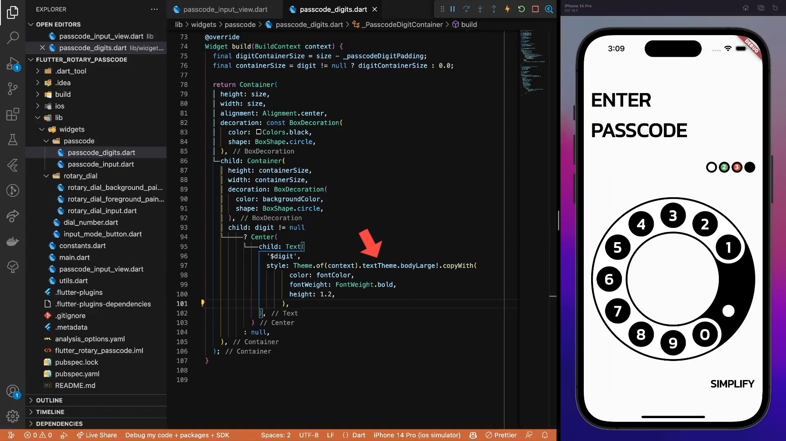

## Summary

Here you can see the final result.

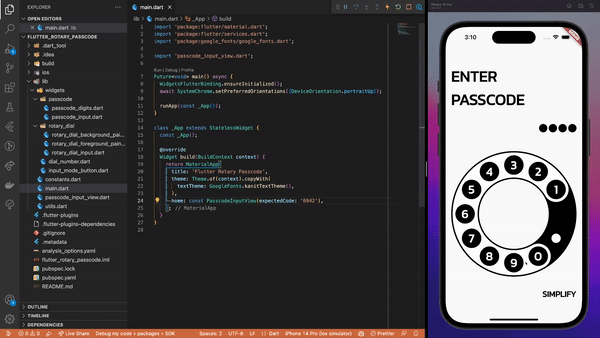

Of course, it is still not usable at the moment, but that’s something for the next part of the tutorial, where we will focus on the motion design part of the UI.

If you want to dive deeper into the code, you can find the full source code on [GitHub](https://github.com/mkobuolys/flutter-design-challenges/tree/master/flutter_rotary_passcode). In case of any questions or suggestions - feel free to reach out to me on [Twitter](https://twitter.com/mkobuolys) or any other social media channel.
