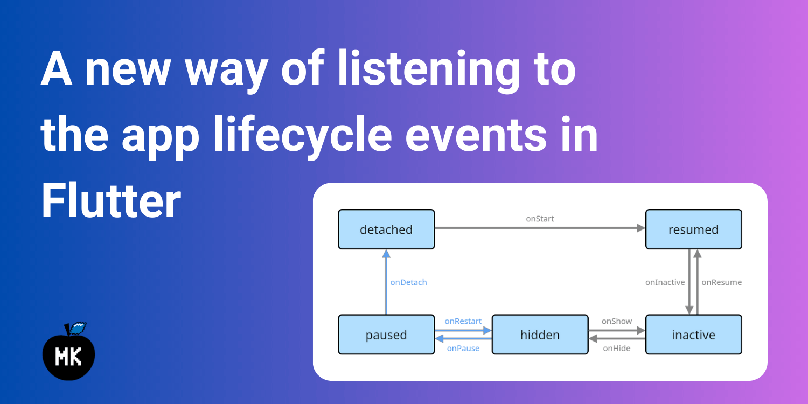
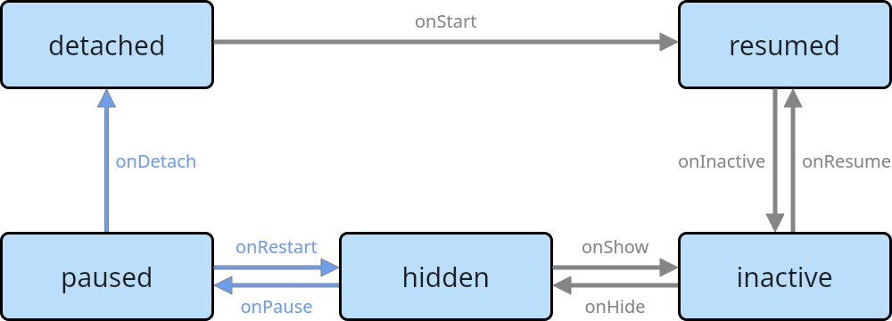

_Overview of the new AppLifecycleListener class introduced in Flutter 3.13_



Flutter 3.13 introduced a lot of new features and improvements. One of them is a new class called `AppLifecycleListener` which allows you to listen to the lifecycle events of your Flutter app. It is an improvement compared to the previous way of listening to the app lifecycle events. In this article, I will compare the old and new ways of listening to the app lifecycle events and show you how to use the new `AppLifecycleListener` class.

<!--truncate-->

## The "old" way

Before Flutter 3.13, you could listen to the app lifecycle events by using the `WidgetsBindingObserver` mixin. For that, you had to add the `WidgetsBindingObserver` mixin to your `State` class and override the `didChangeAppLifecycleState` method. In the `didChangeAppLifecycleState` method, you could listen to the app lifecycle events by using the provided state (`AppLifecycleState`) value.

```dart
class AppLifecyclePageOld extends StatefulWidget {
  const AppLifecyclePageOld({super.key});

  @override
  State<AppLifecyclePageOld> createState() => _AppLifecyclePageOldState();
}

class _AppLifecyclePageOldState extends State<AppLifecyclePageOld>
    // Use the WidgetsBindingObserver mixin
    with WidgetsBindingObserver {
  @override
  void initState() {
    super.initState();

    // Register your State class as a binding observer
    WidgetsBinding.instance.addObserver(this);
  }

  @override
  void dispose() {
    // Unregister your State class as a binding observer
    WidgetsBinding.instance.removeObserver(this);

    super.dispose();
  }

  // Override the didChangeAppLifecycleState method and
  // listen to the app lifecycle state changes
  @override
  void didChangeAppLifecycleState(AppLifecycleState state) {
    super.didChangeAppLifecycleState(state);

    switch (state) {
      case AppLifecycleState.detached:
        _onDetached();
      case AppLifecycleState.resumed:
        _onResumed();
      case AppLifecycleState.inactive:
        _onInactive();
      case AppLifecycleState.hidden:
        _onHidden();
      case AppLifecycleState.paused:
        _onPaused();
    }
  }

  void _onDetached() => print('detached');

  void _onResumed() => print('resumed');

  void _onInactive() => print('inactive');

  void _onHidden() => print('hidden');

  void _onPaused() => print('paused');

  @override
  Widget build(BuildContext context) {
    return const Scaffold(
      body: Placeholder(),
    );
  }
}
```

Let's see how we can listen to the app lifecycle events using the new `AppLifecycleListener` class.

:::info
By the way, the "old" way of listening to the app lifecycle events is still available. In fact, the `AppLifecycleListener` uses the `WidgetsBindingObserver` mixin under the hood.
:::

## The "new" way

The `AppLifecycleListener` class is a new way of listening to the app lifecycle events. It is a class that you can use to listen to the app lifecycle events without having to use the `WidgetsBindingObserver` mixin directly. For that, create an instance of the `AppLifecycleListener` class and pass all the callbacks that you want to listen to.

```dart
class AppLifecyclePage extends StatefulWidget {
  const AppLifecyclePage({super.key});

  @override
  State<AppLifecyclePage> createState() => _AppLifecyclePageState();
}

class _AppLifecyclePageState extends State<AppLifecyclePage> {
  late final AppLifecycleListener _listener;

  @override
  void initState() {
    super.initState();

    // Initialize the AppLifecycleListener class and pass callbacks
    _listener = AppLifecycleListener(
      onStateChange: _onStateChanged,
    );
  }

  @override
  void dispose() {
    // Do not forget to dispose the listener
    _listener.dispose();

    super.dispose();
  }

  // Listen to the app lifecycle state changes
  void _onStateChanged(AppLifecycleState state) {
    switch (state) {
      case AppLifecycleState.detached:
        _onDetached();
      case AppLifecycleState.resumed:
        _onResumed();
      case AppLifecycleState.inactive:
        _onInactive();
      case AppLifecycleState.hidden:
        _onHidden();
      case AppLifecycleState.paused:
        _onPaused();
    }
  }

  void _onDetached() => print('detached');

  void _onResumed() => print('resumed');

  void _onInactive() => print('inactive');

  void _onHidden() => print('hidden');

  void _onPaused() => print('paused');

  @override
  Widget build(BuildContext context) {
    return const Scaffold(
      body: Placeholder(),
    );
  }
}
```

## Is there a difference?

As you may notice, the "old" and "new" ways of listening to the app lifecycle events are very similar. However, to understand the main benefit of the `AppLifecycleListener` class, let's take a look at the state machine diagram of the Flutter app lifecycle:



This diagram shows all the possible states of the Flutter app. The arrows show the possible transitions between the states. When overriding the `didChangeAppLifecycleState` method (the "old" way), you could only listen for the actual state change, e.g. when your app got into the `resumed` state. However, you could not listen to the transitions between the states, e.g. whether your app got into the `resumed` state from the `inactive` or `detached` state. Now, the `AppLifecycleListener` class allows you to listen to the transitions between the states:

```dart
class AppLifecyclePage extends StatefulWidget {
  const AppLifecyclePage({super.key});

  @override
  State<AppLifecyclePage> createState() => _AppLifecyclePageState();
}

class _AppLifecyclePageState extends State<AppLifecyclePage> {
  late final AppLifecycleListener _listener;

  @override
  void initState() {
    super.initState();

    // Pass all the callbacks for the transitions you want to listen to
    _listener = AppLifecycleListener(
      onDetach: _onDetach,
      onHide: _onHide,
      onInactive: _onInactive,
      onPause: _onPause,
      onRestart: _onRestart,
      onResume: _onResume,
      onShow: _onShow,
      onStateChange: _onStateChanged,
    );
  }

  @override
  void dispose() {
    _listener.dispose();

    super.dispose();
  }

  void _onDetach() => print('onDetach');

  void _onHide() => print('onHide');

  void _onInactive() => print('onInactive');

  void _onPause() => print('onPause');

  void _onRestart() => print('onRestart');

  void _onResume() => print('onResume');

  void _onShow() => print('onShow');

  void _onStateChanged(AppLifecycleState state) {
    // Track state changes
  }

  @override
  Widget build(BuildContext context) {
    return const Scaffold(
      body: Placeholder(),
    );
  }
}
```

This is the main benefit of the `AppLifecycleListener` class. It allows you to listen to the transitions between the app lifecycle states and execute the necessary code only for the transitions you are interested in.

But there is one more thing...

## The `onExitRequested` callback

The `AppLifecycleListener` class has one more callback called `onExitRequested`. This callback is used to ask the application if it will allow exiting the application for cases where the exit is cancelable. For instance, it could be used for MacOS applications where the user tries to close the app when there are unsaved changes:


To cancel the exit request, you need to return `AppExitResponse.cancel` from the `onExitRequested` callback. Otherwise, return `AppExitResponse.exit` to allow the application to exit.

```dart
class AppLifecyclePage extends StatefulWidget {
  const AppLifecyclePage({super.key});

  @override
  State<AppLifecyclePage> createState() => _AppLifecyclePageState();
}

class _AppLifecyclePageState extends State<AppLifecyclePage> {
  late final AppLifecycleListener _listener;

  @override
  void initState() {
    super.initState();

    _listener = AppLifecycleListener(
      // Handle the onExitRequested callback
      onExitRequested: _onExitRequested,
    );
  }

  @override
  void dispose() {
    _listener.dispose();

    super.dispose();
  }

  // Ask the user if they want to exit the app. If the user
  // cancels the exit, return AppExitResponse.cancel. Otherwise,
  // return AppExitResponse.exit.
  Future<AppExitResponse> _onExitRequested() async {
    final response = await showDialog<AppExitResponse>(
      context: context,
      barrierDismissible: false,
      builder: (context) => AlertDialog.adaptive(
        title: const Text('Are you sure you want to quit this app?'),
        content: const Text('All unsaved progress will be lost.'),
        actions: [
          TextButton(
            child: const Text('Cancel'),
            onPressed: () {
              Navigator.of(context).pop(AppExitResponse.cancel);
            },
          ),
          TextButton(
            child: const Text('Ok'),
            onPressed: () {
              Navigator.of(context).pop(AppExitResponse.exit);
            },
          ),
        ],
      ),
    );

    return response ?? AppExitResponse.exit;
  }

  @override
  Widget build(BuildContext context) {
    return Scaffold(
      appBar: AppBar(
        title: const Text('App Lifecycle Demo'),
      ),
      body: Center(
        child: Text(
          '👋',
          style: Theme.of(context).textTheme.displayLarge,
        ),
      ),
    );
  }
}
```

## Conclusion

The `AppLifecycleListener` class is a new way of listening to the app lifecycle states, and more importantly, transitions between them. Additionally, the `onExitRequested` callback simplifies the process of handling the exit requests for cases where the exit is cancelable. I hope you found this article useful and will consider using the `AppLifecycleListener` class in your Flutter apps.

:::tip
Do not forget to check the other awesome features and improvements introduced in Flutter 3.13 in the [official blog post](https://medium.com/flutter/whats-new-in-flutter-3-13-479d9b11df4d).
:::
