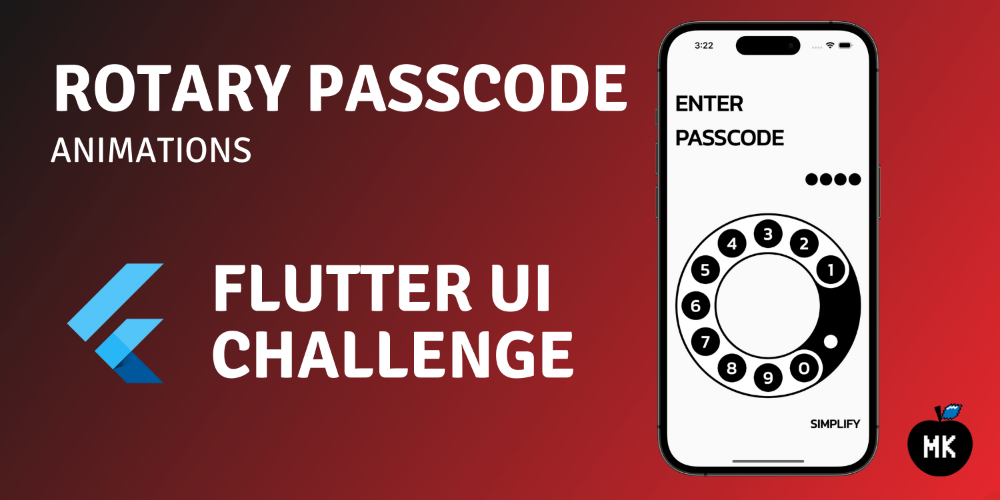
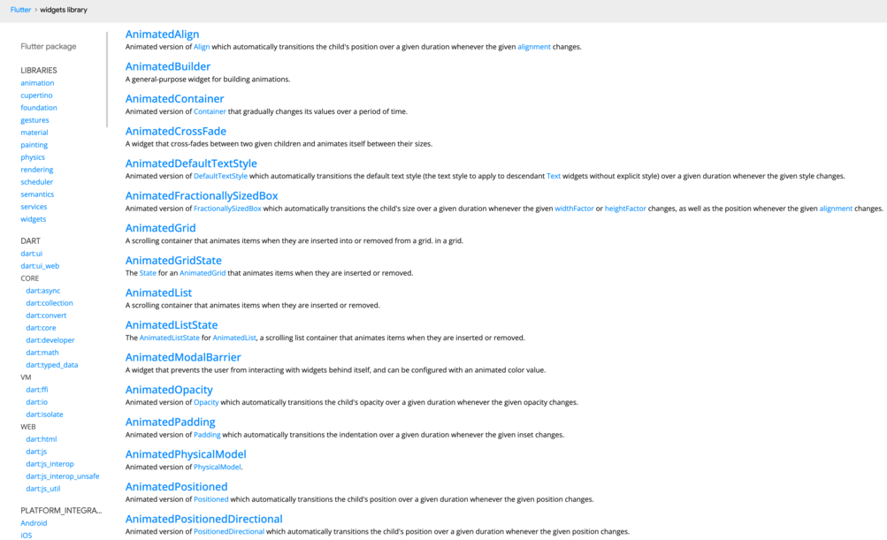
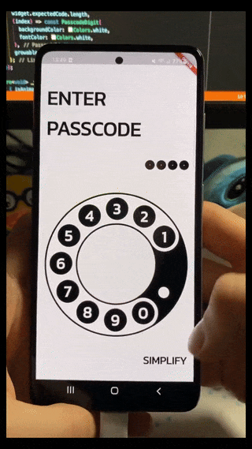
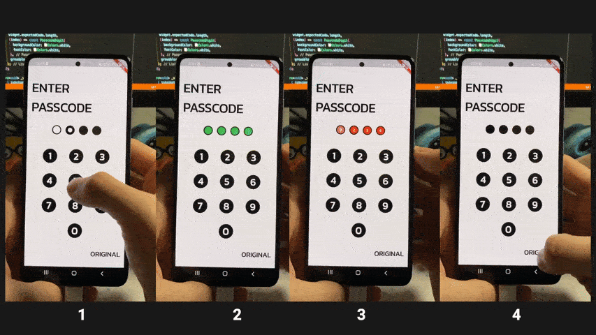
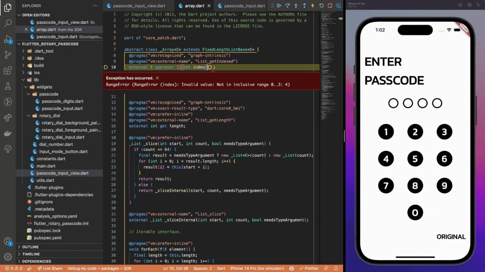
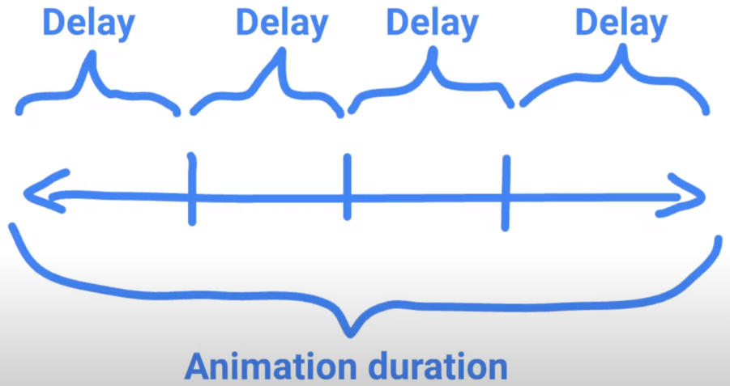
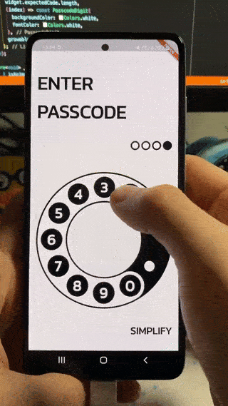
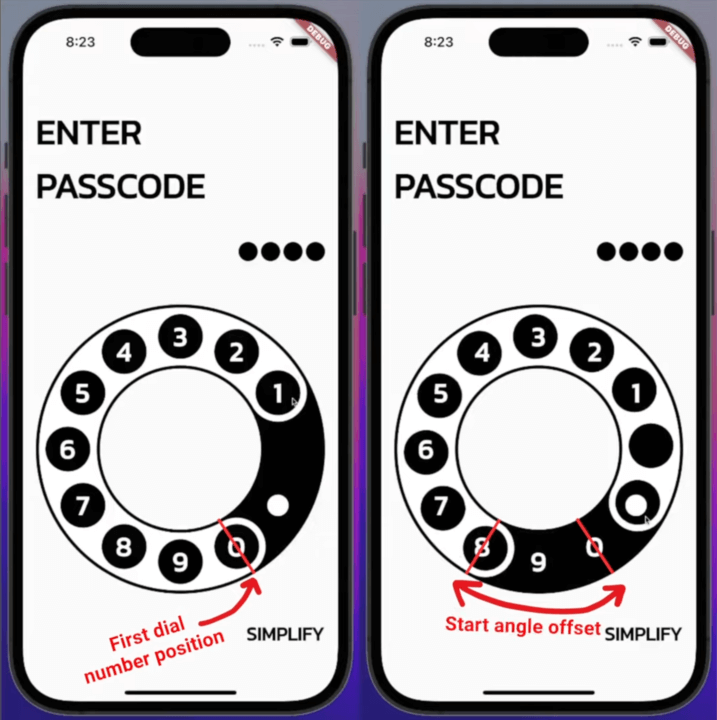
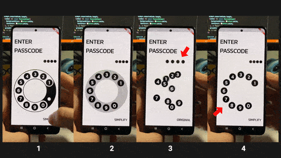

_Retro rotary passcode input UI challenge made with Flutter. The main focus of this part is motion design - animations._



In the [previous part](../2023-06-05-rotary-passcode-static-design/index.md), we implemented all the static elements of the rotary passcode UI. In this article, I will cover the motion design part of the challenge - animations, gestures, transitions and other fancy eye candies visible on the screen.

<!--truncate-->

:::tip
If you prefer video content, check out the video version of this article on [YouTube](https://youtu.be/gdVNFHgNvpw).
:::

## Animations overview

In Flutter, there are two types of code-based animations - implicit and explicit ones. For implicit animations, just select and use one of the pre-defined animation widgets from the [Flutter library](https://api.flutter.dev/flutter/search.html?q=animated).



For explicit animations, you need to create an animation controller and take care of all the implementation details yourself. This is a more flexible approach, but it requires more code (possibly, more bugs as well).

:::tip
To learn more about animations in Flutter, check out the [introduction to animations](https://flutter.dev/docs/development/ui/animations).
:::

## Input mode button animation

Let’s start by implementing the implicit cross-fade animation for the input mode button.



:::info
If you want to follow along, the code where we left off in the previous part is available on [GitHub](https://github.com/mkobuolys/flutter-design-challenges/tree/rotary-passcode-static-ui-only).
:::

First, add the `animationDuration` property that will allow us to synchronise this animation with other components.

```dart title="input_mode_button.dart"
import 'package:flutter/material.dart';

class InputModeButton extends StatelessWidget {
  const InputModeButton({
    // highlight-next-line
    required this.animationDuration,
    required this.simpleInputMode,
    required this.onModeChanged,
    super.key,
  });

  // highlight-next-line
  final Duration animationDuration;
  final bool simpleInputMode;
  final VoidCallback onModeChanged;

  @override
  Widget build(BuildContext context) {
    return GestureDetector(
      onTap: onModeChanged,
      child: Text(
        (simpleInputMode ? 'Original' : 'Simplify').toUpperCase(),
        style: Theme.of(context)
            .textTheme
            .headlineSmall
            ?.copyWith(color: Colors.black, fontWeight: FontWeight.bold),
      ),
    );
  }
}
```

Then, define the animation duration by creating an `_animationDuration` property and passing it to the `InputModeButton`.

```dart title="passcode_input_view.dart"
import 'package:flutter/material.dart';

import 'widgets/input_mode_button.dart';
import 'widgets/passcode/passcode_digits.dart';
import 'widgets/passcode/passcode_input.dart';
import 'widgets/rotary_dial/rotary_dial_input.dart';

// highlight-next-line
const _animationDuration = Duration(milliseconds: 500);
const _padding = 16.0;

class PasscodeInputView extends StatefulWidget {
  const PasscodeInputView({
    required this.expectedCode,
    super.key,
  });

  final String expectedCode;

  @override
  State<PasscodeInputView> createState() => _PasscodeInputViewState();
}

class _PasscodeInputViewState extends State<PasscodeInputView> {
  late final List<PasscodeDigit> _passcodeDigitValues;

  var _simpleInputMode = false;

  @override
  void initState() {
    super.initState();

    _passcodeDigitValues = List.generate(
      widget.expectedCode.length,
      (index) => const PasscodeDigit(
        backgroundColor: Colors.white,
        fontColor: Colors.white,
      ),
      growable: false,
    );
  }

  void _onModeChanged() => setState(() => _simpleInputMode = !_simpleInputMode);

  @override
  Widget build(BuildContext context) {
    return Scaffold(
      body: SafeArea(
        child: Padding(
          padding: const EdgeInsets.fromLTRB(
            _padding,
            _padding * 3,
            _padding,
            _padding * 2,
          ),
          child: Column(
            crossAxisAlignment: CrossAxisAlignment.stretch,
            children: [
              Text(
                'Enter\npasscode'.toUpperCase(),
                style: Theme.of(context).textTheme.displaySmall?.copyWith(
                      color: Colors.black,
                      fontWeight: FontWeight.bold,
                    ),
              ),
              const SizedBox(height: 32.0),
              Align(
                alignment:
                    _simpleInputMode ? Alignment.center : Alignment.centerRight,
                child: PasscodeDigits(
                  passcodeDigitValues: _passcodeDigitValues,
                  simpleInputMode: _simpleInputMode,
                ),
              ),
              const SizedBox(height: 16.0),
              Expanded(
                child: _simpleInputMode
                    ? const PasscodeInput()
                    : const RotaryDialInput(),
              ),
              Align(
                alignment: Alignment.centerRight,
                child: InputModeButton(
                  // highlight-next-line
                  animationDuration: _animationDuration,
                  simpleInputMode: _simpleInputMode,
                  onModeChanged: _onModeChanged,
                ),
              ),
            ],
          ),
        ),
      ),
    );
  }
}
```

To make life easier, create a private `_Button` widget that accepts the `label` property and the `onTap` callback and move the generic button’s code to the private widget.

```dart title="input_mode_button.dart"
import 'package:flutter/material.dart';

class InputModeButton extends StatelessWidget {
  const InputModeButton({
    required this.animationDuration,
    required this.simpleInputMode,
    required this.onModeChanged,
    super.key,
  });

  final Duration animationDuration;
  final bool simpleInputMode;
  final VoidCallback onModeChanged;

  @override
  Widget build(BuildContext context) {
    return GestureDetector(
      onTap: onModeChanged,
      child: Text(
        (simpleInputMode ? 'Original' : 'Simplify').toUpperCase(),
        style: Theme.of(context)
            .textTheme
            .headlineSmall
            ?.copyWith(color: Colors.black, fontWeight: FontWeight.bold),
      ),
    );
  }
}

// highlight-start
class _Button extends StatelessWidget {
  const _Button({
    required this.label,
    required this.onTap,
  });

  final String label;
  final VoidCallback onTap;

  @override
  Widget build(BuildContext context) {
    return GestureDetector(
      onTap: onTap,
      child: Text(
        label.toUpperCase(),
        style: Theme.of(context)
            .textTheme
            .headlineSmall
            ?.copyWith(color: Colors.black, fontWeight: FontWeight.bold),
      ),
    );
  }
}
// highlight-end
```

The easiest way to implement the animation is by using the `AnimatedCrossFade` widget. Add it to the build method, pass the animation duration and different button values for different input modes. Now you should see why extracting the generic button code to a separate widget was a good idea.

For the `crossFadeState`, use the `simpleInputMode` value to decide which button variation to show. Lastly, set the alignment to `centerLeft` and use `easeInOutCubic` animation curves for a slow starting as well as slowly ending animation.

```dart title="input_mode_button.dart"
import 'package:flutter/material.dart';

class InputModeButton extends StatelessWidget {
  const InputModeButton({
    required this.animationDuration,
    required this.simpleInputMode,
    required this.onModeChanged,
    super.key,
  });

  final Duration animationDuration;
  final bool simpleInputMode;
  final VoidCallback onModeChanged;

  @override
  Widget build(BuildContext context) {
    // highlight-start
    return AnimatedCrossFade(
      alignment: Alignment.centerLeft,
      firstCurve: Curves.easeInOutCubic,
      secondCurve: Curves.easeInOutCubic,
      firstChild: _Button(label: 'Original', onTap: onModeChanged),
      secondChild: _Button(label: 'Simplify', onTap: onModeChanged),
      crossFadeState: simpleInputMode
          ? CrossFadeState.showFirst
          : CrossFadeState.showSecond,
      duration: animationDuration,
    );
    // highlight-end
  }
}

class _Button extends StatelessWidget {
  const _Button({
    required this.label,
    required this.onTap,
  });

  final String label;
  final VoidCallback onTap;

  @override
  Widget build(BuildContext context) {
    return GestureDetector(
      onTap: onTap,
      child: Text(
        label.toUpperCase(),
        style: Theme.of(context)
            .textTheme
            .headlineSmall
            ?.copyWith(color: Colors.black, fontWeight: FontWeight.bold),
      ),
    );
  }
}
```

That’s it for the button animation. The `AnimatedCrossFade` widget does all the dirty work.

## Passcode digits indicator animations

The next UI element we will cover is the passcode digits indicator. The indicator consists of several different animations:

1. Scale animation on digit input;
2. Success animation on successful passcode input;
3. Error animation sequence when the passcode is incorrect;
4. Digits indicator size transition when switching input modes.



However, before implementing anything that animates, we need to make the input buttons interactive and provide callbacks to them.

### Making the input buttons work

Add the `onDigitSelected` property to the `PasscodeInput` widget. Then, add the render method for the `DialNumber` widget so that we can wrap it with a `GestureDetector`.

```dart title="passcode_input.dart"
import 'package:flutter/widgets.dart';

import '../../constants.dart';
import '../dial_number.dart';

const _alignment = MainAxisAlignment.spaceEvenly;

class PasscodeInput extends StatelessWidget {
  const PasscodeInput({
    // highlight-next-line
    required this.onDigitSelected,
    super.key,
  });

  // highlight-next-line
  final ValueSetter<int> onDigitSelected;

  // highlight-start
  Widget _renderDialNumber(int index) => GestureDetector(
        onTap: () => onDigitSelected(index),
        child: DialNumber(Constants.inputValues[index]),
      );
  // highlight-end

  @override
  Widget build(BuildContext context) {
    return Column(
      mainAxisAlignment: _alignment,
      children: [
        for (var i = 0; i < 3; i++)
          Row(
            mainAxisAlignment: _alignment,
            children: [
              for (var j = 0; j < 3; j++) _renderDialNumber(i * 3 + j),
            ],
          ),
        _renderDialNumber(9),
      ],
    );
  }
}
```

:::note
When you think about it, the `_renderDialNumber` could actually be a separate widget rather than a method (and it probably should be). However, in this case, it’s a simple enough method to keep it as is.

Don't cancel me for this. Please. 🫠
:::

Next, add the `copyWith` method to the `PasscodeDigit` model.

```dart title="passcode_digits.dart"
import 'package:flutter/material.dart';

import '../../utils.dart';

const _passcodeDigitPadding = 8.0;
const _passcodeDigitSizeBig = 36.0;
const _passcodeDigitSizeSmall = 24.0;
const _passcodeDigitGapBig = 16.0;
const _passcodeDigitGapSmall = 4.0;

class PasscodeDigit {
  const PasscodeDigit({
    required this.backgroundColor,
    required this.fontColor,
    this.value,
  });

  final Color backgroundColor;
  final Color fontColor;
  final int? value;

  // highlight-start
  PasscodeDigit copyWith({
    Color? backgroundColor,
    Color? fontColor,
    int? value,
  }) =>
      PasscodeDigit(
        backgroundColor: backgroundColor ?? this.backgroundColor,
        fontColor: fontColor ?? this.fontColor,
        value: value ?? this.value,
      );
  // highlight-end
}

class PasscodeDigits extends StatelessWidget {
  const PasscodeDigits({
    required this.passcodeDigitValues,
    required this.simpleInputMode,
    super.key,
  });

  final List<PasscodeDigit> passcodeDigitValues;
  final bool simpleInputMode;

  @override
  Widget build(BuildContext context) {
    return SizedBox(
      height: _passcodeDigitSizeBig,
      child: Row(
        mainAxisSize: MainAxisSize.min,
        children: <Widget>[
          for (var i = 0; i < passcodeDigitValues.length; i++)
            _PasscodeDigitContainer(
              backgroundColor: passcodeDigitValues[i].backgroundColor,
              fontColor: passcodeDigitValues[i].fontColor,
              digit: passcodeDigitValues[i].value,
              size: simpleInputMode
                  ? _passcodeDigitSizeBig
                  : _passcodeDigitSizeSmall,
            ),
        ].addBetween(
          SizedBox(
            width:
                simpleInputMode ? _passcodeDigitGapBig : _passcodeDigitGapSmall,
          ),
        ),
      ),
    );
  }
}

class _PasscodeDigitContainer extends StatelessWidget {
  const _PasscodeDigitContainer({
    required this.backgroundColor,
    required this.fontColor,
    required this.digit,
    required this.size,
  });

  final Color backgroundColor;
  final Color fontColor;
  final int? digit;
  final double size;

  @override
  Widget build(BuildContext context) {
    final digitContainerSize = size - _passcodeDigitPadding;
    final containerSize = digit != null ? digitContainerSize : 0.0;

    return Container(
      height: size,
      width: size,
      alignment: Alignment.center,
      decoration: const BoxDecoration(
        color: Colors.black,
        shape: BoxShape.circle,
      ),
      child: Container(
        height: containerSize,
        width: containerSize,
        decoration: BoxDecoration(
          color: backgroundColor,
          shape: BoxShape.circle,
        ),
        child: digit != null
            ? Center(
                child: Text(
                  '$digit',
                  style: Theme.of(context).textTheme.bodyLarge!.copyWith(
                        color: fontColor,
                        fontWeight: FontWeight.bold,
                        height: 1.2,
                      ),
                ),
              )
            : null,
      ),
    );
  }
}
```

Then, inside the `PasscodeInputView` state class, create a `_currentInputIndex` variable and `onDigitSelected` method. The method gets the current active passcode digit value and updates it using the `copyWith` method as well as refreshes the UI. Also, do not forget to pass the method as a callback to the `PasscodeInput` widget.

```dart title="passcode_input_view.dart"
import 'package:flutter/material.dart';

import 'constants.dart';
import 'widgets/input_mode_button.dart';
import 'widgets/passcode/passcode_digits.dart';
import 'widgets/passcode/passcode_input.dart';
import 'widgets/rotary_dial/rotary_dial_input.dart';

const _animationDuration = Duration(milliseconds: 500);
const _padding = 16.0;

class PasscodeInputView extends StatefulWidget {
  const PasscodeInputView({
    required this.expectedCode,
    super.key,
  });

  final String expectedCode;

  @override
  State<PasscodeInputView> createState() => _PasscodeInputViewState();
}

class _PasscodeInputViewState extends State<PasscodeInputView> {
  late final List<PasscodeDigit> _passcodeDigitValues;
  // highlight-next-line
  var _currentInputIndex = 0;

  var _simpleInputMode = false;

  @override
  void initState() {
    super.initState();

    _passcodeDigitValues = List.generate(
      widget.expectedCode.length,
      (index) => const PasscodeDigit(
        backgroundColor: Colors.white,
        fontColor: Colors.white,
      ),
      growable: false,
    );
  }

  // highlight-start
  void _onDigitSelected(int index) {
    final digitValue = _passcodeDigitValues[_currentInputIndex];

    setState(() {
      _passcodeDigitValues[_currentInputIndex++] = digitValue.copyWith(
        value: Constants.inputValues[index],
      );
    });
  }
  // highlight-end

  void _onModeChanged() => setState(() => _simpleInputMode = !_simpleInputMode);

  @override
  Widget build(BuildContext context) {
    return Scaffold(
      body: SafeArea(
        child: Padding(
          padding: const EdgeInsets.fromLTRB(
            _padding,
            _padding * 3,
            _padding,
            _padding * 2,
          ),
          child: Column(
            crossAxisAlignment: CrossAxisAlignment.stretch,
            children: [
              Text(
                'Enter\npasscode'.toUpperCase(),
                style: Theme.of(context).textTheme.displaySmall?.copyWith(
                      color: Colors.black,
                      fontWeight: FontWeight.bold,
                    ),
              ),
              const SizedBox(height: 32.0),
              Align(
                alignment:
                    _simpleInputMode ? Alignment.center : Alignment.centerRight,
                child: PasscodeDigits(
                  passcodeDigitValues: _passcodeDigitValues,
                  simpleInputMode: _simpleInputMode,
                ),
              ),
              const SizedBox(height: 16.0),
              Expanded(
                child: _simpleInputMode
                    // highlight-next-line
                    ? PasscodeInput(onDigitSelected: _onDigitSelected)
                    : const RotaryDialInput(),
              ),
              Align(
                alignment: Alignment.centerRight,
                child: InputModeButton(
                  animationDuration: _animationDuration,
                  simpleInputMode: _simpleInputMode,
                  onModeChanged: _onModeChanged,
                ),
              ),
            ],
          ),
        ),
      ),
    );
  }
}
```

The buttons are working now. However, the passcode digits indicator still lacks animations. And… well… we probably need to add some validation code first.



### Passcode validation logic

What I mean by validation is that once we input all the required digits, we should either see a success or error indicator (animations #2 and #3 from the [list above](#passcode-digits-indicator-animations)). Also, the input must be reset so we can try again.

In `PasscodeInputView`, add `onSuccess` and `onError` callbacks...

```dart title="passcode_input_view.dart"
import 'package:flutter/material.dart';

import 'constants.dart';
import 'widgets/input_mode_button.dart';
import 'widgets/passcode/passcode_digits.dart';
import 'widgets/passcode/passcode_input.dart';
import 'widgets/rotary_dial/rotary_dial_input.dart';

const _animationDuration = Duration(milliseconds: 500);
const _padding = 16.0;

class PasscodeInputView extends StatefulWidget {
  const PasscodeInputView({
    required this.expectedCode,
    // highlight-start
    required this.onSuccess,
    required this.onError,
    // highlight-end
    super.key,
  });

  final String expectedCode;
  // highlight-start
  final VoidCallback onSuccess;
  final VoidCallback onError;
  // highlight-end

  @override
  State<PasscodeInputView> createState() => _PasscodeInputViewState();
}

class _PasscodeInputViewState extends State<PasscodeInputView> {
  late final List<PasscodeDigit> _passcodeDigitValues;
  var _currentInputIndex = 0;

  var _simpleInputMode = false;

  @override
  void initState() {
    super.initState();

    _passcodeDigitValues = List.generate(
      widget.expectedCode.length,
      (index) => const PasscodeDigit(
        backgroundColor: Colors.white,
        fontColor: Colors.white,
      ),
      growable: false,
    );
  }

  void _onDigitSelected(int index) {
    final digitValue = _passcodeDigitValues[_currentInputIndex];

    setState(() {
      _passcodeDigitValues[_currentInputIndex++] = digitValue.copyWith(
        value: Constants.inputValues[index],
      );
    });
  }

  void _onModeChanged() => setState(() => _simpleInputMode = !_simpleInputMode);

  @override
  Widget build(BuildContext context) {
    return Scaffold(
      body: SafeArea(
        child: Padding(
          padding: const EdgeInsets.fromLTRB(
            _padding,
            _padding * 3,
            _padding,
            _padding * 2,
          ),
          child: Column(
            crossAxisAlignment: CrossAxisAlignment.stretch,
            children: [
              Text(
                'Enter\npasscode'.toUpperCase(),
                style: Theme.of(context).textTheme.displaySmall?.copyWith(
                      color: Colors.black,
                      fontWeight: FontWeight.bold,
                    ),
              ),
              const SizedBox(height: 32.0),
              Align(
                alignment:
                    _simpleInputMode ? Alignment.center : Alignment.centerRight,
                child: PasscodeDigits(
                  passcodeDigitValues: _passcodeDigitValues,
                  simpleInputMode: _simpleInputMode,
                ),
              ),
              const SizedBox(height: 16.0),
              Expanded(
                child: _simpleInputMode
                    ? PasscodeInput(onDigitSelected: _onDigitSelected)
                    : const RotaryDialInput(),
              ),
              Align(
                alignment: Alignment.centerRight,
                child: InputModeButton(
                  animationDuration: _animationDuration,
                  simpleInputMode: _simpleInputMode,
                  onModeChanged: _onModeChanged,
                ),
              ),
            ],
          ),
        ),
      ),
    );
  }
}
```

… and pass them from the root of the application. We will leave them empty, but in real-world use cases, you should probably trigger the route change or handle any other actions here.

```dart title="main.dart"
import 'package:flutter/material.dart';
import 'package:flutter/services.dart';
import 'package:google_fonts/google_fonts.dart';

import 'passcode_input_view.dart';

Future<void> main() async {
  WidgetsFlutterBinding.ensureInitialized();
  await SystemChrome.setPreferredOrientations([DeviceOrientation.portraitUp]);

  runApp(const _App());
}

class _App extends StatelessWidget {
  const _App();

  @override
  Widget build(BuildContext context) {
    return MaterialApp(
      title: 'Flutter Rotary Passcode',
      theme: Theme.of(context).copyWith(
        textTheme: GoogleFonts.kanitTextTheme(),
      ),
      home: PasscodeInputView(
        expectedCode: '6942',
        // highlight-start
        onSuccess: () {
          // Handle valid passcode here
        },
        onError: () {
          // Handle invalid passcode here
        },
        // highlight-end
      ),
    );
  }
}
```

Then, add the `_resetDigits` method and refactor the code a bit by moving the initialisation code from the `initState` method. Also, do not forget to reset the current active passcode digit index.

```dart title="passcode_input_view.dart"
import 'package:flutter/material.dart';

import 'constants.dart';
import 'widgets/input_mode_button.dart';
import 'widgets/passcode/passcode_digits.dart';
import 'widgets/passcode/passcode_input.dart';
import 'widgets/rotary_dial/rotary_dial_input.dart';

const _animationDuration = Duration(milliseconds: 500);
const _padding = 16.0;

class PasscodeInputView extends StatefulWidget {
  const PasscodeInputView({
    required this.expectedCode,
    required this.onSuccess,
    required this.onError,
    super.key,
  });

  final String expectedCode;
  final VoidCallback onSuccess;
  final VoidCallback onError;

  @override
  State<PasscodeInputView> createState() => _PasscodeInputViewState();
}

class _PasscodeInputViewState extends State<PasscodeInputView> {
  late List<PasscodeDigit> _passcodeDigitValues;
  var _currentInputIndex = 0;

  var _simpleInputMode = false;

  @override
  void initState() {
    super.initState();

    // highlight-next-line
    _resetDigits();
  }

  void _onDigitSelected(int index) {
    final digitValue = _passcodeDigitValues[_currentInputIndex];

    setState(() {
      _passcodeDigitValues[_currentInputIndex++] = digitValue.copyWith(
        value: Constants.inputValues[index],
      );
    });
  }

  // highlight-start
  void _resetDigits() => setState(() {
        _currentInputIndex = 0;
        _passcodeDigitValues = List.generate(
          widget.expectedCode.length,
          (index) => const PasscodeDigit(
            backgroundColor: Colors.white,
            fontColor: Colors.white,
          ),
          growable: false,
        );
      });
  // highlight-end

  void _onModeChanged() => setState(() => _simpleInputMode = !_simpleInputMode);

  @override
  Widget build(BuildContext context) {
    return Scaffold(
      body: SafeArea(
        child: Padding(
          padding: const EdgeInsets.fromLTRB(
            _padding,
            _padding * 3,
            _padding,
            _padding * 2,
          ),
          child: Column(
            crossAxisAlignment: CrossAxisAlignment.stretch,
            children: [
              Text(
                'Enter\npasscode'.toUpperCase(),
                style: Theme.of(context).textTheme.displaySmall?.copyWith(
                      color: Colors.black,
                      fontWeight: FontWeight.bold,
                    ),
              ),
              const SizedBox(height: 32.0),
              Align(
                alignment:
                    _simpleInputMode ? Alignment.center : Alignment.centerRight,
                child: PasscodeDigits(
                  passcodeDigitValues: _passcodeDigitValues,
                  simpleInputMode: _simpleInputMode,
                ),
              ),
              const SizedBox(height: 16.0),
              Expanded(
                child: _simpleInputMode
                    ? PasscodeInput(onDigitSelected: _onDigitSelected)
                    : const RotaryDialInput(),
              ),
              Align(
                alignment: Alignment.centerRight,
                child: InputModeButton(
                  animationDuration: _animationDuration,
                  simpleInputMode: _simpleInputMode,
                  onModeChanged: _onModeChanged,
                ),
              ),
            ],
          ),
        ),
      ),
    );
  }
}
```

Next, add the `_validatePasscode` method and call it from the `_onDigitSelected` callback. The validation must be run only when the last digit in the passcode is inserted. If that’s true, we get a string representation of our input and compare it to the expected code. If the code is correct, we trigger the `onSuccess` callback, `onError` otherwise. Also, do not forget to reset the digits afterwards.

```dart title="passcode_input_view.dart"
import 'package:flutter/material.dart';

import 'constants.dart';
import 'widgets/input_mode_button.dart';
import 'widgets/passcode/passcode_digits.dart';
import 'widgets/passcode/passcode_input.dart';
import 'widgets/rotary_dial/rotary_dial_input.dart';

const _animationDuration = Duration(milliseconds: 500);
const _padding = 16.0;

class PasscodeInputView extends StatefulWidget {
  const PasscodeInputView({
    required this.expectedCode,
    required this.onSuccess,
    required this.onError,
    super.key,
  });

  final String expectedCode;
  final VoidCallback onSuccess;
  final VoidCallback onError;

  @override
  State<PasscodeInputView> createState() => _PasscodeInputViewState();
}

class _PasscodeInputViewState extends State<PasscodeInputView> {
  late List<PasscodeDigit> _passcodeDigitValues;
  var _currentInputIndex = 0;

  var _simpleInputMode = false;

  @override
  void initState() {
    super.initState();

    _resetDigits();
  }

  void _onDigitSelected(int index) {
    final digitValue = _passcodeDigitValues[_currentInputIndex];

    setState(() {
      _passcodeDigitValues[_currentInputIndex++] = digitValue.copyWith(
        value: Constants.inputValues[index],
      );
    });

    // highlight-next-line
    _validatePasscode();
  }

  void _resetDigits() => setState(() {
        _currentInputIndex = 0;
        _passcodeDigitValues = List.generate(
          widget.expectedCode.length,
          (index) => const PasscodeDigit(
            backgroundColor: Colors.white,
            fontColor: Colors.white,
          ),
          growable: false,
        );
      });

  // highlight-start
  void _validatePasscode() {
    final expectedCode = widget.expectedCode;

    if (_currentInputIndex != expectedCode.length) return;

    final codeInput = _passcodeDigitValues.fold<String>(
      '',
      (code, element) => code += element.value?.toString() ?? '',
    );

    if (codeInput == expectedCode) {
      widget.onSuccess();
    } else {
      widget.onError();
    }

    _resetDigits();
  }
  // highlight-end

  void _onModeChanged() => setState(() => _simpleInputMode = !_simpleInputMode);

  @override
  Widget build(BuildContext context) {
    return Scaffold(
      body: SafeArea(
        child: Padding(
          padding: const EdgeInsets.fromLTRB(
            _padding,
            _padding * 3,
            _padding,
            _padding * 2,
          ),
          child: Column(
            crossAxisAlignment: CrossAxisAlignment.stretch,
            children: [
              Text(
                'Enter\npasscode'.toUpperCase(),
                style: Theme.of(context).textTheme.displaySmall?.copyWith(
                      color: Colors.black,
                      fontWeight: FontWeight.bold,
                    ),
              ),
              const SizedBox(height: 32.0),
              Align(
                alignment:
                    _simpleInputMode ? Alignment.center : Alignment.centerRight,
                child: PasscodeDigits(
                  passcodeDigitValues: _passcodeDigitValues,
                  simpleInputMode: _simpleInputMode,
                ),
              ),
              const SizedBox(height: 16.0),
              Expanded(
                child: _simpleInputMode
                    ? PasscodeInput(onDigitSelected: _onDigitSelected)
                    : const RotaryDialInput(),
              ),
              Align(
                alignment: Alignment.centerRight,
                child: InputModeButton(
                  animationDuration: _animationDuration,
                  simpleInputMode: _simpleInputMode,
                  onModeChanged: _onModeChanged,
                ),
              ),
            ],
          ),
        ),
      ),
    );
  }
}
```

The passcode input should be working without any ugly exceptions now. Let’s get back to the fun part - animations.

### Passcode digit input animation

To animate the digit input, add the `animationDuration` property to the `PasscodeDigits` widget and pass it down to the `_PasscodeDigitContainer`.

```dart title="passcode_digits.dart"
import 'package:flutter/material.dart';

import '../../utils.dart';

const _passcodeDigitPadding = 8.0;
const _passcodeDigitSizeBig = 36.0;
const _passcodeDigitSizeSmall = 24.0;
const _passcodeDigitGapBig = 16.0;
const _passcodeDigitGapSmall = 4.0;

class PasscodeDigit {
  const PasscodeDigit({
    required this.backgroundColor,
    required this.fontColor,
    this.value,
  });

  final Color backgroundColor;
  final Color fontColor;
  final int? value;

  PasscodeDigit copyWith({
    Color? backgroundColor,
    Color? fontColor,
    int? value,
  }) =>
      PasscodeDigit(
        backgroundColor: backgroundColor ?? this.backgroundColor,
        fontColor: fontColor ?? this.fontColor,
        value: value ?? this.value,
      );
}

class PasscodeDigits extends StatelessWidget {
  const PasscodeDigits({
    // highlight-next-line
    required this.animationDuration,
    required this.passcodeDigitValues,
    required this.simpleInputMode,
    super.key,
  });

  // highlight-next-line
  final Duration animationDuration;
  final List<PasscodeDigit> passcodeDigitValues;
  final bool simpleInputMode;

  @override
  Widget build(BuildContext context) {
    return SizedBox(
      height: _passcodeDigitSizeBig,
      child: Row(
        mainAxisSize: MainAxisSize.min,
        children: <Widget>[
          for (var i = 0; i < passcodeDigitValues.length; i++)
            _PasscodeDigitContainer(
              // highlight-next-line
              animationDuration: animationDuration,
              backgroundColor: passcodeDigitValues[i].backgroundColor,
              fontColor: passcodeDigitValues[i].fontColor,
              digit: passcodeDigitValues[i].value,
              size: simpleInputMode
                  ? _passcodeDigitSizeBig
                  : _passcodeDigitSizeSmall,
            ),
        ].addBetween(
          SizedBox(
            width:
                simpleInputMode ? _passcodeDigitGapBig : _passcodeDigitGapSmall,
          ),
        ),
      ),
    );
  }
}

class _PasscodeDigitContainer extends StatelessWidget {
  const _PasscodeDigitContainer({
    // highlight-next-line
    required this.animationDuration,
    required this.backgroundColor,
    required this.fontColor,
    required this.digit,
    required this.size,
  });

  // highlight-next-line
  final Duration animationDuration;
  final Color backgroundColor;
  final Color fontColor;
  final int? digit;
  final double size;

  @override
  Widget build(BuildContext context) {
    final digitContainerSize = size - _passcodeDigitPadding;
    final containerSize = digit != null ? digitContainerSize : 0.0;

    return Container(
      height: size,
      width: size,
      alignment: Alignment.center,
      decoration: const BoxDecoration(
        color: Colors.black,
        shape: BoxShape.circle,
      ),
      child: Container(
        height: containerSize,
        width: containerSize,
        decoration: BoxDecoration(
          color: backgroundColor,
          shape: BoxShape.circle,
        ),
        child: digit != null
            ? Center(
                child: Text(
                  '$digit',
                  style: Theme.of(context).textTheme.bodyLarge!.copyWith(
                        color: fontColor,
                        fontWeight: FontWeight.bold,
                        height: 1.2,
                      ),
                ),
              )
            : null,
      ),
    );
  }
}
```

This is another implicit animation - all we need to do is replace the `Container` with `AnimatedContainer` and set the `duration` property with a specific animation curve.

```dart title="passcode_digits.dart"
import 'package:flutter/material.dart';

import '../../utils.dart';

const _passcodeDigitPadding = 8.0;
const _passcodeDigitSizeBig = 36.0;
const _passcodeDigitSizeSmall = 24.0;
const _passcodeDigitGapBig = 16.0;
const _passcodeDigitGapSmall = 4.0;

class PasscodeDigit {
  const PasscodeDigit({
    required this.backgroundColor,
    required this.fontColor,
    this.value,
  });

  final Color backgroundColor;
  final Color fontColor;
  final int? value;

  PasscodeDigit copyWith({
    Color? backgroundColor,
    Color? fontColor,
    int? value,
  }) =>
      PasscodeDigit(
        backgroundColor: backgroundColor ?? this.backgroundColor,
        fontColor: fontColor ?? this.fontColor,
        value: value ?? this.value,
      );
}

class PasscodeDigits extends StatelessWidget {
  const PasscodeDigits({
    required this.animationDuration,
    required this.passcodeDigitValues,
    required this.simpleInputMode,
    super.key,
  });

  final Duration animationDuration;
  final List<PasscodeDigit> passcodeDigitValues;
  final bool simpleInputMode;

  @override
  Widget build(BuildContext context) {
    return SizedBox(
      height: _passcodeDigitSizeBig,
      child: Row(
        mainAxisSize: MainAxisSize.min,
        children: <Widget>[
          for (var i = 0; i < passcodeDigitValues.length; i++)
            _PasscodeDigitContainer(
              animationDuration: animationDuration,
              backgroundColor: passcodeDigitValues[i].backgroundColor,
              fontColor: passcodeDigitValues[i].fontColor,
              digit: passcodeDigitValues[i].value,
              size: simpleInputMode
                  ? _passcodeDigitSizeBig
                  : _passcodeDigitSizeSmall,
            ),
        ].addBetween(
          SizedBox(
            width:
                simpleInputMode ? _passcodeDigitGapBig : _passcodeDigitGapSmall,
          ),
        ),
      ),
    );
  }
}

class _PasscodeDigitContainer extends StatelessWidget {
  const _PasscodeDigitContainer({
    required this.animationDuration,
    required this.backgroundColor,
    required this.fontColor,
    required this.digit,
    required this.size,
  });

  final Duration animationDuration;
  final Color backgroundColor;
  final Color fontColor;
  final int? digit;
  final double size;

  @override
  Widget build(BuildContext context) {
    final digitContainerSize = size - _passcodeDigitPadding;
    final containerSize = digit != null ? digitContainerSize : 0.0;

    return Container(
      height: size,
      width: size,
      alignment: Alignment.center,
      decoration: const BoxDecoration(
        color: Colors.black,
        shape: BoxShape.circle,
      ),
      // highlight-next-line
      child: AnimatedContainer(
        height: containerSize,
        width: containerSize,
        // highlight-start
        duration: animationDuration,
        curve: Curves.easeInOut,
        // highlight-end
        decoration: BoxDecoration(
          color: backgroundColor,
          shape: BoxShape.circle,
        ),
        child: digit != null
            ? Center(
                child: Text(
                  '$digit',
                  style: Theme.of(context).textTheme.bodyLarge!.copyWith(
                        color: fontColor,
                        fontWeight: FontWeight.bold,
                        height: 1.2,
                      ),
                ),
              )
            : null,
      ),
    );
  }
}
```

The last thing to do here is to pass the animation duration to the `PasscodeDigits` widget.

```dart title="passcode_input_view.dart"
import 'package:flutter/material.dart';

import 'constants.dart';
import 'widgets/input_mode_button.dart';
import 'widgets/passcode/passcode_digits.dart';
import 'widgets/passcode/passcode_input.dart';
import 'widgets/rotary_dial/rotary_dial_input.dart';

const _animationDuration = Duration(milliseconds: 500);
const _padding = 16.0;

class PasscodeInputView extends StatefulWidget {
  const PasscodeInputView({
    required this.expectedCode,
    required this.onSuccess,
    required this.onError,
    super.key,
  });

  final String expectedCode;
  final VoidCallback onSuccess;
  final VoidCallback onError;

  @override
  State<PasscodeInputView> createState() => _PasscodeInputViewState();
}

class _PasscodeInputViewState extends State<PasscodeInputView> {
  late List<PasscodeDigit> _passcodeDigitValues;
  var _currentInputIndex = 0;

  var _simpleInputMode = false;

  @override
  void initState() {
    super.initState();

    _resetDigits();
  }

  void _onDigitSelected(int index) {
    final digitValue = _passcodeDigitValues[_currentInputIndex];

    setState(() {
      _passcodeDigitValues[_currentInputIndex++] = digitValue.copyWith(
        value: Constants.inputValues[index],
      );
    });

    _validatePasscode();
  }

  void _resetDigits() => setState(() {
        _currentInputIndex = 0;
        _passcodeDigitValues = List.generate(
          widget.expectedCode.length,
          (index) => const PasscodeDigit(
            backgroundColor: Colors.white,
            fontColor: Colors.white,
          ),
          growable: false,
        );
      });

  void _validatePasscode() {
    final expectedCode = widget.expectedCode;

    if (_currentInputIndex != expectedCode.length) return;

    final codeInput = _passcodeDigitValues.fold<String>(
      '',
      (code, element) => code += element.value?.toString() ?? '',
    );

    if (codeInput == expectedCode) {
      widget.onSuccess();
    } else {
      widget.onError();
    }

    _resetDigits();
  }

  void _onModeChanged() => setState(() => _simpleInputMode = !_simpleInputMode);

  @override
  Widget build(BuildContext context) {
    return Scaffold(
      body: SafeArea(
        child: Padding(
          padding: const EdgeInsets.fromLTRB(
            _padding,
            _padding * 3,
            _padding,
            _padding * 2,
          ),
          child: Column(
            crossAxisAlignment: CrossAxisAlignment.stretch,
            children: [
              Text(
                'Enter\npasscode'.toUpperCase(),
                style: Theme.of(context).textTheme.displaySmall?.copyWith(
                      color: Colors.black,
                      fontWeight: FontWeight.bold,
                    ),
              ),
              const SizedBox(height: 32.0),
              Align(
                alignment:
                    _simpleInputMode ? Alignment.center : Alignment.centerRight,
                child: PasscodeDigits(
                  // highlight-next-line
                  animationDuration: _animationDuration,
                  passcodeDigitValues: _passcodeDigitValues,
                  simpleInputMode: _simpleInputMode,
                ),
              ),
              const SizedBox(height: 16.0),
              Expanded(
                child: _simpleInputMode
                    ? PasscodeInput(onDigitSelected: _onDigitSelected)
                    : const RotaryDialInput(),
              ),
              Align(
                alignment: Alignment.centerRight,
                child: InputModeButton(
                  animationDuration: _animationDuration,
                  simpleInputMode: _simpleInputMode,
                  onModeChanged: _onModeChanged,
                ),
              ),
            ],
          ),
        ),
      ),
    );
  }
}
```

Now, when you input a digit, you should see a smooth scale animation. The passcode validation is still missing the success and error animations. Let’s add them next.

### Passcode validation animations

First, add a boolean flag to track whether the passcode animation is currently in progress or not. If the animation is running, disable all passcode inputs and validation. For that, also add a handy method to toggle the animation status.

```dart title="passcode_input_view.dart"
import 'package:flutter/material.dart';

import 'constants.dart';
import 'widgets/input_mode_button.dart';
import 'widgets/passcode/passcode_digits.dart';
import 'widgets/passcode/passcode_input.dart';
import 'widgets/rotary_dial/rotary_dial_input.dart';

const _animationDuration = Duration(milliseconds: 500);
const _padding = 16.0;

class PasscodeInputView extends StatefulWidget {
  const PasscodeInputView({
    required this.expectedCode,
    required this.onSuccess,
    required this.onError,
    super.key,
  });

  final String expectedCode;
  final VoidCallback onSuccess;
  final VoidCallback onError;

  @override
  State<PasscodeInputView> createState() => _PasscodeInputViewState();
}

class _PasscodeInputViewState extends State<PasscodeInputView> {
  late List<PasscodeDigit> _passcodeDigitValues;
  var _currentInputIndex = 0;

  var _simpleInputMode = false;
  // highlight-next-line
  var _passcodeAnimationInProgress = false;

  // highlight-next-line
  bool get _isAnimating => _passcodeAnimationInProgress;

  @override
  void initState() {
    super.initState();

    _resetDigits();
  }

  void _onDigitSelected(int index) {
    // highlight-next-line
    if (_isAnimating) return;

    final digitValue = _passcodeDigitValues[_currentInputIndex];

    setState(() {
      _passcodeDigitValues[_currentInputIndex++] = digitValue.copyWith(
        value: Constants.inputValues[index],
      );
    });

    _validatePasscode();
  }

  void _resetDigits() => setState(() {
        _currentInputIndex = 0;
        _passcodeDigitValues = List.generate(
          widget.expectedCode.length,
          (index) => const PasscodeDigit(
            backgroundColor: Colors.white,
            fontColor: Colors.white,
          ),
          growable: false,
        );
      });

  void _validatePasscode() {
    // highlight-next-line
    if (_isAnimating) return;

    final expectedCode = widget.expectedCode;

    if (_currentInputIndex != expectedCode.length) return;

    final codeInput = _passcodeDigitValues.fold<String>(
      '',
      (code, element) => code += element.value?.toString() ?? '',
    );

    if (codeInput == expectedCode) {
      widget.onSuccess();
    } else {
      widget.onError();
    }

    _resetDigits();
  }

  // highlight-start
  void _togglePasscodeAnimation() => setState(
        () => _passcodeAnimationInProgress = !_passcodeAnimationInProgress,
      );
  // highlight-end

  void _onModeChanged() => setState(() => _simpleInputMode = !_simpleInputMode);

  @override
  Widget build(BuildContext context) {
    return Scaffold(
      body: SafeArea(
        child: Padding(
          padding: const EdgeInsets.fromLTRB(
            _padding,
            _padding * 3,
            _padding,
            _padding * 2,
          ),
          child: Column(
            crossAxisAlignment: CrossAxisAlignment.stretch,
            children: [
              Text(
                'Enter\npasscode'.toUpperCase(),
                style: Theme.of(context).textTheme.displaySmall?.copyWith(
                      color: Colors.black,
                      fontWeight: FontWeight.bold,
                    ),
              ),
              const SizedBox(height: 32.0),
              Align(
                alignment:
                    _simpleInputMode ? Alignment.center : Alignment.centerRight,
                child: PasscodeDigits(
                  animationDuration: _animationDuration,
                  passcodeDigitValues: _passcodeDigitValues,
                  simpleInputMode: _simpleInputMode,
                ),
              ),
              const SizedBox(height: 16.0),
              Expanded(
                child: _simpleInputMode
                    ? PasscodeInput(onDigitSelected: _onDigitSelected)
                    : const RotaryDialInput(),
              ),
              Align(
                alignment: Alignment.centerRight,
                child: InputModeButton(
                  animationDuration: _animationDuration,
                  simpleInputMode: _simpleInputMode,
                  onModeChanged: _onModeChanged,
                ),
              ),
            ],
          ),
        ),
      ),
    );
  }
}
```

Next, add a method that updates the passcode digit colours. In the method, loop over each digit with a delay. This helps you achieve the staggered animation effect. After the delay, simply update the background and font colours of a passcode digit.

```dart title="passcode_input_view.dart"
import 'package:flutter/material.dart';

import 'constants.dart';
import 'widgets/input_mode_button.dart';
import 'widgets/passcode/passcode_digits.dart';
import 'widgets/passcode/passcode_input.dart';
import 'widgets/rotary_dial/rotary_dial_input.dart';

const _animationDuration = Duration(milliseconds: 500);
const _padding = 16.0;

class PasscodeInputView extends StatefulWidget {
  const PasscodeInputView({
    required this.expectedCode,
    required this.onSuccess,
    required this.onError,
    super.key,
  });

  final String expectedCode;
  final VoidCallback onSuccess;
  final VoidCallback onError;

  @override
  State<PasscodeInputView> createState() => _PasscodeInputViewState();
}

class _PasscodeInputViewState extends State<PasscodeInputView> {
  late List<PasscodeDigit> _passcodeDigitValues;
  var _currentInputIndex = 0;

  var _simpleInputMode = false;
  var _passcodeAnimationInProgress = false;

  bool get _isAnimating => _passcodeAnimationInProgress;

  @override
  void initState() {
    super.initState();

    _resetDigits();
  }

  void _onDigitSelected(int index) {
    if (_isAnimating) return;

    final digitValue = _passcodeDigitValues[_currentInputIndex];

    setState(() {
      _passcodeDigitValues[_currentInputIndex++] = digitValue.copyWith(
        value: Constants.inputValues[index],
      );
    });

    _validatePasscode();
  }

  void _resetDigits() => setState(() {
        _currentInputIndex = 0;
        _passcodeDigitValues = List.generate(
          widget.expectedCode.length,
          (index) => const PasscodeDigit(
            backgroundColor: Colors.white,
            fontColor: Colors.white,
          ),
          growable: false,
        );
      });

  void _validatePasscode() {
    if (_isAnimating) return;

    final expectedCode = widget.expectedCode;

    if (_currentInputIndex != expectedCode.length) return;

    final codeInput = _passcodeDigitValues.fold<String>(
      '',
      (code, element) => code += element.value?.toString() ?? '',
    );

    if (codeInput == expectedCode) {
      widget.onSuccess();
    } else {
      widget.onError();
    }

    _resetDigits();
  }

  // highlight-start
  Future<void> _changePasscodeDigitColors({
    Color? backgroundColor,
    Color? fontColor,
    int interval = 0,
  }) async {
    for (var i = 0; i < _passcodeDigitValues.length; i++) {
      await Future.delayed(Duration(milliseconds: interval));

      setState(() {
        if (backgroundColor != null) {
          _passcodeDigitValues[i] = _passcodeDigitValues[i].copyWith(
            backgroundColor: backgroundColor,
          );
        }

        if (fontColor != null) {
          _passcodeDigitValues[i] = _passcodeDigitValues[i].copyWith(
            fontColor: fontColor,
          );
        }
      });
    }
  }
  // highlight-end

  void _togglePasscodeAnimation() => setState(
        () => _passcodeAnimationInProgress = !_passcodeAnimationInProgress,
      );

  void _onModeChanged() => setState(() => _simpleInputMode = !_simpleInputMode);

  @override
  Widget build(BuildContext context) {
    return Scaffold(
      body: SafeArea(
        child: Padding(
          padding: const EdgeInsets.fromLTRB(
            _padding,
            _padding * 3,
            _padding,
            _padding * 2,
          ),
          child: Column(
            crossAxisAlignment: CrossAxisAlignment.stretch,
            children: [
              Text(
                'Enter\npasscode'.toUpperCase(),
                style: Theme.of(context).textTheme.displaySmall?.copyWith(
                      color: Colors.black,
                      fontWeight: FontWeight.bold,
                    ),
              ),
              const SizedBox(height: 32.0),
              Align(
                alignment:
                    _simpleInputMode ? Alignment.center : Alignment.centerRight,
                child: PasscodeDigits(
                  animationDuration: _animationDuration,
                  passcodeDigitValues: _passcodeDigitValues,
                  simpleInputMode: _simpleInputMode,
                ),
              ),
              const SizedBox(height: 16.0),
              Expanded(
                child: _simpleInputMode
                    ? PasscodeInput(onDigitSelected: _onDigitSelected)
                    : const RotaryDialInput(),
              ),
              Align(
                alignment: Alignment.centerRight,
                child: InputModeButton(
                  animationDuration: _animationDuration,
                  simpleInputMode: _simpleInputMode,
                  onModeChanged: _onModeChanged,
                ),
              ),
            ],
          ),
        ),
      ),
    );
  }
}
```

Before changing colours, calculate the staggered animation interval.

```dart title="passcode_input_view.dart"
import 'package:flutter/material.dart';

import 'constants.dart';
import 'widgets/input_mode_button.dart';
import 'widgets/passcode/passcode_digits.dart';
import 'widgets/passcode/passcode_input.dart';
import 'widgets/rotary_dial/rotary_dial_input.dart';

const _animationDuration = Duration(milliseconds: 500);
const _padding = 16.0;

class PasscodeInputView extends StatefulWidget {
  const PasscodeInputView({
    required this.expectedCode,
    required this.onSuccess,
    required this.onError,
    super.key,
  });

  final String expectedCode;
  final VoidCallback onSuccess;
  final VoidCallback onError;

  @override
  State<PasscodeInputView> createState() => _PasscodeInputViewState();
}

class _PasscodeInputViewState extends State<PasscodeInputView> {
  late List<PasscodeDigit> _passcodeDigitValues;
  var _currentInputIndex = 0;

  var _simpleInputMode = false;
  var _passcodeAnimationInProgress = false;

  bool get _isAnimating => _passcodeAnimationInProgress;

  @override
  void initState() {
    super.initState();

    _resetDigits();
  }

  void _onDigitSelected(int index) {
    if (_isAnimating) return;

    final digitValue = _passcodeDigitValues[_currentInputIndex];

    setState(() {
      _passcodeDigitValues[_currentInputIndex++] = digitValue.copyWith(
        value: Constants.inputValues[index],
      );
    });

    _validatePasscode();
  }

  void _resetDigits() => setState(() {
        _currentInputIndex = 0;
        _passcodeDigitValues = List.generate(
          widget.expectedCode.length,
          (index) => const PasscodeDigit(
            backgroundColor: Colors.white,
            fontColor: Colors.white,
          ),
          growable: false,
        );
      });

  void _validatePasscode() {
    if (_isAnimating) return;

    final expectedCode = widget.expectedCode;

    if (_currentInputIndex != expectedCode.length) return;

    // highlight-next-line
    final interval = _animationDuration.inMilliseconds ~/ expectedCode.length;
    final codeInput = _passcodeDigitValues.fold<String>(
      '',
      (code, element) => code += element.value?.toString() ?? '',
    );

    if (codeInput == expectedCode) {
      widget.onSuccess();
    } else {
      widget.onError();
    }

    _resetDigits();
  }

  Future<void> _changePasscodeDigitColors({
    Color? backgroundColor,
    Color? fontColor,
    int interval = 0,
  }) async {
    for (var i = 0; i < _passcodeDigitValues.length; i++) {
      await Future.delayed(Duration(milliseconds: interval));

      setState(() {
        if (backgroundColor != null) {
          _passcodeDigitValues[i] = _passcodeDigitValues[i].copyWith(
            backgroundColor: backgroundColor,
          );
        }

        if (fontColor != null) {
          _passcodeDigitValues[i] = _passcodeDigitValues[i].copyWith(
            fontColor: fontColor,
          );
        }
      });
    }
  }

  void _togglePasscodeAnimation() => setState(
        () => _passcodeAnimationInProgress = !_passcodeAnimationInProgress,
      );

  void _onModeChanged() => setState(() => _simpleInputMode = !_simpleInputMode);

  @override
  Widget build(BuildContext context) {
    return Scaffold(
      body: SafeArea(
        child: Padding(
          padding: const EdgeInsets.fromLTRB(
            _padding,
            _padding * 3,
            _padding,
            _padding * 2,
          ),
          child: Column(
            crossAxisAlignment: CrossAxisAlignment.stretch,
            children: [
              Text(
                'Enter\npasscode'.toUpperCase(),
                style: Theme.of(context).textTheme.displaySmall?.copyWith(
                      color: Colors.black,
                      fontWeight: FontWeight.bold,
                    ),
              ),
              const SizedBox(height: 32.0),
              Align(
                alignment:
                    _simpleInputMode ? Alignment.center : Alignment.centerRight,
                child: PasscodeDigits(
                  animationDuration: _animationDuration,
                  passcodeDigitValues: _passcodeDigitValues,
                  simpleInputMode: _simpleInputMode,
                ),
              ),
              const SizedBox(height: 16.0),
              Expanded(
                child: _simpleInputMode
                    ? PasscodeInput(onDigitSelected: _onDigitSelected)
                    : const RotaryDialInput(),
              ),
              Align(
                alignment: Alignment.centerRight,
                child: InputModeButton(
                  animationDuration: _animationDuration,
                  simpleInputMode: _simpleInputMode,
                  onModeChanged: _onModeChanged,
                ),
              ),
            ],
          ),
        ),
      ),
    );
  }
}
```

In this case, we split the animation into equal intervals. It means that each subsequent passcode digit’s animation is run after the same delay, thus providing a smooth reveal effect.



Before and after the code validation portion, call `_togglePasscodeAnimation` for the animation progress flag to return the correct value. Also, update the validation method to return `Future` and add a little delay before resetting the digits so that the success or error state is visible on the screen for a bit.

```dart title="passcode_input_view.dart"
import 'package:flutter/material.dart';

import 'constants.dart';
import 'widgets/input_mode_button.dart';
import 'widgets/passcode/passcode_digits.dart';
import 'widgets/passcode/passcode_input.dart';
import 'widgets/rotary_dial/rotary_dial_input.dart';

const _animationDuration = Duration(milliseconds: 500);
const _padding = 16.0;

class PasscodeInputView extends StatefulWidget {
  const PasscodeInputView({
    required this.expectedCode,
    required this.onSuccess,
    required this.onError,
    super.key,
  });

  final String expectedCode;
  final VoidCallback onSuccess;
  final VoidCallback onError;

  @override
  State<PasscodeInputView> createState() => _PasscodeInputViewState();
}

class _PasscodeInputViewState extends State<PasscodeInputView> {
  late List<PasscodeDigit> _passcodeDigitValues;
  var _currentInputIndex = 0;

  var _simpleInputMode = false;
  var _passcodeAnimationInProgress = false;

  bool get _isAnimating => _passcodeAnimationInProgress;

  @override
  void initState() {
    super.initState();

    _resetDigits();
  }

  void _onDigitSelected(int index) {
    if (_isAnimating) return;

    final digitValue = _passcodeDigitValues[_currentInputIndex];

    setState(() {
      _passcodeDigitValues[_currentInputIndex++] = digitValue.copyWith(
        value: Constants.inputValues[index],
      );
    });

    _validatePasscode();
  }

  void _resetDigits() => setState(() {
        _currentInputIndex = 0;
        _passcodeDigitValues = List.generate(
          widget.expectedCode.length,
          (index) => const PasscodeDigit(
            backgroundColor: Colors.white,
            fontColor: Colors.white,
          ),
          growable: false,
        );
      });

  // highlight-next-line
  Future<void> _validatePasscode() async {
    if (_isAnimating) return;

    final expectedCode = widget.expectedCode;

    if (_currentInputIndex != expectedCode.length) return;

    final interval = _animationDuration.inMilliseconds ~/ expectedCode.length;
    final codeInput = _passcodeDigitValues.fold<String>(
      '',
      (code, element) => code += element.value?.toString() ?? '',
    );

    // highlight-next-line
    _togglePasscodeAnimation();

    if (codeInput == expectedCode) {
      widget.onSuccess();
    } else {
      widget.onError();
    }

    // highlight-next-line
    await Future.delayed(_animationDuration);
    _resetDigits();
    // highlight-next-line
    _togglePasscodeAnimation();
  }

  Future<void> _changePasscodeDigitColors({
    Color? backgroundColor,
    Color? fontColor,
    int interval = 0,
  }) async {
    for (var i = 0; i < _passcodeDigitValues.length; i++) {
      await Future.delayed(Duration(milliseconds: interval));

      setState(() {
        if (backgroundColor != null) {
          _passcodeDigitValues[i] = _passcodeDigitValues[i].copyWith(
            backgroundColor: backgroundColor,
          );
        }

        if (fontColor != null) {
          _passcodeDigitValues[i] = _passcodeDigitValues[i].copyWith(
            fontColor: fontColor,
          );
        }
      });
    }
  }

  void _togglePasscodeAnimation() => setState(
        () => _passcodeAnimationInProgress = !_passcodeAnimationInProgress,
      );

  void _onModeChanged() => setState(() => _simpleInputMode = !_simpleInputMode);

  @override
  Widget build(BuildContext context) {
    return Scaffold(
      body: SafeArea(
        child: Padding(
          padding: const EdgeInsets.fromLTRB(
            _padding,
            _padding * 3,
            _padding,
            _padding * 2,
          ),
          child: Column(
            crossAxisAlignment: CrossAxisAlignment.stretch,
            children: [
              Text(
                'Enter\npasscode'.toUpperCase(),
                style: Theme.of(context).textTheme.displaySmall?.copyWith(
                      color: Colors.black,
                      fontWeight: FontWeight.bold,
                    ),
              ),
              const SizedBox(height: 32.0),
              Align(
                alignment:
                    _simpleInputMode ? Alignment.center : Alignment.centerRight,
                child: PasscodeDigits(
                  animationDuration: _animationDuration,
                  passcodeDigitValues: _passcodeDigitValues,
                  simpleInputMode: _simpleInputMode,
                ),
              ),
              const SizedBox(height: 16.0),
              Expanded(
                child: _simpleInputMode
                    ? PasscodeInput(onDigitSelected: _onDigitSelected)
                    : const RotaryDialInput(),
              ),
              Align(
                alignment: Alignment.centerRight,
                child: InputModeButton(
                  animationDuration: _animationDuration,
                  simpleInputMode: _simpleInputMode,
                  onModeChanged: _onModeChanged,
                ),
              ),
            ],
          ),
        ),
      ),
    );
  }
}
```

For the success state, it’s pretty simple. Just update the background colour to green and make the font colour transparent.

```dart title="passcode_input_view.dart"
import 'package:flutter/material.dart';

import 'constants.dart';
import 'widgets/input_mode_button.dart';
import 'widgets/passcode/passcode_digits.dart';
import 'widgets/passcode/passcode_input.dart';
import 'widgets/rotary_dial/rotary_dial_input.dart';

const _animationDuration = Duration(milliseconds: 500);
const _padding = 16.0;

class PasscodeInputView extends StatefulWidget {
  const PasscodeInputView({
    required this.expectedCode,
    required this.onSuccess,
    required this.onError,
    super.key,
  });

  final String expectedCode;
  final VoidCallback onSuccess;
  final VoidCallback onError;

  @override
  State<PasscodeInputView> createState() => _PasscodeInputViewState();
}

class _PasscodeInputViewState extends State<PasscodeInputView> {
  late List<PasscodeDigit> _passcodeDigitValues;
  var _currentInputIndex = 0;

  var _simpleInputMode = false;
  var _passcodeAnimationInProgress = false;

  bool get _isAnimating => _passcodeAnimationInProgress;

  @override
  void initState() {
    super.initState();

    _resetDigits();
  }

  void _onDigitSelected(int index) {
    if (_isAnimating) return;

    final digitValue = _passcodeDigitValues[_currentInputIndex];

    setState(() {
      _passcodeDigitValues[_currentInputIndex++] = digitValue.copyWith(
        value: Constants.inputValues[index],
      );
    });

    _validatePasscode();
  }

  void _resetDigits() => setState(() {
        _currentInputIndex = 0;
        _passcodeDigitValues = List.generate(
          widget.expectedCode.length,
          (index) => const PasscodeDigit(
            backgroundColor: Colors.white,
            fontColor: Colors.white,
          ),
          growable: false,
        );
      });

  Future<void> _validatePasscode() async {
    if (_isAnimating) return;

    final expectedCode = widget.expectedCode;

    if (_currentInputIndex != expectedCode.length) return;

    final interval = _animationDuration.inMilliseconds ~/ expectedCode.length;
    final codeInput = _passcodeDigitValues.fold<String>(
      '',
      (code, element) => code += element.value?.toString() ?? '',
    );

    _togglePasscodeAnimation();

    if (codeInput == expectedCode) {
      // highlight-start
      await _changePasscodeDigitColors(
        backgroundColor: Colors.green,
        fontColor: Colors.transparent,
        interval: interval,
      );
      // highlight-end

      widget.onSuccess();
    } else {
      widget.onError();
    }

    await Future.delayed(_animationDuration);
    _resetDigits();
    _togglePasscodeAnimation();
  }

  Future<void> _changePasscodeDigitColors({
    Color? backgroundColor,
    Color? fontColor,
    int interval = 0,
  }) async {
    for (var i = 0; i < _passcodeDigitValues.length; i++) {
      await Future.delayed(Duration(milliseconds: interval));

      setState(() {
        if (backgroundColor != null) {
          _passcodeDigitValues[i] = _passcodeDigitValues[i].copyWith(
            backgroundColor: backgroundColor,
          );
        }

        if (fontColor != null) {
          _passcodeDigitValues[i] = _passcodeDigitValues[i].copyWith(
            fontColor: fontColor,
          );
        }
      });
    }
  }

  void _togglePasscodeAnimation() => setState(
        () => _passcodeAnimationInProgress = !_passcodeAnimationInProgress,
      );

  void _onModeChanged() => setState(() => _simpleInputMode = !_simpleInputMode);

  @override
  Widget build(BuildContext context) {
    return Scaffold(
      body: SafeArea(
        child: Padding(
          padding: const EdgeInsets.fromLTRB(
            _padding,
            _padding * 3,
            _padding,
            _padding * 2,
          ),
          child: Column(
            crossAxisAlignment: CrossAxisAlignment.stretch,
            children: [
              Text(
                'Enter\npasscode'.toUpperCase(),
                style: Theme.of(context).textTheme.displaySmall?.copyWith(
                      color: Colors.black,
                      fontWeight: FontWeight.bold,
                    ),
              ),
              const SizedBox(height: 32.0),
              Align(
                alignment:
                    _simpleInputMode ? Alignment.center : Alignment.centerRight,
                child: PasscodeDigits(
                  animationDuration: _animationDuration,
                  passcodeDigitValues: _passcodeDigitValues,
                  simpleInputMode: _simpleInputMode,
                ),
              ),
              const SizedBox(height: 16.0),
              Expanded(
                child: _simpleInputMode
                    ? PasscodeInput(onDigitSelected: _onDigitSelected)
                    : const RotaryDialInput(),
              ),
              Align(
                alignment: Alignment.centerRight,
                child: InputModeButton(
                  animationDuration: _animationDuration,
                  simpleInputMode: _simpleInputMode,
                  onModeChanged: _onModeChanged,
                ),
              ),
            ],
          ),
        ),
      ),
    );
  }
}
```

The error case is a bit more tricky. First, all the input digits are revealed on the red background. Then, they are reset to white circles and disappear afterwards.

```dart title="passcode_input_view.dart"
import 'package:flutter/material.dart';

import 'constants.dart';
import 'widgets/input_mode_button.dart';
import 'widgets/passcode/passcode_digits.dart';
import 'widgets/passcode/passcode_input.dart';
import 'widgets/rotary_dial/rotary_dial_input.dart';

const _animationDuration = Duration(milliseconds: 500);
const _padding = 16.0;

class PasscodeInputView extends StatefulWidget {
  const PasscodeInputView({
    required this.expectedCode,
    required this.onSuccess,
    required this.onError,
    super.key,
  });

  final String expectedCode;
  final VoidCallback onSuccess;
  final VoidCallback onError;

  @override
  State<PasscodeInputView> createState() => _PasscodeInputViewState();
}

class _PasscodeInputViewState extends State<PasscodeInputView> {
  late List<PasscodeDigit> _passcodeDigitValues;
  var _currentInputIndex = 0;

  var _simpleInputMode = false;
  var _passcodeAnimationInProgress = false;

  bool get _isAnimating => _passcodeAnimationInProgress;

  @override
  void initState() {
    super.initState();

    _resetDigits();
  }

  void _onDigitSelected(int index) {
    if (_isAnimating) return;

    final digitValue = _passcodeDigitValues[_currentInputIndex];

    setState(() {
      _passcodeDigitValues[_currentInputIndex++] = digitValue.copyWith(
        value: Constants.inputValues[index],
      );
    });

    _validatePasscode();
  }

  void _resetDigits() => setState(() {
        _currentInputIndex = 0;
        _passcodeDigitValues = List.generate(
          widget.expectedCode.length,
          (index) => const PasscodeDigit(
            backgroundColor: Colors.white,
            fontColor: Colors.white,
          ),
          growable: false,
        );
      });

  Future<void> _validatePasscode() async {
    if (_isAnimating) return;

    final expectedCode = widget.expectedCode;

    if (_currentInputIndex != expectedCode.length) return;

    final interval = _animationDuration.inMilliseconds ~/ expectedCode.length;
    final codeInput = _passcodeDigitValues.fold<String>(
      '',
      (code, element) => code += element.value?.toString() ?? '',
    );

    _togglePasscodeAnimation();

    if (codeInput == expectedCode) {
      await _changePasscodeDigitColors(
        backgroundColor: Colors.green,
        fontColor: Colors.transparent,
        interval: interval,
      );

      widget.onSuccess();
    } else {
      // highlight-start
      await _changePasscodeDigitColors(
        backgroundColor: Colors.red,
        fontColor: Colors.white,
        interval: interval,
      );
      await Future.delayed(const Duration(seconds: 1));
      await _changePasscodeDigitColors(
        backgroundColor: Colors.white,
        fontColor: Colors.white,
        interval: interval,
      );
      // highlight-end

      widget.onError();
    }

    await Future.delayed(_animationDuration);
    _resetDigits();
    _togglePasscodeAnimation();
  }

  Future<void> _changePasscodeDigitColors({
    Color? backgroundColor,
    Color? fontColor,
    int interval = 0,
  }) async {
    for (var i = 0; i < _passcodeDigitValues.length; i++) {
      await Future.delayed(Duration(milliseconds: interval));

      setState(() {
        if (backgroundColor != null) {
          _passcodeDigitValues[i] = _passcodeDigitValues[i].copyWith(
            backgroundColor: backgroundColor,
          );
        }

        if (fontColor != null) {
          _passcodeDigitValues[i] = _passcodeDigitValues[i].copyWith(
            fontColor: fontColor,
          );
        }
      });
    }
  }

  void _togglePasscodeAnimation() => setState(
        () => _passcodeAnimationInProgress = !_passcodeAnimationInProgress,
      );

  void _onModeChanged() => setState(() => _simpleInputMode = !_simpleInputMode);

  @override
  Widget build(BuildContext context) {
    return Scaffold(
      body: SafeArea(
        child: Padding(
          padding: const EdgeInsets.fromLTRB(
            _padding,
            _padding * 3,
            _padding,
            _padding * 2,
          ),
          child: Column(
            crossAxisAlignment: CrossAxisAlignment.stretch,
            children: [
              Text(
                'Enter\npasscode'.toUpperCase(),
                style: Theme.of(context).textTheme.displaySmall?.copyWith(
                      color: Colors.black,
                      fontWeight: FontWeight.bold,
                    ),
              ),
              const SizedBox(height: 32.0),
              Align(
                alignment:
                    _simpleInputMode ? Alignment.center : Alignment.centerRight,
                child: PasscodeDigits(
                  animationDuration: _animationDuration,
                  passcodeDigitValues: _passcodeDigitValues,
                  simpleInputMode: _simpleInputMode,
                ),
              ),
              const SizedBox(height: 16.0),
              Expanded(
                child: _simpleInputMode
                    ? PasscodeInput(onDigitSelected: _onDigitSelected)
                    : const RotaryDialInput(),
              ),
              Align(
                alignment: Alignment.centerRight,
                child: InputModeButton(
                  animationDuration: _animationDuration,
                  simpleInputMode: _simpleInputMode,
                  onModeChanged: _onModeChanged,
                ),
              ),
            ],
          ),
        ),
      ),
    );
  }
}
```

The whole animation sequence is a little bit longer than the previous one, but it provides the context to the user of what went wrong.

## Rotary dial animation

Next on the list is a giga Chad, the main boss of this tutorial - the rotary dial animation. I hope you remember some maths, kids, because we’re going to need it.



### Dial offset calculation

The first thing you should do is convert the `RotaryDialInput` widget to a stateful one since we will use explicit animations there. Also, add the required callbacks.

```dart title="rotary_dial_input.dart"
import 'dart:math' as math;

import 'package:flutter/foundation.dart';
import 'package:flutter/widgets.dart';

import '../../constants.dart';
import '../dial_number.dart';
import 'rotary_dial_background_painter.dart';
import 'rotary_dial_foreground_painter.dart';

class RotaryDialInput extends StatefulWidget {
  const RotaryDialInput({
    // highlight-start
    required this.onDigitSelected,
    required this.onValidatePasscode,
    // highlight-end
    super.key,
  });

  // highlight-start
  final ValueSetter<int> onDigitSelected;
  final AsyncCallback onValidatePasscode;
  // highlight-end

  // highlight-start
  @override
  State<RotaryDialInput> createState() => _RotaryDialInputState();
  // highlight-end
}

// highlight-next-line
class _RotaryDialInputState extends State<RotaryDialInput> {
  @override
  Widget build(BuildContext context) {
    const inputValues = Constants.inputValues;

    return LayoutBuilder(
      builder: (context, constraints) {
        final width = constraints.maxWidth;
        final size = Size(width, width);
        final dialNumberDistanceFromCenter = width / 2 -
            16.0 - // page padding
            Constants.rotaryRingPadding * 2 -
            Constants.dialNumberPadding * 2;

        return Stack(
          alignment: Alignment.center,
          children: [
            CustomPaint(
              size: size,
              painter: const RotaryDialBackgroundPainter(),
            ),
            for (var i = 0; i < inputValues.length; i++)
              Transform.translate(
                offset: Offset.fromDirection(
                  (i + 1) * -math.pi / 6,
                  dialNumberDistanceFromCenter,
                ),
                child: DialNumber(inputValues[i]),
              ),
            CustomPaint(
              size: size,
              painter: RotaryDialForegroundPainter(
                numberRadiusFromCenter: dialNumberDistanceFromCenter,
              ),
            ),
          ],
        );
      },
    );
  }
}
```

The compiler is screaming in errors at you now, so just pass the callbacks to the `RotaryDialInput` widget.

```dart title="passcode_input_view.dart"
import 'package:flutter/material.dart';

import 'constants.dart';
import 'widgets/input_mode_button.dart';
import 'widgets/passcode/passcode_digits.dart';
import 'widgets/passcode/passcode_input.dart';
import 'widgets/rotary_dial/rotary_dial_input.dart';

const _animationDuration = Duration(milliseconds: 500);
const _padding = 16.0;

class PasscodeInputView extends StatefulWidget {
  const PasscodeInputView({
    required this.expectedCode,
    required this.onSuccess,
    required this.onError,
    super.key,
  });

  final String expectedCode;
  final VoidCallback onSuccess;
  final VoidCallback onError;

  @override
  State<PasscodeInputView> createState() => _PasscodeInputViewState();
}

class _PasscodeInputViewState extends State<PasscodeInputView> {
  late List<PasscodeDigit> _passcodeDigitValues;
  var _currentInputIndex = 0;

  var _simpleInputMode = false;
  var _passcodeAnimationInProgress = false;

  bool get _isAnimating => _passcodeAnimationInProgress;

  @override
  void initState() {
    super.initState();

    _resetDigits();
  }

  void _onDigitSelected(int index) {
    if (_isAnimating) return;

    final digitValue = _passcodeDigitValues[_currentInputIndex];

    setState(() {
      _passcodeDigitValues[_currentInputIndex++] = digitValue.copyWith(
        value: Constants.inputValues[index],
      );
    });

    _validatePasscode();
  }

  void _resetDigits() => setState(() {
        _currentInputIndex = 0;
        _passcodeDigitValues = List.generate(
          widget.expectedCode.length,
          (index) => const PasscodeDigit(
            backgroundColor: Colors.white,
            fontColor: Colors.white,
          ),
          growable: false,
        );
      });

  Future<void> _validatePasscode() async {
    if (_isAnimating) return;

    final expectedCode = widget.expectedCode;

    if (_currentInputIndex != expectedCode.length) return;

    final interval = _animationDuration.inMilliseconds ~/ expectedCode.length;
    final codeInput = _passcodeDigitValues.fold<String>(
      '',
      (code, element) => code += element.value?.toString() ?? '',
    );

    _togglePasscodeAnimation();

    if (codeInput == expectedCode) {
      await _changePasscodeDigitColors(
        backgroundColor: Colors.green,
        fontColor: Colors.transparent,
        interval: interval,
      );

      widget.onSuccess();
    } else {
      await _changePasscodeDigitColors(
        backgroundColor: Colors.red,
        fontColor: Colors.white,
        interval: interval,
      );
      await Future.delayed(const Duration(seconds: 1));
      await _changePasscodeDigitColors(
        backgroundColor: Colors.white,
        fontColor: Colors.white,
        interval: interval,
      );

      widget.onError();
    }

    await Future.delayed(_animationDuration);
    _resetDigits();
    _togglePasscodeAnimation();
  }

  Future<void> _changePasscodeDigitColors({
    Color? backgroundColor,
    Color? fontColor,
    int interval = 0,
  }) async {
    for (var i = 0; i < _passcodeDigitValues.length; i++) {
      await Future.delayed(Duration(milliseconds: interval));

      setState(() {
        if (backgroundColor != null) {
          _passcodeDigitValues[i] = _passcodeDigitValues[i].copyWith(
            backgroundColor: backgroundColor,
          );
        }

        if (fontColor != null) {
          _passcodeDigitValues[i] = _passcodeDigitValues[i].copyWith(
            fontColor: fontColor,
          );
        }
      });
    }
  }

  void _togglePasscodeAnimation() => setState(
        () => _passcodeAnimationInProgress = !_passcodeAnimationInProgress,
      );

  void _onModeChanged() => setState(() => _simpleInputMode = !_simpleInputMode);

  @override
  Widget build(BuildContext context) {
    return Scaffold(
      body: SafeArea(
        child: Padding(
          padding: const EdgeInsets.fromLTRB(
            _padding,
            _padding * 3,
            _padding,
            _padding * 2,
          ),
          child: Column(
            crossAxisAlignment: CrossAxisAlignment.stretch,
            children: [
              Text(
                'Enter\npasscode'.toUpperCase(),
                style: Theme.of(context).textTheme.displaySmall?.copyWith(
                      color: Colors.black,
                      fontWeight: FontWeight.bold,
                    ),
              ),
              const SizedBox(height: 32.0),
              Align(
                alignment:
                    _simpleInputMode ? Alignment.center : Alignment.centerRight,
                child: PasscodeDigits(
                  animationDuration: _animationDuration,
                  passcodeDigitValues: _passcodeDigitValues,
                  simpleInputMode: _simpleInputMode,
                ),
              ),
              const SizedBox(height: 16.0),
              Expanded(
                child: _simpleInputMode
                    ? PasscodeInput(onDigitSelected: _onDigitSelected)
                    : RotaryDialInput(
                        // highlight-start
                        onDigitSelected: _onDigitSelected,
                        onValidatePasscode: _validatePasscode,
                        // highlight-end
                      ),
              ),
              Align(
                alignment: Alignment.centerRight,
                child: InputModeButton(
                  animationDuration: _animationDuration,
                  simpleInputMode: _simpleInputMode,
                  onModeChanged: _onModeChanged,
                ),
              ),
            ],
          ),
        ),
      ),
    );
  }
}
```

Add two offset variables. The `_currentDragOffset` is needed to track the current drag position of your finger while the `_startAngleOffset` stores the value of how much the foreground part changed from its starting position in radians.



Yup, we are getting into this kind of calculation now.

```dart title="rotary_dial_input.dart"
import 'dart:math' as math;

import 'package:flutter/foundation.dart';
import 'package:flutter/widgets.dart';

import '../../constants.dart';
import '../dial_number.dart';
import 'rotary_dial_background_painter.dart';
import 'rotary_dial_foreground_painter.dart';

class RotaryDialInput extends StatefulWidget {
  const RotaryDialInput({
    required this.onDigitSelected,
    required this.onValidatePasscode,
    super.key,
  });

  final ValueSetter<int> onDigitSelected;
  final AsyncCallback onValidatePasscode;

  @override
  State<RotaryDialInput> createState() => _RotaryDialInputState();
}

class _RotaryDialInputState extends State<RotaryDialInput> {
  // highlight-start
  var _currentDragOffset = Offset.zero;
  var _startAngleOffset = 0.0;
  // highlight-end

  @override
  Widget build(BuildContext context) {
    const inputValues = Constants.inputValues;

    return LayoutBuilder(
      builder: (context, constraints) {
        final width = constraints.maxWidth;
        final size = Size(width, width);
        final dialNumberDistanceFromCenter = width / 2 -
            16.0 - // page padding
            Constants.rotaryRingPadding * 2 -
            Constants.dialNumberPadding * 2;

        return Stack(
          alignment: Alignment.center,
          children: [
            CustomPaint(
              size: size,
              painter: const RotaryDialBackgroundPainter(),
            ),
            for (var i = 0; i < inputValues.length; i++)
              Transform.translate(
                offset: Offset.fromDirection(
                  (i + 1) * -math.pi / 6,
                  dialNumberDistanceFromCenter,
                ),
                child: DialNumber(inputValues[i]),
              ),
            CustomPaint(
              size: size,
              painter: RotaryDialForegroundPainter(
                numberRadiusFromCenter: dialNumberDistanceFromCenter,
              ),
            ),
          ],
        );
      },
    );
  }
}
```

The dial’s foreground should rotate around the circle. For that, we only need to keep track of a starting position of an arc, other values could be recalculated based on that. Thus, we add a `startAngleOffset` property and extend the `shouldRepaint` method so that the foreground will be updated once the property changes.

```dart title="rotary_dial_foreground_painter.dart"
import 'dart:math' as math;

import 'package:flutter/rendering.dart';

import '../../constants.dart';
import '../../utils.dart';

class RotaryDialForegroundPainter extends CustomPainter {
  const RotaryDialForegroundPainter({
    required this.numberRadiusFromCenter,
    // highlight-next-line
    required this.startAngleOffset,
  });

  final double numberRadiusFromCenter;
  // highlight-next-line
  final double startAngleOffset;

  @override
  void paint(Canvas canvas, Size size) {
    const ringWidth = Constants.rotaryRingWidth;

    final paint = Paint()
      ..color = const Color.fromARGB(255, 255, 255, 255)
      ..strokeCap = StrokeCap.round
      ..strokeWidth = ringWidth - Constants.rotaryRingPadding * 2
      ..style = PaintingStyle.stroke;

    canvas
      ..saveLayer(Rect.largest, paint)
      ..drawArc(
        Rect.fromCircle(
          center: size.centerOffset,
          radius: size.width / 2 - ringWidth / 2,
        ),
        Constants.firstDialNumberPosition,
        Constants.maxRotaryRingSweepAngle,
        false,
        paint,
      );

    for (int i = 0; i < 10; i++) {
      final offset = Offset.fromDirection(
        math.pi * (-30 - i * 30) / 180,
        numberRadiusFromCenter,
      );

      canvas.drawCircle(
        size.centerOffset + offset,
        Constants.dialNumberRadius,
        Paint()..blendMode = BlendMode.clear,
      );
    }

    canvas.drawCircle(
      size.centerOffset +
          Offset.fromDirection(math.pi / 6, numberRadiusFromCenter),
      ringWidth / 6,
      Paint()..color = const Color.fromRGBO(255, 255, 255, 1.0),
    );

    canvas.restore();
  }

  @override
  bool shouldRepaint(RotaryDialForegroundPainter oldDelegate) =>
      oldDelegate.numberRadiusFromCenter != numberRadiusFromCenter &&
      // highlight-next-line
      oldDelegate.startAngleOffset != startAngleOffset;
}
```

Again, compiler errors, just pass the `_startAngleOffset` property to the painter.

```dart title="rotary_dial_input.dart"
import 'dart:math' as math;

import 'package:flutter/foundation.dart';
import 'package:flutter/widgets.dart';

import '../../constants.dart';
import '../dial_number.dart';
import 'rotary_dial_background_painter.dart';
import 'rotary_dial_foreground_painter.dart';

class RotaryDialInput extends StatefulWidget {
  const RotaryDialInput({
    required this.onDigitSelected,
    required this.onValidatePasscode,
    super.key,
  });

  final ValueSetter<int> onDigitSelected;
  final AsyncCallback onValidatePasscode;

  @override
  State<RotaryDialInput> createState() => _RotaryDialInputState();
}

class _RotaryDialInputState extends State<RotaryDialInput> {
  var _currentDragOffset = Offset.zero;
  var _startAngleOffset = 0.0;

  @override
  Widget build(BuildContext context) {
    const inputValues = Constants.inputValues;

    return LayoutBuilder(
      builder: (context, constraints) {
        final width = constraints.maxWidth;
        final size = Size(width, width);
        final dialNumberDistanceFromCenter = width / 2 -
            16.0 - // page padding
            Constants.rotaryRingPadding * 2 -
            Constants.dialNumberPadding * 2;

        return Stack(
          alignment: Alignment.center,
          children: [
            CustomPaint(
              size: size,
              painter: const RotaryDialBackgroundPainter(),
            ),
            for (var i = 0; i < inputValues.length; i++)
              Transform.translate(
                offset: Offset.fromDirection(
                  (i + 1) * -math.pi / 6,
                  dialNumberDistanceFromCenter,
                ),
                child: DialNumber(inputValues[i]),
              ),
            CustomPaint(
              size: size,
              painter: RotaryDialForegroundPainter(
                numberRadiusFromCenter: dialNumberDistanceFromCenter,
                // highlight-next-line
                startAngleOffset: _startAngleOffset,
              ),
            ),
          ],
        );
      },
    );
  }
}
```

First, we create an `angleOffset` variable and calculate its value in radians. Then, we add this offset to the `firstDialNumberPosition` so that the arc and the dial number “holes” are painted in their rotated positions.

```dart title="rotary_dial_foreground_painter.dart"
import 'dart:math' as math;

import 'package:flutter/rendering.dart';

import '../../constants.dart';
import '../../utils.dart';

class RotaryDialForegroundPainter extends CustomPainter {
  const RotaryDialForegroundPainter({
    required this.numberRadiusFromCenter,
    required this.startAngleOffset,
  });

  final double numberRadiusFromCenter;
  final double startAngleOffset;

  @override
  void paint(Canvas canvas, Size size) {
    // highlight-next-line
    const firstDialNumberPosition = Constants.firstDialNumberPosition;
    const ringWidth = Constants.rotaryRingWidth;

    // highlight-next-line
    final angleOffset = startAngleOffset * firstDialNumberPosition;
    final paint = Paint()
      ..color = const Color.fromARGB(255, 255, 255, 255)
      ..strokeCap = StrokeCap.round
      ..strokeWidth = ringWidth - Constants.rotaryRingPadding * 2
      ..style = PaintingStyle.stroke;

    canvas
      ..saveLayer(Rect.largest, paint)
      ..drawArc(
        Rect.fromCircle(
          center: size.centerOffset,
          radius: size.width / 2 - ringWidth / 2,
        ),
        // highlight-next-line
        angleOffset + firstDialNumberPosition,
        Constants.maxRotaryRingSweepAngle,
        false,
        paint,
      );

    for (int i = 0; i < 10; i++) {
      final offset = Offset.fromDirection(
        // highlight-next-line
        angleOffset + math.pi * (-30 - i * 30) / 180,
        numberRadiusFromCenter,
      );

      canvas.drawCircle(
        size.centerOffset + offset,
        Constants.dialNumberRadius,
        Paint()..blendMode = BlendMode.clear,
      );
    }

    canvas.drawCircle(
      size.centerOffset +
          Offset.fromDirection(math.pi / 6, numberRadiusFromCenter),
      ringWidth / 6,
      Paint()..color = const Color.fromRGBO(255, 255, 255, 1.0),
    );

    canvas.restore();
  }

  @override
  bool shouldRepaint(RotaryDialForegroundPainter oldDelegate) =>
      oldDelegate.numberRadiusFromCenter != numberRadiusFromCenter &&
      oldDelegate.startAngleOffset != startAngleOffset;
}
```

### Dial rotation

Next, add a method to rotate the dial to its initial position. Meaning, set the start angle offset to zero.

```dart title="rotary_dial_input.dart"
import 'dart:math' as math;

import 'package:flutter/foundation.dart';
import 'package:flutter/widgets.dart';

import '../../constants.dart';
import '../dial_number.dart';
import 'rotary_dial_background_painter.dart';
import 'rotary_dial_foreground_painter.dart';

class RotaryDialInput extends StatefulWidget {
  const RotaryDialInput({
    required this.onDigitSelected,
    required this.onValidatePasscode,
    super.key,
  });

  final ValueSetter<int> onDigitSelected;
  final AsyncCallback onValidatePasscode;

  @override
  State<RotaryDialInput> createState() => _RotaryDialInputState();
}

class _RotaryDialInputState extends State<RotaryDialInput> {
  var _currentDragOffset = Offset.zero;
  var _startAngleOffset = 0.0;

  // highlight-start
  void _rotateDialToStart() {
    setState(() {
      _startAngleOffset = 0.0;
    });
  }
  // highlight-end

  @override
  Widget build(BuildContext context) {
    const inputValues = Constants.inputValues;

    return LayoutBuilder(
      builder: (context, constraints) {
        final width = constraints.maxWidth;
        final size = Size(width, width);
        final dialNumberDistanceFromCenter = width / 2 -
            16.0 - // page padding
            Constants.rotaryRingPadding * 2 -
            Constants.dialNumberPadding * 2;

        return Stack(
          alignment: Alignment.center,
          children: [
            CustomPaint(
              size: size,
              painter: const RotaryDialBackgroundPainter(),
            ),
            for (var i = 0; i < inputValues.length; i++)
              Transform.translate(
                offset: Offset.fromDirection(
                  (i + 1) * -math.pi / 6,
                  dialNumberDistanceFromCenter,
                ),
                child: DialNumber(inputValues[i]),
              ),
            CustomPaint(
              size: size,
              painter: RotaryDialForegroundPainter(
                numberRadiusFromCenter: dialNumberDistanceFromCenter,
                startAngleOffset: _startAngleOffset,
              ),
            ),
          ],
        );
      },
    );
  }
}
```

Add drag gesture methods that will be used to track the pointer (or finger) movement on the dial. Then, wrap the foreground painter with the `GestureDetector` widget and pass the previously created methods.

```dart title="rotary_dial_input.dart"
import 'dart:math' as math;

import 'package:flutter/foundation.dart';
import 'package:flutter/widgets.dart';

import '../../constants.dart';
import '../../utils.dart';
import '../dial_number.dart';
import 'rotary_dial_background_painter.dart';
import 'rotary_dial_foreground_painter.dart';

class RotaryDialInput extends StatefulWidget {
  const RotaryDialInput({
    required this.onDigitSelected,
    required this.onValidatePasscode,
    super.key,
  });

  final ValueSetter<int> onDigitSelected;
  final AsyncCallback onValidatePasscode;

  @override
  State<RotaryDialInput> createState() => _RotaryDialInputState();
}

class _RotaryDialInputState extends State<RotaryDialInput> {
  var _currentDragOffset = Offset.zero;
  var _startAngleOffset = 0.0;

  void _rotateDialToStart() {
    setState(() {
      _startAngleOffset = 0.0;
    });
  }

  // highlight-start
  void _onPanStart(DragStartDetails details, Offset centerOffset) {}

  void _onPanUpdate(DragUpdateDetails details, Offset centerOffset) {}

  void _onPanEnd(DragEndDetails details) {}
  // highlight-end

  @override
  Widget build(BuildContext context) {
    const inputValues = Constants.inputValues;

    return LayoutBuilder(
      builder: (context, constraints) {
        final width = constraints.maxWidth;
        final size = Size(width, width);
        final centerOffset = size.centerOffset;
        final dialNumberDistanceFromCenter = width / 2 -
            16.0 - // page padding
            Constants.rotaryRingPadding * 2 -
            Constants.dialNumberPadding * 2;

        return Stack(
          alignment: Alignment.center,
          children: [
            CustomPaint(
              size: size,
              painter: const RotaryDialBackgroundPainter(),
            ),
            for (var i = 0; i < inputValues.length; i++)
              Transform.translate(
                offset: Offset.fromDirection(
                  (i + 1) * -math.pi / 6,
                  dialNumberDistanceFromCenter,
                ),
                child: DialNumber(inputValues[i]),
              ),
            // highlight-start
            GestureDetector(
              onPanStart: (details) => _onPanStart(details, centerOffset),
              onPanUpdate: (details) => _onPanUpdate(details, centerOffset),
              onPanEnd: _onPanEnd,
            // highlight-end
              child: CustomPaint(
                size: size,
                painter: RotaryDialForegroundPainter(
                  numberRadiusFromCenter: dialNumberDistanceFromCenter,
                  startAngleOffset: _startAngleOffset,
                ),
              ),
            ),
          ],
        );
      },
    );
  }
}
```

The `_onPanStart` method implementation is as simple as calculating the initial touch position offset from the dial input centre.

```dart title="rotary_dial_input.dart"
import 'dart:math' as math;

import 'package:flutter/foundation.dart';
import 'package:flutter/widgets.dart';

import '../../constants.dart';
import '../../utils.dart';
import '../dial_number.dart';
import 'rotary_dial_background_painter.dart';
import 'rotary_dial_foreground_painter.dart';

class RotaryDialInput extends StatefulWidget {
  const RotaryDialInput({
    required this.onDigitSelected,
    required this.onValidatePasscode,
    super.key,
  });

  final ValueSetter<int> onDigitSelected;
  final AsyncCallback onValidatePasscode;

  @override
  State<RotaryDialInput> createState() => _RotaryDialInputState();
}

class _RotaryDialInputState extends State<RotaryDialInput> {
  var _currentDragOffset = Offset.zero;
  var _startAngleOffset = 0.0;

  void _rotateDialToStart() {
    setState(() {
      _startAngleOffset = 0.0;
    });
  }

  // highlight-start
  void _onPanStart(DragStartDetails details, Offset centerOffset) {
    _currentDragOffset = details.localPosition - centerOffset;
  }
  // highlight-end

  void _onPanUpdate(DragUpdateDetails details, Offset centerOffset) {}

  void _onPanEnd(DragEndDetails details) {}

  @override
  Widget build(BuildContext context) {
    const inputValues = Constants.inputValues;

    return LayoutBuilder(
      builder: (context, constraints) {
        final width = constraints.maxWidth;
        final size = Size(width, width);
        final centerOffset = size.centerOffset;
        final dialNumberDistanceFromCenter = width / 2 -
            16.0 - // page padding
            Constants.rotaryRingPadding * 2 -
            Constants.dialNumberPadding * 2;

        return Stack(
          alignment: Alignment.center,
          children: [
            CustomPaint(
              size: size,
              painter: const RotaryDialBackgroundPainter(),
            ),
            for (var i = 0; i < inputValues.length; i++)
              Transform.translate(
                offset: Offset.fromDirection(
                  (i + 1) * -math.pi / 6,
                  dialNumberDistanceFromCenter,
                ),
                child: DialNumber(inputValues[i]),
              ),
            GestureDetector(
              onPanStart: (details) => _onPanStart(details, centerOffset),
              onPanUpdate: (details) => _onPanUpdate(details, centerOffset),
              onPanEnd: _onPanEnd,
              child: CustomPaint(
                size: size,
                painter: RotaryDialForegroundPainter(
                  numberRadiusFromCenter: dialNumberDistanceFromCenter,
                  startAngleOffset: _startAngleOffset,
                ),
              ),
            ),
          ],
        );
      },
    );
  }
}
```

The `_onPanUpdate` is a bit more tricky. First, calculate the current offset by adding the delta value to the previous offset. Then, compare the current and previous drag directions. If the product of these two values is negative, it means that the drag direction has changed and the update should be ignored. Calculate a new angle offset value. If the value is out of bounds, ignore the update. Finally, update the start angle offset with a new value.

```dart title="rotary_dial_input.dart"
import 'dart:math' as math;

import 'package:flutter/foundation.dart';
import 'package:flutter/widgets.dart';

import '../../constants.dart';
import '../../utils.dart';
import '../dial_number.dart';
import 'rotary_dial_background_painter.dart';
import 'rotary_dial_foreground_painter.dart';

class RotaryDialInput extends StatefulWidget {
  const RotaryDialInput({
    required this.onDigitSelected,
    required this.onValidatePasscode,
    super.key,
  });

  final ValueSetter<int> onDigitSelected;
  final AsyncCallback onValidatePasscode;

  @override
  State<RotaryDialInput> createState() => _RotaryDialInputState();
}

class _RotaryDialInputState extends State<RotaryDialInput> {
  var _currentDragOffset = Offset.zero;
  var _startAngleOffset = 0.0;

  void _rotateDialToStart() {
    setState(() {
      _startAngleOffset = 0.0;
    });
  }

  void _onPanStart(DragStartDetails details, Offset centerOffset) {
    _currentDragOffset = details.localPosition - centerOffset;
  }

  // highlight-start
  void _onPanUpdate(DragUpdateDetails details, Offset centerOffset) {
    final previousOffset = _currentDragOffset;
    _currentDragOffset += details.delta;

    final currentDirection = _currentDragOffset.direction;
    final previousDirection = previousOffset.direction;

    if (currentDirection * previousDirection < 0.0) return;

    final angle = _startAngleOffset + currentDirection - previousDirection;

    if (angle < 0.0 || angle >= Constants.maxRotaryRingAngle) return;

    setState(() => _startAngleOffset = angle);
  }
  // highlight-end

  void _onPanEnd(DragEndDetails details) {}

  @override
  Widget build(BuildContext context) {
    const inputValues = Constants.inputValues;

    return LayoutBuilder(
      builder: (context, constraints) {
        final width = constraints.maxWidth;
        final size = Size(width, width);
        final centerOffset = size.centerOffset;
        final dialNumberDistanceFromCenter = width / 2 -
            16.0 - // page padding
            Constants.rotaryRingPadding * 2 -
            Constants.dialNumberPadding * 2;

        return Stack(
          alignment: Alignment.center,
          children: [
            CustomPaint(
              size: size,
              painter: const RotaryDialBackgroundPainter(),
            ),
            for (var i = 0; i < inputValues.length; i++)
              Transform.translate(
                offset: Offset.fromDirection(
                  (i + 1) * -math.pi / 6,
                  dialNumberDistanceFromCenter,
                ),
                child: DialNumber(inputValues[i]),
              ),
            GestureDetector(
              onPanStart: (details) => _onPanStart(details, centerOffset),
              onPanUpdate: (details) => _onPanUpdate(details, centerOffset),
              onPanEnd: _onPanEnd,
              child: CustomPaint(
                size: size,
                painter: RotaryDialForegroundPainter(
                  numberRadiusFromCenter: dialNumberDistanceFromCenter,
                  startAngleOffset: _startAngleOffset,
                ),
              ),
            ),
          ],
        );
      },
    );
  }
}
```

For the `_onPanEnd` method, we normalise the offset value so that it actually shows the offset from the first dial number. If the offset value is too minor, we simply reset the dial. Then, we convert the offset angle value to the dial number index. The dial numbers are positioned 30 degrees apart around the circle. Thus, we convert radians to degrees and divide the value by 30. After applying some rounding, we get the selected dial number index. Finally, we create the `_addDigit` method that calls the `onDigitSelected` callback and resets the dial to its initial position.

```dart title="rotary_dial_input.dart"
import 'dart:math' as math;

import 'package:flutter/foundation.dart';
import 'package:flutter/widgets.dart';

import '../../constants.dart';
import '../../utils.dart';
import '../dial_number.dart';
import 'rotary_dial_background_painter.dart';
import 'rotary_dial_foreground_painter.dart';

class RotaryDialInput extends StatefulWidget {
  const RotaryDialInput({
    required this.onDigitSelected,
    required this.onValidatePasscode,
    super.key,
  });

  final ValueSetter<int> onDigitSelected;
  final AsyncCallback onValidatePasscode;

  @override
  State<RotaryDialInput> createState() => _RotaryDialInputState();
}

class _RotaryDialInputState extends State<RotaryDialInput> {
  var _currentDragOffset = Offset.zero;
  var _startAngleOffset = 0.0;

  void _rotateDialToStart() {
    setState(() {
      _startAngleOffset = 0.0;
    });
  }

  void _onPanStart(DragStartDetails details, Offset centerOffset) {
    _currentDragOffset = details.localPosition - centerOffset;
  }

  void _onPanUpdate(DragUpdateDetails details, Offset centerOffset) {
    final previousOffset = _currentDragOffset;
    _currentDragOffset += details.delta;

    final currentDirection = _currentDragOffset.direction;
    final previousDirection = previousOffset.direction;

    if (currentDirection * previousDirection < 0.0) return;

    final angle = _startAngleOffset + currentDirection - previousDirection;

    if (angle < 0.0 || angle >= Constants.maxRotaryRingAngle) return;

    setState(() => _startAngleOffset = angle);
  }

  // highlight-start
  void _onPanEnd(DragEndDetails details) {
    final offset = Constants.firstDialNumberPosition * (_startAngleOffset - 1);

    if (offset < -math.pi / 12) {
      _rotateDialToStart();

      return;
    }

    final numberIndex = ((offset * 180 / math.pi).abs() / 30).round();

    _addDigit(numberIndex);
  }

  void _addDigit(int index) {
    widget.onDigitSelected(index);

    _rotateDialToStart();
  }
  // highlight-end

  @override
  Widget build(BuildContext context) {
    const inputValues = Constants.inputValues;

    return LayoutBuilder(
      builder: (context, constraints) {
        final width = constraints.maxWidth;
        final size = Size(width, width);
        final centerOffset = size.centerOffset;
        final dialNumberDistanceFromCenter = width / 2 -
            16.0 - // page padding
            Constants.rotaryRingPadding * 2 -
            Constants.dialNumberPadding * 2;

        return Stack(
          alignment: Alignment.center,
          children: [
            CustomPaint(
              size: size,
              painter: const RotaryDialBackgroundPainter(),
            ),
            for (var i = 0; i < inputValues.length; i++)
              Transform.translate(
                offset: Offset.fromDirection(
                  (i + 1) * -math.pi / 6,
                  dialNumberDistanceFromCenter,
                ),
                child: DialNumber(inputValues[i]),
              ),
            GestureDetector(
              onPanStart: (details) => _onPanStart(details, centerOffset),
              onPanUpdate: (details) => _onPanUpdate(details, centerOffset),
              onPanEnd: _onPanEnd,
              child: CustomPaint(
                size: size,
                painter: RotaryDialForegroundPainter(
                  numberRadiusFromCenter: dialNumberDistanceFromCenter,
                  startAngleOffset: _startAngleOffset,
                ),
              ),
            ),
          ],
        );
      },
    );
  }
}
```

The rotary dial is finally working and you can already use it to enter the passcode! However, currently, there is no animation to gradually return the dial to its initial position - it jumps straight to it. Let’s make it smoother.

### Smooth dial reset

First, add an `animationDuration` property...

```dart title="rotary_dial_input.dart"
import 'dart:math' as math;

import 'package:flutter/foundation.dart';
import 'package:flutter/widgets.dart';

import '../../constants.dart';
import '../../utils.dart';
import '../dial_number.dart';
import 'rotary_dial_background_painter.dart';
import 'rotary_dial_foreground_painter.dart';

class RotaryDialInput extends StatefulWidget {
  const RotaryDialInput({
    // highlight-next-line
    required this.animationDuration,
    required this.onDigitSelected,
    required this.onValidatePasscode,
    super.key,
  });

  // highlight-next-line
  final Duration animationDuration;
  final ValueSetter<int> onDigitSelected;
  final AsyncCallback onValidatePasscode;

  @override
  State<RotaryDialInput> createState() => _RotaryDialInputState();
}

class _RotaryDialInputState extends State<RotaryDialInput> {
  var _currentDragOffset = Offset.zero;
  var _startAngleOffset = 0.0;

  void _rotateDialToStart() {
    setState(() {
      _startAngleOffset = 0.0;
    });
  }

  void _onPanStart(DragStartDetails details, Offset centerOffset) {
    _currentDragOffset = details.localPosition - centerOffset;
  }

  void _onPanUpdate(DragUpdateDetails details, Offset centerOffset) {
    final previousOffset = _currentDragOffset;
    _currentDragOffset += details.delta;

    final currentDirection = _currentDragOffset.direction;
    final previousDirection = previousOffset.direction;

    if (currentDirection * previousDirection < 0.0) return;

    final angle = _startAngleOffset + currentDirection - previousDirection;

    if (angle < 0.0 || angle >= Constants.maxRotaryRingAngle) return;

    setState(() => _startAngleOffset = angle);
  }

  void _onPanEnd(DragEndDetails details) {
    final offset = Constants.firstDialNumberPosition * (_startAngleOffset - 1);

    if (offset < -math.pi / 12) {
      _rotateDialToStart();

      return;
    }

    final numberIndex = ((offset * 180 / math.pi).abs() / 30).round();

    _addDigit(numberIndex);
  }

  void _addDigit(int index) {
    widget.onDigitSelected(index);

    _rotateDialToStart();
  }

  @override
  Widget build(BuildContext context) {
    const inputValues = Constants.inputValues;

    return LayoutBuilder(
      builder: (context, constraints) {
        final width = constraints.maxWidth;
        final size = Size(width, width);
        final centerOffset = size.centerOffset;
        final dialNumberDistanceFromCenter = width / 2 -
            16.0 - // page padding
            Constants.rotaryRingPadding * 2 -
            Constants.dialNumberPadding * 2;

        return Stack(
          alignment: Alignment.center,
          children: [
            CustomPaint(
              size: size,
              painter: const RotaryDialBackgroundPainter(),
            ),
            for (var i = 0; i < inputValues.length; i++)
              Transform.translate(
                offset: Offset.fromDirection(
                  (i + 1) * -math.pi / 6,
                  dialNumberDistanceFromCenter,
                ),
                child: DialNumber(inputValues[i]),
              ),
            GestureDetector(
              onPanStart: (details) => _onPanStart(details, centerOffset),
              onPanUpdate: (details) => _onPanUpdate(details, centerOffset),
              onPanEnd: _onPanEnd,
              child: CustomPaint(
                size: size,
                painter: RotaryDialForegroundPainter(
                  numberRadiusFromCenter: dialNumberDistanceFromCenter,
                  startAngleOffset: _startAngleOffset,
                ),
              ),
            ),
          ],
        );
      },
    );
  }
}
```

… and pass it from the `PasscodeInputView`.

```dart title="passcode_input_view.dart"
import 'package:flutter/material.dart';

import 'constants.dart';
import 'widgets/input_mode_button.dart';
import 'widgets/passcode/passcode_digits.dart';
import 'widgets/passcode/passcode_input.dart';
import 'widgets/rotary_dial/rotary_dial_input.dart';

const _animationDuration = Duration(milliseconds: 500);
const _padding = 16.0;

class PasscodeInputView extends StatefulWidget {
  const PasscodeInputView({
    required this.expectedCode,
    required this.onSuccess,
    required this.onError,
    super.key,
  });

  final String expectedCode;
  final VoidCallback onSuccess;
  final VoidCallback onError;

  @override
  State<PasscodeInputView> createState() => _PasscodeInputViewState();
}

class _PasscodeInputViewState extends State<PasscodeInputView> {
  late List<PasscodeDigit> _passcodeDigitValues;
  var _currentInputIndex = 0;

  var _simpleInputMode = false;
  var _passcodeAnimationInProgress = false;

  bool get _isAnimating => _passcodeAnimationInProgress;

  @override
  void initState() {
    super.initState();

    _resetDigits();
  }

  void _onDigitSelected(int index) {
    if (_isAnimating) return;

    final digitValue = _passcodeDigitValues[_currentInputIndex];

    setState(() {
      _passcodeDigitValues[_currentInputIndex++] = digitValue.copyWith(
        value: Constants.inputValues[index],
      );
    });

    _validatePasscode();
  }

  void _resetDigits() => setState(() {
        _currentInputIndex = 0;
        _passcodeDigitValues = List.generate(
          widget.expectedCode.length,
          (index) => const PasscodeDigit(
            backgroundColor: Colors.white,
            fontColor: Colors.white,
          ),
          growable: false,
        );
      });

  Future<void> _validatePasscode() async {
    if (_isAnimating) return;

    final expectedCode = widget.expectedCode;

    if (_currentInputIndex != expectedCode.length) return;

    final interval = _animationDuration.inMilliseconds ~/ expectedCode.length;
    final codeInput = _passcodeDigitValues.fold<String>(
      '',
      (code, element) => code += element.value?.toString() ?? '',
    );

    _togglePasscodeAnimation();

    if (codeInput == expectedCode) {
      await _changePasscodeDigitColors(
        backgroundColor: Colors.green,
        fontColor: Colors.transparent,
        interval: interval,
      );

      widget.onSuccess();
    } else {
      await _changePasscodeDigitColors(
        backgroundColor: Colors.red,
        fontColor: Colors.white,
        interval: interval,
      );
      await Future.delayed(const Duration(seconds: 1));
      await _changePasscodeDigitColors(
        backgroundColor: Colors.white,
        fontColor: Colors.white,
        interval: interval,
      );

      widget.onError();
    }

    await Future.delayed(_animationDuration);
    _resetDigits();
    _togglePasscodeAnimation();
  }

  Future<void> _changePasscodeDigitColors({
    Color? backgroundColor,
    Color? fontColor,
    int interval = 0,
  }) async {
    for (var i = 0; i < _passcodeDigitValues.length; i++) {
      await Future.delayed(Duration(milliseconds: interval));

      setState(() {
        if (backgroundColor != null) {
          _passcodeDigitValues[i] = _passcodeDigitValues[i].copyWith(
            backgroundColor: backgroundColor,
          );
        }

        if (fontColor != null) {
          _passcodeDigitValues[i] = _passcodeDigitValues[i].copyWith(
            fontColor: fontColor,
          );
        }
      });
    }
  }

  void _togglePasscodeAnimation() => setState(
        () => _passcodeAnimationInProgress = !_passcodeAnimationInProgress,
      );

  void _onModeChanged() => setState(() => _simpleInputMode = !_simpleInputMode);

  @override
  Widget build(BuildContext context) {
    return Scaffold(
      body: SafeArea(
        child: Padding(
          padding: const EdgeInsets.fromLTRB(
            _padding,
            _padding * 3,
            _padding,
            _padding * 2,
          ),
          child: Column(
            crossAxisAlignment: CrossAxisAlignment.stretch,
            children: [
              Text(
                'Enter\npasscode'.toUpperCase(),
                style: Theme.of(context).textTheme.displaySmall?.copyWith(
                      color: Colors.black,
                      fontWeight: FontWeight.bold,
                    ),
              ),
              const SizedBox(height: 32.0),
              Align(
                alignment:
                    _simpleInputMode ? Alignment.center : Alignment.centerRight,
                child: PasscodeDigits(
                  animationDuration: _animationDuration,
                  passcodeDigitValues: _passcodeDigitValues,
                  simpleInputMode: _simpleInputMode,
                ),
              ),
              const SizedBox(height: 16.0),
              Expanded(
                child: _simpleInputMode
                    ? PasscodeInput(onDigitSelected: _onDigitSelected)
                    : RotaryDialInput(
                        // highlight-next-line
                        animationDuration: _animationDuration,
                        onDigitSelected: _onDigitSelected,
                        onValidatePasscode: _validatePasscode,
                      ),
              ),
              Align(
                alignment: Alignment.centerRight,
                child: InputModeButton(
                  animationDuration: _animationDuration,
                  simpleInputMode: _simpleInputMode,
                  onModeChanged: _onModeChanged,
                ),
              ),
            ],
          ),
        ),
      ),
    );
  }
}
```

Since we will work with explicit animations here, add the `SingleTickerProviderStateMixin` to the state class. Create an animation controller for the dial and update the `_isAnimating` getter. Also, add guards to skip all the drag gesture callback methods when the animation is running.

```dart title="rotary_dial_input.dart"
import 'dart:math' as math;

import 'package:flutter/foundation.dart';
import 'package:flutter/widgets.dart';

import '../../constants.dart';
import '../../utils.dart';
import '../dial_number.dart';
import 'rotary_dial_background_painter.dart';
import 'rotary_dial_foreground_painter.dart';

class RotaryDialInput extends StatefulWidget {
  const RotaryDialInput({
    required this.animationDuration,
    required this.onDigitSelected,
    required this.onValidatePasscode,
    super.key,
  });

  final Duration animationDuration;
  final ValueSetter<int> onDigitSelected;
  final AsyncCallback onValidatePasscode;

  @override
  State<RotaryDialInput> createState() => _RotaryDialInputState();
}

class _RotaryDialInputState extends State<RotaryDialInput>
    // highlight-next-line
    with SingleTickerProviderStateMixin {
  // highlight-next-line
  late final AnimationController _dialController;

  var _currentDragOffset = Offset.zero;
  var _startAngleOffset = 0.0;

  // highlight-next-line
  bool get _isAnimating => _dialController.isAnimating;

  void _rotateDialToStart() {
    setState(() {
      _startAngleOffset = 0.0;
    });
  }

  void _onPanStart(DragStartDetails details, Offset centerOffset) {
    // highlight-next-line
    if (_isAnimating) return;

    _currentDragOffset = details.localPosition - centerOffset;
  }

  void _onPanUpdate(DragUpdateDetails details, Offset centerOffset) {
    // highlight-next-line
    if (_isAnimating) return;

    final previousOffset = _currentDragOffset;
    _currentDragOffset += details.delta;

    final currentDirection = _currentDragOffset.direction;
    final previousDirection = previousOffset.direction;

    if (currentDirection * previousDirection < 0.0) return;

    final angle = _startAngleOffset + currentDirection - previousDirection;

    if (angle < 0.0 || angle >= Constants.maxRotaryRingAngle) return;

    setState(() => _startAngleOffset = angle);
  }

  void _onPanEnd(DragEndDetails details) {
    // highlight-next-line
    if (_isAnimating) return;

    final offset = Constants.firstDialNumberPosition * (_startAngleOffset - 1);

    if (offset < -math.pi / 12) {
      _rotateDialToStart();

      return;
    }

    final numberIndex = ((offset * 180 / math.pi).abs() / 30).round();

    _addDigit(numberIndex);
  }

  void _addDigit(int index) {
    widget.onDigitSelected(index);

    _rotateDialToStart();
  }

  @override
  Widget build(BuildContext context) {
    const inputValues = Constants.inputValues;

    return LayoutBuilder(
      builder: (context, constraints) {
        final width = constraints.maxWidth;
        final size = Size(width, width);
        final centerOffset = size.centerOffset;
        final dialNumberDistanceFromCenter = width / 2 -
            16.0 - // page padding
            Constants.rotaryRingPadding * 2 -
            Constants.dialNumberPadding * 2;

        return Stack(
          alignment: Alignment.center,
          children: [
            CustomPaint(
              size: size,
              painter: const RotaryDialBackgroundPainter(),
            ),
            for (var i = 0; i < inputValues.length; i++)
              Transform.translate(
                offset: Offset.fromDirection(
                  (i + 1) * -math.pi / 6,
                  dialNumberDistanceFromCenter,
                ),
                child: DialNumber(inputValues[i]),
              ),
            GestureDetector(
              onPanStart: (details) => _onPanStart(details, centerOffset),
              onPanUpdate: (details) => _onPanUpdate(details, centerOffset),
              onPanEnd: _onPanEnd,
              child: CustomPaint(
                size: size,
                painter: RotaryDialForegroundPainter(
                  numberRadiusFromCenter: dialNumberDistanceFromCenter,
                  startAngleOffset: _startAngleOffset,
                ),
              ),
            ),
          ],
        );
      },
    );
  }
}
```

Create the `_rotationAnimation` variable that will smoothly reset the dial to its initial position. Initialise the `dialController` and make sure that the `startAngleOffset` value gets updated when the animation runs. Also, update the dial reset method. Instead of setting the value to 0.0 straight away, a Tween animation is created that starts from the current dial start angle offset and ends at 0 - its initial value.

```dart title="rotary_dial_input.dart"
import 'dart:math' as math;

import 'package:flutter/foundation.dart';
import 'package:flutter/widgets.dart';

import '../../constants.dart';
import '../../utils.dart';
import '../dial_number.dart';
import 'rotary_dial_background_painter.dart';
import 'rotary_dial_foreground_painter.dart';

class RotaryDialInput extends StatefulWidget {
  const RotaryDialInput({
    required this.animationDuration,
    required this.onDigitSelected,
    required this.onValidatePasscode,
    super.key,
  });

  final Duration animationDuration;
  final ValueSetter<int> onDigitSelected;
  final AsyncCallback onValidatePasscode;

  @override
  State<RotaryDialInput> createState() => _RotaryDialInputState();
}

class _RotaryDialInputState extends State<RotaryDialInput>
    with SingleTickerProviderStateMixin {
  late final AnimationController _dialController;

  // highlight-next-line
  late Animation<double> _rotationAnimation;

  var _currentDragOffset = Offset.zero;
  var _startAngleOffset = 0.0;

  bool get _isAnimating => _dialController.isAnimating;

  // highlight-start
  @override
  void initState() {
    super.initState();

    _dialController = AnimationController(
      duration: widget.animationDuration,
      vsync: this,
    )..addListener(
        () => setState(() => _startAngleOffset = _rotationAnimation.value),
      );
  }

  @override
  void dispose() {
    _dialController.dispose();
    super.dispose();
  }

  TickerFuture _rotateDialToStart() {
    _rotationAnimation = Tween<double>(
      begin: _startAngleOffset,
      end: 0.0,
    ).animate(
      CurvedAnimation(parent: _dialController, curve: Curves.easeInOut),
    );

    _dialController.reset();

    return _dialController.forward();
  }
  // highlight-end

  void _onPanStart(DragStartDetails details, Offset centerOffset) {
    if (_isAnimating) return;

    _currentDragOffset = details.localPosition - centerOffset;
  }

  void _onPanUpdate(DragUpdateDetails details, Offset centerOffset) {
    if (_isAnimating) return;

    final previousOffset = _currentDragOffset;
    _currentDragOffset += details.delta;

    final currentDirection = _currentDragOffset.direction;
    final previousDirection = previousOffset.direction;

    if (currentDirection * previousDirection < 0.0) return;

    final angle = _startAngleOffset + currentDirection - previousDirection;

    if (angle < 0.0 || angle >= Constants.maxRotaryRingAngle) return;

    setState(() => _startAngleOffset = angle);
  }

  void _onPanEnd(DragEndDetails details) {
    if (_isAnimating) return;

    final offset = Constants.firstDialNumberPosition * (_startAngleOffset - 1);

    if (offset < -math.pi / 12) {
      _rotateDialToStart();

      return;
    }

    final numberIndex = ((offset * 180 / math.pi).abs() / 30).round();

    _addDigit(numberIndex);
  }

  void _addDigit(int index) {
    widget.onDigitSelected(index);

    _rotateDialToStart();
  }

  @override
  Widget build(BuildContext context) {
    const inputValues = Constants.inputValues;

    return LayoutBuilder(
      builder: (context, constraints) {
        final width = constraints.maxWidth;
        final size = Size(width, width);
        final centerOffset = size.centerOffset;
        final dialNumberDistanceFromCenter = width / 2 -
            16.0 - // page padding
            Constants.rotaryRingPadding * 2 -
            Constants.dialNumberPadding * 2;

        return Stack(
          alignment: Alignment.center,
          children: [
            CustomPaint(
              size: size,
              painter: const RotaryDialBackgroundPainter(),
            ),
            for (var i = 0; i < inputValues.length; i++)
              Transform.translate(
                offset: Offset.fromDirection(
                  (i + 1) * -math.pi / 6,
                  dialNumberDistanceFromCenter,
                ),
                child: DialNumber(inputValues[i]),
              ),
            GestureDetector(
              onPanStart: (details) => _onPanStart(details, centerOffset),
              onPanUpdate: (details) => _onPanUpdate(details, centerOffset),
              onPanEnd: _onPanEnd,
              child: CustomPaint(
                size: size,
                painter: RotaryDialForegroundPainter(
                  numberRadiusFromCenter: dialNumberDistanceFromCenter,
                  startAngleOffset: _startAngleOffset,
                ),
              ),
            ),
          ],
        );
      },
    );
  }
}
```

The important part here is that we need to validate the code explicitly. In the animation, the passcode gets validated only after the dial gets back to its initial position. Thus, we run the rotation animation and call the passcode validation callback afterwards.

```dart title="rotary_dial_input.dart"
import 'dart:math' as math;

import 'package:flutter/foundation.dart';
import 'package:flutter/widgets.dart';

import '../../constants.dart';
import '../../utils.dart';
import '../dial_number.dart';
import 'rotary_dial_background_painter.dart';
import 'rotary_dial_foreground_painter.dart';

class RotaryDialInput extends StatefulWidget {
  const RotaryDialInput({
    required this.animationDuration,
    required this.onDigitSelected,
    required this.onValidatePasscode,
    super.key,
  });

  final Duration animationDuration;
  final ValueSetter<int> onDigitSelected;
  final AsyncCallback onValidatePasscode;

  @override
  State<RotaryDialInput> createState() => _RotaryDialInputState();
}

class _RotaryDialInputState extends State<RotaryDialInput>
    with SingleTickerProviderStateMixin {
  late final AnimationController _dialController;

  late Animation<double> _rotationAnimation;

  var _currentDragOffset = Offset.zero;
  var _startAngleOffset = 0.0;

  bool get _isAnimating => _dialController.isAnimating;

  @override
  void initState() {
    super.initState();

    _dialController = AnimationController(
      duration: widget.animationDuration,
      vsync: this,
    )..addListener(
        () => setState(() => _startAngleOffset = _rotationAnimation.value),
      );
  }

  @override
  void dispose() {
    _dialController.dispose();
    super.dispose();
  }

  TickerFuture _rotateDialToStart() {
    _rotationAnimation = Tween<double>(
      begin: _startAngleOffset,
      end: 0.0,
    ).animate(
      CurvedAnimation(parent: _dialController, curve: Curves.easeInOut),
    );

    _dialController.reset();

    return _dialController.forward();
  }

  void _onPanStart(DragStartDetails details, Offset centerOffset) {
    if (_isAnimating) return;

    _currentDragOffset = details.localPosition - centerOffset;
  }

  void _onPanUpdate(DragUpdateDetails details, Offset centerOffset) {
    if (_isAnimating) return;

    final previousOffset = _currentDragOffset;
    _currentDragOffset += details.delta;

    final currentDirection = _currentDragOffset.direction;
    final previousDirection = previousOffset.direction;

    if (currentDirection * previousDirection < 0.0) return;

    final angle = _startAngleOffset + currentDirection - previousDirection;

    if (angle < 0.0 || angle >= Constants.maxRotaryRingAngle) return;

    setState(() => _startAngleOffset = angle);
  }

  void _onPanEnd(DragEndDetails details) {
    if (_isAnimating) return;

    final offset = Constants.firstDialNumberPosition * (_startAngleOffset - 1);

    if (offset < -math.pi / 12) {
      _rotateDialToStart();

      return;
    }

    final numberIndex = ((offset * 180 / math.pi).abs() / 30).round();

    _addDigit(numberIndex);
  }

  void _addDigit(int index) {
    widget.onDigitSelected(index);

    // highlight-next-line
    _rotateDialToStart().then((_) async => await widget.onValidatePasscode());
  }

  @override
  Widget build(BuildContext context) {
    const inputValues = Constants.inputValues;

    return LayoutBuilder(
      builder: (context, constraints) {
        final width = constraints.maxWidth;
        final size = Size(width, width);
        final centerOffset = size.centerOffset;
        final dialNumberDistanceFromCenter = width / 2 -
            16.0 - // page padding
            Constants.rotaryRingPadding * 2 -
            Constants.dialNumberPadding * 2;

        return Stack(
          alignment: Alignment.center,
          children: [
            CustomPaint(
              size: size,
              painter: const RotaryDialBackgroundPainter(),
            ),
            for (var i = 0; i < inputValues.length; i++)
              Transform.translate(
                offset: Offset.fromDirection(
                  (i + 1) * -math.pi / 6,
                  dialNumberDistanceFromCenter,
                ),
                child: DialNumber(inputValues[i]),
              ),
            GestureDetector(
              onPanStart: (details) => _onPanStart(details, centerOffset),
              onPanUpdate: (details) => _onPanUpdate(details, centerOffset),
              onPanEnd: _onPanEnd,
              child: CustomPaint(
                size: size,
                painter: RotaryDialForegroundPainter(
                  numberRadiusFromCenter: dialNumberDistanceFromCenter,
                  startAngleOffset: _startAngleOffset,
                ),
              ),
            ),
          ],
        );
      },
    );
  }
}
```

Also, because of the delay, we should avoid validating the passcode just after inserting a digit. Thus, add the `autovalidate` flag to the `_onDigitSelected` method (false by default) and update the `onDigitSelected` callback for the `PasscodeInput` widget.

```dart title="passcode_input_view.dart"
import 'package:flutter/material.dart';

import 'constants.dart';
import 'widgets/input_mode_button.dart';
import 'widgets/passcode/passcode_digits.dart';
import 'widgets/passcode/passcode_input.dart';
import 'widgets/rotary_dial/rotary_dial_input.dart';

const _animationDuration = Duration(milliseconds: 500);
const _padding = 16.0;

class PasscodeInputView extends StatefulWidget {
  const PasscodeInputView({
    required this.expectedCode,
    required this.onSuccess,
    required this.onError,
    super.key,
  });

  final String expectedCode;
  final VoidCallback onSuccess;
  final VoidCallback onError;

  @override
  State<PasscodeInputView> createState() => _PasscodeInputViewState();
}

class _PasscodeInputViewState extends State<PasscodeInputView> {
  late List<PasscodeDigit> _passcodeDigitValues;
  var _currentInputIndex = 0;

  var _simpleInputMode = false;
  var _passcodeAnimationInProgress = false;

  bool get _isAnimating => _passcodeAnimationInProgress;

  @override
  void initState() {
    super.initState();

    _resetDigits();
  }

  // highlight-next-line
  void _onDigitSelected(int index, {bool autovalidate = false}) {
    if (_isAnimating) return;

    final digitValue = _passcodeDigitValues[_currentInputIndex];

    setState(() {
      _passcodeDigitValues[_currentInputIndex++] = digitValue.copyWith(
        value: Constants.inputValues[index],
      );
    });

    // highlight-next-line
    if (autovalidate) _validatePasscode();
  }

  void _resetDigits() => setState(() {
        _currentInputIndex = 0;
        _passcodeDigitValues = List.generate(
          widget.expectedCode.length,
          (index) => const PasscodeDigit(
            backgroundColor: Colors.white,
            fontColor: Colors.white,
          ),
          growable: false,
        );
      });

  Future<void> _validatePasscode() async {
    if (_isAnimating) return;

    final expectedCode = widget.expectedCode;

    if (_currentInputIndex != expectedCode.length) return;

    final interval = _animationDuration.inMilliseconds ~/ expectedCode.length;
    final codeInput = _passcodeDigitValues.fold<String>(
      '',
      (code, element) => code += element.value?.toString() ?? '',
    );

    _togglePasscodeAnimation();

    if (codeInput == expectedCode) {
      await _changePasscodeDigitColors(
        backgroundColor: Colors.green,
        fontColor: Colors.transparent,
        interval: interval,
      );

      widget.onSuccess();
    } else {
      await _changePasscodeDigitColors(
        backgroundColor: Colors.red,
        fontColor: Colors.white,
        interval: interval,
      );
      await Future.delayed(const Duration(seconds: 1));
      await _changePasscodeDigitColors(
        backgroundColor: Colors.white,
        fontColor: Colors.white,
        interval: interval,
      );

      widget.onError();
    }

    await Future.delayed(_animationDuration);
    _resetDigits();
    _togglePasscodeAnimation();
  }

  Future<void> _changePasscodeDigitColors({
    Color? backgroundColor,
    Color? fontColor,
    int interval = 0,
  }) async {
    for (var i = 0; i < _passcodeDigitValues.length; i++) {
      await Future.delayed(Duration(milliseconds: interval));

      setState(() {
        if (backgroundColor != null) {
          _passcodeDigitValues[i] = _passcodeDigitValues[i].copyWith(
            backgroundColor: backgroundColor,
          );
        }

        if (fontColor != null) {
          _passcodeDigitValues[i] = _passcodeDigitValues[i].copyWith(
            fontColor: fontColor,
          );
        }
      });
    }
  }

  void _togglePasscodeAnimation() => setState(
        () => _passcodeAnimationInProgress = !_passcodeAnimationInProgress,
      );

  void _onModeChanged() => setState(() => _simpleInputMode = !_simpleInputMode);

  @override
  Widget build(BuildContext context) {
    return Scaffold(
      body: SafeArea(
        child: Padding(
          padding: const EdgeInsets.fromLTRB(
            _padding,
            _padding * 3,
            _padding,
            _padding * 2,
          ),
          child: Column(
            crossAxisAlignment: CrossAxisAlignment.stretch,
            children: [
              Text(
                'Enter\npasscode'.toUpperCase(),
                style: Theme.of(context).textTheme.displaySmall?.copyWith(
                      color: Colors.black,
                      fontWeight: FontWeight.bold,
                    ),
              ),
              const SizedBox(height: 32.0),
              Align(
                alignment:
                    _simpleInputMode ? Alignment.center : Alignment.centerRight,
                child: PasscodeDigits(
                  animationDuration: _animationDuration,
                  passcodeDigitValues: _passcodeDigitValues,
                  simpleInputMode: _simpleInputMode,
                ),
              ),
              const SizedBox(height: 16.0),
              Expanded(
                child: _simpleInputMode
                    ? PasscodeInput(
                        // highlight-start
                        onDigitSelected: (index) => _onDigitSelected(
                          index,
                          autovalidate: true,
                        ),
                        // highlight-end
                      )
                    : RotaryDialInput(
                        animationDuration: _animationDuration,
                        onDigitSelected: _onDigitSelected,
                        onValidatePasscode: _validatePasscode,
                      ),
              ),
              Align(
                alignment: Alignment.centerRight,
                child: InputModeButton(
                  animationDuration: _animationDuration,
                  simpleInputMode: _simpleInputMode,
                  onModeChanged: _onModeChanged,
                ),
              ),
            ],
          ),
        ),
      ),
    );
  }
}
```

That’s it! The rotary dial animation should work smoothly now. The passcode gets validated at the right time as well.

## Input mode change animation

The last remaining animation that we need to implement is the transition between different input modes. A little bit tricky, but a really fun one! The input mode change animation consists of 4 parts:

1. Hiding the rotary dial foreground;
2. Hiding the rotary dial background;
3. Hero animation of the passcode digits component changing its position;
4. Hero animation of dial numbers transitioning to their new positions.



### Hiding the rotary dial foreground

First, add the `SingleTickerProviderStateMixin` to the state class, create a mode change animation controller and update the `_isAnimating` getter. Then, initialise the mode change controller that runs twice as long as the animation duration. It’s because one passcode input view should disappear first and then the other one appear on the screen.

```dart title="passcode_input_view.dart"
import 'package:flutter/material.dart';

import 'constants.dart';
import 'widgets/input_mode_button.dart';
import 'widgets/passcode/passcode_digits.dart';
import 'widgets/passcode/passcode_input.dart';
import 'widgets/rotary_dial/rotary_dial_input.dart';

const _animationDuration = Duration(milliseconds: 500);
const _padding = 16.0;

class PasscodeInputView extends StatefulWidget {
  const PasscodeInputView({
    required this.expectedCode,
    required this.onSuccess,
    required this.onError,
    super.key,
  });

  final String expectedCode;
  final VoidCallback onSuccess;
  final VoidCallback onError;

  @override
  State<PasscodeInputView> createState() => _PasscodeInputViewState();
}

class _PasscodeInputViewState extends State<PasscodeInputView>
    // highlight-next-line
    with SingleTickerProviderStateMixin {
  // highlight-next-line
  late final AnimationController _modeChangeController;

  late List<PasscodeDigit> _passcodeDigitValues;
  var _currentInputIndex = 0;

  var _simpleInputMode = false;
  var _passcodeAnimationInProgress = false;

  bool get _isAnimating =>
      // highlight-next-line
      _modeChangeController.isAnimating || _passcodeAnimationInProgress;

  @override
  void initState() {
    super.initState();

    // highlight-start
    _modeChangeController = AnimationController(
      duration: _animationDuration * 2,
      vsync: this,
    )..addListener(() => setState(() {}));
    // highlight-end

    _resetDigits();
  }

  // highlight-start
  @override
  void dispose() {
    _modeChangeController.dispose();

    super.dispose();
  }
  // highlight-end

  void _onDigitSelected(int index, {bool autovalidate = false}) {
    if (_isAnimating) return;

    final digitValue = _passcodeDigitValues[_currentInputIndex];

    setState(() {
      _passcodeDigitValues[_currentInputIndex++] = digitValue.copyWith(
        value: Constants.inputValues[index],
      );
    });

    if (autovalidate) _validatePasscode();
  }

  void _resetDigits() => setState(() {
        _currentInputIndex = 0;
        _passcodeDigitValues = List.generate(
          widget.expectedCode.length,
          (index) => const PasscodeDigit(
            backgroundColor: Colors.white,
            fontColor: Colors.white,
          ),
          growable: false,
        );
      });

  Future<void> _validatePasscode() async {
    if (_isAnimating) return;

    final expectedCode = widget.expectedCode;

    if (_currentInputIndex != expectedCode.length) return;

    final interval = _animationDuration.inMilliseconds ~/ expectedCode.length;
    final codeInput = _passcodeDigitValues.fold<String>(
      '',
      (code, element) => code += element.value?.toString() ?? '',
    );

    _togglePasscodeAnimation();

    if (codeInput == expectedCode) {
      await _changePasscodeDigitColors(
        backgroundColor: Colors.green,
        fontColor: Colors.transparent,
        interval: interval,
      );

      widget.onSuccess();
    } else {
      await _changePasscodeDigitColors(
        backgroundColor: Colors.red,
        fontColor: Colors.white,
        interval: interval,
      );
      await Future.delayed(const Duration(seconds: 1));
      await _changePasscodeDigitColors(
        backgroundColor: Colors.white,
        fontColor: Colors.white,
        interval: interval,
      );

      widget.onError();
    }

    await Future.delayed(_animationDuration);
    _resetDigits();
    _togglePasscodeAnimation();
  }

  Future<void> _changePasscodeDigitColors({
    Color? backgroundColor,
    Color? fontColor,
    int interval = 0,
  }) async {
    for (var i = 0; i < _passcodeDigitValues.length; i++) {
      await Future.delayed(Duration(milliseconds: interval));

      setState(() {
        if (backgroundColor != null) {
          _passcodeDigitValues[i] = _passcodeDigitValues[i].copyWith(
            backgroundColor: backgroundColor,
          );
        }

        if (fontColor != null) {
          _passcodeDigitValues[i] = _passcodeDigitValues[i].copyWith(
            fontColor: fontColor,
          );
        }
      });
    }
  }

  void _togglePasscodeAnimation() => setState(
        () => _passcodeAnimationInProgress = !_passcodeAnimationInProgress,
      );

  void _onModeChanged() => setState(() => _simpleInputMode = !_simpleInputMode);

  @override
  Widget build(BuildContext context) {
    return Scaffold(
      body: SafeArea(
        child: Padding(
          padding: const EdgeInsets.fromLTRB(
            _padding,
            _padding * 3,
            _padding,
            _padding * 2,
          ),
          child: Column(
            crossAxisAlignment: CrossAxisAlignment.stretch,
            children: [
              Text(
                'Enter\npasscode'.toUpperCase(),
                style: Theme.of(context).textTheme.displaySmall?.copyWith(
                      color: Colors.black,
                      fontWeight: FontWeight.bold,
                    ),
              ),
              const SizedBox(height: 32.0),
              Align(
                alignment:
                    _simpleInputMode ? Alignment.center : Alignment.centerRight,
                child: PasscodeDigits(
                  animationDuration: _animationDuration,
                  passcodeDigitValues: _passcodeDigitValues,
                  simpleInputMode: _simpleInputMode,
                ),
              ),
              const SizedBox(height: 16.0),
              Expanded(
                child: _simpleInputMode
                    ? PasscodeInput(
                        onDigitSelected: (index) => _onDigitSelected(
                          index,
                          autovalidate: true,
                        ),
                      )
                    : RotaryDialInput(
                        animationDuration: _animationDuration,
                        onDigitSelected: _onDigitSelected,
                        onValidatePasscode: _validatePasscode,
                      ),
              ),
              Align(
                alignment: Alignment.centerRight,
                child: InputModeButton(
                  animationDuration: _animationDuration,
                  simpleInputMode: _simpleInputMode,
                  onModeChanged: _onModeChanged,
                ),
              ),
            ],
          ),
        ),
      ),
    );
  }
}
```

Refactor the `onModeChanged` callback by extracting the code of the input mode update and adding some animation code. If the animation is completed, we need to reverse it and run it forward otherwise. The delay here is needed since we will run a hero animation for dial numbers first before starting the rotary dial animation part. You will notice this a little bit later.

```dart title="passcode_input_view.dart"
import 'package:flutter/material.dart';

import 'constants.dart';
import 'widgets/input_mode_button.dart';
import 'widgets/passcode/passcode_digits.dart';
import 'widgets/passcode/passcode_input.dart';
import 'widgets/rotary_dial/rotary_dial_input.dart';

const _animationDuration = Duration(milliseconds: 500);
const _padding = 16.0;

class PasscodeInputView extends StatefulWidget {
  const PasscodeInputView({
    required this.expectedCode,
    required this.onSuccess,
    required this.onError,
    super.key,
  });

  final String expectedCode;
  final VoidCallback onSuccess;
  final VoidCallback onError;

  @override
  State<PasscodeInputView> createState() => _PasscodeInputViewState();
}

class _PasscodeInputViewState extends State<PasscodeInputView>
    with SingleTickerProviderStateMixin {
  late final AnimationController _modeChangeController;

  late List<PasscodeDigit> _passcodeDigitValues;
  var _currentInputIndex = 0;

  var _simpleInputMode = false;
  var _passcodeAnimationInProgress = false;

  bool get _isAnimating =>
      _modeChangeController.isAnimating || _passcodeAnimationInProgress;

  @override
  void initState() {
    super.initState();

    _modeChangeController = AnimationController(
      duration: _animationDuration * 2,
      vsync: this,
    )..addListener(() => setState(() {}));

    _resetDigits();
  }

  @override
  void dispose() {
    _modeChangeController.dispose();

    super.dispose();
  }

  void _onDigitSelected(int index, {bool autovalidate = false}) {
    if (_isAnimating) return;

    final digitValue = _passcodeDigitValues[_currentInputIndex];

    setState(() {
      _passcodeDigitValues[_currentInputIndex++] = digitValue.copyWith(
        value: Constants.inputValues[index],
      );
    });

    if (autovalidate) _validatePasscode();
  }

  void _resetDigits() => setState(() {
        _currentInputIndex = 0;
        _passcodeDigitValues = List.generate(
          widget.expectedCode.length,
          (index) => const PasscodeDigit(
            backgroundColor: Colors.white,
            fontColor: Colors.white,
          ),
          growable: false,
        );
      });

  Future<void> _validatePasscode() async {
    if (_isAnimating) return;

    final expectedCode = widget.expectedCode;

    if (_currentInputIndex != expectedCode.length) return;

    final interval = _animationDuration.inMilliseconds ~/ expectedCode.length;
    final codeInput = _passcodeDigitValues.fold<String>(
      '',
      (code, element) => code += element.value?.toString() ?? '',
    );

    _togglePasscodeAnimation();

    if (codeInput == expectedCode) {
      await _changePasscodeDigitColors(
        backgroundColor: Colors.green,
        fontColor: Colors.transparent,
        interval: interval,
      );

      widget.onSuccess();
    } else {
      await _changePasscodeDigitColors(
        backgroundColor: Colors.red,
        fontColor: Colors.white,
        interval: interval,
      );
      await Future.delayed(const Duration(seconds: 1));
      await _changePasscodeDigitColors(
        backgroundColor: Colors.white,
        fontColor: Colors.white,
        interval: interval,
      );

      widget.onError();
    }

    await Future.delayed(_animationDuration);
    _resetDigits();
    _togglePasscodeAnimation();
  }

  Future<void> _changePasscodeDigitColors({
    Color? backgroundColor,
    Color? fontColor,
    int interval = 0,
  }) async {
    for (var i = 0; i < _passcodeDigitValues.length; i++) {
      await Future.delayed(Duration(milliseconds: interval));

      setState(() {
        if (backgroundColor != null) {
          _passcodeDigitValues[i] = _passcodeDigitValues[i].copyWith(
            backgroundColor: backgroundColor,
          );
        }

        if (fontColor != null) {
          _passcodeDigitValues[i] = _passcodeDigitValues[i].copyWith(
            fontColor: fontColor,
          );
        }
      });
    }
  }

  void _togglePasscodeAnimation() => setState(
        () => _passcodeAnimationInProgress = !_passcodeAnimationInProgress,
      );

  // highlight-start
  void _onModeChanged() {
    if (_modeChangeController.isCompleted) {
      _changeInputMode();
      Future.delayed(_animationDuration, () => _modeChangeController.reverse());
    } else {
      _modeChangeController.forward().then((_) => _changeInputMode());
    }
  }

  void _changeInputMode() => setState(
        () => _simpleInputMode = !_simpleInputMode,
      );
  // highlight-end

  @override
  Widget build(BuildContext context) {
    return Scaffold(
      body: SafeArea(
        child: Padding(
          padding: const EdgeInsets.fromLTRB(
            _padding,
            _padding * 3,
            _padding,
            _padding * 2,
          ),
          child: Column(
            crossAxisAlignment: CrossAxisAlignment.stretch,
            children: [
              Text(
                'Enter\npasscode'.toUpperCase(),
                style: Theme.of(context).textTheme.displaySmall?.copyWith(
                      color: Colors.black,
                      fontWeight: FontWeight.bold,
                    ),
              ),
              const SizedBox(height: 32.0),
              Align(
                alignment:
                    _simpleInputMode ? Alignment.center : Alignment.centerRight,
                child: PasscodeDigits(
                  animationDuration: _animationDuration,
                  passcodeDigitValues: _passcodeDigitValues,
                  simpleInputMode: _simpleInputMode,
                ),
              ),
              const SizedBox(height: 16.0),
              Expanded(
                child: _simpleInputMode
                    ? PasscodeInput(
                        onDigitSelected: (index) => _onDigitSelected(
                          index,
                          autovalidate: true,
                        ),
                      )
                    : RotaryDialInput(
                        animationDuration: _animationDuration,
                        onDigitSelected: _onDigitSelected,
                        onValidatePasscode: _validatePasscode,
                      ),
              ),
              Align(
                alignment: Alignment.centerRight,
                child: InputModeButton(
                  animationDuration: _animationDuration,
                  simpleInputMode: _simpleInputMode,
                  onModeChanged: _onModeChanged,
                ),
              ),
            ],
          ),
        ),
      ),
    );
  }
}
```

Add new transition animation-related properties to the rotary dial input widget...

```dart title="rotary_dial_input.dart"
import 'dart:math' as math;

import 'package:flutter/foundation.dart';
import 'package:flutter/widgets.dart';

import '../../constants.dart';
import '../../utils.dart';
import '../dial_number.dart';
import 'rotary_dial_background_painter.dart';
import 'rotary_dial_foreground_painter.dart';

class RotaryDialInput extends StatefulWidget {
  const RotaryDialInput({
    required this.animationDuration,
    // highlight-start
    required this.modeChangeController,
    required this.passcodeAnimationInProgress,
    // highlight-end
    required this.onDigitSelected,
    required this.onValidatePasscode,
    super.key,
  });

  final Duration animationDuration;
  // highlight-start
  final AnimationController modeChangeController;
  final bool passcodeAnimationInProgress;
  // highlight-end
  final ValueSetter<int> onDigitSelected;
  final AsyncCallback onValidatePasscode;

  @override
  State<RotaryDialInput> createState() => _RotaryDialInputState();
}

class _RotaryDialInputState extends State<RotaryDialInput>
    with SingleTickerProviderStateMixin {
  late final AnimationController _dialController;

  late Animation<double> _rotationAnimation;

  var _currentDragOffset = Offset.zero;
  var _startAngleOffset = 0.0;

  bool get _isAnimating => _dialController.isAnimating;

  @override
  void initState() {
    super.initState();

    _dialController = AnimationController(
      duration: widget.animationDuration,
      vsync: this,
    )..addListener(
        () => setState(() => _startAngleOffset = _rotationAnimation.value),
      );
  }

  @override
  void dispose() {
    _dialController.dispose();
    super.dispose();
  }

  TickerFuture _rotateDialToStart() {
    _rotationAnimation = Tween<double>(
      begin: _startAngleOffset,
      end: 0.0,
    ).animate(
      CurvedAnimation(parent: _dialController, curve: Curves.easeInOut),
    );

    _dialController.reset();

    return _dialController.forward();
  }

  void _onPanStart(DragStartDetails details, Offset centerOffset) {
    if (_isAnimating) return;

    _currentDragOffset = details.localPosition - centerOffset;
  }

  void _onPanUpdate(DragUpdateDetails details, Offset centerOffset) {
    if (_isAnimating) return;

    final previousOffset = _currentDragOffset;
    _currentDragOffset += details.delta;

    final currentDirection = _currentDragOffset.direction;
    final previousDirection = previousOffset.direction;

    if (currentDirection * previousDirection < 0.0) return;

    final angle = _startAngleOffset + currentDirection - previousDirection;

    if (angle < 0.0 || angle >= Constants.maxRotaryRingAngle) return;

    setState(() => _startAngleOffset = angle);
  }

  void _onPanEnd(DragEndDetails details) {
    if (_isAnimating) return;

    final offset = Constants.firstDialNumberPosition * (_startAngleOffset - 1);

    if (offset < -math.pi / 12) {
      _rotateDialToStart();

      return;
    }

    final numberIndex = ((offset * 180 / math.pi).abs() / 30).round();

    _addDigit(numberIndex);
  }

  void _addDigit(int index) {
    widget.onDigitSelected(index);

    _rotateDialToStart().then((_) async => await widget.onValidatePasscode());
  }

  @override
  Widget build(BuildContext context) {
    const inputValues = Constants.inputValues;

    return LayoutBuilder(
      builder: (context, constraints) {
        final width = constraints.maxWidth;
        final size = Size(width, width);
        final centerOffset = size.centerOffset;
        final dialNumberDistanceFromCenter = width / 2 -
            16.0 - // page padding
            Constants.rotaryRingPadding * 2 -
            Constants.dialNumberPadding * 2;

        return Stack(
          alignment: Alignment.center,
          children: [
            CustomPaint(
              size: size,
              painter: const RotaryDialBackgroundPainter(),
            ),
            for (var i = 0; i < inputValues.length; i++)
              Transform.translate(
                offset: Offset.fromDirection(
                  (i + 1) * -math.pi / 6,
                  dialNumberDistanceFromCenter,
                ),
                child: DialNumber(inputValues[i]),
              ),
            GestureDetector(
              onPanStart: (details) => _onPanStart(details, centerOffset),
              onPanUpdate: (details) => _onPanUpdate(details, centerOffset),
              onPanEnd: _onPanEnd,
              child: CustomPaint(
                size: size,
                painter: RotaryDialForegroundPainter(
                  numberRadiusFromCenter: dialNumberDistanceFromCenter,
                  startAngleOffset: _startAngleOffset,
                ),
              ),
            ),
          ],
        );
      },
    );
  }
}
```

… and pass them from the passcode input view.

```dart title="passcode_input_view.dart"
import 'package:flutter/material.dart';

import 'constants.dart';
import 'widgets/input_mode_button.dart';
import 'widgets/passcode/passcode_digits.dart';
import 'widgets/passcode/passcode_input.dart';
import 'widgets/rotary_dial/rotary_dial_input.dart';

const _animationDuration = Duration(milliseconds: 500);
const _padding = 16.0;

class PasscodeInputView extends StatefulWidget {
  const PasscodeInputView({
    required this.expectedCode,
    required this.onSuccess,
    required this.onError,
    super.key,
  });

  final String expectedCode;
  final VoidCallback onSuccess;
  final VoidCallback onError;

  @override
  State<PasscodeInputView> createState() => _PasscodeInputViewState();
}

class _PasscodeInputViewState extends State<PasscodeInputView>
    with SingleTickerProviderStateMixin {
  late final AnimationController _modeChangeController;

  late List<PasscodeDigit> _passcodeDigitValues;
  var _currentInputIndex = 0;

  var _simpleInputMode = false;
  var _passcodeAnimationInProgress = false;

  bool get _isAnimating =>
      _modeChangeController.isAnimating || _passcodeAnimationInProgress;

  @override
  void initState() {
    super.initState();

    _modeChangeController = AnimationController(
      duration: _animationDuration * 2,
      vsync: this,
    )..addListener(() => setState(() {}));

    _resetDigits();
  }

  @override
  void dispose() {
    _modeChangeController.dispose();

    super.dispose();
  }

  void _onDigitSelected(int index, {bool autovalidate = false}) {
    if (_isAnimating) return;

    final digitValue = _passcodeDigitValues[_currentInputIndex];

    setState(() {
      _passcodeDigitValues[_currentInputIndex++] = digitValue.copyWith(
        value: Constants.inputValues[index],
      );
    });

    if (autovalidate) _validatePasscode();
  }

  void _resetDigits() => setState(() {
        _currentInputIndex = 0;
        _passcodeDigitValues = List.generate(
          widget.expectedCode.length,
          (index) => const PasscodeDigit(
            backgroundColor: Colors.white,
            fontColor: Colors.white,
          ),
          growable: false,
        );
      });

  Future<void> _validatePasscode() async {
    if (_isAnimating) return;

    final expectedCode = widget.expectedCode;

    if (_currentInputIndex != expectedCode.length) return;

    final interval = _animationDuration.inMilliseconds ~/ expectedCode.length;
    final codeInput = _passcodeDigitValues.fold<String>(
      '',
      (code, element) => code += element.value?.toString() ?? '',
    );

    _togglePasscodeAnimation();

    if (codeInput == expectedCode) {
      await _changePasscodeDigitColors(
        backgroundColor: Colors.green,
        fontColor: Colors.transparent,
        interval: interval,
      );

      widget.onSuccess();
    } else {
      await _changePasscodeDigitColors(
        backgroundColor: Colors.red,
        fontColor: Colors.white,
        interval: interval,
      );
      await Future.delayed(const Duration(seconds: 1));
      await _changePasscodeDigitColors(
        backgroundColor: Colors.white,
        fontColor: Colors.white,
        interval: interval,
      );

      widget.onError();
    }

    await Future.delayed(_animationDuration);
    _resetDigits();
    _togglePasscodeAnimation();
  }

  Future<void> _changePasscodeDigitColors({
    Color? backgroundColor,
    Color? fontColor,
    int interval = 0,
  }) async {
    for (var i = 0; i < _passcodeDigitValues.length; i++) {
      await Future.delayed(Duration(milliseconds: interval));

      setState(() {
        if (backgroundColor != null) {
          _passcodeDigitValues[i] = _passcodeDigitValues[i].copyWith(
            backgroundColor: backgroundColor,
          );
        }

        if (fontColor != null) {
          _passcodeDigitValues[i] = _passcodeDigitValues[i].copyWith(
            fontColor: fontColor,
          );
        }
      });
    }
  }

  void _togglePasscodeAnimation() => setState(
        () => _passcodeAnimationInProgress = !_passcodeAnimationInProgress,
      );

  void _onModeChanged() {
    if (_modeChangeController.isCompleted) {
      _changeInputMode();
      Future.delayed(_animationDuration, () => _modeChangeController.reverse());
    } else {
      _modeChangeController.forward().then((_) => _changeInputMode());
    }
  }

  void _changeInputMode() => setState(
        () => _simpleInputMode = !_simpleInputMode,
      );

  @override
  Widget build(BuildContext context) {
    return Scaffold(
      body: SafeArea(
        child: Padding(
          padding: const EdgeInsets.fromLTRB(
            _padding,
            _padding * 3,
            _padding,
            _padding * 2,
          ),
          child: Column(
            crossAxisAlignment: CrossAxisAlignment.stretch,
            children: [
              Text(
                'Enter\npasscode'.toUpperCase(),
                style: Theme.of(context).textTheme.displaySmall?.copyWith(
                      color: Colors.black,
                      fontWeight: FontWeight.bold,
                    ),
              ),
              const SizedBox(height: 32.0),
              Align(
                alignment:
                    _simpleInputMode ? Alignment.center : Alignment.centerRight,
                child: PasscodeDigits(
                  animationDuration: _animationDuration,
                  passcodeDigitValues: _passcodeDigitValues,
                  simpleInputMode: _simpleInputMode,
                ),
              ),
              const SizedBox(height: 16.0),
              Expanded(
                child: _simpleInputMode
                    ? PasscodeInput(
                        onDigitSelected: (index) => _onDigitSelected(
                          index,
                          autovalidate: true,
                        ),
                      )
                    : RotaryDialInput(
                        animationDuration: _animationDuration,
                        // highlight-start
                        modeChangeController: _modeChangeController,
                        passcodeAnimationInProgress:
                            _passcodeAnimationInProgress,
                        // highlight-end
                        onDigitSelected: _onDigitSelected,
                        onValidatePasscode: _validatePasscode,
                      ),
              ),
              Align(
                alignment: Alignment.centerRight,
                child: InputModeButton(
                  animationDuration: _animationDuration,
                  simpleInputMode: _simpleInputMode,
                  onModeChanged: _onModeChanged,
                ),
              ),
            ],
          ),
        ),
      ),
    );
  }
}
```

Create separate animations for the rotary dial foreground and background elements, and update the `_isAnimating` getter. The rotary dial foreground animation runs during the first half of the transition and updates the sweep angle (basically, the arc’s length) from its maximum value to 0. The background animation runs during the second half of the transition and changes its value from 1 to 0.

```dart title="rotary_dial_input.dart"
import 'dart:math' as math;

import 'package:flutter/foundation.dart';
import 'package:flutter/widgets.dart';

import '../../constants.dart';
import '../../utils.dart';
import '../dial_number.dart';
import 'rotary_dial_background_painter.dart';
import 'rotary_dial_foreground_painter.dart';

class RotaryDialInput extends StatefulWidget {
  const RotaryDialInput({
    required this.animationDuration,
    required this.modeChangeController,
    required this.passcodeAnimationInProgress,
    required this.onDigitSelected,
    required this.onValidatePasscode,
    super.key,
  });

  final Duration animationDuration;
  final AnimationController modeChangeController;
  final bool passcodeAnimationInProgress;
  final ValueSetter<int> onDigitSelected;
  final AsyncCallback onValidatePasscode;

  @override
  State<RotaryDialInput> createState() => _RotaryDialInputState();
}

class _RotaryDialInputState extends State<RotaryDialInput>
    with SingleTickerProviderStateMixin {
  late final AnimationController _dialController;

  late Animation<double> _rotationAnimation;
  // highlight-start
  late Animation<double> _rotaryDialForegroundAnimation;
  late Animation<double> _rotaryDialBackgroundAnimation;
  // highlight-end

  var _currentDragOffset = Offset.zero;
  var _startAngleOffset = 0.0;

  bool get _isAnimating =>
      _dialController.isAnimating ||
      // highlight-start
      widget.modeChangeController.isAnimating ||
      widget.passcodeAnimationInProgress;
      // highlight-end

  @override
  void initState() {
    super.initState();

    _dialController = AnimationController(
      duration: widget.animationDuration,
      vsync: this,
    )..addListener(
        () => setState(() => _startAngleOffset = _rotationAnimation.value),
      );

    // highlight-start
    _rotaryDialForegroundAnimation = Tween<double>(
      begin: Constants.maxRotaryRingSweepAngle,
      end: 0.0,
    ).animate(
      CurvedAnimation(
        parent: widget.modeChangeController,
        curve: const Interval(0.0, 0.5, curve: Curves.easeInOut),
      ),
    );

    _rotaryDialBackgroundAnimation = Tween<double>(
      begin: 1.0,
      end: 0.0,
    ).animate(
      CurvedAnimation(
        parent: widget.modeChangeController,
        curve: const Interval(0.5, 1.0, curve: Curves.easeInOut),
      ),
    );
    // highlight-end
  }

  @override
  void dispose() {
    _dialController.dispose();
    super.dispose();
  }

  TickerFuture _rotateDialToStart() {
    _rotationAnimation = Tween<double>(
      begin: _startAngleOffset,
      end: 0.0,
    ).animate(
      CurvedAnimation(parent: _dialController, curve: Curves.easeInOut),
    );

    _dialController.reset();

    return _dialController.forward();
  }

  void _onPanStart(DragStartDetails details, Offset centerOffset) {
    if (_isAnimating) return;

    _currentDragOffset = details.localPosition - centerOffset;
  }

  void _onPanUpdate(DragUpdateDetails details, Offset centerOffset) {
    if (_isAnimating) return;

    final previousOffset = _currentDragOffset;
    _currentDragOffset += details.delta;

    final currentDirection = _currentDragOffset.direction;
    final previousDirection = previousOffset.direction;

    if (currentDirection * previousDirection < 0.0) return;

    final angle = _startAngleOffset + currentDirection - previousDirection;

    if (angle < 0.0 || angle >= Constants.maxRotaryRingAngle) return;

    setState(() => _startAngleOffset = angle);
  }

  void _onPanEnd(DragEndDetails details) {
    if (_isAnimating) return;

    final offset = Constants.firstDialNumberPosition * (_startAngleOffset - 1);

    if (offset < -math.pi / 12) {
      _rotateDialToStart();

      return;
    }

    final numberIndex = ((offset * 180 / math.pi).abs() / 30).round();

    _addDigit(numberIndex);
  }

  void _addDigit(int index) {
    widget.onDigitSelected(index);

    _rotateDialToStart().then((_) async => await widget.onValidatePasscode());
  }

  @override
  Widget build(BuildContext context) {
    const inputValues = Constants.inputValues;

    return LayoutBuilder(
      builder: (context, constraints) {
        final width = constraints.maxWidth;
        final size = Size(width, width);
        final centerOffset = size.centerOffset;
        final dialNumberDistanceFromCenter = width / 2 -
            16.0 - // page padding
            Constants.rotaryRingPadding * 2 -
            Constants.dialNumberPadding * 2;

        return Stack(
          alignment: Alignment.center,
          children: [
            CustomPaint(
              size: size,
              painter: const RotaryDialBackgroundPainter(),
            ),
            for (var i = 0; i < inputValues.length; i++)
              Transform.translate(
                offset: Offset.fromDirection(
                  (i + 1) * -math.pi / 6,
                  dialNumberDistanceFromCenter,
                ),
                child: DialNumber(inputValues[i]),
              ),
            GestureDetector(
              onPanStart: (details) => _onPanStart(details, centerOffset),
              onPanUpdate: (details) => _onPanUpdate(details, centerOffset),
              onPanEnd: _onPanEnd,
              child: CustomPaint(
                size: size,
                painter: RotaryDialForegroundPainter(
                  numberRadiusFromCenter: dialNumberDistanceFromCenter,
                  startAngleOffset: _startAngleOffset,
                ),
              ),
            ),
          ],
        );
      },
    );
  }
}
```

Add the `sweepAngle` property to the foreground painter and update the `shouldRepaint` method.

```dart title="rotary_dial_foreground_painter.dart"
import 'dart:math' as math;

import 'package:flutter/rendering.dart';

import '../../constants.dart';
import '../../utils.dart';

class RotaryDialForegroundPainter extends CustomPainter {
  const RotaryDialForegroundPainter({
    required this.numberRadiusFromCenter,
    required this.startAngleOffset,
    // highlight-next-line
    required this.sweepAngle,
  });

  final double numberRadiusFromCenter;
  final double startAngleOffset;
  // highlight-next-line
  final double sweepAngle;

  @override
  void paint(Canvas canvas, Size size) {
    const firstDialNumberPosition = Constants.firstDialNumberPosition;
    const ringWidth = Constants.rotaryRingWidth;

    final angleOffset = startAngleOffset * firstDialNumberPosition;
    final paint = Paint()
      ..color = const Color.fromARGB(255, 255, 255, 255)
      ..strokeCap = StrokeCap.round
      ..strokeWidth = ringWidth - Constants.rotaryRingPadding * 2
      ..style = PaintingStyle.stroke;

    canvas
      ..saveLayer(Rect.largest, paint)
      ..drawArc(
        Rect.fromCircle(
          center: size.centerOffset,
          radius: size.width / 2 - ringWidth / 2,
        ),
        angleOffset + firstDialNumberPosition,
        Constants.maxRotaryRingSweepAngle,
        false,
        paint,
      );

    for (int i = 0; i < 10; i++) {
      final offset = Offset.fromDirection(
        angleOffset + math.pi * (-30 - i * 30) / 180,
        numberRadiusFromCenter,
      );

      canvas.drawCircle(
        size.centerOffset + offset,
        Constants.dialNumberRadius,
        Paint()..blendMode = BlendMode.clear,
      );
    }

    canvas.drawCircle(
      size.centerOffset +
          Offset.fromDirection(math.pi / 6, numberRadiusFromCenter),
      ringWidth / 6,
      Paint()..color = const Color.fromRGBO(255, 255, 255, 1.0),
    );

    canvas.restore();
  }

  @override
  bool shouldRepaint(RotaryDialForegroundPainter oldDelegate) =>
      oldDelegate.numberRadiusFromCenter != numberRadiusFromCenter &&
      oldDelegate.startAngleOffset != startAngleOffset &&
      // highlight-next-line
      oldDelegate.sweepAngle != sweepAngle;
}
```

The compiler asks us to pass the `sweepAngle` property. We do that and provide the current foreground animation value.

```dart title="rotary_dial_input.dart"
import 'dart:math' as math;

import 'package:flutter/foundation.dart';
import 'package:flutter/widgets.dart';

import '../../constants.dart';
import '../../utils.dart';
import '../dial_number.dart';
import 'rotary_dial_background_painter.dart';
import 'rotary_dial_foreground_painter.dart';

class RotaryDialInput extends StatefulWidget {
  const RotaryDialInput({
    required this.animationDuration,
    required this.modeChangeController,
    required this.passcodeAnimationInProgress,
    required this.onDigitSelected,
    required this.onValidatePasscode,
    super.key,
  });

  final Duration animationDuration;
  final AnimationController modeChangeController;
  final bool passcodeAnimationInProgress;
  final ValueSetter<int> onDigitSelected;
  final AsyncCallback onValidatePasscode;

  @override
  State<RotaryDialInput> createState() => _RotaryDialInputState();
}

class _RotaryDialInputState extends State<RotaryDialInput>
    with SingleTickerProviderStateMixin {
  late final AnimationController _dialController;

  late Animation<double> _rotationAnimation;
  late Animation<double> _rotaryDialForegroundAnimation;
  late Animation<double> _rotaryDialBackgroundAnimation;

  var _currentDragOffset = Offset.zero;
  var _startAngleOffset = 0.0;

  bool get _isAnimating =>
      _dialController.isAnimating ||
      widget.modeChangeController.isAnimating ||
      widget.passcodeAnimationInProgress;

  @override
  void initState() {
    super.initState();

    _dialController = AnimationController(
      duration: widget.animationDuration,
      vsync: this,
    )..addListener(
        () => setState(() => _startAngleOffset = _rotationAnimation.value),
      );

    _rotaryDialForegroundAnimation = Tween<double>(
      begin: Constants.maxRotaryRingSweepAngle,
      end: 0.0,
    ).animate(
      CurvedAnimation(
        parent: widget.modeChangeController,
        curve: const Interval(0.0, 0.5, curve: Curves.easeInOut),
      ),
    );

    _rotaryDialBackgroundAnimation = Tween<double>(
      begin: 1.0,
      end: 0.0,
    ).animate(
      CurvedAnimation(
        parent: widget.modeChangeController,
        curve: const Interval(0.5, 1.0, curve: Curves.easeInOut),
      ),
    );
  }

  @override
  void dispose() {
    _dialController.dispose();
    super.dispose();
  }

  TickerFuture _rotateDialToStart() {
    _rotationAnimation = Tween<double>(
      begin: _startAngleOffset,
      end: 0.0,
    ).animate(
      CurvedAnimation(parent: _dialController, curve: Curves.easeInOut),
    );

    _dialController.reset();

    return _dialController.forward();
  }

  void _onPanStart(DragStartDetails details, Offset centerOffset) {
    if (_isAnimating) return;

    _currentDragOffset = details.localPosition - centerOffset;
  }

  void _onPanUpdate(DragUpdateDetails details, Offset centerOffset) {
    if (_isAnimating) return;

    final previousOffset = _currentDragOffset;
    _currentDragOffset += details.delta;

    final currentDirection = _currentDragOffset.direction;
    final previousDirection = previousOffset.direction;

    if (currentDirection * previousDirection < 0.0) return;

    final angle = _startAngleOffset + currentDirection - previousDirection;

    if (angle < 0.0 || angle >= Constants.maxRotaryRingAngle) return;

    setState(() => _startAngleOffset = angle);
  }

  void _onPanEnd(DragEndDetails details) {
    if (_isAnimating) return;

    final offset = Constants.firstDialNumberPosition * (_startAngleOffset - 1);

    if (offset < -math.pi / 12) {
      _rotateDialToStart();

      return;
    }

    final numberIndex = ((offset * 180 / math.pi).abs() / 30).round();

    _addDigit(numberIndex);
  }

  void _addDigit(int index) {
    widget.onDigitSelected(index);

    _rotateDialToStart().then((_) async => await widget.onValidatePasscode());
  }

  @override
  Widget build(BuildContext context) {
    const inputValues = Constants.inputValues;

    return LayoutBuilder(
      builder: (context, constraints) {
        final width = constraints.maxWidth;
        final size = Size(width, width);
        final centerOffset = size.centerOffset;
        final dialNumberDistanceFromCenter = width / 2 -
            16.0 - // page padding
            Constants.rotaryRingPadding * 2 -
            Constants.dialNumberPadding * 2;

        return Stack(
          alignment: Alignment.center,
          children: [
            CustomPaint(
              size: size,
              painter: const RotaryDialBackgroundPainter(),
            ),
            for (var i = 0; i < inputValues.length; i++)
              Transform.translate(
                offset: Offset.fromDirection(
                  (i + 1) * -math.pi / 6,
                  dialNumberDistanceFromCenter,
                ),
                child: DialNumber(inputValues[i]),
              ),
            GestureDetector(
              onPanStart: (details) => _onPanStart(details, centerOffset),
              onPanUpdate: (details) => _onPanUpdate(details, centerOffset),
              onPanEnd: _onPanEnd,
              child: CustomPaint(
                size: size,
                painter: RotaryDialForegroundPainter(
                  numberRadiusFromCenter: dialNumberDistanceFromCenter,
                  startAngleOffset: _startAngleOffset,
                  // highlight-next-line
                  sweepAngle: _rotaryDialForegroundAnimation.value,
                ),
              ),
            ),
          ],
        );
      },
    );
  }
}
```

Now, instead of using the constant sweep angle value, we use the provided property. Also, we use the property to calculate the opacity of a dial stop. Initially, the `sweepAngle` and the maximum sweep angle are equal, thus the opacity is 1. During the transition animation, the `sweepAngle` value will gradually get closer and close to 0, as well as the opacity of the dial's stop. Smart and simple, right?

```dart title="rotary_dial_foreground_painter.dart"
import 'dart:math' as math;

import 'package:flutter/rendering.dart';

import '../../constants.dart';
import '../../utils.dart';

class RotaryDialForegroundPainter extends CustomPainter {
  const RotaryDialForegroundPainter({
    required this.numberRadiusFromCenter,
    required this.startAngleOffset,
    required this.sweepAngle,
  });

  final double numberRadiusFromCenter;
  final double startAngleOffset;
  final double sweepAngle;

  @override
  void paint(Canvas canvas, Size size) {
    const firstDialNumberPosition = Constants.firstDialNumberPosition;
    const ringWidth = Constants.rotaryRingWidth;

    final angleOffset = startAngleOffset * firstDialNumberPosition;
    final paint = Paint()
      ..color = const Color.fromARGB(255, 255, 255, 255)
      ..strokeCap = StrokeCap.round
      ..strokeWidth = ringWidth - Constants.rotaryRingPadding * 2
      ..style = PaintingStyle.stroke;

    canvas
      ..saveLayer(Rect.largest, paint)
      ..drawArc(
        Rect.fromCircle(
          center: size.centerOffset,
          radius: size.width / 2 - ringWidth / 2,
        ),
        angleOffset + firstDialNumberPosition,
        // highlight-next-line
        sweepAngle,
        false,
        paint,
      );

    for (int i = 0; i < 10; i++) {
      final offset = Offset.fromDirection(
        angleOffset + math.pi * (-30 - i * 30) / 180,
        numberRadiusFromCenter,
      );

      canvas.drawCircle(
        size.centerOffset + offset,
        Constants.dialNumberRadius,
        Paint()..blendMode = BlendMode.clear,
      );
    }

    canvas.drawCircle(
      size.centerOffset +
          Offset.fromDirection(math.pi / 6, numberRadiusFromCenter),
      ringWidth / 6,
      Paint()
        ..color = Color.fromRGBO(
          255,
          255,
          255,
          // highlight-next-line
          sweepAngle / Constants.maxRotaryRingSweepAngle,
        ),
    );

    canvas.restore();
  }

  @override
  bool shouldRepaint(RotaryDialForegroundPainter oldDelegate) =>
      oldDelegate.numberRadiusFromCenter != numberRadiusFromCenter &&
      oldDelegate.startAngleOffset != startAngleOffset &&
      oldDelegate.sweepAngle != sweepAngle;
}
```

Now, the rotary dial foreground should gradually disappear during the transition. Let's take care of the dial's background transition next.

### Hiding the rotary dial background

Add the `opacity` property to the background painter and update the `shouldRepaint` method.

```dart title="rotary_dial_background_painter.dart"
import 'dart:math' as math;

import 'package:flutter/rendering.dart';

import '../../constants.dart';
import '../../utils.dart';

class RotaryDialBackgroundPainter extends CustomPainter {
  const RotaryDialBackgroundPainter({
    // highlight-next-line
    required this.opacity,
  });

  // highlight-next-line
  final double opacity;

  @override
  void paint(Canvas canvas, Size size) {
    const ringWidth = Constants.rotaryRingWidth;
    final paint = Paint()
      ..color = const Color.fromRGBO(0, 0, 0, 1.0)
      ..strokeWidth = ringWidth
      ..style = PaintingStyle.stroke;

    canvas.drawArc(
      Rect.fromCircle(
        center: size.centerOffset,
        radius: size.width / 2 - ringWidth / 2,
      ),
      0,
      math.pi * 2.0,
      false,
      paint,
    );
  }

  @override
  bool shouldRepaint(RotaryDialBackgroundPainter oldDelegate) =>
      // highlight-next-line
      oldDelegate.opacity != opacity;
}
```

The compiler cries in errors, so pass the background animation’s value as opacity for the background painter.

```dart title="rotary_dial_input.dart"
import 'dart:math' as math;

import 'package:flutter/foundation.dart';
import 'package:flutter/widgets.dart';

import '../../constants.dart';
import '../../utils.dart';
import '../dial_number.dart';
import 'rotary_dial_background_painter.dart';
import 'rotary_dial_foreground_painter.dart';

class RotaryDialInput extends StatefulWidget {
  const RotaryDialInput({
    required this.animationDuration,
    required this.modeChangeController,
    required this.passcodeAnimationInProgress,
    required this.onDigitSelected,
    required this.onValidatePasscode,
    super.key,
  });

  final Duration animationDuration;
  final AnimationController modeChangeController;
  final bool passcodeAnimationInProgress;
  final ValueSetter<int> onDigitSelected;
  final AsyncCallback onValidatePasscode;

  @override
  State<RotaryDialInput> createState() => _RotaryDialInputState();
}

class _RotaryDialInputState extends State<RotaryDialInput>
    with SingleTickerProviderStateMixin {
  late final AnimationController _dialController;

  late Animation<double> _rotationAnimation;
  late Animation<double> _rotaryDialForegroundAnimation;
  late Animation<double> _rotaryDialBackgroundAnimation;

  var _currentDragOffset = Offset.zero;
  var _startAngleOffset = 0.0;

  bool get _isAnimating =>
      _dialController.isAnimating ||
      widget.modeChangeController.isAnimating ||
      widget.passcodeAnimationInProgress;

  @override
  void initState() {
    super.initState();

    _dialController = AnimationController(
      duration: widget.animationDuration,
      vsync: this,
    )..addListener(
        () => setState(() => _startAngleOffset = _rotationAnimation.value),
      );

    _rotaryDialForegroundAnimation = Tween<double>(
      begin: Constants.maxRotaryRingSweepAngle,
      end: 0.0,
    ).animate(
      CurvedAnimation(
        parent: widget.modeChangeController,
        curve: const Interval(0.0, 0.5, curve: Curves.easeInOut),
      ),
    );

    _rotaryDialBackgroundAnimation = Tween<double>(
      begin: 1.0,
      end: 0.0,
    ).animate(
      CurvedAnimation(
        parent: widget.modeChangeController,
        curve: const Interval(0.5, 1.0, curve: Curves.easeInOut),
      ),
    );
  }

  @override
  void dispose() {
    _dialController.dispose();
    super.dispose();
  }

  TickerFuture _rotateDialToStart() {
    _rotationAnimation = Tween<double>(
      begin: _startAngleOffset,
      end: 0.0,
    ).animate(
      CurvedAnimation(parent: _dialController, curve: Curves.easeInOut),
    );

    _dialController.reset();

    return _dialController.forward();
  }

  void _onPanStart(DragStartDetails details, Offset centerOffset) {
    if (_isAnimating) return;

    _currentDragOffset = details.localPosition - centerOffset;
  }

  void _onPanUpdate(DragUpdateDetails details, Offset centerOffset) {
    if (_isAnimating) return;

    final previousOffset = _currentDragOffset;
    _currentDragOffset += details.delta;

    final currentDirection = _currentDragOffset.direction;
    final previousDirection = previousOffset.direction;

    if (currentDirection * previousDirection < 0.0) return;

    final angle = _startAngleOffset + currentDirection - previousDirection;

    if (angle < 0.0 || angle >= Constants.maxRotaryRingAngle) return;

    setState(() => _startAngleOffset = angle);
  }

  void _onPanEnd(DragEndDetails details) {
    if (_isAnimating) return;

    final offset = Constants.firstDialNumberPosition * (_startAngleOffset - 1);

    if (offset < -math.pi / 12) {
      _rotateDialToStart();

      return;
    }

    final numberIndex = ((offset * 180 / math.pi).abs() / 30).round();

    _addDigit(numberIndex);
  }

  void _addDigit(int index) {
    widget.onDigitSelected(index);

    _rotateDialToStart().then((_) async => await widget.onValidatePasscode());
  }

  @override
  Widget build(BuildContext context) {
    const inputValues = Constants.inputValues;

    return LayoutBuilder(
      builder: (context, constraints) {
        final width = constraints.maxWidth;
        final size = Size(width, width);
        final centerOffset = size.centerOffset;
        final dialNumberDistanceFromCenter = width / 2 -
            16.0 - // page padding
            Constants.rotaryRingPadding * 2 -
            Constants.dialNumberPadding * 2;

        return Stack(
          alignment: Alignment.center,
          children: [
            CustomPaint(
              size: size,
              painter: RotaryDialBackgroundPainter(
                // highlight-next-line
                opacity: _rotaryDialBackgroundAnimation.value,
              ),
            ),
            for (var i = 0; i < inputValues.length; i++)
              Transform.translate(
                offset: Offset.fromDirection(
                  (i + 1) * -math.pi / 6,
                  dialNumberDistanceFromCenter,
                ),
                child: DialNumber(inputValues[i]),
              ),
            GestureDetector(
              onPanStart: (details) => _onPanStart(details, centerOffset),
              onPanUpdate: (details) => _onPanUpdate(details, centerOffset),
              onPanEnd: _onPanEnd,
              child: CustomPaint(
                size: size,
                painter: RotaryDialForegroundPainter(
                  numberRadiusFromCenter: dialNumberDistanceFromCenter,
                  startAngleOffset: _startAngleOffset,
                  sweepAngle: _rotaryDialForegroundAnimation.value,
                ),
              ),
            ),
          ],
        );
      },
    );
  }
}
```

Simply, use the opacity property for the painter’s colour. That’s it, really.

```dart title="rotary_dial_background_painter.dart"
import 'dart:math' as math;

import 'package:flutter/rendering.dart';

import '../../constants.dart';
import '../../utils.dart';

class RotaryDialBackgroundPainter extends CustomPainter {
  const RotaryDialBackgroundPainter({
    required this.opacity,
  });

  final double opacity;

  @override
  void paint(Canvas canvas, Size size) {
    const ringWidth = Constants.rotaryRingWidth;
    final paint = Paint()
      // highlight-next-line
      ..color = Color.fromRGBO(0, 0, 0, opacity)
      ..strokeWidth = ringWidth
      ..style = PaintingStyle.stroke;

    canvas.drawArc(
      Rect.fromCircle(
        center: size.centerOffset,
        radius: size.width / 2 - ringWidth / 2,
      ),
      0,
      math.pi * 2.0,
      false,
      paint,
    );
  }

  @override
  bool shouldRepaint(RotaryDialBackgroundPainter oldDelegate) =>
      oldDelegate.opacity != opacity;
}
```

The rotary dial background should gradually disappear now. Let’s move to the last part of the transition flow - hero animations.

### Passcode digits component transition

From the hero animations documentation on the [flutter.dev](https://docs.flutter.dev/ui/animations/hero-animations) page:

> The *hero* refers to the widget that flies between screens.

And that’s actually a problem. In our UI, we swap the UI elements but do not navigate between pages, thus the default hero animations do not really work for us. And boy, we are lazy. Happily, some smarter people implemented the [local_hero](https://pub.dev/packages/local_hero) package. It’s a package that allows running hero animations while staying in the same route. Simply, add the package to pubspec.yaml file.

```yaml title="pubspec.yaml"
name: flutter_rotary_passcode
description: A new Flutter project.
publish_to: "none"
version: 1.0.0+1

environment:
  sdk: ">=3.0.0 <4.0.0"

dependencies:
  flutter:
    sdk: flutter
  cupertino_icons: ^1.0.6
  google_fonts: ^6.1.0
  // highlight-next-line
  local_hero: ^0.3.0

dev_dependencies:
  flutter_test:
    sdk: flutter
  flutter_lints: ^2.0.0

flutter:
  uses-material-design: true
```

As per the documentation, define the `LocalHeroScope` for your UI. We simply wrap the whole `PasscodeInputView` content.

```dart title="passcode_input_view.dart"
import 'package:flutter/material.dart';
import 'package:local_hero/local_hero.dart';

import 'constants.dart';
import 'widgets/input_mode_button.dart';
import 'widgets/passcode/passcode_digits.dart';
import 'widgets/passcode/passcode_input.dart';
import 'widgets/rotary_dial/rotary_dial_input.dart';

const _animationDuration = Duration(milliseconds: 500);
const _padding = 16.0;

class PasscodeInputView extends StatefulWidget {
  const PasscodeInputView({
    required this.expectedCode,
    required this.onSuccess,
    required this.onError,
    super.key,
  });

  final String expectedCode;
  final VoidCallback onSuccess;
  final VoidCallback onError;

  @override
  State<PasscodeInputView> createState() => _PasscodeInputViewState();
}

class _PasscodeInputViewState extends State<PasscodeInputView>
    with SingleTickerProviderStateMixin {
  late final AnimationController _modeChangeController;

  late List<PasscodeDigit> _passcodeDigitValues;
  var _currentInputIndex = 0;

  var _simpleInputMode = false;
  var _passcodeAnimationInProgress = false;

  bool get _isAnimating =>
      _modeChangeController.isAnimating || _passcodeAnimationInProgress;

  @override
  void initState() {
    super.initState();

    _modeChangeController = AnimationController(
      duration: _animationDuration * 2,
      vsync: this,
    )..addListener(() => setState(() {}));

    _resetDigits();
  }

  @override
  void dispose() {
    _modeChangeController.dispose();

    super.dispose();
  }

  void _onDigitSelected(int index, {bool autovalidate = false}) {
    if (_isAnimating) return;

    final digitValue = _passcodeDigitValues[_currentInputIndex];

    setState(() {
      _passcodeDigitValues[_currentInputIndex++] = digitValue.copyWith(
        value: Constants.inputValues[index],
      );
    });

    if (autovalidate) _validatePasscode();
  }

  void _resetDigits() => setState(() {
        _currentInputIndex = 0;
        _passcodeDigitValues = List.generate(
          widget.expectedCode.length,
          (index) => const PasscodeDigit(
            backgroundColor: Colors.white,
            fontColor: Colors.white,
          ),
          growable: false,
        );
      });

  Future<void> _validatePasscode() async {
    if (_isAnimating) return;

    final expectedCode = widget.expectedCode;

    if (_currentInputIndex != expectedCode.length) return;

    final interval = _animationDuration.inMilliseconds ~/ expectedCode.length;
    final codeInput = _passcodeDigitValues.fold<String>(
      '',
      (code, element) => code += element.value?.toString() ?? '',
    );

    _togglePasscodeAnimation();

    if (codeInput == expectedCode) {
      await _changePasscodeDigitColors(
        backgroundColor: Colors.green,
        fontColor: Colors.transparent,
        interval: interval,
      );

      widget.onSuccess();
    } else {
      await _changePasscodeDigitColors(
        backgroundColor: Colors.red,
        fontColor: Colors.white,
        interval: interval,
      );
      await Future.delayed(const Duration(seconds: 1));
      await _changePasscodeDigitColors(
        backgroundColor: Colors.white,
        fontColor: Colors.white,
        interval: interval,
      );

      widget.onError();
    }

    await Future.delayed(_animationDuration);
    _resetDigits();
    _togglePasscodeAnimation();
  }

  Future<void> _changePasscodeDigitColors({
    Color? backgroundColor,
    Color? fontColor,
    int interval = 0,
  }) async {
    for (var i = 0; i < _passcodeDigitValues.length; i++) {
      await Future.delayed(Duration(milliseconds: interval));

      setState(() {
        if (backgroundColor != null) {
          _passcodeDigitValues[i] = _passcodeDigitValues[i].copyWith(
            backgroundColor: backgroundColor,
          );
        }

        if (fontColor != null) {
          _passcodeDigitValues[i] = _passcodeDigitValues[i].copyWith(
            fontColor: fontColor,
          );
        }
      });
    }
  }

  void _togglePasscodeAnimation() => setState(
        () => _passcodeAnimationInProgress = !_passcodeAnimationInProgress,
      );

  void _onModeChanged() {
    if (_modeChangeController.isCompleted) {
      _changeInputMode();
      Future.delayed(_animationDuration, () => _modeChangeController.reverse());
    } else {
      _modeChangeController.forward().then((_) => _changeInputMode());
    }
  }

  void _changeInputMode() => setState(
        () => _simpleInputMode = !_simpleInputMode,
      );

  @override
  Widget build(BuildContext context) {
    return Scaffold(
      body: SafeArea(
        child: Padding(
          padding: const EdgeInsets.fromLTRB(
            _padding,
            _padding * 3,
            _padding,
            _padding * 2,
          ),
          // highlight-start
          child: LocalHeroScope(
            curve: Curves.easeInOut,
            duration: _animationDuration,
            // highlight-end
            child: Column(
              crossAxisAlignment: CrossAxisAlignment.stretch,
              children: [
                Text(
                  'Enter\npasscode'.toUpperCase(),
                  style: Theme.of(context).textTheme.displaySmall?.copyWith(
                        color: Colors.black,
                        fontWeight: FontWeight.bold,
                      ),
                ),
                const SizedBox(height: 32.0),
                Align(
                  alignment: _simpleInputMode
                      ? Alignment.center
                      : Alignment.centerRight,
                  child: PasscodeDigits(
                    animationDuration: _animationDuration,
                    passcodeDigitValues: _passcodeDigitValues,
                    simpleInputMode: _simpleInputMode,
                  ),
                ),
                const SizedBox(height: 16.0),
                Expanded(
                  child: _simpleInputMode
                      ? PasscodeInput(
                          onDigitSelected: (index) => _onDigitSelected(
                            index,
                            autovalidate: true,
                          ),
                        )
                      : RotaryDialInput(
                          animationDuration: _animationDuration,
                          modeChangeController: _modeChangeController,
                          passcodeAnimationInProgress:
                              _passcodeAnimationInProgress,
                          onDigitSelected: _onDigitSelected,
                          onValidatePasscode: _validatePasscode,
                        ),
                ),
                Align(
                  alignment: Alignment.centerRight,
                  child: InputModeButton(
                    animationDuration: _animationDuration,
                    simpleInputMode: _simpleInputMode,
                    onModeChanged: _onModeChanged,
                  ),
                ),
              ],
            ),
          ),
        ),
      ),
    );
  }
}
```

Let’s start with the `PasscodeDigits` component and wrap each digit in a row with the `LocalHero` widget.

```dart title="passcode_digits.dart"
import 'package:flutter/material.dart';
import 'package:local_hero/local_hero.dart';

import '../../utils.dart';

const _passcodeDigitPadding = 8.0;
const _passcodeDigitSizeBig = 36.0;
const _passcodeDigitSizeSmall = 24.0;
const _passcodeDigitGapBig = 16.0;
const _passcodeDigitGapSmall = 4.0;

class PasscodeDigit {
  const PasscodeDigit({
    required this.backgroundColor,
    required this.fontColor,
    this.value,
  });

  final Color backgroundColor;
  final Color fontColor;
  final int? value;

  PasscodeDigit copyWith({
    Color? backgroundColor,
    Color? fontColor,
    int? value,
  }) =>
      PasscodeDigit(
        backgroundColor: backgroundColor ?? this.backgroundColor,
        fontColor: fontColor ?? this.fontColor,
        value: value ?? this.value,
      );
}

class PasscodeDigits extends StatelessWidget {
  const PasscodeDigits({
    required this.animationDuration,
    required this.passcodeDigitValues,
    required this.simpleInputMode,
    super.key,
  });

  final Duration animationDuration;
  final List<PasscodeDigit> passcodeDigitValues;
  final bool simpleInputMode;

  @override
  Widget build(BuildContext context) {
    return SizedBox(
      height: _passcodeDigitSizeBig,
      child: Row(
        mainAxisSize: MainAxisSize.min,
        children: <Widget>[
          for (var i = 0; i < passcodeDigitValues.length; i++)
            // highlight-start
            LocalHero(
              tag: 'passcode_digit_$i',
              // highlight-end
              child: _PasscodeDigitContainer(
                animationDuration: animationDuration,
                backgroundColor: passcodeDigitValues[i].backgroundColor,
                fontColor: passcodeDigitValues[i].fontColor,
                digit: passcodeDigitValues[i].value,
                size: simpleInputMode
                    ? _passcodeDigitSizeBig
                    : _passcodeDigitSizeSmall,
              ),
            ),
        ].addBetween(
          SizedBox(
            width:
                simpleInputMode ? _passcodeDigitGapBig : _passcodeDigitGapSmall,
          ),
        ),
      ),
    );
  }
}

class _PasscodeDigitContainer extends StatelessWidget {
  const _PasscodeDigitContainer({
    required this.animationDuration,
    required this.backgroundColor,
    required this.fontColor,
    required this.digit,
    required this.size,
  });

  final Duration animationDuration;
  final Color backgroundColor;
  final Color fontColor;
  final int? digit;
  final double size;

  @override
  Widget build(BuildContext context) {
    final digitContainerSize = size - _passcodeDigitPadding;
    final containerSize = digit != null ? digitContainerSize : 0.0;

    return Container(
      height: size,
      width: size,
      alignment: Alignment.center,
      decoration: const BoxDecoration(
        color: Colors.black,
        shape: BoxShape.circle,
      ),
      child: AnimatedContainer(
        height: containerSize,
        width: containerSize,
        duration: animationDuration,
        curve: Curves.easeInOut,
        decoration: BoxDecoration(
          color: backgroundColor,
          shape: BoxShape.circle,
        ),
        child: digit != null
            ? Center(
                child: Text(
                  '$digit',
                  style: Theme.of(context).textTheme.bodyLarge!.copyWith(
                        color: fontColor,
                        fontWeight: FontWeight.bold,
                        height: 1.2,
                      ),
                ),
              )
            : null,
      ),
    );
  }
}
```

And… well… that’s it. Passcode digits should gradually transition to the centre and change their size on mode change.

### Dial numbers' transition

We apply the exact same logic to the `DialNumber` widget by wrapping it with the `LocaHero` widget.

```dart title="dial_number.dart"
import 'package:flutter/material.dart';
import 'package:local_hero/local_hero.dart';

import '../constants.dart';

class DialNumber extends StatelessWidget {
  const DialNumber(
    this.number, {
    super.key,
  });

  final int number;

  @override
  Widget build(BuildContext context) {
    // highlight-start
    return LocalHero(
      tag: 'digit_$number',
      // highlight-end
      child: Container(
        height: Constants.dialNumberRadius * 2,
        width: Constants.dialNumberRadius * 2,
        alignment: Alignment.center,
        decoration: const BoxDecoration(
          color: Colors.black,
          shape: BoxShape.circle,
        ),
        child: Text(
          '$number',
          style: Theme.of(context)
              .textTheme
              .headlineMedium
              ?.copyWith(color: Colors.white, fontWeight: FontWeight.bold),
        ),
      ),
    );
  }
}
```

Since we use the same widget in both, rotary dial and simple passcode input views, no other changes are needed. Noice!

## Summary

It was a great UI challenge that covered a lot of different components of Flutter needed to build custom UIs: custom painters, implicit, explicit, and staggered animations. If you want to dive deeper into the code, you can find the full source code on [GitHub](https://github.com/mkobuolys/flutter-design-challenges/tree/master/flutter_rotary_passcode). In case of any questions or suggestions - feel free to reach out to me on [X](https://x.com/mkobuolys) or any other social media channel.
