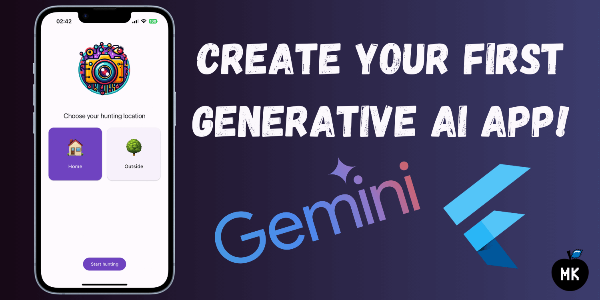
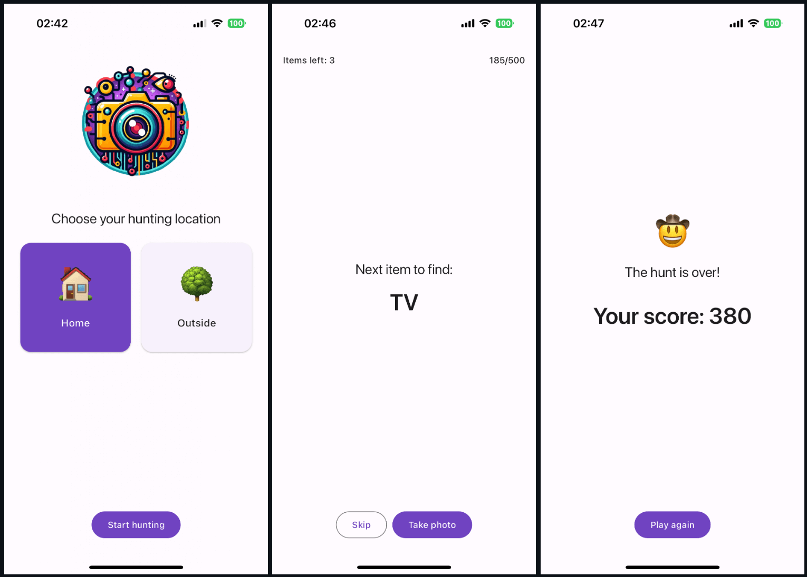
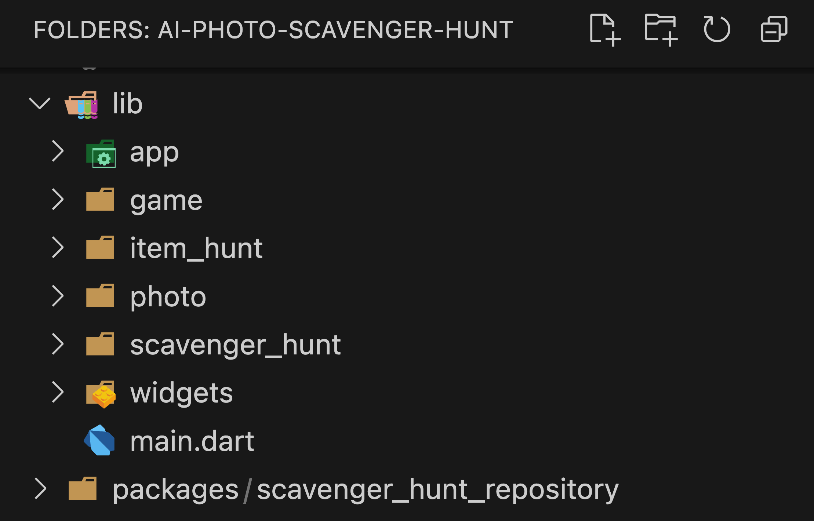
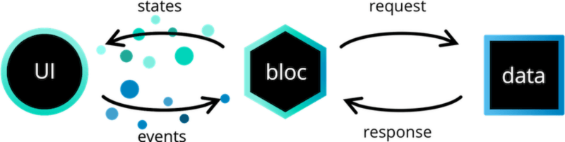
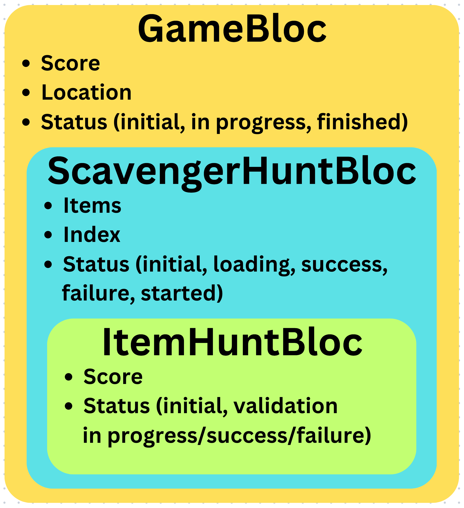
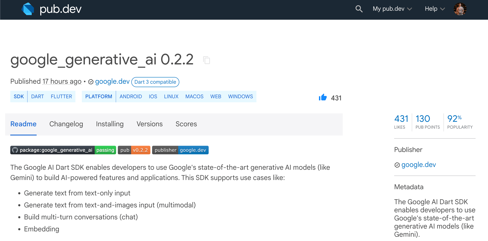
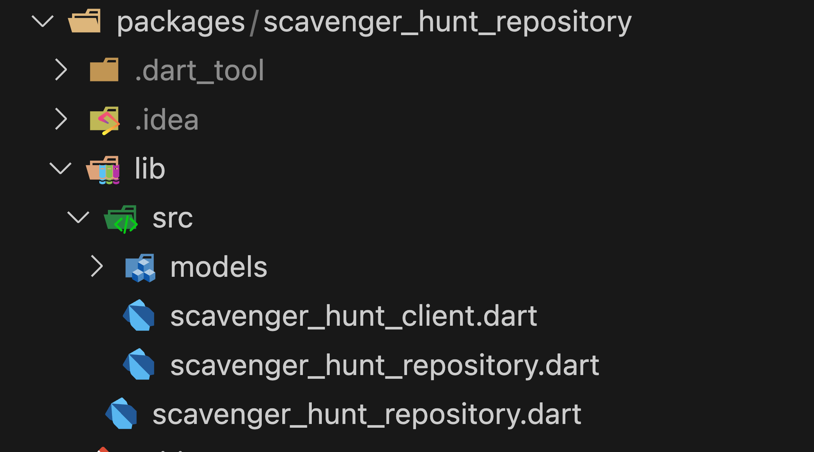

_Overview of the google_generative_ai package and how to use it to create a generative AI app using Gemini and Flutter._



Last month, the Flutter team announced a new Dart SDK - google_generative_ai. It enables developers to use Google's state-of-the-art generative AI models in their applications. In this article, we will dive into the journey of building my first AI-powered photo scavenger hunt game using the new AI Dart SDK, Gemini and Flutter.

<!--truncate-->

:::tip
If you prefer video content, check out the video version of this article on [YouTube](https://youtu.be/uMhfvicLRFw).
:::

## Game overview



The main idea of the game is simple. Choose your hunting location, AI generates a list of items that should be available there, and the hunt starts. Now, find the item, and take a photo of it. The AI validates the photo, and you either get points or need to try again. The game ends once all the items are found.

## Project structure

The project consists of the main app code and a separate package for integration with Gemini API. Even though the app is relatively small, I decided to split the code per feature. We will review them shortly.



In the app's entry point, we set up all the dependencies based on environment variables.

```dart title="main.dart"
void main() {
  final photoPicker = PhotoPicker(imagePicker: ImagePicker());

  late final ScavengerHuntRepository repository;

  if (const bool.fromEnvironment('USE_FAKE_DATA', defaultValue: false)) {
    repository = const FakeScavengerHuntRepository();
  } else {
    const apiKey = String.fromEnvironment('API_KEY');
    const projectUrl = String.fromEnvironment('VERTEX_AI_PROJECT_URL');

    final client = projectUrl.isEmpty
        ? ScavengerHuntClient(apiKey: apiKey)
        : ScavengerHuntClient.vertexAi(apiKey: apiKey, projectUrl: projectUrl);

    repository = ScavengerHuntRepository(client: client);
  }

  runApp(App(photoPicker: photoPicker, repository: repository));
}
```

You can see that it is possible to launch the app using fake data instead of real integration with Dart AI SDK, which is helpful for testing purposes. To do that, pass the `USE_FAKE_DATA` flag when launching the app, like this:

```bash
flutter run --dart-define USE_FAKE_DATA=true
```

The photo picker feature is responsible for taking a picture and making sure that the image bytes are ready to be passed to the API a bit later.

```dart title="photo_picker.dart"
class PhotoPicker {
  const PhotoPicker({
    required this.imagePicker,
  });

  final ImagePicker imagePicker;

  Future<Uint8List> takePhoto() async {
    try {
      final photo = await imagePicker.pickImage(source: ImageSource.camera);

      if (photo == null) throw const PhotoPickerException();

      final bytes = await photo.readAsBytes();

      return bytes;
    } on Exception {
      throw const PhotoPickerException();
    }
  }
}

class PhotoPickerException implements Exception {
  const PhotoPickerException();
}
```

## State management using BLoC

For state management, I used [flutter_bloc](https://pub.dev/packages/flutter_bloc).



Each application feature has a dedicated business logic component.



The `GameBloc` is responsible for tracking the game status, and storing the location of your hunt and the final result.

```dart title="game_bloc.dart"
class GameBloc extends Bloc<GameEvent, GameState> {
  GameBloc() : super(const GameState()) {
    on<GameStarted>(_onGameStarted);
    on<GameReset>(_onGameReset);
    on<GameLocationChanged>(_onGameLocationChanged);
    on<GameScoreUpdated>(_onScoreUpdated);
    on<GameFinished>(_onGameEnded);
  }

  void _onGameStarted(GameStarted event, Emitter<GameState> emit) {
    emit(state.copyWith(status: GameStatus.inProgress));
  }

  void _onGameReset(GameReset event, Emitter<GameState> emit) {
    emit(const GameState());
  }

  void _onGameLocationChanged(
    GameLocationChanged event,
    Emitter<GameState> emit,
  ) {
    emit(state.copyWith(location: event.location));
  }

  void _onScoreUpdated(GameScoreUpdated event, Emitter<GameState> emit) {
    emit(state.copyWith(score: state.score + event.score));
  }

  void _onGameEnded(GameFinished event, Emitter<GameState> emit) {
    emit(state.copyWith(status: GameStatus.finished));
  }
}
```

```dart title="game_event.dart"
sealed class GameEvent extends Equatable {
  const GameEvent();

  @override
  List<Object> get props => [];
}

final class GameStarted extends GameEvent {
  const GameStarted();
}

final class GameReset extends GameEvent {
  const GameReset();
}

final class GameLocationChanged extends GameEvent {
  const GameLocationChanged(this.location);

  final GameLocation location;

  @override
  List<Object> get props => [location];
}

final class GameScoreUpdated extends GameEvent {
  const GameScoreUpdated(this.score);

  final int score;

  @override
  List<Object> get props => [score];
}

final class GameFinished extends GameEvent {
  const GameFinished();
}
```

```dart title="game_state.dart"
enum GameStatus { initial, inProgress, finished }

final class GameState extends Equatable {
  const GameState({
    this.status = GameStatus.initial,
    this.score = 0,
    this.location,
  });

  final GameStatus status;
  final int score;
  final GameLocation? location;

  @override
  List<Object?> get props => [status, score, location];

  GameState copyWith({
    GameStatus? status,
    int? score,
    GameLocation? location,
  }) {
    return GameState(
      status: status ?? this.status,
      score: score ?? this.score,
      location: location ?? this.location,
    );
  }
}
```

Once the location is set, a `ScavengerHuntBloc` is initialised that loads and stores the hunt items.

```dart title="scavenger_hunt_bloc.dart"
class ScavengerHuntBloc extends Bloc<ScavengerHuntEvent, ScavengerHuntState> {
  ScavengerHuntBloc({
    required this.repository,
  }) : super(const ScavengerHuntState()) {
    on<ScavengerHuntLoadStarted>(_onLoadStarted);
    on<ScavengerHuntStarted>(_onStarted);
    on<ScavengerHuntIndexIncremented>(_onIndexIncremented);
  }

  final ScavengerHuntRepository repository;

  Future<void> _onLoadStarted(
    ScavengerHuntLoadStarted event,
    Emitter<ScavengerHuntState> emit,
  ) async {
    final location = event.location;

    if (location == null) return;

    emit(state.copyWith(status: ScavengerHuntStatus.loading));

    try {
      final items = await repository.loadHunt(location);

      emit(state.copyWith(status: ScavengerHuntStatus.success, items: items));
    } on ScavengerHuntRepositoryException {
      emit(state.copyWith(status: ScavengerHuntStatus.failure));
    }
  }

  void _onStarted(
    ScavengerHuntStarted event,
    Emitter<ScavengerHuntState> emit,
  ) {
    emit(state.copyWith(status: ScavengerHuntStatus.started));
  }

  void _onIndexIncremented(
    ScavengerHuntIndexIncremented event,
    Emitter<ScavengerHuntState> emit,
  ) {
    emit(state.copyWith(index: state.index + 1));
  }
}
```

```dart title="scavenger_hunt_event.dart"
sealed class ScavengerHuntEvent extends Equatable {
  const ScavengerHuntEvent();

  @override
  List<Object?> get props => [];
}

final class ScavengerHuntLoadStarted extends ScavengerHuntEvent {
  const ScavengerHuntLoadStarted(this.location);

  final GameLocation? location;

  @override
  List<Object?> get props => [location];
}

final class ScavengerHuntStarted extends ScavengerHuntEvent {
  const ScavengerHuntStarted();
}

final class ScavengerHuntIndexIncremented extends ScavengerHuntEvent {
  const ScavengerHuntIndexIncremented();
}
```

```dart title="scavenger_hunt_state.dart"
enum ScavengerHuntStatus { initial, loading, success, failure, started }

final class ScavengerHuntState extends Equatable {
  const ScavengerHuntState({
    this.status = ScavengerHuntStatus.initial,
    this.items = const [],
    this.index = 0,
  });

  final ScavengerHuntStatus status;
  final List<String> items;
  final int index;

  @override
  List<Object> get props => [status, items, index];

  ScavengerHuntState copyWith({
    ScavengerHuntStatus? status,
    List<String>? items,
    int? index,
  }) {
    return ScavengerHuntState(
      status: status ?? this.status,
      items: items ?? this.items,
      index: index ?? this.index,
    );
  }
}
```

For every item in the scavenger hunt, an `ItemHuntBloc` is used to track the hunt progress of a single item. This BLoC is responsible for taking a picture, validating it and calculating the score. For score calculation, we are using a stopwatch. The maximum score for finding an item is a hundred points. However, for every 5 seconds elapsed, you get a 5 point penalty.

```dart title="item_hunt_bloc.dart"
class ItemHuntBloc extends Bloc<ItemHuntEvent, ItemHuntState> {
  ItemHuntBloc({
    required this.photoPicker,
    required this.repository,
  }) : super(const ItemHuntState()) {
    on<ItemHuntItemFound>(_onItemFound);
    on<ItemHuntReset>(_onReset);
  }

  final PhotoPicker photoPicker;
  final ScavengerHuntRepository repository;

  final _stopwatch = Stopwatch();

  @override
  Future<void> close() async {
    _stopwatch.stop();

    super.close();
  }

  Future<void> _onItemFound(
    ItemHuntItemFound event,
    Emitter<ItemHuntState> emit,
  ) async {
    emit(state.copyWith(status: ItemHuntStatus.validationInProgress));

    try {
      final image = await photoPicker.takePhoto();

      _stopwatch.stop();

      final itemFound = await repository.validateImage(event.item, image);

      if (!itemFound) {
        return emit(state.copyWith(status: ItemHuntStatus.validationFailure));
      }

      // highlight-start
      final scorePenalty = _stopwatch.elapsedMilliseconds ~/ 5000 * 5;
      final score = 100 - math.min<int>(scorePenalty, 50);
      // highlight-end

      emit(
        state.copyWith(status: ItemHuntStatus.validationSuccess, score: score),
      );
    } on PhotoPickerException {
      emit(state.copyWith(status: ItemHuntStatus.validationFailure));
    } on ScavengerHuntRepositoryException {
      emit(state.copyWith(status: ItemHuntStatus.validationFailure));
    }
  }

  void _onReset(ItemHuntReset event, Emitter<ItemHuntState> emit) {
    if (event.resetTimer) _stopwatch.reset();

    _stopwatch.start();

    emit(const ItemHuntState());
  }
}
```

```dart title="item_hunt_event.dart"
sealed class ItemHuntEvent extends Equatable {
  const ItemHuntEvent();

  @override
  List<Object> get props => [];
}

final class ItemHuntItemFound extends ItemHuntEvent {
  const ItemHuntItemFound(this.item);

  final String item;

  @override
  List<Object> get props => [item];
}

final class ItemHuntReset extends ItemHuntEvent {
  const ItemHuntReset({
    this.resetTimer = true,
  });

  final bool resetTimer;

  @override
  List<Object> get props => [resetTimer];
}
```

```dart title="item_hunt_state.dart"
enum ItemHuntStatus {
  initial,
  validationInProgress,
  validationSuccess,
  validationFailure
}

final class ItemHuntState extends Equatable {
  const ItemHuntState({
    this.status = ItemHuntStatus.initial,
    this.score = 0,
  });

  final ItemHuntStatus status;
  final int score;

  @override
  List<Object> get props => [status, score];

  ItemHuntState copyWith({
    ItemHuntStatus? status,
    int? score,
  }) {
    return ItemHuntState(
      status: status ?? this.status,
      score: score ?? this.score,
    );
  }
}
```

Each feature contains a view widget that initiates the BLoC and covers all the different state views.

```dart title="item_hunt_view.dart"
class ItemHuntView extends StatelessWidget {
  const ItemHuntView({super.key});

  @override
  Widget build(BuildContext context) {
    return BlocProvider(
      create: (context) => ItemHuntBloc(
        photoPicker: context.read<PhotoPicker>(),
        repository: context.read<ScavengerHuntRepository>(),
      )..add(const ItemHuntReset()),
      child: const _View(),
    );
  }
}

class _View extends StatelessWidget {
  const _View();

  @override
  Widget build(BuildContext context) {
    return BlocSelector<ItemHuntBloc, ItemHuntState, ItemHuntStatus>(
      selector: (state) => state.status,
      builder: (context, status) => switch (status) {
        ItemHuntStatus.initial => const ItemPendingView(),
        ItemHuntStatus.validationInProgress => const ItemValidatingView(),
        ItemHuntStatus.validationSuccess => const ItemValidationSuccessView(),
        ItemHuntStatus.validationFailure => const ItemValidationFailureView(),
      },
    );
  }
}
```

Ok, I know that you **LOVE** talking about state management, but that was it for this tutorial. Let’s get to the juicy part - generative AI and how to use it in our Dart and Flutter projects.

## Using the google_generative_ai package

The [google_generative_ai](https://pub.dev/packages/google_generative_ai) package simplifies the process of using Google’s generative AI models by providing a unified way to pass prompts and receive responses.



In the app, I created a dedicated Dart package and added the google_generative_ai as a dependency there.

```yaml title="pubspec.yaml"
name: scavenger_hunt_repository
description: "A repository for scavenger hunt data and image validation using Google AI Dart SDK."
publish_to: "none"
version: 1.0.0+1

environment:
  sdk: ">=3.3.0 <4.0.0"

dependencies:
  // highlight-next-line
  google_generative_ai: ^0.2.2
  http: ^1.2.1

dev_dependencies:
  flutter_lints: ^3.0.0
```

The package consists of two main classes - `ScavengerHuntRepository` and `ScavengerHuntClient`.



The repository class is used by the app. It is responsible for calling the Gemini API, validating results and passing them to the business logic components.

```dart title="scavenger_hunt_repository.dart"
class ScavengerHuntRepository {
  const ScavengerHuntRepository({
    required ScavengerHuntClient client,
  }) : _client = client;

  final ScavengerHuntClient _client;

  Future<List<String>> loadHunt(GameLocation gameLocation) async {
    final location = switch (gameLocation) {
      GameLocation.home => 'at home',
      GameLocation.outside => 'outside',
    };

    try {
      final response = await _client.generateScavengerHuntItems(location);

      if (response == null) {
        throw const ScavengerHuntRepositoryException('Response is empty');
      }

      if (jsonDecode(response) case {'items': List<dynamic> items}) {
        return List<String>.from(items);
      }

      throw const ScavengerHuntRepositoryException('Invalid JSON schema');
    } on GenerativeAIException {
      throw const ScavengerHuntRepositoryException(
        'Problem with the Generative AI service',
      );
    } catch (e) {
      if (e is ScavengerHuntRepositoryException) rethrow;

      throw const ScavengerHuntRepositoryException();
    }
  }

  Future<bool> validateImage(String item, Uint8List image) async {
    try {
      final response = await _client.validateImage(item, image);

      if (response == null) {
        throw const ScavengerHuntRepositoryException('Response is empty');
      }

      if (jsonDecode(response) case {'valid': bool valid}) return valid;

      throw const ScavengerHuntRepositoryException('Invalid JSON schema');
    } on GenerativeAIException {
      throw const ScavengerHuntRepositoryException(
        'Problem with the Generative AI service',
      );
    } catch (e) {
      if (e is ScavengerHuntRepositoryException) rethrow;

      throw const ScavengerHuntRepositoryException();
    }
  }
}

class ScavengerHuntRepositoryException implements Exception {
  const ScavengerHuntRepositoryException([this.message = 'Unkown problem']);

  final String message;

  @override
  String toString() => 'ScavengerHuntRepositoryException: $message';
}
```

Also, a fake version of the repository is created for testing purposes.

```dart title="scavenger_hunt_repository.dart"
class FakeScavengerHuntRepository implements ScavengerHuntRepository {
  const FakeScavengerHuntRepository();

  @override
  Future<List<String>> loadHunt(GameLocation location) async {
    await Future.delayed(const Duration(seconds: 2));

    return switch (location) {
      GameLocation.home => const ['Couch', 'Table', 'TV', 'Lamp', 'Book'],
      GameLocation.outside => const ['Tree', 'Bench', 'Car', 'Mailbox', 'Bird'],
    };
  }

  @override
  Future<bool> validateImage(String item, Uint8List image) async {
    await Future.delayed(const Duration(seconds: 2));

    return Random().nextDouble() < 0.8;
  }

  @override
  // ignore: unused_element
  ScavengerHuntClient get _client => throw UnimplementedError();
}
```

The main AI magic lives in the `ScavengerHuntClient` class. First of all, the class has two constructors - a default one that needs only an API key and a Vertex AI one that also expects a project URL.

```dart title="scavenger_hunt_client.dart"
class ScavengerHuntClient {
  // highlight-start
  ScavengerHuntClient({
    required String apiKey,
  }) : _model = GenerativeModel(
          model: 'gemini-pro-vision',
          apiKey: apiKey,
        );

  ScavengerHuntClient.vertexAi({
    required String apiKey,
    required String projectUrl,
  }) : _model = GenerativeModel(
          model: 'gemini-pro-vision',
          apiKey: apiKey,
          httpClient: VertexHttpClient(projectUrl),
        );
  // highlight-end

  final GenerativeModel _model;

  Future<String?> generateScavengerHuntItems(String location) async {
    final prompt =
        'You are a scavenger hunt game where objects are found by taking a photo of them.'
        'Generate a list of 5 items that could be found in the following location: $location.'
        'The difficulty to find the items should be easy, but some items could be a little bit more difficult to find.'
        'Keep the item name concise. All letters should be uppercase. Do not include articles (a, an, the).'
        'Provide your response as a JSON object with the following schema: {"items": ["", "", ...]}"'
        'Do not return your result as Markdown.';

    final response = await _model.generateContent([Content.text(prompt)]);

    return response.text;
  }

  Future<String?> validateImage(String item, Uint8List image) async {
    final prompt =
        'You are a scavenger hunt game where objects are found by taking a photo of them.'
        'You have been given the item "$item" and a photo of the item.'
        'Determine if the photo is a valid photo of the item.'
        'Provide your response as a JSON object with the following schema: {"valid": true/false}'
        'Do not return your result as Markdown.';

    final response = await _model.generateContent([
      Content.multi([TextPart(prompt), DataPart('image/jpeg', image)]),
    ]);

    return response.text;
  }
}

// This class is borrowed from here:
// https://github.com/leancodepl/arb_translate/blob/main/lib/src/translation_delegates/gemini_translation_delegate.dart#L233
class VertexHttpClient extends BaseClient {
  VertexHttpClient(this._projectUrl);

  final String _projectUrl;
  final _client = Client();

  @override
  Future<StreamedResponse> send(BaseRequest request) {
    if (request is! Request ||
        request.url.host != 'generativelanguage.googleapis.com') {
      return _client.send(request);
    }

    final vertexRequest = Request(
      request.method,
      Uri.parse(
        request.url.toString().replaceAll(
              'https://generativelanguage.googleapis.com/v1/models',
              _projectUrl,
            ),
      ),
    )..bodyBytes = request.bodyBytes;

    for (final header in request.headers.entries) {
      if (header.key != 'x-goog-api-key') {
        vertexRequest.headers[header.key] = header.value;
      }
    }

    vertexRequest.headers['Authorization'] =
        'Bearer ${request.headers['x-goog-api-key']}';

    return _client.send(vertexRequest);
  }
}
```

If you live in the region where Gemini API is already available, just use the default constructor and only pass the `API_KEY` when launching the app.

```bash
flutter run --dart-define API_KEY=$GOOGLE_API_KEY
```

:::info
Instructions on how to get your API key is provided in the official [Gemini API documentation](https://ai.google.dev/tutorials/setup).
:::

If you are from a region where Gemini API is not directly accessible, you can still access generative AI models through Google Cloud, just it takes a bit more setup. First, create a Google Cloud project by following the instructions in the [Vertex AI documentation](https://cloud.google.com/vertex-ai/generative-ai/docs/start/quickstarts/api-quickstart). Then, generate your API key using Google Cloud CLI.

```bash
gcloud auth print-access-token
```

Finally, build your project URL that should look like this:

```
https://{region}-aiplatform.googleapis.com/v1/projects/{project-id}/locations/{region}/publishers/google/models
```

When launching the app, pass the API key and a project URL.

```bash
flutter run --dart-define API_KEY=$GOOGLE_API_KEY --dart-define VERTEX_AI_PROJECT_URL=$VERTEX_AI_PROJECT_URL
```

## Prompt engineering

The first API call we do in the app is for generating scavenger hunt items based on the selected location. All we need to do is prepare a prompt, call the `generateContent` method from the SDK by passing it as text content and return the result as text.

```dart title="scavenger_hunt_client.dart"
// <...>

Future<String?> generateScavengerHuntItems(String location) async {
  final prompt =
      'You are a scavenger hunt game where objects are found by taking a photo of them.'
      'Generate a list of 5 items that could be found in the following location: $location.'
      'The difficulty to find the items should be easy, but some items could be a little bit more difficult to find.'
      'Keep the item name concise. All letters should be uppercase. Do not include articles (a, an, the).'
      'Provide your response as a JSON object with the following schema: {"items": ["", "", ...]}"'
      'Do not return your result as Markdown.';

  final response = await _model.generateContent([Content.text(prompt)]);

  return response.text;
}

// <...>
```

Honestly, the most challenging part of this code is building the right prompt. After some trial and error, I found that this structure worked the best with some random hiccups from time to time.

```plaintext
You are a scavenger hunt game where objects are found by taking a photo of them.
Generate a list of 5 items that could be found in the following location: $location.
The difficulty to find the items should be easy, but some items could be a little bit more difficult to find.
Keep the item name concise. All letters should be uppercase. Do not include articles (a, an, the).
Provide your response as a JSON object with the following schema: {"items": ["", "", ...]}.
Do not return your result as Markdown.
```

First, we set the role for the AI so that it could play along.

```plaintext
// highlight-next-line
You are a scavenger hunt game where objects are found by taking a photo of them.
Generate a list of 5 items that could be found in the following location: $location.
The difficulty to find the items should be easy, but some items could be a little bit more difficult to find.
Keep the item name concise. All letters should be uppercase. Do not include articles (a, an, the).
Provide your response as a JSON object with the following schema: {"items": ["", "", ...]}.
Do not return your result as Markdown.
```

Then, we specify the task and add some context that the Gemini should handle. In this case, we ask to generate a list of 5 items, but not all of them should be equally easy to find.

```plaintext
You are a scavenger hunt game where objects are found by taking a photo of them.
// highlight-start
Generate a list of 5 items that could be found in the following location: $location.
The difficulty to find the items should be easy, but some items could be a little bit more difficult to find.
// highlight-end
Keep the item name concise. All letters should be uppercase. Do not include articles (a, an, the).
Provide your response as a JSON object with the following schema: {"items": ["", "", ...]}.
Do not return your result as Markdown.
```

Finally, we specify the rules and the structure of the response. The result should be a JSON string that contains a list of short, upper-cased scavenger hunt items.

```plaintext
You are a scavenger hunt game where objects are found by taking a photo of them.
Generate a list of 5 items that could be found in the following location: $location.
The difficulty to find the items should be easy, but some items could be a little bit more difficult to find.
// highlight-start
Keep the item name concise. All letters should be uppercase. Do not include articles (a, an, the).
Provide your response as a JSON object with the following schema: {"items": ["", "", ...]}.
Do not return your result as Markdown.
// highlight-end
```

The logic for validating an image is pretty similar. However, in this case, we also need to pass an image, thus we are using a multi-part content object that allows us to send a prompt and an image as a single request to the Gemini API.

```dart title="scavenger_hunt_client.dart"
// <...>

Future<String?> validateImage(String item, Uint8List image) async {
  final prompt =
      'You are a scavenger hunt game where objects are found by taking a photo of them.'
      'You have been given the item "$item" and a photo of the item.'
      'Determine if the photo is a valid photo of the item.'
      'Provide your response as a JSON object with the following schema: {"valid": true/false}'
      'Do not return your result as Markdown.';

  final response = await _model.generateContent([
    Content.multi([TextPart(prompt), DataPart('image/jpeg', image)]),
  ]);

  return response.text;
}

// <...>
```

The prompt structure is identical to the previous one, just the task is different - we ask to match the item with its photo and return either true or false.

```plaintext
You are a scavenger hunt game where objects are found by taking a photo of them.
You have been given the item "$item" and a photo of the item.
Determine if the photo is a valid photo of the item.
Provide your response as a JSON object with the following schema: {"valid": true/false}.
Do not return your result as Markdown.
```

## Summary

The final result is an AI-powered photo scavenger hunt game. Honestly, when building the app I didn’t feel that I was working with AI specifically. The whole code structure is similar to any other public API in the world, but the result is somehow different every single time. The fact that with minimal AI experience, I managed to build this app over the weekend shows that the new AI Dart SDK truly boosts your productivity, and not using generative AI models to solve problems in your app should not be an excuse anymore.


If you want to dive deeper into the code, you can find the full source code on [GitHub](https://github.com/mkobuolys/ai-photo-scavenger-hunt). In case of any questions or suggestions - feel free to reach out to me on [X](https://x.com/mkobuolys) or any other social media channel.
