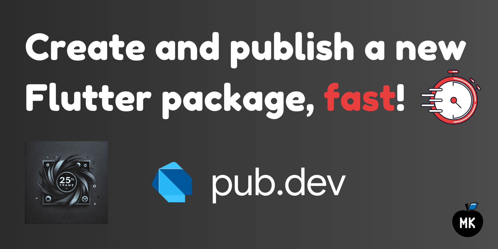
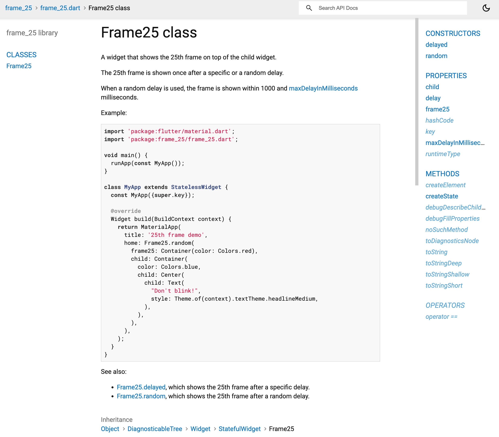
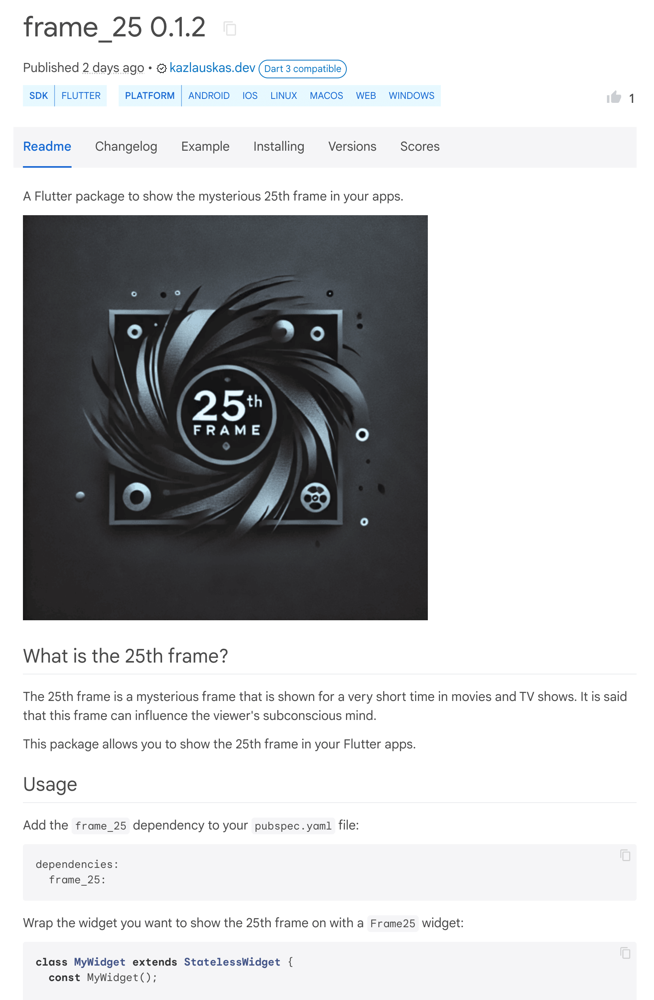
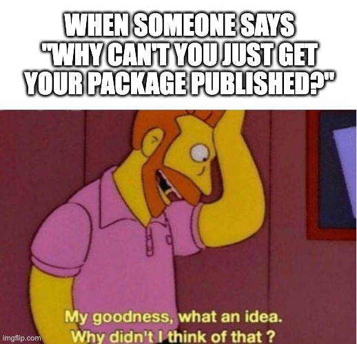
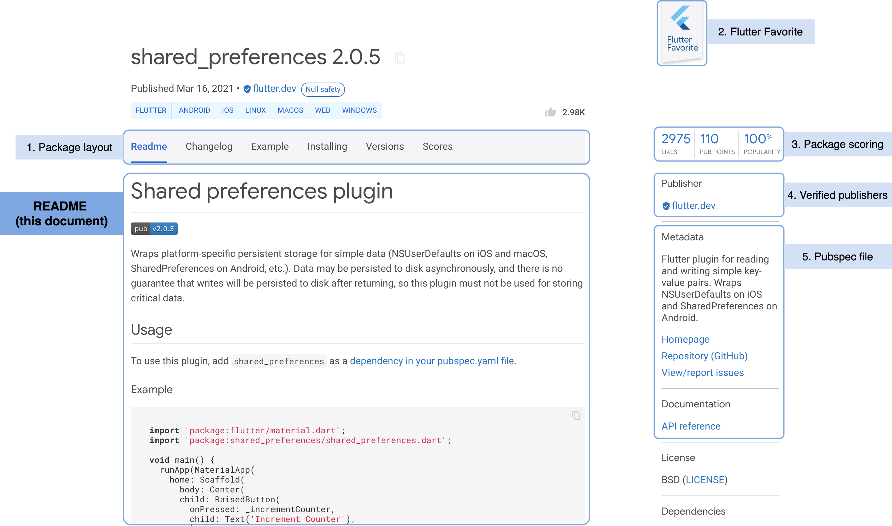

_A step-by-step guide on how to create and publish a new Flutter package to pub.dev, fast and easy._



Have you ever wanted to create a new Flutter package and publish it to [pub.dev](https://pub.dev/) but were unsure how to do it? In this article, I will show you how to do so in just two hours.

<!--truncate-->

## What's cooking?


We will create and publish a Flutter package called `frame_25`, that shows the mysterious 25th frame in your apps.

:::tip[What is the 25th frame?]
The 25th frame is a hidden frame shown for a very short time in movies, TV shows, and advertisements. It is used to display a message or image that is not visible to the naked eye but can be seen by the subconscious mind. The 25th frame is used to influence the viewer's behaviour or to convey a hidden message.
:::

Honestly, it does not sound like a useful package, but it is a fun project demonstrating all the steps needed to create and publish a new Flutter package to pub.dev. Let's get started!

## Create a new Flutter package (1 hour)


If you have used Flutter before, you know that to create a new Flutter project, you need to run the following command in the terminal:

```bash
flutter create my_package
```

However, since you are creating a package, you need to use the specific `package` template:

```bash
flutter create -t package my_package
```

This command will create a new Flutter package called `my_package` in the current directory. You should replace `my_package` with the name of your package. The command creates the following file structure:

```plaintext
my_package/
  lib/
    my_package.dart
  test/
    my_package_test.dart
  analysis_options.yaml
  CHANGELOG.md
  pubspec.yaml
  README.md
  LICENSE
```

TL;DR version of the generated files and directories:

- `lib/` - this is where the source code of your package goes.
- `test/` - tests, tests, tests! You should write tests for your package to ensure that it works correctly.
- `analysis_options.yaml` - linting rules for the whole project.
- `CHANGELOG.md` - a file to keep track of changes in your package. You should update it every time you release a new version of your package.
- `pubspec.yaml` - **the most important file**. It contains metadata about your package, such as its name, version, dependencies, and other information.
- `README.md` - a file that describes your package. It is used as the main page of your package on pub.dev.
- `LICENSE`\* - actually, this file is not generated by default, but it is a good practice to add it yourself. The Dart team recommends using an [OSI-approved license](https://opensource.org/licenses), so that others can reuse your work.

:::info
For more information about the recommended structure of a pub package, check out the [official Dart documentation](https://dart.dev/tools/pub/package-layout).
:::

We will cover the metadata files shortly. For now, let's focus on the source code of the package.

### Implementing the package

Of course, this section varies depending on the package you are creating. In our case, we will create a simple package that shows the mysterious 25th frame on top of the content for a short time - `frame_25`. We will use this name throughout this article.

:::tip
It is a good practice to keep the package simple and focused on a single task. This way, it is easier to maintain and use the package.
:::

For simple packages, the following file structure is recommended:

```plaintext
lib/
  frame_25.dart
  src/
    frame_25.dart
```

The `lib/frame_25.dart` file should specify the public API of your package a.k.a. file exports:

```dart title="lib/frame_25.dart"
export 'src/frame_25.dart';
```

:::info
Only the files that are exported in the `lib/frame_25.dart` file are accessible to the users of your package.
:::

Then, the actual implementation of the package should go into the `lib/src/frame_25.dart` file:

```dart title="lib/src/frame_25.dart"
import 'dart:async';
import 'dart:math';

import 'package:flutter/widgets.dart';

class Frame25 extends StatefulWidget {
  const Frame25._({
    required this.delay,
    required this.frame25,
    required this.child,
    this.maxDelayInMilliseconds = 10000,
    super.key,
  }) : assert(
          maxDelayInMilliseconds > 0,
          'maxDelayInMilliseconds must be greater than 0',
        );

  const Frame25.delayed({
    required Duration delay,
    required Widget frame25,
    required Widget child,
    Key? key,
  }) : this._(
          delay: delay,
          frame25: frame25,
          child: child,
          key: key,
        );

  const Frame25.random({
    required Widget frame25,
    required Widget child,
    int maxDelayInMilliseconds = 10000,
    Key? key,
  }) : this._(
          delay: null,
          maxDelayInMilliseconds: maxDelayInMilliseconds,
          frame25: frame25,
          child: child,
          key: key,
        );

  final Duration? delay;
  final int maxDelayInMilliseconds;
  final Widget frame25;
  final Widget child;

  @override
  State<Frame25> createState() => _Frame25State();
}

class _Frame25State extends State<Frame25> with WidgetsBindingObserver {
  final _frame25DelayInMilliseconds = (1 / 24 * 1000).round();
  var _frameVisible = false;

  @override
  void initState() {
    super.initState();

    final delay = widget.delay ??
        Duration(
          milliseconds: Random().nextInt(widget.maxDelayInMilliseconds) + 1000,
        );

    Future.delayed(delay, () => _setFrameVisible(true));
  }

  void _setFrameVisible(bool value) {
    if (_frameVisible == value) return;

    if (value) return setState(() => _frameVisible = value);

    Future.delayed(Duration(milliseconds: _frame25DelayInMilliseconds), () {
      if (mounted) setState(() => _frameVisible = value);
    });
  }

  @override
  Widget build(BuildContext context) {
    WidgetsBinding.instance.addPostFrameCallback(
      (_) => _setFrameVisible(false),
    );

    return Stack(
      children: <Widget>[
        widget.child,
        if (_frameVisible) widget.frame25,
      ],
    );
  }
}
```

:::tip
For more information about the organization of the package code, check out the [official Dart documentation](https://dart.dev/guides/libraries/create-packages#organizing-a-package).
:::

Let's break down the implementation:

```dart title="Constructors & properties"
class Frame25 extends StatefulWidget {
  const Frame25._({
    required this.delay,
    required this.frame25,
    required this.child,
    this.maxDelayInMilliseconds = 10000,
    super.key,
  }) : assert(
          maxDelayInMilliseconds > 0,
          'maxDelayInMilliseconds must be greater than 0',
        );

  const Frame25.delayed({
    required Duration delay,
    required Widget frame25,
    required Widget child,
    Key? key,
  }) : this._(
          delay: delay,
          frame25: frame25,
          child: child,
          key: key,
        );

  const Frame25.random({
    required Widget frame25,
    required Widget child,
    int maxDelayInMilliseconds = 10000,
    Key? key,
  }) : this._(
          delay: null,
          maxDelayInMilliseconds: maxDelayInMilliseconds,
          frame25: frame25,
          child: child,
          key: key,
        );

  final Duration? delay;
  final int maxDelayInMilliseconds;
  final Widget frame25;
  final Widget child;

  @override
  State<Frame25> createState() => _Frame25State();
}
```

The `Frame25` widget contains 4 properties:

- `delay` - the delay before the frame is shown.
- `maxDelayInMilliseconds` - the maximum delay before the frame is shown. Only used in the `Frame25.random` constructor.
- `frame25` - the 25th frame to show - widget that is shown on top of the content.
- `child` - the content of the screen.

Also, the widget can be initiated using 2 different constructors:

- `Frame25.delayed` - shows the frame after a specified delay (in milliseconds).
- `Frame25.random` - shows the frame after a random delay (up to `maxDelayInMilliseconds`).

Now, let's take a look at the state of the widget:

```dart title="The main logic of the widget"
class _Frame25State extends State<Frame25> with WidgetsBindingObserver {
  final _frame25DelayInMilliseconds = (1 / 24 * 1000).round();
  var _frameVisible = false;

  @override
  void initState() {
    super.initState();

    final delay = widget.delay ??
        Duration(
          milliseconds: Random().nextInt(widget.maxDelayInMilliseconds) + 1000,
        );

    // highlight-next-line
    Future.delayed(delay, () => _setFrameVisible(true));
  }

  // highlight-start
  void _setFrameVisible(bool value) {
    if (_frameVisible == value) return;

    if (value) return setState(() => _frameVisible = value);

    Future.delayed(Duration(milliseconds: _frame25DelayInMilliseconds), () {
      if (mounted) setState(() => _frameVisible = value);
    });
  }
  // highlight-end

  @override
  Widget build(BuildContext context) {
    // highlight-start
    WidgetsBinding.instance.addPostFrameCallback(
      (_) => _setFrameVisible(false),
    );
    // highlight-end

    return Stack(
      children: <Widget>[
        widget.child,
        if (_frameVisible) widget.frame25,
      ],
    );
  }
}
```

The most important parts of the code are highlighted above. This is how the `Frame25` widget works:

1. In the `initState` method, the widget is initialized. If the `delay` property is not specified, a random delay is generated. After the delay, the `_setFrameVisible` method is called to show the frame.
2. The widget is built for the first time, and the `_setFrameVisible(false)` is called to hide the frame. However, it has no effect because the frame is not visible yet.
3. After the delay, the `_setFrameVisible(true)` is called to show the frame.
4. The widget is built again, and the frame is shown on top of the content. At the same time, the `_setFrameVisible(false)` is scheduled again to hide the frame after a short time. Now, it actually executes the code and the frame is hidden on the next widget rebuild.
5. For the next widget rebuilds (if there are any), the 25th frame is not shown anymore and the package does not bring any side effects to the UI.

The whole _magic_ of the package relies on the trick of using the `WidgetsBinding.instance.addPostFrameCallback()` at the beginning of the `build` method to schedule the hiding of the frame immediately after it is shown. In our case, that is exactly what we want!

:::info
To learn more about the `WidgetsBinding` and the `addPostFrameCallback` method, check out the [official Flutter documentation](https://api.flutter.dev/flutter/scheduler/SchedulerBinding/addPostFrameCallback.html).
:::

### Adding tests

The main difference between creating a package and a regular Flutter app is that your code will be used by other developers. Therefore, it is crucial to write tests for your package to ensure that it works as expected. Also, tests may boost the confidence of the developers to use your package in their projects or even contribute to it!

For the package, we will write two simple tests to ensure that the `Frame25` widget works as expected. The first test checks if the `Frame25.random` constructor throws an assertion error when the `maxDelayInMilliseconds` is less than or equal to 0:

```dart title="test/frame_25_test.dart"
import 'package:flutter/material.dart';
import 'package:flutter_test/flutter_test.dart';
import 'package:frame_25/frame_25.dart';

void main() {
  group('Frame25', () {
    group('when maxDelayInMilliseconds is <= 0', () {
      testWidgets('should throw assertion error', (tester) async {
        expect(
          () => Frame25.random(
            maxDelayInMilliseconds: 0,
            frame25: const Text(''),
            child: const SizedBox.shrink(),
          ),
          throwsA(
            isA<AssertionError>().having(
              (e) => e.message,
              'message',
              'maxDelayInMilliseconds must be greater than 0',
            ),
          ),
        );
      });
    });

    // <...>
  });
}
```

The second test checks the actual behavior of the `Frame25` widget:

- Once the widget is built, the 25th frame should not be visible.
- After the specified delay, the 25th frame should be visible.
- The next frame, the 25th frame should be hidden again.

```dart title="test/frame_25_test.dart"
import 'package:flutter/material.dart';
import 'package:flutter_test/flutter_test.dart';
import 'package:frame_25/frame_25.dart';

void main() {
  group('Frame25', () {
    // <...>

    testWidgets('should show the 25th frame', (tester) async {
      const delay = Duration(seconds: 1);
      final frame25Delay = Duration(milliseconds: (1 / 24 * 1000).round());
      const text = '25th frame';

      await tester.pumpWidget(
        const MaterialApp(
          home: Frame25.delayed(
            delay: delay,
            frame25: Text(text),
            child: SizedBox.shrink(),
          ),
        ),
      );

      expect(find.text(text), findsNothing);

      await tester.pump(delay);

      expect(find.text(text), findsOneWidget);

      await tester.pump(frame25Delay);

      expect(find.text(text), findsNothing);
    });
  });
}
```

That's it for the technical part of the package. Next, we should add documentation.

## Add documentation (30 minutes)


Same as with tests, documentation is crucial for the package. It helps other developers to understand how to use the package, what it does, and how it works. The documentation should be clear, concise, and easy to understand. There are two types of documentation when creating a new Flutter package: **code documentation** and **README.md**.

### Code documentation

Code documentation is used to describe the classes, methods, and properties of the package. It is written directly in the code using comments. These comments are used to generate the API documentation for the package.

For the `frame_25` package, we will add documentation to the `Frame25` widget:

````dart title="lib/src/frame_25.dart"
/// A widget that shows the 25th frame on top of the child widget.
///
/// The 25th frame is shown once after a specific or a random delay.
///
/// When a random delay is used, the frame is shown within 1000 and
/// [maxDelayInMilliseconds] milliseconds.
///
/// Example:
///
/// ```dart
/// import 'package:flutter/material.dart';
/// import 'package:frame_25/frame_25.dart';
///
/// void main() {
///   runApp(const MyApp());
/// }
///
/// class MyApp extends StatelessWidget {
///   const MyApp({super.key});
///
///   @override
///   Widget build(BuildContext context) {
///     return MaterialApp(
///       title: '25th frame demo',
///       home: Frame25.random(
///         frame25: Container(color: Colors.red),
///         child: Container(
///           color: Colors.blue,
///           child: Center(
///             child: Text(
///               "Don't blink!",
///               style: Theme.of(context).textTheme.headlineMedium,
///             ),
///           ),
///         ),
///       ),
///     );
///   }
/// }
/// ```
///
/// See also:
/// - [Frame25.delayed], which shows the 25th frame after a specific delay.
/// - [Frame25.random], which shows the 25th frame after a random delay.
class Frame25 extends StatefulWidget {
  const Frame25._({
    required this.delay,
    required this.frame25,
    required this.child,
    this.maxDelayInMilliseconds = 10000,
    super.key,
  }) : assert(
          maxDelayInMilliseconds > 0,
          'maxDelayInMilliseconds must be greater than 0',
        );

  /// Shows the 25th frame after a specific delay.
  ///
  /// The [delay] parameter must not be null.
  const Frame25.delayed({
    required Duration delay,
    required Widget frame25,
    required Widget child,
    Key? key,
  }) : this._(
          delay: delay,
          frame25: frame25,
          child: child,
          key: key,
        );

  /// Shows the 25th frame after a random delay.
  ///
  /// If [maxDelayInMilliseconds] is not provided, the delay is between 1000 and
  /// 10000 milliseconds. The [maxDelayInMilliseconds] must be greater than 0.
  const Frame25.random({
    required Widget frame25,
    required Widget child,
    int maxDelayInMilliseconds = 10000,
    Key? key,
  }) : this._(
          delay: null,
          maxDelayInMilliseconds: maxDelayInMilliseconds,
          frame25: frame25,
          child: child,
          key: key,
        );

  /// The delay before the frame is shown.
  final Duration? delay;

  /// The maximum delay before the frame is shown.
  final int maxDelayInMilliseconds;

  /// The 25th frame to show.
  final Widget frame25;

  /// The child widget.
  final Widget child;

  @override
  State<Frame25> createState() => _Frame25State();
}

// <...>
````

It is recommended to add documentation to all classes, methods, and properties of the package that are part of the public API. To ensure that, make sure that the `public_member_api_docs` lint rule is enabled in the `analysis_options.yaml` file:

```yaml title="analysis_options.yaml"
linter:
  rules:
    - public_member_api_docs
```

Also, the comments support markdown syntax, so you can use it to add links, code snippets, and other formatting to the documentation. To see how the generated API documentation looks like, you can run the following commands in the terminal to generate the documentation and open it in the browser:

```bash
dart doc
dart pub global activate dhttpd # if you don't have it installed yet
dart pub global run dhttpd --path doc/api
```

The generated API documentation should look like this:



:::tip
To learn the best practices for writing code documentation in Dart, check out the [official Dart documentation](https://dart.dev/effective-dart/documentation).
:::

### README.md

> People who find your package on pub.dev are likely to quickly scan the README when deciding whether to try your package. A good README catches the reader's attention and shows that your package is worth trying.
>
> \- Dart documentation

Consider the `README.md` file as a landing page for your package on pub.dev. It should contain all the information about the package, such as its name, description, usage examples, installation instructions, and other important details.

A complete list of tips for writing a good `README.md` file can be found [here](https://dart.dev/tools/pub/writing-package-pages#writing-a-good-readme-is-important), but here is a short summary:

- Put a short package description at the top of the file.
- Include visual content, such as screenshots, examples, or GIFs for more engaging content.
- Include usage examples and code snippets to show how the package works. Make sure to use Dart code formatting.
- If the package has any special requirements or limitations, mention them at the beginning of the document.

This is the `README.md` file for the `frame_25` package:

````markdown title="README.md"
A Flutter package to show the mysterious 25th frame in your apps.


## What is the 25th frame?

The 25th frame is a mysterious frame that is shown for a very short time in movies and TV shows. It is said that this frame can influence the viewer's subconscious mind.

This package allows you to show the 25th frame in your Flutter apps.

## Usage

Add the `frame_25` dependency to your `pubspec.yaml` file:

```yaml
dependencies:
  frame_25:
```

Wrap the widget you want to show the 25th frame on with a `Frame25` widget:

```dart
class MyWidget extends StatelessWidget {
  const MyWidget();

  @override
  Widget build(BuildContext context) {
    return Frame25.random(
      frame25: Container(color: Colors.red),
      maxDelayInMilliseconds: 3000,
      child: const ColoredBox(
        color: Colors.blue,
        child: Center(
          child: Text("Don't blink!"),
        ),
      ),
    );
  }
}
```

If you want to show the 25th frame after a specific delay, you can use the `Frame25.delayed` constructor:

```dart
class MyWidget extends StatelessWidget {
  const MyWidget();

  @override
  Widget build(BuildContext context) {
    return Frame25.delayed(
      frame25: Container(color: Colors.red),
      delay: const Duration(milliseconds: 3000),
      child: const ColoredBox(
        color: Colors.blue,
        child: Center(
          child: Text("Don't blink!"),
        ),
      ),
    );
  }
}
```
````

And this is how the `README.md` file looks like on pub.dev:



The code and documentation are ready. Now, let's focus on the steps needed to prepare the package for publishing.

## Prepare the package for publishing (15 minutes)



Before publishing a new package to pub.dev, you need to take care of the package metadata, versioning, and other important details. Luckily, all the metadata that is needed for the package is stored in a single file - `pubspec.yaml`. This file contains information about the package, such as its name, version, description, dependencies, and other important details:

```yaml title="pubspec.yaml"
name: frame_25
description: A Flutter package to show the mysterious 25th frame in your apps.
version: 0.1.1
homepage: https://github.com/mkobuolys/frame_25
repository: https://github.com/mkobuolys/frame_25
issue_tracker: https://github.com/mkobuolys/frame_25/issues
funding:
  - https://github.com/sponsors/mkobuolys
screenshots:
  - description: The 25th frame package logo.
    path: images/logo.png
topics:
  - flutter
  - ui
  - widget

environment:
  sdk: ">=3.0.0 <4.0.0"
  flutter: ">=1.17.0"

dependencies:
  flutter:
    sdk: flutter

dev_dependencies:
  flutter_test:
    sdk: flutter
  very_good_analysis: ^6.0.0
```

The following fields are used as the package metadata:

- `name` and `description` are self-explanatory - they specify the name and description of the package.
- `version` is the newest version of the package. You should increment it every time you publish a new package version to pub.dev.
- `homepage` - a link to the package's homepage. It can be a GitHub repository, a website, or any other URL.
- `repository` and `issue_tracker` - links to the repository and the issue tracker of the package. Using the GitHub links here is always a good idea.
- `funding` - a link to the funding page of the package. You can use GitHub sponsors, Buy Me a Coffee, or any other funding platform links.
- `screenshots` - a list of screenshots of the package that will be displayed on pub.dev package page.
- `topics` - a list of topics that describe the package. You can use any topics you want, but I would recommend checking the [most popular topics](https://pub.dev/topics) first to increase the visibility of your package.

The `pub.dev` website uses this information to display the package information, like this:



The `environment` field specifies the minimum Dart and Flutter SDK versions that are required to use the package. You should always specify the minimum versions to ensure that the package works correctly.

The `dependencies` and `dev_dependencies` fields do not differ from any other Flutter project. You should specify the dependencies that are needed to build, run and test the package.

:::info
To see the full list of supported fields in the `pubspec.yaml` file, check out the [official pubspec documentation](https://dart.dev/tools/pub/pubspec).
:::

## Publish the package to pub.dev (15 minutes)


Finally, it is time to publish the package to pub.dev. It's important to note that once you publish a package to pub.dev, you cannot delete it. However, you can mark your package as discontinued so that other developers know that it is no longer maintained.

By now, you should have the package ready for publishing. To publish a new package, you need to have a Google account. If you don't have one, create it by following the instructions [here](https://support.google.com/accounts/answer/27441).

Then, log in to your Google account for pub.dev publishing:

```bash
dart pub login
```

Before publishing the package, you should make sure that the package is working correctly and that all the metadata is correct. To check that, you can run the following command in the terminal:

```bash
dart pub publish --dry-run
```

This command validates the package and checks if everything is correct. If there are any errors or warnings, you should fix them before publishing the package.

:::warning[Important]
The `dart pub publish --dry-run` command also lists the files that will be published. Make sure that only the necessary files are included in the package.
:::

Finally, to publish the package to pub.dev, run the following command:

```bash
dart pub publish
```

**Congratulations!** You have published your first Flutter package to pub.dev! 🎉

:::info
You can read the full guide on how to publish a package to pub.dev in the [official Dart documentation](https://dart.dev/tools/pub/publishing).
:::

## BONUS: announce the package

In my opinion, this is a step that is usually overlooked by many developers and may be even included in the official checklist for publishing a new package. Announcing the package on social media, forums, or other platforms can help to increase the visibility of the package (see what I am doing with this tutorial? hehe).

Also, it helps the community to discover new packages and maybe attract more contributors to the project instead of letting them create a similar package from scratch to solve the same problem.

## Summary

I hope this tutorial helped you to understand the process of creating and publishing a new Flutter package to pub.dev. It is not as hard as it seems, and with the right tools and knowledge, you can do it in just a few hours.

The `frame_25` package is already published on pub.dev, and you can find it [here](https://pub.dev/packages/frame_25). The source code of the package is available on GitHub [here](https://github.com/mkobuolys/frame_25). In case of any questions or suggestions - feel free to reach out to me on [X](https://x.com/mkobuolys), [Bluesky](https://bsky.app/profile/kazlauskas.dev) or any other social media channel.
