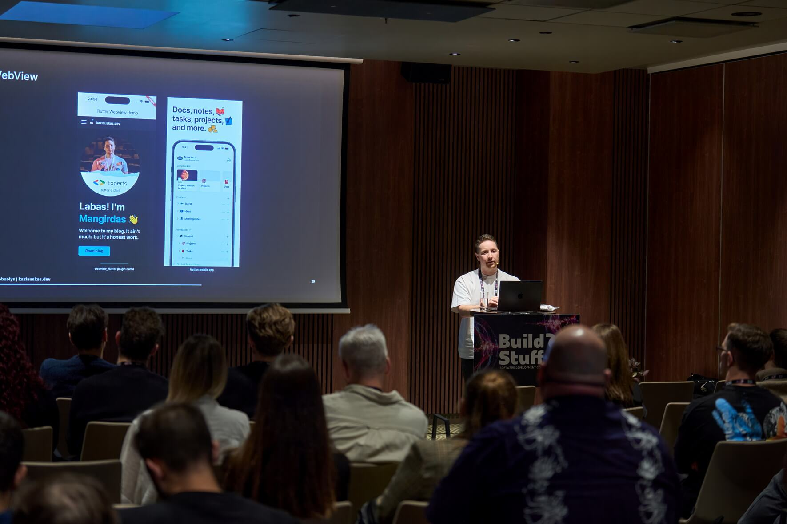

_Reflecting on my writing journey, motivation, and how 2025 changed the perspective._

Well, it's been a while... I cannot say I didn't have time or ideas for my blog throughout the year, but... Writing feels different now. Let me explain.

<!--truncate-->

## Choosing your canvas

Several years back, I gave an internal talk at my company. It was a talk about the history of our app and how we managed to build it pretty fast with a limited amount of resources. Also, at the end of the talk, I presented two demos that I built over the weekend on how we can completely rework the current app and rethink some of the main pain points. There were two outcomes here:

1. Instead of being stuck in the loop and focusing on the iterative improvements, sometimes it's healthy to look at your product from a little bit further. Maybe you are missing something big and obvious.
2. To fulfil the previous point, you need to find your _canvas_.

My canvas is Flutter. If I come up with an idea, it's a no-brainer for me to validate it by creating a new project, writing some code, and running the prototype on my phone in a few hours. It just clicks with me this way. For designers, that canvas could be Figma (quite a literal canvas, I would say), for the others - a piece of paper. I am not even talking about AI products, just these were not a thing back then.

Flutter is my creative canvas. However, I fancy another one - technical writing and blog posts.

## My canvas of reflection

Blogs and technical writing is my tool of reflection (thus, this post). When I struggle with a complex topic, I simply write. Usually to myself, since I delete most of these notes later. It's just a medium to understand and not necessarily sharing with a bigger audience.

Now, here is my checklist if I decide to convert my "notes" into a decent-enough-to-publish article:

1. Introduce some structure (sections, notes, resources).
2. If needed, prepare related code examples.
3. Create or find pictures, schemes, diagrams that benefit the article.
4. Have at least 7 mental breakdowns because I am writing in English for the reach, but also I tend not to find the right word to express myself however I want, and also what would people think if the text sounds non-native and has many grammar flaws, and what am I even trying to prove here, and is this really worth talking about since you can probably find the same info elsewhere.
5. Making sure that it aligns with the overall style of the blog, and polishing some tech details (keywords, headers, etc).

That's quite an effort if you may ask. And effort requires motivation.

## Motivation and how I lost it

OK, that may sound too dramatic. Let me be clear - I did not lose motivation to write, I simply lost motivation to publish. I strongly believe that AI has changed the scene of technical writing, period.

Let's take Medium, for instance. This is where I started my public writing journey. It's an awesome platform - you do not need to launch your personal blog website, the platform already has a lot of eyeballs eager for new content, your article gets a boost once added to any popular publication. Honestly, it was one of the first apps that I opened daily and studied anything Flutter. Once I faced a specific problem and found a related article on Medium, I knew that would be the only resource I needed.

Now, if you open the platform and try to search for something specific (not necessarily to solve a problem, just to learn), you will find a bunch of generic AI-generated content. Is it bad? I don't think so, as long as you do not need to cope with AI hallucinations. Otherwise, that would probably be a summarized version of what you are searching for - totally fair and enough in most cases.

Now, jump into the shoes of a technical writer. Step-by-step coding excercises and tutorials are losing the value - you can simply generate them wherever needed. Short tutorials - well, they simply get lost among all the AI-generated SEO-optimised semi-original similar content. Surprise suprise, most of such content are exactly what I write to myself in my notes when I am learning something. Thus, pushing them through the publishing checklist is not worth it anymore.

## What's next

As you may understand now, writing is MY canvas of reflection. And this is exactly how my blog will shift in the future - to share, to reflect, to celebrate. I will still educate, but maybe I will choose another canvas for that.
